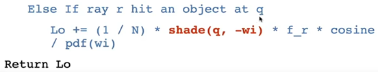

# GAMES101学习笔记

# 前言

这里的笔记原先是Excel形态，被复制到MarkDown中。

创建时间是2022年5月2日，最后一次修订是2022年9月11日。

观看体验不太好是真的，因为早期没有什么经验。。。

建议作为查找用的资料使用，想要知道什么，试试在这里面查找一下，说不定会有收获。

我之后会不定期继续修订这个笔记。

感谢闫令琪老师，真心的。🙏🏻🙏🏻

# 内容

| 问题                                                         | 说明                                                         |
| :----------------------------------------------------------- | ------------------------------------------------------------ |
| 实时渲染和离线渲染                                           | 游戏中，达到30FPS即每秒30帧渲染被称为实时渲染，30以下的称为离线渲染 |
| a上加^(a hat)                                                | 表示a的单位向量                                              |
| 观察变换补习                                                 | 1.什么是观察变化？在入门精要里提过，把世界空间转移到观察空间中的变换，就是观察变换。为什么需要观察变换？因为观察是一件十分相对的事情，只要相机和观察物体的相对位置和方向不变，那么无论二者在什么世界坐标下，观察到的结果都是一样的。所以为了下一步投影变换计算方便，就需要通过观察变换把坐标从世界坐标转移到观察坐标。联系生活，拍照需要确定相机的哪些信息？1.相机的位置，2.相机的观察方向，3.相机的顶方向，这些信息相同的话，对于同一个物体，所得的观察结果肯定是一样的。在观察坐标中，相机永远位于右手坐标系中的原点，Y轴方向为相机的UP方向，相机的视角永远朝向-Z方向。      2.具体怎么做呢？其实最先会把相机通过平移变换移动到原点，再通过旋转变换按顺序把观察方向g旋转到-z方向，再把相机的顶方向t旋转到y，再把g叉乘t得到的方向旋转到x，把得到的平移矩阵和旋转矩阵相乘，得到的就是观察变换矩阵。之后，需要把其他所有物体的世界坐标下的位置乘以观察矩阵，即把物体移到观察空间中，才可以生效。     3.在计算观察矩阵的旋转部分的时候，求从一个不规则的向量转到轴方向的变换矩阵比较复杂，所以可以利用数学知识简化这个过程。首先要知道旋转矩阵是正交矩阵，也就是说逆变换等于其转置，也就是说先左旋45度，再右旋45度即可恢复原状态。所以可以求从轴方向转到g、t、gXt的三个方向的变换矩阵，再求其逆矩阵（转置），即可得从g、t、gXt旋转到轴的变换矩阵。这样计算比较方便。 |
| 投影变换补习                                                 | 1.什么是投影变换？把观察空间的坐标转换到齐次裁剪空间中的变换，就是投影变换。为什么需要转换到裁剪空间？为了下一步裁剪方便。      2.先说下正交投影怎么做，首先是从相机输入六个数，分别代表相机的左右、上下、远近裁剪平面在对应轴上的值，对应了Unity中、相机在Scene中的那个观察盒子，通过这6个数就可以定义一个长方体。然后对这个长方体做变换，首先把长方体的中心（三个轴向上的中点位置）移动到原点位置，再把长方体通过缩放变换变成一个（-1，1）^3的正方体。这样的变换矩阵相乘，得到的就是投影变换的变换矩阵。      3.透视变换怎么做呢？透视变换的相机输入比较复杂，是一个四棱台，近平面较小。简单地来说，首先把远平面以远平面的中心为原点缩放，这需要一个透视投影到正交投影的变换矩阵。在这个处理阶段是不能单独仅对一个相机的裁剪平面做什么运算的，需要一个对四棱台每一个点都变换、且结果是将透视四棱台变成长方体的矩阵，推导过程十分复杂。得到变换矩阵后，再把变换后的长方体做一遍正交投影变成正方体，这两个变换矩阵相乘即可得到透视变换的变换矩阵。     4.上面说了正交投影的输入是6个数，用来定义一个长方体，那透视投影的输入是什么？其实很简单，输入仅仅是两个数，一个是长宽比，一个视角FOV，把相机安在原点，只需要这两个值就可以确定唯一的视锥。其他计算需要的比如远近平面的信息等，都是可以通过这两个值计算出来的。视角FOV是如何计算的？其实就是从原点向近平面的上下边的中线连线，得到的夹角就是（垂直）FOV。     5.FOV大的透视投影，想象一下，视锥的大小平面相差得会比较大，意味着远的东西会被变小得很厉害，而FOV较小，会比较接近正交投影的结果。 |
| 屏幕映射补习                                                 | 1.什么是屏幕映射？就是把原先的经过MVP矩阵变换的坐标对应到屏幕空间中，其值是分辨率中的某点。并不是指某个具体的像素。比如分辨率是1920*1080，屏幕映射就会把（-1，1）^3的坐标变成一个（（0~1920），（0~1080））的二维坐标，这里转换后的坐标是连续的，也就是说还是有小数的。在三角形遍历的时候才会变为离散的，单独的像素的坐标，它的z值会被保存到z-buffer中，用来做深度测试。     2.具体怎么做？在上面说的投影变换后，坐标被转换成了（-1，1）^3的空间中，在屏幕映射中不管z值，所以只需要xy方向的-1~1，把xy分别缩放到该轴分辨率的一半倍（因为-1~1长度是2），再用平移矩阵把矩形的左上角或左下角移到原点，这两个矩阵的乘积就是屏幕映射矩阵。     3.也被称作视口变换 |
| 关于三角形遍历的补充                                         | 1.具体是如何做的？从三角形设置传入数据，包含三角形信息。然后开始遍历这个三角形包围盒中的每一个像素，看它是否被这个三角形覆盖。这里利用向量的叉积来判断，首先让三个首尾链接的向量围成这个三角形，比如有三角形ABC、和三条边AB、BC和CA以及要判断的点P，若AB叉乘AP、BC叉乘BP和CA叉乘CP的Z轴得值都指向相同的方向，说明这个点在三条边的右侧或左侧，即可断定在三角形内。否则不在。对每个三角形都得这么来一遍。 |
| 关于反走样（抗锯齿）                                         | 1.涉及图像处理里学的东西。首先，走样的原因是采样的频率不够，跟不上图像的变化，采样得到的内容不足以还原原信号，就会出现走样的现象。信号是矢量，图像也可以理解为信号，比如x轴上像素的某一通道的变化。采样是光栅化的过程。     2.滤波就是把某一频段的信号删除、或者做特殊处理。如高通滤波、均值滤波等。      3.空间域下的卷积操作等于频率域下的点乘操作。比如对图像使用3X3的均值滤波、相当于把图像先傅里叶变换、再把变换后的图乘以3X3卷积核的图，得到的图再逆傅里叶变换即可得到空间域下相同的结果。      4.最原始的三角形遍历模型中，每个像素只采样一次，算出来被覆盖则打上图元的颜色，否则不。这是非常硬的，也会产生很重的锯齿。可以尝试使用多次采样，也就是提高采样率，这样得到的结果就不再只是0和1，可以是一些浮点数，比如每个像素在内部不同的地方采样4次，看它们在三角形内外的分布情况，则可在边缘处得到不那么硬的值。这种做法叫做多重采样抗锯齿（MSAA）。     5.FXAA、快速近似抗锯齿，这是一种后处理抗锯齿方法，和一些传统的完全不一样。这种后处理是先拿到渲染好的、有锯齿的图像，再通过算法检测出锯齿严重的边缘，再用锯齿不严重的取而代之。效果好、效率高，缺点是效果不如MSAA好。      6.TAA、（时间抗锯齿），与MSAA和SSAA类似，都是一个像素多次采样，但它不是同一帧多次采样，而是每帧一次或数次，通过好几帧来完成所有一个像素中不同位置的采样点的采样，获取数据的时候，会获取前几帧保留的信息来计算采样的得值。 |
| 区分着色频率和经验模型                                       | lambert、Phong之类的很容易混肴，它们其实甚至不属于同一类东西。     1.lambert、Phong等叫做光照模型，可能基于物理、也可能基于经验，总之就是一种算式、算法。     2.着色频率，也就是每都少个单位着色一次。常用的有：flat每个面着色一次、高洛德每个顶点着色一次，然后再每个片元插值。Phong每个片元着色一次。 |
| 顶点法线的计算方法                                           | 所有相邻面的法线的（加权）平均再归一化.这跟Unity的不一样，Unity中的Mesh每个点自带法线通道用来保存自己的法线方向，而片元的法线、面的法线都是平均或者插值出来的。 |
| 重心坐标和插值                                               | 入门精要的时候没有仔细思考插值的做法，现以顶点法线方向插值为例，做如下补充：      *：现引入重心坐标的概念，对于一个三角形内的任一点，它受三点的影响程度就是重心坐标维度的值。三角形的重心就是受三点影响相同的点，重心坐标为（0.33，0.33，0.33），三点影响程度的和为1。现规定abc为ABC三点的影响程度，计算出abc，就能用abc对ABC内三点保存的法线信息做加权平均，即三角形内一点插值后的得值。     1.如何计算abc？理论上是通过面积。假想一个三角形ABC，abc为三点的影响程度，现求三角形内一点P的abc。先将三点与P连接，得到三个新的三角形，把与自身不相连的三角形的面积/三角形总面积，即是这个点对P的影响程度。这样计算出ab、c可以通过1-a-b得到。工业中一般不用面积来算，一般用一些坐标系的知识来更快计算，这里用面积是方便理解。 |
| 关于纹素的误解                                               | 以前我以为采样得到的那个像素叫纹素，其实不是，其实纹理上的像素就叫纹素 |
| 纹理过滤模式具体是怎么做的？                                 | 在入门精要学了纹理有过滤模式，当纹理分辨率比较低，会导致多个像素采样到同一个纹素，导致成像硬，锯齿重。于是可以给纹理设置过滤模式，有双线性三线性等等。      具体是怎么做的呢？以双线性为例，输入uv坐标，然后取能包围它的最小正方体的2X2的4个纹素，然后综合考量这四个纹素来得到采样的返回结果。具体怎么综合考量？是通过插值来做的。比如我已经拿到了这四个纹素，且已知uv坐标，那么先对这个正方形的上下两行分别用uv的u来插值，得到两个新的颜色值，再用v对这两个新的颜色插值，即可得到双线性插值的结果。 |
| 关于纹理过大的解决方案     关于MipMap的具体实现方式     关于三线性插值 | 纹理过大时会导致严重的走样（采样频率跟不上信号变换频率以至于无法还原），也就是说纹理被缩小（渲染离相机特别远的物体）的时候，屏幕空间的一个像素对应一块十分大的纹理，如果仍用uv最近的那个像素作为颜色值，就会出现严重的走样问题，因为覆盖到的其他颜色都没有被考虑。      MipMap技术被用来解决部分这种问题，就是生成逐级分辨率缩小一半的贴图（不是单纯的缩小，缩小时综合周围四个纹素，取其均值，这样就可以快速查询方形区域内的像素的颜色的均值，而渲染远处物体的时候正需要这种技术）。给原贴图生成不同缩放级别的小贴图后，如何确定到底用哪一级呢？这样，在对这个屏幕像素采样的时候，顺便再对右边和上面的像素再采样一次，这样你就得到三个纹素了，你算右边和上面的两个纹素和自身纹素的距离，取更大的那一个作为边长L，然后以自身纹素为中心生成一个边长为L的正方形，这就是我要查询的区域。用L可以非常方便的得到在哪个级别采样比较好，首先，当我的采样范围刚好为1个像素的时候，是最理想的，那么其实log2  L就是最适合的级别。这样得到的分级是离散的，有时候会在渲染结果的分级处产生明显的边界，可以再用插值技术，把在本级和下一级再用log2  L的小数部分插值，即可得到连续的分级的结果。这种技术叫做三线性插值。这中技术只能查询方形区域内的均值，很多时候远处的像素对应的采样区域是奇形怪状的，这样使用MipMap就会综合太多纹素而得到比较模糊的结果，这是不好的。使用各向异性过滤技术可以稍微解决这个问题，当查询区域是竖直或水平的矩形时，效果比较好，各向异性查询技术与MipMap类似，但是其生成的是长宽分别平均的结果，比如会保存长宽分别缩放1X2、1X3、……的，这样会导致生成的RipMap体积较大，为原来的三倍。     在百人计划笔记中记录了，使用各向异性过滤技术在Unity中不会导致体积变大3倍，而还是大0.33，因为有精妙的算法可以用Mipmap计算出各向异性过滤的结果。 |
| 隐式（implicit）几何                                         | 有好几种表达方式，特点是不直观，无法直接看出表示的是什么物体，无法表达复杂曲面和曲线，无法立马得知哪些点在该平面上，但是储存十分方便，容易判断空间中的点与所表示几何的关系（在其内、在其上、在其内）。很像NP类问题，也就是验证较快类问题。也可以理解为矢量。以下列举一些表达方式：     1.用表达式：如圆，表示为X^2 + Y^2 + Z^2 =  1表示的就是一个圆，满足这个表达式的xyz必定在这个圆上。也可以理解为给定一个函数和期望值，当你的输入使函数的输出等于期望值的时候，输入的坐标在几何体上。     2.用布尔表达式（CSG - Constructive Solid  Geometry）。与传统美术软件的布尔一样，交、并、差操作可以对表达式使用，可以得到更加复杂的隐式几何。     3.使用距离函数（Distance  Function）。距离函数是一个函数，输入是空间中的点，输出是这个点到几何体的最小距离。适合用来做水滴融合这种东西，因为距离函数十分适合一个叫Blend的操作。     4.使用分形（Fractals）。类似一个递归函数，它的组成部分和它是一样的，像蜗牛壳那种。 |
| 显式（explicit）几何                                         | 也有好几种表达方式，特点是直观，可以直接看出是什么物体，可以表达复杂的曲面和曲线，可以立马得知哪些点在这个几何体上，但是不容易判断内外关系，且储存不容易，比较占空间。像P类问题，也就是求解较快类问题，也可以理解为标量。以下列举一些表达方式：     1.直接给出点集。      2.通过参数映射算出每个点的信息。本质也是给出所有点集，但是不是给出点的xyz，可能只给xy，再告诉你xy和z的关系，然后你能把z算出来。之前了解的一种叫做矢量置换贴图的技术，可以用平面的uv直接挤出一个蘑菇，和这样的显示几何是很像的。     3.点云。顾名思义，只有点的信息，而且是非常多的点。点本是不会被渲染出来的，但可以通过渲染器控制渲染出来。用的非常少。     4.多边形（Polygon Mesh）。使用三角面和四边面等组成几何体，得到广泛运用，在建模软件里几乎都是这种。 |
| 观察OBJ文件格式                                              | OBJ一般定义了一个模型，其实是一个文本文件，里面记录了模型的点的位置、uv、法线方向，还有三角面的信息，三角形信息是比如f  5/1/1 1/2/1/   4/3/1,每个小组代表一个点，每小组的第一个数字代表选择第几个顶点的位置，第二个数字代表是第几个uv，第三个数字代表选第几个法线方向。 |
| 贝塞尔曲线                                                   | 有起点、终点和若干控制点，贝塞尔曲线一定过起点和终点，且在起点和终点的方向一定朝向起点到第一个控制点和倒数第一个控制点和终点。      贝塞尔曲线如何绘制？对于任意从0~1的t，在每一段控制点的连线中用t对每一段线段插值，会得到线段数量的新点，再把新点逐个连接，再用t插值，又会得到更少的点。直到最后只剩下两个点，也就是一条线段，对其用t插值后得到的点，就是在t时，贝塞尔曲线所在的点。遍历0~1的每一处的t，得到的点连起来，就是一条完整的贝塞尔曲线。     贝塞尔曲线是一种显式几何，对应上面的第二种，给出控制点的信息，就能算出所有的点集。      贝塞尔曲线在仿射变换（移动、旋转、缩放）中可以得到良好的保存。也就是分别直接对曲线仿射变换和对控制点仿射变换再重画贝塞尔曲线，得到的结果相同。     贝塞尔曲线具有凸包性，也就是说贝塞尔曲线一定会被包含在控制点的凸包中，凸包就是包含所有控制点的最小凸多边形。 |
| 分段贝塞尔曲线                                               | 面向工业化使用的曲线，PS、Houdini里默认的曲线都是分段贝塞尔曲线，因为更易控制，更直观。就是说每定的一个点都作为起点和终点使用，而那个把手，作为控制点使用，每一段贝塞尔曲线是4个控制点，内含起点和终点。 |
| 贝塞尔曲面                                                   | 先做纵向或横向的一排或一列点的贝塞尔曲线，再换一个轴向，对四条贝塞尔曲线的统一地方采样，得到的四个点再次做贝塞尔曲线，即可得到贝塞尔曲面。 |
| 曲面细分                                                     | 和建模软件里的细分一样，会导致模型收缩，变得光滑，产生更多面。     介绍两种曲面细分的具体方法：     1.Loop Subdivision. 只能对仅有三角面的模型使用。  细分时，给每个三角形的每条边的中点处加点，然后把三条边的中点两两相连，从而把一个三角形分成四个三角形。光加点加线是不够的，每个点都需要相应的移动位置。这里对老点和新加点的处理方法是不同的，对于新点，它必然处于两个三角面的共用边上，那么新点的位置为这两个三角形的四个顶点（因为共用一条边，组成了一个四边形，所以是四个点）的位置的加权平均。对于老点比较复杂，老点一般是多个三角面的公用顶点，总体来说，老点的位置为自身位置和其所组成的所有三角面的其他顶点的位置的加权平均，其中的权值受到这个点的度（degree，和数据结构里的图的节点的度是一个概念，即这个点参与了几条边的组成）的影响。     2.Ctamull-Clark Subdivision.  无所谓多边形的类型，三角面和四边面都可以使用。细分时，给每个面的每个边的中点处加点，再给每个面的中点处加点，然后把每条边的中点连接到面的中点。这样加点后，所有的非四边面都会转化成四边面，并且转化了多少个非四边面，就会多出多少个奇异点（奇异点是这个细分里的特有概念，即度不等于4的点），可以记忆为、经过一次细分后，非四边面会被转换为奇异点。点的位置如何更新呢？这个细分的点更新有三类，第一类是加在面中心的新点，这类点的新位置为组成这个面的若干个点的直接平均，第二类为边的中点处的新点，这类点的新位置为其所在边的两个顶点和其所在边组成的两个面的中心的所加新点的位置的直接平均。 |
| 曲面简化                                                     | 和建模软件里的曲面简化一样，会使模型变得更加棱角分明但是面数更少。     介绍一种曲面简化的具体方法：      边坍缩：把一条边的两个顶点捏成一个，其所连接的其他线也会受到影响。不能随便逮一条边就坍缩，因为有一些线是很重要的，坍缩了非常影响形体，而有一些坍缩了影响就不那么大。如何选择要坍缩的边？通过计算边坍缩的二次误差度量即可，如何计算？首先假设我要坍缩这条边，坍缩后的点会出现在某个位置，这个位置到坍缩前这条线所在的所有平面的距离的平方和，就是二次误差度量，寻求最小二次误差度量是一个优化的过程，意味着要不停去试，直到程序找到这个点应该出现的位置，也就是二次误差度量最小的位置。遍历所有边，保存它们的最小的二次误差度量。随后对二次误差度量排序，把最小的边坍缩。坍缩后会影响到这条边相连的其他边，所以这些边的二次误差度量需要重新计算。这很复杂，可以利用堆（数据结构）来做这一件事。然后一直去坍缩排序后最小的边，直到达到目标的面数停止即可。 |
| 软阴影                                                       | 当光源是点光源的时候，是无法产生软阴影的，只有当光源有体积（建模软件也常用面表示）的时候，才会产生软阴影（对于渲染来说是如此，但显示世界光会衍射，肯定会是软阴影）。具体是如何产生的？当观察点完全不可见光源时，产生的是硬的、100%  的阴影，当部分可见时，产生的是软阴影，当全部可见，无阴影。软阴影是更加真实的阴影渲染。 |
| 光线追踪概述（以Whitted-Style为例）                          | 从摄像机到屏幕某个像素连线，得到的方向视作一条“感知光线”，让其投射到场景中，遇到表面根据表面的法线和材质进行反射、折射和衰减，经过数次弹射后，把每一次反射的点与光源连接，再检测其与光源的连线是否会被其他物体遮挡，若是表示其在阴影下，否则表示可以直接被光源照射到。把各个反射点得到的信息累加到这个像素中，即可得到最终的这个像素的颜色值。 |
| 关于求光线弹射点的前瞻                                       | 上面的概述里，求光线与场景的交点是必不可少的过程，那么如何得到感知光线和场景的交点？首先对于隐式几何，比如球：X^2  + Y^2 + Z^2 = 1和光线R = O +  t*V（射线的定义，起点加时间*速度）；当xyz满足这两个式子，就可以说这个xyz既在球上又在射线上，再判断一下远近，即可得到反射点。但是对于现在更常用的显式几何，比如三角面形成的球，求交点就相较复杂。首先，对于显式几何的球，需要用光线对每一个三角面判断，看是否碰撞，具体如何判断？这里使用的是三角形的重心坐标。之前学顶点到片元的插值的时候，了解过重心坐标，即三个顶点对与这个三角形所在平面的任一点的影响程度。重心坐标是用点对面的小三角形的面积和三角面的面积的比值得到的。于是可以得知，当点在三角面内，三个重心坐标的和必然为1，但是当其在三角面外，小三角形的面积和超过原三角形的面积，导致重心坐标和超过1。于是用重心坐标和  = 1 和射线R = O + t*V这两个表达式，即可用方程算出重心坐标。然后再看和是否等于1即可判断点是否在三角面内。 |
| 关于光线弹射的优化之一                                       | 上面提到了求光线弹射点的方法，但是、对于每一个光线，每一次弹射都要对每一个三角面做判断，时间开销是无法接受的，于是出现了许多优化的方法，这里说第一种：      使用碰撞盒。这里的碰撞盒和unity的物理碰撞盒不同，这里说的是空间内的一块区域，使用三组面对面的与坐标轴垂直的面组成（也就是不允许在空间内旋转，是为了方便计算）。当光线连碰撞盒都创不到的时候，就可以忽略这个物体了。那如何计算光线是否能和碰撞盒创到？是这样：首先对三组面分别计算光线的进出的t（在R  = O + t*V的定义中，用光线的定义方式和面的定义方式和两个面求交，可以算出和这组面相交的两个t，注意，t可能解出负数，就是说如果时间倒流，我还是能射到这个东西的，奈何时间不能倒流。），对于三组面的进出的t，取最大的进入t和最小的离开t，这个区间内的t就是光线在碰撞盒内的t。因为当三组面都进入后，才说明光线进入了盒子，而只要出了任何一组面，就表示离开了这个盒子。得到盒内区间t后，对进入t和离开t两个t做判断（因为可能为负），最终，当且仅当满足：进入t小于离开t，并且离开t  >= 0的时候，说明创到了碰撞盒。进入t是可能并且可以小于0的，当观察光线的起点在碰撞盒内部的时候，就会出现这种情况。     这种包围盒称为AABB（Axis-Aligned Bounding Box ； 轴对齐包围盒） |
| 关于光线弹射的优化之二                                       | 上面提到的使用AABB的方法看似很美好，但其实非常难实现。首当其冲的问题：如何划分出包围盒？你可能会想为什么不根据三角面的分布，给单独的每一个物体打包围盒呢？呃，这种方法的泛用性太低了，比如由占据屏幕一半的大物体，每次都要判断大物体的每个面，基本就没优化到什么。所以这里先说一种优化方法，使用Uniform  Spatial  Partition（Grids）、均匀空间划分法，即把空间划分成均匀的立方体，具体多大会有其他的算法来算。然后判断每个格子里是否有物体，当光线经过有物体的盒子，就把光线拿去和这个包围盒里的物体求交，若有交点则进入下一个阶段，若没有交点则继续传播光线。     这种方法极度不稳定而且比较慢，并没有用于工业中。 |
| 关于光线弹射的优化之三                                       | 之二中提到的均匀空间划分法存在无法接受的缺点，于是有了其他的加速方法：空间划分法。顾名思义，就是把空间划成多块，每块作为一个轴对齐包围盒。     这里介绍三种空间划分的方式：     1.Oct-Tree（八叉树）：  与之二提到的非常像，首先对空间横一刀竖一刀前一刀（平分），切出八个一样大的空间，然后判断捡出内部图元数量已经少到规定数量的空间，就不再继续切它了。然后再把剩下的按这个方法继续切，直到全部满足满足条件。这里是用树的数据结构来保存图元，切后、把父节点往下伸出八叉，最后达到条件的都是叶子节点，然后最终把空间内的图元存到叶子节点中。这里涉及图元的复制，因为一个图元可能在多个块中，所以这多个块都得保存这个图元，比较浪费空间；而且会有切割比例的问题，只从中间切，那如果场景比较长、或者比较宽，那么最后切出来的单个空间也会很长或很宽，导致包围效率不好。      2.KD-Tree（k维树）：与上面提到的基本一致，但是它一次只砍一刀，所有维度轮着来，比如第一次砍xy平面、第二次砍yz、第三次砍zx这样，每次把目标砍成两份，这里每次砍出来的新的两份都需要砍，所以最终得到的是满二叉树。而且它不是从中间砍的，具体从哪里砍，似乎需要更加深奥的算法决定。这么做的好处是可以分得比较少块，也方便查找，但是仍然无法避免节点中得存多个一样得图元的问题，也无法避免长条形空间的问题。     3.BSP-Tree：用得很少，与1基本一致，但是是斜着砍，效率不太行。 |
| 关于光线弹射的优化之四                                       | 之三提到的空间划分有很多无法接受的缺点，于是有了新的划分方法：Bounding  Volume Hierarchy（BVH、包围盒层次）。      具体如何分？其思想借鉴了KD-Tree，但它不是划分空间，而是划分物体。首先对于空间内的所有物体，从包围盒最长的轴划分，把物体分（三角面）成两堆，选取三角面在该轴的位置的中位数划分（也就是说，分出来的两堆仅由位置分布决定，并不保证分出来的两堆数量一致），然后再给两堆物体生成新的包围盒，同时在树里伸出两叉，之后继续找最长的轴划分开，继续延伸树，直到分出的堆内的三角面的数量降到规定以下，则产生一个叶子节点。这种情况下的产生的包围盒可能互相相交，但是不影响运算结果。     这个方法得到广泛应用，其不会重复记录图元，也比较快。 |
| 辐射度量学基础-变量                                          | 什么是辐射度量学？就是把光、辐射以物理和数学的方式表达出来的学科。作为和光密不可分的渲染，必须了解辐射度量学。     首先需要理解一些变量和他们之间的关系：     1.Radiant  flux（power）：辐射通量。用来描述单位时间内，光源辐射出的能量的数量。辐射通量的定义可以简单地写成（辐射总能量）/（时间），得到的单位就是J/s也就是瓦特。如果在热力学，可以写作瓦特，但是在辐射度量学，我们把它称为lumen（lm、流明）     2.Radiant Intensity：辐射强度。用来描述，单位立体角内，光源的辐射通量。可以简单地写成（辐射通量）/（立体角的大小），得到的单位就是lm/sr  （这里的sr是立体角的单位），也可以写成cd（坎）或者candela（坎德拉）      3.Irradiance：辐照度，用来描述单位面积内的辐射通量。可以简单地写成（辐射通量）/（面积）。可以用来描述接受光照的一个面，在微小面积内接受的辐射通量，单位是lm/m^2，也可以写成lux（勒克斯）。这里的辐射通量并不是简单的辐射通量，而是必须是垂直于这个面的辐射才可以，若是不垂直的，则需要投影到垂直方向，因为自然定律就是这样的。说到这个投影，也就是*Cos  ɵ，和兰伯特漫反射关照模型的一样，也就是说光线和表面法线夹角越大，漫反射越弱。地球的四季也是如此，冷热不取决于远近、而是是否直射。光照之所以会随着传播衰减，也是这个原因，当物体远离光源，辐射通量变小，所以变暗。      4.radiance：（辐射度（无正式译名）），用来描述单位体积角内的辐照度、或者单位面积内的辐射强度、或者单位面积上、某个单位立体角上的辐射通量。可以用（辐射通量）/（（面积）*（立体角））简单表示，单位是：W/（sr  * m^2） 也可以写成：cd/m^2、lm/(sr * m^2)、nit（尼特）。这里有积分关系。比如把辐射度按照面积积分、就能得到辐射强度；把辐射度按照立体角积分，就能得到辐照度，这个非常常用，BRDF做的就是这个事情。 |
| 关于立体角                                                   | 在弧度制中，二维的角度被定义为这个角对应的弧长/这个圆的半径。立体角的定义与其类似，是一种引申。立体角被定义为：在球体中，一个立体角对应的球上的面积除以球的半径的平方。单位是sr，但其实是一个虚单位，没有实际意义，只用来表示他是一个角度。通过这个定义，可以得知，对于一个全方位覆盖的立体角，它的大小是4PIsr。 |
| 对于BRDF的深入学习                                           | BRDF、即双向反射分布函数，学习辐射度量学后，能对其有一个更深的理解。      既然是函数，那么先搞清楚它的输入和输出；输入入射光的方向、点的辐照度和观测方向，输出在观测方向上有多少比例的能量分布。不同的材质或者不同的渲染方式都有不同的BRDF，它更像是一种人为指定的预设，控制光如何与物体表面作用，以达到不同的反射效果。 |
| 反射方程                                                     | 从BRDF引出的概念。BRDF定义了入射光在某个指定方向的出射光的情况，那么反射方程的意思就是：把表面半球的入射光经过BRDF以同一观测方向计算后再积分，得到的就是观测方向的这个点应该的渲染结果。     公式如下图 |
|                                                              |                              |
|                                                              | Lr（p，wr）指的是微小平面（点）P处，在wr也就是观测方向处的辐射度，这是需要计算的结果，用来考量最终像素的颜色。     Fr函数指的是BRDF，你输入表面信息、入射和观测方向，我BRDF告诉你在这个出射方向分布多少辐射度。     Li项在P处在wi方向上的辐射度     Cos项指的是上面说的直射与斜射的影响     dwi指的是对每一个入射方向积分，因为不只有普通光源，还需要考虑全局光照。 |
| 渲染方程                                                     | 从反射方程引出的概念。反射方程没有考虑自发光，把积分结果加上自发光的影响，就是所谓的渲染方程。 |
|                                                              |                              |
|                                                              | 基本一致，仅加上了自发光的影响，其中，反射方程的Cos项可以用n*wi代替，在二者都是单位向量的情况下 |
| 如何解渲染方程？                                             | 对于以上渲染方程，要显示的是Lo项，但是等式右边的Li项也无法得知（对于明确的主光源可以得知，但是对于全局关照无法得知）。那如何解出Lo呢？ |
|                                                              |                              |
|                                                              | 把方程化简，已知项合并，再定义积分操作符，最终可以简化成L  = E + KL的形式。再通过小学数学移项解方程，再通过我无法理解的泰勒展开，最终可以得到以下式子 |
|                                                              |                              |
|                                                              | 对于最后的这个式子，解读是：要输出的L  等于自发光加上一次反射的总能量加上二次反射的总能量加上一直往后。当然，程序是不可能无限算的，要人为指定计算几次光线弹射。如果视为无限次迭代，最终输出颜色值会收敛到一个值。     我们亲爱的传统光栅化只能做到E + KE的部分，也就是自发光加上第一次弹射的部分。 |
| 蒙特卡洛积分                                                 | 为路径追踪做知识准备。      积分就是求指定范围内函数图像和X轴围成的面积，这是定积分。如果不指定范围，要你通过表达式表示积分的结果的函数就是不定积分。蒙特卡洛积分是从定积分出发的，我想求一个范围内的定积分，怎么办呢？     如果原函数极复杂，那么求不定积分是极其困难的。我不想求，计算机也不想求，所以可以采取近似的方式。在复杂函数f（x）中，我想求其满足概率分布x =  F（X）的定积分，积分范围就是F（X）的范围。可以如此：     我已知积分范围，已知要积分的函数，我在积分范围内随机采样一点，以此点的y表示整个f（x），然后之间通过此时的x *  y来当成积分值。但是只采样一次很可能造成很大的误差，随着采样次数的增加，我再把采样的结果们做平均，算出来的积分就会越来越接近期望值，也就是真正的积分值，这就是蒙特卡洛积分的思想，公式如下： |
|                                                              |                              |
| 路径追踪                                                     | 在Whitted-Style的光线追踪中，物体只区分漫反射、镜面反射和透射。当光线打到漫反射表面。光线就不再继续反弹。这会导致无法体现间接光照，也无法体现Glossy材质（类似磨砂金属水壶的材质）的正确效果。为了解决Whitted-Style光线追踪的问题，提出了路径追踪，其本质是一种改良，核心思想和光线追踪是一样的，从观察点到像素连线作为“感知光线”，再根据反弹的结果决定最终的像素的颜色值。     1.渲染方程是正确的，客观的，路径追踪基于渲染方程来展开。首先需要对直接光照和间接光照区分，这里先说直接光照部分。渲染方程除开自发光的部分，剩下的就是一个法线半球的积分，这个积分可以用蒙特卡洛积分来近似表示。在蒙特卡洛积分中，fx代表的就是渲染方程的积分内的函数，而px代表的就是法线半球采样的分布函数，我们先使用均匀的采样，也就是每个立体角的概率相同，可以理解为随机向半球内一个方向采样，看这个方向能否击中光源。在均匀采样时，p（x）函数返回一个常数，360度的体积角为4PIsr，而我只在表面半球内分布，则每单位的体积角的概率为1/（2PI）单位是（1/sr）没有什么特别的含义，蒙特卡洛积分中的N代表采样次数，次数越多越接近期望值，一般来说需要N为一个比较大的次数才能较好地接近渲染方程中的积分的值。     把渲染方程的自发光部分先忽视，再把后面的积分部分用蒙特卡洛积分表示，即可得到以下的方程和伪代码： |
|                                                              |                              |
|                                                              | 2.再来看间接光照的部分。如果在1中的随机的法线半球的采样方向打中的不是光源，而是表面，则假设采样方向是观测方向，去算被击中的物体的直接光照。这形成了一个递归，伪代码如下，仅在If后加一种可能，且增加Return： |
|                                                              |                              |
|                                                              | 3.1和2中描述的算法有很大的问题，以下我们来进行问题的排查。首先，这个递归的数量级非常的恐怖，“感知光线”第一次击中物体时，就会产生N根新的光线，打中光源还好说，若是打中别的物体，又会产生新的N根光线，是一个指数级别的增长，这显然时不行的。那如何解决这个问题？      这个指数的计算是不可避免的，那么只能从被乘方的数下手，也就是说N只能等于1，每次半球采样只取随机的一个方向。直接这么来非常蠢，只随机一次很难模拟原积分的结果，那怎么办？别急，没人规定每个像素只发射一次感知光线，只要把每个像素的发射次数增加，也能得到准确的效果。这个发射的感知光线的次数称为SPP（samples  per pixel、每个像素的采样次数）。伪代码如下： |
|                                                              |                              |
|                                                              | 稍微分析一下，可以看到已经没有ForEach了，只判断一次采样的结果。     这也是路径追踪和光线追踪的区别的根本之处。如果N > 1则说是光线追踪，N = 1就是路径追踪 |
|                                                              | 4.还有一个致命的问题，这个递归如果在复杂场景里不停的在物体间漫反射，根本停不下来，那算到死也算不出来，所以如何在能限定反弹次数的同时保证估计的结果可靠，也是一门学问。目前工业上的解决方法是使用RR算法（Russian  Roulette、俄罗斯轮盘赌算法）。具体如何运作？就是给定一个击毙概率，在光线被产生的时候以此概率判定，若中了则删除这条光线，视作死亡。那拿到的能量不就少了吗？确实，所以需要补正。你知道毙了多少，就知道萎缩了多少，所以只要给算出来的出射的辐射度除以这个存活概率即可（小学学的，对应的量除以对应的率即可得总体）。通过存活概率的值，可以计算出光线弹射的次数的期望值。伪代码如下： |
|                                                              |                              |
|                                                              | 5.还有一个效率问题。你知道，如果光源很小，你的采样次数得很大才能比较容易地打中光源，大部分随机采样的光线要么打中其他的物体拿去做间接光照、要么就再也没用了，很浪费，导致渲染慢，于是有了一种办法可以减少这方面的浪费。就是把直接光照和间接光照的计算分开，在计算直接光照的时候，对光源采样而不是对法线半球的方向采样，这里涉及极其复杂的数学变换，我目前无法理解。不过我会尽量说清楚，伪代码如下： |
|                                                              |                              |
|                                                              | 分析一下，这里明显把直接光照和间接光照分开来计算了，间接光照部分与之前的基本一致。直接光照部分是直接从光源采样的结果。这里光源的面积是A，所以每单位面积的可能性是1/A。这里没有递归计算所以不用俄罗斯轮盘赌的算法。其他就是复杂的数学变换了。 |
|                                                              | 6.最后，在直接光照的部分还有一个遮挡问题。如果使用光源采样的话，就失去了碰撞到光源这个判断，那么如果物体和光源之间有物体遮挡，则无法正常地渲染遮挡的效果。此时还需要进一步对从光源发出的采样方向检测一下是否有别的物体遮挡。 |
|                                                              | 7.至此，已经基本可以得到准确的渲染结果，与真实的照片基本无异！😺😺😺😺 |
| 关于路径追踪的其他问题的补充                                 | 1.无法应付点光源。点光源无法判定被击中，用别的类似的有体积的光源代替。      2.pdf、也就是概率分布函数。在上面的讲解里用的都是平均的概率分布，也就是在不同的方向概率一致。这样的pdf不一定是最优的，目前工业界仍然在探索更合适、更高效的pdf。      3.最后拿到的Lo（注意，不是L零，是Lo，代表Lout），也就是观测方向的反射光线的辐射度，并不是什么颜色或者亮度，仅是辐射度，要拿到具体的颜色需要进一步的计算，把辐射度映射到颜色空间中，比如要做伽马矫正等等。 |
| 材质在图形学中，到底是什么                                   | 渲染方程是严格正确的，那么在渲染方程中一定有一块是受材质影响、代表材质的。没错BRDF就是材质，决定光线如何与物体表面作用，可不就是材质嘛。 |
| 反射方向计算公式                                             | Wo  = -Wi + 2*(Wi.*N).*N     Wo是出射方向，Wi是入射方向，N是法线方向。     我曾经在完美世界的笔试中碰到了这一题，但是我不记得这个公式了。推导的难度不高，但是我最终没有写成这个形式，估计是不能过关了。 |
| 折射方向计算公式                                             | Ni  * Sin i = Nt * Sin t     Ni 和 Nt对应入射和出射的材质的折射率。Sin中的i和t对应入射光线和折射光线与法线的夹角。 |
| BTDF 和 BSDF                                                 | BRDF中的R代表的是反射，如果是计算折射的函数，应该叫BTDF。折射和反射可以统称为散射（scattering），所以统称了折射和反射的函数应该叫BSDF。但是目前业内不太分这个东西。 |
| 深入一点学习菲涅尔效应                                       | 菲涅尔效应是什么我已经很清楚了，但是仍有一些知识盲区。     1.菲涅尔效应是普遍存在的，并不是只有能观察到折射的材质才会有。      2.导体和绝缘体的菲涅尔效应有很大的区别。导体即使在垂直的时候取观察、也会得到很强的反射，只有近10%的能量会折射。镜子是通过镀银制作的，就是这个原因。     3.在PBR流程的F的计算中涉及F0这个量，代表的就是多少比例的能量会被反射。     4.这个F0，也就是菲涅尔的程度，是可以通过折射率计算的，公式见PBR的F0处。     5.在入门精要中直接指定了这个F0，而不是根据真实材质计算。（毕竟不是基于物理的渲染）      6.在现在最常用的金属粗糙度的pbr工作流中，也直接指定了这个F0为0.04，可能比较普适。若是镜面反射光滑度工作流，在镜面反射的rgb通道中，会保存这个F0的值，没错，F0是三维向量，分别代表红绿蓝三原色的反射。 |
| 前向运动学和逆向运动学                                       | 在制作动画时，涉及骨骼的运动学，即艺术家控制骨骼，骨骼控制模型。前向运动学（forward  kinematic）指的是给定关节间的夹角，然后计算机算出各节骨骼和点的位置。而逆向运动学（inverse  kinematic/IK）是前向运动学的改良，是为了方便艺术家控制和创作而产生的技术，艺术家直接指定控制点的位置，然后计算机根据控制点位置补出所有骨骼和点的位置。计算量大，可能出现多解和无解的情况，但是目前已经得到了较好的优化。 |