# GAMES202学习笔记

# 前言

这里的笔记原先是Excel形态，被复制到MarkDown中。

创建时间是2022年6月17日，最后一次修订是2022年9月12日。

观看体验不太好是真的，因为早期没有什么经验。。。

建议作为查找用的资料使用，想要知道什么，试试在这里面查找一下，说不定会有收获。

我之后会不定期继续修订这个笔记。

感谢闫令琪老师，真心的。🙏🏻🙏🏻

# 内容

| 问题                                                         | 解答                                                         |
| ------------------------------------------------------------ | ------------------------------------------------------------ |
| 着色器语言/Shading Languages                                 | 有很多种，现在常用的有：英伟达NVIDIA的Cg(C  for Graphics)语言、微软Microsoft的HLSL（High Level Shadings  Language/高级着色器语言（面向对象））、OpenGL的GLSL(OpenGL Shading Language)（C风格、面向过程） |
| 简单学习OpenGL                                               | OpenGL是课程作业种使用的语言、必须做简单学习和实践。在入门精要中了解了UnityShader的写法，这里做一个类比学习： |
|                                                              | 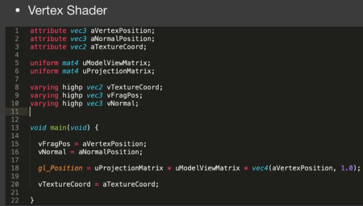                             |
|                                                              | 以上是最简单的顶点着色器的代码：      1.attribute关键字后跟的是变量类型和变量名，以第一行为例，这里是声明需要使用叫这个名字的三维向量。这个变量不是凭空产生的，而是在更早期的VBO设计中分配好的。和UnityShader做类比，就是在这里定义a2v的内容，很容易吧。attribute关键字后跟的永远是顶点的属性，定义片元的属性不用这个。     2.varying关键字后跟的也是变量类型和变量名（highp指的是高精度），和UnityShader做类比，就是在这里定义v2f的内容，很容易吧。说一下之前没有思考过的点，为什么要v2f这些内容？因为这些信息是需要在三角形遍历的时候插值的，需要在下一个阶段使用，所以必须在这里传递这些信息。这段代码里就传递了顶点的uv坐标、位置和法线，这些都是需要插值产生的。      3.中间的uniform和上面类似，不过声明的是全局变量，就是本次渲染中会统一使用的变量，比如这里声明的就是模型视角变换矩阵和投影变换矩阵。在UnityShader中，这些全局变量经常直接用宏表示。     4.main函数就是UnityShader中的顶点着色器的函数，形式上有一点点不一样。不用返回v2f了，因为这里声明了varying变量。这里也就做了最基本的任务，把顶点用MVP矩阵移动到屏幕坐标系下，用gl_Position关键字代表要输出的顶点的裁剪坐标系下的位置。其他的代码就是在简单地给要传递地值赋值。 |
|                                                              | 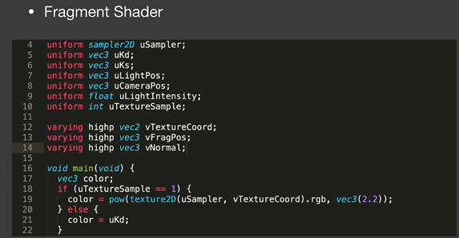                             |
|                                                              | 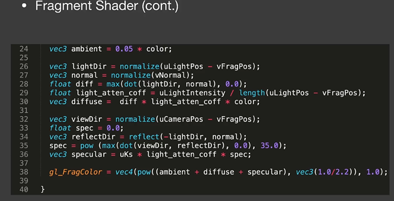                             |
|                                                              | 以上是最简单的片元着色器的代码：     1.uniform同上，UnityShader中不用这么声明，而是直接用宏调用，比如主光源的位置等等。     2.varying的变量和顶点着色器中传递的严格一致，这里拿到的是已经插值后的该片元该有的值。     3.main同UnityShader的片元着色器函数，这是一个计算了Phong模型的简单Shader。     4.最后返回和Unity一样，返回一个4维的颜色值即可。 |
| 传统阴影映射存在的问题                                       | 在入门精要中讲了一种阴影映射的思路，大概就是先把摄像机移到点光源处，然后渲染一张灯光坐标系下的深度图，第二次正式渲染时，把片元转到灯光坐标系下和深度图比较深度，若比记录的还深说明在阴影中。看似美好，实则漏洞百出，这里说一下传统点光源阴影隐射存在的几个问题：     1.自遮挡现象/self occlusion。 |
|                                                              | 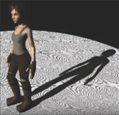                             |
|                                                              | 看上图，这里地板上出现的纹路就是自遮挡现象。为什么会这样？因为你想、第一遍渲染深度图的时候，深度图是有分辨率的，相当于以分辨率对场景的深度采样，一旦光源远了，一个物体在深度图中的采样次数就很低，深度图就只能用一个很粗的值来概括一整块区域的深度，比如这里的地面，我在渲这个像素的时候，它就很可能因为深度图中的分辨率低和前一个像素带上了相同的深度，然而在第二遍时，在正常渲染时一般分辨率会高一点，导致新的算出来的深度比原来远一点点，就会被判断为阴影中，从而产生自遮挡现象。这个问题在光源和被渲染平面相对平行一点的时候尤其明显。      为了解决这个问题，可以增加一个容忍值，即表示我比深度图记录深度浅一点点的时候，我也可以判断它不在阴影下，并且这个容忍值也会受到光源和平面的夹角的影响，当相对垂直时不需要容忍，因为这样一半不会出现自遮挡的问题。而相对平行时需要较大容忍值。这个容忍值比较难定，大了阴影会断，如下图，小了解决不了自遮挡的问题。 |
|                                                              | 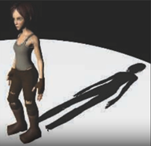                             |
|                                                              | 为了解决这个问题，学术界有一个方法：Second-depth  shadow  mapping/次深度阴影映射。大概思路是，第一遍渲染深度图时，不仅保存最深的深度，还保存次深度，最终用于判断的深度取二者的中点。看似美好，但开销有点大，没有被使用在工业届。 |
|                                                              | 2.锯齿严重。自己玩游戏也体验过，阴影的锯齿往往很重。这也是深度图分辨率导致的，但又不能无限放大深度图的分辨率，所以这是一个长期存在的问题，需要后续的技术解决。 |
| 为何阴影映射可以脱离光照渲染来做？                           | 这其中有非常深奥的数学理论，首先来看一个近似等式：           |
|                                                              | 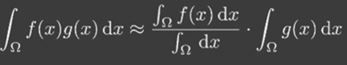                             |
|                                                              | 意思是：函数的乘积的积分约等于拆开积分的乘积，但f（x）需要除以积分域（那个分母需要其他的复杂计算，目前无法参透,可以先粗略地理解为是积分域、常数）。     在积分域很小、或者g（x）相较平滑（指变化不剧烈）的时候，这个不等式比较准。     为什么需要这个不等式？看以下包含了阴影计算的接软件方程，其中V项代表阴影计算： |
|                                                              | 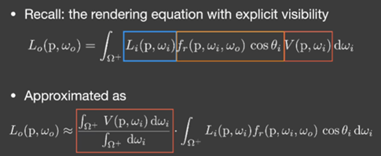                             |
|                                                              | 思考一下，V项的积分域是某个立体角内的某个微小区域的辐射强度，确实比较小，而且这里对应的g（x）中、L和BRDF在计算直接光源时，确实比较平滑，两个条件都满足，所以可以把它拆开来计算。其实这个不等式只需要满足一个条件即可比较接近真实结果。 |
| Percentage Closer Filtering/PCF/百分比接近滤波/阴影的抗锯齿方法 | 上面提到传统阴影映射有无法容忍的锯齿重的问题，那么自然有人会去研发阴影的抗锯齿方法，PCF就是一种。请先回顾在就光栅化的时候的反走样方法，如MSAA，是不是可以用类似的方法，在渲染点对周围一个范围内采样、来得到不是非0即1的值呢？答案时肯定的，利用卷积，可以统计范围内的值，得到的0~1的中间值就可以视作阴影的强度，就可以得到不那么硬的阴影边缘了，也就达到了一定的抗锯齿的目的。注意，这里的卷积并不是像高斯模糊那种卷积，是这样：比如统计5X5范围内的覆盖情况，有10各被覆盖，15个未被覆盖，则认为是40%硬度的阴影。      详细来说，就是在正常ShadowMapping的过程中，判断渲染点在不在阴影下的时候，如果只对渲染出来的阴影深度纹理渲染一次，那么只能得到非0即1的值，表示是否在阴影下，但PCF可以多次对阴影深度纹理采样，综合多个非0即1的值，即可得到柔然的、0~1之间的值。 |
| Percentage Closer Soft Shadows/PCSS/百分比接近的软阴影方法   | 三次元往往是体积光源，并不存在真正的点光源，而有体积就有软阴影，于是就有了软阴影的计算方法。思路基于PCF，你想，卷积核越大，是不是阴影越模糊？这不就是人们想要的吗。但是三次元的阴影还有一个特性，遮挡物与投影平面越近、阴影越硬，反之越软，这说明我们必须根据遮挡物和投影平面动态地调节卷积核的大小，于是PCSS大概可以分为三步，1.Blocker  Serch，就是找到在阴影深度图中，遮挡物（比我还深的不算），的平均深度。2.根据算出来的blocker决定做PCF的时候我的卷积核要多大。3.PCF。那么如何计算？看下图： |
|                                                              | 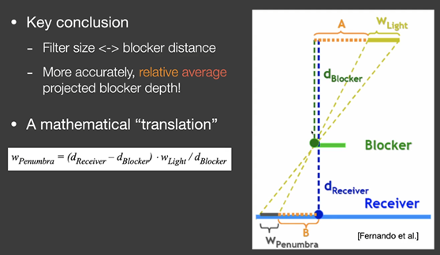                             |
|                                                              | 这里的w就是我们要计算的卷积核的大小的参考系数，思路是利用相似三角形，图中两个黄色的相似三角形即是物体、面光源和投影平面组成的，计算w的推导公式如上图，比较简单。在渲染阴影中的一个点的时候，我怎么拿到需要的变量呢？其实不用严格参照上面这个算法，先用传统的ShadowMapping得到深度图、到第二次渲染的时候，若判断这个点在阴影内，则再对ShadowMap以一个范围采样，得到一个平均深度、然后再拿这个平均深度和渲染点的深度相减，即是投影物到渲染点的距离，再转换成这个渲染点的该有的卷积核的大小。得到该有的卷积核的大小后，就可以直接用PCF来做软阴影了。      这里涉及一个问题：如何确定PCSS在对ShadowMap以一个范围采样时的采样范围呢？可以直接指定、也可以计算，计算方法是把渲染点连接到光源的各个点，然后投影到ShadowMap上，看它的面积，面积大说明光源大或者近，此时需要更大的采样范围。      这种方法的开销非常大，但是可以使用低采样率、比如在计算卷积核大小和PCF部分使用卷积计算阴影硬度的时候，使用更小的卷积核、或者直接在卷积核中随便找几个采样，总之通过低采样次数来达到加速的目的。这样势必会带来巨大的噪声，但是现在GPU基于时间和空间的降噪方法比较好，所以这种噪声基本都能被优化。这种方法在工业界被广泛运用。 |
| VSSM/Variance Soft Shadow Mapping/方差软阴影                 | PCSS虽然效果好，但是它的时间开销是无法接受的（只不过后来由于GPU技术发展，后处理降噪变得很强势、所以PCSS被广泛地低分采样率使用）。所以有了对应的优化做法，那就是VSSM，具体是怎么做的呢？首先思考，PCSS之所以慢，是因为它的第一步和第三步、也就是计算遮挡物到渲染点的平均距离和最后对卷积核采样计算阴影硬度的时候，有大量的采样过程，所以会非常慢。所以可以针对第一步和第三步来进行优化：     先来说说第三步：第三步，就是上面PCF详细说的做法，对阴影深度图的一个区域采样，然后再根据被遮挡的数量来决定阴影的硬度。简化一下，就是我想知道这个范围内有多少是被遮挡的（比我浅的），我不关心是哪一个像素具体如何、我只想知道一个比例。于是，这其中诞生了一个极高效率的估算算法：使用切比雪夫不等式，如下： |
|                                                              | 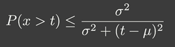                             |
|                                                              | 这个是什么意思呢？P是一个分布函数（即整体积分起来是1，比如概率分布函数），如果把x>t的部分积分起来，一定会小于等于右边的式子，ð^2是方差、u是均值，这个不等式在t处于分布函数的右半边的时候、也就是t>u均值的时候，比较接近准确的积分值。      有了这个不等式，就可以只用均值和方差，来估算大于t、也就是可以表示处于或不处于阴影下的比例大概是多少，得到的值就可以作为第三步需要计算的阴影的硬度的参考值。     那我还不是得知道均值和方差？不是更慢？别急，都有相应的加速的算法：     *：对于均值、我们大可以用MIPMAPing或者SAT（Summed Area Tables，具体是什么不知道）的方式来解决。（这里的均值应该不是深度图区域内的均值，而是经过检测后、产生了一堆0和1的判断的这个均值。要怎么生成这个、我没有查到，不过我自己有初步的设想，比如对于mipmap后得到的区域、用对应区域的平均深度减去渲染点的深度、多出来的正数部分，就是应有的相对于这个渲染点的均值。这只是一个我自己的设想。）     *：对于方差，我们有以下公式： |
|                                                              | 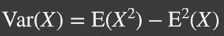                             |
|                                                              | 也就是说，只要知道均值的平方和X^2的均值、就可以算出方差。均值在上一步已经可以采样得到，但X^2的均值……首先，在这个分布中，X指的是一个个独立的检测的非0即1的结果，对于每一个渲染点，他们的这个分布都是不一样的。如果只看X的均值的话，确实可以用深度的均值减渲染点的深度大概估计，但是这个X^2的均值…老师这里给的说法是渲染深度图的时候顺便记录深度的平方，然后存到另一个纹理里，但是这个X^2不是深度的平方啊！而是非0即1的范围判断的的平方啊！0和1的平方都是自身，这个均值我实在想不出什么意义。不能说和真正非0即1集合的方差完全没关系，但我只能说是非常粗略的估计。我反复看202、查知乎，大家都对这个问题闭口不谈，算了，VSMM反正就是这么个高度估计的算法，操。 |
|                                                              | 对于第一步：第一步中我要找到遮挡物的平均深度，关系和公式看下图： |
|                                                              | 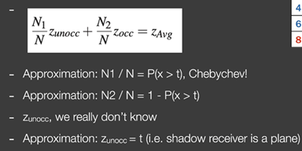                             |
|                                                              | 利用的是上面这个公式，意思是，某种的比例乘以均值加上另一种的比例乘它的均值、等于整体的均值。     那么只要知道比例、不遮挡的深度均值和整体的深度均值，就可以知道遮挡物的深度均值了。     正如下面所写的，整体的均值可以通过MIPMAPing或者SAT（Summed Area  Tables，具体是什么不知道）的方式查询得到。而对于比例、可以使用上面一样的切比雪夫不等式分析，步骤完全一样。而对于不遮挡物的均值……非常草率地认为就是渲染点的深度。知道这三个量，就可以算出遮挡物的均值、拿去计算第三步的卷积核的大小了。 |
| 关于SAT/Summed Area Tables/汇总面积表                        | 上面说VSSM的时候，说算ShadowMap的区域的均值的时候可以用SAT。为什么不用MipMap？是因为这可能不太准，回顾一下MipMap的做法，对对应级别的区域采样、但是如果采样点刚好在好几个像素之间、就又涉及到插值了，而且如果计算出来处于2.5级之类的中间级、又需要在级的采样结果之间插值（三线性插值），这样可能导致结果不太准，于是有了SAT，用来计算任意区域的总和。     SAT是数据结构，生成SAT的算法叫前缀和算法，先从一维思考，比如有序列1 2 3 4 5、SAT就是保存从第一位加到这一位的结果，对应这个例子就是：1  3 6 10  15.引申到二维，我先对原图的每一行独立地做一遍前缀和、再对每一列独立地做一遍前缀和，每个像素就记录了从原点到这个像素围成的矩形的总和。有了这个SAT、就可以快速计算任意矩形范围内的总和了，有了总和、算均值就是一件极其简单的事情。如何用SAT计算任意矩形范围内的总和？看下图： |
|                                                              | 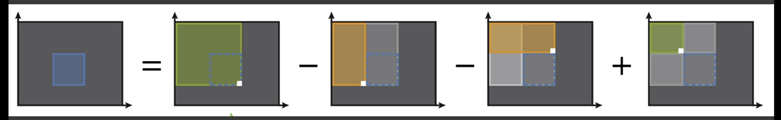                             |
|                                                              | 这里假设原点在左上角，SAT保存的是左上角到该像素的围成的矩形的总和，我要计算蓝色区域总和，很明显按照上面的关系计算就能很容易地得到。 |
| MSM/moment shadow mapping/矩阴影映射                         | VSSM由于其粗糙地估计存在一些问题，在渲染镂空的物体的时候，对ShadowMap的采样判断结果并不能认为是一个正态分布、而是一个突变的、奇怪的分布，那么再用那些方法去估计会得到错误的结果，比如在渲染镂空物体的阴影时、会导致一些部位出现漏光的现象，也就是本该时阴影的地方、却出现了光照，十分不自然。      为了解决这个问题，基于VSSM的优化、MSM出现了。MSM的原理是通过增加记录的矩（比如记录x，x^2,就是2矩、记录x,x^2,x^3,x^4就是4矩），来通过复杂的数学运算得到更精确的对分布函数的拟合函数（在VSSM中，根本没有拟合，而是直接认为是正态分布），从而降低渲染阴影出现的误差。效果好，但是复杂，而且计算量应该也不小。随着GPU降噪技术的进步，MSM和VSSM都变得比较少使用了。 |
| Distance Field Soft Shadows/距离场软阴影/SDF（signed distance  field/有向距离场） | 先复习一下距离场和距离函数。距离场是一个信息的载体，是隐式几何表达的一种，距离函数Distance  Function可以根据距离场、通过输入的顶点位置、告诉你这个顶点在这个场景中与和它最近的点的距离。如果是有向距离场、还能分内外，在内的话距离小于0.距离场就像是一张三维空间的贴图，用三维位置采样，然后得到一个值，告诉我最小的距离，其需要消耗非常多的内存，但是很快。     如何用SDF生成软阴影？     回顾一下PCSS的软阴影生成过程，在第三步中，我要判断ShadowMap中有多少像素比我浅、也就是能挡住我，然后我来判断这个阴影有多硬。在SDF中，看下图： |
|                                                              | 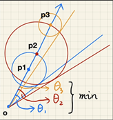                             |
|                                                              | 比如O点是渲染点，蓝色向量是渲染点到光源中心的连线，我需要用这个线中每一个点对距离场采样，能得到一个值，表示一个“安全范围”，因为此范围内肯定没有别的东西了。每个安全范围都能形成一个夹角，这些夹角中最小的那个，不就是能不受遮挡直接照射到我的部分吗。这个角度比上渲染点和光源形成的夹角的比值，就是有多大部分的光源能照射到我。     然而这要计算反三角函数，计算量很大，所以有针对这一点的优化，看下图： |
|                                                              | 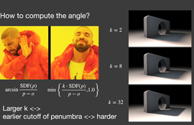                             |
|                                                              | 用K这个参数来模拟反三角造成的影响，即可不用算反三角函数了。这个模拟是十分粗糙的。当K设置的比较大，可能会大于1.等于1就代表完全不可见光源、也就是硬阴影了，所以这里要截取到1.K越大、则计算的结果越容易大于1，也就是说硬阴影的部分越多。 |
| IBL/image-based Lighting/基于cubemap的光照/环境光映射        | 如何在实时渲染中做环境光照？答曰还是从渲染方程出发，渲染方程中的L项（代变入射光），通过使用入射光采样方向对cubemap采样获得。在光线追踪中，环境光通过蒙特卡洛积分估算，但实时渲染不可能用积分，所以有以下优化方法，先看渲染方程： |
|                                                              | 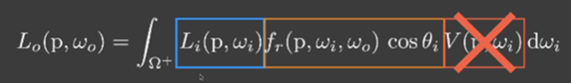                             |
|                                                              | （V代表可见性项，用来判断AO等，这里先不考虑）。积分两个函数的乘积是很复杂的，所以这里通过上面讨论“为什么阴影能够拆开来计算”这个问题的时候提到的近似等式： |
|                                                              | 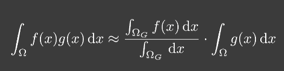                  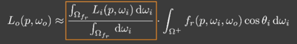 |
|                                                              | 关于这个不等式的解析，请开之前的命题讨论。通过这个近似等式的转化，即可得到上图右边的拆分结果，这就把入射光和BRDF的计算拆开了。      关于拆开后的左边这部分，本质就是给光照做指定强度的平均。这不就是滤波么，确实。所以左边这项、指的就是把CubeMap用自己指定大小的卷积核模糊的结果。这个积分的值，就通过反射光线对滤波后的cubemap采样一次得到的结果。当然，这个滤波是不可能在实时中做的，这个滤波都是预处理的。     对于这里的第二部分、通过我目前无法理解的复杂数学变化后，可以近似变成下式： |
|                                                              | 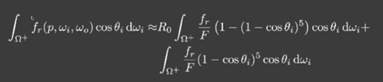                             |
|                                                              | 这和之前的PBR的学习中“库克-托伦斯的F”内讲的东西很像，这里的R0对应那里的F0，是一个可以提前定义的常数。然而这里的BRDF默认是PBR的BRDF，有FDG项的。对于这一波计算，上面一步解决了入射光部分预积分的问题，这一步解决了F项中F0的问题，只剩下cos和粗糙度（在DG中作为参数）可以改变这个积分的结果了，那么就很好办了，把这两个未知数作为轴，生成一张Lut查找表，在实时计算的时候根据这个查找表采样就可以得到积分的值、而不用临时去计算了。     至此，我已经拿到了拆分后两部分的值，都可以通过采样得到，相乘后不就是Lo、也就是观测方向辐射度的值吗，也就是我要求的值。     这一块和PBR内容很像，可以融会贯通一下。 |
| 让环境光产生投影                                             | 不可能让每个像素都作为光源去考虑投影，工业界一般从CubeMap中找到最亮的部分来当做独立光源产生投影。或者不考虑让环境光产生投影、而是产生通过渲染方程中的V项产生AO这样的阴影。 |
| PRT/Precomputed Radiance Transfer/预计算                     | 这是另一种做环境光Shading的方法，和上面记录的是并列的关系。上面的方法可能不够快、而且无法处理环境光遮蔽，所以需要PRT。      首先来复习和引申一些信号处理的知识。如果有两个不同频率的信号相乘，他们的频率是取决于低频的那个的。对于两个信号的乘积的积分、自然也是如此。那么、其实可以定义这个乘积后的积分（因为在渲染中，需要对每一个角度积分）就是高频信息在低频信息上的投影，就像向量在坐标轴上的投影一摸一样。傅里叶变化就是把信号变成很多阶基函数乘上系数后累加的结果，阶数越高，拟合越准，如果把原函数乘以任意一个基函数，就是这个函数（信号）在该频率上的投影。     通过这些知识，可以把信号的傅里叶变化引申到球面、也就是二维中，这就是之前在PBR中了解过的球谐函数（sh/Spherical  Harmonice）。首先，CubeMap可以作为一个球面，它的颜色就是它的信号，平常看到的CubeMap可以理解为在空间域中，我是不是可以把它转移到频率域中？是的，用的就是球谐函数。首先需要定义球面上的基函数吧，就像在1维傅里叶变换中，基函数就是Cos和Sin函数等等。在球谐函数中，基函数如下图： |
|                                                              | 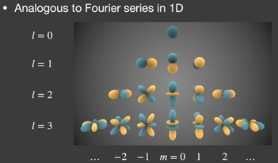                             |
|                                                              | 这里是前四阶球谐函数的基函数，他们是正交基，就像xyz轴一样，相互垂直，意味着他们之间相互投影，将得到0.这会带来极大的好处。有了基函数后，我就可以把我的输入信号、也就是CubeMap映射到球面后的f（a，b）（这里的意思是、原信号作为一个球面，我只需要输入水平平面的偏移角度和垂直平面的偏移角度，即可返回从球心到任意一个方向的球面的信息，这就是函数、信号），投影到各个基函数上，再把各个基函数的结果累加（类似逆傅里叶变换），得到的就是对原信号的模拟。投影后我得到的是一个float值，和3维立体坐标系里的轴上的值一个意思，就是说我在这个频段上有多少量。所以经过运算后，我得到的就是若干（根据你投影的阶数来定，傅里叶变换也要定一个限度的，表示要精确到什么程度。在实时渲染中，球谐函数往往用作计算环境光的Shaing计算，对应到上面讲的方法就是保存图像经过滤波模糊后的结果。这个做法在PBR笔记中得到印证，在PBR的间接光找的漫反射部分就是这么做的，因为要保存大量的滤波结果、是十分占内存的，而保存球谐函数算出来的9个float投影值的话，只需要保存9个float就可以很好的模拟滤波后的结果了。）float值，十分利于保存。     为什么要用这种方式？上面说了，为了不保存那么多滤波结果，占内存。      为什么可以使用这种方式？首先，根据上面对信号处理的复习，相乘的积分的频率由最低频的信号决定。而对于环境光的漫反射部分来说，它把法线半球的光照积分起来，其实就是相当与对CubeMap做模糊滤波，这样得到的就是相对低频、变化不剧烈的结果。模拟粗糙的结果当然可以用低阶数的球谐函数啊，而且可以节省大量的内存。根据实验，只需要3阶的球谐函数，就可以几乎完全模拟环境光漫反射生成的滤波后的结果了。 |
|                                                              | 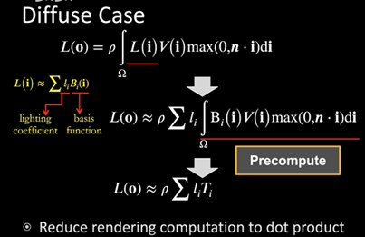                             |
|                                                              | 如何在渲染方程中实际运用？，看上图，p是提取出来的BRDF、因为在漫反射中，BRDF基本是定值，因为漫反射朝各个方向漫反射的能量基本一样，没有什么分布可言，所以从积分中提取出来。V代表可见性，可通过预计算存在纹理中，这块还没细说。对于Li部分，原本的渲染方程是要对每个入射方向的入射光积分，但现在我可以把入射的输入信号通过球谐函数来拆分，变成用基函数乘系数再累加的方式。这样一来，积分内部的东西全都是预计算可以得到的值了。     最终复杂的环境光漫反射问题被简化成了累加9个值的问题。     但是，如果使用如此大面积的预计算，场景就很局限了。首先物体不能移动，而且环境光贴图的旋转会变得复杂，因为基函数不会随之旋转，旋转倒是有方法可以解决，因为如果把一个基函数旋转了，那么这个旋转后的基函数其实可以用同阶的其他基函数线性表达出来。 |
|                                                              | 环境光不仅有漫反射部分，还有高光反射部分，基本思路和PTR类似，但是太过深奥我没理解……希望以后能力上来了可以补上。 |
| RSM/Reflective Shadow Maps/反射阴影映射/全局关照的间接光照部分 | 环境光和间接光照的概念稍微有点相似，但是不要混淆，环境光对应ambient项，在之前的BRDF中常假设的定值、在PBR中对应CubeMap的那个。间接光照也是要经过BRDF运算的，和直接光源并没有很大区别，只是它数量多，每个独立的影响小。101中讲光栅化中间接光照很难做，于是直接跳到了路径追踪，但是如今还是得面对。RSM是基于ShadowMap的间接光照做法，我先说下自己理解的流程：     首先是做数据的准备，要做全局光照，我肯定要知道哪些点会作为次级光源照亮渲染点，显然，被光源直接照射的点就会作为次级光源。这个问题可以通过传统的ShadowMap完美解决，还能顺便解决分割的问题（所谓分割问题是：我要知道哪些点会作为次级光源、但是点是没有面积的，我要判断多少点就成了一个问题。但是如果使用ShadowMap，其实每一个纹素就是一个区域，可以把它视作一个独立的光源。），我会问，这样无法解决间接光照的遮挡问题；确实，我直接认为次级光源都会影响渲染点、而无视了次级光源到渲染点会被遮挡的问题，这个问题时至今日也无法在光栅化中解决，目前有一些小方法可以判断部分遮挡，可以之后去了解。     知道哪些次级光源后，还需要知道它作为次级光源，能给我的渲染点带来多大的能量。这让我有再去算一遍渲染方程的冲动，但是不行，实时渲染不允许。于是在RSM中假定在处理间接光照时，作为次级光源的表面仅作为漫反射考虑，也就是、受到多少能量，直接用NL兰伯特模型计算，说形象一点，假如我现在身处渲染点，我要考虑一个次级光源对我的影响，我看到的有多亮？我这里就不管次级光源本身是什么BRDF了，直接当做NL（后注：你确定不是直接当做常数？？），这里的N是次级光源的法线、L是直接光照的方向，就像是观测点移到了渲染点一样。      如此、对每一个渲染点都要对计算ShadowMap的所有像素的贡献，是不可承担的开销。于是有各式各样的优化方法，比如光线传播会有衰减，那么我在渲染渲染点时，可以值考虑ShadowMap附近一块的纹素作为间接光源，而不是考虑整个ShadowMap。并且，我想知道的并不是每一个间接光源能贡献多少、而是总体能带来多少能量，这样又可以用之前讲的蒙特卡洛积分优化。总之还有非常多的优化方法。     这只是大概说明，内涵的数学知识对于我来说太过深奥……站在巨人的肩膀上，至少学会用吧。 |
| SSAO/Screen Space Ambient Occlusion/屏幕空间下的环境光遮蔽/基于后处理的环境光遮蔽 | 和之前的3D空间下的计算区分开来，之前的叫“图像空间”（Image  Space）。屏幕空间下的处理就基本是后处理了，输入是若干图，输出最终图。      关于AO、之前在零散知识积累中记过一些，但其实想来根本没有那么复杂。记得在入门精要中提到的标准光照模型中，有一项Ambient项，代表环境光，在那里这个项就是一个定值。但是为了模拟环境光遮蔽的效果，其实可以在Ambient项上做一个遮罩，使有的地方环境光亮、有的地方则暗，使得其立体感更强。     AO的原理就是对于每一个渲染点，我计算它在法线半球的可见性的Cos加权的平均，最终得到一个0~1的值代表环境光强度，把这个保存到贴图上即是AO贴图，和一个遮罩很像。     如何基于屏幕空间来做？     1.首先，根据屏幕空间的像素位置和深度（所以需要渲染深度图）可以构建一个三维坐标，作为这个渲染点的位置。     2.以这个渲染点为中心、记录的法线方向（所以还需要渲染法线方向图）为方向构建一个半球，半径自己指定。     3.向半球中随机撒点，通过点的z值和记录的深度图的z值可以判断这个点对于相机是否可见。简单判断是否可见往往会导致不该出现AO的地方也有AO，因为遮挡物可能离渲染点非常远。所以这里也可以加上一个判断，若二者深度相差太多则不算遮挡。     4.用Cos a（a为点到球心的连线与法线的夹角）加权平均洒下的各点的可见性，即可得到大概的环境光的强度值。     5.最终应该渲出一张灰度图，把它叠加到原渲染纹理中去即是最终结果。 |
| SSDO/Screen Space Directional Occlusion/屏幕空间下的间接光照算法/基于后处理的间接光照 | RSM自然是一种光栅化中的间接光照的做法，这是并列的一种。这里简述流程：     1.对于每一个渲染点（因为是后处理，所以对应渲染纹理的纹素），与AO类似的，在渲染点法线方向指定半径的半球内随机撒点。      2.比较洒下的点的深度和深度图记录的深度，若洒下的点不可见，则计算该点与相机连线对应的像素、其作为次级光源对渲染点的影响。如下图中的A点，其本来不可见，但我把它对应到渲染纹理的纹素后，再考虑它对渲染点P的影响，也就是用渲染方程得到变换后A在AP方向的辐射度。若洒下的点是可见的，则计算从渲染点到环境光贴图的采样信息。     3.累加各洒下点得到的辐射度，基本就是此点间接光照的结果。      *对于下图最右边的情况是SSDO的缺陷，会出现误判。比如A点会被判定为可以对P通过z1产生间接光照，但其实A对P有直接光照。这是由于后处理的局限性造成的，对于这种复杂的拓扑不能很好的处理。再比如B点会被判断为可见、然后对环境光贴图采样，但其实B点是被遮挡的。     *SSDO由于撒点的采样半球大小不能太大，只能计算非常局部的全局光照。而且由于是基于后处理的，背面的反射将不再有效。 |
|                                                              | 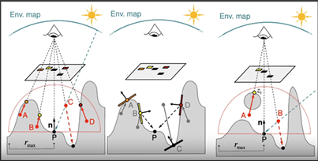                             |
| SSR/Screen Space Reflection/屏幕空间下的反射/基于后处理的路径追踪 | 主要做镜面反射之类的。流程大致如下：     1.对于每一个渲染点，从摄像机向场景中发射“感知光线”，并计算反射方向。     2.根据BRDF和反射方向确定采样范围，并打出采样用的反射光线。     3.最终反射光线会击中一块像素，把所有反射采样光线得到的值综合考虑即可得知渲染点的反射的辐射度。      *：对于一张图要如何判断所谓的击中一个像素呢？因为还保存了深度图，则可以用像素位置和深度构造一个在xy方向离散化了的新空间，在这个空间下判断击中。     *：对于SSR也有专门的判断击中的加速结构，使用MIPMAP技术保存多级的深度图，但缩小后的像素不再是4个的平均值，而是深度的最小值，也就是离相机最近的。过程就像在不断保存概括化后的深度分布，但概括后的深度永远比原来的区域浅或者一样。这样就能动态决定光线传播判断击中的步长。     *：毕竟是基于后处理的算法，仍然无法逃过一些问题，比如背面的信息丢失等等。 |
| 微表面材质/微表面BRDF/FDG                                    | 在PBR的学习中我知道、PBR必须满足的条件之一是微表面模型。我原以为所谓微表面模型仅仅是一个粗糙度的值，但在202的介绍中整个FDG都是微表面模型的内容，之后一部分都是对FDG的深度解读。 |
| NDF/Normal Distribution Function/法线分布函数/D项            | 和PBR笔记中理解的一样，它就是一个函数，输入粗糙度、法线方向和半程向量，NDF会告诉你反射到观察方向的能量大概有多少。之所以叫法线分布函数，是因为这是微表面模型，微表面是凹凸不平的，越粗糙、法线分布就越乱越散。我在渲染中想做的就是，我想知道观察方向有多少反射，这正是NDF所做的。      NDF指的是有这个功能的函数，所以不止存在一种NDF，在PBR笔记中用的是GGX，还有一种叫BeckMann的NDF也被用在实时渲染。两种函数的函数图如下：     可以看出GGX（也叫Trowbridge-Reitz）在视角向和反射方向相差很大的时候，也有一些类似“低保”的能量分布，也就是说暗的地方不会特别暗，而且过度比较平滑，会有一点点光晕的效果。     GGX效果较好，计算简单，所以被广泛运用，代码在PBR笔记中就有。     GGX虽好，但是它的低保程度是不可控的，为了解决这个问题，提出了GTR（Generalized  Trowbridge-Reitz）模型，如下三图，可以通过r（不是r是伽马，我懒得打罗马字符）调节“低保”的程度。     （我不明白为什么PBR笔记的参考资料的笔者不使用GTR，或许我可以试着改进） |
|                                                              | 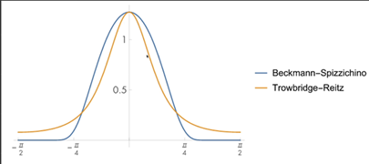                  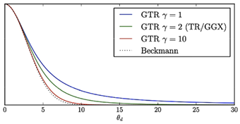                  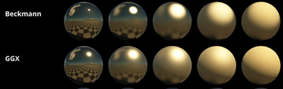 |
| GF/G项/几何体函数/自我遮蔽模拟函数/Geometry function         | PBR笔记中也提过，G项指的是几何体自我遮蔽项。从上面第二张图就能看出来，球体的边缘有异常的亮线，这是由于微表面模型的计算方法导致的，看下面的微表面模型的计算公式：     当观测方向Wo与法线夹角达到90度左右，也就是球的边缘处，Wo .* N不就是Cos 90么，那不就是0么。极小的分母就会这样导致产生一条亮线。 |
|                                                              | 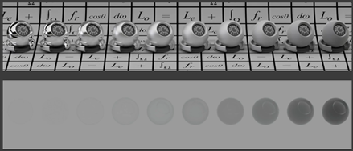              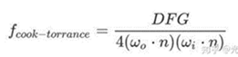 |
|                                                              | 在视线和法线几乎平行的时候，当然会比较少遮蔽，而当视线和法线几乎垂直的时候，又几乎是完全遮蔽，期间也会受粗糙度的影响。非常像D项，但是如果按照D项来算会出问题，因为这样往往会导致损失过多的能量，遮蔽的光不一定不可见，因为它可能被其他微表面反射若干次然后可见，这部分能量被忽略导致渲染结果偏暗，颜色上也出现偏差，无法通过“白炉测试”，如上图。     为了解决这个问题，在计算G项的时候需要考虑补全这部分能量，思想是这样的，但是推导和计算极其复杂、无法参透……………………     在PBR的笔记中，G项似乎没有考虑这个问题，倒是笔记中的BrdfLut中似乎有相关内容、等学精了以后回来补充吧…… |
| Disney's Principled BRDF/迪士尼原则的BRDF                    | BRDF就是材质，之前提到的各种材质、他们使用的参数都是极其物理的、抽象的，比如在微表面模型中，涉及反射率等等，并且想想，要严格符合物理的话，可以暴露的参数是很少的，除了粗糙度和颜色，好像真没什么可以暴露的了，计算需要的东西都封装在材质内部了吧。      然而在工业界、设计BRDF主要是提供给艺术家用，所以必须提供够大的参数空间、以表示各种各样不同的材质；并且你的参数要直观易懂。迪士尼做了这样的BRDF，以下是它的所有参数。这些参数是并列的存在，通过组合可以产生成千上万种材质。这很像好多种模型的结合，我们之前写的BRDF都比较局限，似乎只能模拟比较接近的一类材质。     迪士尼原则的BRDF虽然能表达的质感多，但是有一些缺点：     1.参数维度多，虽然可以表达的多，但是冗余也多。也就是说同一种效果、可以有多种参数组合的表达方式，有时会让人困惑。     2.慢，无法用于实时渲染。     3.并不严格基于物理。     接下来解释一下各个参数的作用，我在曾经的各个渲染器中用过类似的材质，但始终没有一个系统的了解，只是自己乱试。     1.subsurface-次表面：值越大、次表面散射越强，表现为漫反射该亮的地方不那么亮，边缘等薄的地方变亮，变得像玉石、大理石。人类皮肤也用较高的次表面散射。     2.metallic-金属度：值越大，越像金属，表现为镜面反射变强，通常颜色会变暗。     3.specular-高光：值越大，高光越强，包括直接光照（亮点）和间接光照（镜面反射）的高光。     4.specularTint-高光颜色：三维值，就是给高光混合一层可指定的颜色。     5.roughness-粗糙度：与微表面模型的粗糙度非常像，值越大，法线分布越乱。表现在镜面反射减弱，漫反射加强，高光大而散，边缘尤其暗（自遮挡）。     6.anisotropic-各向异性：模拟特殊形状的高光，通常需要搭配贴图来确定高光纹路。在头发、人造金属制品等表面相当常用。     7.sheen-毛绒光泽/天鹅绒光泽：毛毯之类的材质，从侧面看过去能看到一些毛绒，sheen模拟这种毛绒，常用在布料尤其是天鹅绒的模拟。     8.sheenTine-毛绒光泽颜色：若毛绒还有自己独特的颜色、设置此项达到目的。     9.clearcoat-清漆：类似汽车表面、油漆后的木头这种多层材质，使用清漆项模拟其表面涂层。     10.clearcoatGloss-清漆光泽度：清漆的光泽度也可调。 |
|                                                              | 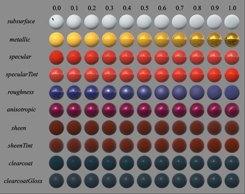                             |
| Non-Photorealistic Rendering/NPR/非真实感渲染                | 在入门精要中提过一部分非真实感渲染，主要是描边和Shading阈值化的内容，这里做一个总结和整理：     关于描边，课程介绍了三种方法：      第一种是在片元着色器中，若检查到视角和面法线夹角接近90度，则鉴定为边缘然后上色。这样会造成各处描边粗细不一致的问题，一般不用。第二种是在单独的Pass中剔除模型的正面，然后把背面的点沿着法线方向扩展一些，然后渲染背面。第三种是基于后处理的描边，对法线渲染纹理或者深度渲染纹理做后处理的效果比较好。目前工业界使用扩展模型的方法比较常用。     关于颜色阈值化和素描效果等就看入门精要的笔记吧，讲的东西是一样的。 |
| RTRT/Real-Time RayTracing/实时光追                           | 101中说过光追是一种和光栅化并列的渲染方式，其可以很自然地渲染出真实的（软）阴影、环境光遮蔽、镜面反射和全局光照，是一种效果上理想的解决方案，奈何计算量非常大难以用到实时渲染中。但是目前硬件地发展（指RTX系列显卡针对光线追踪在显卡中加装的RTCore，可以使一秒计算10G的光线，转化成SPP就是每帧可以使每个像素采样1SPP，一个SPP就是指感知光线、直接光照探测光线、间接光照探测光线和间接光照连到光源的探测光线这么4条，其中感知光线不在这里做，而是先做一遍光栅化，光栅化得到的结果就很像是感知光线的结果）、以及强力降噪技术的发展，实时光追逐渐成为可能。其中，极其强大的降噪方法是实时光追的根本。以下会详细说明一些实时光追的技术要点和问题。 |
| 实时光追降噪的基本思想/Tempora                               | 和TAA时间抗锯齿类似的，实时光追的基本思想也是基于时间积累的，称为Tempora方法。      一帧只有1SPP，噪点是极其恐怖的。增加采样次数是最直接和简单的做法，但在单帧里无法承受，所以Tempora方法把压力缓解到时间上，把上一帧的采样结果拿到本帧来用，和本帧的采样结果叠加，则叠加的结果可以认为是多次采样的。以下是Tempora方法的核心思想：     1.把上一帧的结果视为绝对可信的准确降噪结果。因为大部分时候上一帧积累了前面许多帧的采样，当场景内物体快速运动、物体出现快速进出屏幕时、才会出现问题。     2.使用Motion Vectors运动向量找到上一帧时这个渲染点在哪一个像素。     3.综合考虑本帧采样结果和上一帧累计结果。 |
| 在实时光追中使用G-buffer/在屏幕空间下保存世界坐标            | G-buffer是几何体缓存，可以保存各种各样的渲染纹理、比如法线渲染纹理、深度渲染纹理等等。在实时光追中，一定要保存世界坐标纹理，你可以通过屏幕坐标对纹理采样，得到的将是这个渲染点在世界坐标下的位置。我在计算Motion  Vector时，需要用到这个信息。 |
| 获取渲染点在上一帧处于哪一个像素                             | 如下图：      如果保存了G-buffer，那么直接通过屏幕坐标采样得到这一帧的该渲染点的世界坐标。（否则保存和使用复杂的MVPE矩阵的逆矩阵来获取，E指的是视口变换）      Motion被认为是已知的，因为对于渲染来说，相机和物体自身运动和旋转的叠加就是渲染点在两帧之间位置差别的决定因素，总有一个矩阵可以表示渲染点从上一帧到本帧的世界坐标如何变化。通过本帧的世界坐标乘以这个变换矩阵的逆矩阵，就可以得到上一帧此渲染点所在的世界坐标。     再把上一帧所在的世界坐标通过上一帧的MVP矩阵变换到屏幕空间中来，即是此渲染点在上一帧的像素位置。     这种做法似曾相识，入门精要的基于后处理的雾的制作中，我们也需要这样还原世界坐标，在制作运动模糊效果时，也需要使用上一帧的信息，可以回顾和参考一下。 |
|                                                              | 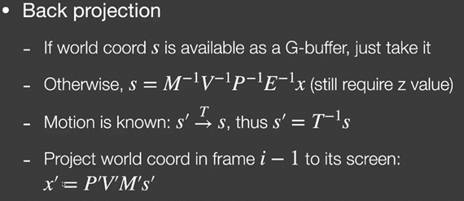                             |
| 综合考量累计结果和本帧采样结果                               | 既然通过上面的方法拿到了本帧中渲染点在上一个像素中对应的位置，那自然可以拿到上一帧中那个像素的颜色、即累计的渲染结果。那么如何最终确定本帧输出的颜色值？     答案是简单地使用线性插值，大部分时候人们会用80%~90%的上一帧结果，剩下的就是本帧的结果，这俩混合起来，便是最终的输出结果。 |
| Temporal的问题                                               | 理想很丰满、现实很骨感。Temporal在一些场合存在问题，下面来列举一些：     1.需要“预热”时间（burn-in  period）。既然是复用上一帧的结果，当这一帧渲染的场景是切换相机后的场景时，大部分的上一帧的内容就无法复用了，因为在算出来的上一帧的坐标，在上一帧的结果里没有，所以要重新开始算，那么如果没有这个预热时间，则在开始时会出现一段时间的噪点严重的结果。     2.屏幕空间保存的缺陷。之前说酸酸乳（SSR）的时候，就提过不少屏幕空间的缺陷。因为我这里取上一帧的结果、但是我能取到的范围仅仅是上一帧渲染了的部分啊，对于上一帧也没有渲染的部分就要重新开始。      3.遮挡导致的渲染错误问题。比如下图的蓝点处，右边是本帧。对于这个蓝点，这个壁炉没有动，相机也没有动。则在渲染这个蓝点时，认为上一帧的这个渲染点的渲染结果就存在和本帧一样的像素里面。但是看左图的上一帧的渲染结果，它其实被箱子挡住了。然而还是采用这个结果、就会导致运动起来的箱子产生严重的拖影。     *：为了解决3点提到的问题，有一些方法：Clamping方法、即在混合时，先把上一帧的颜色的色相拉到和本帧的结果较为相近的地方，然后再插值，简单而直白。第二种方法是使用物体ID，额外渲一张物体ID贴图，当要混合之前先判断，本帧和上帧所采到的是不是同一个物体，然后根据结果调整插值的程度，比如完全不用前一帧结果。     4.阴影会产生严重的滞后。和上面的原因类似，当仅光源在动，物体不动，相机不动，但阴影会动，而Motion  Vector算出来肯定是0，因为物体和相机确实没动，所以本帧的渲染会混入大量的前一帧的结果，导致阴影会有严重的滞后。     5.和4类似的，镜面反射等较明显的反射也会产生明显的滞后，因为反射面和相机一般也不会动。 |
|                                                              | 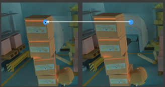                             |
| 双边滤波/bilateral filtering                                 | 其实在实时光追的temporal之前，会先对这帧的结果做一个滤波降噪，再综合考量前一帧的结果。这个滤波降噪是“联合双边滤波”，但是我们要先引入双边滤波的概念。      1.记得在入门精要的高斯模糊中，我们使用的滤波核是高斯核，也就是像一个锥形一样的的，中间贡献大，越远贡献越小。在高斯核中，对于一个像素该贡献多少权值，是距离的一言堂，越近贡献越大。这样可以说是众生平等，得到的是一个均匀的模糊结果。     2.但是有时我想在模糊的同时保留边界，于是出现了双边滤波。原来是距离的一言堂，现在就像是加了一个顾问，在距离提出参数的同时，还要问一下颜色的意见，也就是说，在判断一个像素贡献多大时，不仅考虑距离的影响，还考虑他们颜色的差异，差异越大，越可能处于边界的两边，那么就不应该给这个像素更大的权值。这样将从两个顾问那里得到两个参数，把他们相乘，即是这个像素应该贡献的权值。     3.这样的滤波往往能保留边界，而边界不明显的地方将会被做模糊。 |
| 联合双边滤波/Joint（或cross） Bilateral filtering            | 基于双边滤波的思想，我们可以也需要添加更多的顾问，来告诉我们滤波核内，某个像素到底应该贡献多大的权值。在实时光追中，需要先做一遍光栅化，得到各种渲染纹理存到G-Buffer中，这些渲染纹理将成为非常好的信息来源，帮助作为顾问判断像素该贡献的权值。      比如下图的场景，分别使用深度、法线、和颜色（由初始的光栅化得到）（应该还有像素距离，毕竟滤波核不应该覆盖全部屏幕）作为顾问，AB由于深度差太大而会被深度顾问打低分，导致渲染B的时候A的贡献会被压小，反过来渲染A的时候也是一样。 |
|                                                              | 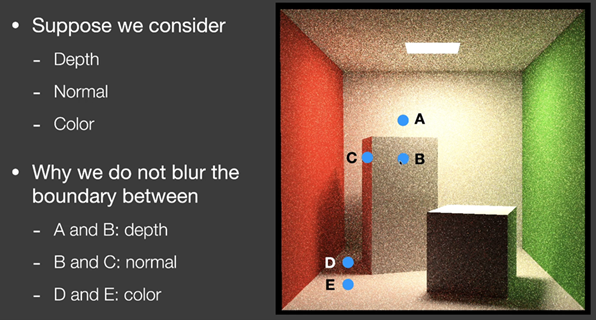                             |
| 关于较大滤波核的优化方法                                     | 如果滤波核比较大，比如超过64*64，实时渲染的时候就很吃力了。因为对于每一个像素，都要计算64*64遍，很恐怖。所以由一些优化的方法：      1.记得在入门精要中，做高斯模糊是分两个Pass来做的，x轴一遍y一遍。这样可以极大地减少时间开销！对于64*64的高斯核，只需要做64*2次就可以了。可以这么做是因为高斯核是对称的，和101中计算双线性插值的方法一样。     2.对于联合双边滤波这样的复杂滤波核，强行分pass做两遍是不准确的，但滤波核不那么大的时候，差的也不是那么多。可以使用。     3.另一种优化复杂滤波核的方法，叫做a-trous  wavelet方法，非常的巧妙。比如我要做64*64的复杂滤波，那么这个方法会先做5*5的紧密排列的滤波，然后做一次降采样（入门精要的高斯模糊中提过，就是把卷积核中插入空隙、隔几个单位再采样），第一次降采样时，每个采样点间隔一个单位，滤波核大小为9*9，第二次时间隔3个，滤波核大小为17*17、以此类推，每叠加一次降采样，滤波核的大小会变为每2^i个像素采样一次。这样，对于一个64*64的卷积核，只需要采5*5*5次。为什么可以这么做呢？你想，小的滤波核滤掉的是更高频的信息，在高斯模糊的时候验证过。而这里做的就是先滤高频、再用更低的降采样后的核滤相较低的频率，因为相较低的频率本来就不怎么需要滤，均匀做高斯不是太奢侈了吗？这就很像生命吸管，先滤大的、再滤小的这样。 |
| Outlier Removal/火萤噪声、亮点的去除                         | 在101介绍路径追踪的时候，说了蒙特卡洛积分，在实时光追中也需要用到。但是在采样次数少的情况下，容易出现极暗或者极亮的点，还不是用RGB表示的亮，而是用辐射度表示的无上限的亮，这样的亮点根本滤波压不下来，于是需要处理outlier  removal这一步。简单来说就是对于每一个像素，统计7*7范围内的颜色的均值（或者中位数）和方差，然后对这个像素判断，如果这个像素在均值的若干倍方差之外，说明他是一个偏得离谱的值，这里就会把它超过最亮的部分给削掉，把它压到正常的范围内。 |
| SVGF/Spatiotemporal Variance-Guided Filtering/时空方差指导的滤波 | 把上面说到的这么多方法综合起来，有了一套工业界的用法，就叫做SVGF。以下是一些优化和区别：      1.在深度的指导上。在上面说联合双边滤波的时候说会有多个顾问决定像素的权值，SVDF在深度的影响上有一些针对侧面面向镜头的优化。比如联合双边滤波的图中的C点所在的那个侧面，如果那个侧面存在两个互在对方滤波核范围内的点，如果仅用深度判断，他们的深度还是会有较大差异的，那么顾问就会减小这部分的权值，但是不应该。所以在深度顾问上做了优化，把原来的的深度（像素到相机的距离）换算成二者法线方向上深度的差异，这样就能较好地利用侧面的计算结果了。      2.在法线的指导上，是简单地叉乘而已，可以用一个指数函数来控制衰减的速度。但是要注意使用了法线贴图的情况，此时应该用未经法线贴图偏移的法线来判断像素的贡献权值。      3.在颜色的指导上，因为输入的图像含有大量的噪声，单凭颜色的差异判断权值会出大问题，因为可能当前的这个像素处于一个高噪声的位置，那么它和正确的结果的颜色会差很多，导致正确的像素贡献不到。所以在颜色的指导上还要除以一个7*7范围内的方差。也就是说，在颜色的指导的基础上，还要看渲染点的7*7范围内的方差，若方差大，则它很可能处于一个噪声点，那么我们降低颜色指导的影响。这也是SVGF中V的来源。     4.SVGF仍然存在Temporal带来的阴影和镜面反射的地面反射滞后的问题。 |
| 延迟渲染/deferred Shading                                    | 在入门精要里提过，但是没讲到重点。延迟渲染的核心思想就是两遍pass，第一遍只渲染深度图，第二遍参考渲好的深度图进行细致的着色，就可以避免overDraw的问题。 |