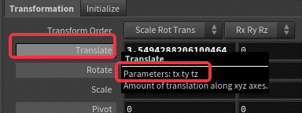

# Houdini学习笔记

# 前言

Part1是Excel部分。

Part2是MarkDown部分。

Part3是有道云部分。

有道云就是一坨。😅

很痛苦，做这一波整合。

往后的部分会续在这个文件上。

---

# 内容

## Part1

| 名称                                                 | 说明                                                         |
| ---------------------------------------------------- | ------------------------------------------------------------ |
| 使用$文件夹                                          | 涉及文件的读取等操作的时候，不要定死路径，按找规范要使用$加特殊文件夹名，这样工程在传递的时候才能更好地适配，以便于别人查看。使用项目文件夹的时候，这个过程一般是自动的。 |
| 根据当前视口视角生成摄像机                           | ctrl  +  单击工具架上的创建摄像机，如果想要再次用视口角度调整摄像机视角，只需要在现实该摄像机内容时点击视口右侧的小锁，再移动视口视角，确定好方向松开小锁，即可完成摄像机视角的更新。 |
| 调整摄像机的景深                                     | 虽然直接动参数就可以，但是不够直观，不易于操控。也在选中摄像机时按下Z，便可进入景深调整模式。 |
| 选择不同的操作把手                                   | 有些节点有不同的操作把手，比如摄像机，有移动缩放类的把手，和调整景深的把手，如何切换呢？只需要在视口中右键单机这个节点的物体，即可在最上面看到不同的操作把手。 |
| 恢复属性到默认值                                     | 两种方法，一种右键单击属性，有一个revert选项。另一种ctrl  + 鼠标中间点击属性即可 |
| 灯光链接                                             | 你知道，每次DrawCall只能渲染一个灯光对一个物体的效果，为了自由地控制各灯光对各物体地影响，所以在Houdini有了灯光链接这个东西，就是你可以设置灯光和物体的链接关系，可以设置让这个灯光不影响某些物体、或者让物体不受某些灯光地影响。 |
| 开始渲染                                             | Houdini里渲染也做成节点式的了，在节点视图里进入out层级，再键入渲染器相关的节点名称就可以创建一组渲染器预设。Houdini有自带的渲染器，叫做mantra。 |
| 给属性添加插值                                       | 按住alt单击属性，即可对其打一关键帧，若要取消该动画，则shift+ctrl单击属性 |
| 给属性插值动画设置曲线                               | 按住shift单击已经装载了关键帧的属性，即可打开曲线编辑面板    |
| 灯光链接                                             | 面板在节点窗口那里，点击加号，可以在里面的菜单找到灯光链接的选项，打开就可以自由地设置灯光链接了。 |
| exr格式文件                                          | 通俗的说，是一种更“生”的图片文件。普通的光栅化文件不是一般就RGBA四个通道吗，但是exr可以保存非常多的通道，而且是特殊的通道，比如漫反射通道、高光通道等，渲染的时候可以把这些通道分开渲染，分开保存。这样可以极大的方便合成。 |
| 合成                                                 | 通俗的说，合成就是图片的堆叠。比如图片的RBGA四个通道一堆叠，就成了一张光栅化的图片。而你把其他exr的通道堆叠，就能得到正确的渲染结果。分通道渲染，是为了分别控制每一个通道的内容。比如我想要增大增高光，若渲成了RGBA，则无从下手。渲成exr，则可以单独对其高光通道进行处理。这个处理和堆叠的过程就叫合成，在Houdini里也可以做。 |
| 组                                                   | 处理的基本单位。很多节点的输入都要求是组，可能是面组、可能是点组等。像是PS的选区一样。 |
| 细分                                                 | 和传统建模软件的细分一致，Houdini中使用subdivide节点。这里只是细分显示，渲染的时候不会细分。要把细分运用到渲染中，需要在Scene层级选中这个Geo，然后在Render中勾选运用细分渲染。 |
| 清除现有组                                           | Houdini建模是非破坏式的，所以很多时候需要清除一下之前用的选取，Houdini中使用groupdelete节点删除现有组 |
| 全部和非                                             | 在“选择”这个操作的时候，“全部”用“*”表示，“除开”用“^”表示     |
| 分组                                                 | 用Group节点，可以选择组的类型、分组方式等                    |
| 组的转换                                             | 用groupPromote节点，可以把现有的不同类型的组相互转换。比如把输入的点组转换成新的面组。这个转换需要重新命名 |
| 给节点写注释                                         | 右键单击节点，点击AddComment即可添加注释，会显示在节点视口   |
| 改变顶点颜色                                         | 使用Color节点可以改变顶点颜色。注意，这个顶点颜色和渲染中表现的颜色是不一样的。顶点颜色常用来携带信息而不是表现颜色。比如做一颗植物，如何仅让叶片飘动？此时就可以在建模阶段把叶片刷成一种颜色，把枝干刷成另一种颜色，然后在Shader中做区别处理。使用Color节点时，会给点添加一个三维向量的属性（RGB），使用时@CD.[通道]。然而在渲染器中，其实也可以选择使用顶点颜色渲染面颜色。     不仅可以仅指定一个颜色，也可以指定由属性决定颜色、渐变等等等等。在蛋糕案例中，作者使用点属性隐射到渐变，再用渐变得到的最终值作为顶点的颜色。 |
| 扩展组                                               | 使用groupexpand节点，很像3Dmax的加选，就是沿着当前的选择再向外扩展指定个个单位（点或者面）。 |
| 在动画编辑器中最大化显示当前插值曲线                 | 在动画编辑器界面按下H建                                      |
| 实时速度播放预览K好的动画                            | 点击动画栏左下角的小时钟按钮即可按照设定好的帧速率播放K好的动画。也可以设置帧速率。K动画一般用24帧每秒 |
| 删除组                                               | 用blast节点。还可以做反选删除等操作，即把输入组的反选结果删除。 |
| 渲染动画预览                                         | 左下方有一个像记事本一样的按钮，单击后可以进入一个动画预览渲染的界面，可以渲染粗糙的动画结果。 |
| 属性                                                 | Attribute，和程序中的属性是一样的，你可以给点、线、面添加属性，用来判断、计算和控制等等 |
| 给组添加一个属性                                     | 可以使用Attribcreat节点，添加时可以选择给点、线、面哪一种加，加的是什么类型，比如int、float等。也可以直接在Attribwrangle中，直接@[变量名]来新建属性 |
| 修改一个属性                                         | 可以使用Attribwrangle节点，使用VEXpression控制属性           |
| VEXpression                                          | 一种专用的语言，与表达式不同                                 |
| 在VEX中使用预置变量                                  | 比如位置等，属于已有属性。使用@[语义]来获取对应的变量。比如想要获取对象的X位置，则@P[x] |
| 在VEX中使用自己创建的变量                            | 如果你使用Attribcreat创建了属性，那么使用@[变量名]来使用该变量，可读写。 |
| 获取对象的编号                                       | Houdini中会给所有的点、线、面标上数字，用$PT来获取对象的编号。在属性栏、VEX中都可以使用。也可以用@ptnum来使用。 |
| 预置的变量名不可以重新定义                           | 比如Cd（颜色）、P（位置）、ptnum（编号）等，不可以重新定义一个名字一样的属性。 |
| 传递属性                                             | 使用attribtransfer节点，可以把指定的属性从一个对象传给另一个，还可以指定传的方式、范围等。可以用来做碰撞反馈等效果，如玩偶被撞击后凹陷。在小海怪积木化的案例中，也用来把表层点的属性传递给实心点。 |
| 随机撒点                                             | 使用scatter节点，输出时会按指定方式给面组撒点。              |
| 在动画编辑器中编辑关键帧信息                         | 动画编辑器可以做很多事情，可以编辑关键帧的量、时间点等等     |
| 给物体填充实心内部点                                 | 使用pointsfromvolume节点，可以给物体内部填充点，可以模拟实心 |
| 在VEX中获取法线信息                                  | 使用@N属性                                                   |
| 把锋利处变平滑                                       | 使用smooth节点。不仅可以平滑模型、也可以平滑属性、颜色等等等等。总之可以把输入的变化剧烈的、离散的变成尽量连续的。      在蛋糕案例中，作者把曲率信息存到点中，而这本该是线的属性，肯定会导致有些交叉处的错乱现象，但是作者给曲率属性打了Smooth，就变得相对可以接受了。（因为曲率信息后续被用作颜色的参考值） |
| 复制属性                                             | 使用attribcopy节点，与attribtransfer不同的是，传递大概是动态的链接，而复制是开辟了新的空间存放一样的东西，就像C++的变量和别名一样。 |
| 复制物体                                             | 1.使用Copy  And Transfrom节点，可以做到和Max里一样的复制，可设定步数、步长等。      2.当想要把物体复制到许多指定的点的时候，使用CopyToPoints节点，输入物体和点组即可。这种方法会根据点的属性来实例化物体，物体会朝向点的法线，物体的Scale会跟随点的Scale。     3.使用Copy Stamp节点，可以完成Copy And  Transfrom的所有功能，额外可以给复制出的物体添加属性。需要再此节点中勾选stampinput     4.使用复制节点时，可能会有Pack and  Instace选项，如果你要在之后对这些物体独立做解算，就勾选这个，如果不，则每次使用的时候还需要先现场实例化一下，比较慢。建议复制大量物体且不做区别对待的时候勾选，这样所有复制的东西会共用一个源之类的。 |
| VEX中修改向量属性                                    | 在VEX中使用set函数，比如@N  = set(0,1,0);                    |
| VEX中给点添加Scale属性                               | 点的Scale也属于预置属性，但是不用的话好像不会显示。使用是在VEX中@pscale |
| VEX中随机出一个0~1的数                               |                                                              |
| VEX中把0~1的值映射到自定义范围                       | 使用float  fit01([input],[min],[max]);函数，输入0~1的值，再定一个最小和最大值，即可得到用input线性插值的结果。 |
| 表达式                                               | 可以理解为VEX中的一句，广泛用于属性栏，用来计算或者链接属性  |
| 在属性框中链接值                                     | 在属性框中键入stamp([path],[name],[fallback]);函数,输入要取的值所属的节点的路径、所取属性的名字、和取不到返回的默认值，即可完成链接 |
| 获取当前节点的路径                                   | 在字符串中键入".."，即可代表这个节点的路径。若要取这个节点下面的节点，可以使用"../[name]"这样的形式 |
| 快速贴图                                             | 使用uvquickshade节点，可以给做好uv的模型、或者还没有uv的模型贴漫反射贴图 |
| 扭曲、弯曲、翻折模型                                 | 使用bend节点，bend可以做到很多事情，在蛋糕案例中，作者使用bend的Taper项把蛋糕底部的上方拉大，像一个棱台一样。涉及整体的形变，都考虑一下用bend吧。 |
| 给相机添加渲染用的背景                               | 在camera节点的view栏中，可以设置图片格式的背景               |
| 顶视图、侧视图的快捷键                               | View模式下按12345，5为uv视图                                 |
| 给面（体）添加噪声                                   | 使用mountain节点，默认配置下会把面上下按照噪声凹凸，就像在Unity中生成地形一样。可以设置各种采样的配置，还可以选择不同的噪声类型。常需要面片有更多的细分以得到最好的效果     在蛋糕案例中，作者对VDB使用了cloudNoise节点，这可以给体积添加云一样的噪声。 |
| 根据指定值返回输入的一种                             | 使用switch节点，输入是组，不限数量。内部含有一个属性，int型，从0开始，0则输出第一个节点，大于节点数则返回最后一个节点，小于0则返回第一个节点，四舍五入。      发散一下，这个switch可以用来做树林、观众席、超市货架等，switch节点的属性可以从copystamp中随机出来的属性链接，就能从一组模型中随机挑一个实例化。 |
| 挤出                                                 | 用polyextrude节点，与传统挤出几乎无异                        |
| 扫描                                                 | 用sweep节点，和Max的扫描是一样的，先输入线组，再输入横截面，就能根据线生成指定横截面的管子，也可以输出点组或者线组。 |
| 做一条曲线                                           | 用curve节点，设定好贝塞尔角点或者别的曲线的角点，类似PS      |
| 把曲线光栅化                                         | 即把曲线变成很多小直线连接起来来模拟这条曲线。用resample节点。Resample是重采样的意思。采样点是输入图元，你可以选择不同的插值方式，总之可以以你当前的输入图元（曲线）为基础修改成非常多可能的新曲线 |
| 做一条麻绳                                           | 弄一条代表绳子的基本的曲线，再用sweep以圆为横截面输出线组，在sweep节点的属性中加上一点扭曲。再对这个线组以圆为横截面使用sweep，即可把每一条线变成实体、变粗，就成了一条麻绳。 |
| 使用粒子系统                                         | 使用popnet节点，pop  = particle operator（粒子管理系统）。具体的参数、控制等与Unity的类似 |
| 粒子系统的组成                                       | 一个粒子系统大概分为4个部分，粒子、发射源、解算器和输出。粒子通常是一个节点，用来控制单个粒子。发射源可以有多个，通过popnet层级下的merge节点可以合并发射源，发射源用来控制如何发射，怎样发射、发射多少。解算器有很多种，比如水体的解算器、布料的解算器等等。解算器是干啥的呢？顾名思义，就是用来算各种物理效果的。你知道计算物理是很麻烦的一件事，预览动画的时候，每次都要重新算物理，太卡了，于是可以像PR一样，先预渲染一下，如果点击了动画栏右下角的大脑图标，就会自动保存解算好的结果，把动画栏变成蓝色的。每次更改都需要重新预渲染。输出通常是一个output节点。 |
| 在粒子系统中添加力                                   | 在解算器之后，使用gravity、PopForce等代表力的节点            |
| 获取当前帧                                           | 用$FF                                                        |
| 仅在第一帧发射粒子                                   | 粒子系统的发射源有一个impluse  activation属性，用来控制每帧发射量，把它设置为$FF ==  1，即可只在第一帧为true、即1，所以仅第一帧的值为1，仅第一帧会发射一个粒子。类似的，使用（$FF % 5 == 1）* 5,就会每5帧发射五个粒子。 |
| 创建动力学碰撞体                                     | 使用colisionsource节点，可以调节碰撞体的精度等等             |
| 善用null节点                                         | 比如colisionsource节点，他有两个输出端口，一个是原来的模型，一个是生成的碰撞盒的样子，但是默认查看这个节点显示的原来的模型，想要查看碰撞盒比较麻烦。此时可以给第二端口连接一个null，再查看这个null，即可查看到碰撞盒 |
| 获取当前时间                                         | 用$T、或者@Time                                              |
| 给粒子系统添加阻力                                   | 使用popdrag节点，注意，在发射源处使用                        |
| 给粒子在运动过程中添加随机的力扰动                   | 使用popwind节点                                              |
| 快速添加一个地面                                     | 使用groundplane节点                                          |
| 解决多个接入口导致节点连线交叉的问题                 | 可以使用shift  + R键交换连线的位置，也可以在节点的属性面板手动调节连接顺序 |
| 获取当前节点名字                                     | 用$OS                                                        |
| SOP                                                  | Static  Object,固态物体，常用在碰撞、硬表面建模（如挤出、扭曲等节点，都属于SOP的内容） |
| 跨层级碰撞                                           | 碰撞似乎无法跨层级发生，如果想在一个层级中和别的物体碰撞，需要用Static  Object节点把其他层级生成的碰撞盒导入进来，再拿去解算器解算 |
| “@id”                                                | 粒子独有的号码，和ptnum类似，但是对于粒子来说ptnum是会变的，因为前面的粒子死亡的话，需要后面的补上去，对于其他的点、面等也是这样，增加或许不会，但那里删点删面的话，会导致整体ptnum发生不可预测的变化 |
| 创建和使用缓存                                       | 如果粒子已经调教到差不多了，就可以把它的运动缓存下来，如果不缓存，每次打开都需要重新解算，非常的麻烦。使用File  Cache节点可以创建和使用缓存 |
| 自动整理节点                                         | 节点视图中按L                                                |
| 把节点排成一条线                                     | 选中要排序的几个节点，按住A往要排列的方向拖动鼠标            |
| 开启运动模糊                                         | 大概有三个条件：     1.需要模糊的物体有速度属性（v）     2.需要模糊的Geo在Geo层级中开启了运动模糊     3.在渲染器中开启运动模糊 |
| 给粒子分组                                           | 使用popgroup节点，这是很重要的操作，比如我做了一地的落叶，每个落叶其实都是一个粒子（方便管理和生成），我想只有有人从旁边经过的时候叶子动一下，就需要给这些粒子分组，也可以理解为给这些粒子一个属性，当这个属性满足条件的时候才会执行接下来的操作。 |
| 粒子分组的满足和满足过                               | 一般来说分组是很动态的，粒子可能在组内外反复横跳，比如你人周围的叶子分为一组，而你走远后他们又离开组了。现实往往不是这样，你离开后其实叶子还在做后续的运动，如何获取这样“满足过”条件的组呢？其实只要在PopGroup节点下勾选preserve  group，它就会变成一个只进不出的组，保存满足过条件的对象。 |
| 给物体添加包围盒                                     | 使用Bound节点，常用作判断碰撞                                |
| 给粒子添加会碰撞到的物体                             | 使用PopCollisionDetect节点，设定好碰撞体后即可设定碰撞后发生什么。案例中用这个节点来模拟地面 |
| 使用径向菜单                                         | 像Maya一样一个圆圈的常用功能陈列的菜单，在视口按X可以弹出捕捉菜单，按C可以弹出主菜单，包含大部分常用功能、如创建模型、挤出等等。按V可以进入视角控制菜单，可以更改视口布局、视口显示内容，显示线框等等。其中，C的内容是可以换成别的菜单的，可以在顶部的工具架上设置，不改的话显示的就是Main |
| 平移变焦                                             | 像PS的放大镜一样，可以把长按工具栏左边的View按钮，然后选择2D相机，就会固定摄像机的角度，然后变成像PS的放大镜一样。点击Scene上面工具栏的2D按钮也可以 |
| 漫游浏览模式                                         | 像莉莉丝的垃圾引擎一样，可以在Scene中漫游以改变视角，长按View选择或者直接点击Scene上面的工具栏的小无人机 |
| 打开显示选项                                         | 在Scene视口按D可以设置所有的Scene显示选项，这里常用的都可以在四周的工具栏里找到。 |
| 快速改变视口内容                                     | 一般默认的布局有三个最大的板块，是Scene、节点和属性面板。每一个面板都是可以快速改变内容的，选中要改变的窗格，再按住alt+1（2、3、4、5、6、0）、分别是显示：Scene、节点视图、属性面板、节点树状视图、TextPort界面（这个进去就出不来了，而且不知道怎么用）、动画曲线编辑器、合成视图 |
| 快速切换节点视图的层级                               | 按N可以弹出径向菜单。     I 进入下一个层级     U 返回上一个层级     Alt + 左右方向键 在当前和前一个访问的层级见切换 |
| 给节点视图添加“摄像机”                               | 节点视图大了以后找很麻烦，可以给节点视图添加快速摄像机这样的东西，在要创建的地方按Ctrl  + 12345、然后通过12345就可以快速回到创建的摄像机那里 |
| 快速搜索参数                                         | 在属性面板参数特别多，当知道要找什么以后，可以通过属性面板上方工具栏的放大镜进行搜索，可以通过参数名和值等方式搜索到。 |
| 更换表达式语言                                       | 可以选择用hscript或者python，在属性面板右上角的H按钮处更换。 |
| 使用微IDE编辑属性表达式                              | 属性面板的参数的编辑栏又短又小，不方便查看和编辑，可以选中参数，然后按Ctrl  + E，即可打开一个微IDE用来编辑参数的表达式。 |
| 使用选择的方式链接属性                               | 右键单击参数，在菜单中选择Reference，即可从自身属性、场景物体等一切可以选择的东西中取得值来链接，会自动生成表达式，不用自己写 |
| 锁定参数                                             | 不行让参数改变的话，可以右键单击参数，在菜单中锁定这个参数，锁定的参数会有灰色的填充 |
| 给节点增删参数                                       | 点击属性面板上方的齿轮，打开编辑属性界面，可以添加和删除自定属性。 |
| 反选                                                 | 选点线面的时候，按住Shift  + Ctrl + 鼠标左键选择一个范围，即可在范围内反选 |
| 连线选择                                             | 当像选择从一个地方到另一个地方的连线的时候，先选择起点，再按住A，再选择终点即可 |
| 投影                                                 | 使用ray节点，可以把第一个输入的模型投影到第二个模型上，例子是把小球投射到了大球上，具体还有更深奥的用法但我还没参透，等待未来补充。     在蛋糕案例中，作者用Ray节点把包装纸投影在蛋糕上，使得包装纸贴在蛋糕上，非常好用。 |
| 自定在SceneView中显示属性                            | 点击SceneView中右下角的像定位标志一样的Visualizer按钮，再点里面的Scene旁边的+，然后设置要显示的属性就可以了 |
| foreach                                              | 对每组做同样的事情，当然想到用编程里的ForEach，Houdini也有这个节点，而且要根据操作的对象来区分，点只能用点的ForEach、面只能用面的ForEach等等。分组的依据可以再End节点里设置，Begin和End节点之间的操作就是对每组都要做的操作。 |
| 渲染一部分                                           | 在Scene视口中可以只渲染选定的一小块，点击SceneView左下角的Render  Region按钮，再划一个框即可仅渲染框内的内容。 |
| 快速把视图分为几块                                   | 像SP那样，一半模型一半uv。按Ctrl  + 1234、就是把Scene分成1234块。 |
| uv展开                                               | 使用uv  flatten节点，可以分组进行，会把uv展平。用操作柄可以改变uv总体的缩放、位置等，若要单独改变一片uv的大小、旋转的话，需要点击SceneView中的小图钉，再按住Shift点击要操控的uv片，然后即可移动uv。缩放和旋转的操作柄按Y键切换。移动后常需要对原uv重新排列，可以点SceneView上面，工具栏的Repack按钮。 |
| 节点链尾使用Null节点                                 | 节点的链尾使用Null节点，并把Null的名字改为Out_XXX作为标志，方便自己分辨，也标志封装 |
| 把物体放到地面上                                     | 使用Match  Size节点，把JustifY参数设置为Min即可。这个节点主要应该不是这么用的，只是能够这么用。后续学习补充。这个节点不调参数的功能是把轴移到物体中心，并把轴放到原点。 |
| 使用Solaris布局和Stage节点面板                       | 这两个是偏后期用的面板，在Build布局下把模型、解算做好后，可以用Stage层级下的SceneImport节点导入到Stage里用作渲染。Stage属于LOP |
| 使用渲染预览                                         | 在SceneView右上开摄像机视图的小菜单左边，可以选择渲染器，可以先选择Krama等进行渲染预览，这样可以得到粗略的材质、光照和阴影的效果 |
| 使用光照把手                                         | 灯光节点也有很多方便的把手，比如点光源，可以自由地使用高光、漫反射等把手，打开把手后点击对应的地方，就会把灯光移到让那里出现高光的位置。同时，按住Shitf和ctrl，再拖动鼠标左键可以调节灯光亮度 |
| 通过灯光混合器设置灯光强度                           | 有类似混音器的节点，叫Light  Mixer，可以像混音台一样控制各灯光的强度 |
| 创建材质库                                           | 在Stage层级使用Material  Library节点，里面可以存放材质节点。再使用 Assign Materials节点，即可把材质分配给各物体 |
| 使用标准材质                                         | 再Material  Library的Lab菜单中可以找到Princepoed Shader      |
| 在Stage层级调整模型位置和旋转                        | 不能再用Transform，只能用Edit节点                            |
| 在Stage层级渲染                                      | Stage层级也可以加渲染器节点                                  |
| 简易的绑定控制                                       | 并不需要复杂的节点，只需要你把Transform、Bend等节点留在几何体里面，然后在Scene层级给Geo几个Null节点，像Unity的父节点一样，你可以把Null的节点的值链接到几何体的Transform等属性里面，就可以在外面用Null的手柄操控几何体了。 |
| 通过Null节点的Misc调节手柄显示                       | 在Scene层级Null节点常作为控制手柄使用，在Null节点的属性面板有Mise栏，可以自定义手柄的样式，非常方便。不需要的部分可以冻结，这样手柄就不会显示了。 |
| 给一个节点的所有属性打关键帧                         | 改变属性后，按K键即可                                        |
| 显示运动路径                                         | 使用Pose工具，和选择、移动工具是并列关系，用法也差不多，但是它对动画的适配性更好，可以更好地选择和操作手柄。其中还可以打开顶部工具栏的显示运动路径选项 |
| 选择关键帧并调整其位置                               | 在时间轴按鼠标中键选择，拖动鼠标中键调整位置，按Shift可以加选 |
| 给属性添加噪声                                       | 1.（时间维度）右键单击属性，在弹出菜单中单击Motion  FX，再选Noise，即可添加噪声，而且会弹出面板并创建节点，供调整噪声参数。这是给节点的属性做噪声的。      2.（几何体维度）使用attribnoise节点，可以给输入几何体的指定图元添加随机的噪声。这样的噪声是一些经典的噪声、可能有连续的噪声。如果需要离散的、完全随机的噪声、使用attribrandomize节点。 |
| 保存做好的物体和动画                                 | 可以先选中对应的Geo，然后点击工具架上的Modify中的extract，即可创建一个节点，里面包含这个模型的所有信息，包括动画，有点像FBX。对导出的节点再加上USD  export节点，即可导出USD文件，保存了所有信息，如果有动画，注意把帧范围改一下。注意，这有点像烘培，导出后再用原手柄将不再生效。     直接在链尾添加USDexport节点也可以。 |
| 在SOP中创建动力学节点                                | SOP指的是硬表面范围，不同的OP中能用的节点也不一样，但是不是完全割裂的关系，比如在SOP如Geo层级中，可以使用各种解算器，这本来是POP等里才能用的功能。 |
| 访问工具（节点）的所有功能                           | 在选中该工具的同时在View中右键菜单中可以查看所有快捷功能，比如Edit节点可以快速的调出Make  Circle功能，可以快速地把选中的区域变圆 |
| 把边缘分组                                           | 其实计算机不能很好地理解边缘这个东西，边就是两个面地交界，就是两个点地连线，仅此而已。那为什么我会认为东西都有一个较公认地边缘？比如桌子，大家都知道桌子的边缘在哪，这和模型上的其他线如何分开呢？边就是两个面的交接，区分边缘和普通的边需要用到这两个面的信息，在Houdini中可以在按边分组中设定一个最小值和最大值，当这两个面的面法线的夹角在这个范围中的时候，认为这条边是一个边缘。 |
| 快捷查看细分结果                                     | 像maya的2、3可以快速查看2、3级细分一样，Houdini可以按Shift  + ‘+’查看细分结果。这不会在渲染时被使用，触发在Geo的render里面把在渲染时使用细分勾上 |
| 快速合并Geo                                          | 在Geo层级，选中多个Geo，然后点击工具架上的Modify栏，点击Combine命令，会删除原来的Geo，产生一个合并了的新Geo |
| 创建网格文件夹                                       | 就是之前在节点视图用的像便利贴一样的东西，先选中要放到文件夹的节点，再按Shift  + O，即可把节点放到文件夹里。这个文件夹是可以折叠的，我以前都不知道 |
| 把贴图的颜色拿到点里                                 | 在小海怪积木化的案例中，需要把贴图的颜色拿出来赋给点组，然后通过点的颜色初始化积木块的颜色。具体要如何做？要拿到贴图中的颜色需要特殊手段：     1.给模型添加Attribute  VOP节点，这个节点可以通过很多方法修改几何体的各种信息，有非常丰富的用法，未来应该会再细讲。添加完后，双击进入节点内部，可以看到一个信息输入块和输出块，输入块中是可以拿到的信息，需要利用这些玩连连看最终算出想要的结果再输出到输出块中。在这个案例中，从输入块的uv对一张可指定纹理采样，得到的颜色值输出到输出块的Cd属性中，也就是颜色属性。你可以用这个节点指定修改哪个层级（点、线、面、端点）的属性。 |
| 转换属性的所属                                       | 使用attribpromote节点，可以把点的属性转到面、或者做其他的相互转换 |
| 给Attribute VOP节点暴露参数                          | 你不觉得每次要修改参数都要深入Attribute  VOP节点里面很麻烦吗。于是可以像VFX Graph那样的暴露参数机制。选中Attribute  VOP内部的节点，再在属性窗口里点击要暴露的参数的右边的小齿轮，再点击Promote Parameter就可以把这个参数暴露到Attribute  VOP这个节点外面了。这个暴露的参数会在节点视图多出一个小标签，点击小标签，再修改里面的Label，就可以修改它在外层的属性的名字。     不仅如此，在蛋糕案例中，作者还使用一些parameter节点，可以直接作为导出到VOP表层的属性使用。 |
| 什么是HDA                                            | HDA很像打包好的一个文件，可以用到各种引擎、或者就在Houdini里用，类似一个打包好的函数，你指定输入，指定可调节的参数，然后用户去输入、去调参，然后HDA负责按照打包的节点把东西输出出来。 |
| 如何把一组节点打包成HDA                              | 选要打包的工作链，点击顶部菜单栏中的Asset，再选New  Digital Asset From Selection（从选择新建数字资产），即可得到一个打包好的节点，创建时要确定它的名字、路径等。 |
| 编辑HDA                                              | 1.主要在Edit  Operate Type Properties（编辑操作类型属性）窗口工作，可以通过顶部Asset栏 -> Edit asset  Properties功能打开这个面板，这里可以定义这个HDA的输入、输出等等等等，以下列举一些最重要的功能。     2.在Basic版面，可以设定名字、输入、输出等信息。      3.parameters版面时设计HDA最重要的版面，这里可以选择要暴露什么参数给用户，以及设置每个参数如何暴露，可以简单地设计UI。若要暴露HDA中的节点的参数给用户，可以直接从属性视口拖动那个属性到Edit  Operate Type  Properties窗口中，即可在Root下链接这个属性，保存接受更改后即可在HDA节点的外侧看到参数已被暴露。若要暴露一些更复杂的参数，可以从左侧一堆属性中捡出需要的拖到Root下，要如何生效和链接就要看自己的后续操作了。     3.在parameters版面右侧可以调节单个属性的UI等属性，如可以修改名字和标签，可以通过Disable When设置UI的隐藏和冻结。比如在a  = 1时，我不想用户调整b这个属性，我就在b属性的Disable When中输入{a == 1}，这个花括号不可以省略。      4.制作选择菜单。像switch的参数，往往是一个int型，但是看数字不能携带很多信息，于是可以把这个参数做成Menu。在int参数的Menu栏，勾选启用菜单，输入对应值和你想要取代之的字符串即可。不只是int型，但你有更好的预设提供给用户，而不想用户自己去探索无尽的参数组合时，可以善用菜单化参数。     5.制作开关参数。在参数栏，把Type改成Toggle型，然后去channels栏设定需要的值。 |
| 以独立窗口显示属性面板                               | Houdini不像其他软件，独立的视口可以到处拉动，它是相对固定的。需要一个浮动的窗口来监视节点的属性面板的时候，可以右键单击节点，然后Parameter  and channels -> Parameters即可。 |
| 锁定和解锁HDA                                        | HDA做好后一般就不怎么变了，为了保护内部的运作常需要把它锁定，在顶部Asset菜单栏中可以轻松锁定和解锁当前导入了的HDA。 |
| 使用HDA在houdini                                     | HDA保存好后会在Houdini中作为节点供用户使用                   |
| 在HAD中给属性添加层级/TAB                            | 在parameters版面可以从左边添加一个Fodder，在Fodder内的属性会被放到一个TAB里 |
| 通过点序号为图元分组                                 | 使用GroupByRange节点。可以设定要选择的序号的起始、也可以设置隔多少序号选一个图元 |
| 给图元按一定规则重排序                               | 使用Sort节点                                                 |
| 使用OutPut节点                                       | 一般来说，如果一包内没有输出节点的话，这个包的显示标志在哪个节点上，哪个节点就是输出节点。但我常常不希望这样，在维护的时候，我希望保持输出在固定的地方，而我要去修改前面的内容，所以，只要在需要输出的地方连上Output，无论显示标志在哪里，都会优先输出Output的内容。 |
| 车削、样条线建模                                     | 像捏陶瓷一样的建模方式，输入是线组和旋转轴，输出线绕轴旋转一周后得到的模型。在Houdini中，使用revolve节点可以做到。使用这个节点时，建议曲线是Poly格式，不然可能在细分时产生硬边。 |
| 设置参考背景                                         | 可以在左视图、顶视图等使用参考用的背景，在视口按D弹出视口设置，在backGround栏可以找到背景设置。 |
| 保护线、卡线、折叠、软硬边                           | 在Maya中接触过卡线的概念，不卡线的话，在细分时模型会缩起来，在重要的边处多加几条线就能卡线，这样收缩的程度就会变小。在Houdini中，选中要卡线的边，给他们添加Crease节点即可，还可以设置他们的卡线程度，也就是锋利程度。 |
| 填充洞                                               | 当模型不是封闭的，可以使用PolyFill节点填充洞。               |
| 让对象重叠以加速和正确渲染                           | 在子弹酒杯的案例中，需要把内部的酒挤出，使酒和酒杯重叠一小部分，据说是为了正确和快速渲染 |
| 把模型对半切                                         | 使用Clip节点，可以自定义在哪个平面切，也就是说可以上下切或者水平切。 |
| 在一个面上绘制曲线                                   | 首先选中一个平面，然后加一个drawcurve节点，在工具架上也有。最好在右视图或者顶视图这样的视图里画 |
| 给酒杯这样的不规则物体做破碎                         | 自带的破碎节点比较局限，只能用于墙面等比较规则的物体。在案例中，对于玻璃高脚杯这样的物体的破碎，使用了别的方法，以下是步骤：     1.在平面绘制曲线，代表从这样的线处裂开     2.挤出上面绘制的曲线，使其变成一个曲面，用来切开玻璃杯     3.挑选几个面，把它旋转一下，使其更加自然     4.给所有曲面添加Mountain噪声     5.给玻璃杯和曲面组做布尔。在布尔中节点，需要设置曲面的属性为面，还要设置布尔操作的操作类型是布尔，还要告诉节点需要破碎的是那一个输入。     6.使用explodedview节点预览破碎的效果。 |
| 将Geo合并                                            | 使用ObjectMerge节点可以合并Geo层级的东西，但是是复制的关系，新的变原来的不会变。但是原来的变复制来的也会变。 |
| RBD模拟                                              | 即刚体模拟，Rigidbody                                        |
| 给酒杯做破碎后的刚体模拟                             | 这是案例其中一个步骤的详解：     在Geo层级选中做好破碎的酒杯，再单击工具架中、rigidbody栏的RBD convex  proxy，这会生成一个DOP子层级，用来管理各种物理、动效。在里面可以设置各种登记好的动态网格的密度、速度等等。所谓登记，就是要先把普通的网格做成动态代理网格，可以使用工具架的rigidbody栏的工具来做。这里对酒杯使用的是RBD  convex proxy工具，翻译过来就是刚体凸多边形网格代理。为什么要用代理？因为原网格由于制作规范等问题可能导致解算慢，为了加速解算所以会根据原网格生成三角面组成的代理网格，一般精度较低但是是够用的。在之后的计算中，会把代理网格的碎片映射到原网格。 |
| DOP                                                  | Dynamic  Operators，动态管理员                               |
| DOP中的active参数                                    | 在酒杯案例中，给酒杯除了底座的部分添加了一个active属性，DOP能识别该属性，active代表参与解算 |
| 流体模拟                                             | 选中要模拟的物体，再选择工具架上合适的粒子流体栏中的工具。这也是DOP的内容，这会给物体生成代理网格，并在DOP节点中添加代理网格和解算器。 |
| 指定节点链中的显示和渲染标志                         | 以前认为显示节点就是渲染节点，但其实可以指定区分二者。在流体模拟中，直接显示解算平面会带来非常大的压力，所以预览中一般显示粒子，但又要保证在渲染中渲染的是平面，所以需要区分渲染和预览显示。操作方法为：ctrl  + 点击显示标志，设定其为渲染输出。Alt + 点击显示标志，设定其为预览显示。 |
| 制作子弹时间效果                                     | 在酒杯案例中，作者给动画添加了子弹时间和时间倒流的效果，有很多技术细节，这里只说大概思路，如遇到问题就回去查看一下案例文档吧。     1.首先需要缓存，和之前提的Cache一样，可以把时间轴蓝色的部分，也就是解算好的部分保存下来。      2.使用retime节点，相当于给时间维度加一组关键帧，在案例中使用的是通过帧控制，也就是你规定在新的空的时间轴上，通过关键帧指定实际时间帧要播放缓存时间帧的第几帧。 |
| 断开关键帧（曲线）的切线锁定                         | 在曲线编辑器中选择要解除切线锁定的点，再按T即可解锁/锁定切线。选中点后右键单击弹出的菜单中也有。      在101中我深入一点学习了贝塞尔曲线，动画曲线的每两个关键帧都是一段4个控制点的贝塞尔曲线。为了保证曲线无突变，每小段贝塞尔曲线首尾相接的地方要求切线的方向和大小一致。但很多时候我并不是要完美的曲线，我就要曲线有突变的地方，所以要断开切线锁定。 |
| 将曲线变成分段常数函数                               | 有时候我不希望平滑的变化，但是我仍想要使用关键帧的思想改变变量，就可以把曲线变成constant样式。在动画编辑窗口顶部工具栏可以设置曲线样式。 |
| LOP                                                  | Lighting/Layout  Operators  LOP，光照和布局管理系统。在之前提到的Solaris布局中广泛使用，主要用来搞渲染的场景，在Scene层级做好物体、动画，然后保存为USD，再在LOP中导入USD，然后分配地面、光照和材质（在USD中分配的材质好像无法在Karma渲染器中被渲染出来，但是在LOP中分配材质就可以正常渲染），最后可以在LOP中使用渲染器将Stage中的内容渲染出来。 |
| 在LOP中使用reference节点                             | 之前提到的Stage中需要使用Sceneimport节点来导入在Scene做好的USD，但在酒杯的案例中使用的是Reference节点，效果是一致的，二者有什么区别等待后续研究。 |
| 更改环境光映射贴图                                   | 在Houdini中是基于物理的渲染，在PBR中我们讲过间接光照的部分，间接光照需要对环境采样，可以利用CubeMap，在Houdini中可以更改环境光灯光节点的贴图参数，来达到这个目的。 |
| 组合组/集合操作                                      | 使用GroupCombine节点，可以给组做集合的交集、并集、差集等等操作 |
| 制作低模并烘培贴图                                   | 很复杂的操作内核其实高度可封装，在Houdini一个节点就可以搞定。使用Labs  GameRes节点就行了（需要安装插件，点击顶部工具栏Windows-SideFXLabs即可安装）。在这个节点也可以调节uv，可以自动uv展开和排布等等。其实这仅仅是很多节点的集成而已，每一步都有单独的节点可以做。 |
| 使复制出的物体面朝曲线方向                           | 在copytopoint时常不考虑曲线，但有时需要，则可以在点组输入段最后加一个orientalongcurve节点。或者直接使用copytocurves节点 |
| 把图片变成面片                                       | 使用trace节点                                                |
| 创建随机宽度的边缘/砖块/冰块                         | 以一个Box为例，细分若干段，给点添加一个scale的属性并添加属性噪声，然后选中边缘挤出即可。 |
| 力场/引力场/磁力                                     | 在蛋糕案例中，作者使用了mateball，查询过后的知这是一个力场，可以理解为一个函数，在给定的力场范围内，我输入一个位置，这个力场会告诉我这个地方的力是怎样的。这是很好用的一个节点，作者在这里使用是为了把蛋糕的中部挤下凹一点，因此把一个球形的力场置于蛋糕中部上面，即可对蛋糕中部的形态造成挤压。这可以很好的模拟自然的弯曲、被锤了一拳的软体等等、传统的多边形建模不是很好做的效果。     光有力场是不行的，需要搭配Bulge（凸出）节点，输入要影响的几何体和力场，才可以起到效果。 |
| 体积模型/VDB                                         | 类似与密度雾、体积云、力场之类的东西。目前了解不深入但是已经开始使用。在蛋糕案例中，作者把poly模型转换成VDB，使得它看上去更软、更实。VDB也更加容易保存和读取。他能保存一个低成本高精度的模型、但是原poly的优点就无法使用了。体积模型也可以通过VDBConvert节点转换回Poly，但是会产生很恐怖的面数。 |
| 测量/测量曲率/获得数据                               | 使用measure节点，可以测量很多模型数据，并保存到图元中。在蛋糕案例中，作者测量了蛋糕的曲率、并把曲率信息存在点属性中。 |
| 把图元延法线方向移动                                 | 使用Peak节点。在蛋糕案例中，作者把包装纸延法线方向延长，就能做到类似挤出的效果，但不会生成新的点。 |
| 通过null节点快速获取包围盒信息                       | 当我想快速获得包围盒信息、可以拿到整个物体的长宽高，可以在链中添加一个null节点，在获取的时候，可以在属性栏：bbox("../SIZE/",D_YMAX)。SIZE就是这个Null节点的名字，D_YMAX就是包围盒的Y长度。 |
| 遮罩                                                 | 和PS的遮罩非常像，本质上是一个0~1的float属性，作为一个控制程度的变量使用。 |
| 根据几何体的位置关系生成遮罩                         | 使用maskfromgeometry节点。在蛋糕案例中，作者需要控制包装纸完全贴合和完全不贴合的程度，而且需要其仅对可能穿模的地方使用，就使用了这个节点。 |
| 在VOP节点中使用传入组的数据                          | 既然有传入数据，当然要使用。但是VOP的输入节点无法区分输入的内容，只能作为一个文件传输。所以需要一个importform***节点，把输入节点底下的opimport练到import节点的file，即可获得import内容的信息。 |
| 在VOP中使用插值                                      | 插值在节点工作中非常常用，在VOP中，使用Mix节点进行插值，输入起点、中点和程度，即可输出插值后的结果。 |
| 在VOP中直接取得自己的属性                            | 使用bind节点，在属性面板输入属性的名字，即可把VOP自己的属性绑定到这个属性上作为参数使用。 |
| 软硬边/把边缘变锋利                                  | 在蛋糕案例中，作者使用Normal节点达到了这个目的。这个节点本有更丰富的用途、但是目前还没参透。 |
| 创建一条高度可控制的螺旋线                           | 在蛋糕案例的雪顶制作中，需要使用螺旋线。第一反应是用Bend，但是它的可控性不够。作者有以下解决方案：     1.创建点并使其在xz平面偏离原点，作为半径和起点使用。     2.创建一条直线、通过wrangle创建渐变操作柄调节点的y轴位置和点的Pscale。      3.使用Copystamp把点复制到线、再给旋转的步长设置一个ptnum相关的变量，即可得到螺旋点阵。注意，需要关掉CopyStamp中的TransformCumulative。     4.使用add节点、转到Polygon的byGroup模式，就可以把螺旋点阵转为螺旋线。 |
| 在wrangle中把某个属性映射到另一个属性                | 如果不做说明，Wrangle中VEX的操作是对全体图元做的，有时我希望用特殊的方式指定这个属性在全体中如何变化，则可使用chramp。      在蛋糕案例的螺旋线制作中，作者在Wrangle中使用了chramp()函数，第一个参数是字符串，代变这个变量的名字，第二个参数是你要绑定的变量，这里绑的是@curveu，是上面保存的曲率。使用了这个函数后，就可以用一个渐变（ramp），用绑定的属性给这个渐变插值，然后返回值。比如这里的完整语句是：     @P.y = chramp("y", @curveu);     意思就是用我的曲率属性去对这个渐变采样，得到的值用来指定顶点的y位置。 |
| 可控性颜色映射的做法                                 | 在蛋糕案例中，需要为雪顶撒上糖豆。糖豆需要随机颜色，但是我需要指定在哪几种随机，如何做？     使用图形学中广泛运用的映射即可。作者如是做：     1.用wrangle给点以随机的灰度（如何给？其实把颜色的三维给一样的值就可以了，这个值是随机的就行）     2.用Color节点用Cd属性对Ramp采样即可。 |
| 给VDB做布尔                                          | 使用VDBCombine节点即可，效果比Poly的好。                     |
| 使用USD/Solaris/LOP制作变体                          | 之前说LOP主要用来做场景布局、渲染和光照，但是在蛋糕案例中，作者展示了LOP中制作变体的分支。繁琐而细碎，我在这里分步骤写一下：     1.在Geo层级中、给要区分显示的部分打组，比如蛋糕案例中，给包装纸、蛋糕雪顶等都分开打一个组     2.在OBJ层级添加一个LOP子网格。我认为和直接使用Stage层级应该是一样的。     3.在LOP子网络中，首先使用SOPImport节点，把原来的Geo导入到LOP中。SOPImport节点中需要设置一些关键参数，比如在SOP  Path参数中设置要导入的对象几何体、在Primitive  Path中设置这个物体的目录（LOP层级下的物体被变成目录式的，一个物体可以有多个组成部分，每个组成部分可以分别赋予材质等，一般一个叶子目录就代表一个物体的一个部分，比如这里作者给的目录是：/cake/basic，这两个字符串都是自己指定的名字，没有其他作用）。这里作者把蛋糕和雪顶分开导入，再使用Subset  Group栏中、选择对应部分需要的组。     4.使用ConfigurePrimitive节点，把刚才导入的两个部分的Kind参数转换为“SubComponent”。我不知道为什么要这样做。      5.制作变体的关键部分，使用AddVariant组合节点。创建好这个节点后，会像ForEach节点一样产生一个begin和end，在这其中、我们就是要制作变体。begin有一个输入接口，需要连接4中做好的部分，end也有两个接口，第二个接口是一个像Merge的接口，接几个代表有几种变体。end的第一个接口需要接4中做好的部分。变体的部分在begin节点后开始分支，做完处理后再连到end的第二个接口中。     6.改变变体类型。使用setVariant节点，即可选择变体类型。     7.使用USDROB节点导出USD     8.可以生成很多Referrence，使用不同的变体类型，但其实大家公用一个文件。 |
| 点组遮罩                                             | 遮罩的形式非常神奇。在蛋糕案例中，要给马卡龙的奶油部分的云噪声添加遮罩，作者生成了两片点，一片nosie属性1、另一片为0（自己通过wrangle加的属性），然后把组合后的点云就可以直接当成遮罩使用 |
| 唤醒法线信息/copytopoint后丢失原来的法线的信息       | 在蛋糕案例中，作者把片状的糖霜洒在雪顶上，但是糖霜的方向统一朝上，而没有随着原来的顶点的法线。为了解决这个问题，作者在点组提取前用一个wrangle写了一句@N  = @N，就像是唤醒了法线信息一样，糖霜就能随着原来的点组的法线旋转了。 |
| 使用线补出体                                         | 在蛋糕案例中，作者在制作螺旋威化棒的时候，是从一堆线组补成面的，用Skin节点。 |
| 根据属性分组                                         | 使用GroupExpress节点                                         |
| 在SOP中制作变体                                      | 如果我想在SOP也就是Geo的层级中做到变体，该怎么办呢？我首先想到的是Switch，通过Switch可以组合出非常多种变体。是的，但如果控制的部分一多，switch也会变多，虽然也可以绑定Switch的值啦。     在蛋糕案例中，作者做3种蛋糕的变体时时这样做的：     1.在原先Switch的地方、给Switch之前的物体加上属性int类型variant，代变变体（名字其实随意）。     2.把Switch节点删除，用Merge代替，此时物体包含有不同variant属性的所有几何体。     3.在链末使用copytopoint、还要根据variant区分实例化，要先给point也加上对应的不同的variant的属性。     这样就能得到若干种组合好的变体了。     如果是我的话大概还是会选择Switch。 |
| 在表达式中获取指定点的位置（的某一维）               | 使用Point(string[root],int[ptnum],string[P/N],int[哪一个维度])函数。     Transform的中心问题一直是一个很头痛的问题，通过这个函数，就可以轻易地把中心的坐标绑到某个点上，然后再Transform。      在蛋糕案例中，作者先按照纸盒的展开图做了一个平面，然后通过在不同的顶点处使用Transform把面片折成了纸盒。（不过如果只是要做一个纸盒，我大可以在建模阶段就直接从盒子的形状建起） |
| 在LOP中或用*等符号/类模糊查找                        | 在蛋糕案例中，作者给不同的三个蛋糕分配材质的时候使用了一点trick。     问题：导入的三种蛋糕的sub  group都是一样的意味着三个用SOPImport导入的物体只有名字不一样，底下的子分组时一样的，那么可以利用一些特性，一次给三种蛋糕的同一部位附上材质。     方案：      使用assignmaterial节点的时候，要先设定一个网格路径、再设定一个材质路径，在这个网格路径下耍一点trick即可。把网格路径这样写：/Cake*/mesh_0/paper即可给三个蛋糕的paper都打上指定的材质。这个*之前也提过，代表所有。这里更类似于数据库中学的模糊查找，这里，Cake1、2、3都会被处理。 |
| 使用stagemanager、collection和instancer在LOP中做变体 | 在SOP中制作变体很容易，通过组合Switch和Copy等一系列方法即可。但是在LOP中相对复杂，在蛋糕案例中使用了这种做法：     1.使用stagemanager节点，把要制作分支的物体放到一个新建的文件夹里。案例中作者把cake123放到了新建的cakes里。     2.使用collection节点的Primitive参数中指定cakes下的所有内容为一个集合，集合名可以自己指定，这里也叫cakes。     3.使用instancer（意为实例化）节点，和SOP中的Copytopoint是很像的，双击进入子层级后能看到和设定实例化的目标点。实例化集合中的哪一个？在这个节点的属性面板中可以设置。还可以选择通过属性决定，然后就可以深入这个节点，更改目标点集合的index（名字可以自己指定）属性，然后节点会根据这个属性选择要实例化集合中的哪一个。 |
| 减面                                                 | 使用polyreduce节点                                           |

## Part2

### Houdini学习笔记Part2

#### 前言

**我弃用了excel制作笔记**

之前参加“游戏的人”这个交流活动的时候，听一个策划大佬说用excel做笔记和策划案很方便。经过近半年的excel笔记经验，一开始觉得确实还不错，但后来接触了md，发现excel就是个垃圾！之后的笔记都会转md了。

---

**带有Part*字样的笔记文件，转移和保存时务必找齐所有部分**

---

---

#### 导出带树状层级的FBX

如果什么都不做，放几个Cube然后导出FBX，得到的只有一个Mesh，在Unity里只能看到一个东西，没法修改。

如果要导出带树状层级的FBX（像3Dmax默认的导出那样），需要修改导出节点的以下两个属性。然后就会根据这个树状层级分Mesh。这个path名字可以修改，一般是面的属性。

 

  

---

#### 关于多边面转化为三角面、四边面

使用Divide节点，若不转化，在某些情况下模型的连线会混乱。

[参考](https://www.bilibili.com/read/cv11549531/)

---

#### 强制导出平滑组、Houdini导出Fbx在Substance中硬边变软

未知问题，没找到Houdini导出平滑组选项。总之，带着平滑组信息的模型进Substance会导致硬边变软。

解决方法是把Houdini导出的Fbx导入到max或者maya重新导出一遍，本次导出取消平滑组的勾选。

[参考](https://tieba.baidu.com/p/7796785792)

---

#### 提取模型的边连成线

使用Labs Edge Group to Curve节点。

 

---

### Part3

#### Houdini学习笔记Part3

 

#### 前言

Part1为Excel笔记阶段，Part2为Markdown笔记阶段。

Markdown笔记很好用，但是它不太方便线上协同。而进入工作阶段的我，必须使用线上笔记的方式才能比较方便地在家里和公司交流知识，故写下此笔记的Part3，也基本宣告Part2的完结。

 

#### 关于HDA——导入引擎时无法生成几何体——大坑

当我试图在HDA内通过Python节点更改HDA内的其他节点的参数时，若不做处理，则会导致在引擎中无法生成几何体（但是在Houdini中一切正常）。

如下：

我尝试在HDA上游通过Python节点修改下游节点的的参数，这在Houdini中运行没有任何问题，但是导入引擎使用后，报出无法生成几何体的错误，也没有其他提示。

解决方案：

将会被修改的参数加入HDA的Editable列表中：

再次导入引擎时则不会出现问题。

 

 

 

#### 使用HDA制作DCC工具的注意事项

在实习期间，我接到的第二个任务是制作一个Maya工具，工具需要在场景中指定一点，然后使得所有UV Island的U朝向都指向那个点；若如此做，当贴图向U方向运动，实际效果为贴图内容都流向那个指定点。

接到这个需求，我是懵逼的，原因有以下几点：

\1.   我对Maya不熟悉。自从Maya课结课，我就再也没用过Maya。当时上课的时候，我也对Maya留下了非常不好的印象，因为其功能繁杂、效果差、效率低，且功能不陈列，而是使用快捷键。

\2.   我对Maya的脚本编程完全不了解。连Mel语言都是我第一次听说，Python也是几乎没有实战过，OJ都基本没做过。

\3.   需求本身对于我来说难做。我起初有两个思路：

a)   使用UV投影。把一个UV流向同一点的球体的UV投影到处理的物体上。这么做的好处是不需要什么复杂的计算，投就完了；坏处是离中心越近，拉伸得越狠，如果对变形要求很严格，这种投影法是用不了的。

b)   使用美术原始切分的UV。然后通过计算得到该UV Island需要旋转的角度，然后遍历UV　Island，把每一块都旋转到计算出的正确角度。好处是不会拉伸，按照原UV能得到近乎完美的UV；坏处是计算复杂，对于初学的我不可能算出来。

最终我选择了投影的思路

 

因为对Maya完全不熟悉，所以导师建议我使用Houdini制作HDA在Maya中使用。

这确实是个很好的思路，但是在当前的需求下，HDA并不好用。

HDA的最终产出方式是：输入 => HDA处理 => Bake副本。这个流程并不会修改输入几何体。

如果只是复制也好说，坏就坏在，**Bake出的副本，无法保留输入几何体的处理节点。这意味着非烘培式的信息（如骨骼绑定信息等）无法被保留。**

作为工具，这个缺陷是无法接受的。

 

 

 

#### 在Houdini使用Python

可以通过Python节点在节点树中插入自定义内容。Python节点非常强大，在任何节点处（不管在节点树中是在Python节点之前还是之后），节点参数的增删改查、几何体各类的属性的增删改查都可以通过Python节点做到。

在Houdini中写Python，最常用的库是hou库，它的文档：[hou](https://www.sidefx.com/docs/houdini/hom/hou/index.html)

关于节点属性的增删改查的语句参考：[参考](https://blog.csdn.net/u013412391/article/details/111169003)

 

以下是我写的第一个Python脚本：

\# 引入houdini库

import hou

 

\# hou.pwd()为当前节点，也就是这个Python节点

node = hou.pwd()

geo = node.geometry()

 

center = geo.boundingBox().center()

 

\# hou对象的node函数，用于从当前工作路径中查找一个节点，并将它返回。关于当前工作路径，请看下面的注解。        

nodeproject = node.node("../uvproject3")

\# 对节点参数进行修改，使用节点的parm(参数名).set(value)函数

\# 注意，这里的参数名不是在参数面板看到的名字，而是将鼠标悬停在参数上时，显示的参数名。详见下面的注解。

\# 这得益于Python编程的“优良传统”，变量名只用2~3个字符，丧失了可读性

nodeproject.parm("tx").set(center[0])

nodeproject.parm("ty").set(center[1])

nodeproject.parm("tz").set(center[2])

\# ……

注解1：在Python中使用node("..")时，代表的不是Python节点下面的节点，而是当前的节点树。节点树下的所有节点都可以直接通过节点名称找到。

如上面的代码：nodeproject = node.node("../uvproject3")就可以直接拿到下面的投影节点3

 

注解2：如图，Parameters中的变量名才是可以在Python中使用的变量

 

 

 

#### 在HDA中制作ItemMenu——下拉菜单

可能有更规范的方式。

我目前的做法是：

\1.   将各选项以Switch的形式按顺序接入

\2.   将Switch的Input参数拖入HDA的参数树

\3.   在HDA编辑器中给这个Int型参数添加ItemMenu。顺序从上往下，第0个值就是0，以此类推。

\4.   然后就能看到效果

 

 

 

#### 判断几何体中面组的独立性——UV岛——遍历UV岛——遍历每一个封闭几何体

使用connectivity节点，可以给面添加属性，同属同一个封闭几何体的会被归为一类，在class属性中做区分。

在我的实际使用中，我用它来区分UV岛。

在我的需求中，我需要遍历UV岛，将每一块UV岛重映射到指定的大小范围内。

我使用For　Each　Conect　Piece节点后，自动添加了connectivity这个节点。

 

 

 

#### 使用本地变量

每一个节点都有自己特殊的本地变量，使用$NAME进行访问。

这里的变量往往是该节点相关的、常用的一些只读信息，经常使用在节点参数的计算中，如下：

比如在UVTransform节点中，就有如下本地变量：

 

 

 

#### 使用Channel函数和表达式链接节点间的参数

很多时候一个节点的某些参数会和其他节点的某些参数相关，需要从其他节点的参数计算而来。这时，就需要连接属性。

如果只是简单的直接链接属性，也就是说属性只需要和另一个属性保持完全一致，那么我们可以右键单击目标属性，然后复制；回到需要当前属性，然后粘贴Channel即可。

用这种方式复制粘贴的属性会以一个ch（……）的形式出现，这就是链接。我们也可以自行输入ch函数来做到链接这件事。

一个ch('root')函数可以返回路径下的参数的值，需要注意，是只读的。

下图是HDA的结构，HDA本身拥有一系列参数，然后又内含一级节点树，节点数中的每个节点都有若干个自己的参数，而HDA本身又算一个节点，属于一种嵌套的关系。

l 对于同级节点，我们使用：

ch("../nodename/paraname")

来获取指定节点的指定参数的值。

l 对于下级节点，我们使用

ch("nodename/paraname")

l 对于上级节点，我们使用

ch("../../nodename/paraname")

../是可以堆叠的，堆得越多代表越上级

注意，这里的级指的是一片节点树，如下的3级

可见，“../”可以代表当前工作节点树。

 

 

 

#### 在HDA中制作勾选项

同样可以使用Switch，将Switch的Input参数拖入HDA参数页面后，可以修改参数的类型为Toggle

如此，勾选状态值为1，不勾选为0。

 

 

 

#### HDA与引擎（Maya）的链接问题

有时我试图通过Maya打开HDA，Maya会报错，说链接不上Houdini的会话，各种报服务器地址不对之类的，这其实是插件的一个缺陷。

我们知道，使用HDA通过HoudiniServer调用Houdini的功能，所以在其他引擎使用HDA时，必须链接到HoudiniServer。（这个操作即使不打开Houdini也可以完成，Houdini Server是独立自动打开的）

插件在某些特殊情况下，端口选项会变化，导致链接失败。届时我们只需要在引擎中，更改插件的首选项中的Back End选项为：

即可。

 

---

 

 

 

 

 

 

 

 

 

 

 

 

 

 

 

 

 

 

 

 

