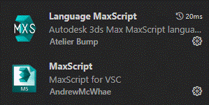
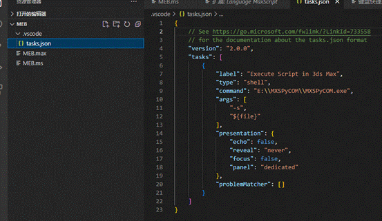
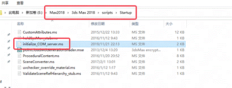
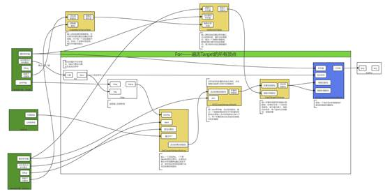
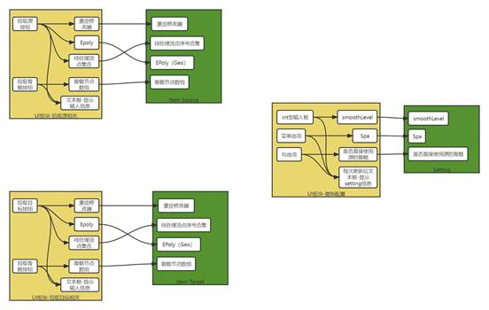
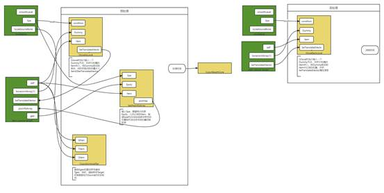
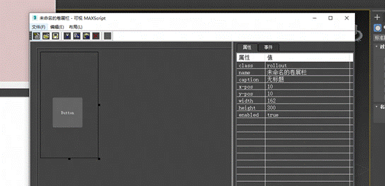
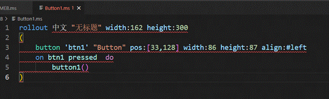
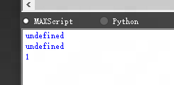

# Max工具开发学习笔记

已修复完毕。

后续如果继续使用MXS会持续更新。


---


# 前言

实习中需要制作Max工具。

在Maya中我使用Python编写脚本，Maya和Python适配得不错，写起来还算舒服。

但是查Max Python的时候，网上一片骂声。。。似乎适配得很垃圾，而且文档写得一坨。

没办法，只能慢慢学了。带薪学习，你还有啥不乐意的？

 

2023.5.9 留言：历时两周，我对Maxscript的评价非常低，属于是不如Py一根毛，编写体验非常差。

好不容易做出来了，也算是一种经验，还是好好记录下来吧。

 

---

 

# 环境配置——VS Code

相对于Maya而言，Max的环境配置**简单**很多。

1. **安装拓展：**

​	 

2. **下载链接器**

​	[MXSPyCOM](https://github.com/techartorg/MXSPyCOM)

​	链接器的作用是**使VSCode可以通过task命令直接让3DMax运行脚本**，是比较方便的存在。

3. **按照说明配置task**

​	文本直接从官方的wiki中复制，~~对于不同的IDE，有不同的方法。~~（我可去你的吧，后来发现其他IDE根本不支持写Maxscript）

​	 

4. 把本地服务器连接脚本放入Max启动文件夹

​		这个文件包含在下载的MXSPyCOM中

​		 

 

*注意：插件说明里的**语法高亮非常局限**！像预览界面那样的语法高亮是要自己配置的：

[配置方法参考](https://stackoverflow.com/questions/53735278/how-to-modify-the-editor-text-color-in-visual-studio-code/56171988#56171988)

官方只在Git里给了一个范例的配置文件，做得还不是很好，害我一直以为没起作用。。。

这个拓展的语法识别非常垃圾，经常**变量名、类名、函数名识别不准或者干脆识别不出来**。

然而在其他写码平台没办法写MaxScript，难搞。

总之编写Maxscipt的环境堪忧。😅

 

---


# 使用节点式思维

起初我认为制作这个工具的任务非常困难。一方面我根本不了解Maxscript，另一方面这个工具的逻辑其实还是很复杂的。

一开始玉玉了好几天，之后才慢慢沉稳下来开始推进开发进度。

果然还是得 **拆需求 。**是的，就是把任务分成一些小任务，然后分块、节点式地去一步步实现。

这么做的话，单独测试一些环节是很方便的，而且可以借助图更加清晰地记住和设计自己的思路。

首先需要制定一个核心或者说核心功能，比如在SCT工具中，拆需求拆到最底层，就是需要修改一个顶点的权重信息罢了，所以修改顶点权重信息的功能就是核心。

随后，就是去确认如何获取它的参数或者说条件，自底向顶地设计思路。

设计到一定程度后，也可以自顶向底地双向开发，可以早日发现一些问题。

跑通整个Flow后，就可以去定制输入信息、设计UI和输入信息的绑定、然后做输入数据的预处理、以及核心处理完成后的后处理，后处理结束后即可结束整个流程。

工作期间产出的每一个功能都作为一个节点，存储在一个库中。这个库就像Houdini的节点库，每一个函数都是一个节点。

一般，把必须的节点开发完毕后，就可以开始设计核心部分的程序，把一个最基本的Flow跑通。跑通后开始制作UI、添加功能、处理后处理和预处理逻辑，一般核心是不怎么变化的。

 

 

 

 

 

 

## 总结的方案

三个文件：

**OP.ms —— 保存节点函数以及定义所需要的数据结构体**

**Core.ms —— 保存链接OP的逻辑**

**UI.ms —— 保存UI组件的定义、UI值绑定和回调的绑定**

MXS中不可以嵌套Include（其他语言也不可以，因为include的本质是不对代码做任何处理，在编译时直接把include的文件复制到include语句的位置）（顺带一提，想了解一下Include和Import的知识，[关于Include 和 Import](../TA零散知识/TA零散知识.md##关于Include 和 Import)）

而这套流程可以适应这种情况，按照UI——Core——OP 的层级来include即可，上一级包含下一级。不需要重复引用，即UI include Core即可，不需要再 Include OP， 因为OP已经被 Core Included。

 

---

 

# Max Script基础


##  类比、特征、小总结和踩过的坑

1.   没有class、只有struct

2. 声明的函数名和变量名不能和内置的同名，**即使不小心同名了也没有提示的。**这会引发疑难杂症，NT Maxscript。

3. 双减号注释不能在脚本第一行行头

4. 不是严格缩进语言

5. 没有elseif

 

## 一段看懂Max Script流程代码

Max Script是**动态类型语言**、具有和Python差不多的强类型性（指强类型性不强）

关于动态类型语言和强类型性，查阅：[TA零散知识](../TA零散知识/TA零散知识.md#静态（类型）语言和动态（类型）语言、强类型性和弱类型性)

```vb
/* 这是注释，可以跨越多行 */
-- 这也是注释，以双破折号开头。这种注释不能在文件的第一行


-- 声明变量
myInt = 10
myFloat = 3.14159
myString = "Hello World"
myBool = true
-- 虽然定义很自由，但是还是有内在的类型的，比如：
-- 1/2 得到的是0，因为他们都是int型，如果想得到0.5，和C语言一样，需要：1.0*1/2，做一个类型转换


-- 输出变量值
print myInt
print myFloat
print myString
print myBool


-- 条件语句
if myInt > 5 then
  print "myInt is greater than 5"
else
  print "myInt is less than or equal to 5"


-- 循环语句
for i = 1 to 10 do
  print i


-- 函数定义(支持默认参数)
-- 定义函数关键字用fn也可以
function myFunction myArg1 myArg2 =
(
  sum = myArg1 + myArg2
  return sum
)


-- 调用函数。如果是无参函数，必须带括号（）
myResult = myFunction 2 3
print myResult
```


## 面向对象语法基础

没有类的概念，只有结构体的概念。

结构体可以添加成员函数，和类区别不是特别大。

```vb
-- 定义结构体
struct Person
(
  name = "",
  age = 0,
  gender = ""
)


-- 创建一个Person结构体实例
person1 = Person name:"John" age:30 gender:"male"

-- 输出person1的信息
format "Name: %, Age: %, Gender: %\n" person1.name person1.age person1.gender

-- 修改person1的信息
person1.name = "Jane"
person1.age = 25
person1.gender = "female"


-- 再次输出person1的信息
format "Name: %, Age: %, Gender: %\n" person1.name person1.age person1.gender
```

 

## Case Of

也是条件语句，类似C#的switch case

```vb
a = 1
case a of(

  1:(
    print "1";
    print "2";
  )

  2:(
    print "a";
    print "b";
  )

  default: print "A";
  
)

takasa = 0
case takasa of(
    
  (takasa < 0 ):$pos.z = 10
  (takassa == 0 ):$pos.z = 20
  (talasa > 0):$pos.z = 30
    
)
```

 

## Try

```vb
-- 有try必须有catch
try(
  select $nothing
) 
catch (
  format "不存在这个名字的东西"
)
```

  

## For详解

```vb
-- 基本For循环
for i = 1 to 10 do 
(
  Print i;
)


-- 遍历列表
t = #(1,2,3,4,5)
for i in t do
(
  Print i;
)


-- 带continue和exit的循环
for i in t do
(
  if i == 1 then 
  (
    continue;
  ) 
  if i == 3 then (
    exit;
  )
  Print i;
)
```

 

## 基本字符串和列表的匹配和操作

[CSDN](https://blog.csdn.net/liweizhao/article/details/129220305?ops_request_misc=&request_id=&biz_id=102&utm_term=Max Script&utm_medium=distribute.pc_search_result.none-task-blog-2~all~sobaiduweb~default-0-129220305.nonecase&spm=1018.2226.3001.4187)


## 跨文件引用

要注意不能嵌套引用，否则报错卡住。

比如A.ms中include B.ms，则B.ms中不可以再include A.ms

```vb
-- MEB_Lib.ms

function Test arg:"Hello World" = (
  print(arg)
)
```

 

```vb
-- MEB.ms

include "MEB_Lib.ms"
Test()

-- Hello World
```

 因为include本质是直接复制被引用文件的代码，所以天然支持热更新，好文明。

关于include和import，查阅：[关于Include 和 Import](../TA零散知识/TA零散知识.md#关于Include 和 Import)


## 类型转换

```vb
a = 1
1

a as string
"1"

a = "1"
"1"

a as float
1.0

a = "1.0"
"1.0"

a as integer
1
```

 

## Mapped Function

这种函数**第一个参数必须是列表类型**，在执行时，会**自动遍历列表的每一个项，代替第一个参数**进行函数体的计算。

列表有多少个项，这个函数就会执行多少次。就是一个**自动遍历的函数**，挺方便的。

```vb
mapped fn MulForList listItem mul = (
  Print(mul * listItem)
)


List = #(1,2,3,4,5)
MulForList List 2
```

 

## 数组 和 无序不重复集合

我以前都不太用集合，直到这次需要编写工具，Max中选中点的操作，得到的是集合而非数组。

于是了解了一下集合，发现是一种基于哈希的数据结构。(但是MXS中没有哈希表。。。[MXS中没有哈希表](#MXS中没有哈希表))

于是猛补了一波哈希相关的知识，挺有意思。

查阅：[哈希](../TA零散知识/TA零散知识.md#哈希)

 

**数组主要用于存储信息，而集合主要用于遍历和判断。**

 

以下是GPT给的数组和集合的常用方法:

### 数组的常用方法

数组的一些具有MXS特色的其他用法：[知乎](https://zhuanlan.zhihu.com/p/113396008)


**创建和访问数组**

```vb
myArray = #("apple", "banana", "orange") -- 创建一个数组
print myArray[2] -- 访问数组中的第二个元素
```


**添加和删除元素**

```vb
myArray = #("apple", "banana", "orange")
append myArray "pear" -- 添加一个新元素到数组中
delete myArray[2] -- 删除数组中的第二个元素
```

 

**遍历数组**

```vb
myArray = #("apple", "banana", "orange")
for i = 1 to myArray.count do (
  print myArray[i]
)
```

 

**数组排序**

默认从小到大

```vb
myArray = #("apple", "banana", "orange")
sort myArray -- 对数组进行排序
print myArray
```

 

**数组查找**

？这用法还是第一次见，直接抄过来的我都没仔细看

```vb
myArray = #("apple", "banana", "orange")
if findItem myArray "banana" != 0 do (
  print "The array contains 'banana'."
)
```

 

### 集合的常用方法

**创建和访问集合**

```vb
mySet = #{"apple", "banana", "orange"} -- 创建一个集合
if "banana" in mySet do ( -- 检查集合中是否包含特定元素
  print "The set contains 'banana'."
)
```

 

**添加和删除元素**

```vb
mySet = #{"apple", "banana", "orange"}
mySet[#"pear"] = true -- 添加一个新元素到集合中
mySet.delete "banana" -- 从集合中删除一个元素
```

 

**遍历集合**

```vb
mySet = #{"apple", "banana", "orange"}
for elem in mySet do (
  print elem
)
```

 

**集合交集、并集和差集**

```vb
set1 = #{"apple", "banana", "orange"}
set2 = #{"orange", "pear", "kiwi"}

intersectSet = intersect set1 set2 -- 求两个集合的交集
unionSet = union set1 set2 -- 求两个集合的并集
diffSet = difference set1 set2 -- 求两个集合的差集
```

 

## 使用全局变量

类似Python，定义时需要加上global，但是使用时不需要。

```vb
-- 定义
global source = Item();
global target = Item();


-- 此处为其他文件
-- 直接通过名称访问
source.geo = $suits
target.geo = $student
```

我认为这也是直接导致MXS命名冲突问题严重的罪魁祸首。


---

 

# UI界面

与Maya不同，Max提供了一个UI编辑器让开发者轻松布局UI。

去他妈的，这东西特别垃圾。

因为当你想要再次打开这个UI脚本的时候，是打不开的，说这不是有效的二进制脚本，必须使用vms的格式才行。

鸡肋，还是得自己写ms。

 

默认的“name”是中文名，打开会无法编译，乱码。

需要自己手动改一下，还挺麻烦。

 

需要一个语句来呼出窗口。如下：

```vb
rollout UI "权重复制工具" width:500 height:500
(
  pass
);
createDialog UI;
```

Maxscript在布局上比Maya好写,很像安卓开发，比较面向对象。

MXS的回调都可以在可视化Maxscript的窗口中查看，非常容易使用。

```vb
button btn_getTarget "拾取目标" pos:[10,160] width:125 height:30
on btn_getTarget pressed do (
  GetItem target
)
```

定义过的UI组件可以通过代码修改其属性

 `UI.sourceInfoText.text = "Source geo:" + source.geo as string + "\n";`

常用语句参考：[知乎](https://zhuanlan.zhihu.com/p/437777843)

 

---


# MXS中没有哈希表

在TA零散知识中，我了解了哈希在高级编程语言中的用处。

查阅：[哈希](../TA零散知识/TA零散知识.md#哈希)

哈希算法在高级编程语言中是非常常用的。

比如常见的字典、集合，本质都是哈希表。

在查询时，键值通过哈希算法得到哈希值，再通过哈希值寻址找到数据的位置。得益于精妙的算法，这个步骤非常快。

所以在想要用哈希表的时候，用别的东西来替代吧。

在MXS中，**最常用的就把数据映射到顶点ID或骨骼ID等int型数据，此时就可以使用数组。**

**MXS中的数组和常规的数组不一样**，在应付这种情景还是比较好用的。但是如果键不是int型就比较麻烦了


## 关于数组

Maxscript中的数组很怪。以下说几点：

1. **定义的时候不需要说大小**

2. **赋值的最大索引就是这个数组的长度**

3. **可以不按顺序赋值**

**一图看懂：**

```vb
dic =  #()
dic[3] = 1

print(dic)
```

 

这样使用数组的话可以快速地查询信息，比如把顶点的索引、或者骨骼ID的索引作为Key，这样去**查值是极快的**，而且**不用受连续自然数这样的限制**，可以只在自己需要的索引处赋值。

 

---

 

# 求两点距离

应该是不管几维向量都可以

`tv.distance = distance pos spos;`

 

---


# 添加项目到数组

这明明是List的做法。。。

`append tempVertexList tv;`

 

---

 

# 自定义规则排序

```vb
-- 定义排序规则函数
fn sortFunc a b = (
  case of (
    (a.distance < b.distance): -1; -- 必须用1或者-1表示是或者否，否则报错
    (a.distance > b.distance): 1;
    default: 0;
  )
)

-- 给临时结构体按照距离排序
qsort tempVertexList sortFunc;
```


---

 

# 修改器API

修改一般都针对于某修改器。比如想要修改顶点位置则要针对Epoly或者其他Geo、要修改权重就要针对Skin修改器。

此时一般MXS会给一个XXOps的类来提供帮助，内含一些可能会用到的API。

可以试着从这个方向出发，毕竟他们的文档真的太垃圾了，搜索就是一坨。

`boneCount = skinOps.GetNumberBones skin;`

其次，别看Ops类会传入修改器实例作为参数，实际使用时，仍然**必须选中这个修改器实例**！（指在Max的UI中，必须选中这个修改器）否则计算结果会混乱错误，这个是测试过的。

真的是垃圾，怎么会有这么脑瘫的设计。

```vb
-- 遍历所有目标顶点，该阶段全部处于Source的Skin面板下
-- 通过语句把面板换到指定的修改器，避免使用Ops类时出现错误
modPanel.setCurrentObject source.skinModifier
for t in target.verts do ( --虽然target.verts是集合，但是以这种方式遍历，t为int型的顶点序号
  pass
)
```

 

---

 

# 一个模拟重心坐标加权求平均的方法

捏妈，重心坐标不好算，于是我自己弄了一个模拟算法。

简单来说，对于：**（（值X权）+ （值X权）+ 。。。）/ 总权** 这样的基本权重计算公式，在这种情况下，**权值等于（1 - 距离 / (所有值的距离总和)）**，**总权等于项数-1.**

对于只有一个值的情况需要做特殊处理，因为这会导致分母为0.

这个算法可以根据距离求平均，距离越小的点对均值影响越大，均值不会超过最大值。

还算能用？但是效率会有点低，因为需要先遍历一遍计算总距离，再遍历一遍算平均。

 

---

 

# 获取顶点UVW值

`uvw = meshop.GetMapVert mmesh mySetting.UVSet vertexID;`

 

---

 

# 用保存代替查询

查询次数多了效率是非常低的，比如需要多次查询多个顶点的权重、顶点位置等信息，这是非常耗时的。

不如在一次查询中、或者在预处理中就把需要的数据全部读取下来保存到内存，然后再进行处理和写入，这才是合理的做法。

 

---

 

# 使用Format输出

妈的，刚学了Python的Logging却没有用武之地。

在MXS中，只有Print函数负责输出内容到控制台。特别不好用，但是搭配Format函数基本还算能用。

```vb
Print (
    Format "骨骼关联结果:============================================\n"
    Format "boneNameTable: %\n" boneNameTable
    Format "boneIDTable: %\n" boneIDTable
)
```

 

---

 

# 使用函数声明

有时候会出现**两个函数循环引用**，这时不管先定义了谁，先定义的都会报错，因为先定义的引用的函数还没定义。

在MXS中的解决方案是使用函数声明，方式是：

`fn ReflashInfo = ()`

作用的方式**和C语言基本是一样**的。

 

---

 

# Trick：空集改全集

我居然会想要记这个？猪脑实在记不住东西了属于是。

```vb
item.verts = polyop.getVertSelection item.geo
x = polyop.getNumVerts item.geo
-- 如果verts是空集，把它改成全集
if item.verts.count == 0 then item.verts = #{1..x}
```

 

---

 

