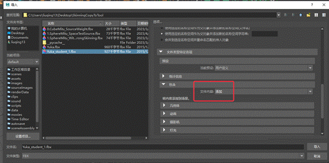

# Maya工具开发学习笔记

由于工作需要实习工作需要，开始学习Maya工具开发


Part1转载自我的有道云，代码块识别不出。。。

修复中。。。


---


# Python基本通识

恨啊，当初没有好好学，现在看很多地方都需要Python。看上去比较好上手，慢慢不上不了解的地方吧。

 

## form import、导入其他文件内的函数

```python
# helper.py

def square(x):

  return x ** 2

 
# main.py

from helper import square

 

result = square(5)

print(result)
# Output: 25
```

import后面是可以**加逗号然后并列**添加的，就可以一次导入多条函数。

如果想导入文件中的**所有函数**，使用**通配符***，from helper import *

关于通配符，可以参考：[通配符](##通配符)。


## 关于Python的导入缓存导致的模块热更新失效问题

由于Python自身的优化机制，在文件中导入其他模块时，Python会**缓存导入的模块**。这导致如果我更改了被引用模块，这个更改将不起效果，因为文件使用的是旧的缓存的模块。

为了解决这个问题，可以使用：

```python
import imp

import Main

imp.reload(Main)
```

这样的方式来**强制重新导入文件。**

虽然可能**降低效率**，但是能**解决热更新的问题**。

在基本确定不更改后，可以删除重新导入命令。

 

## 元组和列表

之前一直没有很好的理解，只知道元组可以放任何类型。

GPT讲述：

Python中的元组和列表都是容器类型的数据结构，用于存储多个元素，但它们有着不同的特点。

**元组（tuple）：**

- 元组是**不可变**的，即一旦创建就不能修改。

- 元组使用小括号**()**来表示，元素之间用逗号分隔。

- 元组可以包含任何类型的数据，包括其他元组。

- 元组支持索引和切片操作。

**列表（list）：**

- 列表是**可变的**，可以动态添加、删除、修改元素。


   - 列表使用方括号**[]**来表示，元素之间用逗号分隔。


   - 列表可以包含任何类型的数据，包括其他列表。


   - 列表支持索引和切片操作，同时还支持排序、插入、删除、统计等操作。

**共同点：**

- 都是容器类型的数据结构，用于存储多个元素。

- 都可以包含任何类型的数据，包括其他元组或列表。

- 都支持索引和切片操作。


**不同点：**

- 元组是不可变的，而列表是可变的。

- 元组使用小括号()来表示，列表使用方括号[]来表示。

- 元组不能添加、删除、修改元素，而列表可以。

- **元组相对于列表来说更加轻量级**，所以在需要不可变序列的情况下，使用**元组会更加高效**。


## 魔术方法、特殊方法

常见的被双下划线包住的方法就是魔术方法，它们很像Unity内置的各种回调，你只要写这个函数的内容，这个函数会自动在指定的条件下被调用。

如：

```python
class People(object):

	# 创建对象
	def __new__(cls, *args, **kwargs):

    	print("触发了构造方法")

    	ret = super().__new__(cls) # 调用父类的__new__()方法创建对象

    	return ret ## 将对象返

 	# 实例化对象W
	def __init__(self, name, age):

   		self.name = name

   		self.age = age

   		print("初始化方法")

 	# 删除对象

 	#  del 对象名或者程序执行结束之后

	def __del__(self):

    	print("析构方法，删除对象")
	
    # 特殊变量，__name__是这个模块的名字

	if __name__ == '__main__':

  		p1 = People('xiaoming', 16)
```

 

## 保护变量和私有变量

默认的变量声明是公开的，类内类外都可以访问。

**单下划线开头的变量是保护的，类外可以访问，但不应该访问**，因为之前的开发者不希望你访问，纯看自觉。

**双下划线开头的变量是私有的，类外可以访问，但是访问时需要做一步处理**，同上，开发者不希望你访问。

```python
class test :

  _test = 1

  __main = 2

 

def main() :

  te = test()

  print (te._test)

  print (te._test__main)

# 可以成功打印

# 对于双下划线开头变量，需要在访问时在变量名前加上“_所属类名”
```

 

## 函数返回类型声明

**Python不指定函数返回类型**，想返回什么就返回什么，也可以不返回直接结束。

在Python3.5之后，开发者可以在函数声明中加入**返回类型注解**，类似注释，有没有都**不会影响代码的编译**。

编写注解后，能在调用该函数的地方看到返回类型的提示，仅此而已。

```python
def add(x: int, y: int) -> int:

  	return x + y
```

 

## 关于pass占位符

有时候一个函数就是不需要任何内容，但是它又必须被声明和定义，那里面写什么呢？

Python又不认可空行，只留下空行的话解释器会报错，这时候写下占位符pass即可：

```python
if True:

 	pass

  	print("Hello, world!")
```

需要注意，如果写了pass，后面的代码就不会再运行了。

 

## 关于参数顺序

如果你在调用函数时指定参数的名称，是可以随意打乱参数的顺序的，这叫做关键字参数。表现上很像Maya大部分cmds函数的flag形式。

```python
def my_func(a, b, c):

  print(a, b, c)

 

# 关键字参数

my_func(c=3, a=1, b=2) #输出 1 2 3

 

# 默认参数

def my_func(a, b=2, c=3):

  print(a, b, c)

 

my_func(1) # 输出 1 2 3

my_func(1, c=4) # 输出 1 2 4
```

 详细请看下一条目，无名参数和有名参数.


## 关于无名参数和有名参数

用cmds的API的时候，发现这个函数声明看不懂，于是问了GPT，才知道Python还有有名参数和无名参数这么一说。

 

*args是无名参数列表、**kwargs是有名参数字典（关键字参数）。

```python
def fun (*args, **kwargs) :

  	pass

 
fun(1,2,3,a = 1, b = 2, c = 3)
```

如上函数声明和调用，前三个是无名参数，后三个是有名参数（关键字参数）。

*和**是解包运算符，用于把列表和字典解包成参数列表，这样才能适配上各种情况下的调用。

在上面这种情况下，**args是一个列表，kwargs是一个字典，可以用于遍历。**

在定义中使用**kwargs之后，还是可以继续添加参数的：

```python
def fun (*args, **kwargs, name = "Init") :
  	pass

fun(1,2,3,a = 1, b = 2, c = 3, name = "111")
```

**根据规范，调用函数时一般无名参数在前，关键字参数在后，交替出现可能会出现匹配不上的问题。**

 

## 关于装饰器

这是Python特有的功能，当一个函数上面有@……的标志，代表这个函数被装饰了，真实运行的函数不是这个函数，而是被装饰后的函数。如下范例：

```python
# 装饰器定义函数
def my_decorator(func):
    # 定义包裹函数
  	def wrapper():
        # 使用两条Print语句包裹原函数
    	print("Before the function is called.")
    	func()
    	print("After the function is called.")
	#将重新定义后的函数返回
  	return wrapper

 

# 呼叫装饰器，此函数不再按照原函数运行
@my_decorator
def say_hello():
  print("Hello!")

 

say_hello()
# 输出：
# Before the function is called.
# Hello!
# After the function is called.
```

这么做会**降低代码的可读性**，毕竟你把其他部分弄出去了，不是所见即所得。但是在一些特殊的情况下，如：不太方便修改源码、只能通过加码的方式修改功能时，还算能用。

 

## 关于拉姆达表达式

C#中拉姆达表达式是这样：

`var fun = (a,b) => {print(a,b);};`

fun是一个委托类型，它保存一个函数。后面的a => {print(a);}是一个拉姆达表达式，a和b是参数，后面是函数体。

Python则这样写：

`fun = lambda a,b : print(a,b)`

Python中拉姆达表达式只能有1行，返回值的类型就是这个表达式的值。

 

## 关于长名和短名

根据Python的优良传统，调用函数时，若使用关键字参数，常使用关键字的短名（1~3个字母）（用长名也不会出问题）。

我很好奇这是怎么实现的，于是问了一下ChatGPT。

**直接链接长短名：**

```python
def Say(**kwarg) : 

  	\# 先试着get这个s，如果没有就试着get这个str

  	str = kwarg.get('s', kwarg.get('str', None))

  	print (str)

 
Say(str = "str")

Say(s = "s")

# Output:

# str

# s
```

这个方法相对较快，但是可能会出现同时使用长短名的问题，限定方面会出现一点困难。

 

**使用装饰器实现：**

```python
def SayShortName(Say):

  	def wrapper(**kwarg):

    	if 's' in kwarg:

      		kwarg['str'] = kwarg.pop('s', None)

   			Say(**kwarg)

  	return wrapper

 

@SayShortName

def Say(str) : 

  print (str)


Say(str = "str")

Say(s = "s")

# Output:

# str

# s
```

其实很好理解，就是使用装饰器修改一下原函数，并做一步判断：如果关键字参数字典中使用的是长名，就不动它，如果关键字字典中使用的是短名，就把短名拿到的值赋给长名的键，然后删除短名键值对避免多出一个参数（pop函数的功能就是删除并返回值），然后用处理过的参数去运行被装饰的函数就行了。

这个方法还是相对复杂，而且会降低一些代码的可读性，毕竟需要多写一个函数并做标记。

 

**Maya中的实现方式**

我又去Maya里测试了一番，发现即使同时使用长短名也不会报错，此时已先出现的为准，先用了短名就由短名决定这个flag的值。

结合Maya函数的声明，可以猜测Maya使用的是上述的第一种方式。

 

## 获取列表长度

`len(sl)`

和面向对象的sl.len的方法不同，每次我都搞错……

 

## 类型转换

类似C#

`string_num = "123"`

`int_num = int(string_num)`

 

## Logging

**仅使用print和cmds的warning和error是低效且不规范的。**

在一个工具项目中，我定义了一个变量DEBUG，用于控制开发者模式下的Log和Debug输出，这导致每次Log都需要再写一行if，非常的麻烦。

询问GPT解决方案后，发现Python有一个叫做Logging的内置库。

总结：

   

 

Handler可以玩得很花：

1. StreamHandler：将日志消息输出到控制台
2. FileHandler：将日志消息输出到文件
3. RotatingFileHandler：将日志消息输出到指定的文件，可以限制文件大小，达到一定大小后自动切割文件
4. TimedRotatingFileHandler：将日志消息输出到指定的文件，可以根据时间进行切割，比如每天或每小时切割一次
5. SocketHandler：将日志消息发送到指定的网络地址和端口
6. SMTPHandler：将日志消息发送到指定的邮箱地址

 

logging也可以用在Maya的脚本开发中，效果如下：


只不过，输出的字符串在Maya中会再做一步处理，头部会加上# 

并且，Maya会独立输出一行（在logging之后），标注输出的文件和输出内容。

**重复令人烦躁，可以通过调整Handler避免把信息输出到终端，因为终端的信息会同时被Maya和终端打印，造成重复。**

 

**要注意：**

如果Log带**中文，需要py文件首行注释文件编码方式**，如：# encoding: gbk。

在Maya使用时，由于缓存等持续运行机制，旧的Logger不会被自动删除，这导致同一个信息会被多次输出，为了解决这个问题，可能需要删除一下旧的Logger：

```python
logging.Logger.manager.loggerDict.pop(__name__, None)
logger = logging.getLogger(__name__)
```

 

## 通配符

阉割版正则表达式，可以做**简单的字符串匹配**。

在常用的场合，作为一个条件被使用。

比如：

 通过名字筛选出所有的Source

`source = cmds.ls("S_*", type = "transform")[0]`

表示用`“S_*”`为条件去筛选场景中的所有物体，`“S_*”`表示物体名必须以“S_”开头，后面是什么都无所谓。

 

GPT说明的常用场景：

在Python中，通配符常用于文件路径的匹配，例如使用

glob模块的通配符来查找符合某个模式的文件名或路径名。例如，

***.txt表示匹配所有以.txt结尾的文件名；**

**?表示匹配一个字符；**

**[abc]表示匹配字符a、b或c中的任意一个。**

通配符也可以用于数据处理中的筛选和过滤。

 

## Try

与其他高级编程语言类似的，Python也有异常抛出机制：

```python
# 通过名字筛选出所有的Target
try:
  # 可能会引发异常的代码
  x = 1 / 0
except ZeroDivisionError:
  # 处理 ZeroDivisionError 异常
  print("除数不能为零")
finally:
  # 无论异常是否被引发，都需要执行的代码
  print("程序结束")
```

如果想要捕获特定类型的错误：

- SyntaxError：代码语法错误。

- NameError：尝试访问不存在的变量或函数。

- TypeError：操作或函数应用于不适当的数据类型。

- ValueError：操作或函数应用于正确类型的数据，但该数据具有不合适的值。

- ZeroDivisionError：试图在除数为零的情况下执行整数或浮点数除法。

- IndexError：尝试访问列表、元组或字符串中不存在的索引。

- KeyError：尝试访问字典中不存在的键。

- AttributeError：尝试访问对象不存在的属性或方法。

- ImportError：无法导入指定的模块或包。

- FileNotFoundError：尝试打开不存在的文件。


如果**不知道错误什么类型**，反正都想捕获，那么**except后直接写冒号**即可。

 

## 在一行中使用if语句

`item = source if args[0] == "source" else target`

类似C#中 A ： B ？ Bool的用法

 

---


# Maya　Python脚本中的UI

UI是工具重要的一环。

Maya的UI组件主要通过Maya.cmds来创建和控制。

UI组件的布局逻辑和之前学Android开发的很像，使用行、列布局等嵌套，最终形成一个完整的布局。

下面我会陈列一些范例：

## 创建窗口

```python
window = cmds.window("UV FLow To", title= u"UV流向工具", widthHeight=(200, 180))

cmds.showWindow(window)
```

[官方文档](https://help.autodesk.com/cloudhelp/2018/CHS/Maya-Tech-Docs/CommandsPython/window.html)

注意：

1. 创建的窗口不会自动显示，必须搭配cmds.showWindow（）才可以显示

2. 第一个参数是字符串类型，代表窗口对象的名称，也是它的唯一标识符。

3. 窗口常常需要检查重复开启，如下代码

```python
# 如果窗口已经存在，就删除

if cmds.window("UV FLow To", exists=True):

 	cmds.deleteUI("UV FLow To")
```

 

## 关于布局

UI中常见的布局有：行布局：rowLayout、列布局：columnLayout、行列布局：rowColumnLayout、表单布局：formLayout

这些布局都可以相互嵌套。

其中，表单布局比较特殊，它用于制作一些自定义程度更高的布局，其基本思想为：把每个其内含的子布局抽象成一块方形区域，然后控制这个方形的每一条边，指定这些边的吸附到的地方。指定其吸附目标的方式有好几种，如：吸附到窗口边缘、吸附到其他组件、吸附到指定的位置、等等。具体的操作方法可以参考官方的文档，相对复杂，但是可以使得UI组件跟随窗口缩放，比较美观。

 

## 关于cmds.SetParent（）

[官方案例](https://help.autodesk.com/cloudhelp/2018/CHS/Maya-Tech-Docs/CommandsPython/setParent.html)

> GPT总结：
>
> 1.   默认的当前工作区域是窗口内，可以直接在窗口中添加组件或布局。
>
> 2. 创建布局后，工作区域会转移到新创建的布局内，此时新建的组件会处于该布局内。
>
> 3. 一些特殊的组件创建后，如Menu组件，会改变当前工作区域到组件自身。
>
> 4. 可以使用SetParent()函数来更改当前工作区域到指定的区域，从而在之前定义好的布局内添加组件。
>
> 5. setParent("..")常被用作结束一个布局，因为“..”代表当前工作区域的父级。
>
> 6. 使用setParent()函数时，需要将目标参数设置为组件对象，可以通过cmds.menu()等函数创建组件对象，也可以通过q和e的查询和编辑标志来访问已有的组件。

 

当创建了窗口，默认的当前工作区域就是窗口内，此时我直接通过cmds.button()等组件或者布局的生成代码，即可在窗口中添加组件或者布局，不需要在函数中指定生成的工作区域。

当我创建了布局，默认的工作区域就会转移到新创建的布局内，此时我再新建组件，组件则处于新建的布局内。部分组件创建时也会改变工作区域到组件自身，如Menu组件，创建后工作区域移动到Menu组件中，此时直接用cmd创建MenuItem，创建的MenuItem默认归属于当前Menu组件。

 

可是，我会需要结束一个布局，或者在之前定义好的布局内再加组件，怎么办？

此时就需要使用SetParent()函数来更改当前工作区域到指定的区域，运行该语句后，当前工作区域会被移动到参数指定的工作区域内。

setParent("..")常被用作结束一个布局，因为“..”代表当前工作区域的父级，当把工作区域从正在编写的布局移动到布局外，不就是结束一个布局吗？很好理解。

 

需要注意，setParent("..")的目标（args）参数需要是组件对象（menu、layout、window等，虽然它们的本质还是String），这些组件对象可以按如下方式获取和使用：

fileMenu = cmds.menu( label='File')

cmds.setParent( fileMenu, menu=True )

当然，我应该也可以用q和e的查询和编辑标志来访问已有的组件。

 

## TextFiled文本框

 

我是作为用于调试的补充信息显示使用，可以设置为不可编辑，里面的文本内容应该是支持读写的。

 

## Button按钮

常用可以设置大小、显示，使用command链接回调，也可以使用字符串作为函数对象（如果够简单的话）

cmds.button(label=u"拾取定位器", command = ChooseLocator, width=200, height=50)  

button函数会给command的链接函数一个参数，但是我不知道这个参数是做什么的，如果没有这个参数，在Maya中会报错。

```python
import maya.cmds as cmds

 

def Test(*args):

  for i in args:

    print(i)

    \#输出结果是False，意为不明

 

cmds.window("TestForB", widthHeight=(200, 200))

cmds.columnLayout()

cmds.button(label="Test", command=Test)

cmds.showWindow()
```

有时候需要给command的函数加参数呢，上面这种写法就行不通了，因为单独的函数名可以被解释为函数，但是如果加上括号和参数，那么这一串就被解释为这个函数的返回值了，所以应该怎么做呢？

答案是使用拉姆达表达式，很优雅：

```python
# 一键拾取按钮 

cmds.button(l='一键拾取', command = lambda x : select_objects('Joints'), w=80, h=80)
```

 

## optionMenu菜单选项

常见的菜单下拉选项

通过changeCommand的flag修改链接的函数

通过cmds.menuItem(label="XY")加入菜单中的项

会自动把menuItem的label当参数传入

之前讲setParent的时候说了，optionMenu这种特殊的组件会自动把工作层级转移到自己，所以此时新建的UI元素menuItem会归属于自己；正因会自动更改工作层级，所以不要忘记在结束添加Item项后，把工作层级重新设定会父级。

```python
cmds.optionMenu(label=u"投影方式", width=200, height=50, changeCommand= ChooseProjetPlane)
cmds.menuItem(label="XY")
cmds.menuItem(label="YZ")
cmds.menuItem(label="XZ")
cmds.setParent("..")

def ChooseProjetPlane(se):
	if(se == "XY")
    pass
```

 

## 分割线

`cmds.separator(h=10, style='shelf')`

注意，分割线只有在它的父布局设置为：adjustableColumn = 1的时候才能被看见

 

---


# 关于创建模式、查询模式、和编辑模式

 

关于这三个模式，资料不多，我的了解很少，完全靠自己的理解总结，很可能出现错误。

其实一个API可以做很多事情，如Window函数可以创建窗口、修改现有窗口的长宽、可以查询一个窗口的存在与否。根据目标行为的性质，可以判断出需要哪一个模式。**有些API会有默认的模式**。比如Window默认是创建模式，GetAttribute默认是查询模式。

所处的模式不同，API表现出的功能也会不同。比如Window函数，若不对模式作修改，则默认会创建一个窗口对象，但若我修改标志e=1,即转到编辑模式，就可以对目标窗口进行更改。

修改API的模式的方式也很简单，**查询：q=1、编辑：e=1**。**至于C和M，实例中发现报错说没有这两个flag。**目前还不太清楚是怎么回事。

 

---


# 脚本开发中的常用Maya的Python模块


## maya.cmds

对Mel命令的封装，所有**Mel命令**能做到的事cmds都可以做到。

主打一个**面向过程**编程。

```python
#GPT示例代码：
import maya.cmds as cmds

# 创建一个立方体
cmds.polyCube()

# 将立方体移动到特定坐标
cmds.move(2, 3, 4)

# 打印立方体的位置
print(cmds.xform(q=True, t=True))
```

 

## pymel.core

第三方开发但是现在已经招安，是**cmds的面向对象版**。

很有面向对象的味道，是我喜欢的类型。

坏就坏在不是官方开发的所以没有官方文档，以下是开发者文档：[文档](https://help.autodesk.com/cloudhelp/2018/JPN/Maya-Tech-Docs/PyMel/index.html)（为什么官方说了不支持，结果文档的网址前缀还是AutoDesk啊！傲娇吗？？）

```python
# GPT示例代码：
import pymel.core as pm

# 创建场景
pm.newFile(force=True)

# 创建两个球体
sphere1 = pm.polySphere()[0]
sphere2 = pm.polySphere()[0]

# 移动球体位置
sphere1.translate.set(2, 0, 0)
sphere2.translate.set(-2, 0, 0)
 

# 创建材质并应用于球体
mat = pm.shadingNode('blinn', asShader=True)
mat.color.set(1, 0, 0)
pm.select(sphere1)
pm.hyperShade(assign=mat)
mat = pm.shadingNode('lambert', asShader=True)
mat.color.set(0, 1, 0)
pm.select(sphere2)
pm.hyperShade(assign=mat)

# 渲染场景
pm.render()
```


## maya.OpenMaya

更底层的类，可以做到目前没有被Maya定义在mel中的事。

似乎走的也是面向对象的思路。

```python
#GPT示例代码：
import maya.OpenMaya as om

# 创建立方体
cube = om.MFnMesh()
points = [(-1, -1, -1), (1, -1, -1), (1, 1, -1), (-1, 1, -1), (-1, -1, 1), (1, -1, 1), (1, 1, 1), (-1, 1, 1)]
vertices = []
for point in points:
	vertices.append(cube.addVertex(om.MPoint(point)))
faces = [(0, 1, 2, 3), (4, 5, 6, 7), (0, 1, 5, 4), (1, 2, 6, 5), (2, 3, 7, 6), (3, 0, 4, 7)]
for face in faces:
	cube.addPolygon(vertices[face[0]], vertices[face[1]], vertices[face[2]], vertices[face[3]])

# 移动立方体
cubeTransform = om.MFnTransform()
cubeTransform.setTranslation(om.MVector(2, 2, 2), om.MSpace.kWorld)
```


## maya.api.OpenMaya

beta版的OpenMaya。

可见是比较底层了，目前还看不太懂喵。

```python
# GPT实例代码：
import maya.api.OpenMaya as om

# 创建一个新的空transform节点
sel = om.MSelectionList()
sel.add('pSphere1')
dagPath = sel.getDagPath(0)
fnTransform = om.MFnTransform(dagPath)
newTransform = fnTransform.create()

# 设置节点的属性值
newTransformFn = om.MFnTransform(newTransform)
newTransformFn.setTranslation(om.MVector(2.0, 0.0, 0.0), om.MSpace.kWorld)

# 创建一个新的mesh节点并将其绑定到transform节点上
meshData = om.MFnMeshData().create()
meshFn = om.MFnMesh()
newMesh = meshFn.create(4, 4, [om.MFloatPoint(0, 0, 0), om.MFloatPoint(1, 0, 0), om.MFloatPoint(1, 1, 0), om.MFloatPoint(0, 1, 0)], [4, 4, 4, 4], meshData)
meshTransformFn = om.MFnTransform(newTransform)
meshTransformFn.addChild(newMesh)

# 获取节点的属性值
translation = newTransformFn.translation(om.MSpace.kWorld)
print('Transform Translation: {}'.format(translation))
numVertices = meshFn.numVertices()
print('Mesh Num Vertices: {}'.format(numVertices))
```

 

## maya.mel

maya.mel 是 Maya 中的一种模块，它是 Maya Embedded Language（MEL）的缩写。MEL 是一种脚本语言，用于自动化和简化 Maya 中的任务。通过使用 MEL 脚本，用户可以快速地创建自定义工具和脚本来自动化重复性的任务，提高工作效率。maya.mel 模块包含了许多 MEL 命令和函数，可以在 Python 脚本中使用。

最常用的应该是这个吧：

`mel.eval("polyFlipUV -flipType 0 -local on;")`

用于在Python中直接运行mel语句。

 

---


# 关于使用VsCode编写Maya的Python脚本的流程方案

舒服的开发环境可以让人愿意写代码不是吗？


## 遇到的困难和历程

**Maya的脚本编辑器**跟记事本有什么区别吗？没有，**垃圾！**

所以必须要使用其他IDE编写Maya的Python脚本才是一个合理且有效率的流程。

首先的问题是**库的链接**。要让IDE能识别Maya的cmds等库，则需要让IDE链接到库。这一点比较顺利，在IDE的Pytrhon的拓展的Seting中，添加Maya安装路径下的开发工具库的路径即可。

然后迎来的问题是**Send的时效性**，Send命令可以直接在IDE中通过快捷命令让Maya运行该脚本，但是这个链接非常玄学，每隔一小段时间就会断链，然后需要重启Maya才能重新连上。断链的原因至今未知。

随后的问题是**中文编码问题**，当我在IDE中编写中文注释、或者字符串中包含中文，在IDE中观察没有问题，但是在Maya中观察，文字出现乱码现象。对于这个问题，最终的解决方案是更改IDE中，对文件的编码模式，使用GBK模式保存Py文件后，在Maya中观察文本正常。

然后遇到的问题是，**跨文件引用的无法热更新**的问题，这个问题最终通过重新引用模块解决。也就是在引用其他文件模块后，使用：

```python
import imp
import Main
imp.reload(Main)
```

这样的方式来解决。

然后遇到的问题是，如果是**跨文件引用，被引用的文件若包含中文，Maya报错**。解决方案是在脚本的头部写上编码形式的注释，如下：

```
# encoding: gbk
def main() :
  	print("Main...你妈妈")
```

然后遇到的问题是，**如果文件中包含非阿斯卡字符，使用IDE的Send命令时，Maya报错**，但是直接在Maya中运行没问题。这是Maya拓展插件的问题。因此我倾向于直接放弃在IDE运行脚本。这么做的好处是可以不用管IDE和Maya的链接，而且可以兼容文件中有中文的情况；坏处是每次运行，在Maya的控制台都会输出一遍源代码，看着比较难受。

然后遇到的问题是，**如果在Maya和IDE同时打开一个文件，那么在IDE保存时，Maya会弹窗**，特别的麻烦。但是未在Maya打开的文件被修改时不会弹窗，因此需要一个不修改的触发脚本用于在Maya内运行。

 

## 总结

根据上面的情况和问题，我总结了一条可行的、相对便利的工作方式：

**首次：**

1. 安装VsCode的MayaCode、Python插件

2. 配置插件，找到电脑上的Python的位置，同时把Maya的开发者工具包库添加到Python的自动补全路径中

3. 测试，看能不能导入Maya的各种模块，再检查代码有没有补全

 

**开发：**

1. 新建一个py文件，作用是对接Maya，用于运行脚本：

   ```python
   import imp
   import Main
   imp.reload(Main)
    
   Main.main()
   
   # ====================
   # Output:  
   ```


2. 新建其他py文件，用于编写主要工作逻辑，要**注意encoding注释**，同时需要一个Main模块，也要注意引用其他文件时的reload，注意在IDE修改文件编码模式为gbk。新建的模块不在Maya中打开，因为会导致烦人的修改确认弹窗。

3. 开发结束后删除Reload提高代码效率。

**总的来说就是下面这图：**

 

这样应该就能相对愉快地写Maya地Python脚本了。

 

---


# 在Mel中使用Python，在Python中使用Mel

有时候会遇到很蛋疼的情况，比如我在写Py，此时一个功能用Mel很好写，但用Py很难写，怎么办？

其实可以在Mel中用Python，也可以在Python中用Mel：

**Py in Mel**

`python( "import maya.cmds" )`

`python( "maya.cmds.ls" )`

**Mel in Py**

`import maya.mel as mm` 

`mm.eval("polySphere;")`

 

---

 

# 传递命令时，使用字符串或者函数对象

在做**UI的回调绑定时，通常是先声明一个回调用函数**，然后在创建UI组件时把回调用的函数作为参数传入。

在阅读官方文档时，我发现了一个新的方法：

```python
window = cmds.window( title="Hello World", widthHeight=(200, 100) )
cmds.columnLayout( adjustableColumn=True )

# 直接使用字符串作为函数对象
cmds.floatSlider(cc = "print '%(1)s'\nprint '第二行也可以吗'")

cmds.showWindow( window )
```

原来**字符串也可以被解释为函数对象**么……Python真的太自由了。

字符串的内容就是指定的函数的内容，甚至可以多行。对于需要参数的地方，%(x)s就代表第x个参数。

这个方法最好还是只在简单的指令或者调试中使用，还是写整个的函数比较规范。

 

---

 

# 把插件的安装做成一键式

[参考文章](https://zhuanlan.zhihu.com/p/82989116)

让美术使用的工具安装不应该很复杂，更何况如果工具做大了，好几个脚本需要导入，怎么办呢 ？

这里的思路是编译出一个可执行文件，用替换工具架的方式，让美术可以只运行一个安装程序，就可以完成文件的替换和加入。

具体的等有需要的时候再看吧。目前不太用得上。

 

---


# 对于Maya节点的理解

本质和Houdini很像了，只是Maya的节点相对更碎更底层。

所有的修改都是以节点的形式临时保存的。

Maya中节点和命令是密切相关的。节点是Maya中的基本构建块，它们通过连接来创建复杂的场景和动画。命令是一组操作，用于创建、编辑和操作场景和节点。在Maya中，命令通常会创建、删除、移动、复制或连接节点。因此，节点和命令是互相依赖的，节点是命令的操作对象，而命令是在节点上执行操作的工具。

Houdini把输入输出做得很简洁，它的节点叫做OP也就是操作符。

而Maya的节点输入和输出都非常复杂，往往把节点的所有属性都做成输入或输出口

Maya节点编辑器倾向于让人观察和分析，而不是对其操作。

Maya删除历史记录后，一些节点会被删除，但是它们所做的更改会以烘培进几何体的方式保留，这一点和Houdini完全不一致。

基本上属性编辑器里的所有节点都可以在节点编辑器中找到的，可以看它们是如何相互作用，如何连接的。

 

---


# 节点的属性进行查询和修改

在使用cmds命令时，有时可以通过cmds的对应API修改指定节点的属性。

但是**更加规范有效**的对于现存节点的属性进行查询和修改的方式应该是：

```python
# pCube1是场景中一个立方体的transform节点。
cmd.setAttr("pCube1.translateX", 4)
cmd.getAttr(“pCube1.translateX”)
```

 

---

 

# 查询节点类型

`cmds . objectType(“pSphere”)`

 

---


## 关于ls

ls是cmds库中极其常用的一个API，它意为List，即场景中的节点列表。

最常用的就是获取当前选择的节点，也就是：

cmds.ls(sl = 1)

即把selection的flag设置为True，此时会返回所选择的节点的名称。

 

 

 

## 清除当前的选择

 \# 清除选择的物体

 cmds.select(cl=True)

 

 

 

## Maya2018按F或A后导致视口什么都没有的Bug

真不理解这么大的公司怎么会出这么低级的Bug……

彻底解决这个Bug其实很简单，只用修改一个参数即可

第一步，关闭Maya2018软件，最好先不要打开这个软件。

第二步，进入C盘→我的文档→maya→（maya版本号）→（中英文版本对应文件夹）→prefs文件夹，用代码编辑器或者txt文本编辑器打开userPrefs.mel文件，按快捷键Ctrl+F，查找定位到FitFactor关键字，看到这个数值默认为0，问题就出在这个地方。

第三步，修改该数值为0.1-0.95，保存。

最后，重新打开Maya2018，发现F键和A键都能正常使用了。PS.其他版本的Maya会不会出现这个Bug，以及该方法是否也适用其他版本，目前还没测试。

转发别人的答案，亲测2018版有用

 

 

 

## Maya重名导入问题

[参考](https://blog.csdn.net/chengyushen5090/article/details/100996213)

导入时改一下设置



 

 

 

## 大纲视图（树状层级）中，父子关系、路径的查询

[listRelatives](https://help.autodesk.com/cloudhelp/2018/CHS/Maya-Tech-Docs/CommandsPython/listRelatives.html)

通过cmds.listRelatives()可以做到丰富的查询业务。

在项目使用中，我使用该API通过根骨骼选中所有的骨骼Joint节点

self.bone = cmds.listRelatives(self.rootBone, ad=True, type="joint")

self.bone.append(self.rootBone)

不仅如此，任何涉及父子、大纲视图路径的查询的业务都能使用该API

比如想要通过一个后代节点找到根父物体：

import maya.cmds as cmds

 

def findRootParent(node):

  parents = cmds.listRelatives(node, allParents=True, fullPath=True)

  if parents:

​    return parents[-1] # 返回最后一个父节点，即根父节点

  else:

​    return node # 如果没有父节点，返回该节点本身

 

---


 

 

 

 

 

 

 

 

 

 

 

 

 

 