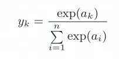
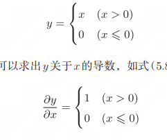

# Python学习笔记

之前做Maya工具的时候现学现卖用了一波Python，但是没有很熟。

如今神经网络这套东西非常热门，也确实非常强大，如果不跟上时代很容易被淘汰吧。

而且我本人对神经网络还挺感兴趣的，开学！


---


# Python基本通识

从Maya笔记Copy过来的，也做了一波整理和修改。


恨啊，当初没有好好学，现在看很多地方都需要Python。看上去比较好上手，慢慢不上不了解的地方吧。

 

## form import、导入其他文件内的函数

```python
# helper.py

def square(x):

  return x ** 2

 
# main.py

from helper import square

 

result = square(5)

print(result)
# Output: 25
```

import后面是可以**加逗号然后并列**添加的，就可以一次导入多条函数。

如果想导入文件中的**所有函数**，使用**通配符***，from helper import *

关于通配符，可以参考：[通配符](##通配符)。


一般from后面的叫模块名，模块名一般就是这个py文件的文件名。

但是如果你直接从这个脚本开始运行：

 

当前的模块名就会变成`__main__`,  这里主要就是供解释器分辨这个文件是作为主程序运行还是作为模块被导入其他程序运行。

这里的用法类似下面的“魔术方法、特殊方法”。


## 关于Python的导入缓存导致的模块热更新失效问题

由于Python自身的优化机制，在文件中导入其他模块时，Python会**缓存导入的模块**。这导致如果我更改了被引用模块，这个更改将不起效果，因为文件使用的是旧的缓存的模块。

为了解决这个问题，可以使用：

```python
import imp

import Main

imp.reload(Main)
```

这样的方式来**强制重新导入文件。**

虽然可能**降低效率**，但是能**解决热更新的问题**。

在基本确定不更改后，可以删除重新导入命令。

这里imp是一个Python自带的模块，不过在Py3.12被删掉了，妈的。

那3.12之后怎么办？——我的建议是使用3.11。^^

 

## 元组和列表

之前一直没有很好的理解，只知道元组可以放任何类型。

Python中的元组和列表都是容器类型的数据结构，用于存储多个元素，但它们有着不同的特点。

**元组（tuple）：**

- 元组是**不可变**的，即一旦创建就不能修改。

- 元组使用小括号**()**来表示，元素之间用逗号分隔。

- 元组可以包含任何类型的数据，包括其他元组。

- 元组支持索引和切片操作。

**列表（list）：**

- 列表是**可变的**，可以动态添加、删除、修改元素。


   - 列表使用方括号**[]**来表示，元素之间用逗号分隔。


   - 列表可以包含任何类型的数据，包括其他列表。


   - 列表支持索引和切片操作，同时还支持排序、插入、删除、统计等操作。

**共同点：**

- 都是容器类型的数据结构，用于存储多个元素。

- 都可以包含任何类型的数据，包括其他元组或列表。

- 都支持索引和切片操作。


**不同点：**

- 元组是不可变的，而列表是可变的。

- 元组使用小括号()来表示，列表使用方括号[]来表示。

- 元组不能添加、删除、修改元素，而列表可以。

- **元组相对于列表来说更加轻量级**，所以在需要不可变序列的情况下，使用**元组会更加高效**。

之前一直以为元组是无序不可重复的，后来发现那个叫做Set、类似哈希表吧。


## 魔术方法、特殊方法

常见的被双下划线包住的方法就是魔术方法，它们很像Unity内置的各种回调，你只要写这个函数的内容，这个函数会自动在指定的条件下被调用。

如：

```python
class People(object):

	# 创建对象
	def __new__(cls, *args, **kwargs):

    	print("触发了构造方法")

    	ret = super().__new__(cls) # 调用父类的__new__()方法创建对象

    	return ret ## 将对象返

 	# 实例化对象
    # 这里注意参数，第一个是self
	def __init__(self, name, age):

   		self.name = name

   		self.age = age

   		print("初始化方法")

 	# 删除对象

 	#  del 对象名或者程序执行结束之后

	def __del__(self):

    	print("析构方法，删除对象")
	
    # 特殊变量，__name__是这个模块的名字

	if __name__ == '__main__':

  		p1 = People('xiaoming', 16)
```

 

## 保护变量和私有变量

默认的变量声明是公开的，类内类外都可以访问。

**单下划线开头的变量是保护的，类外可以访问，但不应该访问**，因为之前的开发者不希望你访问，纯看自觉。

**双下划线开头的变量是私有的，类外可以访问，但是访问时需要做一步处理**，同上，开发者不希望你访问。

```python
class test :

  _test = 1

  __main = 2

 

def main() :

  te = test()

  print (te._test)

  print (te._test__main)

# 可以成功打印

# 对于双下划线开头变量，需要在访问时在变量名前加上“_所属类名”
```

 

## 函数返回类型声明

**Python不指定函数返回类型**，想返回什么就返回什么，也可以不返回直接结束。

在Python3.5之后，开发者可以在函数声明中加入**返回类型注解**，类似注释，有没有都**不会影响代码的编译**。

编写注解后，能在调用该函数的地方看到返回类型的提示，仅此而已。

```python
def add(x: int, y: int) -> int:

  	return x + y
```

只能说怪Python的IDE太好用了吧，不用写人也标出来了==

   


## 关于pass占位符

有时候一个函数就是不需要任何内容，但是它又必须被声明和定义，那里面写什么呢？

Python又不认可空行，只留下空行的话解释器会报错，这时候写下占位符pass即可：

```python
if True:

 	pass

  	print("Hello, world!")
```

需要注意，如果写了pass，后面的代码就不会再运行了。

 

## 关于参数顺序

如果你在调用函数时指定参数的名称，是可以随意打乱参数的顺序的，这叫做关键字参数。表现上很像Maya大部分cmds函数的flag形式。

```python
def my_func(a, b, c):

  print(a, b, c)

 

# 关键字参数

my_func(c=3, a=1, b=2) #输出 1 2 3

 

# 默认参数

def my_func(a, b=2, c=3):

  print(a, b, c)

 

my_func(1) # 输出 1 2 3

my_func(1, c=4) # 输出 1 2 4
```

 详细请看下一条目，无名参数和有名参数.


## 关于无名参数和有名参数

用cmds的API的时候，发现这个函数声明看不懂，于是问了GPT，才知道Python还有有名参数和无名参数这么一说。

 

*args是无名参数列表、**kwargs是有名参数字典（关键字参数）。

```python
def fun (*args, **kwargs) :

  	pass

 
fun(1,2,3,a = 1, b = 2, c = 3)
```

如上函数声明和调用，前三个是无名参数，后三个是有名参数（关键字参数）。

*和**是解包运算符，用于把列表和字典解包成参数列表，这样才能适配上各种情况下的调用。

在上面这种情况下，**args是一个列表，kwargs是一个字典，可以用于遍历。**

在定义中使用**kwargs之后，还是可以继续添加参数的：

```python
def fun (*args, **kwargs, name = "Init") :
  	pass

fun(1,2,3,a = 1, b = 2, c = 3, name = "111")
```

**根据规范，调用函数时一般无名参数在前，关键字参数在后，交替出现可能会出现匹配不上的问题。**

 

## 关于装饰器

这是Python特有的功能，当一个函数上面有@……的标志，代表这个函数被装饰了，真实运行的函数不是这个函数，而是被装饰后的函数。如下范例：

```python
# 装饰器定义函数
def my_decorator(func):
    # 定义包裹函数
  	def wrapper():
        # 使用两条Print语句包裹原函数
    	print("Before the function is called.")
    	func()
    	print("After the function is called.")
	#将重新定义后的函数返回
  	return wrapper

 

# 呼叫装饰器，此函数不再按照原函数运行
@my_decorator
def say_hello():
  print("Hello!")

 

say_hello()
# 输出：
# Before the function is called.
# Hello!
# After the function is called.
```

这么做会**降低代码的可读性**，毕竟你把其他部分弄出去了，不是所见即所得。但是在一些特殊的情况下，如：不太方便修改源码、只能通过加码的方式修改功能时，还算能用。

 

## 关于拉姆达表达式

C#中拉姆达表达式是这样：

`var fun = (a,b) => {print(a,b);};`

fun是一个委托类型，它保存一个函数。后面的a => {print(a);}是一个拉姆达表达式，a和b是参数，后面是函数体。

Python则这样写：

`fun = lambda a,b : print(a,b)`

Python中拉姆达表达式只能有1行，返回值的类型就是这个表达式的值。

 

## 关于长名和短名

根据Python的优良传统，调用函数时，若使用关键字参数，常使用关键字的短名（1~3个字母）（用长名也不会出问题）。

我很好奇这是怎么实现的，于是问了一下ChatGPT。

**直接链接长短名：**

```python
def Say(**kwarg) : 

  	\# 先试着get这个s，如果没有就试着get这个str

  	str = kwarg.get('s', kwarg.get('str', None))

  	print (str)

 
Say(str = "str")

Say(s = "s")

# Output:

# str

# s
```

这个方法相对较快，但是可能会出现同时使用长短名的问题，限定方面会出现一点困难。

 

**使用装饰器实现：**

```python
def SayShortName(Say):

  	def wrapper(**kwarg):

    	if 's' in kwarg:

      		kwarg['str'] = kwarg.pop('s', None)

   			Say(**kwarg)

  	return wrapper

 

@SayShortName

def Say(str) : 

  print (str)


Say(str = "str")

Say(s = "s")

# Output:

# str

# s
```

其实很好理解，就是使用装饰器修改一下原函数，并做一步判断：如果关键字参数字典中使用的是长名，就不动它，如果关键字字典中使用的是短名，就把短名拿到的值赋给长名的键，然后删除短名键值对避免多出一个参数（pop函数的功能就是删除并返回值），然后用处理过的参数去运行被装饰的函数就行了。

这个方法还是相对复杂，而且会降低一些代码的可读性，毕竟需要多写一个函数并做标记。

 

**Maya中的实现方式**

我又去Maya里测试了一番，发现即使同时使用长短名也不会报错，此时已先出现的为准，先用了短名就由短名决定这个flag的值。

结合Maya函数的声明，可以猜测Maya使用的是上述的第一种方式。

 

## 获取列表长度

`len(sl)`

和面向对象的sl.len的方法不同，每次我都搞错……

 

## 类型转换

类似C#

`string_num = "123"`

`int_num = int(string_num)`

 

## Logging

**仅使用print和cmds的warning和error是低效且不规范的。**

在一个工具项目中，我定义了一个变量DEBUG，用于控制开发者模式下的Log和Debug输出，这导致每次Log都需要再写一行if，非常的麻烦。

询问GPT解决方案后，发现Python有一个叫做Logging的内置库。

总结：

   

 

Handler可以玩得很花：

1. StreamHandler：将日志消息输出到控制台
2. FileHandler：将日志消息输出到文件
3. RotatingFileHandler：将日志消息输出到指定的文件，可以限制文件大小，达到一定大小后自动切割文件
4. TimedRotatingFileHandler：将日志消息输出到指定的文件，可以根据时间进行切割，比如每天或每小时切割一次
5. SocketHandler：将日志消息发送到指定的网络地址和端口
6. SMTPHandler：将日志消息发送到指定的邮箱地址

 

logging也可以用在Maya的脚本开发中，效果如下：


只不过，输出的字符串在Maya中会再做一步处理，头部会加上# 

并且，Maya会独立输出一行（在logging之后），标注输出的文件和输出内容。

**重复令人烦躁，可以通过调整Handler避免把信息输出到终端，因为终端的信息会同时被Maya和终端打印，造成重复。**

 

**要注意：**

如果Log带**中文，需要py文件首行注释文件编码方式**，如：# encoding: gbk。

在Maya使用时，由于缓存等持续运行机制，旧的Logger不会被自动删除，这导致同一个信息会被多次输出，为了解决这个问题，可能需要删除一下旧的Logger：

```python
logging.Logger.manager.loggerDict.pop(__name__, None)
logger = logging.getLogger(__name__)
```

 

## 通配符

阉割版正则表达式，可以做**简单的字符串匹配**。

在常用的场合，作为一个条件被使用。

比如：

 通过名字筛选出所有的Source

`source = cmds.ls("S_*", type = "transform")[0]`

表示用`“S_*”`为条件去筛选场景中的所有物体，`“S_*”`表示物体名必须以“S_”开头，后面是什么都无所谓。

 

GPT说明的常用场景：

在Python中，通配符常用于文件路径的匹配，例如使用

glob模块的通配符来查找符合某个模式的文件名或路径名。例如，

***.txt表示匹配所有以.txt结尾的文件名；**

**?表示匹配一个字符；**

**[abc]表示匹配字符a、b或c中的任意一个。**

通配符也可以用于数据处理中的筛选和过滤。

 

## Try

与其他高级编程语言类似的，Python也有异常抛出机制：

```python
# 通过名字筛选出所有的Target
try:
  # 可能会引发异常的代码
  x = 1 / 0
except ZeroDivisionError:
  # 处理 ZeroDivisionError 异常
  print("除数不能为零")
finally:
  # 无论异常是否被引发，都需要执行的代码
  print("程序结束")
```

如果想要捕获特定类型的错误：

- SyntaxError：代码语法错误。

- NameError：尝试访问不存在的变量或函数。

- TypeError：操作或函数应用于不适当的数据类型。

- ValueError：操作或函数应用于正确类型的数据，但该数据具有不合适的值。

- ZeroDivisionError：试图在除数为零的情况下执行整数或浮点数除法。

- IndexError：尝试访问列表、元组或字符串中不存在的索引。

- KeyError：尝试访问字典中不存在的键。

- AttributeError：尝试访问对象不存在的属性或方法。

- ImportError：无法导入指定的模块或包。

- FileNotFoundError：尝试打开不存在的文件。


如果**不知道错误什么类型**，反正都想捕获，那么**except后直接写冒号**即可。

 

## 在一行中使用if语句

`item = source if args[0] == "source" else target`

类似C#中 A ： B ？ Bool的用法

 

## 注释 

https://www.runoob.com/python3/python3-comment.html

```python
#单行注释

'''
多行注释1
'''


"""
多行注释2
"""
```


## DocString

类似C#的summary吧，但是它写在声明的下面。

一段看懂：

```python
# 生成回归用数据
def generate_data(ws, b=0, n=128):
    """
    :param ws: [1,2] 给定包含所有权重w的列表
    :param b: 0.5 偏置项
    :param n: 数据组数量
    :return: 生成的数据组，最后一列是标注。
    """
    x = np.random.rand(n, len(ws))
    y = (x * ws).sum(axis=1) + b
    datas = np.column_stack((x, y))
    datas = datas.astype(np.float32)
    return datas
```

用于类、方法的声明。

 


## 列表切片 

```python
>>> print(a)
[1, 2, 3, 4, 99]
>>> a[0:2] # 获取索引为0到2（不包括2！）的元素
[1, 2]
>>> a[1:] # 获取从索引为1的元素到最后一个元素
[2, 3, 4, 99]
>>> a[:3] # 获取从第一个元素到索引为3（不包括3！）的元素
[1, 2, 3]
>>> a[:-1] # 获取从第一个元素到最后一个元素的前一个元素之间的元素
[1, 2, 3, 4]
>>> a[:-2] # 获取从第一个元素到最后一个元素的前二个元素之间的元素
[1, 2, 3]
```


## 字典 

```python
>>> me = {'height':180} # 生成字典
>>> me['height'] # 访问元素
180
>>> me['weight'] = 70 # 添加新元素
>>> print(me)
{'height': 180, 'weight': 70}
```


## 逻辑运算或且非

跟C#不太一样：

```python
>>> hungry = True # 饿了？
>>> sleepy = False # 困了？
>>> type(hungry)
<class 'bool'>
>>> not hungry
False
>>> hungry and sleepy # 饿并且困
False
>>> hungry or sleepy # 饿或者困
True

```


## 反斜杠换行

有时候一行代码实在太长了，可以用反斜杠换行或者括号换行：

```python
 (x_train, t_train), (x_test, t_test) = \
 load_mnist(normalize=True, flatten=True, one_hot_label=False)

plt.hist(
    total_vertex_count,
    bins=
    range(
        segre_max_total_vertex,
        max(total_vertex_count) + big_step_total_vertex,
        big_step_total_vertex
    )
)
    
```


# 常用的Package


**Numpy**

经常被`import numpy as np`

主要提供数学计算和数据分析相关的方法。


---


# 感知机

本质就是这个，输入的每个维度乘以设定好的权重，大于阈值输出1，小于等于阈值输出0

 

不过一个这样的函数叫做单层感知机，有些东西单层感知机做不出来，比如说异或门的判断。

异或门即输入的不同则返回1，输入的相同则返回0。

这个可以用函数图像看出来：

比如下面经典的示例，三角代表返回1，圆代表返回0. 然后其实一个感知机在这里可以简单地理解为一个线性的函数：

$f(x_1,x_2) = x_1*w_1 + x_2*w2$

如果输入的x1 和x2加权累加后小于阈值了，就是下图的灰色区域，就返回0，而如果大于阈值了，就返回1.

下图就是或门被一维感知机顺利区分的示意图：

 

可以看到一维的感知机，其fx其实就是简单的线性函数，就是一条直线，它可以切开与门、或门、与非门：

 


但是异或门是这样的：

 

一条普通的线性函数看来是没法分开的，所以这里引入概念多层感知机。

 


---


# 激活函数

神经网络中有一个重要的概念，叫做激活函数。

它的实质作用大概就是如图的h()：

 

一句话就是对输入做完加权累加再加偏置后，对结果做一个处理的函数。

激活函数必须是非线性函数。


**为什么要用激活函数？为什么一定得是非线性的函数才行？**

因为单层的神经网络很鸡肋，类似单层的感知机那样，连亦或门都模拟不出来，

而如果想要使用多层感知机，就必须引入一个非线性的激活函数。

在感知机中，所谓的“大于阈值返回1，否则返回0”就是典型的非线性激活函数Step。

如果没有这个Step，我们就无法通过两层感知机模拟异或门。

如果没有这个Step，加权累加再加偏置这个函数完全就是线性的，那不管有几层，实质上和一层没什么区别，这是线性函数的特性，在学Shader入门精要的时候也有提及。

$f(x_1,x_2) = x1*w_1 + x_2*w2$ 典型的线性函数

因此，引入激活函数后，顺利地为原先是线性的这个加权累加再加偏置的流程引入了非线性特性，使得多层神经网络成为可能。

目前存在的比较知名的激活函数就是Step、Sigmod和ReLU，算起来都很容易，目前主流使用的是ReLU，以前主流的是Sigmod。


你想过为什么没有人用Step当激活函数吗

这是因为Step并非是一个连续的函数，其存在一个突变。

然而在神经网络反向传播的时候，很多时候对权重和偏置的调整只是微小值，微小的变化很难让Step产生突变，只有临界值才会产生结果的变化。

因此在反向传播的过程中，很多层的偏导会被认为是0，即对结果毫无影响。


---


# 回归问题和分类问题

神经网络拟解决的问题一般就两类，回归问题和分类问题。

简单来说就是，回归问题是预测类问题，根据输入信息，内部哐哐一顿算后给出一个结果。

比如以下几个问题就是回归问题：

1. 预测房屋价格：基于房屋的特征（如面积、地理位置、房间数量等）预测房屋的销售价格。
2. 销售预测：基于广告支出、季节性因素等，预测产品的销售额。
3. 股票价格预测：利用历史股票价格、交易量等数据，预测未来股票价格的走势。
4. 医疗预测：根据患者的生理特征、病史等信息，预测患者患某种疾病的风险或预期寿命。
5. 人口增长预测：基于过去的人口数据和经济指标，预测未来某地区的人口增长情况。

分类问题就很好理解了，给一个输入，判断数据属于哪一个预先指定的类型。

比如输入一张图，问模型这图里是猫还是狗。


根据问题的不同，输出层的激活函数设计也不同。

回归问题一般用恒等函数做原样输出，就是什么都不做就输出。

分类问题一般用SoftMax函数：

 

这里累加1~n就是遍历最后一层的每一个数据，做EXP后累加。

exp图像是这样的：

 


唉，其实主要目的就是把各个结果都考虑上，然后压缩到0~1并且总和为1罢了。做exp是为了让结果在大值的地方有更明显的差异，并且负值也能很好Hold住罢了。


---


# 矩阵和神经网络数据传递

前面也说了，数据在神经网络间传递就是输入数据加权求和再加偏置，然后过一遍激活函数。

这个其实用矩阵非常好写：

 

写成矩阵的 A = XW + B，比写一大堆小写字母好看多了。

而且这里X和W的点乘，其实展开来看就是输入数据的加权求和，巧得像矩阵点乘就是为了神经网络设计的一样。

多维数组一般有一个shape属性，指的就是从大到小来看，每个维度有多少个元素，比如：

[[0.1, 0.3, 0.5], [0.2, 0.4, 0.6]] 的Shape 就是（2，3）。

我们知道矩阵点乘是中间相等才能乘，结果取两边的维度的，比如2X3的矩阵点乘3X2的矩阵结果是2X2的矩阵。

而神经网络的输入一般是一维数据，它的Shape一般就是（x, ）这样的，x指的是一维数组中元素的个数。

比如现在有一个3个元素的输入（3，），其实它和权重矩阵相乘的时候是：1X3 dot 3X2 = 1X2，而1X2的一维数组的Shape是（2，）。所以从经验来说，权重矩阵的shape可以改变输入的一维数组的元素个数。**Shape（3,2）的权重矩阵可以把神经元个数个数从三个转为两个，以此类推。**

其实这里单看一维数组的Shape输出一个（3，）还是怪怪的，总觉得是三行若干列，其实是一行3列；或者说成是：只有一个维度，这个维度有3个元素。


---


# 最简单的神经网络前向传播示例代码

```python
# 初始化定义神经网络
def init_network():
     network = {} # 建一个空字典
     network['W1'] = np.array([[0.1, 0.3, 0.5], [0.2, 0.4, 0.6]]) # W1权重信息，和偏置一起就是所谓的模型中的一层
     network['b1'] = np.array([0.1, 0.2, 0.3])
     network['W2'] = np.array([[0.1, 0.4], [0.2, 0.5], [0.3, 0.6]]) # shape是从大到小每个维度几个元素，这个是32，W1是23
     network['b2'] = np.array([0.1, 0.2])
     network['W3'] = np.array([[0.1, 0.3], [0.2, 0.4]]) 
     network['b3'] = np.array([0.1, 0.2])
	 return network
    
# 前向传播
def forward(network, x):
    # 输入了 模型 和 输入数据
     W1, W2, W3 = network['W1'], network['W2'], network['W3']
     b1, b2, b3 = network['b1'], network['b2'], network['b3']
    # 第一层加权求和加偏置
     a1 = np.dot(x, W1) + b1
    # 第一层激活函数
     z1 = sigmoid(a1)
    #第二层...
     a2 = np.dot(z1, W2) + b2
     z2 = sigmoid(a2)
     a3 = np.dot(z2, W3) + b3
     #identity_function = 什么都不做. 这里是输出层激活函数,根据拟解决的问题决定
     y = identity_function(a3)
     return y
    

# 初始化字典和输入数据
network = init_network()
x = np.array([1.0, 0.5])

#做前向传播
y = forward(network, x)

print(y) # [ 0.31682708 0.69627909]

```


---


# Softmax指数溢出  对策

计算机是这样的，再高的精度对上指数函数也没辙。==

因此有如下的Trick可以解决这个问题：

```python
>>> a = np.array([1010, 1000, 990])
>>> np.exp(a) / np.sum(np.exp(a)) # softmax函数的运算
array([ nan, nan, nan]) # 没有被正确计算
>>>
>>> c = np.max(a) # 1010
>>> a - c
array([ 0, -10, -20])
>>>
>>> np.exp(a - c) / np.sum(np.exp(a - c))
array([ 9.99954600e-01, 4.53978686e-05, 2.06106005e-09])
```

两边exp里面都减一个max（a）就行。

虽然不是很懂为什么，但管我屁事，那是数学家的事。^^


但是啊，一般Softmax用也是用在分类问题上，告诉你A的概率是多少，B的是多少。

但是往往推理的时候不想知道什么破概率，我只想知道模型给出的答案是哪一个，此时其实不需要过SoftMax，直接比最后一层的值的大小就行了。

因此这个SoftMax在大部分推理的时候是不用的，但是它在训练模型的时候还是蛮有用的，可以衡量出模型学对了多少，学歪了多少。


---


# 成批推理和矩阵

正向传播也可以说成是推理。

如果一个一个数据过推理流程，性能瓶颈可能出现在数据的转移和传播中，和Unity的渲染一样。

因此合批能大大提高推理的效率，而其可行性也非常容易验证：

以多维数组Shape为例，不合批时：

输入是一张32X32合1024长度的图

(1024, ) dot (1024, 100) = (100, )

(100, ) dot (100, 1) = (1, ) 输出用于判断一个二分类，中间有一层隐藏层，也就是权重和偏置参数。

合批时：

(100, 1024)dot(1024, 100) = (100, 100)

(100, 100) dot (100 ,1) = (100, 1)

可见合批时，输入和输出的Shape的第一个维度用于存合批的索引了，而模型（权重矩阵和偏置矩阵）不需要修改，只要修改输入就行。

比如原先输入一张2X2的图：([1,2,3,4])

现在就直接：([1,2,3,4] , [5,6,7,8]) 这样合批合成两张一起就OK。


---


# 泛化和过拟合

神经网络模型的最终目的是“泛化”。

以数字识别为例，泛化的模型可以识别更多人手写出来的数字或是打印出的数字，而泛化程度不够的模型可能只能识别出训练用数据集中的数字。只对训练用数据集起作用、泛化程度低的情况叫做“过拟合”。


---


# 损失函数定义

不管权重和偏置如何，数据进去了总会有一个结果。

评判结果和正确结果差距多大的函数就是损失函数。

常用的有均方误差和交叉熵误差。

均方误差：

 

每维误差平方累加再除以2


交叉熵误差：

 

 

累加每一维度的正解乘以模型答案的对数再取负。可见，在错得比较离谱的时候——比如：一张手写5的图片，模型给的答案是5的概率是0.1%，此时交叉熵会得到非常大的值，代表这个模型性质恶劣。


从直观感受上来说，“均方误差”似乎是更加“线性”的做法，而交叉熵误差是更加“非线性”的做法。


---


# One-Hot表示

在分类问题中，训练数据往往需要标记好正确的输出（答案）。

以手写数字图像为例，现有一张手写数字“5”的图像，如果我们将其答案写为：[0,0,0,0,0,1,0,0,0,0]，即5的可能性是100%，其他数字的可能性是0，这种答案的写法叫做One-Hot表示。

相对的，模型给的答案可能是[0.1,0.1,……]这种。代表模型计算得到的、这张图是10个十进制数字中的哪一个的概率。


---


# Mini-Batch小批量学习

拥有庞大数据量却没有对应计算能力时（指单次计算，同时学习过多的数据会导致内存无法负载），就需要考虑使用Mini-Batch小批量学习。

说白了就是从数据集中随机选一小批用于学习。

```python
train_size = x_train.shape[0]
batch_size = 10
batch_mask = np.random.choice(train_size, batch_size)
x_batch = x_train[batch_mask]
t_batch = t_train[batch_mask]
```


但是一般不会像上面这样直接随机出索引来选Mini Batch，因为这不利于每Epoch进行模型准确度的评价。

具体来说，一般会把训练用数据集先打乱（像洗牌一样），然后为打乱后的数据集分组为Mini Batch进行学习，比如索引0~99作为一批、100~199又作为一批，以此类推。

这样做的好处是可以比较好地保证学习下来、每个数据被学过的次数是一样的，不会出现有些索引表被随机到的次数多、它所提供的特征就更多的这种情况；并且，这样做也可以更放心地说模型经历了一个Epoch的学习（即数据集全都被学了一遍，如果像上面那样用随机索引，即使Mini Batch数乘以随机次数已经达到了训练用数据集的大小，也不能拍着胸脯说所有的数据都被学了一遍）

开发者可以每若干个Epoch对模型进行准确性的评价，以做进一步的判断。


---


# 梯度

对于一维函数叫做斜率或者切线，但是对于二维函数就不是这样了，因为二维函数的一点上有无数条切线

 

比如说对于上面这个函数，下面这个就是它的梯度：

 

梯度衡量的是二维函数在某点上的变化率。因此，**梯度向量指向的方向，就是会产生最大的变化值的方向。**

没错，二维函数的梯度也是一个二维的向量。梯度的值本身就是由函数在指定点上的偏导数组成的向量：

 

其实，从图形学上来说，如果说二维函数的两个自变量与其函数值组成一个三维的空间（就像上面的函数图），那么梯度就是这个Mesh的法线（或者法线的反方向，取决于元素值的正负）在自变量平面上的投影。


## 梯度法

通过上面的描述我们知道，梯度向量指向该点上函数值会发生最大变化的方向。

损失函数也是函数，神经网络的目的或者说指标之一就是降低损失函数的函数值，那不是天造地设？

对于某一个输入和通过模型计算出的结果，我们用结果和正确答案计算出损失函数，然后把神经网络层中的参数和偏置都往会让函数值下降得最厉害的方向调整若干数值，然后再推理一遍，用新的结果再去算损失函数，这下损失函数的值大概率比上一次低，因为我们往梯度下降的地方调整了权重和偏置。如此反复，最终到损失函数收敛。

像这样求最小的叫梯度下降法，反过来求最大的叫梯度上升法。

更新参数的过程如下式：

 

x0和x1是某层神经网络中的两个权重参数，f是损失函数。这里我们用f在x0方向上的偏导乘以学习率$\eta$ ,即这一次在多大程度上做调整。x1参数也做同样的操作。

这个学习率太大或太小都是不对的。

太大可以理解为“太急了”，每次的步子都迈得很大，很难走到一个精确的地方，还可能因为步子太大直接迈过了目的地，后来还需要返回来；而返回来的步子还是很大，所以可能会在这一块反复横跳，像乒乓球一样。

太小则是可以理解为“太懒了”，虽然知道前进的方向，但是奈何每次只前进一点点。要知道训练的步数（step）是有限的，这么懒的话可能最终都走不到目标点。

一般来说，开发者应该动态地调整学习率。我认为这一块非常像SSR（屏幕空间反射）中实践过的“动态光线步进”，即发现步子大了减半，发现步子小了就乘2.

怎么判断步子大没大呢？在SSR中是比较计算出的深度和片元深度那个大，计算深度大说明步子没大，片元深度大说明步子大了。

感觉梯度下降法里也差不多，上一次梯度方向和这一次梯度方向，如果夹角大说明步子大了，如果夹角小说明步子小了，总之就是想说，学习率应该是开发者自己想办法动态调整的，具体怎么调肯定有迹可循。


## 梯度的计算


### 使用数值微分

在早期的学习中我们使用数值微分，它更容易理解和实现，但是效率较低。

```python
def numerical_gradient(f, x):
 h = 1e-4 # 0.0001
 grad = np.zeros_like(x) # 生成和x形状相同的数组
 for idx in range(x.size):
 tmp_val = x[idx]
 # f(x+h)的计算
 x[idx] = tmp_val + h
 fxh1 = f(x)
 # f(x-h)的计算
 x[idx] = tmp_val - h
 fxh2 = f(x)
 grad[idx] = (fxh1 - fxh2) / (2*h)
 x[idx] = tmp_val # 还原值
 return grad
```

其实非常简单，就像用路程除以时间一样，求微小变化内的平均速度。当微小变化趋近于0的时候，就是这个时刻的瞬间速度，在这里就是所谓的“变化率”。

这里类似于计算多元方程的“算数解”。


### 使用“误差反向传播法”

上面说了用数值微分类似求多元方程的算数解，比较慢。

所以有学者研究出了类似“解析解”的方法，叫“误差反向传播法”。

基本的思路是基于“链式法则”，从Loss函数的值一步步反向传播，对神经网络的每一层中的激活函数和仿射变换求当前层的所有权重参数和偏置参数的偏导数、进而组成梯度。

反向传播到最后，每一组权重和偏置参数都获得了梯度数据，再利用梯度数据更新权重和偏置参数即可。


关于“误差反向传播法”具有非常多的细节内容，接下来开单独的栏目详细说明。


## 梯度确认

使用误差反向传播法是比较复杂的，因此它比较容易出错。

所以开发者一般在若干次的学习后使用数值微分计算一次梯度，并与误差反向传播得到的梯度进行比较，如果二者相差不大证明误差反向传播法的工作状态良好。


---


# 超参数

在梯度下降法中，了解到了 “学习率”和“学习步数”等概念。这些参数是开发者（神经网络训练家？）可以配置的、但又不是神经网络内部的权重参数和偏置参数，这些参数被称为超参数 。


---


# 误差反向传播法


## 链式法则

误差反向传播法 的理论依据之一就是 “链式法则”。

所谓链式法则其实非常简单，对于一个神经网络，比如它就是f(x) = y，y是最终的输出，而x是最初的输入。

f是什么呢？通过之前的学习，我们知道x就是若干次的x乘以权重再加偏置，然后过激活函数 这样的循环罢了。那么其实每一层的计算相对独立对吧，那么对于一个具有一层隐藏层的神经网络来说，是不是可以理解为：

f(x) = y;    ===>  x -> f1(x) = z -> f2(z) = f2(f1(x)) -> y

显然是可以的，无非就是把一些运算划分为f1，另一些运算划分为f2罢了。

f2(f1(x))这样的函数可以称之为 复合函数。

符合函数具有 链式法则的特性。所谓链式法则，就是 ： 复合函数的导数，可以由其每个单元的导数的乘积表示。

用数学的方法来说明：

复合函数定义：

 

复合函数求导：

 

其实本质就是约分罢了。


为什么链式法则可以支撑误差反向传播法呢？

首先，误差反向传播法的目的就是通过Loss函数的值反向传播，求出从后往前的每一层中的权重和偏置参数的梯度。梯度其实就是由每一维的偏导组成的向量。

如下图，我想求z对于输入数据x 的偏导，那么根据链式法则，我们将每个单元的导数相乘即可！

 

 


来看一个更复杂的例子：

 

这里最终输出开销是715，反向传播的第一步中，首先

 $ 开销 = 总价 * 消费税$ 即 650 * 1.1 = 715

那么 : $\partial 开销 / \partial 消费税 = 总价$

意味着对于现在的开销,  消费税每增加1，开销就会增加 “总价”那么多的量。

所以这里我们得到消费税的偏导数为 总价，即650。

开销对于总价的偏导也是类似的，不再赘述。

我们得到了总价的偏导，但是总价并不是输入数值之一，所以我们根据链式法则继续向下拆分，最终可以得到苹果个数、苹果单价、橘子个数和橘子单价的偏导。

以苹果单价为例，其偏导值为2.2，意味着在当前输入的条件下，苹果的单价每上升1，最终的开销就会上升2.2。


说了这么多，其实汇作一句话就是：**链式法则可以支撑误差反向传播算法进行反向逐层的各参数的偏导值求解，并且其相对于数值微分更加快捷准确。**


## 常用函数的偏导推导和记忆

既然知道了链式法则，那么我们就可以大胆地像剥竹笋一样，反向一层一层剥掉计算单元们的偏导值了！

让我们先来对神经网络算法中最常用的计算单元来造一些轮子：

**加法**

x + y = z

z 对于x和y的偏导就是1，因此加法在反向传播中不会对收到的偏导值进行修改。

求对于某个变量的偏导其实就是把其他维的变量都视为常数然后求导就行。


**乘法**

x*y = z

z对于x的偏导是y，对于y的偏导是x。

那么其实乘法在反向传播中，会反转并乘以正向传播时的输入值。

如对于乘法，反向传播输入的d为2，正向传播的dx = 2，dy = 3，那么反向传播时，dx = 6，dy = 4。


**ReLU**

 

ReLU现在流行的原因之一就是导数好求。

说形象点就是，输入的值大于0，则不动偏导数值，小于0则把偏导数值改成0，即本层对结果毫无影响。


**Sigmoid**

它就有点难绷了，本身没什么难的推导，但是挺繁杂的，直接上结论吧：

 

 

关键就是这个y(1-y)，其实就是乘上这个系数即可。


**Affine**

之前没有怎么说这个概念，这个叫放射变换，在神经网络里面指的是输入乘以一次权重再加一次偏置的这个过程。

在正向传播中，它是： $Y = X * W + B$

在反向传播中，它的偏导如下：（小T右上标代表矩阵转置）

 

在批处理中、不需要怎么复杂处理，给输入数据和输出数据直接加第二个维度即可。

这里要推导的话也是比较繁杂，记一下结论吧。

这里对于输入的 $\frac{\part L}{\part Y}$, 我们得到了分别对于X、W和B的偏导数的值。

在反向传播中，W和B的偏导数值会被保存起来用作更新数据，而对于X的偏导值会继续反向传播。


**SoftMax with Loss**

成型模型推理的时候不需要算Loss，甚至不需要算SoftMax，只需要给出一个答案即可。

SoftMax说过，就是把神经网络输出层得到的数据全部非线性映射到0~1，Loss是评判模型答案和监督答案的差距有多大。一般正向传播中我们最后拿到的数据就是Loss了。

那么 SoftMax with Loss 其实作为一个整体来求偏导会比较方便。

这里的Loss使用交叉熵误差算法。

因为推导比较复杂，还是直接摆图了：

 

简单来说，Loss值对于SoftMax with Loss的偏导为正向传播soft max输出值减去监督数据值。


## 两层 误差反向传播法 示例代码

```python
# coding: utf-8
import sys, os
sys.path.append(os.pardir)  # 为了导入父目录的文件而进行的设定
import numpy as np
from common.layers import *
from common.gradient import numerical_gradient
from collections import OrderedDict


class TwoLayerNet:

    def __init__(self, input_size, hidden_size, output_size, weight_init_std = 0.01):
        # 初始化权重，这里类似于C#声明和初始化变量
        self.params = {}
        self.params['W1'] = weight_init_std * np.random.randn(input_size, hidden_size) # 权重初始化为随机数
        self.params['b1'] = np.zeros(hidden_size) # 偏置初始化为0
        self.params['W2'] = weight_init_std * np.random.randn(hidden_size, output_size) 
        self.params['b2'] = np.zeros(output_size)

        # 生成层对象
        self.layers = OrderedDict() # 有序字典方便反向传播，因为可以直接Reverse
        self.layers['Affine1'] = Affine(self.params['W1'], self.params['b1']) # 第一层仿射层，即输入乘权重加偏置
        self.layers['Relu1'] = Relu() # ReLU，这个共用就好了，它没有自己的参数 
        self.layers['Affine2'] = Affine(self.params['W2'], self.params['b2'])

        self.lastLayer = SoftmaxWithLoss() # 最后一层输出用SoftMax，方便反向传播
        
    def predict(self, x): # 即推理
        for layer in self.layers.values():
            x = layer.forward(x) # 遍历每一层，前向传播，不停更新X即可。 遍历期间各层会存下反向传播的时候各自需要的数据，不同的计算单元记录的数据不尽相同。
        
        return x
        
    # x:输入数据, t:监督数据
    def loss(self, x, t):
        y = self.predict(x) 
        return self.lastLayer.forward(y, t) #执行推理后，传入LastLayer，这里是SoftMax With Loss
    
    def accuracy(self, x, t): # 评判模型准确性，这个是最终指标，就是本批推理中，算对了的比例。
        y = self.predict(x)
        y = np.argmax(y, axis=1)
        if t.ndim != 1 : t = np.argmax(t, axis=1)
        
        accuracy = np.sum(y == t) / float(x.shape[0])
        return accuracy
        
    # x:输入数据, t:监督数据
    def numerical_gradient(self, x, t): # 这是数值微分法
        loss_W = lambda W: self.loss(x, t)
        
        grads = {}
        grads['W1'] = numerical_gradient(loss_W, self.params['W1']) # 这里虽然和定义它的函数同名，但是不是同一个函数，这里的numerical_gradient是另一个模块中重用的数值微分的实现方法
        grads['b1'] = numerical_gradient(loss_W, self.params['b1'])
        grads['W2'] = numerical_gradient(loss_W, self.params['W2'])
        grads['b2'] = numerical_gradient(loss_W, self.params['b2'])
        
        return grads
        
    def gradient(self, x, t): # 误差反向传播求梯度法。
        # forward 前向传播
        self.loss(x, t)

        # backward
        dout = 1 #最终的输出的相对自己的偏导，肯定是1嘛，这里作初始化用
        dout = self.lastLayer.backward(dout) #最后一层反向传播
        
        layers = list(self.layers.values()) # 这里的layers是上面定义的有序字典，这里是把字典改成了列表
        layers.reverse() #因为要开始循环反向传播了，所以反转了原来的顺序
        for layer in layers:
            dout = layer.backward(dout) # 每一层都执行反向传播，反向传播的过程中已经把W和B的梯度存进了计算单元的偏导数值的字典中。

        # 这里直接将字典各计算单元的权重和偏置的梯度取出来返回就好了
        grads = {}
        grads['W1'], grads['b1'] = self.layers['Affine1'].dW, self.layers['Affine1'].db
        grads['W2'], grads['b2'] = self.layers['Affine2'].dW, self.layers['Affine2'].db
       

        return grads


```


# 简单的反向传播示例代码

学了这么多，终于可以给一个反向传播的示例代码了！

```python
# coding: utf-8
import sys, os
sys.path.append(os.pardir)

import numpy as np
from dataset.mnist import load_mnist
from two_layer_net import TwoLayerNet

# 读入数据
(x_train, t_train), (x_test, t_test) = load_mnist(normalize=True, one_hot_label=True)

# 初始化网络对象
network = TwoLayerNet(input_size=784, hidden_size=50, output_size=10)

# 超参数
iters_num = 10000  # 这里指做一万次反向传播，每次反向传播完成都会更新权重和偏置参数
train_size = x_train.shape[0] # 训练数据集总大小
batch_size = 100 # 每批学多少个数据
learning_rate = 0.1 # 权重和偏置的更新幅度

train_loss_list = []
train_acc_list = []
test_acc_list = []

# 每Epoch需要迭代多少次，即多少次反向传播后视为一次Epoch
iter_per_epoch = max(train_size / batch_size, 1)

for i in range(iters_num):
    # 随机Roll出Mini Batch
    batch_mask = np.random.choice(train_size, batch_size)
    x_batch = x_train[batch_mask]
    t_batch = t_train[batch_mask]
    
    # 梯度
    #grad = network.numerical_gradient(x_batch, t_batch) 这是数值微分法梯度
    # 用误差反向传播法得到各层的梯度
    grad = network.gradient(x_batch, t_batch) 
    
    # 用梯度和学习率更新权重和偏置参数
    for key in ('W1', 'b1', 'W2', 'b2'):
        network.params[key] -= learning_rate * grad[key]
    
    # 评估一下Loss
    loss = network.loss(x_batch, t_batch)
    # 记录此时的loss方便后面打图
    train_loss_list.append(loss)
    
    if i % iter_per_epoch == 0: # 每Epoch
        # 评估对于训练集、测试集的准确度，方便看模型整体能力和过拟合情况
        train_acc = network.accuracy(x_train, t_train)
        test_acc = network.accuracy(x_test, t_test)
        train_acc_list.append(train_acc)
        test_acc_list.append(test_acc)
        print(train_acc, test_acc)

```


---


# 梯度下降法的优化

梯度下降法是**从Loss的值反向传播、根据计算出的各维度的梯度、去调整网络中各维度的权重和偏置的方法**


## SGD（stochastic gradient descent）以及SGD的问题

上面说了梯度下降法，既使用梯度更新参数的方法。

上面简单示例中，这就是所使用的梯度下降法，叫做SGD（随机梯度下降法）

```python
    # 用梯度和学习率更新权重和偏置参数
    for key in ('W1', 'b1', 'W2', 'b2'):
        network.params[key] -= learning_rate * grad[key]
```

**它的“随机”体现在Mini-Batch的时候随机选一小批进行梯度的计算，然后用一小批的梯度去更新整个网络的权重和偏置。**

说形象一点，我现在蒙着眼在一片高低不平的草原上走路，我能感受到地面的坡度（梯度）。现在我的目的是走到草原的最低处，那么SGD就是我朝着我感觉在下坡的方向走一小步（学习率）。

比方说现在有一个山坡长这样，右图是俯视视角

 

那么SDG就是这样更新的：

 

初始在最左边那个点，朝着感觉到下坡最猛的方向走一步（步长与感觉到的坡的陡峭程度（梯度的模长）也相关），然后一直按照这个规则走下去。

可见SDG的问题在于，在Y方向上，**“抖动”**很厉害；而比较需要更新的X维度上，因为感觉到的坡度相对Y来说较小，则大部分步长被投影到了Y上。这是一种比较低效浪费的情况。

复杂的权重和偏置参数空间往往比上面更复杂，参数间的变化的程度相差的倍数可能非常大，此时对于需要更新、但是 **参数值较小的 维度，分到的步长就很小了，所以更新的效率低。**


## 使用 Momentum （动量）的梯度下降法

相对于SGD，**给自身加上了“速度”或者说“惯性”的概念。**

同样是蒙眼找下坡的例子，在Momentum法中，我这一步**该往哪走、步子迈多大不只决定于此时我感觉到哪个方向的下坡最猛，还取决于我之前积攒的速度。**

 

这里先用$\alpha * v$ 做一个速度的衰减（阻力），然后减去梯度乘以学习率。虽说是减去，但是其实最终调整幅度还是看绝对值的大小嘛，因此这其实就是在不断累积之前的变化，和“速度”的概念是一样的。

**它相对于SGD，“抖动”的情况减轻了很多。**单看X轴，虽然每次感知到的梯度的数值都比较小，但是至少在一个对应的周期内是同符号（正或者负）的，因此它的绝对值会累积。可以发现X方向上在接近最小值的最后，相比SGD速度上有了质的飞跃

 


## AdaGrad（Adaptive Grad“适量梯度更新法？”）

经过Momentum 优化后，“抖动、震荡”的情况减轻了。

在Momentum中，X的变化幅度本来就低，所以逼近的状态比较好；但是Y的变化幅度比较大，导致即使加入了“惯性”的概念，Y方向还是出现了多次明显的震荡。

此时，是不是有一种方法，可以根据Y的累积变化幅度减少Y方向的学习率、以减少Y的变化幅度呢？

AdaGrad方法就是，**对于累积变化幅度较大的的维度，它的学习率将乘上一个系数使其变小。**

公式看不太懂啊、、

 

但是没关系，思维是可以理解的！

还是蒙眼下坡的例子，如果我走了好几步了，发现我掉头转向的次数有点多（说明往前方向的参数变化幅度大），那么当然想着这边应该是一个U的形状，我一直在两边摆动罢了，那么我其实可以把步子迈小一点，尝试去找到谷底。

**这是一种避免神经网络过于“发散”的方法。**因为是累积的变化幅度，随着变化幅度的累积，学习力乘上的参数最终一定会趋于0的。

看图就是这样：

 

开始Y更新幅度很大，学习率开始下降，所以大大减轻了Y方向的震荡。

可见其逼近某个极小值的步数花费比之前的几种方法都要少，因此它的效率更高。


## Adam（AdaGrad + Momentum = Adam）

**结合上面两种优化思路的做法，既考虑“惯性”、也让学习率跟着累积的更新量衰减。**

 

这里Momentum的系数是衰减系数，即速度会自己衰减，有惯性、但也有阻力的情况。

 


## 到底该选哪个呢？

作者推荐了SGD和Adam，我个人的话也倾向用Adam吧。


---


# 初始化权重参数的最佳实践

如果使用**Sigmoid或者tanh作为激活函数，则使用Xavier初始权重**。

如果使用**ReLU作为激活函数，则使用He初始权重**。


## 正态分布

先来复习一下正态分布。

在**之前**的学习中，我们说把**权重参数的初始值设置为一组高斯分布的随机值。**

 

但其实，随机数和随机数亦有不同，他们**可能分布得集中，可能分布得分散**。

相对集中的分布具有更小的标准差值，相对分散的分布具有更大的标准差值。

 

像上面的代码中，我们给一个标准正态分布乘上了0.01，意味着更多的数值会分布在0附近，-0.03~0.03内的数据超过99%；均值方面未作处理，则均值（期望）是0。


## 为什么选择合适的初始权重参数如此重要？

**如果初始值不合适，训练过程中出现的“梯度消失”和“梯度爆炸”的问题。**

所谓的消失和爆炸，指的就是**梯度值在反向传播的过程中，变得很小就是很大的情况。**如果梯度变得很小，权重参数的更新幅度就会变小；而如果梯度变得很大，权重参数又会被过大幅度地更新，导致学习“发散”，无法找到最合适的权重。**无论哪一种都不是我们所期望的。**


## 理想的中间层激活值

**激活值**指的是某层通过输入**加权累加再加偏置、然后过激活函数后得到的值。**

每个神经元都会有一个激活值，因此我们可以观察某层中激活值的分布情况。

理想的中间层激活值的分布应该Like This，有以下几个要点：

- **靠近0和1的数值应该尽量少**。因为正向传播中数值靠近0或1，反向传播时会导致输出的偏导变小很多，不断地减小会导致梯度的消失，进而导致靠近输入层的层更新幅度小，学习速度慢。
- **分布应该具有广度，不要扎堆聚集。**如果大量神经元具有相同或相近的激活值，其实就像所有评委都以完全相同的视角给一个选手打分，他们打的分很接近。但是这样只能从一个角度去评判选手，本来应该从多个角度评判的。

 


以下是ReLu作为激活函数时，使用不同初始值的中间层激活值的数值分布：

 

可见用**0.01应该会出现严重的梯度消失的问题**，Xavier相对0.01的梯度消失情况得到改善，使用He时基本没有梯度消失，且广度上非常漂亮。

通过训练的实际情况来看，符合结论：

 


---


# Batch Norm ——  Batch Normalization 批量归一化

上面有提到，**理想的激活值分布最好少分布在0和1处、同时要具有广度。**

但是在训练的过程中，**往往是“叠加”的关系**，如下图，各层的分布曲线可能会**越来越陡峭，最后导致梯度消失或者梯度爆炸 。**

 

那么为什么不**手动映射一下激活值，让它的分布变好看**呢？

Batch Norm就是这样的做法，它会**统计当前输入的Mini-Batch中的各个维度的数据分布，然后将分布映射到均值为0、标准差为1的分布中去**，这样可以很大程度避免梯度消失和梯度爆炸的情况，并且可以加速模型的收敛速度。

同时，由于Batch Norm的存在，**激活值分布的问题得到解决，网络对权重参数初始值的要求就不会那么严格了。**（但是初始值当然还是用最佳实践值最好）

  

虽然我也不太理解它是怎么做到的，但是形象地理解下来，可以说成是：每次对激活值做一次映射，但是其实没改他们之间的关系，只是从尺度上（坐标轴）进行修改，这样就在每层都对分布做了一次校正、并且其实不会大幅影响梯度，可喜可贺。

**Batch Norm往往插在仿射变换之后，也有插在激活函数之后的。**

 

注意，如果正向传播中使用了Batch Norm，反向传播梯度的时候也需要考虑Batch Norm。一般来说成熟的框架都会这么做的。


---


# 抑制过拟合的情况

“过拟合”的情况从表现上来说，就是模型训练完成后，只对训练数据集有较好的准确性，但是对测试集却没有相应的准确性、缺乏“泛化”能力的情况。

**从人为原因上来说，产生过拟合是因为神经网络过于复杂（层的神经元数量过多、或者层数过多）或者训练用数据集太少。**这两个因素容易导致神经网络强硬地“记住”仅训练集中存在的某个潜在特征（这种特征可能没有任何人类能够理解，只是权重和偏置参数）。

以下是刻意加多层数与神经元数量、且仅用了少量数据训练的结果：

可见其对训练集的准确度非常高，一度高达接近100%，但是对于测试集，仅在60%左右。

 


## 使用L2范数的权值衰减

从数据的层面来说，“过拟合”的出现是因为某个权重参数特别大，从而导致它对决策产生的影响特别大。这个权重参数可能就代表着训练集中有但是测试集中没有的某个潜在特征。

那么自然会想到给“大权重”一个惩罚，让模型考虑更全面的特征。L2范数的权值衰减就是这样的做法。

它每经过一层神经网络，就计算这一层的L2范数（本层权重元素全部平方和，再开方），给L2范数乘以超参数   “$\lambda$”, 然后直接加到Loss里面去。随便验证一下：

【5,5,5】—— L2范数 =  8.66 ；

【1，13，1】—— L2范数 = 13.07

可见分布越不集中，L2范数就越大，过拟合就需要抑制这样的情况，使得梯度往参数更加集中的情况靠拢一些。

如下图，可见使用L2范数权值衰减可以减轻过拟合的程度： 

 

同样，如果在正向传播中使用了L2范数权值衰减，在反向传播的时候也需要考虑它的梯度。


## 使用Dropout

思路是每次Mini-Batch学习时，都随机屏蔽若干个神经元。这样可以照顾到一些本来可能没有机会发挥的神经元 ，从而使得模型往兼顾更多特征的方向发展。

 

可见使用Drop后，过拟合的现象减弱了，但是相应学习的速度也减慢了。


---


# 优化超参数

超参数区别于网络内的权重和偏置参数，下面这些是超参数。

    

实际在上面学到的各项优化策略中，也会引入相应的超参数，比如Adam的“阻力”超参数，使用L2范数权值衰减的衰减系数等等。

超参数会影响到训练的效率和过拟合的程度，但是人类其实不能很好地直接决定超参数，它并没有统一的标准。对于每一个不同的问题 ，都有一套它自己最合适的超参数。

既然如此，我们如何才能找到最合适的超参数呢？

答案是不断的尝试，相同Epoch下的准确率就是最好的指标。

我们只给程序传入超参数的范围，比如10^-3 ~ 10^3的范围，对于每个超参数，从其范围中随机选出一个值，各个随机值一起作为本次尝试的超参数。随后，使用这组随机出来的超参数进行较少次数的Epoch学习，看看准确率如何。在尝试过若干组数据后，我们往往能得到表现比较优秀的几组超参数，随后根据表现比较优秀的几组超参数不断重复这个过程去钳制超参数的范围即可 。

需要注意，在做上面的流程时，不可以使用训练集，因为这会使超参数倾向于过拟合的结果。

一般来说会从原始数据集中分割出一部分来做此流程，分割出来的这组数据集叫做“验证数据集 ”。

现在对于一大批的原始数据（比如图像加上图像对应Tag的数组），我们可以将它分为三个部分，训练数据集（用于反向传播调整权重和偏置）、测试数据集（用于验证网络的泛化能力）和验证数据集（用于寻找最优超参数） 。


---


# 卷积神经网络——CNN

在这之前我们说的神经网络，输入数据是把单通道28X28的图片**，打成（1，784）的一维数组，然后输入网络的。**

这样的神经网络去**处理一些 数据本身维度之间关联不大的 输入数据还好**（苹果单价、橘子单价、香蕉单价作为一维输入数据，对结果“开销”的影响），但是处理**维度之间关联非常重要**（图像宽、高和通道，事实上，任何一维出现混乱，我们都无法再识别图像了，说明图像的特征与其宽、高、通道的关联极度相关）的输入数据时就很吃亏了，因为**抹掉了输入数据本身的shape，从而可能破坏了数据最关键的“特征”。**

因此卷积神经网络是非常重要的，**对于图像、音频等数据维度间的关系比数据的值本身更重要的情况**（举例来说，两个人说同一句话，他们发出的声音的音高、节奏可能是完全不同的，即数据的值相差甚远，但是他们各个维度之间的关系是相似的，因此我们才能识别出来他们说的是同一句话），**卷积神经网络能获得远超普通神经网络**（也称为全连接神经网络）的结果。


## 结构

全连接神经网络：输入数据打为一维后，经过若干次的“仿射-激活”循环后，经过最后一次仿射加SoftMax（或其他输出层函数）得到输出数据

卷积神经网络：输入数据维持原Shape，经过若干次的“卷积-激活-池化”或者“卷积-激活”的循环后，在靠近输出层处再做若干次的“仿射-激活”，最后经过一次仿射加SoftMax（或其他输出层函数）得到输出数据

 


## 关于卷积

卷积我们图像处理中是学过的，**说白了就是区域性地加权累加作为该位置的新值**，高斯模糊就是经典的卷积的应用。这里简单再列举一些会用到的概念 。


**（输入输出）特征图feature map**

在全连接神经网络中，输入是一维数组，经过仿射加激活的步骤后输出的也是一维数组。

在CNN中，输入是一张图（三维数组，（Channel，height，weight）比如值（1,2,3），表示在第一个通道、第二行第三列的像素的值（一般是0~255，或者映射到0~1）），经过“卷积-激活-池化”的处理时，输出还是一张图（三维数组，只不过处理过后的图像人类可能不能理解了）。这里的输入和输出都叫做“特征图”


**填充padding**

输入特征图是有形状大小的，比如（4,4），卷积核也是有形状大小的，比如（3,3），那么想象一下，其实这个卷积核其实最多只能在输入特征图的中间四个位置进行卷积，因为边缘处卷积核放不下，会有超出去的部分。

这样一来输出的特征图就变成（2,2）的了，从输入到输出的形状发生了变化。**在卷积神经网络中，传播中的数据的shape常常发生变化（正如全连接神经网络中，神经元个数的变化），这对扩大感受野、减少复杂度和参数数量有帮助。**

如下：把（4,4）的输入特征图在外圈包一层0，这样（4,4）就变成（6,6）了，这样再用（3,3）的卷积核去卷，输出特征图就是（4，4）的了：

  

像上图这样在外圈包一层0的做法称为 填充1


**步幅stride**

有时候也可以不一步一步地移动卷积核去做卷积，也可以每隔几步才算一次。

不过这当然也会改变输出特征图的形状。

 


## 引申到三维

简单来说就是对应位置的某一维的卷积核先卷一遍对应位置对应维度的图得到该Channel上的卷积值，然后累加各Channel的卷积结果作为该位置上的卷积值。

**这里会卷没Channel维度。**

 


## 再引申到神经网络的连接方式

**从“引申到三维”那张图可以看出，三维的输入图像经过卷积计算后，变为了二维的数据。**

在神经网络中，数据会被多个卷积核（滤波器）卷积。

**卷积核的数量决定了输出特征图的Channel的数量，步幅、填充等超参数决定了输出特征图的长宽尺寸。**

**这里也引入了偏置，偏置的数量和卷积核的数量一致，每个卷积核卷出的二维数据会加上与其对应的偏置。**

  

这样下来，**输入特征图经过卷积层后，尺寸和Channel数都发生了变化。**

批处理方面，与全连接神经网络类似的，并不需要网络做什么调整，直接给输入和输出数据加一维就OK了

 


## 池化

池化是我以前没有接触过的概念，但实际看下来其实也不难。

类似于卷积核，它也有一个shape。如下、用（2,2）的池化操作做填充0、步幅为2的max池化操作，说白了就是选取范围内最大的值。

一般来说，图像识别中，对于长宽均为X的池化操作区、会对输入特征图做步幅为X的Max池化操作（也存在Avg池化操作，可以理解为类似权重全是1的卷积）。

 

池化层有三个比较重要的特性：

- **没有要学习的参数**
  - 从它的作用方式也能看出，没有地方是需要填权重和偏置参数的
- **不改变特征图的通道数**
  - 通常会使特征图的尺寸变小、但是通道数量不会发生变化，每个通道的池化都是完全独立地做的。
- **对输入特征图的微小变动具有结果的健壮性**
  - 性质上类似Floor函数地、输入的微小变动几乎不会影响结果
  -  


### 池化层的作用

从输入输出特征图上来看，池化层会提取输入特征图中比较“明显”的部分（体现为值大），忽略比较不明显的部分，然后缩小特征图的尺寸。

为什么要这么做呢？

首先缩小特征图尺寸后意味着CNN中下一层的卷积核shape也可以变小（大图用大核、小图用小核、听上去很合理🤤），这样就减少了权重参数的数量。减少权重参数的数量意味着模型复杂度的下降，复杂度下降有助于缓解过拟合。

其次、减小尺寸后、意味着CNN中下一层需要做的计算次数减少，有利于加快推理和训练。

最后就是、Max池化能让模型倾向于提取更关键的特征，因为很多较小的值会被直接忽略。


---


