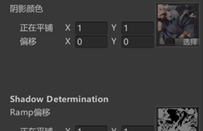
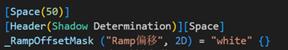

# TA零散知识


# 前言

知识非常杂。

Part1为Excel阶段，Part2为Mark Down阶段， Part3为有道云阶段。


# Part1

| 名称                            | 说明                                                         |
| ------------------------------- | ------------------------------------------------------------ |
| AO/环境光遮蔽/Ambient Occlusion | 如果两个物体靠的很近，比如我的手臂和身体的一侧，它们近的地方其实会偏暗。渲染中的漫反射（以PBR为例），物体的漫反射分为直接光源和间接光源两个部分，直接光源部分会受到遮挡的影响，但是间接光源部分不会，因为其值会直接由法线半球对Cube Map或球谐函数采样获得，无法计算遮挡，所以理应会稍暗的地方会偏亮。为了模拟正确的效果，会使用AO技术，目前的做法可以理解为：先通过（未知高级技术）烘培出AO贴图，再通过uv对AO采样，通过得值作为参数影响漫反射的强度。AO贴图常常是灰度图，白色代表无遮蔽，黑色代表完全遮蔽。 |
| 在Shader中灵活使用结构体        | 如下图，使用这种结构体可以轻松地批量计算、保存、分类变量，还可以创建纹理结构体，在片元着色器开始时使用函数先获取所有需要的纹素，非常方便。     只需要在Pass中创建这个结构体的实例即可使用 |
|                                 |                            |
| 简易编辑Shader的材质界面        | 如下图，使用Header  和 Space可以分别加入一条Title和空隙。Header的参数是要显示的内容，Space的参数是空多少像素 |
|                                 |                |
| 什么是GGX                       | 不可追溯全称，其是一种BRDF，可以糅合在其他BRDF中，主要体现在渲染glossy的高光上，能渲染出更逼真、更清晰的glossy高光。      在202笔记中也出现了GGX，本质上GGX就是一个类似高斯分布的函数，但它不是一成不变，它会随着粗糙度变化，它记录的是相对与面法线，微表面的分布如何。     比如PBR中，需要使用微表面模型，自然也使用了GGX来判断法线分布，不仅如此，在G项、自我遮蔽中也参考了GGX的值。     总结：GGX是一个实时级的分布函数，常用来在微表面模型中计算微表面与视线的对其程度。在微表面模型的D项、法线分布项中，用来计算观察方向有多少能量反射，同时也能计算高光。 |
|                                 |                          |
| 关于阴影渲染的几种方法          | 1.传统Shadow  Mapping，灯光渲深度，相机渲深度，比较深度判断渲染点是否在阴影下。     优点：快。     缺点：锯齿重。     补充：Unity里用的是类似的方法，但是有些许改进，叫做SSSM，Screen Space Shadow  Mapping，具体的需要再研究。     2.PCF。目前最常用的实时渲染中的阴影抗锯齿办法。     优点：效果不错，基本解决锯齿问题。     缺点：慢，但是近代GPU降噪技术和基于时间的算法技术使得PCF效率问题得到缓解。     3.PCSS。目前最常用的实时渲染中的软阴影的渲染办法。     优点：真实，近实远虚。     缺点：慢，同上。     4.VSSM，方差软阴影。     优点：比PCSS快。     缺点：默认遮挡情况为正态分布，导致突变区域（尤其是渲染镂空物体时）阴影渲染会出现问题，本被遮挡的地方易出现不明光照。     5.MSM，矩阴影隐射，VSSM的优化，不再默认遮挡情况是正态分布，而是用矩去拟合分布情况。     优点：效果好，比PCSS快。     缺点：复杂，比VSSM慢。     6.DFSS，距离场软阴影。     优点：快，效果好，原神面部阴影用的就是这个。     缺点：保存距离场需要大量空间，占用硬盘、内存和显存。 |
| 让环境光产生投影                | 不可能让每个像素都作为光源去考虑投影，工业界一般从Cube Map中找到最亮的部分来当做独立光源产生投影。或者不考虑让环境光产生投影、而是产生通过渲染方程中的V项产生AO这样的阴影。 |
| 关于PBR工作流                   | 目前主流的PBR工作流有金属粗糙度和镜面反射光泽度两种，对于AO、法线、自发光等常规贴图，它们的处理完全一致，这里不考虑。      金属粗糙度：base Color贴图（RGB，其中包含了物质的基本颜色和金属的反射率值，反射率即是F0）、金属度贴图（灰度，指定金属度）、粗糙度贴图（灰度，指定粗糙度）     优劣：     非金属的F0固定为0.04，无法调整；     主流的工作流，用途广泛；           镜面反射光泽度：diffuse（RGB，Diffuse贴图严格影响着材质的基本颜色而对材质的其他特征（如反射率）没有影响。）、镜面反射贴图（RGB，记录金属和非金属的F0）、光泽度贴图（灰度，指定光泽度）     优劣：     可以对金属、非金属的F0自由调整，但是这也非常容易做出违反能量守恒定律的材质；     两张RGB贴图，对性能的要求会更高；          思考：     1.手连PBR是金属粗糙度工作流的，金属度参数用来决定镜面反射受到多少base Color的影响。     2.对于镜面反射光泽度工作流，我猜测镜面反射贴图三维，分别记录两个F0、和类似金属度的值，用来在两个F0中插值。 |
| 关于顶点法线、切线和副切线      | 1.经过了平均法线写入工具的开发流程，我更理解了Mesh的顶点是一个怎样的存在，也理解了其实没有所谓的面法线，只有顶点有。顶点的法线是顶点携带的信息，是三维向量。     2.顶点的切线也是顶点携带的信息，也是三维向量（Unity中貌似是四维？），切线是与法线垂直的线，通过顶点的UV中的V值来确定唯一的一根。     3.顶点的副切线是垂直与上述两条线的线，有两种可能，通过v.tangent.w *  unity_WorldTransformParams.w决定，前者与DCC软件有关，后者与模型的Scale的负值的个数有关。 |
| 为什么法线贴图总呈现蓝紫色      | 法线向量是xyz3个值,  我们得找个东西来储存它, 用什么来存呢?     正好, 图片也是rgb3个值, 就用它吧          不过, 法线向量xyz这3个值的取值范围都是(-1, 1), 而rgb的取值范围是(0, 1), 需要换算一下     比如从x映射到r, 就这样算: r = (x + 1) / 2          因为大多数法线直指屏幕外: x=0, y=0, z=1     对应rgb为: r=0.5, g=0.5, b=1     所以法线贴图大多是蓝紫色 |


---

# Part2

## 前言

**我弃用了excel制作笔记**

之前参加“游戏的人”这个交流活动的时候，听一个策划大佬说用excel做笔记和策划案很方便。经过近半年的excel笔记经验，一开始觉得确实还不错，但后来接触了md，发现excel就是个垃圾！之后的笔记都会转md了。

---

**带有Part*字样的笔记文件，转移和保存时务必找齐所有部分**

---


## 关于深度测试的误解

之前我一直认为深度测试和深度写入之间有关系，得过了深度测试（怎么算过自己指定）才能指定是否写入深度，但其实不是这样。

其实**深度测试和深度写入是几乎独立的两个东西**。

用户可以指定是否开启深度测试、是否开启深度写入，这两个完全独立。唯一的一点点联系就是，如果片元的深度测试没有通过，这个片元会被直接舍弃，不再进行后续的流程。深度写入作为深度测试后面的一个流程，自然会被直接跳过。

 


---

## 在Shader中获取时间

虽然在入门精要里了解过，但是入门精要的笔记做得实在垃圾，没有写具体方法，而连连看获取时间相对简单，所以一直没有掌握。写理发店Shader的时候，遇到了这个问题，故回顾入门精要，要记住如下用法：

 


---

## 在Shader中添加HDR性质的颜色

无需多言

 


---

## 关于Scriptable Object

~~这不是开发的知识吗？~~

### 是什么

是一种资产的类型，类似于配置文件，但是它不仅可以用来保存数据，也可以用来实现函数。它的函数可以在自己写的、针对于它的、Editor的派生类来调用和控制。

### 干什么使的

**用来保存类似“Static”的共用的、不变的数据。**保存于此类资产的数据，不会随着游戏的关闭、重开而改变。比如可以作为配置文件保存敌人的各项数值，在敌人初始化的时候，使用这个资产里的数据，随后把这个控制资源给策划，让策划去调数值。这样不仅可以集中控制，而且可以节省内存，因为实例化后的各物体共用这一块资产内的数据。

**用于资产实现型工具制作。**这一条其实是我在研究插件“Pro Pixelizer”时顺便学习的，作者在插件的子工具中，使用了这种“资产实现型工具”。这种工具的使用流程是：创建工具资产 -》 操作资产 -》 实现工具功能。而一般的工具是：打开工具面板 -》操作工具面板 -》 实现工具功能。“资产实现型工具”创建资产时，创建的就是Scriptable Object的派生类的对象，而作为工具，仅有保存数据的功能时不够的，需要在Scriptable Object的派生类中实现方法。那如何调用这里面的方法？这需要Editor的派生类的支持，开发者需要自己写一个专用于这种资产的Editor的派生类，然后通过Editor的派生类定义GUI、绑定方法，如此即可。


---

## 关于“资产实现型工具”

这其实是我自定的名字，我也不知道别人叫这种工具叫什么。

这种工具的使用流程是：创建工具资产 -》 在检查器中操作资产 -》 实现工具功能。而一般的工具是：打开工具面板 -》操作工具面板 -》 实现工具功能。上面稍微提了一下“资产实现型工具”，我现在要说一些细则。

1. 一般Scriptable Object不实现什么方法，但是**“资产实现型工具”的Scriptable Object需要实现大量的方法**，虽然也可以在Editor里实现工具方法，但那会导致代码有点肿，和普通工具一样了，GUI代码和功能实现代码放在一块。

2. Custom Editor需要申明，这个编辑器针对于哪一种资产。如下代码块

   ```c#
   //在Editor类申明前，申明它针对于哪一种Scriptable Object，这里SteppedAnimation是一种Scriptable Object
   [CustomEditor(typeof(SteppedAnimation))]
   public class SteppedAnimationEditor : Editor
   ```

3. GUI的虚函数不再覆盖”OnGUI“，而是**覆盖”OnInspectorGUI“**。这控制检查器的GUI刷新。

4. 如果不给Scriptable Object写Editor，那么它的public参数会自动序列化，显示在检查器中。但是如果你写了Editor，这将不再是自动的，需要开发者自己写Scriptable Object的参数的显示逻辑，如下：

   ```c#
   //以下两个参数都是原Scriptable Object的public参数，但因为这里使用了Editor，如果不写这个，这两个参数将不再显示。
   EditorGUILayout.PropertyField(serializedObject.FindProperty("SourceClips"));
   EditorGUILayout.PropertyField(serializedObject.FindProperty("KeyframeMode"));
   ```

这种类型的工具相比于具有独立面板的工具，可以把功能实现代码和GUI代码分开，其他积极意义，目前没想明白。

如果将来想要开发“资产实现型工具”，这里写的东西很可能不够用，我把我学习的工具源码保存于此处：[资产实现型工具](E:\我的往期办公文件\Unity资源\学习\供日后参考\资产实现型工具)（Ctrl + 左键单击访问）


---

## 关于自定义材质GUI

虽然默认材质可以自动生成材质GUI，也可以通过Attribute设置一些简单的GUI，但是要更好地客制化，还是需要脚本的支持，Unity也提供了相应的基类供使用。

以下为使用方法和细则：

### 在Shader末尾、同FallBack一起、绑定GUI脚本

```c#
//	通过字符串指定GUI脚本名称来绑定GUI脚本，插件里作者把GUI脚本和Shader放在同文件夹下，因此没有路径信息。如果在不同的文件夹，
//	是否需要路径信息？这一点我真不知道。
CustomEditor "PixelizedWithOutlineShaderGUI"
FallBack "ProPixelizer/Hidden/MyPixelBase"
```

### 细则

1. 继承自ShaderGUI

   ```c#
   public class PixelizedWithOutlineShaderGUI : ShaderGUI
   ```

2. 重写OnGUI函数，和工具面板的OnGUI逻辑几乎一样

   ```c#
   //这两个参数是不能少的，第一个是这个材质的面板对象，用于添加GUI组件等，第二个是Shader的参数数组
   public override void OnGUI(MaterialEditor materialEditor, MaterialProperty[] properties)
   ```

3. 例行性工作，不知道这是不是自动生成的，但是不能少

   ```c#
   //更新面板，普通的工具也需要更新，作为GUI当然是需要频繁刷新的
   materialEditor.serializedObject.Update();
   //获取材质。虽然GUI脚本被绑在Shader上，但其实是没法对Shader操作什么的
   //GUI脚本肯定是基于某个使用了这个Shader的材质更改的
   Material = materialEditor.target as Material;
   ```

4. 陈列属性

   ```c#
   //作为GUI，基本的功能当然是显示并控制Shader的变量。一次变量的绑定过程如下
   var albedo = FindProperty("_Albedo", properties);
   editor.TextureProperty(albedo, "Albedo", true);
   ```

### 日后参考

这个ShaderGUI脚本是少有的，我把它保存下来供日后参考。其中含有完整的流程，也有一些如折叠参数菜单、开关等参数的设定方法，非常有参考价值。

[ShaderGUI](E:\我的往期办公文件\Unity资源\学习\供日后参考\ShaderGUI)（Ctrl + 左键单击访问）


---


## 关于软硬边和平滑组

这两个本质上是相同的概念，只是所处的DCC不同，叫法不同，在Maya中，叫做软硬边，在Max中，叫做平滑组，在Houdini中，这一块直接被Normal节点控制着。

在之前“法线平滑工具”的开发中，我了解到，一个点并非只是一个点，一个点连了多少条线（或者说被多少个平面共用），这个位置上就有几个端点（借用Houdini的说法），每个归属于其中一个面。这些端可以拥有不同朝向的法线。

### 关于软硬边

以一个Cube为例，它的一个顶点上，其实有3个端点（这里我们沿用Houdni的叫法）。我们看一条棱，这个棱有两个点、6个端点，每个端点有一个法线，而参与这条棱的两个面的端点，有4个。当这四个端点的法线朝向一致时（就像我用工具做完法线平滑一样），我们认为这是一条软边，当不一致时则认为这是一条硬边。在着色时，着色点的法线方向是靠重心坐标插值出来的，这意味着，如果有软边的参与，则两个相邻面的渲染、他们的交界处必然是平滑的，因为他们相交的边的端点的法线朝向相同。

### 关于平滑组

本质上在做和软硬边相同的事情。平滑组是类似于给面一个属性，如果两个相邻面的平滑组属性的值相同，则它们相交的边的四个端点会使用平滑后的法线（以四边形为例）。

---


## Unity的深度法线纹理

前向渲染中若要用G-Buffer需要在相机勾选生成深度法线纹理，这个深度法线纹理的深度是编码过的、非线性的、0~1的深度值。法线是观察空间的法线方向，也就是模型空间顶点位置乘以M矩阵和V矩阵后的那个坐标的空间，可以理解为，以相机为原点，相机顶为y正，相机朝向为z负方向的坐标系。

---


## URP渲染管线中，多PassShader的Pass执行顺序与执行可能问题

URP渲染管线中，默认不再支持多Pass渲染，但是通过一些特殊的Tag可以做到多Pass渲染。

已一个“先通过一个Pass渲染模板值到缓冲区、再通过另一个pass渲染扩张后的模型到颜色缓冲区”的描边效果为例：

通过给模板值Pass以"LightMode" = "SRPDefaultUnlit"，可以使其先执行。

通过给颜色Pass以"LightMode" = "UniversalForward"，可以使其后执行。

这样可以做到简易的多Pass。与Tag高度相关。

相关理论可以参考一下这篇文章：[知乎](https://zhuanlan.zhihu.com/p/469589277)。

相关落地用法，也可以看下这个：[CSDN](https://blog.csdn.net/zakerhero/article/details/106264067)。

这种方法仅适用于两个Pass，再多就只能用Renderer Feature的方法了。

---


## 关于Layer 和 Render Layer

### 是什么

Layer是物体的一个属性，本质是int型的一个参数。

 

它依附于每一个Game Object。

Render Layer是仅SRP才拥有的、一个FilterSetting的属性，本质也是一个int型的参数 。

 

上句是调用一次Draw Call的函数，参数m_FilteringSettings中，包含了Render Layer。

 

### 有什么用？

我起初接触的用法比较少，希望后续碰到能回来补充。

**Layer：**

1. 和Tag的定位类似，不过Layer似乎更常用于在渲染时、分辨一类物体。
2. 在SRP中，如果我自定义了一个Renderer Feature，我想它只对视口中的Layer值为1的物体起作用，那么我们需要在ScriptableRenderPass基类的重写的Execute函数（修改comand buffer）中，在需要传参数类型为FilteringSettings的地方，把这个参数对象的成员变量LayerMask改为1即可。

**RenderLayer：**

1. 我们可以**粗略的把Render Layer理解为一个Pass的属性**。默认情况下，通过Layer筛选过一遍要渲染的对象后，还要通过一遍物体对Pass的筛选。

    

   每一个Renderer组件都有一个Render Layer Mask（渲染层遮罩）的属性，本质是一个int型列表。当你想用一个Pass去渲染这个物体，Renderer组件会检查一个，你这个Pass的Render Layer的值，有没有在我的Render Layer Mask的列表中。只有在的情况，这个Renderer才会允许这个Pass去渲染这个Mesh。

   这个功能非常好用，比如我把所有可能会被描边的物体都放到一个layer中，可是对于Renderer Feature来说，一个Layer只能共同更改。也就是说，大家要么都有描边，要么都没有。这时我可以把目前不想描边的东西的Render Layer Mask（渲染层遮罩）的属性，删除掉描边Pass的Render Layer，这样这些物体就不会被渲染描边了。Render Layer Mask的值可以很轻松的动态修改。

### 总结

总之Layer 和 Render Layer就是一组分别位于渲染物体和Pass的辨识开关，只有两个开关都表示YES时物体才会被渲染。

---


## 关于URP Shader的CBUFFER

以前的批处理要求比较严格，Shader入门精要中：

> 来仔细说下批处理吧
> 分为静态批处理和动态批处理
> 静态批处理：
> 是用户手动指定的，操作方法是在Inspector面板把这个物体勾成static，就会被自动和其他同材质的东西打为一批了。这更自由，但是可能会消耗很多的内存，而且静态批处理后的物体无法移动。
> 动态批处理：
> 打开项目设置中的动态批处理后，就不需要做任何操作，Unity会自动把同一材质的物体打成一个批，而且这样批处理的物体是可以移动的。缺点是要求苛刻，顶点过多、或者光照环境稍微复杂，就无法再使用了。

总结一下就是，一般同材质的东西才能合批。

但是在URP中，放开了一些。只要物体同Shader，就有可能被合批；并且，得益于Shader变体之类的技术，一个Shader有了可以非常强大的可能。

为了使同一Shader的物体被合批，需要一些处理。本条目说的就是其中一个。

在Shader的属性声明处，使其被包裹在CBUFFER字段中，即可使同Shader、不同材质的物体被合批。

> ​	CBUFFER_START(UnityPerMaterial)
>
> ​      
>
> ​      half4 _Color;
>
> ​      half _Width;
>
> 
>
> ​      CBUFFER_END

 

但是要注意，多PassShader不可以喔。

---


## 关于软粒子

 

效果一目了然。

这么做的原理并不是关闭了深度测试，而是在片元着色器中比较渲染点的深度和深度纹理中取得的深度，若已经比深度纹理还深，说明其本来被遮挡，但此时再根据被遮挡的深度来对阿尔法值插个值即可做到这种效果。

**要注意，挡住的地方还是看不见的！这个效果只是让挡住和未挡住的地方过度平滑一些。**

这种方法对于视深的计算以及坐标系的转换的计算非常有参考价值。

[参考代码](https://blog.csdn.net/lsccsl/article/details/117926419)

[ASE中的连法](https://blog.csdn.net/qq_39574690/article/details/126448580)——注：ASE的默认粒子Shader模板中包含软粒子的算法，但是被一个全局变量限制，是一个项目设置中控制质量的变量，但是不知为何，目前我版本的Unity中没有这个选项开关。若想要开启软粒子，注释掉模板中的软粒子判断开关即可。

 


---


## 关于材质实例

如果有一个材质要用于不同的模型，而我又希望他们的参数不要同步的时候，就需要材质实例这个东西。也就是通过给与不同的模型以不同的材质实例来达到目的。

如下的melee，我希望其中一个头骨在dissolved的时候不要影响另一个，就需要材质实例

 

使用材质实例时，检查器中的材质面板会显示Instance：

 

### 分清楚Material和ShaderMaterial

二者都是Renderer组件的属性之一，二者的类型都是Material。

前者是该**物体的材质实例**，后者是**使用该Shader的材质模板**。

默认状态下，如果在代码层面不做任何修改，物体使用ShaderMaterial进行渲染，也就是说没有这个Instance。此时如果直接通过材质面板修改参数、或者修改ShaderMateria的属性，就会导致所有使用改材质的物体都被影响。

如果通过代码修改Material内的属性，则会自动创建一个材质实例，替换原来的材质，本次修改仅对该物体有效，对其他的同材质物体无效。

如果想在初始化的时候就区别开所有的材质实例，可以在Start函数中随意调用一下Material属性，只要调用就会自动生成材质实例，如下一些都是可行方式：

- New Material(meshRenderer.material)——可能会导致检查器中出现两个instance标志
- var temp_or_member_var = meshRenderer.material
- var temp_or_member_var = meshRenderer.materials[i] （多材质时）
- Function(mershRenderer.material)

### 内存泄漏问题

材质实例虽好，但是必须手动删除，否则一直存在于内存中。

使用Destroy函数即可手动释放该材质实例。

可以方便地在Mono类的OnDestory函数中写该部分内容，如下：

```c#
void OnDestroy()
{
    //Destroy the instance
    foreach (Material material in shaderMaterials){
        Destroy(material);
    }
    print("现存材质实例数量" + Resources.FindObjectsOfTypeAll(typeof(Material)).Length);
}
```


---


## 使粒子系统可以控制自定义Shader的材质的颜色

如我自己写了一个材质，但是此时粒子系统组件不能控制材质的颜色，这是因为粒子系统是通过改变顶点色来控制最终的渲染颜色。

因此，只需要在颜色计算时考虑**顶点色**，即可使粒子系统组件对材质表现出控制权。

 


---


## 关于资产预处理——Asset Post Processing

### 什么是

所有类型的资产（如模型、音频、图片）导入时都会过一遍该类型的所有的预处理，如下模型的：

 

预处理可以帮助Unity更好的理解资产，可以给资产做规范化等等。

比如我希望我项目中的所有模型，他们的Mesh的中心都是原点，那么就可以写一个资产预处理，在导入时Unity会自动通知你写的回调函数，然后执行操作更改资产。注意，这里的更改并不会更改源文件，而是让Unity对资产有额外的理解，在理解层面更改资产，源文件本身不会被改变。

### 怎么写

1. 继承 AssetPostprocessor

2. 在相关回调中编写需要处理的代码

    

3. 触发相应的重新导入，即可看到效果。

### 参考

[资产预处理](E:\我的往期办公文件\Unity资源\学习\供日后参考\资产预处理)

[本人写的知乎文章——关于自动中心化锚点](https://zhuanlan.zhihu.com/p/605306790)

---


---

# Part3


## 前言

泪目，Part2没用多久就殒命了。

原因是我开始工作了，为了在公司和家里方便地交流知识，只好采用线上笔记的方式。

 


## 关于插件更新的预想

2023.3.17读到一篇博客，讲了Maya插件更新功能的实现思路。[原文](https://www.cnblogs.com/meteoric_cry/p/15905357.html)

我一想，我迟早要自己编写插件更新的功能，于是按个人的疑惑问了一下ChatGPT，最后决定记下一些个人的理解。

### 什么是URL

统一资源定位符（Uniform Resource Locator）。就是一个标记文件在在服务器主机中的位置的字符串。

如：例如，http://www.example.com/index.html就是一个URL，其中http是协议，www.example.com是主机名，index.html是路径。

 

那么URL如何在更新中被使用？

URL可以指向新版本的插件，有URL，我们就可以通过代码把新版本下载用户的本地电脑中，如下Python脚本：

import urllib.request

 

url = 'http://example.com/file.txt'

save_path = 'D:\\temp\\file.txt'

 

urllib.request.urlretrieve(url, save_path)

print('文件下载成功！')

 

### 更新的整体思路

 

**在初版插件中就内置检查更新功能。**

检查更新时，将从服务器下载一个XML或Jason配置文件，用来记录版本信息和最新版本的URL。

如果用户版本不是最新的，则弹出对话框提示用户更新。

 

**下载**

用上面的代码下载最新的插件文件到本地。

 

**安装**

也可以写在更新程序中（通常更新程序和本体程序区分开来），主要是一些文件的替换和移动。

 

### 企业中运用

问了导师，说是项目组中会有自己的类似Git的项目托管，工具也会依托托管得到更新，不需要这样的传统软件更新方式。

但是了解一下也不是坏事，对吧？

 

 

 

## 关于Python装饰器和C#转义标识符

这天查Python的时候发现函数声明上一行有@……的用法，问GPT发现是函数装饰器。想起来C#也有类似的用法，比如@override，就想问这俩是不是基本一致，但发现其实根本不是一个东西。

Python中的@……叫装饰器，用于标志这个函数不是这么运行的，它被改了，在其他的地方。

C#中的@……叫做转义标识符，用于解释一些特殊的情况，这些情况在未标识时会报错。比如C#中规定，子类的函数不能和父类重名，但是虚函数打破了这个规定，是不合法的。这时需要用@override标志子类中的重名函数，则可以使这种用法合法。

 

 

 

## 空间、矩阵和变换

### 总结：

父空间坐标到子，消除父影响，左乘子空间在父空间的逆变换矩阵

子空间坐标到父，重新考虑父影响，左乘子空间在父空间的变换矩阵

如果一个矩阵能使A空间坐标转移到B空间，那么这个矩阵的逆矩阵就可以把B空间的坐标转移到A空间。

如果矩阵和坐标同空间，就是简单的变换。

如果矩阵是同空间逆矩阵，既可以理解为同空间做逆变换，也可以理解为父空间坐标到子空间，数学结果相同。

 

### 关于SMTP的个人理解


 

### 关于空间转换的小推导和验证

想要把子空间下的坐标转移到父空间？那不就是把子空间在父空间中的变换再应用到坐标就行吗。

如子空间有一点P（1，1）

子空间在父空间的变换矩阵为：

1 0 1

0 1 1

0 0 1

意义是向XY方向各前进一个单位。

再把这个变换应用于坐标P，得到坐标P（2，2）

这不就是P在父空间下的坐标吗？

小结：

子空间坐标到父空间坐标，给坐标应用子空间在父空间的变换即可

 

反过来，想要把父空间的坐标转移到子空间？那不就是撤销一下子空间在父空间的变换就行嘛

如有父空间一点P（1，1）

子空间在父空间的变换矩阵为：

1 0 1

0 1 1

0 0 1

它的逆变换为：

1 0 -1

0 1 -1

0 1 1

我们将逆变换应用于顶点，得到坐标（0，0）

这不就是P点在子空间下的坐标吗？

小结：

父空间坐标到子空间坐标，给坐标应用子空间到父空间的逆变换即可


 

 

 

## 矩阵左乘和右乘

我一直没有理解，感觉也不太能理解。

根据GPT总结的经验：

变换应用到坐标时，坐标（列向量）右乘变换矩阵

给坐标换坐标系时，坐标左乘逆父变换矩阵

**这是错误的！**

**在图形学中，全部都是：坐标左乘变换矩阵！**

如有仿射变换矩阵M，使其作用于坐标的方式是：

P’ = MP

如果有多个变换依次作用于坐标，如依次对坐标做M1、M2变换，理论的最终坐标值是：

P‘ = M2M1P

计算过程都是从右向左，意为：P’ =（M2（M1P））

写在UnityShader中为：P‘ = mul(M2, mul(M1,P))

 

 

 

## 关于骨骼和蒙皮

主要参考文章：[CSDN](https://blog.csdn.net/n5/article/details/3105872)

 

### 骨骼的本质是什么

如果通过DCC看，骨骼不过就是一堆Transform嵌套，都包含着其在**父节点坐标系下的**Translae、Rotation和Scale的三维向量信息。

是的，骨骼的本质就是一个**普通的正交坐标系**。如果把它抽象成一个类，其中Translae、Rotation和Scale的三维向量信息是它的显性属性，为了使其能够满足上面的运算需求，它还会有很多隐性的属性。

 

### 蒙皮Mesh中，如何确定顶点在世界空间中的位置？

在普通的静态Mesh中，顶点中储存了它在模型空间下的位置，这个位置通过M矩阵可以转到世界空间下。

顶点在模型空间的坐标---<模型矩阵>--->顶点在世界空间的坐标

 

但是对于蒙皮Mesh则需要做进一步的处理：

**mesh vertex (defined in mesh space)---<BoneOffsetMatrix>--->Bone space---<BoneCombinedTransformMatrix>--->World**

**顶点在模型空间的坐标---<骨骼偏移矩阵>--->顶点在骨骼空间的坐标---<骨骼组合变换矩阵>--->顶点在世界空间下坐标**

 

### 什么是BoneOffsetMatrix矩阵？怎么算？

把顶点**从模型空间转移到骨骼空间的矩阵是骨骼偏移矩阵。**

这个矩阵保存在骨骼节点中，每个骨骼节点一个。其在DCC进行蒙皮操作时写入数据，然后就一般不再改变。

这模型空间和骨骼空间并不是什么父子关系，但是是同处世界空间下的两个坐标系，所以把顶点坐标从模型空间转移到骨骼空间时，需要：

**模型空间顶点坐标---<模型矩阵>--->世界空间---<递归地将坐标转移到指定骨骼节点>--->指定的骨骼空间的顶点坐标**

在建模规范中，往往使模型空间与世界空间重合，所以第一步常常可以省去，变为：

**世界空间顶点坐标---<递归地将坐标转移到指定骨骼节点>--->指定的骨骼空间的顶点坐标**

从上面来看，这个“<递归地将坐标转移到指定骨骼节点>”的矩阵，就是我们需要的BoneOffsetMatrix，它怎么求呢？

以下图的情况为例：

如果我想把世界空间的坐标Pw转移到b2骨骼节点空间，根据我们之前总结的经验：父到子，消除父空间影响，左乘子空间在父空间的逆变换：

Pb2 = (M3^-1 (M2^-1 (M1^-1Pw))), 根据矩阵和逆矩阵的性质，可以写成：

Pb2 = ((M1M2M3)^-1)Pw

所以，这个(M1M2M3)^-1就是所谓的BoneOffsetMatrix，这里的M123都是在创建骨骼的时候就定好的，含义是骨骼节点在其父空间下的变换。

*：M1M2M3可以理解为初始状态的BoneCombinedTransformMatrix，初始状态下，BoneOffsetMatrix就是BoneCombinedTransformMatrix的逆矩阵。


 

### 什么是BoneCombinedTransformMatrix？怎么算？

即骨骼组合变换矩阵。这个矩阵并不保存在骨骼的数据结构中，而是在需要时计算。

一个骨骼节点算出一个骨骼组合变换矩阵，在当前骨骼的上游（包括这个骨骼自己）如果任意骨骼发生变换，这个矩阵就会改变。

我们知道，骨骼的本质就是一个变换，记录它在父空间下的变换，如果是根骨骼，它的父空间为世界空间。那么从目标的骨骼节点坐标出发，一路递归考虑父节点影响，最后不就能得到世界空间下的坐标了吗？这里算出来的矩阵，不就是需要的骨骼组合变换矩阵吗？

那么根据之前总结的空间换算方法：子到父，重新考虑父影响，左乘子空间在父空间下的变换，以下图情况为例：

把bone2坐标系下的某点P的坐标转移到世界空间下的坐标的步骤就是：

**顶点在该骨骼坐标系下的坐标---<BoneCombinedTransformMatrix>--->顶点在世界坐标系下的坐标**

即：

Pw = M1M2M3Pb2

这个M1M2M3也就是需要的BoneCombinedTransformMatrix了。


 

### 疑惑

我被一个问题困扰了一段时间：

既然:

**Pmesh---<((M1M2M3)^-1)>--->Bone space---<M1M2M3>--->World**

**这两个过程难道不是相互抵消了吗？因为根据逆矩阵的性质：**

((M1M2M3)^-1 X M1M2M3 = I（单位矩阵）

那这个过程其实没有对坐标做任何操作。

后来我才明白过来，第一个步骤中的M1M2M3在DCC蒙皮中就已经写入骨骼节点，以OffsetM的形式保存了，之后不会再改变；

而后一个步骤的M1M2M3已经被动画改变，而且每一帧都会更新，所以其实这两个步骤中的矩阵并不是同一个矩阵，那会使得坐标变化也是理所应当的啦。

 

### 蒙皮Mesh的渲染流程

void myDisplay(void) {

  // 清除缓存

  glClear(GL_COLOR_BUFFER_BIT);

  // 绘制原为变形Mesh，仅作调试用

  g_mesh->DrawStaticMesh(0,0,0);

  

  // 读取动画文件，更改各骨骼节点中存放的其在父空间下的变换矩阵

  animateBones();

  

  // 计算骨骼节点在世界空间下的位置，本质是计算CombineMartix

  g_boneRoot->ComputeWorldPos(0, 0, 0);

  // 遍历顶点，通过之前讲述的流程计算蒙皮后顶点的位置

  g_mesh->UpdateVertices();  

  

  // 绘制蒙皮Mesh

  g_mesh->Draw();

  

  // 绘制骨骼，调试用

  g_boneRoot->Draw();

  

  glFlush();

 

  glutSwapBuffers(); 

 

}

**读取动画，插值递归计算每一节骨骼世界坐标**

由CPU处理。

骨骼的每个节点都记录着自己在父空间下的变换，读取动画文件，将更改应用于这些变换，得到一个静态的、该骨骼在父空间下的变换矩阵。

通过递归的方法算出每一节骨骼的BCTM（递归地对子骨骼应用父骨骼的变换）

 

**蒙皮变形**

由CPU处理，输入原始mesh，遍历顶点。

先以每个顶点仅由一节骨骼影响的情况论述：

根据之前的推论：

顶点在模型空间的坐标---<骨骼偏移矩阵>--->顶点在骨骼空间的坐标---<骨骼组合变换矩阵>--->顶点在世界空间下坐标

这两个矩阵，骨骼偏移矩阵在骨骼节点中保存，骨骼组合变换矩阵在上一个步骤中也被计算出来保存在骨骼节点中。

有这两个矩阵后，就可以算出对于这一个骨骼节点，这个顶点的位置应该在哪里。

再考虑加权的情况，无非就是根据顶点中的数据（两个数组，一个保存骨骼的指针、一个保存骨骼的权重），遍历会影响它的骨骼，然后得出四个位置，再根据权值计算出平均位置，即是这个点最终的世界空间位置。

 

**渲染**

计算出的图元通过DrawCall调用GPU绘制

 

### 解答疑问：为了实现蒙皮，需要哪些条件？

l 几何体的顶点中需要保存影响它的骨骼的指针数组和权重数组

l 需要确认顶点中的指针指向有效的骨骼层次结构的骨骼节点

l 需要有一组用于控制的骨骼层次结构

l 其他基本常规要素，如模型、图形API（用于将图元打包成数据发送给GPU）、着色器等

 

 

 

## 状态模式详解

在制作工具的时候，如菜单选项这种，如果没有使用状态模式，和容易遗漏项目导致一些疑难杂症。

比如进入选项A，然后再进入选项B，此时并没有所谓的退出状态的代码，程序不会有任何操作，但是这两个操作确实实打实的叠加关系，会导致问题，而且此时一般都处于项目后期了，修改很难……

果然对于菜单选项这种东西的程序设计，还是使用状态模式为宜。

状态模式把状态也封装成类了，并且每个状态都是一个派生类，代码相对繁琐。所有考虑把这一块单独做成一个文件比较好。


 

 

 

## 配置文件、把代码写得优雅！

在工具SkinningCopyTo的开发中，我写了下面的屎山：

\# 回调：选择骨骼关联方式

def ChooseBoneCombineMode(sel):

  global skinningSetting

 

  if sel == u'根据关节位置关联'  or sel == u'使用源的骨骼'  or sel == u'复制源的骨骼':

​    skinningSetting.boneCombineMode = "closestJoint"

  elif sel == u'根据骨骼体关联' :

​    skinningSetting.boneCombineMode = "closestBone"

  elif sel == u'根据标签关联' :

​    skinningSetting.boneCombineMode = "label"

  elif sel == u'根据局部名称名字关联（仅去除命名空间部分）':

​    skinningSetting.boneCombineMode = "name"

  elif sel == u'根据骨骼层次结构关联':

​    skinningSetting.boneCombineMode = "oneToOne"

硬编码罢了，思来想去，怎么都觉得不够优雅，于是想到了使用字典：

mode_dict = {

  u'根据关节位置关联': "closestJoint",

  u'使用源的骨骼': "closestJoint",

  u'复制源的骨骼': "closestJoint",

  u'根据骨骼体关联': "closestBone",

  u'根据标签关联': "label",

  u'根据局部名称名字关联（仅去除命名空间部分）': "name",

  u'根据骨骼层次结构关联': "oneToOne"

}

 

def ChooseBoneCombineMode(sel):

  global skinningSetting

 

  if sel in mode_dict:

​    skinningSetting.boneCombineMode = mode_dict[sel]

比较优雅了，但是这个字典很碍眼，这不就是一个配置吗？最适合配置的，不是JSON文件吗？于是我向GPT了解了一下JSON：

当然可以。JSON（JavaScript Object Notation）是一种轻量级的数据交换格式，它基于JavaScript语言的一个子集，但是可以被其他编程语言如Python、Java等所支持。JSON格式非常简洁，易于阅读和编写，并且可以很好地表示各种数据类型。

JSON数据是由键值对组成的，键值对之间用逗号分隔。键必须是字符串类型，值可以是字符串、数字、布尔值、数组、对象等数据类型。JSON数据通常以文件形式存储，扩展名为 .json。

下面是一个简单的JSON示例：

{

  "name": "John Doe",

  "age": 30,

  "isMarried": false,

  "hobbies": ["reading", "swimming", "traveling"],

  "address": {

​    "street": "123 Main St",

​    "city": "New York",

​    "state": "NY",

​    "zip": "10001"

  }

}

 

这个JSON数据包含了一个人的姓名、年龄、婚姻状况、爱好和地址信息。其中，name、age、isMarried、hobbies和address均为键，对应的值分别为字符串、数字、布尔值、数组和对象。

在Python中，可以使用标准库中的json模块来解析和生成JSON数据。例如，读取上面的JSON文件可以使用如下代码：

import json

 

with open('example.json', 'r') as f:

  data = json.load(f)

 

\# data变量就是一个Python字典，可以通过键来访问对应的值

print(data['name'])

print(data['hobbies'][0])

print(data['address']['city'])

 

这样就可以将JSON数据转换成Python的字典对象，方便后续的处理。

 那用JSON保存配置不就行了么，多好：

{

  "骨骼关联配置" : {

​    "根据关节位置关联": "closestJoint",

​    "使用源的骨骼": "closestJoint",

​    "复制源的骨骼": "closestJoint",

​    "根据骨骼体关联": "closestBone",

​    "根据标签关联": "label",

​    "根据局部名称名字关联（仅去除命名空间部分）": "name",

​    "根据骨骼层次结构关联": "oneToOne"    

  }

}

然后我们去代码里读取：

import json

 

with open('config.json', 'r') as f:

  mode_dict = json.load(f)["骨骼关联配置"]

 

def ChooseBoneCombineMode(sel):

  global skinningSetting

 

  if sel in mode_dict:

​    skinningSetting.boneCombineMode = mode_dict[sel]

优雅至极！

但是，在后来我发现在定义组件的时候，我也写了屎山：

 \# 骨骼对应方式菜单

cmds.formLayout()

cmds.optionMenu("BoneCombineMode" ,label='骨骼关联方式', w=400, h=30, cc = ChooseBoneCombineMode, acc = 1)

cmds.menuItem( label=u'根据关节位置关联' )

cmds.menuItem( label=u'根据标签关联' )

cmds.menuItem( label=u'根据局部名称名字关联（仅去除命名空间部分）' )

cmds.menuItem( label=u'根据骨骼层次结构关联' )

cmds.menuItem( label=u'使用源的骨骼' )

cmds.menuItem( label=u'复制源的骨骼' )

cmds.menuItem( label=u'根据骨骼体关联' )

cmds.setParent('..')

你都写了配置文件了，为什么不从那里读取呢？

大可以改成：

 \# 骨骼对应方式菜单

cmds.formLayout()

cmds.optionMenu("BoneCombineMode" ,label='骨骼关联方式', w=400, h=30, cc = ChooseBoneCombineMode, acc = 1)

 

for key in mode_dict :

  cmds.menuItem( label = key )

 

cmds.setParent('..')

这不是清爽多了？

 

 

 

## 哈希

 

### 什么是？

哈希是一类算法，可以把**任意长度的输入转化为指定长度的字符串输出**。如：a7529dfe23（这是一个哈希值，10位16进制，可以表达最多16^10种情况）

 

### 特点是？

**高度离散性、随机性、不可逆性**

只要输入发生任意微小变化，输出的哈希值就会发生不可预测的、极大的、（理论上有规律）无规律的改变。

只能从资产到哈希值，哈希值无法反推出原资产。

 

### 怎么用？在哪里用？

\1.   用作数字签名、保证数字资产的完整性、确认一个资产确实是一个资产，没有经过修改。

\2.   服务器储存密码。如果你是服务器，直接把用户输入的密码储存到服务器是极其不负责的行为，因为一旦服务器被工具，用户的密码就全泄露了。使用哈希加密后，即使攻击者得到了用户的密码哈希值，也不可能通过哈希值得到用户的密码。

\3.   数据库索引。和数字签名类似的，可以在服务器中通过哈希值查询到某个指定的资产。目前Stable Diffusion就是这么做的。

 

### 大概是怎么被算出来的？

基本是将数据分块、填充、压缩后算出来的，中间有很多参数。

常见的有SHA-1、SHA-256、MD5等。

 

### 哈希冲突

既然是一种对资产的高度抽象算法，那么是有可能会出现多个输入对应一个输出的情况的。这种就叫哈希冲突。

但是凭借哈希算法的高度离散性和不可预测性，哈希算法被认为是安全的。

正常使用的话，一般来说不会造成哈希冲突。

 

### 哈希碰撞

[实例](https://linux.cn/article-8238-1.html)

唉，既然哈希冲突是既定存在的事实，那么自然可以借用哈希冲突来造成攻击。

通过特殊的方法破解哈希加密，使得不同的资产得到相同的哈希值的方法，叫做哈希碰撞。

目前MD5和SHA-1均已被破解。

上面也说了，哈希值常作为签名、密码使用，这一旦被破解，各种数据安全和证书等问题，就会变得不堪一击。

 

### 在高级编程语言中的用处

哈希算法在高级编程语言中是非常常用的。

比如常见的字典、集合，本质都是哈希表。

在查询时，键值通过哈希算法得到哈希值，再通过哈希值寻址找到数据的位置。得益于精妙的算法，这个步骤非常快。

起初我以为字典、哈希表、键值对、都是一个东西，后来发现其实有非常微小的区别：

工作以后就会发现，项目中有时候用到哈希表，有时候用到字典表，这两个都是索引、值得表现形式，那么它们的区别在哪里？

 以下是笔者总结的区别：

1.字典是线程不安全的，哈希表是线程安全的，所以一般情况下单线程用字典，多线程用哈希表。

2.字典是泛型的，数据不需要经过装箱，拆箱操作，效率更高，而哈希表不是泛型的，需要经过装箱拆箱，效率低。

3.字典中元素的排列顺序是按照插入排序的，而哈希表不是。

4.哈希表最大优势在于索引方式，是经过散列处理的，在数据量大的时候优势明显。

而键值对的概念比较宽，只要是把键和值映射的、一对一的映射关系，都可以被称为键值对。

 

 

 

 

## 关于Include 和 Import

import和include 的区别是？

import和include是两个不同的概念，它们在不同的编程语言中有不同的用法和含义。

在高级编程语言中，import通常用于导入其他模块或库，如Python中的import语句。而include通常用于将其他源代码文件的内容嵌入到当前文件中，如C语言中的#include语句。

虽然它们都可以用于将其他代码包含到当前文件中，但import通常用于导入可执行代码（如函数、类等），而include通常用于包含预处理器指令（如宏定义等）和数据结构的定义。

另外，import通常是动态的，即在运行时根据需要导入模块，而include通常是静态的，即在编译时将被包含的代码嵌入到当前文件中。

include的处理方式非常简单，就是直接把include 的文件的内容在编译时复制到include语句的位置。

那么在执行import时，导入的是模块的源代码还是编译后的内容？

这取决于编程语言和具体的实现。 

在Python中，当你执行import语句时，Python会在sys.path路径中查找指定的模块，并将其编译为字节码文件（.pyc或.pyc文件）缓存到__pycache__目录中。下一次导入相同的模块时，Python会直接加载缓存的字节码文件，而不是重新编译源代码。因此，在Python中执行import语句实际上是导入编译后的字节码文件。

在其他编程语言中，如Java，当你执行import语句时，编译器会将导入的类编译为字节码文件（.class文件），并将其打包到JAR文件或类路径中。在运行时，JVM会加载字节码文件并执行它们。因此，在Java中执行import语句实际上是导入编译后的字节码文件。

总之，大多数编程语言都会在导入模块时进行编译或转换，以便在运行时更高效地执行代码。

 

 

 

## Git的使用

因为已经用了很久的分布式版本管理了，这里只记一些不太了解的。

再你妈的见，有道。

 

### 重置参数


在TortoiseGUI中，可以在版本树中回退版本：


### 不要全部文件都托管

右键菜单中可以从库中删除这个文件，也可以通过配置把这个文件加入忽略列表中


 

### 使用分支并行开发

可以本地创建分支，然汇切换检出到新的分支。

在新分支上的修改会连同新分支的创建一起提交到云端，届时云端也会出现新的分支。


合并操作需要先切换到**“合并的目标”**这个分支，再使用合并命令指定合并的源。

 

### 变基

一图看懂好吧：


好处是可以不用再手动清理无用分支，工作树比较好看。

坏处是改变了历史，可能出现错误。

一般来说，如果是自己一个人开发的项目，可以用用变基，但如果安全性有要求，或者和别人合作的话，还是别变基了。

 

### 版本回退

本地版本回退只要选中要退的版本，右键重置就行，上面也提及了回退的参数。


但是云端的项目版本是最新的，你退了版本再推上去是推不动的，要强制覆盖：


如此，之前的所有更改就都没了，记得备份。

 

### SSH协议和HTTP协议

在一些保密程度较高、规范性较强的项目中，往往使用SSH协议：


SSH通过Git的客户端生成，TortoiseGUI也可以：https://www.jianshu.com/p/1bbf5e25c912

SSH密钥分为公钥和私钥，公钥交给项目，当项目添加了你的公钥后，你可以拉取和查看项目。

当你提交时，使用你的私钥签名。只有私钥和项目中的公钥相互匹配（私钥和公钥是一对一的），你才可以提交。

总的来说，SSH就像是一个简易的账号密码，不依赖于第三方的什么服务器而已，只有被添加进项目的人才可以提交更改。

 

但是如果是自己个人的垃圾项目HTTP协议就完全够用了。。。

 

---


## lib和dll

DLL ：Dynamic Link Library 动态链接库。在程序运行时，如果运行到引用了DLL的地方，程序就会动态地加载这个DLL，读取里面的函数和变量。

LIB ： Liberal，静态链接库。其在程序编译的时候就会一起被打包到exe中。

他们都是编译后的二进制文件。

由于他们的链接特性不同，打包后的主程序可以脱离Lib运行，但是不能脱离DLL运行。

在IDE中，可以设置Lib和Dll的路径，来识别里面的函数和变量等。这样就可以正确的Import或者include了。


---


 

 

 

 

 

 


