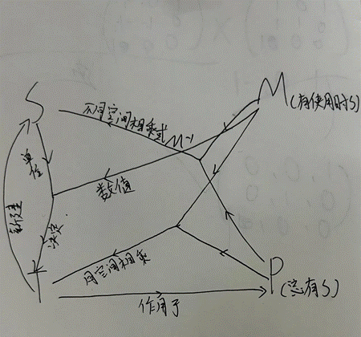

# TA零散知识

知识非常杂。

早期的笔记（比较靠前）看上去比较稚嫩，很多类似常识的东西都记下来了。。。

修复中。。。

2023.6.9 Part1修复完毕


---


# AO-Ambient Occlusion-环境光遮蔽

如果两个物体靠的很近，比如我的手臂和身体的一侧，它们比较靠近的地方其实会偏暗。

渲染中的漫反射（以PBR为例），物体的漫反射分为直接光源和间接光源两个部分，**直接光源部分会受到遮挡的影响**，但是**间接光源部分不会**，因为其值会直接由法线半球对Cube Map或球谐函数采样获得，所以**无法计算遮挡**，这会导致本来稍暗的地方会偏亮。

为了模拟正确的效果，会使用AO。目前的做法可以理解为：先通过DCC（如SP）烘培出AO贴图，再通过uv对AO贴图采样，**通过得值乘以漫反射的强度**来造成影响。

AO贴图常常是灰度图，**白色代表无遮蔽，黑色代表完全遮蔽**。

关于AO在后来的学习中遇到了很多：

查阅：[百人计划笔记 ：SSAO](../百人计划学习笔记/百人计划学习笔记.md#61：SSAO)

GAMES 202 —— SSAO：

> 和之前的3D空间下的计算区分开来，之前的叫“图像空间”（Image  Space）。屏幕空间下的处理就基本是后处理了，输入是若干图，输出最终图。      关于AO、之前在零散知识积累中记过一些，但其实想来根本没有那么复杂。记得在入门精要中提到的标准光照模型中，有一项Ambient项，代表环境光，在那里这个项就是一个定值。但是为了模拟环境光遮蔽的效果，其实可以在Ambient项上做一个遮罩，使有的地方环境光亮、有的地方则暗，使得其立体感更强。     AO的原理就是对于每一个渲染点，我计算它在法线半球的可见性的Cos加权的平均，最终得到一个0~1的值代表环境光强度，把这个保存到贴图上即是AO贴图，和一个遮罩很像。     如何基于屏幕空间来做？     1.首先，根据屏幕空间的像素位置和深度（所以需要渲染深度图）可以构建一个三维坐标，作为这个渲染点的位置。     2.以这个渲染点为中心、记录的法线方向（所以还需要渲染法线方向图）为方向构建一个半球，半径自己指定。     3.向半球中随机撒点，通过点的z值和记录的深度图的z值可以判断这个点对于相机是否可见。简单判断是否可见往往会导致不该出现AO的地方也有AO，因为遮挡物可能离渲染点非常远。所以这里也可以加上一个判断，若二者深度相差太多则不算遮挡。     4.用Cos a（a为点到球心的连线与法线的夹角）加权平均洒下的各点的可见性，即可得到大概的环境光的强度值。     5.最终应该渲出一张灰度图，把它叠加到原渲染纹理中去即是最终结果。


---


# 在Shader中使用结构体

在学习NPR的时候，我参考了大佬写的Shader。

这个Shader在结构体的使用上做得非常美观合理，我认为非常具有参考价值。

如果自己做一些比较大的Shader时，也使用这种方法吧。

参考文章：[罪恶装备](https://zhuanlan.zhihu.com/p/493802718)

      


---


# 编辑Shader的材质面板


## **使用属性标签（约束、Attribute）来简易地编辑Shader的材质面板**

[参考](https://docs.unity3d.com/Manual/SL-Properties.html)

列举一些常用的：

```c#
[Header(MyFloat)]// 加一个标题
[space(20)]// 加一点空隙
_MyFloat("MyFloat",Range(0,1)) = 1.0
```

效果：

 

除了上面这两个能用的，其他的C#能用的这里都不能用，很垃圾。

基本只有下表中的语法能用：


## 使用Custom Shader GUI

更**自由**的方式，可以做很多**炫酷**的材质UI。

但是比较**麻烦**，得看值不值得去写这个东西。

[跳转](#关于自定义材质GUI)


---


# 关于GGX

在渲染尤其是**真实感渲染**中，我们总会看到一个词叫**GGX**，它总是和微表面模型等概念一起出现。

> GGX是一种用于描述光学反射和折射**分布的函数**，通常用于计算三维计算机图形中的材质反射和折射。GGX代表Gaussian or Generalized Gaussian distribution（高斯或广义高斯分布）的缩写，也称为Trowbridge-Reitz分布。 GGX函数旨在模拟实际材质表面的微观结构，以产生更真实的光照效果。

不可追溯全称，其是一种分布函数，可以参与BRDF的计算，主要体现在**渲染粗糙度大的镜面反射**上，能渲染出更逼真的j页面反射部分。

在202笔记中也出现了GGX，本质上GGX就是一个**类似高斯分布的函数**，但它不是一成不变，它会随着粗糙度变化，**它记录的是相对与面法线，微表面的分布如何（微表面与面法线的对齐程度）**。   

比如PBR中，计算D项（法线分布函数）需要使用微表面模型，自然也使用了GGX来计算微表面分布，不仅如此，在G项（自我遮蔽项）中也参考了GGX的值。     **总结：GGX是一个实时级的分布函数，常用来在微表面模型中计算微表面与视线的对齐程度。在微表面模型的D项、G项中，用来计算观察方向有多少能量反射。因为其作用于DG项，所以其本质仅对镜面反射部分产生影响。**

            


 


---


# 阴影渲染

列举一些阴影渲染方法：

| 名称                                                    | 说明                                                         | 优点             | 缺点                             |
| ------------------------------------------------------- | ------------------------------------------------------------ | ---------------- | -------------------------------- |
| Shadow  Mapping                                         | 灯光处渲深度，相机渲深度，在正式**渲染渲染点时，比较两个缓冲区中的深度**，判断渲染点是否在阴影下。<br />这只是一种基本的思路，目前没有任何成熟的引擎直接使用这种阴影映射方式。 | 快               | 锯齿重                           |
| SSSM（Screen Space Shadow  Mapping）                    | 对Shadow Mapping做了一些改进，它先渲染灯光处深度，然后在屏幕空间再渲一次深度，**对比两个深度得出一张阴影图**（灰度图，说明该像素的阴影的强度。）<br />在**渲染渲染点时，从阴影图中用屏幕空间坐标采样得到阴影系数**，然后拿去影响颜色就行了。<br />相比传统Shadow Mapping，就是多了一步生成阴影图。 | 快               | 可能有伪影                       |
| PCSS(Percentage Closer Soft Shadows/百分比接近的软阴影) | [详见GAMES202：PCSS](../GAMES202学习笔记/GAMES202学习笔记.md)<br />以滤波核的形式去在比较两个缓冲区中的深度，看有**多少比例被遮挡**，多少比例未被遮挡。通过比**例决定阴影的硬度**。 | 真实，近实远虚   | 比较慢                           |
| VSSM（Variance Soft Shadow Mapping/方差软阴影）         | [详见GAMES202：VSSM](../GAMES202学习笔记/GAMES202学习笔记.md)。<br />其本质是**PCSS的改进**，**基于一些数学算法来对阴影进行估计**，从而减少计算量来加速阴影的计算。 | 较真实且较快     | 容易在高频变化区域出现错误的阴影 |
| MSM（moment shadow mapping/矩阴影映射）                 | [详见GAMES202：MSM](../GAMES202学习笔记/GAMES202学习笔记.md)<br />本质是对**VSSM的改进**，对VSSM中的**“估算”部分增加了计算**，计算复杂，需要较高的数学知识。 | 比VSSM真实       | 比VSSM慢                         |
| DFSS（Distance Field Soft Shadows/距离场软阴影）        | [详见GAMES202：DFSS](../GAMES202学习笔记/GAMES202学习笔记.md)<br />也可以理解为**PCSS的改进**。DFSS从渲染点到光源进行连线，然后寻找这个线上距离场记录的值的最小值，**最小的这个角度的arcSin(theta)就可以作为PCSS中需要的“采样范围内，多少比例的像素被遮挡”的值**。 | 快，且效果很好。 | 保存SDF是很占用空间的。          |

得益于时间域的方法和硬件的加速，PCSS是目前的主流实时渲染阴影的方法。


---


# 关于金属度、粗糙度工作流和镜面反射光泽度工作流

太杂了，在好多地方记了。

这里做一下汇总和修复，同时引用的部分也会被修复。

旧版：

> 目前主流的PBR工作流有**金属粗糙度和镜面反射光泽度两种**，对于AO、法线、自发光等常规贴图，它们的处理完全一致，这里不考虑。
> 金属粗糙度：baseColor贴图（RGB，其中包含了物质的基本颜色和金属的反射率值，反射率即是F0）、金属度贴图（灰度，指定金属度）、粗糙度贴图（灰度，指定粗糙度）
> 优劣：
> 非金属的F0固定为0.04，无法调整；
> 主流的工作流，用途广泛；
>
> 镜面反射光泽度：diffuse（RGB，Diffuse贴图严格影响着材质的基本颜色而对材质的其他特征（如反射率）没有影响。）、镜面反射贴图（RGB，记录金属和非金属的F0）、光泽度贴图（灰度，指定光泽度）
> 优劣：
> 可以对金属、非金属的F0自由调整，但是这也非常容易做出违反能量守恒定律的材质；
> 两张RGB贴图，对性能的要求会更高；
>
> 思考：
> 1.手连PBR是金属粗糙度工作流的，金属度参数用来决定镜面反射受到多少baseColor的影响。
> 2.对于镜面反射光泽度工作流，我猜测镜面反射贴图三维，分别记录两个F0、和类似金属度的值，用来在两个F0中插值。


非常详细，建议看这个

[百人计划笔记：63：metalrough与specgloss流程](../百人计划学习笔记/百人计划学习笔记.md##63：metalrough与specgloss流程)


偏结论向

[关于PBR：](../关于PBR/关于PBR.md)

> **看本质、看代码**
>
> 分析一下代码，“金属度”这个量，作为阿尔法在F0（可以理解为很暗的灰色）和物体本身颜色间插值，得到的值经过计算后作为直接光照的镜面反射部分。也就是说，非金属的镜面反射颜色不太受自身颜色影响，而金属的镜面反射颜色受自身颜色影响大。观察手连PBR，得到相同的结论。

> **粗糙度控制着什么？**
>
> 1.直接光照的镜面反射部分的D项，越粗糙，D项一般越小，代表渲染点的微表面们，和反射方向不太对齐。     
>
> 2.直接光照的镜面反射的G项，越粗糙，自遮蔽现象越重，G项越小。      
>
> 3.间接光照镜面反射第一部分入射光的计算。间接光照镜面反射的光源通过观察方向做反射，再对CubeMap采样确定，但是由于粗糙度不同，其实也需要对不同清晰度的CubeMap采样，这样的效果更真实，此处粗糙度作为参考值，决定采用哪一个层级的CubeMap。越粗糙，使用越模糊的CubeMap。    
>
> 4.间接光照镜面反射第二部分，作为参数之一，和NV一起、参与数值拟合，避免计算积分，越粗糙，一般来说镜面反射越弱。

> **金属度控制着什么？**
>
> 1.直接光照镜面反射部分的F项。金属度作为参考值，对F0（0.04，可视为一个接近黑色的颜色）和物体本身颜色插值，得到的颜色经过计算后作为直接光照镜面反射部分使用。也就是说，非金属的镜面反射颜色不太受自身颜色影响，而金属的镜面反射颜色受自身颜色影响大。观察手连PBR，得到相同的结论。
>
>  2.直接光照漫反射的KD。KD本是1-KS（KS也就是F项）得到，但是KD又做了一步乘（1 -  Metallic），意味着，非金属漫反射强，能量几乎没有吸收，金属漫反射弱，有能量的吸收。     
>
> 3.间接光照的镜面反射的F项，金属度控制F0（指通过金属度在0.04和baseColor插值后得到的颜色），而F0参与F项的计算，产生的影响和1.中一致。


---


# 关于顶点的法线、切线、和副切线

[祖传参考文章](https://zhuanlan.zhihu.com/p/103546030)

经过了平均法线写入工具的开发流程，我更理解了Mesh的顶点是一个怎样的存在，也理解了其实**没有所谓的面法线，只有顶点有**。面法线是DCC自己从顶点通过重心坐标等手段插值算出来的。**顶点携带法线信息**，是三维向量。     

**顶点的切线也是顶点携带的信息**，也是三维向量（Unity中貌似是四维？）。**切线是与法线垂直的线**，因为空间内与法线垂直的线有无数条，所以通过顶点的UV中的V值来确定唯一的一根。     

顶点的**副切线是垂直于上述两条线的线**，副切线有两种可能（上或下），通过v.tangent.w *  unity_WorldTransformParams.w决定，前者与DCC软件有关，后者与模型的Scale的负值的个数有关。**副切线不是顶点携带的信息**，是需要计算才能得到的值。


---


# 为什么法线贴图总呈现蓝紫色

法线扰动向量是xyz三维值,  我们得找个东西来储存它, 用什么来存呢? 

正好, 图片也是rgb3个值, 就用它吧。不过, 法线扰动向量**xyz这3个值的取值范围都是(-1, 1), 而rgb的取值范围是(0, 1), 需要换算一下。**

从x映射到r, 就这样算: **r = (x + 1) / 2**。因为**大多数法线**直指屏幕外、也就是笔直冲上，不扰动，所以: **x=0, y=0, z=1**     对应rgb为: **r=0.5, g=0.5, b=1**     所以法线贴图大多是蓝紫色。

相关扩展：[百人计划笔记：法线贴图为什么记录的是切线空间下的扰动？](../百人计划学习笔记/百人计划学习笔记.md)


---


# 对于深度测试的误解

[百人计划笔记：深度测试](../百人计划学习笔记/百人计划学习笔记.md)——这里有关于深度测试更详细的内容。

之前我一直认为深度测试和深度写入之间有关系，得过了深度测试（怎么算过自己指定）才能指定是否写入深度，但其实不是这样。

其实**深度测试和深度写入是几乎独立的两个东西**。

用户可以指定是否开启深度测试、是否开启深度写入，这两个完全独立。唯一的一点点联系就是，如果片元的深度测试没有通过，这个片元会被直接舍弃，不再进行后续的流程。深度写入作为深度测试后面的一个流程，自然会被直接跳过。

 


---


# 在Shader中获取时间

虽然在入门精要里了解过，但是入门精要的笔记做得实在垃圾，没有写具体方法，而连连看获取时间相对简单，所以一直没有掌握。写理发店Shader的时候，遇到了这个问题，故回顾入门精要，要记住如下用法：

 


---


# 在Shader中添加HDR性质的颜色

 


---


# 关于Scriptable Object

~~这不是开发的知识吗？~~

差不多得了，这都不懂还能当TA？😅

## 是什么

是一种资产的类型，类似于配置文件，但是它不仅可以用来保存数据，也可以用来实现函数。它的函数可以在自己写的、针对于它的、Editor的派生类来调用和控制。

## 干什么使的

**用来保存类似“Static”的共用的、不变的数据。**保存于此类资产的数据，不会随着游戏的关闭、重开而改变。比如可以作为配置文件保存敌人的各项数值，在敌人初始化的时候，使用这个资产里的数据，随后把这个控制资源给策划，让策划去调数值。这样不仅可以集中控制，而且可以节省内存，因为实例化后的各物体共用这一块资产内的数据。

**用于资产实现型工具制作。**这一条其实是我在研究插件“Pro Pixelizer”时顺便学习的，作者在插件的子工具中，使用了这种“资产实现型工具”。这种工具的使用流程是：创建工具资产 → 操作资产 →  实现工具功能。而一般的工具是：打开工具面板→操作工具面板 → 实现工具功能。“资产实现型工具”创建资产时，创建的就是Scriptable Object的派生类的对象，而作为工具，仅有保存数据的功能时不够的，需要在Scriptable Object的派生类中实现方法。那如何调用这里面的方法？这需要Editor的派生类的支持，开发者需要自己写一个专用于这种资产的Editor的派生类，然后通过Editor的派生类定义GUI、绑定方法，如此即可。


---


# 关于“资产实现型工具”

这其实是我自定的名字，我也不知道别人叫这种工具叫什么。

根据GPT的总结，这种工具似乎可以称作：

> 在Unity中，基于ScriptableObject类来制作工具的方法被称为“可重用性系统”（Reusable System），也被称为“数据驱动系统”（Data-Driven System）。
>


这种工具的使用流程是：创建工具资产→ 在检查器中操作资产 →  实现工具功能。而一般的工具是：打开工具面板 →操作工具面板 → 实现工具功能。上面稍微提了一下“资产实现型工具”，我现在要说一些细则。

1. 一般Scriptable Object不实现什么方法，但是**“资产实现型工具”的Scriptable Object需要实现大量的方法**。虽然也可以在Scriptable Object里实现工具方法，但那会导致代码有点肿，和普通工具一样了，GUI代码和功能实现代码放在一块。

2. Custom Editor需要申明，这个编辑器针对于哪一种资产。如下代码块：

   ```c#
   //在Editor类申明前，申明它针对于哪一种Scriptable Object，这里SteppedAnimation是一种Scriptable Object
   [CustomEditor(typeof(SteppedAnimation))]
   public class SteppedAnimationEditor : Editor
   ```

3. GUI的虚函数不再覆盖”OnGUI“，而是**覆盖”OnInspectorGUI“**。这控制检查器的GUI刷新。

4. 如果不给Scriptable Object写Editor，那么它的public参数会自动序列化，显示在检查器中。但是如果你写了Editor，这将不再是自动的，需要开发者自己写Scriptable Object的参数的显示逻辑，如下：

   ```c#
   //以下两个参数都是原Scriptable Object的public参数，但因为这里使用了Editor，如果不写这个，这两个参数将不再显示。
   EditorGUILayout.PropertyField(serializedObject.FindProperty("SourceClips"));
   EditorGUILayout.PropertyField(serializedObject.FindProperty("KeyframeMode"));
   ```

这种类型的工具相比于具有独立面板的工具，可以把功能实现代码和GUI代码分开，其他积极意义，目前没想明白。

如果将来想要开发“资产实现型工具”，这里写的东西很可能不够用，我把我学习的工具源码保存于此处：[资产实现型工具](../供日后参考/资产实现型工具)（Ctrl + 左键单击访问）


**轻量级的工具也非常适合**使用Scriptable Object进行开发。

实习中开发了一个简易的Unity中的烘培工具，使用资产实现型的思路进行开发，**所有代码都在一个Scriptable Object的派生类中**，**不用额外去写GUI代码**，直接使用序列化默认的UI，很省事。

Odin中有非常多适合ScriptableObject进行工具开发的属性标签，如：

Button、OnValueChanged等等。


---

# 关于自定义材质GUI

虽然默认材质可以自动生成材质GUI，也可以通过Attribute设置一些简单的GUI，但是要更好地客制化，还是需要脚本的支持，Unity也提供了相应的基类供使用。

以下为使用方法和细则：


## 在Shader末尾、同FallBack一起、绑定GUI脚本

```c#
//	通过字符串指定GUI脚本名称来绑定GUI脚本，插件里作者把GUI脚本和Shader放在同文件夹下，因此没有路径信息。如果在不同的文件夹，
//	是否需要路径信息？这一点我真不知道。
CustomEditor "PixelizedWithOutlineShaderGUI"
FallBack "ProPixelizer/Hidden/MyPixelBase"
```


## 细则

1. 继承自ShaderGUI

   ```c#
   public class PixelizedWithOutlineShaderGUI : ShaderGUI
   ```

2. 重写OnGUI函数，和工具面板的OnGUI逻辑几乎一样

   ```c#
   //这两个参数是不能少的，第一个是这个材质的面板对象，用于添加GUI组件等，第二个是Shader的参数数组
   public override void OnGUI(MaterialEditor materialEditor, MaterialProperty[] properties)
   ```

3. 例行性工作，不知道这是不是自动生成的，但是不能少

   ```c#
   //更新面板，普通的工具也需要更新，作为GUI当然是需要频繁刷新的
   materialEditor.serializedObject.Update();
   //获取材质。虽然GUI脚本被绑在Shader上，但其实是没法对Shader操作什么的
   //GUI脚本肯定是基于某个使用了这个Shader的材质更改的
   Material = materialEditor.target as Material;
   ```

4. 陈列属性

   ```c#
   //作为GUI，基本的功能当然是显示并控制Shader的变量。一次变量的绑定过程如下
   var albedo = FindProperty("_Albedo", properties);
   editor.TextureProperty(albedo, "Albedo", true);
   ```


## 日后参考

这个ShaderGUI脚本是少有的，我把它保存下来供日后参考。其中含有完整的流程，也有一些如折叠参数菜单、开关等参数的设定方法，非常有参考价值。

[ShaderGUI](..\供日后参考\ShaderGUI)（Ctrl + 左键单击访问）


---


# 关于软硬边和平滑组

这两个**本质上是相同的概念**，只是所处的**DCC不同，叫法不同**，**在Maya中，叫做软硬边，在Max中，叫做平滑组**，在Houdini中，这一块直接被Normal节点控制着。

~~在之前“法线平滑工具”的开发中，我了解到，一个点并非只是一个点，一个点连了多少条线（或者说被多少个平面共用），这个位置上就有几个端点（借用Houdini的说法），每个归属于其中一个面。这些端可以拥有不同朝向的法线。~~

上面的说法可能有点混淆视听，其实就是DCC中的点和Vertex是不一样的，DCC中导出的模型（如FBX文件）在渲染时会被转成Mesh，而Mesh是只有三角面的。每个三角面都有三个Vertex，不和其他三角面共用，就这么简单。


## 关于软硬边

以一个Cube为例，它的一个点上，其实有3个端点（Vertex）（这里我们沿用Houdni的叫法）。我们看一条棱，这个棱有两个点、6个端点，每个端点有一个法线，而参与这条棱的两个面的端点，有4个。**当这四个端点的法线朝向一致时（就像我用工具做完法线平滑一样），我们认为这是一条软边，当不一致时则认为这是一条硬边。**在着色时，着色点的法线方向是靠重心坐标插值出来的，这意味着，**如果有软边的参与，则两个相邻面的渲染、他们的交界处必然是平滑的，因为他们相交的边的端点的法线朝向相同。**

## 关于平滑组

本质上在做和软硬边相同的事情。平滑组是类似于给面一个属性，**如果两个相邻面的平滑组属性的值相同，则它们相交的边的四个端点会使用平滑后的法线**（以四边形为例）。


---


# Unity的深度法线纹理

**前向渲染中若要用G-Buffer需要在相机勾选生成深度法线纹理**，这个深度法线纹理的深度是编码过的、非线性的、0~1的深度值。法线是观察空间的法线方向，也就是模型空间顶点位置乘以M矩阵和V矩阵后的那个坐标的空间，可以理解为，以相机为原点，相机顶为y正，相机朝向为z负方向的坐标系。


---


# URP渲染管线中，多PassShader的Pass执行顺序与执行可能问题

**URP渲染管线中，默认不再支持多Pass渲染，但是通过一些特殊的Tag可以做到多Pass渲染。**

以“先通过一个Pass渲染模板值到缓冲区、再通过另一个pass渲染扩张后的模型到颜色缓冲区”的描边效果为例：

通过给模板值Pass以**"LightMode" = "SRPDefaultUnlit"，可以使其先执行。**

通过给颜色Pass以**"LightMode" = "UniversalForward"，可以使其后执行。**

这样可以做到简易的多Pass。与Tag高度相关。

相关理论可以参考一下这篇文章：[知乎](https://zhuanlan.zhihu.com/p/469589277)。

相关落地用法，也可以看下这个：[CSDN](https://blog.csdn.net/zakerhero/article/details/106264067)。

这种方法**仅适用于两个Pass，再多就只能用Renderer Feature的方法了。**


---


# 关于Layer 和 Render Layer


## 是什么

**Layer是物体（GameObject）的一个属性，本质是int型的一个参数。**

 

它依附于每一个Game Object。

**Render Layer是仅SRP才拥有的、一个FilterSetting的属性，本质也是一个int型的参数 。**

 

上句是调用一次Draw Call的函数，参数m_FilteringSettings中，包含了Render Layer。

 


## 有什么用？

我起初接触的用法比较少，希望后续碰到能回来补充。

**Layer：**

1. 和Tag的定位类似，不过Layer似乎更**常用于在渲染、物理中，用于分辨一类物体。**
2. **搭配Layer Mask使用。**在SRP中，如果我自定义了一个Renderer Feature，我想它只对视口中的Layer值为1的物体起作用，那么我们需要在ScriptableRenderPass基类的重写的Execute函数（修改comand buffer）中，在需要传参数类型为FilteringSettings的地方，把这个参数对象的成员变量LayerMask改为1即可。

**RenderLayer：**

我们可以**粗略的把Render Layer理解为一个Pass的属性**。默认情况下，**通过Layer筛选过一遍要渲染的对象后，还要通过一遍物体对Pass的筛选。**

 

每一个**Renderer组件都有一个Render Layer Mask（渲染层遮罩）的属性**，本质是一个int型列表。当你想用一个Pass去渲染这个物体，Renderer组件会检查一下，你这个Pass的Render Layer的值，有没有在我的Render Layer Mask的列表中。只有在的情况，这个Renderer才会允许这个Pass去渲染这个Mesh。

这个功能非常好用，比如我把所有可能会被描边的物体都放到一个layer中，可是对于Renderer Feature来说，一个Layer只能共同更改。也就是说，大家要么都有描边，要么都没有。这时我可以把目前不想描边的东西的Render Layer Mask（渲染层遮罩）的属性，删除掉描边Pass的Render Layer，这样这些物体就不会被渲染描边了。Render Layer Mask的值可以很轻松的动态修改。


## 总结

总之Layer 和 Render Layer就是一组**分别位于渲染物体和Pass的辨识开关**，只有两个开关**都表示YES时物体才会被渲染**。


---


# 关于URP Shader的CBUFFER

以前的批处理要求比较严格，Shader入门精要中：

> 来仔细说下批处理吧
> 分为静态批处理和动态批处理
> 静态批处理：
> 是用户手动指定的，操作方法是在Inspector面板把这个物体**勾成static**，就会被自动**和其他同材质的东西打为一批了**。这更自由，但是可能会消耗很多的内存，而且**静态批处理后的物体无法移动**（指无法修改其Transform）。
> 动态批处理：
> **打开项目设置中的动态批处理后，就不需要做任何操作**，Unity会**自动把同一材质的物体打成一个批，而且这样批处理的物体是可以移动的**。缺点是要求苛刻，**顶点过多、或者光照环境稍微复杂，就无法再使用了**。

**总结一下就是，一般同材质的东西才能合批。**


但是在**URP中**，放开了一些。只要物体**同Shader，就有可能被合批**；~~并且，得益于Shader变体之类的技术，一个Shader有了可以非常强大的可能。~~（这句话极具误导性，Shader变体依托于Shdaer关键字来生成，而Shdaer关键字的不同必然导致合批被打断）

 验证：

为了使同一Shader的物体被合批，需要一些处理。本条目说的就是其中一个。

在Shader的属性声明处，使其被包裹在CBUFFER字段中，即可使同Shader、不同材质的物体被合批。

> ​	CBUFFER_START(UnityPerMaterial)
>
> ​      
>
> ​      half4 _Color;
>
> ​      half _Width;
>
> 
>
> ​      CBUFFER_END

 

**但是要注意，多PassShader不可以喔。**


## 关于CBUFFER

**CBUFFER、即Constant Buffer，常量缓冲区。**

常量缓冲区是一段**预先分配的显存（高速）**，用于**存储 Shader 中的常量数据，如矩阵、向量等**。

```c#
// 常量缓冲区的定义，GPU现在里面某一块区域，这一块区域可以非常快速的和GPU传输数据
// 因为要占GPU显存，所以其容量不是很大。
// CBUFFER_START = 常量缓冲区的开始，CBUFFER_END = 常量缓冲区的结束。
// UnityPerMaterial = 每一个材质球都用这一个Cbuffer，凡是在Properties里面定义的数据(Texture除外)
// 都需要在常量缓冲区进行声明，并且都用这一个Cbuffer，通过这些操作可以享受到SRP的合批功能
CBUFFER_START(UnityPerMaterial)
// 常量缓冲区所填充的内容
half4 _Color;
CBUFFER_END
```

[参考](https://zhuanlan.zhihu.com/p/227631383)


**通常情况下，Unity 的渲染流程会先从材质面板中收集 Shader 中所需的数据，然后将这些数据打包成 DrawCall，并传递给 GPU 进行渲染。**在这个过程中，Shader 中的属性需要从 CPU 上传到 GPU，以便 GPU 在渲染时使用这些属性的值。这个过程通常称为“数据绑定”（Data Binding）。

具体来说，**当 Unity 执行 DrawCall 时，它会将所有需要绑定的数据打包成一个成为“渲染状态”（Render State）的对象**，然后将这个对象传递给 GPU。渲染状态中包含了 Shader 所需的所有数据，包括属性、常量、纹理等等。GPU 在渲染时会根据这些数据来执行 Shader，从而得到最终的渲染结果。

 


**合批被打断的本质原因通常是由于 DrawCall 之间的渲染状态（Render State）不完全相同。**为了实现合批，多个 DrawCall 的渲染状态必须完全相同，这包括 Shader、纹理、渲染目标、深度测试等等。如果多个 DrawCall 的渲染状态不完全相同，就无法进行合批，因为它们需要使用不同的渲染状态来执行渲染。这就意味着，它们必须单独进行渲染，即每个 DrawCall 都需要进行一次 CPU-to-GPU 的数据传输和 GPU 的渲染操作，从而降低了渲染性能。因此，为了实现合批，需要尽可能减少 DrawCall 之间的渲染状态差异，例如，可以将使用相同 Shader 和纹理的物体放到同一个 DrawCall 中，或者将相邻的物体合并成一个网格。这样可以最大程度地减少渲染状态的差异，从而提高合批的效果。


**Render State（渲染状态）是一组描述渲染过程中如何使用 GPU 硬件的参数**，包括深度测试、剔除状态、渲染目标、着色器、Uniform 等等。**它描述了如何使用渲染管线中的硬件来处理场景中的几何体和纹理等数据，并最终生成屏幕上的像素。**

**而Mesh数据包含了网格几何体的顶点坐标、法线、纹理坐标等信息，但并不包含渲染状态。**在 Unity 中，Mesh 数据通常通过 MeshFilter 组件来管理和维护，而**渲染状态则通常由 Renderer 组件和 Material 来管理和维护。**

**在渲染过程中，渲染管线会将 Mesh 数据和渲染状态结合起来，生成一组渲染命令（Render Command），并将其发送给 GPU 进行渲染。**渲染命令中包含了需要渲染的 Mesh 数据和对应的渲染状态，GPU 根据这些信息来执行相应的渲染操作，并最终生成屏幕上的像素。

 


Render Command（渲染命令）和 Draw Call（绘制调用）是 Unity 中两个重要的概念，它们之间有一定的关系。

在 Unity 中，**Render Command 是一个描述渲染操作的结构体，它包含了需要渲染的 Mesh 数据、渲染状态、材质等信息，还包括一些其他的辅助信息，例如需要渲染的子网格、渲染层级等等。**Render Command 是 Unity 中渲染管线的核心，它描述了 GPU 如何执行绘制操作。

**而 Draw Call 则是执行 Render Command 的具体指令，它告诉 GPU 如何使用 Render Command 中的数据来执行绘制操作。通常情况下，一个 Draw Call 对应一个 Render Command，但也有可能一个 Draw Call 对应多个 Render Command，或者多个 Draw Call 共用一个 Render Command。**

一个 Draw Call 对应多个 Render Command 的情况通常发生在以下情况：

1. 合批
2. 在使用 instancing 技术时，可以通过一个 Draw Call 来渲染多个实例，每个实例使用不同的变换矩阵和顶点数据，但使用相同的材质和渲染状态。
3. 在使用 geometry shader 时，可以在一个 Draw Call 中对一个顶点缓冲区中的所有顶点进行处理，生成多个新的几何图元，每个图元可以使用不同的材质和渲染状态进行渲染，从而生成多个 Render Command。

多个 Draw Call 共用一个 Render Command 的情况通常发生在以下情况：

1. 在使用多重采样（MSAA）时，需要进行多次绘制操作来生成多个样本，但这些操作可以使用相同的渲染状态和着色器，因此可以共用一个 Render Command。
2. 在使用几何剪裁（culling）时，可以将要剪裁的几何体分成多个批次进行绘制，但这些批次可以使用相同的渲染状态和着色器，因此可以共用一个 Render Command。
3. 在使用条件渲染（conditional rendering）时，需要进行多个 Draw Call 来确定是否需要渲染某些物体，但这些 Draw Call 可以使用相同的渲染状态和着色器，并且只有一个 Render Command 被执行来渲染这些物体。

 

在 Unity 中，每个 Draw Call 都会产生一定的 CPU 和 GPU 开销，因此减少 Draw Call 的数量是提高渲染性能的关键。合批（Batching）就是一种将多个 Draw Call 合并成一个的技术，从而减少 CPU 和 GPU 的开销。在合批的过程中，多个 Render Command 被打包成一个大的 Render Command，并通过一个 Draw Call 来执行。这样可以减少 Draw Call 的数量，从而提高渲染性能。

 


**将 Shader 中的属性放入 Constant Buffer (CBUFFER) 中，可以优化渲染性能。**（这里的论述均以CBUFFER_START(**UnityPerMaterial**)的情况为例）

通常，**Shader 中的属性需要从 CPU 上传到 GPU，这个过程需要消耗一定的时间和带宽**（如上面讲述的一般渲染流程，其全部在CPU完成）。

而将属性放入 CBUFFER 中，可以将其缓存在 GPU 的显存中，**Shader 在执行时可以直接从缓存中读取数据**，避免了从 CPU 上传数据的开销，从而提高了渲染性能。

不仅如此，将Shader的属性放入CBUFFER中，**可以减少渲染状态的差异性，从而放宽合批的条件**！！

我们通过上面的描述可以知道，合批被打断的一般原因就是Draw Call之间的渲染状态有差异。而如果把材质的属性缓存到CBUFFER中，那么其实被缓存的数据就**不再通过渲染状态传入Draw Call中，而是在渲染的GPU阶段直接从CBUFFER中获取**。如此一来，可能造成材质参数有差异的情况就从普通的渲染流程中被抽离出来了，可喜可贺，可喜可贺。

.png) 

既然它这么好用，为什么不把所有的参数都放到CBUFFER中呢？

当然是因为它也存在一定的局限性😥

1. **Texture类型的变量是无法在CBUFFER中申明的**，因为它一般是需要GPU动态加载的。所以还是好好使用图集技术吧，少男少女们。
2. 如果需要**更新CBUFFER中的数据，需要重新上传整个CBUFFER**。这意味着，如果CBUFFER中的数据需要频繁修改，那么会带来更差的性能；同时，CBUFFER的大小也影响着重新上传的速度，意味着越大CBUFFER需要消耗更长的时间和带宽。
3. **CBUFFER有大小限制**，如果将太多参数放入其中，可能会超出CBUFFER的容量限制，导致渲染失败。
4. 对于一些**只在Shader中使用的参数**，将其放入CBUFFER中可能会**浪费内存和GPU带宽**。


在CBUFFER的申明中，我们加了一个参数：CBUFFER_START(**UnityPerMaterial**)。意为我们为每一个使用改Shader的材质都申请一块CBUFFER，用于保存他们的CBUFFER中的数据。

除了UnityPerMaterial，我们还可以在Shader中申请其他的CBUFFER，例如：

- UnityPerCamera：包含相机相关的信息，例如视图矩阵、投影矩阵等。
- UnityPerDraw：包含当前绘制命令的状态信息，例如模型矩阵、颜色等。
- UnityGlobalParams：包含全局的渲染参数，例如时间、屏幕尺寸等。
- UnityPerVoxel：用于光线追踪光照的CBUFFER，包含光线追踪相关的信息。

需要注意的是，这些CBUFFER的名称是Unity内置的，如果我们要使用其他的CBUFFER，需要自己定义它们的名称和内容。

（不一定真的有，作者没试过，这是吉皮提老师说的😅）


---


# 关于软粒子

 

效果一目了然。

这么做的原理**并不是关闭了深度测试**，而是在片元着色器中比较渲染点的深度和深度纹理中取得的深度，若已经比深度纹理还深，说明其本来被遮挡，这个片元会被深度测试过过滤掉；如果不如深度纹理深，再根据两个深度的差值来对阿尔法值插个值即可做到这种效果，差值小，说明二者贴得比较近，此时显示得透明一点、查值大，说明二者离得远，此时让其不那么透明。

**要注意，挡住的地方还是看不见的！因为深度测试并没有关闭。这个效果只是让挡住和未挡住的地方过度平滑一些。**

这种方法对于**视深的计算以及坐标系的转换**的计算非常有参考价值。

[参考代码](https://blog.csdn.net/lsccsl/article/details/117926419)

[ASE中的连法](https://blog.csdn.net/qq_39574690/article/details/126448580)——注：ASE的默认粒子Shader模板中包含软粒子的算法，但是需要开启SOFTPARTICLES_ON的Shader关键字。

 


---


# 关于材质实例

如果有**一个材质要用于不同的模型**，而我又希望他们的**参数不要同步**的时候，就需要材质实例这个东西。也就是通过**给与不同的模型以不同的材质实例**来达到目的。

如下的melee，我希望其中一个头骨在dissolved的时候不要影响另一个，就需要材质实例

 

**使用材质实例时，检查器中的材质面板会显示Instance：**

 


## 分清楚Material和ShaderMaterial

二者都是Renderer组件的属性之一，二者的类型都是Material。

前者是该**物体的材质实例**，后者是**使用该Shader的材质模板**。

默认状态下，如果在代码层面不做任何修改，物体使用ShaderMaterial进行渲染，也就是说没有这个Instance。此时如果直接通过材质面板修改参数、或者修改ShaderMateria的属性，就会导致所有使用改材质的物体都被影响。

如果**通过代码修改Material内的属性，则会自动创建一个材质实例，替换原来的材质**，本次修改仅对该物体有效，对其他的同材质物体无效。

如果想在初始化的时候就区别开所有的材质实例，可以在Start函数中随意调用一下Material属性，只要调用就会自动生成材质实例，如下一些都是可行方式：

- New Material(meshRenderer.material)——可能会导致检查器中出现两个instance标志
- var temp_or_member_var = meshRenderer.material
- var temp_or_member_var = meshRenderer.materials[i] （多材质时）
- Function(mershRenderer.material)


## 极具优势、不打断合批

对于同一个材质的不同的材质实例，可能拥有不同的属性，一般而言，不同的材质属性会导致合批被打断。

但是**如果把不同的属性写入Shader的CBUFFER中，就不会打断合批、即使它们是不同的材质实例**。

ShaderGraph中，会默认把颜色、Float等属性写入CBUFFER中：

 


**验证结果：**

**成功被合批。**

 

关于CBUFFER：[跳转](#关于CBUFFER)


---


## 内存泄漏问题

材质实例虽好，但是必须手动删除，否则一直存在于内存中。

使用Destroy函数即可手动释放该材质实例。

可以方便地在Mono类的OnDestory函数中写该部分内容，如下：

```c#
void OnDestroy()
{
    //Destroy the instance
    foreach (Material material in shaderMaterials){
        Destroy(material);
    }
    print("现存材质实例数量" + Resources.FindObjectsOfTypeAll(typeof(Material)).Length);
}
```


---


# 使粒子系统可以控制自定义Shader的材质的颜色

如我自己写了一个材质，但是此时粒子系统组件不能控制材质的颜色，这是因为**粒子系统是通过改变顶点色来影响最终的渲染颜色**。

因此，只需要在颜色计算时考虑**顶点色**，即可使粒子系统组件对材质表现出控制权。

 


---


# 关于资产预处理——Asset Post Processing


## **什么是**

所有类型的资产（如模型、音频、图片）导入时都会过一遍该类型的所有的预处理，如下模型的：

 

预处理可以帮助Unity更好的理解资产，可以给资产做规范化等等。

比如我希望我项目中的所有模型，他们的Mesh的中心都是原点，那么就可以写一个资产预处理，在导入时Unity会自动通知你写的回调函数，然后执行操作更改资产。注意，这里的**更改并不会更改源文件，而是让Unity对资产有额外的理解，在理解层面更改资产，源文件本身不会被改变。**详见：[关于Meta文件](#关于ImportSetting、资产和Meta文件（元数据）)


## 怎么写

1. 继承 AssetPostprocessor

2. 在相关回调中编写需要处理的代码

    

3. 触发相应的重新导入，即可看到效果。

## 参考

[资产预处理](E:\我的往期办公文件\Unity资源\学习\供日后参考\资产预处理)

[本人写的知乎文章——关于自动中心化锚点](https://zhuanlan.zhihu.com/p/605306790)


---


# 关于插件更新的预想

2023.3.17读到一篇博客，讲了Maya插件更新功能的实现思路。[原文](https://www.cnblogs.com/meteoric_cry/p/15905357.html)

我一想，我迟早要自己编写插件更新的功能，于是按个人的疑惑问了一下ChatGPT，最后决定记下一些个人的理解。


## 什么是URL

统一资源定位符（Uniform Resource Locator）。就是一个**标记文件在在服务器主机中的位置的字符串**。

如：例如，http://www.example.com/index.html就是一个URL，其中http是协议，www.example.com是主机名，index.html是路径。

 

那么URL如何在更新中被使用？

URL可以指向新版本的插件，有URL，我们就可以**通过代码把新版本下载用户的本地电脑中，如下Python脚本：**

```Python
import urllib.request

 

url = 'http://example.com/file.txt'

save_path = 'D:\\temp\\file.txt'

 

urllib.request.urlretrieve(url, save_path)

print('文件下载成功！')
```

 

## 更新的整体思路

 

**在初版插件中就内置检查更新功能。**

检查更新时，将从服务器下载一个XML或Jason配置文件，用来记录版本信息和最新版本的URL。

如果用户版本不是最新的，则弹出对话框提示用户更新。

 

**下载**

用上面的代码下载最新的插件文件到本地。

 

**安装**

也可以写在更新程序中（通常更新程序和本体程序区分开来），主要是一些文件的替换和移动。

 

## 企业中运用

问了导师，说是项目组中会有自己的类似Git的项目托管，工具也会依托托管得到更新，不需要这样的传统软件更新方式。

但是了解一下也不是坏事，对吧？

 

---

 

# 关于Python装饰器

这天查Python的时候发现函数声明上一行有@……的用法，问GPT发现是函数装饰器。想起来C#也有类似的用法，比如@override，就想问这俩是不是基本一致，但发现其实根本不是一个东西。】

**Python中的@……叫装饰器，用于标志这个函数不是这么运行的，它被改了，在其他的地方。**

一段看懂：

```python
def my_decorator(func):
    def wrapper():
        print("Before the function is called.")
        func()
        print("After the function is called.")
    return wrapper

@my_decorator
def say_hello():
    print("Hello!")

# 调用被装饰的函数
say_hello()

#Output：
Before the function is called.
Hello!
After the function is called.
```


---

 

# 空间、矩阵和变换


## 结论：

父空间坐标到子，消除父影响，左乘子空间在父空间的逆变换矩阵

子空间坐标到父，重新考虑父影响，左乘子空间在父空间的变换矩阵

如果一个矩阵能使A空间坐标转移到B空间，那么这个矩阵的逆矩阵就可以把B空间的坐标转移到A空间。

如果矩阵和坐标同空间，就是简单的变换。

如果矩阵是同空间逆矩阵，既可以理解为同空间做逆变换，也可以理解为父空间坐标到子空间，数学结果相同。

 

## 关于SMTP的个人理解

 

 

 

## 关于空间转换的小推导和验证

想要把子空间下的坐标转移到父空间？那不就是把子空间在父空间中的变换再应用到坐标就行吗。

如子空间有一点P（1，1）

子空间在父空间的变换矩阵为：

1 0 1

0 1 1

0 0 1

意义是向XY方向各前进一个单位。

再把这个变换应用于坐标P，得到坐标P（2，2）

这不就是P在父空间下的坐标吗？

小结：

子空间坐标到父空间坐标，给坐标应用子空间在父空间的变换即可

 

反过来，想要把父空间的坐标转移到子空间？那不就是撤销一下子空间在父空间的变换就行嘛

如有父空间一点P（1，1）

子空间在父空间的变换矩阵为：

1 0 1

0 1 1

0 0 1

它的逆变换为：

1 0 -1

0 1 -1

0 1 1

我们将逆变换应用于顶点，得到坐标（0，0）

这不就是P点在子空间下的坐标吗？

小结：

父空间坐标到子空间坐标，给坐标应用子空间到父空间的逆变换即可

 

 

---

 

# 矩阵左乘和右乘

我一直没有理解，感觉也不太能理解。

根据GPT总结的经验：

变换应用到坐标时，坐标（列向量）右乘变换矩阵

给坐标换坐标系时，坐标左乘逆父变换矩阵

**这是错误的！**

**在图形学中，全部都是：坐标左乘变换矩阵！**

如有仿射变换矩阵M，使其作用于坐标的方式是：

P’ = MP

如果有多个变换依次作用于坐标，如依次对坐标做M1、M2变换，理论的最终坐标值是：

P‘ = M2M1P

计算过程都是从右向左，意为：P’ =（M2（M1P））

写在UnityShader中为：P‘ = mul(M2, mul(M1,P))

 

---


# 关于骨骼和蒙皮

主要参考文章：[CSDN](https://blog.csdn.net/n5/article/details/3105872)

 

## 骨骼的本质是什么

如果通过DCC看，骨骼不过就是**一堆Transform嵌套**，都包含着其在**父节点坐标系下的**Translae、Rotation和Scale的三维向量信息。

是的，骨骼的本质就是一个**普通的正交坐标系**。如果把它抽象成一个类，其中Translae、Rotation和Scale的三维向量信息是它的显性属性，为了使其能够满足上面的运算需求，它还会有很多隐性的属性。

 

## 蒙皮Mesh中，如何确定顶点在世界空间中的位置？

在普通的静态Mesh中，顶点中储存了它在模型空间下的位置，这个位置通过M矩阵可以转到世界空间下。

**顶点在模型空间的坐标---<模型矩阵>--->顶点在世界空间的坐标**

 

但是对于蒙皮Mesh则需要做进一步的处理：

**mesh vertex (defined in mesh space)---<BoneOffsetMatrix>--->Bone space---<BoneCombinedTransformMatrix>--->World**

**顶点在模型空间的坐标---<骨骼偏移矩阵>--->顶点在骨骼空间的坐标---<骨骼组合变换矩阵>--->顶点在世界空间下坐标**

 

## 什么是BoneOffsetMatrix矩阵？怎么算？

把顶点**从模型空间转移到骨骼空间的矩阵是骨骼偏移矩阵。**

这个矩阵保存在骨骼节点中，每个骨骼节点一个。其在DCC进行蒙皮操作时写入数据，然后就一般不再改变。

这模型空间和骨骼空间并不是什么父子关系，但是是同处世界空间下的两个坐标系，所以把顶点坐标从模型空间转移到骨骼空间时，需要：

**模型空间顶点坐标---<模型矩阵>--->世界空间---<递归地将坐标转移到指定骨骼节点>--->指定的骨骼空间的顶点坐标**

在建模规范中，往往使模型空间与世界空间重合，所以第一步常常可以省去，变为：

**世界空间顶点坐标---<递归地将坐标转移到指定骨骼节点>--->指定的骨骼空间的顶点坐标**

从上面来看，这个“<递归地将坐标转移到指定骨骼节点>”的矩阵，就是我们需要的BoneOffsetMatrix，它怎么求呢？

以下图的情况为例：

如果我想把世界空间的坐标Pw转移到b2骨骼节点空间，根据我们之前总结的经验：父到子，消除父空间影响，左乘子空间在父空间的逆变换：

Pb2 = (M3^-1 (M2^-1 (M1^-1Pw))), 根据矩阵和逆矩阵的性质，可以写成：

Pb2 = ((M1M2M3)^-1)Pw

所以，这个(M1M2M3)^-1就是所谓的BoneOffsetMatrix，这里的M123都是在创建骨骼的时候就定好的，含义是骨骼节点在其父空间下的变换。

*：M1M2M3可以理解为初始状态的BoneCombinedTransformMatrix，初始状态下，BoneOffsetMatrix就是BoneCombinedTransformMatrix的逆矩阵。

 

 

## 什么是BoneCombinedTransformMatrix？怎么算？

即骨骼组合变换矩阵。这个矩阵并不保存在骨骼的数据结构中，而是在需要时计算。

一个骨骼节点算出一个骨骼组合变换矩阵，在当前骨骼的上游（包括这个骨骼自己）如果任意骨骼发生变换，这个矩阵就会改变。

我们知道，骨骼的本质就是一个变换，记录它在父空间下的变换，如果是根骨骼，它的父空间为世界空间。那么从目标的骨骼节点坐标出发，一路递归考虑父节点影响，最后不就能得到世界空间下的坐标了吗？这里算出来的矩阵，不就是需要的骨骼组合变换矩阵吗？

那么根据之前总结的空间换算方法：子到父，重新考虑父影响，左乘子空间在父空间下的变换，以下图情况为例：

把bone2坐标系下的某点P的坐标转移到世界空间下的坐标的步骤就是：

**顶点在该骨骼坐标系下的坐标---<BoneCombinedTransformMatrix>--->顶点在世界坐标系下的坐标**

即：

Pw = M1M2M3Pb2

这个M1M2M3也就是需要的BoneCombinedTransformMatrix了。


 

## 疑惑

我被一个问题困扰了一段时间：

既然:

**Pmesh---<((M1M2M3)^-1)>--->Bone space---<M1M2M3>--->World**

**这两个过程难道不是相互抵消了吗？因为根据逆矩阵的性质：**

((M1M2M3)^-1 X M1M2M3 = I（单位矩阵）

那这个过程其实没有对坐标做任何操作。

后来我才明白过来，**第一个步骤中的M1M2M3在DCC蒙皮中就已经写入骨骼节点，以OffsetM的形式保存了，之后不会再改变；**

而后一个步骤的M1M2M3已经被动画改变，而且每一帧都会更新，所以其实这两个步骤中的矩阵并不是同一个矩阵，那会使得坐标变化也是理所应当的啦。

 

## 蒙皮Mesh的渲染流程

```c#
void myDisplay(void) {

  // 清除缓存

  glClear(GL_COLOR_BUFFER_BIT);

  // 绘制原为变形Mesh，仅作调试用

  g_mesh->DrawStaticMesh(0,0,0);

  

  // 读取动画文件，更改各骨骼节点中存放的其在父空间下的变换矩阵

  animateBones();

  

  // 计算骨骼节点在世界空间下的位置，本质是计算CombineMartix

  g_boneRoot->ComputeWorldPos(0, 0, 0);

  // 遍历顶点，通过之前讲述的流程计算蒙皮后顶点的位置

  g_mesh->UpdateVertices();  

  

  // 绘制蒙皮Mesh

  g_mesh->Draw();

  

  // 绘制骨骼，调试用

  g_boneRoot->Draw();

  

  glFlush();

 

  glutSwapBuffers(); 

 

}
```

**读取动画，插值递归计算每一节骨骼世界坐标**

由CPU处理。

骨骼的每个节点都记录着自己在父空间下的变换，读取动画文件，将更改应用于这些变换，得到一个静态的、该骨骼在父空间下的变换矩阵。

通过递归的方法算出每一节骨骼的BCTM（递归地对子骨骼应用父骨骼的变换）

 

**蒙皮变形**

由CPU处理，输入原始mesh，遍历顶点。

先以每个顶点仅由一节骨骼影响的情况论述：

根据之前的推论：

顶点在模型空间的坐标---<骨骼偏移矩阵>--->顶点在骨骼空间的坐标---<骨骼组合变换矩阵>--->顶点在世界空间下坐标

这两个矩阵，骨骼偏移矩阵在骨骼节点中保存，骨骼组合变换矩阵在上一个步骤中也被计算出来保存在骨骼节点中。

有这两个矩阵后，就可以算出对于这一个骨骼节点，这个顶点的位置应该在哪里。

再考虑加权的情况，无非就是根据顶点中的数据（两个数组，一个保存骨骼的指针、一个保存骨骼的权重），遍历会影响它的骨骼，然后得出四个位置，再根据权值计算出平均位置，即是这个点最终的世界空间位置。

 

**渲染**

计算出的图元通过DrawCall调用GPU绘制

 

## 解答疑问：为了实现蒙皮，需要哪些条件？

1. 几何体的顶点中需要保存影响它的骨骼的指针数组和权重数组

2. 需要确认顶点中的指针指向有效的骨骼层次结构的骨骼节点

3. 需要有一组用于控制的骨骼层次结构

4. 其他基本常规要素，如模型、图形API（用于将图元打包成数据发送给GPU）、着色器等


---

 

# 在工具设计中使用状态模式

在制作工具的时候，如**菜单选项**这种，**如果没有使用状态模式，和容易遗漏项目导致一些疑难杂症。**

比如进入选项A，然后再进入选项B，此时并没有所谓的退出状态的代码，程序不会有任何操作，但是这两个操作确实实打实的叠加关系，会导致问题，而且此时一般都处于项目后期了，修改很难……

果然对于菜单选项这种东西的程序设计，还是使用状态模式为宜。

状态模式把状态也封装成类了，并且每个状态都是一个派生类，代码相对繁琐。所有考虑把这一块单独做成一个文件比较好。


 

---

 

# 配置文件、把代码写得优雅！

在工具SkinningCopyTo的开发中，我写了下面的屎山：

```c#
\# 回调：选择骨骼关联方式

def ChooseBoneCombineMode(sel):

  global skinningSetting

 

  if sel == u'根据关节位置关联'  or sel == u'使用源的骨骼'  or sel == u'复制源的骨骼':

​    skinningSetting.boneCombineMode = "closestJoint"

  elif sel == u'根据骨骼体关联' :

​    skinningSetting.boneCombineMode = "closestBone"

  elif sel == u'根据标签关联' :

​    skinningSetting.boneCombineMode = "label"

  elif sel == u'根据局部名称名字关联（仅去除命名空间部分）':

​    skinningSetting.boneCombineMode = "name"

  elif sel == u'根据骨骼层次结构关联':

​    skinningSetting.boneCombineMode = "oneToOne"
```

硬编码罢了，思来想去，怎么都觉得不够优雅，于是想到了使用字典：

```c#
mode_dict = {

  u'根据关节位置关联': "closestJoint",

  u'使用源的骨骼': "closestJoint",

  u'复制源的骨骼': "closestJoint",

  u'根据骨骼体关联': "closestBone",

  u'根据标签关联': "label",

  u'根据局部名称名字关联（仅去除命名空间部分）': "name",

  u'根据骨骼层次结构关联': "oneToOne"

}
```

```c#
def ChooseBoneCombineMode(sel):

  global skinningSetting

 

  if sel in mode_dict:

​    skinningSetting.boneCombineMode = mode_dict[sel]
```

比较优雅了，但是这个字典很碍眼，这不就是一个配置吗？**最适合配置的，不是JSON文件吗**？于是我向GPT了解了一下JSON：

当然可以。**JSON（JavaScript Object Notation）是一种轻量级的数据交换格式**，它基于JavaScript语言的一个子集，但是可以被其他编程语言如Python、Java等所支持。JSON格式非常简洁，易于阅读和编写，并且可以很好地表示各种数据类型。

**JSON数据是由键值对组成的，键值对之间用逗号分隔。键必须是字符串类型，值可以是字符串、数字、布尔值、数组、对象等数据类型**。JSON数据通常以文件形式存储，扩展名为 .json。

下面是一个简单的JSON示例：

```Json
{

  "name": "John Doe",

  "age": 30,

  "isMarried": false,

  "hobbies": ["reading", "swimming", "traveling"],

  "address": {

​    "street": "123 Main St",

​    "city": "New York",

​    "state": "NY",

​    "zip": "10001"

  }

}
```

 

这个JSON数据包含了一个人的姓名、年龄、婚姻状况、爱好和地址信息。其中，name、age、isMarried、hobbies和address均为键，对应的值分别为字符串、数字、布尔值、数组和对象。

在Python中，可以使用标准库中的json模块来解析和生成JSON数据。例如，读取上面的JSON文件可以使用如下代码：

```python
import json

 

with open('example.json', 'r') as f:

  data = json.load(f)

 

\# data变量就是一个Python字典，可以通过键来访问对应的值

print(data['name'])

print(data['hobbies'][0])

print(data['address']['city'])
```

 

这样就可以将JSON数据转换成Python的字典对象，方便后续的处理。

 那用JSON保存配置不就行了么，多好：

```json
{

  "骨骼关联配置" : {

​    "根据关节位置关联": "closestJoint",

​    "使用源的骨骼": "closestJoint",

​    "复制源的骨骼": "closestJoint",

​    "根据骨骼体关联": "closestBone",

​    "根据标签关联": "label",

​    "根据局部名称名字关联（仅去除命名空间部分）": "name",

​    "根据骨骼层次结构关联": "oneToOne"    

  }

}
```

然后我们去代码里读取：

```python
import json

 

with open('config.json', 'r') as f:

  mode_dict = json.load(f)["骨骼关联配置"]

 

def ChooseBoneCombineMode(sel):

  global skinningSetting

 

  if sel in mode_dict:

​    skinningSetting.boneCombineMode = mode_dict[sel]
```

优雅至极！

但是，在后来我发现在定义组件的时候，我也写了屎山：

```python
 \# 骨骼对应方式菜单

cmds.formLayout()

cmds.optionMenu("BoneCombineMode" ,label='骨骼关联方式', w=400, h=30, cc = ChooseBoneCombineMode, acc = 1)

cmds.menuItem( label=u'根据关节位置关联' )

cmds.menuItem( label=u'根据标签关联' )

cmds.menuItem( label=u'根据局部名称名字关联（仅去除命名空间部分）' )

cmds.menuItem( label=u'根据骨骼层次结构关联' )

cmds.menuItem( label=u'使用源的骨骼' )

cmds.menuItem( label=u'复制源的骨骼' )

cmds.menuItem( label=u'根据骨骼体关联' )

cmds.setParent('..')
```

你都写了配置文件了，为什么不从那里读取呢？

大可以改成：

```python
 \# 骨骼对应方式菜单

cmds.formLayout()

cmds.optionMenu("BoneCombineMode" ,label='骨骼关联方式', w=400, h=30, cc = ChooseBoneCombineMode, acc = 1)

 

for key in mode_dict :

  cmds.menuItem( label = key )

 

cmds.setParent('..')
```

这不是清爽多了？😀

 

---

 

# 哈希

 

## 什么是？

哈希是一类算法，可以把**任意长度的输入转化为指定长度的字符串输出**。如：a7529dfe23（这是一个哈希值，10位16进制，可以表达最多16^10种情况）

 

## 特点是？

**高度离散性、随机性、不可逆性**

只要输入发生任意微小变化，输出的哈希值就会发生不可预测的、极大的、（理论上有规律）无规律的改变。

只能从资产到哈希值，哈希值无法反推出原资产。

 

## 怎么用？在哪里用？

1. 用作**数字签名、保证数字资产的完整性、确认一个资产确实是一个资产，没有经过修改。**

2. **服务器储存密码。**如果你是服务器，直接把用户输入的密码储存到服务器是极其不负责的行为，因为一旦服务器被工具，用户的密码就全泄露了。使用哈希加密后，即使攻击者得到了用户的密码哈希值，也不可能通过哈希值得到用户的密码。

3. **数据库索引。**和数字签名类似的，可以在服务器中通过哈希值查询到某个指定的资产。目前Stable Diffusion就是这么做的。

 

## 大概是怎么被算出来的？

基本是将**数据分块、填充、压缩**后算出来的，中间有很多参数。

常见的有SHA-1、SHA-256、MD5等。

 

## 哈希冲突

既然是一种对资产的高度抽象算法，那么是有可能会出现**多个输入对应一个输出的情况**的。这种就叫哈希冲突。

但是凭借哈希算法的高度离散性和不可预测性，哈希算法被认为是安全的。

正常使用的话，一般来说不会造成哈希冲突。

 

## 哈希碰撞

[实例](https://linux.cn/article-8238-1.html)

唉，既然哈希冲突是既定存在的事实，那么自然可以借用哈希冲突来造成攻击。

通过特殊的方法破解哈希加密，使得不同的资产得到相同的哈希值的方法，叫做哈希碰撞。

目前MD5和SHA-1均已被破解。

上面也说了，哈希值常作为签名、密码使用，这一旦被破解，各种数据安全和证书等问题，就会变得不堪一击。

 

## 在高级编程语言中的用处

哈希算法在高级编程语言中是非常常用的。

比如常见的**字典、集合，本质都是哈希表**。

在查询时，键值通过哈希算法得到哈希值，再通过哈希值寻址找到数据的位置。得益于精妙的算法，这个步骤非常快。

起初我以为字典、哈希表、键值对、都是一个东西，后来发现其实有非常微小的区别：

> 工作以后就会发现，项目中有时候用到哈希表，有时候用到字典表，这两个都是索引、值得表现形式，那么它们的区别在哪里？
>
>  以下是笔者总结的区别：
>
> 1. 字典是线程不安全的，哈希表是线程安全的，所以一般情况下单线程用字典，多线程用哈希表。
>
> 2. 字典是泛型的，数据不需要经过装箱，拆箱操作，效率更高，而哈希表不是泛型的，需要经过装箱拆箱，效率低。
>
> 3. 字典中元素的排列顺序是按照插入排序的，而哈希表不是。
>
> 4. 哈希表最大优势在于索引方式，是经过散列处理的，在数据量大的时候优势明显。

而键值对的概念比较宽，只要是把键和值映射的、一对一的映射关系，都可以被称为键值对。

 

---


# 关于Include 和 Import

**import和include 的区别是？**

import和include是两个不同的概念，它们在不同的编程语言中有不同的用法和含义。

在高级编程语言中，i**mport通常用于导入其他模块或库**，如Python中的import语句。而i**nclude通常用于将其他源代码文件的内容嵌入到当前文件中**，如C语言中的#include语句。

虽然它们都可以用于将其他代码包含到当前文件中，但import通常用于导入可执行代码（如函数、类等），而include通常用于包含预处理器指令（如宏定义等）和数据结构的定义。

另外，**import通常是动态的，即在运行时根据需要导入模块，而include通常是静态的，即在编译时将被包含的代码嵌入到当前文件中**。

include的处理方式非常简单，就是直接把include 的文件的内容在编译时复制到include语句的位置。

那么在执行import时，导入的是模块的源代码还是编译后的内容？

这取决于编程语言和具体的实现。 

在Python中，当你执行import语句时，Python会在sys.path路径中查找指定的模块，并将其编译为字节码文件（.pyc或.pyc文件）缓存到__pycache__目录中。下一次导入相同的模块时，Python会直接加载缓存的字节码文件，而不是重新编译源代码。因此，在Python中执行import语句实际上是导入编译后的字节码文件。

——注：这也导致Python中如果要更新引用的模块，需要处理一下缓存，或者使用重新导入命令，查阅：[关于Python的导入缓存导致的模块热更新失效问题](../Maya工具开发学习笔记/Maya工具开发学习笔记.md##关于Python的导入缓存导致的模块热更新失效问题)

在其他编程语言中，如Java，当你执行import语句时，编译器会将导入的类编译为字节码文件（.class文件），并将其打包到JAR文件或类路径中。在运行时，JVM会加载字节码文件并执行它们。因此，在Java中执行import语句实际上是导入编译后的字节码文件。

总之，大多数编程语言都会在导入模块时进行编译或转换，以便在运行时更高效地执行代码。

 

---


# Git的使用

因为已经用了很久的分布式版本管理了，这里只记一些不太了解的。

再你妈的见，有道。

 

## 重置参数

 

在TortoiseGUI中，可以在版本树中回退版本：

 


## 不要全部文件都托管

右键菜单中可以从库中删除这个文件，也可以通过配置把这个文件加入忽略列表中

 

 

 

## 使用分支并行开发

可以本地创建分支，然汇切换检出到新的分支。

在新分支上的修改会连同新分支的创建一起提交到云端，届时云端也会出现新的分支。

 

合并操作需要先切换到**“合并的目标”**这个分支，再使用合并命令指定合并的源。

 

## 变基

一图看懂好吧：

 

好处是可以不用再手动清理无用分支，工作树比较好看。

坏处是改变了历史，可能出现错误。

一般来说，如果是自己一个人开发的项目，可以用用变基，但如果安全性有要求，或者和别人合作的话，还是别变基了。

 

## 版本回退

本地版本回退只要选中要退的版本，右键重置就行，上面也提及了回退的参数。

 

但是云端的项目版本是最新的，你退了版本再推上去是推不动的，要强制覆盖：

 

如此，之前的所有更改就都没了，记得备份。

 

## SSH协议和HTTP协议

在一些保密程度较高、规范性较强的项目中，往往使用SSH协议：


SSH通过Git的客户端生成，TortoiseGUI也可以：https://www.jianshu.com/p/1bbf5e25c912

SSH密钥分为公钥和私钥，公钥交给项目，当项目添加了你的公钥后，你可以拉取和查看项目。

当你提交时，使用你的私钥签名。只有私钥和项目中的公钥相互匹配（私钥和公钥是一对一的），你才可以提交。

总的来说，SSH就像是一个简易的账号密码，不依赖于第三方的什么服务器而已，只有被添加进项目的人才可以提交更改。

 

但是如果是自己个人的垃圾项目HTTP协议就完全够用了。。。

 

---


# lib和dll

**DLL ：Dynamic Link Library 动态链接库。**在程序运行时，如果运行到引用了DLL的地方，程序就会动态地加载这个DLL，读取里面的函数和变量。

**LIB ： Liberal，静态链接库。**其在程序编译的时候就**会一起被打包到exe中。**

他们都是编译后的二进制文件。

由于他们的链接特性不同，**打包后的主程序可以脱离Lib运行，但是不能脱离DLL运行。**

在IDE中，可以设置Lib和Dll的路径，来识别里面的函数和变量等。这样就可以正确的Import或者include了。


---


# C#拆分类的方式

有时候编写的类里面属性和一些比较杂的方法太多了，不方便查看和编写，此时就可以使用：**partial关键字**来修饰这个类，被修饰的类会和与其重名的类合并为一个完整的类。

一段看懂：

在文件Person.cs中定义一个类Person：

```c#
public partial class Person
{
    public string FirstName { get; set; }
    public string LastName { get; set; }
}
```

在文件PersonDetails.cs中定义同一个类Person的另一部分：

```c#
public partial class Person
{
    public int Age { get; set; }
    public string Email { get; set; }
}
```

优缺点：

使用partial关键字的优点包括：

1. 增加代码可读性和维护性，通过将一个类或方法拆分为多个partial类或partial方法，使得代码更易于理解和修改。
2. 支持**多个开发者同时对同一个类或方法进行修改**，每个开发者可以在自己的partial类或partial方法中进行修改，避免了代码冲突。
3. 可以将自动生成的代码和手写的代码分离，**方便代码生成工具和手写代码的管理**。


使用partial关键字的缺点包括：

1. 增加了代码的复杂性，需要开发者更加谨慎地进行设计和维护。
2. 可能会导致代码逻辑不连贯，需要开发者进行额外的工作来确保partial类或partial方法在合并后的代码中具有正确的顺序。
3. 可能会导致代码的**执行效率降低**，因为partial类或partial方法会增加额外的开销。

 

---


# 使用IDE的重构功能

选中代码块后右键菜单中选重构，就能弹出重构菜单：

 


## #if

[预处理器指令](##预处理器指令)


## #region

单词的意思是区域。

可以像方法或者类那样，在IDE中折叠这一块的代码


## #checked

由Checked block指令生成，会包裹选中的代码。

`checked{}` 语句块是 C# 中的一种语法结构，用于在代码块中启用**整数算术运算的溢出检查**。在 `checked{}` 语句块中进行的所有整数算术运算都会进行溢出检查。如果检测到溢出，将引发 `System.OverflowException` 异常。


## 提取方法

这个很好用。选中一个代码块，可以自动把它作为函数打包。


---


# 预处理器指令

在编译时，**编译器可以识别代码中的预处理器指令，然后对代码做出一些操作。**

常用的有：

1. `#include`: 用于包含其他源文件或头文件。可以使用`#include`指令将一个源文件中定义的函数或变量包含到另一个源文件中。[关于Include 和 Import](##关于Include 和 Import)
2. `#define`: 用于定义宏。可以使用`#define`指令定义一个标识符和其对应的值或代码片段，然后在代码中使用该标识符作为代替。
3. `#ifdef`和`#ifndef`: 用于条件编译。`#ifdef`指令用于检查一个标识符是否已经定义，如果定义了则编译后面的代码，否则忽略。`#ifndef`指令则相反，用于检查一个标识符是否未定义，如果未定义则编译后面的代码。
4. `#pragma`: 用于向编译器发送特定的命令或指令。`#pragma`指令通常用于控制编译器的行为，例如设置警告级别、关闭某些警告或优化代码。
5. `#error`: 用于在编译时生成一个错误消息。可以使用`#error`指令在编译过程中生成一个错误消息，以提醒程序员必须解决的问题。

以上预处理器操作，根据语言的不同，也会有写法上的不同，如C#中是#if。


---


# C# 静态查找、匹配、读取文件——UnityEditor

需要注意，这里的方法使用了AssetDatabase，其属于UnityEditor命名空间下的类，这个类只会在Editor模式下起作用。

[Maya笔记——通配符](../Maya工具开发学习笔记/Maya工具开发学习笔记.md###通配符)

制作工具时，往往需要在脚本中读取本地的资产。

```c#
cubemap = AssetDatabase.LoadAssetAtPath<Cubemap>("Assets/MyFolder/myCubemap.cubemap");
```

但是这不太支持通配符，所以只能先获取匹配上的路径列表，再对列表的内容进行访问：

```c#
// 查找以 "0_" 开头的文件
string[] files = Directory.GetFiles(folderPath, "0_*");

foreach (string file in files)
{
    // 加载文件
    Object obj = AssetDatabase.LoadAssetAtPath(file, typeof(Cubemap));

    // 将加载的对象转换为 Cubemap 类型
    Cubemap cubemap = obj as Cubemap;

    // 处理 Cubemap
    // ...
}
```

简易的匹配操作可以使用通配符，而如果通配符无法完成任务，则可能需要使用正则表达式：[正则表达式](#正则表达式)


---


# 利用Unity进行对于图片文件的读取、写入和导出

工作中需要把CubeMap的一面导出为普通的图片格式，但是这方面我完全没有了解过。

这其中也包含了修改文件的工作流：

**从文件中读取信息 → 处理读取出的数据 → 将处理后的数据重新写入文件**


结合ChatGPT和Copilot，得到了下列的代码：

```c#
private void GetCubeMapSide(CubemapFace face){
    int size = iterationCubeMap.width;
    Texture2D tex = new Texture2D(size, size, TextureFormat.RGB24, false);
    Color[] colors = iterationCubeMap.GetPixels(face);
    tex.SetPixels(colors);
    tex.Apply();
    
    //编码导出主要是下面的部分
    byte[] bytes = tex.EncodeToPNG();
    string path = "Assets/0_在研/CubeMaps/1_" + face.ToString() + ".png";
    File.WriteAllBytes(path, bytes);
    AssetDatabase.Refresh();
}
```

 因为对于我来说是全新的领域，所以想要记一下。


## Texture2D类

其代表Unity内的纹理类型。上述代码通过长宽、编码格式和是否使用MipMap作为参数初始化了这个对象。


## TextureFormat

Format直译是格式，但是不太好理解。

这里的RGB24指的是RGB3个通道，每个通道8位（bit）。

在百人计划中，我们了解过这个编码格式：[53：纹理压缩](../百人计划学习笔记/百人计划学习笔记.md##53：纹理压缩)

RGB24是非压缩格式，适合让CPU处理，而不适合让GPU进行读取。


## tex.Apply()

tex.Apply() 方法用于将设置了颜色的 Texture2D 对象提交到 GPU 进行渲染，这样可以确保修改后的纹理可以立即在场景中显示出来。如果不调用此方法，修改的纹理将不会被更新并显示在场景中。


## tex.EncodeToxx()

Texture2D类的方法，将Texture2D对象编码为对应格式所需要的byte数组

 


## File.WriteAllBytes(path, bytes)

将字节数组内容写到指定路径的指定文件。


---


# 静态（类型）语言和动态（类型）语言、强类型性和弱类型性

[参考文献](http://c.biancheng.net/view/8803.html)、[参考文献2](https://zhuanlan.zhihu.com/p/109803872)、[参考文献3](https://developer.aliyun.com/article/646209)

静态（动态）语言用于区分高级编程语言，一种语言只可能是静态或者动态语言。

强类型性和弱类型性是语言的一种性质，可以说一种语言有强类型性或者弱类型性。

一般来说，静态语言具有强类型性，动态语言具有弱类型性。

了解这两种语言的特性可以帮助快速上手一些陌生的语言。


## 静态语言

本质上，当一种语言在编译时就决定了变量的类型，那么可以说这种语言是静态语言。


**静态语言的特点**

1. 变量**必须在使用之前声明其类型**。
2. 变量的类型在编译时就已确定，**不允许在运行时改变**。
3. 静态类型语言具有**更好的类型检查**，可以在编译时发现类型错误，减少运行时错误。
4. 静态类型语言通常需要**更多的代码**来定义类型和声明变量，但可以**提高代码的可读性和可维护性**。
5. **编译器可以进行更多的优化**，因为它们知道代码中的类型信息。
6. 静态类型语言比动态类型语言**更适合大型项目和团队开发**，因为它们提供了更强的类型安全性和更好的文档支持。

 

##  动态语言

当变量的类型来自赋予给它的值而不是变量的定义时，可以说这种语言是动态语言。


**动态语言的特点**

1. 变量的**类型在运行时动态确定**，**允许在运行时改变变量的类型**。
2. 动态类型语言通常需要**更少的代码**来定义类型和声明变量，但可能会**降低代码的可读性和可维护性**。
3. 动态类型语言在编写代码时**更加灵活**，因为它们不需要在编写代码时考虑类型信息。
4. 动态类型语言通常比静态类型语言**更容易学习和使用**，因为它们不需要在编写代码时考虑类型信息。
5. 动态类型语言通常比静态类型语言更**适合快速原型开发和小型项目**，因为它们提供了更高的灵活性和快速迭代的能力。
6. 动态类型语言在**运行时可能会出现类型错误**，因为类型检查是在运行时进行的，而不是在编译时进行的。

 

## 强类型性

类型性的强弱体现在对于**类型转换的严格程度**。

强类型性的语言严格管控类型转换，比如C#中无法用int + string。

> 这就是强类型语言的典型特征，它们不会处理与类型定义明显矛盾的运算，而是把它标记为一个问题，并作为错误抛出。通常人们认为 C/C++、Java、C#、Python、Go 都是强类型语言，它们都不允许上述代码中的行为。

话虽这么说，但是在C++（C#中也有类似的窗口）中，开发者可以通过重写操作符等方式主动地使得类型转换变得宽松。


## 弱类型性

弱类型性的语言对于类型转换相对宽松且自动，但也带来了一定的不可控性。

比如在Python中，可以用int型加上string， 5 + ‘5’ == ‘55’.

> 和强类型语言不一样，当我们执行一些与类型定义不匹配的运算时，**弱类型语言尝试提供帮助**，它可能会**临时转换值的类型**，让它符合当前运算。
>
> 类型系统的“强/弱”指的是当编程语言遇到与类型定义不匹配的运算时，**尝试猜测或者转换的力度**/程序。它不是一条明确的界限，而是一个范围。
>
> - 强类型语言在遇到与类型定义明显矛盾的运算时，一般会当做一种语法错误，而不会尝试对值的类型进行转换。
> - 弱类型语言恰好相反，会猜测程序员的意图，并对其中一些值的类型进行转换，以让程序继续执行。
>
> 强/弱类型是一个相对概念，将两种语言放在一起对比时，才更容易发现孰强孰弱。


## 常见语言分类

 


---


# 关于UnityEditor下的API导致的打包失败问题

按照规范，使用了UnityEditorAPI的脚本都应该放置到Assets/Editor文件夹下。

如果不，使用了UnityEditorAPI的脚本也会在Build的时候被编译，然而编译的时候，**UnityEditor的dll是不会参与编译的**，这将导致Build报错找不到该API，最终**导致打包失败。**

解决方法有二：

1. 好好**按照规范**把使用了UnityEditorAPI的脚本放到对应的文件夹下。
2. 把脚本使用**`#if UNITY_EDITOR`的预处理命令包裹**，这样在编译的时候实际不会编译这一段代码，也就不会报错导致编译失败了。


---


# 使用路径

有时候编写工具需要大量使用路径，这时候活用字符串的API、通配符和正则表达式等，可以大幅优化和简化路径的使用流程。

之后会在这个板块不断更新关于路径的内容。


## 相对路径

Unity中本身就使用了相对路径，一般有Asset、Resource等的锚点供开发者使用。

但是，在大型项目中文件夹的前缀往往很长，这时候每次搞路径都很痛苦，所以可以这样：

定义一个路径前缀：

`private string pathPrefix = "Assets/Scene/***_scene/***_bake/*****/";`

也可以不手写路径前缀，而是直接通过这个对象本身的位置作为前缀：

`pathPrefix = AssetDatabase.GetAssetPath(this);`

在之后使用路径的时候，就可以非常愉快地写了：

`probeCubemap =  AssetDatabase.LoadAssetAtPath<Cubemap>(pathPrefix + "CubeMaps/****.exr");`

整体思路很像大多数DCC的“项目”这个概念。


## 使用通配符或者正则表达式匹配

先复习一下什么是通配符：[Maya笔记——通配符](../Maya工具开发学习笔记/Maya工具开发学习笔记.md###通配符)

在开发中，有时候想匹配很多文件，或者说想要更名自由一点，即使名字有不同也能正确地匹配上，这时候就需要进行**匹配操作。**

简易的匹配操作可以使用通配符进行匹配，如果匹配规则比较复杂，则可能需要使用[正则表达式](#正则表达式)。使用方法如：[C# 查找、匹配、读取文件](#C# 查找、匹配、读取文件)


---


# 正则表达式

正则表达式是一种强大的匹配机制，其比[通配符](../Maya工具开发学习笔记/Maya工具开发学习笔记.md###通配符)更加复杂，但也能处理更加复杂的情况。


**以下是一些C#中常用的正则表达式相关语句：**

创建正则表达式对象：

```
Regex regex = new Regex(pattern);
```

检查字符串是否匹配正则表达式：

```
bool isMatch = regex.IsMatch(input);
```

获取第一个匹配项：

```
Match match = regex.Match(input);
```

获取所有匹配项：

```
MatchCollection matches = regex.Matches(input);
```

替换匹配项：

```
string result = regex.Replace(input, replacement);
```

获取匹配项的位置和长度：

```
int index = match.Index;
int length = match.Length;
```

获取匹配项的值：

```
string value = match.Value;
```

在正则表达式中使用字符类：

```
string pattern = "[aeiou]"; // 匹配任何一个元音字母
```

在正则表达式中使用量词：

```
string pattern = "a{2,4}"; // 匹配2到4个连续的字母a
```

在正则表达式中使用分组：

```
string pattern = "(ab)+"; // 匹配一个或多个连续的ab
```


**关于正则表达式的编写：**

 


**关于正则表达式的验证和测试：**

https://regex101.com/r/lzwFoS/1


**我使用正则表达式的实例：**

[FBX动画自动切分工具](../供日后参考/正则表达式)


**参考视频：**

[10分钟搞懂正则表达式](https://www.bilibili.com/video/BV1da4y1p7iZ/?spm_id_from=333.337.search-card.all.click&vd_source=9a5fef48671479d11a7dd5cdf12ca388)


---


# Resources类，动态加载和管理资源

不同于AssetDatabase，Resources是属于UnityEngine下的类，其可以被Build。

Resources常用于GamePlay中对资产的动态加载、卸载、异步加载等。和静态的工具加载资产完全是两回事。

> 以下是一些常用的Resources类相关的API：
>
> 1. Resources.Load：用于从Resources文件夹中加载资源，可以加载预制体、材质、纹理、音频等。
> 2. Resources.LoadAsync：异步加载资源，可以避免在加载资源时卡住游戏。
> 3. Resources.UnloadUnusedAssets：用于卸载没有被引用的资源，可以释放内存空间。
> 4. Resources.FindObjectsOfTypeAll：查找场景中所有的对象，并返回一个包含所有对象的数组。
> 5. Resources.GetBuiltinResource：获取Unity内置资源，如字体、图片等。
> 6. Resources.LoadAll：一次性加载指定文件夹下的所有资源，返回一个包含所有资源的数组。
>
> 需要注意的是，由于Resources文件夹中的资源会被打包到游戏中，因此需要谨慎使用，避免资源过多导致游戏体积过大。同时，建议使用Asset Bundle来管理游戏资源，因为它具有更好的扩展性和灵活性。


---


# 拉姆达表达式

拉姆达表达式常用于**创建匿名函数对象**。

拉姆达表达式在某些事件的添加、简短函数定义等情况下用处很大，可以使代码简洁易读。

比如在Dotween中为tweening动画中**添加结束事件**：

```
void Start()
{
    transform.DOMoveX(10, 1).OnComplete(
    	() => Debug.Log("Tweening animation completed.")
    );
}
```


也可以用作**简短函数的定义**，比如只有一行的函数：

 `private void ChangeMatRatio() => ballInScene.GetComponent<MeshRenderer>().sharedMaterial.SetFloat("_RefractRatio", mat_ratio);`


**拉姆达表达式的组成：**

> Lambda表达式由以下几部分组成：
>
> ```
> (parameters) => expression
> ```
>
> 其中，每个部分的含义如下：
>
> - `parameters`：表示Lambda表达式的参数列表，可以是一个或多个参数，如果没有参数，可以省略括号。参数的类型可以显式指定，也可以由编译器自动推断。
> - `=>`：称为Lambda运算符，表示“goes to”，它将参数列表和表达式分开。
> - `expression`：表示Lambda表达式的主体，可以是单个语句或一系列语句，可以使用花括号括起来来表示多个语句。
>
> Lambda表达式通常用于创建委托对象，可以将其视为一个匿名方法。在C#中，Lambda表达式可以用于各种情况，例如LINQ查询、事件处理程序和异步编程等。


---


# 事件系统

高级编程语言中常用事件系统，接下来我们以C#为例。

**什么是事件系统？**

从本质来说，**事件是一系列具有相同参数和返回值类型的函数集合**。

（事件中的函数基本是不返回值的，如果硬要返回一些什么东西，考虑使用out关键字或者其他方法）

一旦触发事件，**事件会以接收到的参数执行每一个其内的函数**。

**事件内的函数可以动态地加减**。


**事件系统的应用场合**

> 以下是一些事件系统的应用场合：
>
> 1. GUI编程：在图形用户界面编程中，事件系统被用来**处理用户输入和其他系统事件，例如鼠标点击、键盘输入、窗口关闭等等**。
> 2. 游戏编程：在游戏编程中，事件系统被用来处理各种游戏事件，例如**角色移动、碰撞检测、攻击事件等等**。
> 3. 网络编程：在网络编程中，事件系统被用来处理各种网络事件，例如**连接、断开、收到数据包等等**。
> 4. 服务器编程：在服务器编程中，事件系统被用来处理各种服务器事件，例如**客户端连接、请求处理、错误处理等等**。
> 5. 框架编程：在各种框架编程中，事件系统被用来处理各种框架事件，例如应用**程序启动、关闭、组件加载、卸载等等**。
>
> 总之，事件系统可以应用于任何需要处理事件的场合，它可以帮助程序员更好地组织代码，提高代码的复用性和可维护性。

事件的名称往往是“OnXXXX”的形式，表示当XXX时，运行这个事件，而事件内有什么委托？取决于运行的情况。


**事件系统的简单实例：**

```c#
using UnityEngine;
using System;

public class Player : MonoBehaviour
{
    // 定义一个自定义委托类型，用于处理玩家死亡事件。
    // 所谓的委托类型，类似于一个“函数模板”，使用这个模板的函数必须拥有于模板相同的返回值和参数列表
    public delegate void PlayerDeathHandler(Player player, int score);

    // 定义一个事件，用于通知其他脚本玩家已经死亡
    public event PlayerDeathHandler OnPlayerDeath;
    
    // 定义一个匿名函数，并将其赋值给一个PlayerDeathHandler委托类型的函数对象。
    public PlayerDeathHandler deathFunc = (player, score) => {}

    private void Update()
    {
        // 如果玩家死亡，触发事件通知其他脚本
        if (isDead)
        {
            // 将方法注册到事件
            OnPlayerDeath += deathFunc;
            // 将玩家和分数作为事件参数传递给已注册的委托
            OnPlayerDeath?.Invoke(this, score);
            // 这里的？是null条件运算符，只有当OnPlayerDeath事件内有委托的时候才会Invoke，否则不Invoke。这样可以避免一些错误
        }
    }
}
```

注意，添加进event对象的函数对象是会重复的，意味着重复添加一个函数进入event，那么这个函数会在一次Invoke中被执行多遍。


**使用Action和Func类型**

看了上面的示例，是不是觉得**自己定义委托类型还挺麻烦的**？

为了解决这些麻烦，Unity预置了一些委托类型，**Action和Func是两类常用的预置委托模板。**

> 在Unity中，Action类是一个预定义的委托类型，用于表示一个**不返回值的方法**。它可以用于将方法作为参数传递给其他方法，或者在事件处理中注册方法。Action类可以有**最多四个参数**，如果需要更多的参数，则可以使用带有泛型参数的Action类。例如，**Action<int>表示一个带有一个整数参数的方法**，而**Action<int, float, string, bool>表示一个带有四个参数的方法**，分别为整数、浮点数、字符串和布尔值。

> Func类与Action类非常相似，但它可以表示带有返回值的方法，并且在定义时需要指定返回值类型。例如，**Func<int>表示一个返回整数类型的方法**，而**Func<int, float, string, bool>表示一个带有三个参数并返回布尔值类型**的方法。

这样我们就可以使用Action去定义委托类型的对象，使其加入事件了。


---


# 翻转纹理

看似简单的功能，没有GPT和Copilot我还真写（抄）不出来捏：

其中colors是从图片读取出来的信息： `Color[] colors = cm.GetPixels(face); `

```c#
// 左右翻转
for (int i = 0; i < size / 2; i++)
{
    for (int j = 0; j < size; j++)
    {
        Color temp = colors[i * size + j];
        colors[i * size + j] = colors[(size - 1 - i) * size + j];
        colors[(size - 1 - i) * size + j] = temp;
    }
}
// 上下翻转
for (int i = 0; i < size; i++)
{
    for (int j = 0; j < size / 2; j++)
    {
        Color temp = colors[i * size + j];
        colors[i * size + j] = colors[i * size + size - 1 - j];
        colors[i * size + size - 1 - j] = temp;
    }
}
```


---


# 关于ImportSetting、资产和Meta文件（元数据）

导入项目的所有资产（甚至是文件夹）都有一个自己专属的**Meta文件**，这个文件叫做**元数据**，用于**告诉Unity如何解释这个资产**。

 

一般来说，用户在**检查器上的修改不会修改到资产的源文件上**，**而是修改到元数据上**，让Unity对这个资产文件的理解发生改变。

注意，这个资产的名字后就带了**“Import Setting”，它的本质就是元数据**，其实我们在直接修改的只有元数据。

 

最后在**打包时，Unity也根据这些资产的元数据去处理这些资产，处理完后再打入包体中。**

有些资产是不显示所谓的Import Settings，比如材质（mat）文件就不显示，大概是因为不需要显示。（虽然它有meta文件）

 


有时我们会希望通过代码修改资产的Importsetting，这时需要通过各种Importer类来实现，如：

```c#
TextureImporter importer = AssetImporter.GetAtPath(path) as TextureImporter;
importer.isReadable = true;
importer.sRGBTexture = false;
// 重新导入以刷新资产
AssetDatabase.ImportAsset(path, ImportAssetOptions.ForceUpdate);
```


**区分资产读取和ImportSetting控制**

如果想读取一个目录下的资产，我们会使用：

 `iterationCubeMap = AssetDatabase.LoadAssetAtPath<Cubemap>(path);`

我们将会得到一个很灵活的Cubemap对象。


但如果是想修改它的ImportSetting，我们需要使用：

`AssetImporter.GetAtPath(path) as TextureImporter;`

我们将得到一个对应类型的Importer对象，而不是资产类型。


这二者完全不互通，无法通过资产获取它的Import，也无法通过Importer获取资产。


---


# 关于Blit

不知道何时受什么影响，**我一直以为URP中不支持Graphc.Blit**。

但后来发现**其实也是支持的**，只是需要一点点的特殊处理，顺其自然写就行了。

顺便贴一下Shader入门精要的经典代码：Blit循环（Build-in）

```c#
RenderTexture buffer0 = RenderTexture.GetTemporary(rtW, rtH, 0);
buffer0.filterMode = FilterMode.Bilinear;

Graphics.Blit(source, buffer0);

for (int i = 0; i < times; i++) {
    blitMaterial.SetFloat("_BlurSize", 1.0f + i * blurSpread);

    RenderTexture buffer1 = RenderTexture.GetTemporary(rtW, rtH, 0);

    // Render the vertical pass
    Graphics.Blit(buffer0, buffer1, blitMaterial, 0);

    RenderTexture.ReleaseTemporary(buffer0);
    buffer0 = buffer1;
    buffer1 = RenderTexture.GetTemporary(rtW, rtH, 0);

    // Render the horizontal pass
    Graphics.Blit(buffer0, buffer1, blitMaterial, 1);

    RenderTexture.ReleaseTemporary(buffer0);
    buffer0 = buffer1;
}
```


---


# 关于Shader变体

https://zhuanlan.zhihu.com/p/623658954——好文，可以参考

## 什么是？

在Unity中，Shader变体是**根据不同的平台、渲染管线、材质属性和宏定义等因素生成的一组Shader程序**。这些变体将在**运行时（Editor中的RunTime）自动编译并使用（打包时一次性全部编译）**，以确保在**不同的环境中具有最佳的性能和质量**。Shader变体的生成是通过Unity的**Shader编译器和预处理器进行**的，可以通过**手动设置Shader的编译选项和宏定义**来控制变体的生成。

按我的理解来说，**Shader变体就是在Shder代码中添加类似C#的预处理命令，在编译Shder的时候如果读到这些预处理命令，就会编译出两个Shader~~文件~~（程序），分别对应着这个开关的两种结果。（在打包编译时。在Editor下会在用到的时候才编译）**

如果一个Shader中有**N个if预处理，那么这个Shader最少会产生2^N个Shader变体**。（慎防指数爆炸）（“最少”，是因为用Shader Feature和变体剔除减少变体数量）

变体技术以前常用在**做渲染API（如区分OpenGL和DX等）和设备的区分（部分设备会出深不可测的Bug，需要在Shader针对该设备进行处理）**，但是现在也有很多新的**“不太正确”的用途。比如制作所谓的“超级Shader”**（Shader内含大量常用功能，通过宏控制其开关）。

**一个Shader的变体所实例化的材质之间不可以合批。**因为它们的Shader**关键字必定不相同**。（Shader变体就是靠Shader关键字来区分和生成的）

**验证：**

 


## 让Shader产生变体

在Unity中，可以通过在Shader文件中添**加#pragma指令来修改编译选项**。以下是一些常用的编译选项：

1. \#pragma vertex函数名：指定顶点着色器函数。
2. \#pragma fragment函数名：指定像素着色器函数。
3. \#pragma target指令：指定着色器的目标平台和渲染管线。例如，#pragma target 3.0表示使用DirectX 9渲染管线。
4. **\#pragma multi_compile指令**：指定要编译的宏定义列表，用于生成不同的Shader变体。例如，**#pragma multi_compile _DEBUG _RELEASE表示生成两个变体，一个用于调试，一个用于发布。（注意，这里的定义中有两个关键字；实际使用时，至少定义两个关键字，否则不起作用。所以有时没必要的关键字会直接定义为“_”下划线，）**
5. **\#pragma shader_feature指令**：指定要编译的Shader功能列表，用于生成不同的Shader变体。例如，**#pragma shader_feature _ALPHATEST_ON表示生成支持Alpha测试的Shader变体。（这里的定义中只有一个关键字。然而实际使用时也可以枚举任意个（1个及以上））**


当使用 **#pragma shader_feature 指令**时，Unity 会为**每个指定的特性生成一个 shader 变体。如果特定特性在 Material 中启用，则使用支持该特性的 shader 变体。**

以下是一个 #pragma shader_feature 指令的示例：

```
#pragma shader_feature _ALPHATEST_ON
#pragma shader_feature _SPECULARHIGHLIGHTS_OFF
```

这个示例中，#pragma shader_feature 指令指定了两个特性：_ALPHATEST_ON 和 _SPECULARHIGHLIGHTS_OFF。如果这两个特性在 Material 中启用，则 Unity 会生成支持这两个特性的 shader 变体。

可以在 Shader 中使用这些特性来编写条件代码。例如：

```
#ifdef _ALPHATEST_ON
 clip(_AlphaClip);
#endif

#ifdef _SPECULARHIGHLIGHTS_OFF
 half3 spec = 0;
#else
 half3 spec = _SpecColor.rgb * _Specular * pow(saturate(dot(reflect(-_LightDir, _WorldNormal), _WorldViewDir)), _Shininess);
#endif
```

在这个示例中，如果 _ALPHATEST_ON 特性启用，则执行 clip(_AlphaClip); 来实现 alpha testing。如果 _SPECULARHIGHLIGHTS_OFF 特性启用，则将 spec 变量设置为 0，否则使用标准的 Phong 镜面反射模型来计算 spec 变量。


在ASE中，可以使**用Static Switch节点做到这件事**：

 


### multi_compile、shader_feature 和变体数量

一般来说，Shader代码中有**N个multi_Compile分支**，就有个**2^N个Shader变体**会在打包时被编译出来，并打入包体中。可以在运行时动态激活或禁用关键字，自由地组合功能。


而在编译 **Shader_Feature** 的分支时，会检查引用了它的所有材质，打包时会检查所有的Shader Feature路径，并**只选择确认有引用的分支编译和打包**。

可见，使用Shader_Feature声明关键字可以**大大减少变体的数量**（毕竟很多组合可能不会被用到），但是会**损失一定的灵活性**，在出包后，**无法使用未被打入包体中的Shader变体**。


所以一般来说，对于阴影开关、雾效接受开关等**可能在出包后运行时需要动态修改的关键字，应该使用multi_Compile来声明**。

对于启用法线贴图、启用视差计算等，**在出包后运行时不需要动态修改的关键字，应该使用Shader_Feature来声明**。


### _local后缀

在两个关键字声明命令后面，**可以加上_local**，如：

`multi_compile_local`, `shader_feature_local`

改为local后，此关键字无法再被全局修改关键字的API修改，如：

`Shader.EnableKeyword`, `CommandBuffer.EnableKeyword` ，等，**无法再对local的关键字起作用。**

而只能通过：`Material.EnableKeyword`去启用或禁用关键字。

这么做**可以减少gloabal Keyword的数量**，在早期Unity版本中，global Keyword的数量比较吃紧，所以这个功能比较常用。

新版本的Unity中，这个数量大大放宽，所以用得少了一些。


经过测试，我发现**即使两个Shader中定义了完全相同的两个全局关键字，也不会发生冲突**。

根据ChatGPT的解释，在编译时，即使使用了相同的关键字，只要它们在不同的Shader程序中就没问题，说得挺模糊的。

但有条件的话，**最好还是不要让全局关键字重复**，因为这可能导致`Shader.EnableKeywords()`等API开启了我本不想开启的关键字。

而且，如果也确实不需要通过全局方法去控制Shader的关键字，那**大可以设置为local的**。


## Shader变体是如何工作的？

我们知道，Unity项目其实是源码级别的东西，它需要经过编译后才能运行。

Shader则是**在编译的过程中生成不同的变体**的。我们在Shader中使用编译命令生成变体，它就会在项目打包的时候根据各个编译时常量来分化出很多变体，并检出需要的变体打入包体中。

这就是为什么编辑器中如果使用Shader变体，常常会看到蓝色的部分，这部分就是Shader变体的部分，在编辑器模式下变体还没来得及被编译，所以暂时显示为蓝色。而一旦出包，Shader变体的编译工作在项目打包过程中就已经全部完成，就不会再有蓝色的部分被显示出来了。并且，在出包后，二进制文件并不会再去进行编译工作，这也就是Shader Feature定义的功能如果在打包时没有使用、是没法在包体中再开启的的原因。


## 使用变体的优缺点


在Unity中，使用Shader变体的优点和缺点如下：

优点：

1. 性能优化：Shader变体允许根据不同的渲染需求生成多个变体，以适应不同的硬件和平台。这可以最大限度地减少不必要的计算和内存开销，提高渲染性能。
2. 灵活性：Shader变体使开发者能够根据需要定制和优化渲染管线。通过调整变体的参数和功能，可以实现各种视觉效果和渲染技术。
3. 跨平台兼容性：Shader变体可以根据目标平台进行编译和优化，以确保在不同的设备和操作系统上都能正确运行和呈现一致的渲染效果。

缺点：

1. 内存占用：每个Shader变体都需要占用一定的内存空间。如果变体过多或者组合复杂，可能会导致内存占用增加，尤其是在移动设备等资源受限的平台上。
2. 编译时间：生成和编译Shader变体可能需要一定的时间，特别是在首次构建项目或者更改Shader时。对于大型项目或频繁迭代的开发过程，这可能会增加开发时间。
3. 维护复杂性：使用Shader变体时，需要管理和维护多个变体的参数和功能。如果变体过多或者代码结构不清晰，可能会增加开发者的工作量和复杂性。

综上所述，Shader变体在性能优化和灵活性方面具有优势，但也需要权衡内存占用、编译时间和维护复杂性等因素。


关于Shader变体还有更深入的知识没有学到，在上面的参考文章里有（比如变体剔除、变体集、变体的工业运用等）。之后有时间再回头继续。


---


# 关于PerRendererData

即“**基于每个渲染器数据**”。

有一些**特殊的Shade**r如粒子Shader、UIShader和2D Shader，它们的**一些属性并不从材质面板获取**。

比如2D Shader的主帖图属性（**_MainTex**），它一般不直接从材质面板赋予，而是**从Sprite Renderer中指定，随后会被传入Shader中**。

> 在“材料检查器”中，此属性的值将**从Renderer的MaterialPropertyBlock中查询**，而**不是从材料中查询**。该值也将显示为只读。这对应于着色器代码中属性前面的“[PerRendererData]”属性。

 

如上图，这里**没有标志为[PreRenderData]**，所以_MainTex属性被显示并且可以修改。

如果标记、则_MainTex属性不再在面板可见，GPT回答有以下好处。

> 使用[PerRendererData]属性可以让着色器中的属性在渲染器的MaterialPropertyBlock中被查询，而不是从材质中查询。这可以提高效率并减少内存使用，因为多个渲染器可以共享同一个材质，但使用不同的MaterialPropertyBlock来覆盖材质中的属性值。此外，[PerRendererData]属性还可以使属性只读，以防止在运行时被修改。


---


# 浅谈模板测试

最早学习TA相关知识的时候，就稍微了解了模板测试，主要是它在渲染流水线中的位置和功能：

> 逐片元操作是**高度可配置**（即不可完全编程）的。     将片元的信息和缓冲区的信息进行比较或合并，得到最终的颜色值，并保存到缓冲区中。
>
> 首先会确定该片元的可见性，会通过模板测试和深度测试来确定其可见性。
>
> 通过测试后，若半透明则会通过混合来确定像素最后的颜色值，否则直接确定计算出的颜色为这个屏幕像素的颜色。
>
> 如果开启了**模板测试**，则会经过这一流程。这是一个**高度自定义的测试**，会**对比该片元的参考值（Ref、ID）和模板的参考值（缓冲区中对应位置的值）**，你来决定如何算通过了该测试、也可以决定通过后对缓冲区做什么。若没通过，则会舍弃该片元，若通过会进入深度测试。


后来学百人计划的时候，又了解得稍微深入了一点：

> 就是**蒙版**。有一块**额外的屏幕缓冲区**，**每个像素记录一个8位的值**，也就是0~255的。初始里面都是0，**在Shader中可以修改和读取里面的值**。通过读取，就可以把Shader中你算出来、或者指定好的值和缓冲区中读到的值进行比较，**根据比较的结果来决定要不要保留这个片元**。      
>
> 若要作为**蒙版使用**，基本的思路就是**放置一个平面，先渲染这个平面，不要颜色，只开启模板值写入，然后渲染需要遮的物体，在渲染的模板测试中，根据自身参考值和模板值缓冲区中读到的值的比较结果决定要不要这个片元。**     
>
> **模板测试在透明度测试和深度测试之间。**


后来在联想的实习中，我实践了模板测试：

 


最近（2023.8.10）制作项目的时候，接到了一个制作转场的需求，参考如下：


这很明显是通过模板测试来制作的，做的时候遇到了一些困难，而我的笔记中又找不到更详细的说明了，所以打算趁着难有的空隙记录一下。


## 流程

**模板测试在透明度测试和深度测试之间。**

而这些测试都属于“逐片元操作”，逐片元操作紧跟片元着色器之后。


简单来说，每个片元都有一个模板值（Ref、ID），在模板测试中，Ref会和缓冲区中的对应位置的片元的Ref进行比较，比较的规则由Shader或材质决定，比较可以判定这个片元是不是通过了模板测试，未通过的片元会被直接Clip，不会对缓冲区造成任何影响，而通过了的片元不仅可以把颜色写入缓冲区，还可以决定如何影响模板缓冲区中的片元的模板值。至此模板测试的流程结束。


## 细则

以下是一个模板测试Shader代码的模板：

```vb
Stencil
{
    Ref [_Stencil]
    ReadMask [_StencilReadMask]
    WriteMask [_StencilWriteMask]
    Comp [_StencilComp]
    Pass [_StencilOp]
}
```

其被写于Pass之外，和ZTest、Cull等配置写在一起


**片元模板值的指定：**

- 通过材质参数指定：
  - `Ref [_Stencil]`
- 直接给与数值指定：
  - `Ref 39`

由此可以看出，一个材质只能拥有一种模板值。


**比较规则的指定：**

- 通过材质参数指定：
  - `Comp [_StencilComp]`
- 直接指定：
  - `Comp Always`

比较的规则有以下几种：

- 0 - Always (?)
- 1 - Never
- 2 - Less
- 3 - Equal
- 4 - LEqual（小于等于）
- 5 - Greater
- 6 - NotEqual
- 7 - GEqual
- 8 - Always (? This is the default for the UI shaders so I suspect this one is technically the 'correct' Always, but any value beyond it will also count as Always)

数字是它们对应的枚举值，如果使用材质面板来指定比较规则，则需要输入相应的数字。

 


通过后操作的指定：

- 通过材质参数指定：
  - `Pass [_StencilOp]`
- 直接指定：
  - `Comp Replace`

可行的操作有以下几种：

| 枚举值 | 英文名   | 含义                                                         |
| ------ | -------- | ------------------------------------------------------------ |
| 0      | Keep     | 保持当前像素模板值                                           |
| 1      | Zero     | 将像素模板值设置为零                                         |
| 2      | Replace  | 用新的模板值替换当前像素模板值                               |
| 3      | IncrSat  | 如果新的模板值大于当前像素模板值，则将像素模板值设置为新值，否则保持当前像素模板值 |
| 4      | DecrSat  | 如果新的模板值小于当前像素模板值，则将像素模板值设置为新值，否则保持当前像素模板值 |
| 5      | Invert   | 将当前像素模板值按位取反                                     |
| 6      | IncrWrap | 将新的模板值加到当前像素模板值上，如果超出模板缓冲区的范围，则将像素模板值设置为模板缓冲区的最大值 |
| 7      | DecrWrap | 将新的模板值从当前像素模板值中减去，如果小于模板缓冲区的最小值，则将像素模板值设置为模板缓冲区的最小值 |

同上，如果使用材质面板来指定比较规则，则需要输入相应的数字。


## ReadMask & WriteMask

这两个功能我一直没有理解，也没有使用过。打算趁这次机会搞明白。

感谢ChatGPT：

> 刘：
>
> 在Stencil Test中，ReadMask和WriteMask是什么？
>
> G：
>
> 在Stencil Test中，**ReadMask和WriteMask是用来控制模板缓冲区中哪些位需要被读取和写入的掩码。**ReadMask用于掩盖模板缓冲区中不需要读取的位，WriteMask用于掩盖模板缓冲区中不需要写入的位。通过使用这两个掩码，可以实现对模板缓冲区中特定位的精确控制，从而实现更加细致的模板测试。
>
> 刘
>
> 如果ReadMask设置为255，会造成什么影响？
>
> G：
>
> 如果ReadMask设置为255，意味着所有位都需要读取，没有任何位被掩盖。这将导致Stencil Test中读取模板缓冲区的所有位，无论它们的值如何，从而忽略Stencil Test中的模板测试。因此，这通常不是一个有意义的设置，因为它将导致Stencil Test无效。
>
> 刘
>
> 如果ReadMask设置为0，会造成什么影响？
>
> G：
>
> 如果ReadMask设置为0，将会掩盖掉模板缓冲区中所有位，意味着Stencil Test中不会读取任何位。这将导致Stencil Test始终失败，因为没有读取到Stencil Buffer中的值，无法进行比较。因此，这通常也不是一个有意义的设置，因为它将使Stencil Test始终无法通过。
>
> 刘
>
> 如果WriteMask设置为255，会造成什么影响？
>
> G：
>
> 如果WriteMask设置为255，意味着所有位都需要写入，没有任何位被掩盖。这将导致Stencil Test中写入Stencil Buffer的所有位都将被更新，无论它们的值如何。通常情况下，这是一个有意义的设置，因为它将允许Stencil Test更新Stencil Buffer中的所有位。
>
> 刘
>
> 如果WriteMask设置为0，会造成什么影响？
>
> G：
>
> 如果WriteMask设置为0，将会掩盖掉Stencil Buffer中所有位的写入，意味着Stencil Test中的值不会写入Stencil Buffer。这将导致Stencil Buffer中的值始终保持不变，不会被更新。通常情况下，这也不是一个有意义的设置，因为它将使Stencil Test无法更新Stencil Buffer中的任何位。


至此，模板测试相关内容基本已经写齐了。😀


---


# 使用Odin和CustomEditor使DOTween动画可以在Edit模式下预览


## **遇到的问题和使用场景：**

近期我常需要制作**GUI动效**，**Tween动画**是一个很好的选择。

**DOTweenAnimation组件可以在Edit模式下直接预览**，但是DOTweenAnimation组件**支持的Tween类型太少**了，只有一些Transrom类的Tween。

开发者自己在**C#中编写的Tween是无法直接在Edit模式下播放**的，这导致我们想要看效果时，不仅要等待一个代码编译的时间，还得等待一个进入play mode的时间，**效率实在是有点低**。

作为技术美术，**提升效率是我们的本职**，于是花了点时间想了一个办法，**使Tween动画可以直接在Edit模式下预览**了。

最终效果如下：

 


## 思路

首先，编写一个**基类**，**保存需要预览的Tween列表**。

```c#
using System.Collections.Generic;
using UnityEngine;
using DG.Tweening;

public class EditModeTweenableMono : MonoBehaviour
{   
    /// <summary>
    /// 不要手动修改这个列表,它是用于在编辑器模式下,播放动画的
    /// </summary>
    [HideInInspector]
    public List<Tween> m_debugTweenList = new();

    /// <summary>
    /// 在编辑器模式下,将传入的动画添加进播放列表,并在编辑器中播放
    /// </summary>
    /// <param name="tween">将要播放的动画</param>
    protected void AddTweenForDebug(Tween tween) {
        if (Application.isEditor && !Application.isPlaying)
            m_debugTweenList.Add(tween);
    }
}
```

因为无法从Mono类中无法获取Editor中的信息，所以只能把需要传递的信息存在Mono中，然后让Custom Editor去读取了。


随后，我们需要编写一个**对于这个基类及其派生类都生效的Custom Editor**，因为**只有Editor中的类可以调用Edit模式下预览Tween的关键方法**： `DOTweenEditorPreview.PrepareTweenForPreview(tween);`

```c#
# if UNITY_EDITOR
using System.Collections.Generic;
using UnityEngine;
using DG.Tweening;
using UnityEditor;
using DG.DOTweenEditor;
using Sirenix.OdinInspector.Editor;

[CustomEditor(typeof(EditModeTweenableMono),true)]
public class EditModeTweenableMonoInspector : OdinEditor 
{
    // 获取debugTweenList
    private EditModeTweenableMono EditModeTweenableMono => (EditModeTweenableMono)target;
    private List<Tween> tweenList => EditModeTweenableMono.m_debugTweenList;

    
    public override void OnInspectorGUI() {
        base.OnInspectorGUI();
        // 监测debugTweenList是否被填入了动画
        if (tweenList.Count != 0) 
            // 如果有动画,则播放它们
            PlayTweenList();
        
        // 停止播放的按钮,会使状态回到动画之前的初始状态
        if(!Application.isPlaying)
            if(GUILayout.Button("停止预览动画")) 
                DOTweenEditorPreview.Stop(true);
    }

    private void PlayTweenList() {
        foreach (var tween in tweenList) {
            DOTweenEditorPreview.PrepareTweenForPreview(tween);
            DOTweenEditorPreview.Start();
        }
        // 开始播放后,清空动画列表,防止重复播放
        tweenList.Clear();
    }

}
#endif
```

这样就大功告成了！

代码注释很清楚，这里就不多做赘述。


使用时，我们只需要让需要在Edit模式下预览Tween的类**继承之前写的那个基类**，然后在**Tween动画实例化之后将其加入基类的列表中**，再配合Odin的Button等属性，就可以愉快地在Edit模式下预览C#编写的Tween动画啦！！

```c#
using System.Collections;
using System.Collections.Generic;
using UnityEngine;
using UnityEngine.UI;
using DG.Tweening;
using Sirenix.OdinInspector;


namespace Modules.Scenes.Room.UI {
/// <summary>
/// 用于控制结算页面中,显示Boss的进度的UI组件
/// </summary>
public class RoomBossGradeWaveController : EditModeTweenableMono
{
    [FoldoutGroup("绑定"), LabelText("分数波材质")]
    public Material waveMaterial;

    [Button("分数浮动至")]
    public void GradeGoesTo(float grade) {
        Tween waveTween = waveMaterial.DOFloat(grade, "_Thick", 0.5f);
        waveTween.SetLoops(-1, LoopType.Yoyo);
        // 将实例化的Tween动画加入预览列表
        AddTweenForDebug(waveTween);
    }

}

}
```


## 思考的过程和遇到的问题

起初我有点迷茫，不知道从哪里开始做这件事。

我忽然想到DOTween有一个DOTweenAnimation的组件，它是可以在Edit模式下预览Tween动画的，于是我去翻了DOTweenAnimation的代码。

DOTweenAnimation那花哨的界面，没有Custom Editor是不可能的，于是我翻到了它的Custom Editor

 

再翻这个CustomEditor，发现预览部分的界面代码被写在一个叫DOTweenPreviewManager的类的PreviewviewGUI的函数中，这里的参数是这个CustomEditor所获取到的DOTweenAnimation的实例。

 

终于找到了Play Button的代码！

 

如上，按下Play按钮后，执行两个步骤，其一：

 

无非是在进入PlayMode的时候、停止所有的预览

第二个是核心：

 

核心是从src得到一个tween对象，这对于我们自定义的tween来说非常方便，不需要从DOTweenAnimation组件获取 

最后是调用DOTweenEditorPreview.PrepareTweenForPreview，即可在Edit模式下播放这个Tween

以上，清晰明了。我们的自定义功能比这简单很多。


搞清楚了关键的API后，我想用interface来做到这件事，写一个interface，让需要做EditModeTweenable的类实现这个接口，就能很方便地做到这件事了。

随后查了一些资料，发现Custom Editor只对Monobehavior起作用，而interface又无法继承自类，所以这个想法就泡汤了。

没关系，使用继承也能实现这个功能，但是会损失一点灵活性，毕竟C#每个类只能继承自一个类嘛。。。


---


# 关于MPB——Material Property Block

**是什么？**

Material Property Block（材质属性块）是Unity中的一个**数据结构**，用于在渲染过程中**向材质实例提供额外的属性数据**。它可以包含**一组键值对**，每个键值对对应于材质实例中的一个**属性**。在渲染时，可以**将多个对象的MPB实例传递给渲染器**，以**避免为每个对象创建新的材质数据副本**，从而提高渲染性能。同时，使用MPB还可以**更容易地实现材质属性的动态变化，因为它可以在渲染过程中动态修改材质属性**。 


**用法**

和Material类类似地、可以直接使用**Block对象的SetFloat等**方法。

Block对象可以直接**从Renderer组件里获取，改完后再塞回去**。

```c#
private void OnValidate() {
        var renderer = GetComponent<Renderer>();
        var material = renderer.sharedMaterial;
        var block = new MaterialPropertyBlock();
        renderer.GetPropertyBlock(block);
        block.SetColor("_Color",color);
        renderer.SetPropertyBlock(block);
}
```


**核心的优点**

可以**避免生成很多材质实例**，材质实例还是太多了还是蛮占内存的，尤其是属性比较多的材质。

[跳转](#关于材质实例)


**核心缺点**

经过验证、不同的MPB会**导致合批被打断**。

 


---


# 关于Job System


## **什么是？**

Job System是Unity引擎中的一种并**行处理解决方案**，它允许开发者**在多个CPU核心上同时执行任务**，从而提高游戏性能。Job System使用作业（Jobs）和作业组（Job System Groups）来实现任务并行化，同时还提供了安全的内存管理和数据并行处理的支持。与传统的单线程与协程相比，Job System能够更高效地利用CPU资源，**特别是在处理大量数据时表现更为出色。**


## **简单的使用示例**

```c#
using UnityEngine;
using Unity.Jobs;
using Unity.Collections;

// 通过IJob接口定义JOb内容
public class MyJob : IJob
{
    // NativeArray是Unity中的一种原生数组类型，用于在Unity的Job System中进行高效的数据处理。与普通的数组不同，NativeArray使用了一种更为底层的内存分	  // 配方式，可以让数据更快地在多线程之间传递和处理。同时，NativeArray还提供了安全的内存管理机制，避免了在多线程处理中出现的数据竞争和内存访问冲突的问		// 题。NativeArray通常需要在使用完毕后手动释放内存，以避免内存泄漏。
    public NativeArray<float> result;

    // 通过Job对象的Schedule方法调用
    public void Execute()
    {
        // 将数组中每个元素乘以PI
        for (int i = 0; i < result.Length; i++)
        {
            result[i] = i * Mathf.PI;
        }
    }
}

public class JobSystemExample : MonoBehaviour
{
    void Start()
    {
        // 需要传递的类型(介质参数)也是严格的NativeArray类型
        // 参数Allocator.Persistent用于指定NativeArray的内存分配方式。在Unity中，有多种内存分配方式可供选择，包括Allocator.Temp、Allocator.TempJob和Allocator.Persistent等。其中，Allocator.Persistent是一种常驻内存的分配方式，它会在NativeArray对象创建后一直存在，直到我们显式地调用Dispose方法来释放它。使用Allocator.Persistent可以确保NativeArray的数据在多个帧之间都能够被保留，而不会因为分配的内存空间被释放而造成数据丢失。但是需要注意的是，使用Allocator.Persistent需要谨慎，因为它会占用一定的内存空间，如果我们没有手动释放它，就会造成内存泄漏和程序崩溃等问题。因此，一般情况下我们只在必要时才会使用Allocator.Persistent，而在其他情况下则会使用Allocator.Temp或Allocator.TempJob等一次性的内存分配方式。
        NativeArray<float> result = new NativeArray<float>(1000000, Allocator.TempJob);
		
        // 实例化Job对象
        MyJob job = new MyJob();
        // 将this.result赋值给job
        job.result = result;
		
         // JobHandle是Unity中的一种数据类型，用于跟踪和管理Job System中提交的作业（Jobs）的状态。每当我们通过Job System提交一个作业时，都会返回一个JobHandle对象，该对象可以用于等待作业完成、检查作业是否已经完成、以及管理多个作业之间的依赖关系。JobHandle对象可以被传递给其他作业，从而构建出更为复杂的作业管道。在实际开发中，JobHandle通常用于协调多个作业之间的关系，以确保它们能够在正确的顺序和时间内运行。
        // 使用Job.Schedule();来开始执行Job
        JobHandle handle = job.Schedule();
		
        // 通过handle来监听Job的完成状态
        // 如果调用handle.Complete()时Job仍然在执行中，主线程会被阻塞。JobHandle.Complete()方法会等待Job执行完成后才会返回，因此如果Job的执行时间很长，调用该方法会导致主线程被阻塞，从而影响游戏的帧率和用户体验。为了避免这种情况，可以考虑使用异步方式等待Job执行完成，例如使用JobHandle.IsCompleted或JobHandle.Complete()的可等待方法（awaitable method）等待Job执行完成，或者使用Job System提供的其他方法来异步等待Job完成，例如JobHandle.CombineDependencies()、JobHandle.ScheduleBatchedJobs()等。这样可以避免在主线程中阻塞等待Job执行完成，从而提高游戏的运行效率和用户体验。
        handle.Complete();
		
        // 销毁result数组避免占用内存。NativeArray定义为Allocator.Persistent者，尤其需要注意手动销毁
        result.Dispose();
    }
}
```


## **在哪些场合比较实用？**

1. **大规模并行化：**Job System可以在多个CPU核心上同时执行任务，从而加速游戏中的计算和渲染过程。
2. **大批量数据处理：**Job System可以高效地处理大量数据，例如在场景中对物体进行更新、碰撞检测等操作。
3. **异步处理：**Job System可以在后台执行任务，不会阻塞主线程，从而提高游戏的响应速度和流畅度。
4. **数据局部性：**Job System可以利用数据局部性，避免频繁的内存访问，从而提高运行效率。

总的来说，Job System适用于需要高效地处理**大规模数据、并行化处理和异步处理**任务的场合。


## **JobSystem的优缺点**

优点：

1. **提高性能：**JobSystem允许使用多线程进行并行计算，利用**多核CPU的优势**，提高游戏的性能。
2. **简化代码：**JobSystem可以简化代码，**省去手动管理线程等繁琐的操作**，让开发者更专注于游戏逻辑的实现。
3. **支持数据流水线：**JobSystem支持数据流水线，将计算任务划分为多个阶段，可以提高计算效率，降低延迟。
4. **良好的内存管理：**JobSystem在内存管理方面做得很好，可以**减少内存分配和释放的次数**，避免因频繁的内存分配和释放而带来的性能影响。

缺点：

1. **学习曲线较陡峭：**JobSystem需要开发者掌握一定的多线程编程知识，对于初学者来说，可能需要花费更多的时间学习和理解。
2. **需要手动管理依赖关系：**JobSystem中需要手动管理任务之间的依赖关系，**如果不正确地管理，可能会导致程序崩溃或逻辑错误。**
3. **不支持所有的API：**JobSystem**不支持所有的Unity API**，一些需要在主线程中执行的操作，需要使用其他方式来实现。


## **除了NativeArray，还支持这些数据类型**

1. NativeSlice：可以视为NativeArray的一个视图，用于对数组的部分进行读写访问。
2. NativeList：类似于List<T>，是一个动态数组，可以在运行时动态添加或删除元素。
3. NativeHashMap：类似于Dictionary<TKey, TValue>，是一个哈希表，可以在运行时动态添加或删除键值对。
4. NativeQueue：类似于Queue<T>，是一个先进先出的队列，可以在运行时动态添加或删除元素。
5. NativeStack：类似于Stack<T>，是一个后进先出的栈，可以在运行时动态添加或删除元素。

**这些数据类型都是使用原生内存管理机制，不需要垃圾回收，且在多线程环境下具有较好的性能表现。**


### **开发者也可以自己在Job结构体的属性中，添加自定义的Struct对象**

在Unity的JobSystem中，使用自定义结构体（Struct）也是被允许的，而且有时甚至可以提高性能。但是，需要注意以下几点：

1. 结构体中的**字段应该是原生数据类型（如int、float等）或其他原生数据类型（如NativeArray、NativeList等）**，以确保线程安全和最佳性能。
2. 结构体中的**字段不应该是引用类型（如类、数组等）**，因为引用类型会涉及到内存管理和垃圾回收，而这些操作会降低性能并导致线程不安全。
3. 结构体的**大小应该尽可能小**，以减少内存占用和缓存未命中率，以提高性能。
4. 在多线程环境下使用自定义结构体时，**需要使用JobParallelFor或JobParallelForTransform等基于作业的API**，以确保线程安全和最佳性能。

总之，使用自定义结构体可以在某些情况下提高性能，但需要遵循一些规则以确保线程安全和最佳性能。


## JobHandler中的实用函数和属性

在Unity中，JobHandle对象是用于管理作业（Job）的句柄，它包含了作业的信息以及作业之间的依赖关系。以下是JobHandle对象中常用的函数和属性：

1. Complete()：等待JobHandle所表示的作业完成。如果作业已经完成，该函数会立即返回；否则，会一直等待直到作业完成。
2. IsCompleted：一个只读属性，表示JobHandle所表示的作业是否已经完成。
3. Combine()：将多个JobHandle对象合并为一个JobHandle对象，用于表示多个作业的依赖关系。
4. ToAsyncHandle()：将JobHandle对象转换为AsyncGPUReadbackRequest对象，用于在GPU执行完成之后异步读取GPU的结果。
5. Dispose()：释放JobHandle对象占用的资源。
6. IsValid：一个只读属性，表示JobHandle对象是否有效。如果JobHandle对象已经被释放，那么该属性会返回false。

这些函数和属性可以帮助我们管理作业之间的依赖关系，等待作业完成，以及释放相关资源，是使用JobSystem的必备工具。


---


# 使用Odin Editor Window进行工具开发

使用Odin Editor Window最重大的优势是**可以给暴露的字段或者属性添加Odin的Attribute**，**普通的Editor Window无法使用**，这是很蛋疼的一点。

**传统的Editor Window**将GUI和逻辑几乎完全区分开来，虽然这是**比较科学**的方式，但是**编写GUI的过程比较坐牢**。而使用**Odin Editor Window**，可以在**定义属性或字段的时候，就顺便把GUI写好，而且比自己写在OnGUI里面要好看很多**。


这样的做法有点像之前提到的[资产实现型工具](#关于资产实现型工具)，不同点在于，使用**Odin Editor Window的工具，可以访问到Editor，而ScriptableObject的工具则不能**。


使用Odin Editor Window制作工具也有局限性：
1. **可读性差**，想找到某个功能的实现，需要在属性中找。
2. **灵活性较差**。依赖于Odin插件，如果没装插件就没法运行。
3. **GUI复杂逻辑编写难度大**。当GUI之间有强而复杂的关联的时候，使用Attribute的方式编写GUI会比较困难。一方面是Attribute的功能有限，另一方面是Attribute的使用方式不够灵活，很多时候需要使用字符串传递信息，这会导致一些问题。


Odin Editor Window继承自Editor Window，自然可以使用Editor Window的所有功能，但是**二者的GUI不能穿插**。意味着Editor Window和Odin Editor Window的GUI只能作为两块区域存在，不能交叉存在。


综上，**编写中小型工具的时候，使用Odin Editor Window是一个不错的选择，但是对于大型工具，还是建议使用传统的Editor Window、或者二者叠加使用**。


---


# 关于Property（属性）和Field（字段）

**属性和字段可以被统称为变量。**

在C#，有着以下规范：

一般将**字段声明为私有**，如果需要对外，则**使用公开的属性将其暴露**，不直接暴露。

**即使在同一个程序中，也不应该直接访问字段，而是通过属性来间接访问字段。**

把字段声明为public是Unity带来的坏文明。

在C#中，Property和Field都是用来存储数据的。

相同点：

1. Property和Field**都可以用来存储数据**。
2. Property和Field**都可以有访问修饰符**。

不同点：

1. **Field是一个变量，而Property是一个方法**。
2. Field可以直接访问并修改它的值，而**Property则需要通过getter和setter方法来访问和修改它的值**。
3. Field通常用于存储私有数据，而Property通常用于公开数据。
4. Field可以被初始化，而Property不能被直接初始化。
5. Property可以提供只读或只写的访问权限，而Field只能提供读写的访问权限。
6. **Property可以对数据进行计算或验证**，而Field则不能。

总的来说，**Field用于存储数据，而Property用于控制对数据的访问和修改。**在编写类的时候，需要根据具体的情况来选择使用Field还是Property。

```c#
public class Person
{
    private string name; // private field

    public string Name // public property
    {
        get { return name; }
        set { name = value; }
    }
}
```


对于一些【监视窗口】、或者只读属性，可以**更便捷地定义其Property**：

`private bool myBool => _bool == true;`

这样定义的属性是只读的。

类似地，对于一些**只想简单返回某个表达式的结果的函数，可以这么定义**：

 `private Color GetColor() => Color.red;` 省去了括号和return关键字。


---


# 关于SAT（Summed Area Tables）

以前的记录：

 

它是一种**预先计算出像素区域和**的数据结构，可以**快速地计算出任何矩形区域内像素的和**。Summed Area Tables广泛应用于计算机视觉领域的特征提取、图像分割、边缘检测、运动检测等算法中。

对于二维的SAT，它一般是一个二维数组，`SAT[i][j]` 代表的是第i行第j列与（0，0）（上图是左上角）作为对角线，围成的矩形的区域的数值的总和。

生产SAT的算法很简单，对于二维SAT，把每一行独立地做一遍前缀和、再把每一列用每一行SAT的数组做一遍前缀和即可。

使用SAT也很简单，上图已经非常清晰明了。


其他算法中也可以使用SAT，它是一种预计算的、空间换时间的方法。

比如现在有一条曲线，其Resample后，只能得知每一段的长度，现需要将这条线映射到0~1（如UV），需要得知每一个点是0~1中的哪一个，就可以生成一个一维的SAT，在需要的时候可以快速查找，而不再需要在需要的时候、反复地去累加求值。


---


# 使用拓展方法

拓展方法是一种允许开发人员**向现有的类添加新的方法**，而无需创建新的子类或修改原始类的方法的语言功能。拓展方法**实际上是一种静态方法**，它使用“this”关键字作为其第一个参数，并且**可以像实例方法一样在对象上调用**。通过使用拓展方法，可以提高代码的可读性和可维护性，同时也可以避免在原始类中添加过多的方法。

一段看懂：

```c#
// 反转Mesh法线拓展方法
public static void ReverseNormals(this Mesh mesh)
{
    var normals = new List<Vector3>();

    for (int i = 0; i < mesh.normals.Length; i++)
        normals.Add(-mesh.normals[i]);

    mesh.normals = normals.ToArray();
}

// 可以直接在对象上调用拓展方法
mesh.ReverseNormals();
```


---


# 使用拓展方法——给类添加附加属性

[参考](https://www.bilibili.com/video/BV1gV4y1P7aP/?spm_id_from=333.999.0.0&vd_source=9a5fef48671479d11a7dd5cdf12ca388)

有时在某个功能模块中，如果**某个不能改的类拥有某个属性的话，会很方便**，可以省去再外套一层结构体或者类的麻烦。

可以借拓展方法为不属于自己的类添加附加属性。

一段看懂：

```c#
// 定义拓展属性的Data类，里面包含想要添加的字段
public class Vector3ArrayExtentionProperty
{ public float EXField; }

// 将拓展属性和需要被拓展的类绑定起来，数据类型是ConditionalWeakTable。类似哈希表，它的优势是自动回收占优。
// Key是需要附加属性的类， value是需要附加的属性的类型，这里包了一层Data类（Vector3ArrayExtentionProperty）
private static readonly ConditionalWeakTable<Vector3[], Vector3ArrayExtentionProperty>  Data = 
    new ConditionalWeakTable<Vector3[], Vector3ArrayExtentionProperty>();// 键值对，一个Vector3[]对象对应一个拓展属性Data对象

// 当需要读写调用
public static float GetEXField(this Vector3[] vector3array) 
=> Data.GetOrCreateValue(vector3array).EXField;

public static void SetEXField(this Vector3[] vector3array, float EXvalue)
=>  Data.GetOrCreateValue(vector3array).EXField = EXvalue;

// 读写时：
Vector3[] v3a = new Vector[10];
v3a.SetExField(1.0f);
Consoel.PrintLine( v3a.GetEXField() ;) // OUTPUT: 1
```

虽然不能直接通过字段名称访问新添加的字段，但这样在大多数情况下也算够用了。


---


# 关于C＃反射（System.Reflection）

反射是C#中的一种机制，它**允许程序在运行时获取和操作程序集、类型、方法和属性等元数据信息**。反射可以让程序**动态地创建对象、调用方法、获取和设置属性值等操作**，这样就可以在运行时灵活地控制程序的行为。反射的核心是System.Reflection命名空间中的类和接口，如Type、MethodInfo、PropertyInfo等。


**常规操作**

**获取程序集中所有类型的信息**

动态读取程序集，访问、修改和执行其中的字段、方法。

```c#
// 加载程序集
Assembly assembly = Assembly.Load("MyAssembly");

// 获取程序集中所有类型
Type[] types = assembly.GetTypes();

// 输出类型信息
foreach (Type type in types)
{
    Console.WriteLine("Type name: " + type.FullName);
    Console.WriteLine("Type namespace: " + type.Namespace);
    Console.WriteLine("Type base type: " + type.BaseType);
    Console.WriteLine("Type implemented interfaces: " + string.Join(",", type.GetInterfaces()));
    Console.WriteLine("Type properties: " + string.Join(",", type.GetProperties().Select(prop => prop.Name)));
    Console.WriteLine("Type methods: " + string.Join(",", type.GetMethods().Select(method => method.Name)));
}
```


**非常规操作**

**破坏封装性、稳定性。**

**非法访问和修改dll中的内容，有法律风险**（是不是可以用来做外挂？）。

通过反射读取私有变量、执行私有方法：

```c#
using System;
using System.Reflection;

public class MyClass
{
    private int myPrivateVariable = 42;

    private void MyPrivateMethod()
    {
        Console.WriteLine("Hello from MyPrivateMethod!");
    }
}

public class Program
{
    public static void Main(string[] args)
    {
        MyClass obj = new MyClass();

        // 获取类型信息
        Type type = obj.GetType();

        // 获取私有变量
        FieldInfo field = type.GetField("myPrivateVariable", BindingFlags.NonPublic | BindingFlags.Instance);
        int value = (int) field.GetValue(obj);
        Console.WriteLine("The value of myPrivateVariable is: " + value);

        // 调用私有方法
        MethodInfo method = type.GetMethod("MyPrivateMethod", BindingFlags.NonPublic | BindingFlags.Instance);
        method.Invoke(obj, null);

        Console.ReadLine();
    }
}
```


---


# 关于程序集Assembly

[参考](https://www.cnblogs.com/luna-hehe/p/10143748.html)

 


在C#中，程序集可以定义为一组**相关的代码、资源和元数据的集合**，它们一起构成了一个可部署的单元。**程序集通常包含一个或多个类、接口、结构体和枚举等类型的定义（*：注意，只有定义）**，以及这些类型所需的其他资源，如图像、声音、文本文件等。程序集还包含元数据，如程序集名称、版本号、作者信息等，这些信息可以用于程序集的识别和版本控制。

程序集**可以是独立的，也可以是依赖于其他程序集的**。独立的程序集可以被直接部署和执行，而依赖于其他程序集的程序集则需要依赖的程序集在运行时才能正确工作。**程序集可以被编译为静态链接库（.lib文件）或动态链接库（.dll文件），也可以作为一个单独的可执行文件（.exe文件）进行编译**。


在C#中，DLL文件和程序集不是完全相同的概念。 DLL文件是一种动态链接库，用于在运行时提供程序所需的函数和数据。而程序集是一组相关的代码、资源和元数据，可以包含一个或多个DLL文件，以及其他类型的文件。程序集可以是静态链接库（.lib文件）或动态链接库（.dll文件），但也可以是对其他程序集的引用或嵌套的程序集。**因此，DLL文件是程序集的一部分，但程序集不一定是DLL文件。**


在**一个C#解决方案中，可以包含多个C#项目**，每个项目都会生成自己独立的程序集（.dll文件或.exe文件），程序集中可能包含多个类、接口、结构体等。这些程序集之间可以相互引用，以便在代码中使用对方的类型和方法。


## Unity中的程序集

[参考](https://docs.unity3d.com/cn/2021.3/Manual/ScriptCompilationAssemblyDefinitionFiles.html)、[参考2](https://zhuanlan.zhihu.com/p/547508501)

Unity中有一些自带的程序集：

[官方参考文档](https://docs.unity3d.com/cn/2021.3/Manual/ScriptCompileOrderFolders.html)

 

程序集是比C＃代码**更好复用**的东西（尤其是DLL）。

如在Git挖到了一段好用的代码，但他是C＋＋写的，怎么用到项目里呢？

就可以把这个C＋＋项目编译成DLL，然后导入到项目中，再给这个DLL添加一个程序集引用，就可以读取里面的类、方法和字段等，也可以使用里面的函数。


默认情况下自己写的C＃代码都会打到Assembly-CSharp的dll中：

 

但代码多了的话，这个程序集会编译好长时间，所以可以手动分割程序集。

只需在想要划分新程序集的文件夹下面新建一个程序集的定义资产，这个文件夹及其所有子文件夹中的代码文件都会被打包到这个新的程序集里面。

然后因为划分了程序集嘛，它默认是没有程序集引用的，以为着如果要访问一些具有自己程序集的类等，需要在程序集定义里面引用一下那个程序集，这样在使用using的时候才不会报错。

 

以前有一个经典的错误就是我在Editor文件夹以外的地方（这些地方的代码一般会打到Assembly-CSharp中），使用了一些Editor的类库，然后就一直报using 的类找不到，非常恼火。

这是因为Assembly-CSharp是不引用Assembly-CSharp-Editor的，我们在Assembly-CSharp中写的代码自然无法访问到Assembly-CSharp-Editor中的内容。


## pdb文件

Build C#项目的时候，Build出的dll或者exe文件往往会携带一个pdb文件。

pdb文件是程序数据库文件（Program Database），它包含了与编译后的dll或exe文件对应的调试信息，包括源代码文件名、行号、变量名等等。在调试时，可以使用pdb文件来还原程序的调试信息，方便开发者进行调试和排错。因此，建议在发布程序时同时保留pdb文件，以便在需要时进行调试。

dll或exe可以脱离pdb文件运行。pdb文件只包含调试信息，不包含程序运行所需的代码和数据，因此程序可以在没有pdb文件的情况下运行。但是，如果程序出现了问题需要进行调试时，没有pdb文件将会使调试变得困难。在调试时，调试器需要pdb文件来识别程序中的符号信息，如变量名、函数名等等，以便能够正确地显示源代码和帮助调试者找到问题所在。所以，建议在发布程序时同时保留pdb文件，以便在需要时进行调试。

 


---


# Linq表达式

LINQ（Language Integrated Query）表达式是一种用于.NET平台（基本上C#）上的编程语言，它允许开发人员在**编写代码时使用一种类似于SQL的语言来查询和操作数据对象**。LINQ表达式可以用于访问各种数据源，如数据库、XML文档、对象集合等。通过LINQ表达式，开发人员可以使用一种统一的语法来查询和操作不同类型的数据源，这**使得代码更加简洁、易于维护和重用**。


以下是一些在C#中使用LINQ表达式的示例代码：

**需要`using System.Linq;`**

1.从集合中筛选出所有大于10的数字并返回新的集合：

```c#
List<int> numbers = new List<int> { 5, 10, 15, 20, 25 };
var result = numbers.Where(n => n > 10).ToList();
```

2.从字符串数组中选择长度大于5的字符串并按字母顺序排序：

```c#
string[] names = { "Alice", "Bob", "Charlie", "David", "Ethan" };
var result = names.Where(n => n.Length > 5).OrderBy(n => n).ToList();
```

3.从对象集合中选择所有年龄大于18岁的人的姓名和年龄：

```c#
List<Person> people = new List<Person> {
    new Person { Name = "Alice", Age = 25 },
    new Person { Name = "Bob", Age = 17 },
    new Person { Name = "Charlie", Age = 30 },
    new Person { Name = "David", Age = 19 },
    new Person { Name = "Ethan", Age = 22 }
};
var result = people.Where(p => p.Age > 18).Select(p => new { p.Name, p.Age }).ToList();
```

4.从XML文件中选择所有具有特定属性值的元素：

```c#
XDocument doc = XDocument.Load("data.xml");
var result = doc.Descendants("book").Where(b => (string)b.Attribute("category") == "fiction").ToList();
```

这些示例只是LINQ表达式的几个例子，LINQ表达式可以用于各种不同类型的数据源和查询需求。


---


# 关于序列化和反序列化

[参考](https://zhuanlan.zhihu.com/p/76247383)

在游戏开发中，序列化是指将**对象或数据结构转化为可存储或可传输、可读取的格式，以便在不同环境之间进行通信、保存或加载**。序列化**通常涉及将数据编码为二进制或文本格式（据我所知Unity中的序列化多是文本）**，以便在文件中存储或通过网络传输。在游戏中，序列化常用于保存和加载游戏状态、网络通信、创建关卡和资源打包等方面。

在Unity中，序列化有很多应用场景，以下是其中的一些：

1. 保存和加载游戏状态：将游戏状态序列化为文件，以便在下次启动时加载，包括玩家位置、状态、当前进度等信息。
2. 网络通信：将游戏对象的信息序列化为二进制或文本格式，以便在客户端和服务器之间进行通信。
3. 创建关卡：将关卡数据序列化为文件，以便在游戏中动态加载并创建游戏场景。
4. 资源打包：将游戏资源序列化为二进制或文本格式，以便在游戏中动态加载并使用。
5. 自定义编辑器：在Unity编辑器中，可以利用序列化机制来自定义编辑器界面，以便更方便地编辑和保存游戏对象的属性和状态。
6. 配置文件：将游戏配置信息序列化为文件，以便在游戏中读取和使用，包括音效、画面等设置。
7. 数据持久化：将游戏数据序列化为文件，以便在游戏中进行数据的持久化，包括玩家成就、排行榜等信息。


而反序列化基本就是从文件读取数据、然后根据反序列化方法将数据赋予给运行中的程序的对象中的字段。


预制体是典型的序列化的成果，一个预制体为例：

```
%YAML 1.1
%TAG !u! tag:unity3d.com,2011:
--- !u!1 &6539136517235615888
GameObject:
  m_ObjectHideFlags: 0
  m_CorrespondingSourceObject: {fileID: 0}
  m_PrefabInstance: {fileID: 0}
  m_PrefabAsset: {fileID: 0}
  serializedVersion: 6
  m_Component:
  - component: {fileID: 4797420823336448398}
  - component: {fileID: 752019380323276241}
  - component: {fileID: 56831297478262229}
  m_Layer: 0
  m_Name: "\u6D4B\u8BD5"
  m_TagString: Untagged
  m_Icon: {fileID: 0}
  m_NavMeshLayer: 0
  m_StaticEditorFlags: 0
  m_IsActive: 1
--- !u!4 &4797420823336448398
Transform:
  m_ObjectHideFlags: 0
  m_CorrespondingSourceObject: {fileID: 0}
  m_PrefabInstance: {fileID: 0}
  m_PrefabAsset: {fileID: 0}
  m_GameObject: {fileID: 6539136517235615888}
  serializedVersion: 2
  m_LocalRotation: {x: 0, y: 0, z: 0, w: 1}
  m_LocalPosition: {x: 0, y: 0, z: 0}
  m_LocalScale: {x: 1, y: 1, z: 1}
  m_ConstrainProportionsScale: 0
  m_Children: []
  m_Father: {fileID: 0}
  m_LocalEulerAnglesHint: {x: 0, y: 0, z: 0}
--- !u!33 &752019380323276241
MeshFilter:
  m_ObjectHideFlags: 0
  m_CorrespondingSourceObject: {fileID: 0}
  m_PrefabInstance: {fileID: 0}
  m_PrefabAsset: {fileID: 0}
  m_GameObject: {fileID: 6539136517235615888}
  m_Mesh: {fileID: 4300000, guid: 97f32f399cc65304abf91554101864e6, type: 2}
--- !u!23 &56831297478262229

//More.....
```

这是预制体通过文本编辑器打开后的内容，可见其其实是文本内容，记录了这个预制体上挂的组件，以及这些组件的参数。

默认情况下，MonoBehavior是自动设定为可序列化的，意味着里面的**公开字段**会被像上面这样被写到文本文件里面（如果私有字段标记为序列化，那么私有字段也会像这样被写下来）。

场景文件也是序列化的典型，和预制体大同小异。


## 工具制作中的序列化

工具并不是那么需要记录和读取的东西，它更倾向于一次性的运行，所以它默认是不可序列化的。

确实。

但是**不可序列化会导致一个问题：Undo没法用了。**

因为Undo系统需要从序列化后的堆栈里面去拿到修改的记录，所以如果你不序列化，Undo系统是没法拿到之前的值的，自然没法做Undo了。


## 不可序列化的类型

泛型、字典、高维数组、委托等。

有时对于这些类型，会有强烈的序列化的需求。

可以通过一些Track来对这些类型做序列化（伪）。

详见参考。


## 序列化自己的类

工具类继承自Editor Window，默认不序列化的。

一般自己直接写的class（不继承）也不会被序列化。

可以标记Attribute：`[Serializable]` 来强行序列化这些类。

只有可以被序列化的类型会被序列化，比如常规的基本数据类型，UnityEngine.Object等


## 自定义如何序列化与反序列化

关于自定义序列化和反序列化方法：

> 再说说多态，在一个`List<BaseClass>`中，列表项实际指向的对象`BaseClass`的派生类，但Unity序列化时，是不会识别出来的，只会序列化基类的信息。
>
> 对于以上这些以及更加变态的情况，Unity干脆提供了一个接口随便你捣鼓：`ISerializationCallbackReceiver`。
>
> **通过实现该接口的两个方法`OnBeforeSerialize` 和 `OnAfterDeserialize`，使得原本不能被引擎正确序列化的类可以按照程序员的要求被加工成引擎能够序列化的类型。**Unity官方的这个例子实现了对Dictionary的加工使其能够序列化。

详见参考。


---


# 在MarkDown中使用LaTeX渲染公式

直接用字符串写算式可读性很差，发现MarkDown是兼容LaTeX的，可以学一手：

```
1. 上下标：
   - 上标：使用^符号，例如$x^2$表示x的平方。
   - 下标：使用_符号，例如$a_0$表示a的下标为0。
2. 分式：使用\frac{}{}命令，例如$\frac{a}{b}$表示a除以b的分式。
3. 根号：使用\sqrt命令，例如$\sqrt{2}$表示2的平方根。
4. 求和、积分：使用\sum和\int命令，例如$\sum_{i=1}^n i$表示1到n的所有整数之和，$\int_{a}^{b} f(x) dx$表示函数f(x)在a到b之间的积分。
5. 矩阵：使用\begin{matrix}和\end{matrix}命令，例如$\begin{matrix} 1 & 2 \ 3 & 4 \end{matrix}$表示一个2行2列的矩阵。
6. 向量：使用\vec命令，例如$\vec{v}$表示向量v。
7. 上、下箭头：使用\overset和\underset命令，例如$\overset{\rightarrow}{AB}$表示向量AB，$\underset{n\to\infty}{\lim}a_n$表示n趋近于无穷时a_n的极限值。
```

上下标：
$$
X^2-----X_0
$$
分式、除法
$$
\frac{a}{b}
$$
开方
$$
\sqrt{2}
$$
积分
$$
\int_{1}^{100} k*Xds
$$
求和、累加
$$
\sum_{i = 1}^{100} i
$$
矩阵
$$
\begin{matrix} 1 & 2 \\ 3 & 4 \end{matrix}
$$


向量
$$
\vec{a}
$$
上下箭头
$$
\overset{\rightarrow} {AB} ----- \underset{n\to\infty}{\lim}a_n
$$


---


# 可能遇到的浮点精度问题以及对策

以前一直觉得浮点精度问题根本不会影响到我，但这次实打实吃亏了，Debug了好久。

情景：

**我想得知一个动画此时处于第几帧**，可以通过：`frame = time * frameRate`、即时间乘以帧率来得到。

但是由于浮点数的精度损失，以30帧的动画为例，它在第63帧的地方会出问题 。

比如此时处于2.1秒，帧率为30、

$frame = 2.1 * 30$ ，frame = 63是数学上成立的，但是程序没法判断它达到了63帧， 其无限接近63，但是没有到63，导致此时frame的得值为62，这是错误的值，导致了我的程序出现了死循环的情况。

这种情况可以用一个Mathf的API来进行判断：

```c#
float result = time * frameRate;
//  通过API进行判断，如果result已经非常接近与其最近的整数了，则就取其最近的整数，不取它本来的值
if (Mathf.Approximately(result, Mathf.Round(result)) )
    result.Mathf.Round(result);
int frame = (int) result;
```


---


# Animation  Curve和Undo

Animation Curve是Unity中的一个类型。

 

在Monobehavior和Editor Window的开发中，这个曲线很常用，但是它有一个问题，就是**默认状态下无法Undo。**

**Undo对于编辑曲线来说，是刚需。**

可以这样来做到这件事：

```c#
// 用Odin的Attribute检测曲线在面板的值变
[OnValueChanged(nameof(OnCurveChanged))]
public AnimationCurve animationCurve;

// 值变时使用Undo系统记录修改前的曲线，并将其注册到Undo堆栈
private void OnCurveChanged() => Undo.RegisterCompleteObjectUndo(this, "OnCurveChanged");
```


为什么要记这个？

因为在Google去搜，所有人都会让你用这个：`Undo.RecordObject(anObjTransform, "move");`

然而这个API屁用没有（至少在Animation Curve中无效）。


---


# 使用SavePanel制作导出功能 

以前我的工具的导出功能居然都是让用户自己写好路径和名称、再用字符串拼接然后用AssetDataBase的API导出的。

**这非常不优雅 。**

其实可以使用这个 :

```c#
string path = EditorUtility.SaveFilePanel
(
    "导出为" + extention, // 保存窗口标题 
    exportPath, // 默认导出位置
    exportName, // 默认导出名称
    extention // 文件拓展名
);
```

这个API会在触发时弹出一个保存文件的对话框：

  

这样的导出非常**符合用户习惯**，而且**不用自己考虑重名和 覆盖的问题。**

最后用户决定的**路径和文件名会作为字符串返回**，非常好用。


---


# 反转Mesh法线的正确姿势

我之前一直认为一个三角面的正反仅由它的法线决定。

我认为，对于三角形内的任意一点，由重心坐标对三角形三点的法线方向插值。

得到的方向如果和观察方向夹角不大于90度，即可视为正面。

但这是不对的。

**在Unity中，一个面是正面还是反面，是由三角形的三个顶点的顺序决定的。**

在渲染三角形时，渲染器会根据三角形的顶点顺序来确定其正面和背面。具体而言，渲染器会使用右手法则来判断三角形的正反面。

右手法则是这样一个规则：当将右手的拇指指向三角形的顶点0，将食指指向顶点1，将中指指向顶点2时，手心所指向的方向即为三角形的正面。

例如，如果您按顺序定义三角形顶点，如下所示：

```
0 -> 1 -> 2
```

那么三角形的正面将面向您的屏幕。如果您按相反的顺序定义三角形顶点，如下所示：

```
2 -> 1 -> 0
```

那么三角形的正面将面向屏幕外部。如果您想要确保所有三角形都面向屏幕内部，您可以通过调整三角形顶点的顺序来实现这一点。


那法线呢？

经过测试，**法线仅影响光照的计算，而并不影响正反面的判断。**

**所以正确的反转Mesh法线的姿势是：**

**需要同时反转法线和三角面，才能得到正确的效果。**

```c#
// 获取网格组件
Mesh mesh = GetComponent<MeshFilter>().mesh;
// 获取网格的所有法线
Vector3[] normals = mesh.normals;
// 反转所有法线
for (int i = 0; i < normals.Length; i++)
{
    normals[i] = -normals[i];
}
// 重新设置网格的所有法线
mesh.normals = normals;
// 反转网格的所有三角形
int[] triangles = mesh.triangles;
for (int i = 0; i < triangles.Length; i += 3)
{
    int temp = triangles[i];
    triangles[i] = triangles[i + 2];
    triangles[i + 2] = temp;
}
// 重新设置网格的所有三角形
mesh.triangles = triangles;
```


---


# 导出一个Mesh的正确姿势

如果想要**导出一个Mesh**，我会想当然地写下：

`AssetDatabase.CreateAsset(meshFilter.mesh, path);`

但是编译器会报错，因为**非runtime是不允许访问mesh**的，这会导致mesh Instance的混乱（和材质实例类似的）

那好，我们**用sharedmesh**：

`AssetDatabase.CreateAsset(meshFilter.sharedmesh, path);`

好像没什么问题、、

但是多试试就测出问题了；

1. 如果这个sharedmesh已经被引用，之后**对导出文件的修改会导致引用处也被修改**。

   比如在导出这个Mesh之前，我已经把它放到了场景中，看看效果对不对。

   此时可以通过上面这个方法导出这个Mesh，但是此时场景中的预览物体的sharedmesh也将变成刚才导出的这个。

   这意味着如果你把导出的mesh删了，预览这边的mesh也没了。

2. **无法实现覆盖导出。**

   很多时候导出功能会被反复使用，因为工作往往不是能一蹴而就的，需要反复迭代。

   所以我们一定会需要覆盖导出。

   如果使用上面这种方法导出一个Mesh，将在覆盖导出时报错。

   因为如果发生重名的情况，需要先删除原来的Mesh，再保存新的Mesh。

   而如果删除了原来的Mesh，你的Mesh引用本身就没了，到头来导出的就是一坨空气，或者会发生Editor报错。


那咋办？

很自然会想到创建一个Mesh 的副本，只要**导出副本**就好了：

`mesh2Export =  meshFilter.sharedmesh;`

`AssetDatabase.CreateAsset(mesh2Export , path);`

**但是不行 ，因为`meshFilter.sharedmesh`是一个引用**，mesh2Export 被赋予的是引用，意味着修改还是会到meshFilter.sharedmesh上去。


想想**别的Copy的方法**呢？

`Copy(A,B)`, `new Mesh (meshFilter.sharedmesh);`, `copiedMesh.CopyFrom(originalMesh);(这个是他妈GPT捏造的)` 等我**认知中的方法都不行**。


**最后终于是千呼万唤始出来了：**

```c#
Mesh mesh2Export = Instantiate(meshFilter.sharedMesh);
AssetDatabase.CreateAsset(mesh2Export, path);
```


**挺反直觉的，所以记一下。**


---


# 修改枚举的显示内容

以前我主张直接用中文定义枚举。

这他妈居然是合法的表达。

 


后来发现使用比较新版本的Odin，可以**用LableText去标记枚举内的元素**，也可以达到修改枚举显示的目的

 

 


---


# 修改Editor Window的名称

Editor Window集成了一个变量：`titleContent`

给这个变量赋值的话，就可以修改这个窗口的标题，比如这样；

`titleContent = new GUIContent("天生万物以养人");`


---


# Editor Window和对话框

对于简单的对话框需求：

这种：

 

```c#
[Button("Test")]
public void TestB() =>  EditorUtility.DisplayDialog
(
    "提示",
    "你要继续吗\n",
    "好",
    "别 "
);
```

`EditorUtility.DisplayDialog`会返回一个bool，代表用户的走向是true还是false。如果用户直接把窗口关了，也返回false。


有时后我们非常迫切地希望有三个选择，比如：

你喜欢大的、小的，还是不大不小的？

  

这时候有两个选择；

**自己写一个额外的Editor Window，然后自己维护一套Dialog逻辑**

非常麻烦，写代码写的正欢，哪有心思突然去写一个不太相关的Dialog逻辑？

**或者，可以试试这个**

```c#
[Button("Test")]
public void TestB() =>  Debug.Log( EditorUtility.DisplayDialogComplex
    (
        "提示",
        "你要大的,小的,还是不大不小的?\n",
        "大的", //OP0——OK
        "小的", //OP1——Cencel
        "不大不小的" //OP2——alt
    )
);
```

这个API会返回一个int值，代表用户的选择。

但是它有个不合理的地方，**如果用户直接把窗口关了，会返回1**。

有的时候这会成为一个很棘手的问题，需要注意。


---


# #define 和 const

C#中的#define和C中的完全不一样。

**C中的define是定义文本替换用的**，如下：

`#define PI 3.14159265358979323846`

这样代码中的PI符号全都会被替换成后面那串圆周率数字。


C#中的#define是一个[预处理器指令](#预处理器指令)，需要和#if的预处理器命令配合使用。

使用起来和Shader中的关键字有点像。——[关于Shader变体](#关于Shader变体)

在Shader关键字中，我们通过#program命令定义关键字，然后Unity会把关键字的开关暴露在材质面板，Shader编译器再根据关键字的开关情况，对代码进行切割、分块组合和编译。

在C#脚本中，我们可以**直接使用#define命令定义一个关键字，然后在脚本的#if预处理器指令中使用它**：

```c#
#define DEBUG
    
#if DEBUG
    //...
#else
    //...
#endif
```

在上面的例子中，只要我们在全局任何地方定义了DEBUG这个关键字  `#define DEBUG`，预处理命令 #if就会走向True的那一块。

而如果我们全局都没有定义DEBUG这个关键字，则会走向else那一块。

另外，除了在脚本中定义关键字，在Unity中也可以通过Player Setting去定义关键字：

 

在这里注册过的关键字也会被启用。 


那么原来C中的define的功能要如何实现呢？

可以通过const关键字来更安全、更符合逻辑地实现 ：

`private const string ButtonName = "开始测试";'`

**const变量一旦声明就不可再被赋值，在整个程序的生命周期中都不可再变化，能够取代C中的define功能。**

使用const可以避免硬编码，可维护性更高，也具备更高的性能。如果确定一个变量在运行期间不会被修改，那么大可定义为const，比如角色的名字、血量上限、UI的文字等等。

const变量一般以大写字母开头，同时以驼峰法分隔单词。


---


# C#和原始字符串（raw string）

有时我们需要在代码中写 路径，比如：

` string a = "C:\path\to\your\target";`

这是错误的，编译器会报错：

 

在C＃中，反斜杠号”＼“是转义字符，如”\n“代表换行。

如果无论如何都想要在字符串中输出”\“这个符号，需要使用”\\\“

所以，在代码中的路径经常会变成这样：

` string a = "C:\\path\\to\\your\\target"`，如下：

 

两三个就算了，如果很多呢？是不是感觉很烦，明明只是一个字符，却要敲两下键盘。

为了偷懒C#加了这个原始字符串的功能，在字符串前加一个@符号即可，这么做的话，将不再对字符串内容进行转义，意味着\n等内容全部会失效，直接作为对应的字符内容被输出：

 


---


# 使用nameof而不是字符串 

在Odin的Attribute中，很多时候我们需要链接一个属性、字段或者方法。

最简单快捷的方式是直接把变量或者函数名作为字符串传进去，但是这将给后续的维护带来极大的不便，因为直接用F2重命名的方式将不再可用。


因此，更推荐使用以下的方式：

属性和字段：

 `[DisableIf(nameof(m_Bool))]`

无参函数：

`[OnValueChanged(nameof(OnMyValueChanged))]`


## 向Odin Attribute传入函数的返回值

有时我们迫切希望Attribute中的内容是通过函数计算出来的，而不是一个定值或者变量，怎么办呢？

`[InfoBox("@" + nameof(GetInfo) +"()")]`

可以如此来Call一个函数，它的返回值需要是对应的Attribute需要的类型，比如InfoBox需要的是字符串，那么对应的GetInfo应该返回一个字符串。

然而，这个功能只是Odin对传入的参数做了解析而已，并不是C#或者Unity拥有的功能，所以只能在Odin的Attribute里使用。


---


# C#和插值字符串（interpolated string）

这么久以来，我在C#中的字符串操作居然还在++--，这真的非常低效和不优雅。

大可以使用这种简易的方法进行值的插入：

```c#
Func<int, int> square = x => x * x;
int number = 5;

string formattedString = $"The square of {number} is {square(number)}.";
Console.WriteLine(formattedString);
```

大括号中可以插入普通表达式。


---


# Unity的组合开关、位标志（bit flag）和位运算


## 使用上

通常，枚举类型用于多currentSeason个选项选其一的情况。

```c#
// 定义一个枚举类型
public enum Season
{
    None,
    Spring,
    Summer,
    Autumn,
    Winter
}

// 声明一个枚举类型的变量
public Season currentSeason;
```

像这样：

 


但有时，我希望枚举可以记录组合开关情况，比如currentSeason代表的不是一个季节，而是如 春秋开、冬夏关这样的组合情况。

这时候，就需要使用位标志：

```c#
// 使用Flags属性指示可以进行位运算
[System.Flags]
public enum Seasons
{
    None = 0,
    Spring = 1,
    Summer = 2,
    Autumn = 4,
    Winter = 8
}

// 声明一个枚举类型的变量
public Seasons currentSeasons;
```

可以得到这样的效果：

 


## 使用位与运算符判断枚举对象的开关状态

那么需要读取和判断开关状态的时候，我们该怎么做呢？

判断开-使用&——位与运算符：

如想判断组合开关中，春天是不是处于开启的状态：

`currentSeasons & Seasons.Spring  != 0`

的值就是春开关的开启状态。

为什么用位与运算符可以判断春这个开关的状态呢？

要回答这个问题，得先弄清楚为什么bit flag中，枚举类型的值要定义为2的次方数（0除外）。

想象一下，如果我们有4个bit开关，分别代表春夏秋冬的开关状态，我们把他们组合起来：

0000代表四个季节全关，1111代表春夏秋冬全开，0101代表春秋开，夏冬关。

我们再把这4bit开关转成二进制数：

春开：0001 = 1

夏开：0010 = 2

秋开：0100 = 4

冬开：1000 = 8

这就成了我们在enum中定义的数字。

回到问题：为什么位与运算符可以判断开关的状态？

当然可以，因为这是位运算的性质！

我们在定义枚举类的时候，已经赋予了每一个枚举项的值，如上面季节的例子，最大的冬 = 8.

那么我们的枚举对象，其可以是0~15（15 = 二进制1111）内的任意整数值。

以值7为例，其二进制为：0111

我们用这个二进制值与春的二进制值做位与运算：

0111 & 0001 = 0001 = 1，

1 不等于 0 ，所以判断为春开。

其他季节也可以判断，比如我想判断枚举对象值为7时，冬的状态是什么样的：

0111 & 1000 = 0000 = 0

0 == 0 

所以判断为冬关。

再比如想判断秋的状态：

0111&0100 = 0100 = 4

4不等于0，所以判断为秋开。

了解了组合开关的判断方法后，也可以不用`currentSeasons & Seasons.Spring  != 0`这样的判断方式。

只要符合逻辑，随便怎么写都可以。比如：`currentSeasons & Seasons.Spring  == Seasons.Spring`也可以用来判断春开关的开启状态。


因此，也引入了接下来在声明枚举类上可以做的优化。

对于System.Flag修饰的枚举类，其枚举项也可以这样定义：

```c#
public enum Seasons
{
    None = 0,
    Spring = 1 << 0, // == 0001 = 1
    Summer = 1 << 1, // == 0010 = 2
    Autumn = 1 << 2, // == 0100 = 4
    Winter = 1 << 3  // == 1000 = 8
}
```

 这样做是使用了”<<“ 即插入运算符，向1的右边插入0。

如 <<1代表向1的右边插入1个0.

这样写更加干练，01234的连续排列也更加易读。


## 使用位与、位或和位与非运算符对组合开关进行开关操作

一般来说，我们定义bit flag是希望将其暴露在检查器中供用户使用。

但有时候，我们也会希望去用代码修改这个组合开关的值。

比如我们的目标是通过代码， 使春夏秋打开，冬关闭。

只要简单地一算，就知道是0111 = 7

最简单的方法，我们当然是直接把7这个值转换成枚举类型付给枚举对象即可。

但这是不是有点粗暴、有点不优雅？因为如果是新同事来看这段代码，他根本就不知道：

`currentseason = (Seasons)7;`

这样的代码是什么意思。并且，这样的代码是难以维护的。一旦枚举的定义发生变化，这段代码产生的影响也会发生变化。


因此，我们应该使用这样的方法来操作bit flag：

`currentseason |= Seasons.Spring; // 打开春`

为什么呢？我们简单地计算一下：

现在的开关是：1000，代表春夏秋关，冬开。

我们做一下或运算：

1000 | 0001 = 1001

欸~是不是很奇妙，春真的打开了。


同样，如果希望关闭春，我们应该使用：

`currentseason &= ~Seasons.Spring; // 关闭春`

如果现在开关是1001，代表春冬开，夏秋关

首先，~Seasons.Sprint = ~0001 = 1110

然后做位与运算：

1001 & 1110 = 1000

欸~春被关闭了。


## 使用位或运算符进行组合枚举的定义

我们在定义bit flag的时候，一般来说只定义每个独立开关，比如之前的春夏秋冬

```c#
public enum Seasons
{
    None = 0,
    Spring = 1 << 0, // == 0001 = 1
    Summer = 1 << 1, // == 0010 = 2
    Autumn = 1 << 2, // == 0100 = 4
    Winter = 1 << 3  // == 1000 = 8
}
```

但有时，我希望定义一个组合的状态，怎么办呢？

具体来说，如果我们定义了一组Bit Flag如下：

```c#
[System.Flags]
public enum Colors
{
    None = 0,
    Red = 1 << 0,
    Green = 1 << 1,
    Blue = 1 << 2
}
```

在往后的开发中，我们发现对于”黄色（红绿开，蓝关，011）“这个状态的使用极为频繁，然而我们并没有定义”黄色“这个颜色。

那么我们每次试图给枚举对象赋予黄色或者判断它是不是包含黄色的时候，我们只能通过判断RG两个开关的状态来判断。

这也太不优雅了！

所以，我们可以这样：

```c#
// 使用Flags属性指示可以进行位运算
[System.Flags]
public enum Colors
{
    None = 0,
    Red = 1,
    Green = 2,
    Blue = 4,
    Yellow = Red | Green // 组合枚举值。Yello = 001 | 010 = 011 = 3
}
```

真是非常酷的做法 。

并且在开关的判断和写入上，和其他枚举项是一样的：

比如现在有一个颜色枚举111，我想判断它是不是包含了黄色：

111 & 011 = 0

0 == 0.所以我们判断它包含了黄色。

又比如现在我们有一个颜色100，我们想向组合开关中加入黄色：

100 | 011 = 111

即可。

我们也可以定义数个组合枚举：

```c#
[System.Flags]
public enum Colors
{
    None = 0,
    Red = 1,
    Green = 2,
    Blue = 4,
    Yellow = Red | Green, // 组合枚举值
    Cyan = Green | Blue, // 组合枚举值
    Magenta = Red | Blue, // 组合枚举值
    White = Red | Green | Blue // 组合枚举值
}
```

在Unity的检查器中，我们定义的组合枚举会像“预设”一样，被显示出来 ：

 


---


# foreach迭代中修改List（Collection）

记这一点属于是有点缺乏编程常识了。


C#中，在迭代器进行迭代的过程中，不能修改集合的结构。

也就是说，在foreach循环中迭代List等数据结构时，没办法对List本身进行增删改的操作。


但有时候就是会有这么蛋疼的需求，比如说：

我有一组炸弹ABCDE，当前面的爆炸的时候，后面的都会爆炸，但是前面的不爆炸。

例：C炸了，DE跟着炸，AB完好，所以C炸后，列表变成AB。

如果用List存这一组炸弹，那么迭代List去删除列表中的炸弹的时候，会报错：Collection was modified; enumeration operation may not execute


这时候只能稍作妥协，写点不那么优雅的代码，比如：

```c#
List<int> numbers = new List<int> { 1, 2, 3, 4, 5 };
List<int> itemsToRemove = new List<int>();

// 创建一个List,保存将要删除的元素
foreach (int number in numbers)
{
    if (number % 2 == 0)
    {
        itemsToRemove.Add(number);
    }
}

// 遍历将要删除的List,从源List中找到要删除的这个Item,然后将它删除
foreach (int item in itemsToRemove)
{
    numbers.Remove(item);
}
```

这么做的话，需要迭代两次，而且需要新的空间去保存将要删除的元素，实在是有点不优雅。


不过我觉得要是你挺勇的，也可以这样：

```c#
foreach (int number in numbers.ToArray())
	if (number % 2 == 0) numbers.Remove(number);
```

可以看到，确实是起作用了的。

 

瞬间清爽，但是有风险，一方面原List内元素可能在迭代期间改变，这样你ToArray得到的值就是过时的缓存。

另一方面，List转数组也需要时间和空间，性能上可能拉了一点。

看情况来决定用哪一种吧。


经过评论区大佬的指点后，了解到原来还有其他更好用的方法！

**使用Linq查询**

Linq查询是一种能在C#中写出很像SQL查询的语句，表达式会返回一个IEnumerable对象。

这里我们把Linq查询表达式返回的IEnumerable<int>转换成List后，直接赋值给原list，也达到了目的。

```csharp
list = (from item in list where item % 2 != 0 select item).ToList();
```


**使用IEnumerable<T> IEnumerable<T>.Where<T>(Func<T, bool> predicate)**

从函数声明中可以看出，这个函数也返回一个IEnumerable对象，和上面那种一样。

它使用一个具有一个指定类型的参数（这个例子中是int）、且返回bool值的委托作为参数。

传入的委托用于判断是否要选取这个元素。

在下面这行代码中，我们通过一个Lambda表达式定义了一个匿名函数，它具有一个参数item，它返回item是否能被2整除的结果，若能被2整除，返回false，否则返回true。所遍历的IEnumerable对象中，每一个元素都将通过这个委托判断是否要被选取。

最终，把选取的结果（一个IEnumerable对象）转换为List后，直接赋值给原list对象，也可以达到目的。

```csharp
 list = list.Where(item => item % 2 != 0).ToList();
```


**使用int List<int>.RemoveAll(Predicate<T> match)**

这个函数接受一个Predicate<T>类型的委托作为参数，返回一个int值。返回值为所移除的对象的数量。

委托将用于判断是否要删除这个元素。

Predicate类型的委托需要一个泛型的参数，同时固定返回一个bool值，在集合的查询中非常常用。

下面的代码中，我们通过lambda表达式定义了一个Predicate<int>类型的委托，以item为参数，返回item是否能被2整除，能则返回true，否则false。每一个元素都将通过这个委托来判断要不要Remove。

最终，列表中2和4被Remove掉，也达到了目的。

```csharp
list.RemoveAll(item => item % 2 == 0);
```


那有的同学可能会说，既然foreach要么性能拉，要么看着难受，为什么不用for循环呢？

for循环确实可以规避这个问题，但是我们在做增删操作的时候，需要自己另外维护循环的索引值，这可能是很复杂的工作。

我们需要遍历且增删改一个集合的时候，往往只是聚焦于一个很小的需求，还要自己维护索引值什么的，太累了吧？！


另外 ，不只是List，只是List比较常用。C#中这类数据结构称为：Collection 

大概有下面这些：

1. List<T>：动态数组，可以自动扩展以容纳新元素。
2. Dictionary<TKey, TValue>：键值对的集合，使用键来快速查找值。
3. Queue<T>：先进先出的集合。
4. Stack<T>：后进先出的集合。
5. HashSet<T>：不包含重复元素的集合。
6. LinkedList<T>：双向链表。
7. ObservableCollection<T>：可用于数据绑定的动态集合，支持通知更改。
8. SortedSet<T>：有序的集合，不包含重复元素。

ChatGPT说的，不知道准不准嗷。


---


# Unity中整合多个Odin Attribute为一个的方法

有些脚本中会有大量的字段或者属性，如果一个一个地为他们配置Odin Attribute，会有很多重复工作，像这样：

```c#
[BoxGroup("DebugInfo")][ReadOnly][ShowIf("DebugMode")][ShowInInspector]
private int m_int;
[BoxGroup("DebugInfo")][ReadOnly][ShowIf("DebugMode")][ShowInInspector]
private string m_string;
```


那么我自然是想将这些共用的部分整合起来、做到只通过一个Attribute，就能达到这些目的的效果的。

此时我们可以这样做：

```c#
[MyDebug]
private int m_int;
[MyDebug]
private string m_string;


[IncludeMyAttributes]
[BoxGroup("DebugInfo")][ReadOnly][ShowIf("DebugMode")][ShowInInspector]
private class MyDebug : Attribute {}
```


非常地好用，但是也有一些限制，那就是有少部分的Attribute无法整合进来，比如说SerializeField 和 Space等。

更多的就官方的视频和文档就好了：[油管](https://www.youtube.com/watch?v=RPvb8BT0Cxc&t=114s)


---


# 如果已有打开的、则不创建

自定义Editor Window工具时，避免多次打开同一个类型的窗口。

```c#
// 如果已有打开的，则直接返回
if ( HasOpenInstances<MyEditorWindow>() )  return;
```


---


# 旋转MeshUV的方法

其实都知道是普通的变换，但是真要自己从头写还是会很烦，所以记录一下：

```c#
var uvs = new List<Vector2>();
Vector2 center = new Vector2(0.5f, 0.5f);


for (int i = 0; i < mesh.uv.Length; i++)
{
    var uv = mesh.uv[i];
    // UV坐标移动到原点，即减去旋转中心的坐标
    var x = uv.x - center.x;
    var y = uv.y - center.y;
    // 旋转后坐标
    // x =  x * cos(a) + y * sin(a)
    // y = -x * sin(a) + y * cos(a)
    var sin = Mathf.Sin(angle * Mathf.Deg2Rad);
    var cos = Mathf.Cos(angle * Mathf.Deg2Rad);
    var newX = x * cos + y * sin;
    var newY = -x * sin + y * cos;
    
    uvs.Add(new Vector2(newX + 0.5f, newY + 0.5f));
}

mesh.uv = uvs.ToArray();
```


 绷不住了，我试了一下自己推导证明，发现推不出来。高中生都不如，我是废物。🤡

看看别人的推导吧——[知乎](https://zhuanlan.zhihu.com/p/545799935)


---


