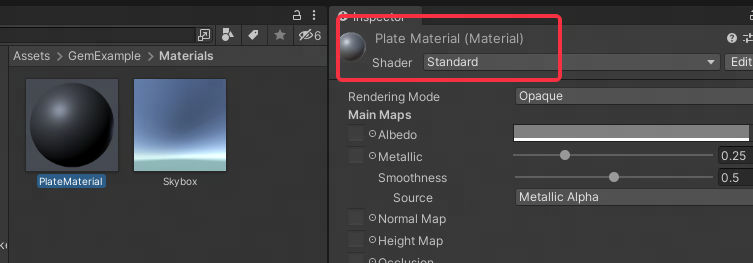
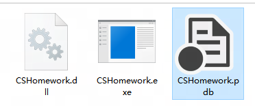
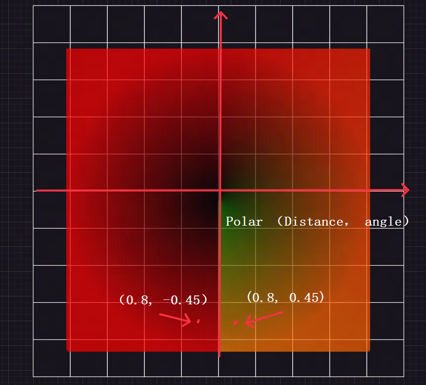
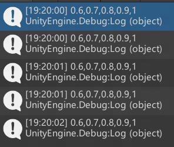

# TA 零散知识

越下面的越新，自 2022 年开始持续积累。


---


## AO-Ambient Occlusion-环境光遮蔽

如果两个物体靠的很近，比如我的手臂和身体的一侧，它们比较靠近的地方其实会偏暗。

渲染中的漫反射（以 PBR 为例），物体的漫反射分为直接光源和间接光源两个部分，**直接光源部分会受到遮挡的影响**，但是 **间接光源部分不会**，因为其值会直接由法线半球对 Cube Map 或球谐函数采样获得，所以 **无法计算遮挡**，这会导致本来稍暗的地方会偏亮。

为了模拟正确的效果，会使用 AO。目前的做法可以理解为：先通过 DCC（如 SP）烘培出 AO 贴图，再通过 uv 对 AO 贴图采样，**通过得值乘以漫反射的强度** 来造成影响。

AO 贴图常常是灰度图，**白色代表无遮蔽，黑色代表完全遮蔽**。

关于 AO 在后来的学习中遇到了很多：

查阅：[百人计划笔记 ：SSAO](../百人计划学习笔记/百人计划学习笔记.md#61：SSAO)

GAMES 202 —— SSAO：

> 和之前的 3D 空间下的计算区分开来，之前的叫“图像空间”（Image  Space）。屏幕空间下的处理就基本是后处理了，输入是若干图，输出最终图。      关于 AO、之前在零散知识积累中记过一些，但其实想来根本没有那么复杂。记得在入门精要中提到的标准光照模型中，有一项 Ambient 项，代表环境光，在那里这个项就是一个定值。但是为了模拟环境光遮蔽的效果，其实可以在 Ambient 项上做一个遮罩，使有的地方环境光亮、有的地方则暗，使得其立体感更强。     AO 的原理就是对于每一个渲染点，我计算它在法线半球的可见性的 Cos 加权的平均，最终得到一个 0~1 的值代表环境光强度，把这个保存到贴图上即是 AO 贴图，和一个遮罩很像。     如何基于屏幕空间来做？     1.首先，根据屏幕空间的像素位置和深度（所以需要渲染深度图）可以构建一个三维坐标，作为这个渲染点的位置。     2.以这个渲染点为中心、记录的法线方向（所以还需要渲染法线方向图）为方向构建一个半球，半径自己指定。     3.向半球中随机撒点，通过点的 z 值和记录的深度图的 z 值可以判断这个点对于相机是否可见。简单判断是否可见往往会导致不该出现 AO 的地方也有 AO，因为遮挡物可能离渲染点非常远。所以这里也可以加上一个判断，若二者深度相差太多则不算遮挡。     4.用 Cos a（a 为点到球心的连线与法线的夹角）加权平均洒下的各点的可见性，即可得到大概的环境光的强度值。     5.最终应该渲出一张灰度图，把它叠加到原渲染纹理中去即是最终结果。


---


## 在 Shader 中使用结构体

在学习 NPR 的时候，我参考了大佬写的 Shader。

这个 Shader 在结构体的使用上做得非常美观合理，我认为非常具有参考价值。

如果自己做一些比较大的 Shader 时，也使用这种方法吧。

参考文章：[罪恶装备](https://zhuanlan.zhihu.com/p/493802718)

     


---


## 编辑 Shader 的材质面板


### 使用属性标签（约束、Attribute）来简易地编辑 Shader 的材质面板

[参考](https://docs.unity3d.com/Manual/SL-Properties.html)

列举一些常用的：

```c#
[Header(MyFloat)]// 加一个标题
[space(20)]// 加一点空隙
_MyFloat("MyFloat",Range(0,1)) = 1.0
```

效果：


除了上面这两个能用的，其他的 C#能用的这里都不能用，很垃圾。

基本只有下表中的语法能用：


### 使用 Custom Shader GUI

更 **自由** 的方式，可以做很多 **炫酷** 的材质 UI。

但是比较 **麻烦**，得看值不值得去写这个东西。

==// TODO: 补充一下相关内容==


---


## 关于 GGX

在渲染尤其是 **真实感渲染** 中，我们总会看到一个词叫 **GGX**，它总是和微表面模型等概念一起出现。

> GGX 是一种用于描述光学反射和折射 **分布的函数**，通常用于计算三维计算机图形中的材质反射和折射。GGX 代表 Gaussian or Generalized Gaussian distribution（高斯或广义高斯分布）的缩写，也称为 Trowbridge-Reitz 分布。 GGX 函数旨在模拟实际材质表面的微观结构，以产生更真实的光照效果。

不可追溯全称，其是一种分布函数，可以参与 BRDF 的计算，主要体现在 **渲染粗糙度大的镜面反射** 上，能渲染出更逼真的 j 页面反射部分。

在 202 笔记中也出现了 GGX，本质上 GGX 就是一个 **类似高斯分布的函数**，但它不是一成不变，它会随着粗糙度变化，**它记录的是相对与面法线，微表面的分布如何（微表面与面法线的对齐程度）**。

比如 PBR 中，计算 D 项（法线分布函数）需要使用微表面模型，自然也使用了 GGX 来计算微表面分布，不仅如此，在 G 项（自我遮蔽项）中也参考了 GGX 的值。     **总结：GGX 是一个实时级的分布函数，常用来在微表面模型中计算微表面与视线的对齐程度。在微表面模型的 D 项、G 项中，用来计算观察方向有多少能量反射。因为其作用于 DG 项，所以其本质仅对镜面反射部分产生影响。**


---


## 阴影渲染

列举一些阴影渲染方法：

| 名称                                                    | 说明                                                         | 优点             | 缺点                             |
| ------------------------------------------------------- | ------------------------------------------------------------ | ---------------- | -------------------------------- |
| Shadow  Mapping                                         | 灯光处渲深度，相机渲深度，在正式 **渲染渲染点时，比较两个缓冲区中的深度**，判断渲染点是否在阴影下。<br />这只是一种基本的思路，目前没有任何成熟的引擎直接使用这种阴影映射方式。 | 快               | 锯齿重                           |
| SSSM（Screen Space Shadow  Mapping）                    | 对 Shadow Mapping 做了一些改进，它先渲染灯光处深度，然后在屏幕空间再渲一次深度，**对比两个深度得出一张阴影图**（灰度图，说明该像素的阴影的强度。）<br />在 **渲染渲染点时，从阴影图中用屏幕空间坐标采样得到阴影系数**，然后拿去影响颜色就行了。<br />相比传统 Shadow Mapping，就是多了一步生成阴影图。 | 快               | 可能有伪影                       |
| PCSS(Percentage Closer Soft Shadows/百分比接近的软阴影) | [详见 GAMES202：PCSS](../GAMES202学习笔记/GAMES202学习笔记.md)<br />以滤波核的形式去在比较两个缓冲区中的深度，看有 **多少比例被遮挡**，多少比例未被遮挡。通过比 **例决定阴影的硬度**。 | 真实，近实远虚   | 比较慢                           |
| VSSM（Variance Soft Shadow Mapping/方差软阴影）         | [详见 GAMES202：VSSM](../GAMES202学习笔记/GAMES202学习笔记.md)。<br />其本质是 **PCSS 的改进**，**基于一些数学算法来对阴影进行估计**，从而减少计算量来加速阴影的计算。 | 较真实且较快     | 容易在高频变化区域出现错误的阴影 |
| MSM（moment shadow mapping/矩阴影映射）                 | [详见 GAMES202：MSM](../GAMES202学习笔记/GAMES202学习笔记.md)<br />本质是对 **VSSM 的改进**，对 VSSM 中的 **“估算”部分增加了计算**，计算复杂，需要较高的数学知识。 | 比 VSSM 真实       | 比 VSSM 慢                         |
| DFSS（Distance Field Soft Shadows/距离场软阴影）        | [详见 GAMES202：DFSS](../GAMES202学习笔记/GAMES202学习笔记.md)<br />也可以理解为 **PCSS 的改进**。DFSS 从渲染点到光源进行连线，然后寻找这个线上距离场记录的值的最小值，**最小的这个角度的 arcSin(theta)就可以作为 PCSS 中需要的“采样范围内，多少比例的像素被遮挡”的值**。 | 快，且效果很好。 | 保存 SDF 是很占用空间的。          |

得益于时间域的方法和硬件的加速，PCSS 是目前的主流实时渲染阴影的方法。


### Unity 中的级联阴影渲染

上面说的那些是偏向抽象的方法，我们来看下 Unity URP 中的阴影是如何做的。

Unity URP 中的阴影方案称作“SSSM（Screen Space Shadow Mapping，屏幕空间阴影映射）”，相比上面提到的 SSSM，多了细节和效果上的优化以及具体的数据组织和底层实现。


#### 光源

有光源才能投出阴影，光源上也有一些阴影相关的设置。

.png)

以主平行光为例，当我们调整主光源的阴影配置时，可以通过 FrameDebuger 观察到传入 GPU 的_MainLightShadowParams 发生了变化。

.png)


可以从 URPLitShader 中观察到_MainLightShadowParams 控制了这些表现：

```glsl
float4      _MainLightShadowParams;   // (x: shadowStrength, y: >= 1.0 if soft shadows, 0.0 otherwise, z: main light fade scale, w: main light fade bias)
```


#### 级联阴影

在 Unity 的渲染管线资产中，我们可以配置主光源的级联阴影参数。


级联阴影是以牺牲远处阴影质量为代价、提升近处阴影质量的一种技术。


我们可以配置级联参数，级联数量为 4 意味着 ShadowMap 将被等分为 4 个象限，彩色的条带代表了最大距离内四个象限内如何分配阴影图的空间。

如紫色 0 块上的信息，意味着距离相机 0~6.2 米的渲染点将会使用第 0 象限的阴影图，第 0 象限储存了 6.2 米内的场景的深度信息，绿色 1 块则意味着相机 6.2~14.6 米的渲染点将使用第 1 象限的阴影图，第一象限储存了 8.5 米的有效信息。

下图为 4 级联的示意阴影图。


级联阴影的做法有点类似于图像的伽马编码，将更多的精度用于存储人眼比较敏感的暗部信息。


#### Shadow Map 的生成

物体被渲染时，会比较灯光坐标系下的渲染点深度和 ShadowMap 中记录的最小深度，如果渲染点的深度大于最小深度，说明渲染点处于阴影中；如果使用了 PCSS 等滤波软阴影方案，则会多次采样 ShadowMap，得到一个 0~1 的值用于描述渲染点被阴影遮蔽的程度。最终，用 Shadow 的值去影响输出颜色，也就让一个物体接受了投影。


那么这张 ShadowMap 是如何生成的呢？

以主平行光为例，我们可以从 FrameDebuger 中看到在渲染管线流程的靠前部分，渲染了主光源的 Shadow Map。这里暂时没有考虑级联阴影。

.png)


为什么这张 Shadow Map 长这样？它是怎么被渲染出来的？

与正常渲染一个物体的流程类似地，Shadow Map 也是通过流水线进行渲染的。首先我们会创建一个特定的相机，然后调用场景里所有投影物体的 Shader 的 ShadowCaster 这个 Pass，Pass 本身不输出颜色。待所有的物体的 ShadowCaster 执行完毕后，将当前的深度缓冲输出到作为 RenderTarget 的 ShadowMap 即可。

如果有多个光源，每个光源都会以上述的流程渲染自己的 ShadowMap。


上面所谓的特定的相机是如何确定的呢？

让我们在灯光 GameObject 下添加一个相机，尝试复刻出 ShadowMap 来。

首先，我们来确定相机的 Transform。相机的朝向就是光源的朝向，相机的位置则是主相机前方最大阴影距离处，这个最大阴影距离通过渲染管线资产进行配置。


然后我们来配置相机上的参数，根据平行光的特性，我们需要将相机的投影类型改为正交投影；然后我们将相机的视野大小也改为最大阴影距离，同时为了避免场景被远近裁剪平面裁剪，我们给一个合适的裁剪平面距离。

设置完成后，我们就能从这个新的相机中看到与主相机 ShadowMap 一模一样的轮廓，主平行光渲染 ShadowMap 的相机就是使用类似这样的方法确定的。

.png)


##### 级联 ShadowMap

级联 ShadowMap 相对于上面的单张 ShadowMap 的渲染流程稍有差异。

首先 DrawCall 的次数将会变成级联数，每个级联的 ShadowMap 会渲染到最终输出 ShadowMap 对应的象限中。

其次每个级联相机的位置和视野大小也是不同的，需要根据级联的分割参数做出对应的调整。


#### 阴影的渲染

得到 ShadowMap 后，在渲染物体时就可以比较渲染点在灯光坐标系下的深度和 ShadowMap 中记录的深度，以此来判断渲染点是否在阴影的遮蔽中。

Unity 中软阴影的实现是对 ShadowMap 以一个固定大小的滤波核进行滤波，得数就是被阴影遮蔽的程度。

如下代码是高质量设置下软阴影的代码，共采样 ShadowMap16 次。

```glsl
real SampleShadowmapFilteredHighQuality(TEXTURE2D_SHADOW_PARAM(ShadowMap, sampler_ShadowMap), float4 shadowCoord, ShadowSamplingData samplingData)
{
    real fetchesWeights[16];
    real2 fetchesUV[16];
    SampleShadow_ComputeSamples_Tent_7x7(samplingData.shadowmapSize, shadowCoord.xy, fetchesWeights, fetchesUV);

    return fetchesWeights[0] * SAMPLE_TEXTURE2D_SHADOW(ShadowMap, sampler_ShadowMap, float3(fetchesUV[0].xy, shadowCoord.z))
                + fetchesWeights[1] * SAMPLE_TEXTURE2D_SHADOW(ShadowMap, sampler_ShadowMap, float3(fetchesUV[1].xy, shadowCoord.z))
                + fetchesWeights[2] * SAMPLE_TEXTURE2D_SHADOW(ShadowMap, sampler_ShadowMap, float3(fetchesUV[2].xy, shadowCoord.z))
                + fetchesWeights[3] * SAMPLE_TEXTURE2D_SHADOW(ShadowMap, sampler_ShadowMap, float3(fetchesUV[3].xy, shadowCoord.z))
                + fetchesWeights[4] * SAMPLE_TEXTURE2D_SHADOW(ShadowMap, sampler_ShadowMap, float3(fetchesUV[4].xy, shadowCoord.z))
                + fetchesWeights[5] * SAMPLE_TEXTURE2D_SHADOW(ShadowMap, sampler_ShadowMap, float3(fetchesUV[5].xy, shadowCoord.z))
                + fetchesWeights[6] * SAMPLE_TEXTURE2D_SHADOW(ShadowMap, sampler_ShadowMap, float3(fetchesUV[6].xy, shadowCoord.z))
                + fetchesWeights[7] * SAMPLE_TEXTURE2D_SHADOW(ShadowMap, sampler_ShadowMap, float3(fetchesUV[7].xy, shadowCoord.z))
                + fetchesWeights[8] * SAMPLE_TEXTURE2D_SHADOW(ShadowMap, sampler_ShadowMap, float3(fetchesUV[8].xy, shadowCoord.z))
                + fetchesWeights[9] * SAMPLE_TEXTURE2D_SHADOW(ShadowMap, sampler_ShadowMap, float3(fetchesUV[9].xy, shadowCoord.z))
                + fetchesWeights[10] * SAMPLE_TEXTURE2D_SHADOW(ShadowMap, sampler_ShadowMap, float3(fetchesUV[10].xy, shadowCoord.z))
                + fetchesWeights[11] * SAMPLE_TEXTURE2D_SHADOW(ShadowMap, sampler_ShadowMap, float3(fetchesUV[11].xy, shadowCoord.z))
                + fetchesWeights[12] * SAMPLE_TEXTURE2D_SHADOW(ShadowMap, sampler_ShadowMap, float3(fetchesUV[12].xy, shadowCoord.z))
                + fetchesWeights[13] * SAMPLE_TEXTURE2D_SHADOW(ShadowMap, sampler_ShadowMap, float3(fetchesUV[13].xy, shadowCoord.z))
                + fetchesWeights[14] * SAMPLE_TEXTURE2D_SHADOW(ShadowMap, sampler_ShadowMap, float3(fetchesUV[14].xy, shadowCoord.z))
                + fetchesWeights[15] * SAMPLE_TEXTURE2D_SHADOW(ShadowMap, sampler_ShadowMap, float3(fetchesUV[15].xy, shadowCoord.z));
}
```

与 PCSS 不同的是，Unity 的 SSSM 没有根据渲染点离遮蔽物的距离去动态调整滤波核的 Step 步长，因此 SSSM 无法做到 PCSS 那样真实的近实远虚的软阴影，只能让阴影的边缘不那么锐利。

.png)  


拿到遮蔽程度后，Unity URP LIt Shader 将其乘到光源的衰减系数里面，影响最终输出的颜色：

```glsl
half3 LightingPhysicallyBased(BRDFData brdfData, BRDFData brdfDataClearCoat, Light light, half3 normalWS, half3 viewDirectionWS, half clearCoatMask, bool specularHighlightsOff)
{
    return LightingPhysicallyBased(brdfData, brdfDataClearCoat, light.color, light.direction, light.distanceAttenuation * light.shadowAttenuation, normalWS, viewDirectionWS, clearCoatMask, specularHighlightsOff);
}

half3 LightingPhysicallyBased(BRDFData brdfData, BRDFData brdfDataClearCoat,
    half3 lightColor, half3 lightDirectionWS, float lightAttenuation,
    half3 normalWS, half3 viewDirectionWS,
    half clearCoatMask, bool specularHighlightsOff)
{
    half NdotL = saturate(dot(normalWS, lightDirectionWS));
    half3 radiance = lightColor * (lightAttenuation * NdotL);
  	// ...
    return brdf * radiance;
}
```


如此这般，物体上就渲染出了阴影。


---


## 关于金属度、粗糙度工作流和镜面反射光泽度工作流

太杂了，在好多地方记了。

这里做一下汇总和修复，同时引用的部分也会被修复。

旧版：

> 目前主流的 PBR 工作流有 **金属粗糙度和镜面反射光泽度两种**，对于 AO、法线、自发光等常规贴图，它们的处理完全一致，这里不考虑。
> 金属粗糙度：baseColor 贴图（RGB，其中包含了物质的基本颜色和金属的反射率值，反射率即是 F0）、金属度贴图（灰度，指定金属度）、粗糙度贴图（灰度，指定粗糙度）
> 优劣：
> 非金属的 F0 固定为 0.04，无法调整；
> 主流的工作流，用途广泛；
>
> 镜面反射光泽度：diffuse（RGB，Diffuse 贴图严格影响着材质的基本颜色而对材质的其他特征（如反射率）没有影响。）、镜面反射贴图（RGB，记录金属和非金属的 F0）、光泽度贴图（灰度，指定光泽度）
> 优劣：
> 可以对金属、非金属的 F0 自由调整，但是这也非常容易做出违反能量守恒定律的材质；
> 两张 RGB 贴图，对性能的要求会更高；
>
> 思考：
> 1.手连 PBR 是金属粗糙度工作流的，金属度参数用来决定镜面反射受到多少 baseColor 的影响。
> 2.对于镜面反射光泽度工作流，我猜测镜面反射贴图三维，分别记录两个 F0、和类似金属度的值，用来在两个 F0 中插值。


非常详细，建议看这个

[百人计划笔记：63：metalrough 与 specgloss 流程](../百人计划学习笔记/百人计划学习笔记.md##63：metalrough与specgloss流程)


偏结论向

[关于 PBR：](../关于PBR/关于PBR.md)

> **看本质、看代码**
>
> 分析一下代码，“金属度”这个量，作为阿尔法在 F0（可以理解为很暗的灰色）和物体本身颜色间插值，得到的值经过计算后作为直接光照的镜面反射部分。也就是说，非金属的镜面反射颜色不太受自身颜色影响，而金属的镜面反射颜色受自身颜色影响大。观察手连 PBR，得到相同的结论。
>
> **粗糙度控制着什么？**
>
> 1.直接光照的镜面反射部分的 D 项，越粗糙，D 项一般越小，代表渲染点的微表面们，和反射方向不太对齐。
>
> 2.直接光照的镜面反射的 G 项，越粗糙，自遮蔽现象越重，G 项越小。
>
> 3.间接光照镜面反射第一部分入射光的计算。间接光照镜面反射的光源通过观察方向做反射，再对 CubeMap 采样确定，但是由于粗糙度不同，其实也需要对不同清晰度的 CubeMap 采样，这样的效果更真实，此处粗糙度作为参考值，决定采用哪一个层级的 CubeMap。越粗糙，使用越模糊的 CubeMap。
>
> 4.间接光照镜面反射第二部分，作为参数之一，和 NV 一起、参与数值拟合，避免计算积分，越粗糙，一般来说镜面反射越弱。
>
> **金属度控制着什么？**
>
> 1.直接光照镜面反射部分的 F 项。金属度作为参考值，对 F0（0.04，可视为一个接近黑色的颜色）和物体本身颜色插值，得到的颜色经过计算后作为直接光照镜面反射部分使用。也就是说，非金属的镜面反射颜色不太受自身颜色影响，而金属的镜面反射颜色受自身颜色影响大。观察手连 PBR，得到相同的结论。
>
> 2.直接光照漫反射的 KD。KD 本是 1-KS（KS 也就是 F 项）得到，但是 KD 又做了一步乘（1 -  Metallic），意味着，非金属漫反射强，能量几乎没有吸收，金属漫反射弱，有能量的吸收。
>
> 3.间接光照的镜面反射的 F 项，金属度控制 F0（指通过金属度在 0.04 和 baseColor 插值后得到的颜色），而 F0 参与 F 项的计算，产生的影响和 1.中一致。


---


## 为什么法线贴图总呈现蓝紫色

法线扰动向量是 xyz 三维值,  我们得找个东西来储存它, 用什么来存呢?

正好, 图片也是 rgb3 个值, 就用它吧。不过, 法线扰动向量 **xyz 这 3 个值的取值范围都是(-1, 1), 而 rgb 的取值范围是(0, 1), 需要换算一下。**

从 x 映射到 r, 就这样算: **r = (x + 1) / 2**。因为 **大多数法线** 直指屏幕外、也就是笔直冲上，不扰动，所以: **x = 0, y = 0, z = 1**     对应 rgb 为: **r = 0.5, g = 0.5, b = 1**     所以法线贴图大多是蓝紫色。

相关扩展：[百人计划笔记：法线贴图为什么记录的是切线空间下的扰动？](../百人计划学习笔记/百人计划学习笔记.md)


---


## 对于深度测试的误解

[百人计划笔记：深度测试](../百人计划学习笔记/百人计划学习笔记.md)——这里有关于深度测试更详细的内容。

之前我一直认为深度测试和深度写入之间有关系，得过了深度测试（怎么算过自己指定）才能指定是否写入深度，但其实不是这样。

其实 **深度测试和深度写入是几乎独立的两个东西**。

用户可以指定是否开启深度测试、是否开启深度写入，这两个完全独立。唯一的一点点联系就是，如果片元的深度测试没有通过，这个片元会被直接舍弃，不再进行后续的流程。深度写入作为深度测试后面的一个流程，自然会被直接跳过。


---


## 在 Shader 中获取时间

虽然在入门精要里了解过，但是入门精要的笔记做得实在垃圾，没有写具体方法，而连连看获取时间相对简单，所以一直没有掌握。写理发店 Shader 的时候，遇到了这个问题，故回顾入门精要，要记住如下用法：


---


## 在 Shader 中添加 HDR 性质的颜色


---


## 关于 Scriptable Object

~~这不是开发的知识吗？~~

差不多得了，这都不懂还能当 TA？😅

### 是什么

是一种资产的类型，类似于配置文件，但是它不仅可以用来保存数据，也可以用来实现函数。它的函数可以在自己写的、针对于它的、Editor 的派生类来调用和控制。

### 干什么使的

**用来保存类似“Static”的共用的、不变的数据。** 保存于此类资产的数据，不会随着游戏的关闭、重开而改变。比如可以作为配置文件保存敌人的各项数值，在敌人初始化的时候，使用这个资产里的数据，随后把这个控制资源给策划，让策划去调数值。这样不仅可以集中控制，而且可以节省内存，因为实例化后的各物体共用这一块资产内的数据。

**用于资产实现型工具制作。** 这一条其实是我在研究插件“Pro Pixelizer”时顺便学习的，作者在插件的子工具中，使用了这种“资产实现型工具”。这种工具的使用流程是：创建工具资产 → 操作资产 →  实现工具功能。而一般的工具是：打开工具面板 → 操作工具面板 → 实现工具功能。“资产实现型工具”创建资产时，创建的就是 Scriptable Object 的派生类的对象，而作为工具，仅有保存数据的功能时不够的，需要在 Scriptable Object 的派生类中实现方法。那如何调用这里面的方法？这需要 Editor 的派生类的支持，开发者需要自己写一个专用于这种资产的 Editor 的派生类，然后通过 Editor 的派生类定义 GUI、绑定方法，如此即可。


---


## 关于“资产实现型工具”

这其实是我自定的名字，我也不知道别人叫这种工具叫什么。

根据 GPT 的总结，这种工具似乎可以称作：

> 在 Unity 中，基于 ScriptableObject 类来制作工具的方法被称为“可重用性系统”（Reusable System），也被称为“数据驱动系统”（Data-Driven System）。
>


这种工具的使用流程是：创建工具资产 → 在检查器中操作资产 →  实现工具功能。而一般的工具是：打开工具面板 → 操作工具面板 → 实现工具功能。上面稍微提了一下“资产实现型工具”，我现在要说一些细则。

1. 一般 Scriptable Object 不实现什么方法，但是 **“资产实现型工具”的 Scriptable Object 需要实现大量的方法**。虽然也可以在 Scriptable Object 里实现工具方法，但那会导致代码有点肿，和普通工具一样了，GUI 代码和功能实现代码放在一块。

2. Custom Editor 需要申明，这个编辑器针对于哪一种资产。如下代码块：

   ```c#
   //在Editor类申明前，申明它针对于哪一种Scriptable Object，这里SteppedAnimation是一种Scriptable Object
   [CustomEditor(typeof(SteppedAnimation))]
   public class SteppedAnimationEditor : Editor
   ```

3. GUI 的虚函数不再覆盖”OnGUI“，而是 **覆盖”OnInspectorGUI“**。这控制检查器的 GUI 刷新。

4. 如果不给 Scriptable Object 写 Editor，那么它的 public 参数会自动序列化，显示在检查器中。但是如果你写了 Editor，这将不再是自动的，需要开发者自己写 Scriptable Object 的参数的显示逻辑，如下：

   ```c#
   //以下两个参数都是原Scriptable Object的public参数，但因为这里使用了Editor，如果不写这个，这两个参数将不再显示。
   EditorGUILayout.PropertyField(serializedObject.FindProperty("SourceClips"));
   EditorGUILayout.PropertyField(serializedObject.FindProperty("KeyframeMode"));
   ```

这种类型的工具相比于具有独立面板的工具，可以把功能实现代码和 GUI 代码分开，其他积极意义，目前没想明白。

如果将来想要开发“资产实现型工具”，这里写的东西很可能不够用，我把我学习的工具源码保存于此处：[资产实现型工具](../供日后参考/资产实现型工具)（Ctrl + 左键单击访问）


**轻量级的工具也非常适合** 使用 Scriptable Object 进行开发。

实习中开发了一个简易的 Unity 中的烘培工具，使用资产实现型的思路进行开发，**所有代码都在一个 Scriptable Object 的派生类中**，**不用额外去写 GUI 代码**，直接使用序列化默认的 UI，很省事。

Odin 中有非常多适合 ScriptableObject 进行工具开发的属性标签，如：

Button、OnValueChanged 等等。


---

## 关于自定义材质 GUI

虽然默认材质可以自动生成材质 GUI，也可以通过 Attribute 设置一些简单的 GUI，但是要更好地客制化，还是需要脚本的支持，Unity 也提供了相应的基类供使用。

以下为使用方法和细则：


### 在 Shader 末尾、同 FallBack 一起、绑定 GUI 脚本

```c#
//	通过字符串指定GUI脚本名称来绑定GUI脚本，插件里作者把GUI脚本和Shader放在同文件夹下，因此没有路径信息。如果在不同的文件夹，
//	是否需要路径信息？这一点我真不知道。
CustomEditor "PixelizedWithOutlineShaderGUI"
FallBack "ProPixelizer/Hidden/MyPixelBase"
```


### 细则

1. 继承自 ShaderGUI

   ```c#
   public class PixelizedWithOutlineShaderGUI : ShaderGUI
   ```

2. 重写 OnGUI 函数，和工具面板的 OnGUI 逻辑几乎一样

   ```c#
   //这两个参数是不能少的，第一个是这个材质的面板对象，用于添加GUI组件等，第二个是Shader的参数数组
   public override void OnGUI(MaterialEditor materialEditor, MaterialProperty[] properties)
   ```

3. 例行性工作，不知道这是不是自动生成的，但是不能少

   ```c#
   //更新面板，普通的工具也需要更新，作为GUI当然是需要频繁刷新的
   materialEditor.serializedObject.Update();
   //获取材质。虽然GUI脚本被绑在Shader上，但其实是没法对Shader操作什么的
   //GUI脚本肯定是基于某个使用了这个Shader的材质更改的
   Material = materialEditor.target as Material;
   ```

4. 陈列属性

   ```c#
   //作为GUI，基本的功能当然是显示并控制Shader的变量。一次变量的绑定过程如下
   var albedo = FindProperty("_Albedo", properties);
   editor.TextureProperty(albedo, "Albedo", true);
   ```


### 日后参考

这个 ShaderGUI 脚本是少有的，我把它保存下来供日后参考。其中含有完整的流程，也有一些如折叠参数菜单、开关等参数的设定方法，非常有参考价值。

[ShaderGUI](..\供日后参考\ShaderGUI)（Ctrl + 左键单击访问）


---


## 关于软硬边和平滑组

这两个 **本质上是相同的概念**，只是所处的 **DCC 不同，叫法不同**，**在 Maya 中，叫做软硬边，在 Max 中，叫做平滑组**，在 Houdini 中，这一块直接被 Normal 节点控制着。

~~在之前“法线平滑工具”的开发中，我了解到，一个点并非只是一个点，一个点连了多少条线（或者说被多少个平面共用），这个位置上就有几个端点（借用 Houdini 的说法），每个归属于其中一个面。这些端可以拥有不同朝向的法线。~~

上面的说法可能有点混淆视听，其实就是 DCC 中的点和 Vertex 是不一样的，DCC 中导出的模型（如 FBX 文件）在渲染时会被转成 Mesh，而 Mesh 是只有三角面的。每个三角面都有三个 Vertex，不和其他三角面共用，就这么简单。


### 关于软硬边

以一个 Cube 为例，它的一个点上，其实有 3 个端点（Vertex）（这里我们沿用 Houdni 的叫法）。我们看一条棱，这个棱有两个点、6 个端点，每个端点有一个法线，而参与这条棱的两个面的端点，有 4 个。**当这四个端点的法线朝向一致时（就像我用工具做完法线平滑一样），我们认为这是一条软边，当不一致时则认为这是一条硬边。** 在着色时，着色点的法线方向是靠重心坐标插值出来的，这意味着，**如果有软边的参与，则两个相邻面的渲染、他们的交界处必然是平滑的，因为他们相交的边的端点的法线朝向相同。**

### 关于平滑组

本质上在做和软硬边相同的事情。平滑组是类似于给面一个属性，**如果两个相邻面的平滑组属性的值相同，则它们相交的边的四个端点会使用平滑后的法线**（以四边形为例）。


---


## Unity 的深度法线纹理

**前向渲染中若要用 G-Buffer 需要在相机勾选生成深度法线纹理**，这个深度法线纹理的深度是编码过的、非线性的、0~1 的深度值。法线是观察空间的法线方向，也就是模型空间顶点位置乘以 M 矩阵和 V 矩阵后的那个坐标的空间，可以理解为，以相机为原点，相机顶为 y 正，相机朝向为 z 负方向的坐标系。


---


## URP 渲染管线中，多 PassShader 的 Pass 执行顺序与执行可能问题

**URP 渲染管线中，默认不再支持多 Pass 渲染，但是通过一些特殊的 Tag 可以做到多 Pass 渲染。**

以“先通过一个 Pass 渲染模板值到缓冲区、再通过另一个 pass 渲染扩张后的模型到颜色缓冲区”的描边效果为例：

通过给模板值 Pass 以 **"LightMode" = "SRPDefaultUnlit"，可以使其先执行。**

通过给颜色 Pass 以 **"LightMode" = "UniversalForward"，可以使其后执行。**

这样可以做到简易的多 Pass。与 Tag 高度相关。

相关理论可以参考一下这篇文章：[知乎](https://zhuanlan.zhihu.com/p/469589277)。

相关落地用法，也可以看下这个：[CSDN](https://blog.csdn.net/zakerhero/article/details/106264067)。

这种方法 **仅适用于两个 Pass，再多就只能用 Renderer Feature 的方法了。**


---


## 关于 Layer 和 Render Layer


### 是什么

**Layer 是物体（GameObject）的一个属性，本质是 int 型的一个参数。**


它依附于每一个 Game Object。

**Render Layer 是仅 SRP 才拥有的、一个 FilterSetting 的属性，本质也是一个 int 型的参数 。**


上句是调用一次 Draw Call 的函数，参数 m_FilteringSettings 中，包含了 Render Layer。


### 有什么用？

我起初接触的用法比较少，希望后续碰到能回来补充。

**Layer：**

1. 和 Tag 的定位类似，不过 Layer 似乎更 **常用于在渲染、物理中，用于分辨一类物体。**
2. **搭配 Layer Mask 使用。** 在 SRP 中，如果我自定义了一个 Renderer Feature，我想它只对视口中的 Layer 值为 1 的物体起作用，那么我们需要在 ScriptableRenderPass 基类的重写的 Execute 函数（修改 comand buffer）中，在需要传参数类型为 FilteringSettings 的地方，把这个参数对象的成员变量 LayerMask 改为 1 即可。

**RenderLayer：**

我们可以 **粗略的把 Render Layer 理解为一个 Pass 的属性**。默认情况下，**通过 Layer 筛选过一遍要渲染的对象后，还要通过一遍物体对 Pass 的筛选。**


每一个 **Renderer 组件都有一个 Render Layer Mask（渲染层遮罩）的属性**，本质是一个 int 型列表。当你想用一个 Pass 去渲染这个物体，Renderer 组件会检查一下，你这个 Pass 的 Render Layer 的值，有没有在我的 Render Layer Mask 的列表中。只有在的情况，这个 Renderer 才会允许这个 Pass 去渲染这个 Mesh。

这个功能非常好用，比如我把所有可能会被描边的物体都放到一个 layer 中，可是对于 Renderer Feature 来说，一个 Layer 只能共同更改。也就是说，大家要么都有描边，要么都没有。这时我可以把目前不想描边的东西的 Render Layer Mask（渲染层遮罩）的属性，删除掉描边 Pass 的 Render Layer，这样这些物体就不会被渲染描边了。Render Layer Mask 的值可以很轻松的动态修改。


### 总结

总之 Layer 和 Render Layer 就是一组 **分别位于渲染物体和 Pass 的辨识开关**，只有两个开关 **都表示 YES 时物体才会被渲染**。


---


## 关于 URP Shader 的 CBUFFER

以前的批处理要求比较严格，Shader 入门精要中：

> 来仔细说下批处理吧
> 分为静态批处理和动态批处理
> 静态批处理：
> 是用户手动指定的，操作方法是在 Inspector 面板把这个物体 **勾成 static**，就会被自动 **和其他同材质的东西打为一批了**。这更自由，但是可能会消耗很多的内存，而且 **静态批处理后的物体无法移动**（指无法修改其 Transform）。
> 动态批处理：
> **打开项目设置中的动态批处理后，就不需要做任何操作**，Unity 会 **自动把同一材质的物体打成一个批，而且这样批处理的物体是可以移动的**。缺点是要求苛刻，**顶点过多、或者光照环境稍微复杂，就无法再使用了**。

**总结一下就是，一般同材质的东西才能合批。**


但是在 **URP 中**，放开了一些。只要物体 **同 Shader，就有可能被合批**；~~并且，得益于 Shader 变体之类的技术，一个 Shader 有了可以非常强大的可能。~~（这句话极具误导性，Shader 变体依托于 Shdaer 关键字来生成，而 Shdaer 关键字的不同必然导致合批被打断）

 验证：

为了使同一 Shader 的物体被合批，需要一些处理。本条目说的就是其中一个。

在 Shader 的属性声明处，使其被包裹在 CBUFFER 字段中，即可使同 Shader、不同材质的物体被合批。

```glsl
 CBUFFER_START(UnityPerMaterial)
 half4 _Color;
 half _Width;
CBUFFER_END
```


**但是要注意，多 PassShader 不可以喔。**


### 关于 CBUFFER

**CBUFFER、即 Constant Buffer，常量缓冲区。**

常量缓冲区是一段 **预先分配的显存（高速）**，用于 **存储 Shader 中的常量数据，如矩阵、向量等**。

```c#
// 常量缓冲区的定义，GPU现在里面某一块区域，这一块区域可以非常快速的和GPU传输数据
// 因为要占GPU显存，所以其容量不是很大。
// CBUFFER_START = 常量缓冲区的开始，CBUFFER_END = 常量缓冲区的结束。
// UnityPerMaterial = 每一个材质球都用这一个Cbuffer，凡是在Properties里面定义的数据(Texture除外)
// 都需要在常量缓冲区进行声明，并且都用这一个Cbuffer，通过这些操作可以享受到SRP的合批功能
CBUFFER_START(UnityPerMaterial)
// 常量缓冲区所填充的内容
half4 _Color;
CBUFFER_END
```

[参考](https://zhuanlan.zhihu.com/p/227631383)


**通常情况下，Unity 的渲染流程会先从材质面板中收集 Shader 中所需的数据，然后将这些数据打包成 DrawCall，并传递给 GPU 进行渲染。** 在这个过程中，Shader 中的属性需要从 CPU 上传到 GPU，以便 GPU 在渲染时使用这些属性的值。这个过程通常称为“数据绑定”（Data Binding）。

具体来说，**当 Unity 执行 DrawCall 时，它会将所有需要绑定的数据打包成一个成为“渲染状态”（Render State）的对象**，然后将这个对象传递给 GPU。渲染状态中包含了 Shader 所需的所有数据，包括属性、常量、纹理等等。GPU 在渲染时会根据这些数据来执行 Shader，从而得到最终的渲染结果。


**合批被打断的本质原因通常是由于 DrawCall 之间的渲染状态（Render State）不完全相同。** 为了实现合批，多个 DrawCall 的渲染状态必须完全相同，这包括 Shader、纹理、渲染目标、深度测试等等。如果多个 DrawCall 的渲染状态不完全相同，就无法进行合批，因为它们需要使用不同的渲染状态来执行渲染。这就意味着，它们必须单独进行渲染，即每个 DrawCall 都需要进行一次 CPU-to-GPU 的数据传输和 GPU 的渲染操作，从而降低了渲染性能。因此，为了实现合批，需要尽可能减少 DrawCall 之间的渲染状态差异，例如，可以将使用相同 Shader 和纹理的物体放到同一个 DrawCall 中，或者将相邻的物体合并成一个网格。这样可以最大程度地减少渲染状态的差异，从而提高合批的效果。


**Render State（渲染状态）是一组描述渲染过程中如何使用 GPU 硬件的参数**，包括深度测试、剔除状态、渲染目标、着色器、Uniform 等等。**它描述了如何使用渲染管线中的硬件来处理场景中的几何体和纹理等数据，并最终生成屏幕上的像素。**

**而 Mesh 数据包含了网格几何体的顶点坐标、法线、纹理坐标等信息，但并不包含渲染状态。** 在 Unity 中，Mesh 数据通常通过 MeshFilter 组件来管理和维护，而 **渲染状态则通常由 Renderer 组件和 Material 来管理和维护。**

**在渲染过程中，渲染管线会将 Mesh 数据和渲染状态结合起来，生成一组渲染命令（Render Command），并将其发送给 GPU 进行渲染。** 渲染命令中包含了需要渲染的 Mesh 数据和对应的渲染状态，GPU 根据这些信息来执行相应的渲染操作，并最终生成屏幕上的像素。


Render Command（渲染命令）和 Draw Call（绘制调用）是 Unity 中两个重要的概念，它们之间有一定的关系。

在 Unity 中，**Render Command 是一个描述渲染操作的结构体，它包含了需要渲染的 Mesh 数据、渲染状态、材质等信息，还包括一些其他的辅助信息，例如需要渲染的子网格、渲染层级等等。** Render Command 是 Unity 中渲染管线的核心，它描述了 GPU 如何执行绘制操作。

**而 Draw Call 则是执行 Render Command 的具体指令，它告诉 GPU 如何使用 Render Command 中的数据来执行绘制操作。通常情况下，一个 Draw Call 对应一个 Render Command，但也有可能一个 Draw Call 对应多个 Render Command，或者多个 Draw Call 共用一个 Render Command。**

一个 Draw Call 对应多个 Render Command 的情况通常发生在以下情况：

1. 合批
2. 在使用 instancing 技术时，可以通过一个 Draw Call 来渲染多个实例，每个实例使用不同的变换矩阵和顶点数据，但使用相同的材质和渲染状态。
3. 在使用 geometry shader 时，可以在一个 Draw Call 中对一个顶点缓冲区中的所有顶点进行处理，生成多个新的几何图元，每个图元可以使用不同的材质和渲染状态进行渲染，从而生成多个 Render Command。

多个 Draw Call 共用一个 Render Command 的情况通常发生在以下情况：

1. 在使用多重采样（MSAA）时，需要进行多次绘制操作来生成多个样本，但这些操作可以使用相同的渲染状态和着色器，因此可以共用一个 Render Command。
2. 在使用几何剪裁（culling）时，可以将要剪裁的几何体分成多个批次进行绘制，但这些批次可以使用相同的渲染状态和着色器，因此可以共用一个 Render Command。
3. 在使用条件渲染（conditional rendering）时，需要进行多个 Draw Call 来确定是否需要渲染某些物体，但这些 Draw Call 可以使用相同的渲染状态和着色器，并且只有一个 Render Command 被执行来渲染这些物体。


在 Unity 中，每个 Draw Call 都会产生一定的 CPU 和 GPU 开销，因此减少 Draw Call 的数量是提高渲染性能的关键。合批（Batching）就是一种将多个 Draw Call 合并成一个的技术，从而减少 CPU 和 GPU 的开销。在合批的过程中，多个 Render Command 被打包成一个大的 Render Command，并通过一个 Draw Call 来执行。这样可以减少 Draw Call 的数量，从而提高渲染性能。


**将 Shader 中的属性放入 Constant Buffer (CBUFFER) 中，可以优化渲染性能。**（这里的论述均以 CBUFFER_START(**UnityPerMaterial**)的情况为例）

通常，**Shader 中的属性需要从 CPU 上传到 GPU，这个过程需要消耗一定的时间和带宽**（如上面讲述的一般渲染流程，其全部在 CPU 完成）。

而将属性放入 CBUFFER 中，可以将其缓存在 GPU 的显存中，**Shader 在执行时可以直接从缓存中读取数据**，避免了从 CPU 上传数据的开销，从而提高了渲染性能。

不仅如此，将 Shader 的属性放入 CBUFFER 中，**可以减少渲染状态的差异性，从而放宽合批的条件**！！

我们通过上面的描述可以知道，合批被打断的一般原因就是 Draw Call 之间的渲染状态有差异。而如果把材质的属性缓存到 CBUFFER 中，那么其实被缓存的数据就 **不再通过渲染状态传入 Draw Call 中，而是在渲染的 GPU 阶段直接从 CBUFFER 中获取**。如此一来，可能造成材质参数有差异的情况就从普通的渲染流程中被抽离出来了，可喜可贺，可喜可贺。

.png)

既然它这么好用，为什么不把所有的参数都放到 CBUFFER 中呢？

当然是因为它也存在一定的局限性 😥

1. **Texture 类型的变量是无法在 CBUFFER 中申明的**，因为它一般是需要 GPU 动态加载的。所以还是好好使用图集技术吧，少男少女们。
2. 如果需要 **更新 CBUFFER 中的数据，需要重新上传整个 CBUFFER**。这意味着，如果 CBUFFER 中的数据需要频繁修改，那么会带来更差的性能；同时，CBUFFER 的大小也影响着重新上传的速度，意味着越大 CBUFFER 需要消耗更长的时间和带宽。
3. **CBUFFER 有大小限制**，如果将太多参数放入其中，可能会超出 CBUFFER 的容量限制，导致渲染失败。
4. 对于一些 **只在 Shader 中使用的参数**，将其放入 CBUFFER 中可能会 **浪费内存和 GPU 带宽**。


在 CBUFFER 的申明中，我们加了一个参数：CBUFFER_START(**UnityPerMaterial**)。意为我们为每一个使用改 Shader 的材质都申请一块 CBUFFER，用于保存他们的 CBUFFER 中的数据。

除了 UnityPerMaterial，我们还可以在 Shader 中申请其他的 CBUFFER，例如：

- UnityPerCamera：包含相机相关的信息，例如视图矩阵、投影矩阵等。
- UnityPerDraw：包含当前绘制命令的状态信息，例如模型矩阵、颜色等。
- UnityGlobalParams：包含全局的渲染参数，例如时间、屏幕尺寸等。
- UnityPerVoxel：用于光线追踪光照的 CBUFFER，包含光线追踪相关的信息。

需要注意的是，这些 CBUFFER 的名称是 Unity 内置的，如果我们要使用其他的 CBUFFER，需要自己定义它们的名称和内容。

（不一定真的有，作者没试过，这是吉皮提老师说的 😅）


---


## 关于软粒子


效果一目了然。

这么做的原理 **并不是关闭了深度测试**，而是在片元着色器中比较渲染点的深度和深度纹理中取得的深度，若已经比深度纹理还深，说明其本来被遮挡，这个片元会被深度测试过过滤掉；如果不如深度纹理深，再根据两个深度的差值来对阿尔法值插个值即可做到这种效果，差值小，说明二者贴得比较近，此时显示得透明一点、查值大，说明二者离得远，此时让其不那么透明。

**要注意，挡住的地方还是看不见的！因为深度测试并没有关闭。这个效果只是让挡住和未挡住的地方过度平滑一些。**

这种方法对于 **视深的计算以及坐标系的转换** 的计算非常有参考价值。

[参考代码](https://blog.csdn.net/lsccsl/article/details/117926419)

[ASE 中的连法](https://blog.csdn.net/qq_39574690/article/details/126448580)——注：ASE 的默认粒子 Shader 模板中包含软粒子的算法，但是需要开启 SOFTPARTICLES_ON 的 Shader 关键字。


---


## 关于材质实例

如果有 **一个材质要用于不同的模型**，而我又希望他们的 **参数不要同步** 的时候，就需要材质实例这个东西。也就是通过 **给与不同的模型以不同的材质实例** 来达到目的。

如下的 melee，我希望其中一个头骨在 dissolved 的时候不要影响另一个，就需要材质实例


**使用材质实例时，检查器中的材质面板会显示 Instance：**


### 分清楚 Material 和 ShaderMaterial

二者都是 Renderer 组件的属性之一，二者的类型都是 Material。

前者是该 **物体的材质实例**，后者是 **使用该 Shader 的材质模板**。

默认状态下，如果在代码层面不做任何修改，物体使用 ShaderMaterial 进行渲染，也就是说没有这个 Instance。此时如果直接通过材质面板修改参数、或者修改 ShaderMateria 的属性，就会导致所有使用改材质的物体都被影响。

如果 **通过代码修改 Material 内的属性，则会自动创建一个材质实例，替换原来的材质**，本次修改仅对该物体有效，对其他的同材质物体无效。

如果想在初始化的时候就区别开所有的材质实例，可以在 Start 函数中随意调用一下 Material 属性，只要调用就会自动生成材质实例，如下一些都是可行方式：

- New Material(meshRenderer.material)——可能会导致检查器中出现两个 instance 标志
- var temp_or_member_var = meshRenderer.material
- var temp_or_member_var = meshRenderer.materials [i] （多材质时）
- Function(mershRenderer.material)


### 极具优势、不打断合批

对于同一个材质的不同的材质实例，可能拥有不同的属性，一般而言，不同的材质属性会导致合批被打断。

但是 **如果把不同的属性写入 Shader 的 CBUFFER 中，就不会打断合批、即使它们是不同的材质实例**。

ShaderGraph 中，会默认把颜色、Float 等属性写入 CBUFFER 中：


**验证结果：**

**成功被合批。**


关于 CBUFFER：[跳转](#关于 CBUFFER)


---


### 内存泄漏问题

材质实例虽好，但是必须手动删除，否则一直存在于内存中。

使用 Destroy 函数即可手动释放该材质实例。

可以方便地在 Mono 类的 OnDestory 函数中写该部分内容，如下：

```c#
void OnDestroy()
{
    //Destroy the instance
    foreach (Material material in shaderMaterials){
        Destroy(material);
    }
    print("现存材质实例数量" + Resources.FindObjectsOfTypeAll(typeof(Material)).Length);
}
```


---


## 使粒子系统可以控制自定义 Shader 的材质的颜色

如我自己写了一个材质，但是此时粒子系统组件不能控制材质的颜色，这是因为 **粒子系统是通过改变顶点色来影响最终的渲染颜色**。

因此，只需要在颜色计算时考虑 **顶点色**，即可使粒子系统组件对材质表现出控制权。


---


## 关于资产预处理——Asset Post Processing


### **什么是**

所有类型的资产（如模型、音频、图片）导入时都会过一遍该类型的所有的预处理，如下模型的：


预处理可以帮助 Unity 更好的理解资产，可以给资产做规范化等等。

比如我希望我项目中的所有模型，他们的 Mesh 的中心都是原点，那么就可以写一个资产预处理，在导入时 Unity 会自动通知你写的回调函数，然后执行操作更改资产。注意，这里的 **更改并不会更改源文件，而是让 Unity 对资产有额外的理解，在理解层面更改资产，源文件本身不会被改变。** 详见：[关于 Meta 文件](#关于 ImportSetting、资产和 Meta 文件（元数据）)


### 怎么写

1. 继承 AssetPostprocessor

2. 在相关回调中编写需要处理的代码

   

3. 触发相应的重新导入，即可看到效果。

### 参考

[资产预处理](E:\我的往期办公文件\Unity资源\学习\供日后参考\资产预处理)

[本人写的知乎文章——关于自动中心化锚点](https://zhuanlan.zhihu.com/p/605306790)


---


## 关于插件更新的预想

2023.3.17 读到一篇博客，讲了 Maya 插件更新功能的实现思路。[原文](https://www.cnblogs.com/meteoric_cry/p/15905357.html)

我一想，我迟早要自己编写插件更新的功能，于是按个人的疑惑问了一下 ChatGPT，最后决定记下一些个人的理解。


### 什么是 URL

统一资源定位符（Uniform Resource Locator）。就是一个 **标记文件在在服务器主机中的位置的字符串**。

如：例如，<http://www.example.com/index.html> 就是一个 URL，其中 http 是协议，<www.example.com> 是主机名，index.HTML 是路径。


那么 URL 如何在更新中被使用？

URL 可以指向新版本的插件，有 URL，我们就可以 **通过代码把新版本下载用户的本地电脑中，如下 Python 脚本：**

```Python
import urllib.request

 

url = 'http://example.com/file.txt'

save_path = 'D:\\temp\\file.txt'

 

urllib.request.urlretrieve(url, save_path)

print('文件下载成功！')
```


### 更新的整体思路


<u>在初版插件中就内置检查更新功能。</u>

检查更新时，将从服务器下载一个 XML 或 Jason 配置文件，用来记录版本信息和最新版本的 URL。

如果用户版本不是最新的，则弹出对话框提示用户更新。


<u>下载</u>

用上面的代码下载最新的插件文件到本地。


<u>安装</u>

也可以写在更新程序中（通常更新程序和本体程序区分开来），主要是一些文件的替换和移动。


### 企业中运用

问了导师，说是项目组中会有自己的类似 Git 的项目托管，工具也会依托托管得到更新，不需要这样的传统软件更新方式。

但是了解一下也不是坏事，对吧？


---


## 关于 Python 装饰器

这天查 Python 的时候发现函数声明上一行有@……的用法，问 GPT 发现是函数装饰器。想起来 C#也有类似的用法，比如@override，就想问这俩是不是基本一致，但发现其实根本不是一个东西。】

**Python 中的@……叫装饰器，用于标志这个函数不是这么运行的，它被改了，在其他的地方。**

一段看懂：

```python
def my_decorator(func):
    def wrapper():
        print("Before the function is called.")
        func()
        print("After the function is called.")
    return wrapper

@my_decorator
def say_hello():
    print("Hello!")

# 调用被装饰的函数
say_hello()

#Output：
Before the function is called.
Hello!
After the function is called.
```


---


## 矩阵、空间和变换

==// TODO: 这篇还没写完==

几何中可以用一个 4x4 矩阵来表示某空间中的变换，一个变换具有位移 Translate、旋转 Rotation 和缩放 Scale 这三个基本信息。

空间可以理解为参照物，如世界空间中的某个变换，它的 Translate 值代表相对于世界空间原点的位移变化；而物体 A 的 Local 空间下的某个变换，它的 Translate 值则代表相对于物体 A 的位移变化。

在 Unity 中，常用矩阵计算物体的变换，如使用 Transform Job 操控大批量物体的位移、使用 Graphic.DrawMeshInstance 系 API 指定大批量绘制实例的位置等。总之，涉及变换确定时，往往离不开矩阵计算。

矩阵的计算有时抽象难懂，笔者在这里做一些总结归纳。


### 矩阵与向量的运算

向量可以表示一个某空间中的位置或者方向。

试想这么一个问题：现在世界空间中有一个角色，我想知道角色 MotionRoot 前方 1m 位置的世界空间坐标以及 MotionRoot 的前方在世界空间中的方向向量，我们应该怎么做？

其实很简单，我们把角色 MotrionRoot 的 Local 空间下的位置 `(0,0,1)` 和前向 `(0,0,1)` 变换到世界空间下就好了，此时可以这样写：

```C#
void OnDrawGizmos() 
{
    var forwardPosition = transform.localToWorldMatrix.MultiplyPoint(Vector3.forward);
    var forwardDirection = transform.localToWorldMatrix.MultiplyVector(Vector3.forward);
    Gizmos.color = Color.green;
    Gizmos.DrawWireSphere(forwardPosition, 0.1f);
    Gizmos.DrawLine(forwardPosition, forwardPosition + forwardDirection);
}
```

这里的 `transform.localToWorldMatrix` 就是代表角色 MotionRoot 在世界空间的变换，我们使用 `MultiplyPoint` 和 `MultiplyVector` 将这个变换应用到 Local 空间下的向量 `(0,0,1)`，即可将位置或者方向从 Local 空间转换到世界空间。


### 矩阵与矩阵的运算

矩阵与矩阵之间一般使用乘法运算，两个矩阵相乘可以表示变换的叠加。需要尤其注意矩阵乘法不满足交换律，符号两边矩阵的位置特别重要。

矩阵 A * 矩阵 B 是一个让 B 变换接受 A 变换的过程，我们一般说成 “矩阵 B 左乘矩阵 A”。

比如说，在角色 MotionRoot 的正前方 1m、正上方 1 米处，有一个以角色前向为轴，不停旋转和缩放的 Cube，此时我们就无法通过简单的矩阵与向量运算得到目标的矩阵了，但是我们可以构造 Local 空间下的这个变换，然后让它接受角色 MotionRoot 的变换，就可以得到这个 Cube 在世界空间下的变换了。


```c#
void OnDrawGizmos()
{
    // 用已知的Loacal位移、旋转和缩放构造出Local空间下的变换矩阵
    var translate = new Vector3(0, 1, 1);
    var rotatetion = Quaternion.Euler(0, 0, rotate_z);
    var scale = Vector3.one;
    scale *= this.scale * 0.1f;
    var localMartix = Matrix4x4.TRS(translate, rotatetion, scale);

    // 使用矩阵乘法，localMartix左乘worldMartix，让local变换接受角色MotionRoot的变换
    var worldMatrix = transform.localToWorldMatrix * localMartix;

    // 绘制矩阵代表的物体
    Gizmos.color = Color.red;
    var pos = worldMatrix.GetColumn(3);
    var rotation = worldMatrix.rotation;
    scale = worldMatrix.lossyScale;
    Gizmos.DrawMesh(mesh, pos, rotation, scale);

    // 绘制矩阵代表的xyz轴
    Gizmos.color = Color.red;
    Gizmos.DrawLine((Vector3)pos, (Vector3)pos + (worldMatrix.rotation * Vector3.right * scale.x * 2) );
    Gizmos.color = Color.green;
    Gizmos.DrawLine((Vector3)pos, (Vector3)pos + (worldMatrix.rotation * Vector3.up * scale.x * 2));
    Gizmos.color = Color.blue;
    Gizmos.DrawLine((Vector3)pos, (Vector3)pos + (worldMatrix.rotation * Vector3.forward * scale.x * 2));
}
```

核心代码：`var worldMatrix = transform.localToWorldMatrix * localMartix;`

这里我们构建了一个 Local 的变换矩阵，让它左乘上角色在世界空间下的变换矩阵，即让它接受了角色的变换，也可以理解为这个 Local 的变换的参照物是世界空间的角色，最终我们从结果矩阵中读取到此变换的世界空间位置旋转和缩放信息，使用 Gizmos 将它绘制出来。


### 矩阵变换的叠加

试想这么一个需求：现在我希望上面例子中的 Cube 不要以自己为中心旋转了，改为以它的一个顶点旋转，应该如何编写代码？


如果这个 Cube 是场景中的一个物体，我想我们的思路应该很清晰：给这个 Cube 加一个父 Transform，Cube 自己的 Transform 旋转到指定的姿态，最后旋转时只要旋转父 Transform 就好了：


确实如此，反映到代码上，就成了矩阵变换的嵌套。我们构造一个将 Cube 旋转到指定姿态的变换矩阵，然后让他接受不断旋转的父空间的变换，最后接受角色的世界空间变换，就能做到设想的效果：

【图片】

代码如下：

```c#
// 构造一个先让Cube旋转到指定姿态的变换矩阵
var rotation = Quaternion.Euler(45f, 35.264f, 0);
var cubeMatrix = Matrix4x4.Rotate(rotation);

// 构造不断旋转的父物体的变换矩阵
rotation = Quaternion.Euler(0, 0, rotate_z);
var translate = new Vector3(0, 1, 1);
var parentTransformMatrix = Matrix4x4.TRS(translate, rotation, Vector3.one);

// 让Cube先接受旋转父物体的变换、再接受角色MotionRoot的变换，就能得到Cube在世界空间下的变换矩阵
var worldMatrix = transform.localToWorldMatrix * parentTransformMatrix * cubeMatrix;

// 绘制矩阵代表的物体
Gizmos.color = Color.red;
var pos = worldMatrix.GetColumn(3);
rotation = worldMatrix.rotation;
var scale = worldMatrix.lossyScale;
Gizmos.DrawMesh(mesh, pos, rotation, Vector3.one * 0.2f);

// 绘制矩阵代表的xyz轴
scale = Vector3.one * 0.1f;
Gizmos.color = Color.red;
Gizmos.DrawLine((Vector3)pos, (Vector3)pos + (worldMatrix.rotation * Vector3.right * scale.x * 2) );
Gizmos.color = Color.green;
Gizmos.DrawLine((Vector3)pos, (Vector3)pos + (worldMatrix.rotation * Vector3.up * scale.x * 2));
Gizmos.color = Color.blue;
Gizmos.DrawLine((Vector3)pos, (Vector3)pos + (worldMatrix.rotation * Vector3.forward * scale.x * 2));
```


### 构造和修改矩阵

对于已知某空间下的 Translate、Rotation 和 LocalScale，我们可以使用 `Matrix4x4.TRS` 来构造这套信息代表的变换矩阵，它类似于上面提到的 `localToWorldMatrix`，可以从中直接获取到这个变换代表的 translate 等值。

```c#
// 用已知的Loacal位移、旋转和缩放构造出Local空间下的变换矩阵
var translate = new Vector3(0, 1, 1);
var rotatetion = Quaternion.Euler(0, 0, rotate_z);
var scale = Vector3.one;
scale *= this.scale * 0.1f;
var localMartix = Matrix4x4.TRS(translate, rotatetion, scale);
```


当我们想在一个矩阵上追加变换时，

需要先构造出追加变换的矩阵，然后将其左乘到要叠加变换矩阵上。

比如说，在矩阵与矩阵的运算章节中例子的基础上，现在希望给这个 Cube 追加上绕着角色运动的 Translate 变换、使 Cube 的前向始终指向运动轨迹的法线方向的 rotation 变换、在角色的侧面是变大、而在正后面时变小的 Scale 变换，我们就可以这样构造并应用追加变换矩阵：


### 变换和逆矩阵


### Matrix4x4 和 float4x4


---


## 关于骨骼和蒙皮

参考文章：[CSDN](https://blog.csdn.net/n5/article/details/3105872)


### 骨骼的本质

在 Maya 等 DCC 中，骨骼本质上是 **一个 Transform 的节点树**。将带有骨骼和蒙皮的模型导入 Unity，也可以看到骨骼组成了一个 Transform 的节点树。


### 蒙皮 Mesh 确定世界空间顶点位置的方法

Mesh 的顶点储存了 Object 空间下的位置。

对于非蒙皮 Mesh，Object 空间位置可以通过模型矩阵转到世界空间下。

<u>顶点在模型空间的坐标---<模型矩阵>---> 顶点在世界空间的坐标</u>

这里说的模型矩阵，就是代表 Transform 的 localToWorldMatrix，可以从 transform 对象中获取。


但是对于蒙皮 Mesh 则需要做进一步的处理：

<u>mesh vertex (defined in mesh space)---<BoneOffsetMatrix>---> Bone space---<BoneCombinedTransformMatrix>---> World</u>

<u>顶点在模型空间的坐标---<骨骼偏移矩阵>---> 顶点在骨骼空间的坐标---<骨骼组合变换矩阵>---> 顶点在世界空间下坐标</u>


### 什么是 BoneOffsetMatrix 矩阵？怎么算？

把顶点 **从模型空间转移到骨骼空间的矩阵是骨骼偏移矩阵。**

这个矩阵保存在骨骼节点中，每个骨骼节点一个。其在 DCC 进行蒙皮操作时写入数据，然后就一般不再改变。

这模型空间和骨骼空间并不是什么父子关系，但是是同处世界空间下的两个坐标系，所以把顶点坐标从模型空间转移到骨骼空间时，需要：

<u>模型空间顶点坐标---<模型矩阵>---> 世界空间---<递归地将坐标转移到指定骨骼节点>---> 指定的骨骼空间的顶点坐标</u>

在建模规范中，往往使模型空间与世界空间重合，所以第一步常常可以省去，变为：

<u>世界空间顶点坐标---<递归地将坐标转移到指定骨骼节点>---> 指定的骨骼空间的顶点坐标</u>

从上面来看，这个“<递归地将坐标转移到指定骨骼节点>”的矩阵，就是我们需要的 BoneOffsetMatrix，它怎么求呢？

以下图的情况为例：

如果我想把世界空间的坐标 Pw 转移到 b2 骨骼节点空间，根据我们之前总结的经验：父到子，消除父空间影响，左乘子空间在父空间的逆变换：

Pb2 = (M3^-1 (M2^-1 (M1^-1Pw))), 根据矩阵和逆矩阵的性质，可以写成：

Pb2 = ((M1M2M3)^-1)Pw

所以，这个(M1M2M3)^-1 就是所谓的 BoneOffsetMatrix，这里的 M123 都是在创建骨骼的时候就定好的，含义是骨骼节点在其父空间下的变换。

*：M1M2M3 可以理解为初始状态的 BoneCombinedTransformMatrix，初始状态下，BoneOffsetMatrix 就是 BoneCombinedTransformMatrix 的逆矩阵。


### 什么是 BoneCombinedTransformMatrix？怎么算？

即骨骼组合变换矩阵。这个矩阵并不保存在骨骼的数据结构中，而是在需要时计算。

一个骨骼节点算出一个骨骼组合变换矩阵，在当前骨骼的上游（包括这个骨骼自己）如果任意骨骼发生变换，这个矩阵就会改变。

我们知道，骨骼的本质就是一个变换，记录它在父空间下的变换，如果是根骨骼，它的父空间为世界空间。那么从目标的骨骼节点坐标出发，一路递归考虑父节点影响，最后不就能得到世界空间下的坐标了吗？这里算出来的矩阵，不就是需要的骨骼组合变换矩阵吗？

那么根据之前总结的空间换算方法：子到父，重新考虑父影响，左乘子空间在父空间下的变换，以下图情况为例：

把 bone2 坐标系下的某点 P 的坐标转移到世界空间下的坐标的步骤就是：

**顶点在该骨骼坐标系下的坐标---<BoneCombinedTransformMatrix>---> 顶点在世界坐标系下的坐标**

即：

Pw = M1M2M3Pb2

这个 M1M2M3 也就是需要的 BoneCombinedTransformMatrix 了。


### 疑惑

我被一个问题困扰了一段时间：

既然:

**Pmesh---<((M1M2M3)^-1)>---> Bone space---<M1M2M3>---> World**

**这两个过程难道不是相互抵消了吗？因为根据逆矩阵的性质：**

((M1M2M3)^-1 X M1M2M3 = I（单位矩阵）

那这个过程其实没有对坐标做任何操作。

后来我才明白过来，**第一个步骤中的 M1M2M3 在 DCC 蒙皮中就已经写入骨骼节点，以 OffsetM 的形式保存了，之后不会再改变；**

而后一个步骤的 M1M2M3 已经被动画改变，而且每一帧都会更新，所以其实这两个步骤中的矩阵并不是同一个矩阵，那会使得坐标变化也是理所应当的啦。


### 蒙皮 Mesh 的渲染流程

```c#
void myDisplay(void) {

  // 清除缓存

  glClear(GL_COLOR_BUFFER_BIT);

  // 绘制原为变形Mesh，仅作调试用

  g_mesh->DrawStaticMesh(0,0,0);

  

  // 读取动画文件，更改各骨骼节点中存放的其在父空间下的变换矩阵

  animateBones();

  

  // 计算骨骼节点在世界空间下的位置，本质是计算CombineMartix

  g_boneRoot->ComputeWorldPos(0, 0, 0);

  // 遍历顶点，通过之前讲述的流程计算蒙皮后顶点的位置

  g_mesh->UpdateVertices();  

  

  // 绘制蒙皮Mesh

  g_mesh->Draw();

  

  // 绘制骨骼，调试用

  g_boneRoot->Draw();

  

  glFlush();

 

  glutSwapBuffers(); 

 

}
```

<u>读取动画，插值递归计算每一节骨骼世界坐标</u>

由 CPU 处理。

骨骼的每个节点都记录着自己在父空间下的变换，读取动画文件，将更改应用于这些变换，得到一个静态的、该骨骼在父空间下的变换矩阵。

通过递归的方法算出每一节骨骼的 BCTM（递归地对子骨骼应用父骨骼的变换）


<u>蒙皮变形</u>

由 CPU 处理，输入原始 mesh，遍历顶点。

先以每个顶点仅由一节骨骼影响的情况论述：

根据之前的推论：

顶点在模型空间的坐标---<骨骼偏移矩阵>---> 顶点在骨骼空间的坐标---<骨骼组合变换矩阵>---> 顶点在世界空间下坐标

这两个矩阵，骨骼偏移矩阵在骨骼节点中保存，骨骼组合变换矩阵在上一个步骤中也被计算出来保存在骨骼节点中。

有这两个矩阵后，就可以算出对于这一个骨骼节点，这个顶点的位置应该在哪里。

再考虑加权的情况，无非就是根据顶点中的数据（两个数组，一个保存骨骼的指针、一个保存骨骼的权重），遍历会影响它的骨骼，然后得出四个位置，再根据权值计算出平均位置，即是这个点最终的世界空间位置。


<u>渲染</u>

计算出的图元通过 DrawCall 调用 GPU 绘制


### 解答疑问：为了实现蒙皮，需要哪些条件？

1. 几何体的顶点中需要保存影响它的骨骼的指针数组和权重数组

2. 需要确认顶点中的指针指向有效的骨骼层次结构的骨骼节点

3. 需要有一组用于控制的骨骼层次结构

4. 其他基本常规要素，如模型、图形 API（用于将图元打包成数据发送给 GPU）、着色器等


---


## 在工具设计中使用状态模式

在制作工具的时候，如 **菜单选项** 这种，**如果没有使用状态模式，和容易遗漏项目导致一些疑难杂症。**

比如进入选项 A，然后再进入选项 B，此时并没有所谓的退出状态的代码，程序不会有任何操作，但是这两个操作确实实打实的叠加关系，会导致问题，而且此时一般都处于项目后期了，修改很难……

果然对于菜单选项这种东西的程序设计，还是使用状态模式为宜。

状态模式把状态也封装成类了，并且每个状态都是一个派生类，代码相对繁琐。所有考虑把这一块单独做成一个文件比较好。


---


## 配置文件-把代码写得优雅

在工具 SkinningCopyTo 的开发中，我写了下面的屎山：

```c#
\# 回调：选择骨骼关联方式

def ChooseBoneCombineMode(sel):

  global skinningSetting

 

  if sel == u'根据关节位置关联'  or sel == u'使用源的骨骼'  or sel == u'复制源的骨骼':

​    skinningSetting.boneCombineMode = "closestJoint"

  elif sel == u'根据骨骼体关联' :

​    skinningSetting.boneCombineMode = "closestBone"

  elif sel == u'根据标签关联' :

​    skinningSetting.boneCombineMode = "label"

  elif sel == u'根据局部名称名字关联（仅去除命名空间部分）':

​    skinningSetting.boneCombineMode = "name"

  elif sel == u'根据骨骼层次结构关联':

​    skinningSetting.boneCombineMode = "oneToOne"
```

硬编码罢了，思来想去，怎么都觉得不够优雅，于是想到了使用字典：

```c#
mode_dict = {

  u'根据关节位置关联': "closestJoint",

  u'使用源的骨骼': "closestJoint",

  u'复制源的骨骼': "closestJoint",

  u'根据骨骼体关联': "closestBone",

  u'根据标签关联': "label",

  u'根据局部名称名字关联（仅去除命名空间部分）': "name",

  u'根据骨骼层次结构关联': "oneToOne"

}
```

```c#
def ChooseBoneCombineMode(sel):

  global skinningSetting

 

  if sel in mode_dict:

​    skinningSetting.boneCombineMode = mode_dict[sel]
```

比较优雅了，但是这个字典很碍眼，这不就是一个配置吗？**最适合配置的，不是 JSON 文件吗**？于是我向 GPT 了解了一下 JSON：

当然可以。**JSON（JavaScript Object Notation）是一种轻量级的数据交换格式**，它基于 JavaScript 语言的一个子集，但是可以被其他编程语言如 Python、Java 等所支持。JSON 格式非常简洁，易于阅读和编写，并且可以很好地表示各种数据类型。

**JSON 数据是由键值对组成的，键值对之间用逗号分隔。键必须是字符串类型，值可以是字符串、数字、布尔值、数组、对象等数据类型**。JSON 数据通常以文件形式存储，扩展名为 .json。

下面是一个简单的 JSON 示例：

```Json
{

  "name": "John Doe",

  "age": 30,

  "isMarried": false,

  "hobbies": ["reading", "swimming", "traveling"],

  "address": {

​    "street": "123 Main St",

​    "city": "New York",

​    "state": "NY",

​    "zip": "10001"

  }

}
```


这个 JSON 数据包含了一个人的姓名、年龄、婚姻状况、爱好和地址信息。其中，name、age、isMarried、hobbies 和 address 均为键，对应的值分别为字符串、数字、布尔值、数组和对象。

在 Python 中，可以使用标准库中的 json 模块来解析和生成 JSON 数据。例如，读取上面的 JSON 文件可以使用如下代码：

```python
import json

 

with open('example.json', 'r') as f:

  data = json.load(f)

 

\# data变量就是一个Python字典，可以通过键来访问对应的值

print(data['name'])

print(data['hobbies'][0])

print(data['address']['city'])
```


这样就可以将 JSON 数据转换成 Python 的字典对象，方便后续的处理。

 那用 JSON 保存配置不就行了么，多好：

```json
{

  "骨骼关联配置" : {

​    "根据关节位置关联": "closestJoint",

​    "使用源的骨骼": "closestJoint",

​    "复制源的骨骼": "closestJoint",

​    "根据骨骼体关联": "closestBone",

​    "根据标签关联": "label",

​    "根据局部名称名字关联（仅去除命名空间部分）": "name",

​    "根据骨骼层次结构关联": "oneToOne"    

  }

}
```

然后我们去代码里读取：

```python
import json

 

with open('config.json', 'r') as f:

  mode_dict = json.load(f)["骨骼关联配置"]

 

def ChooseBoneCombineMode(sel):

  global skinningSetting

 

  if sel in mode_dict:

​    skinningSetting.boneCombineMode = mode_dict[sel]
```

优雅至极！

但是，在后来我发现在定义组件的时候，我也写了屎山：

```python
 \# 骨骼对应方式菜单

cmds.formLayout()

cmds.optionMenu("BoneCombineMode" ,label='骨骼关联方式', w=400, h=30, cc = ChooseBoneCombineMode, acc = 1)

cmds.menuItem( label=u'根据关节位置关联' )

cmds.menuItem( label=u'根据标签关联' )

cmds.menuItem( label=u'根据局部名称名字关联（仅去除命名空间部分）' )

cmds.menuItem( label=u'根据骨骼层次结构关联' )

cmds.menuItem( label=u'使用源的骨骼' )

cmds.menuItem( label=u'复制源的骨骼' )

cmds.menuItem( label=u'根据骨骼体关联' )

cmds.setParent('..')
```

你都写了配置文件了，为什么不从那里读取呢？

大可以改成：

```python
 \# 骨骼对应方式菜单

cmds.formLayout()

cmds.optionMenu("BoneCombineMode" ,label='骨骼关联方式', w=400, h=30, cc = ChooseBoneCombineMode, acc = 1)

 

for key in mode_dict :

  cmds.menuItem( label = key )

 

cmds.setParent('..')
```

这不是清爽多了？😀


---


## 哈希


### 什么是？

哈希是一类算法，可以把 **任意长度的输入转化为指定长度的字符串输出**。如：a7529dfe23（这是一个哈希值，10 位 16 进制，可以表达最多 16^10 种情况）


### 特点

<u>高度离散性、随机性、不可逆性</u>

只要输入发生任意微小变化，输出的哈希值就会发生不可预测的、极大的、（理论上有规律）无规律的改变。

只能从资产到哈希值，哈希值无法反推出原资产。


### 怎么用？在哪里用？

1. 用作 **数字签名、保证数字资产的完整性、确认一个资产确实是一个资产，没有经过修改。**

2. **服务器储存密码。** 如果你是服务器，直接把用户输入的密码储存到服务器是极其不负责的行为，因为一旦服务器被工具，用户的密码就全泄露了。使用哈希加密后，即使攻击者得到了用户的密码哈希值，也不可能通过哈希值得到用户的密码。

3. **数据库索引。** 和数字签名类似的，可以在服务器中通过哈希值查询到某个指定的资产。目前 Stable Diffusion 就是这么做的。


### 大概是怎么被算出来的？

基本是将 **数据分块、填充、压缩** 后算出来的，中间有很多参数。

常见的有 SHA-1、SHA-256、MD5 等。


### 哈希冲突

既然是一种对资产的高度抽象算法，那么是有可能会出现 **多个输入对应一个输出的情况** 的。这种就叫哈希冲突。

但是凭借哈希算法的高度离散性和不可预测性，哈希算法被认为是安全的。

正常使用的话，一般来说不会造成哈希冲突。


### 哈希碰撞

[实例](https://linux.cn/article-8238-1.html)

唉，既然哈希冲突是既定存在的事实，那么自然可以借用哈希冲突来造成攻击。

通过特殊的方法破解哈希加密，使得不同的资产得到相同的哈希值的方法，叫做哈希碰撞。

目前 MD5 和 SHA-1 均已被破解。

上面也说了，哈希值常作为签名、密码使用，这一旦被破解，各种数据安全和证书等问题，就会变得不堪一击。


### 在高级编程语言中的用处

哈希算法在高级编程语言中是非常常用的。

比如常见的 **字典、集合，本质都是哈希表**。

在查询时，键值通过哈希算法得到哈希值，再通过哈希值寻址找到数据的位置。得益于精妙的算法，这个步骤非常快。

起初我以为字典、哈希表、键值对、都是一个东西，后来发现其实有非常微小的区别：

> 工作以后就会发现，项目中有时候用到哈希表，有时候用到字典表，这两个都是索引、值得表现形式，那么它们的区别在哪里？
>
> 以下是笔者总结的区别：
>
> 1. 字典是线程不安全的，哈希表是线程安全的，所以一般情况下单线程用字典，多线程用哈希表。
>
> 2. 字典是泛型的，数据不需要经过装箱，拆箱操作，效率更高，而哈希表不是泛型的，需要经过装箱拆箱，效率低。
>
> 3. 字典中元素的排列顺序是按照插入排序的，而哈希表不是。
>
> 4. 哈希表最大优势在于索引方式，是经过散列处理的，在数据量大的时候优势明显。

而键值对的概念比较宽，只要是把键和值映射的、一对一的映射关系，都可以被称为键值对。


---


## 关于 Include 和 Import

**import 和 include 的区别是？**

import 和 include 是两个不同的概念，它们在不同的编程语言中有不同的用法和含义。

在高级编程语言中，i **mport 通常用于导入其他模块或库**，如 Python 中的 import 语句。而 i **nclude 通常用于将其他源代码文件的内容嵌入到当前文件中**，如 C 语言中的#include 语句。

虽然它们都可以用于将其他代码包含到当前文件中，但 import 通常用于导入可执行代码（如函数、类等），而 include 通常用于包含预处理器指令（如宏定义等）和数据结构的定义。

另外，**import 通常是动态的，即在运行时根据需要导入模块，而 include 通常是静态的，即在编译时将被包含的代码嵌入到当前文件中**。

include 的处理方式非常简单，就是直接把 include 的文件的内容在编译时复制到 include 语句的位置。

那么在执行 import 时，导入的是模块的源代码还是编译后的内容？

这取决于编程语言和具体的实现。

在 Python 中，当你执行 import 语句时，Python 会在 sys.path 路径中查找指定的模块，并将其编译为字节码文件（.pyc 或.pyc 文件）缓存到 `__pycache__` 目录中。下一次导入相同的模块时，Python 会直接加载缓存的字节码文件，而不是重新编译源代码。因此，在 Python 中执行 import 语句实际上是导入编译后的字节码文件。

——注：这也导致 Python 中如果要更新引用的模块，需要处理一下缓存，或者使用重新导入命令，查阅：[关于 Python 的导入缓存导致的模块热更新失效问题](../Maya工具开发学习笔记/Maya工具开发学习笔记.md##关于Python的导入缓存导致的模块热更新失效问题)

在其他编程语言中，如 Java，当你执行 import 语句时，编译器会将导入的类编译为字节码文件（.class 文件），并将其打包到 JAR 文件或类路径中。在运行时，JVM 会加载字节码文件并执行它们。因此，在 Java 中执行 import 语句实际上是导入编译后的字节码文件。

总之，大多数编程语言都会在导入模块时进行编译或转换，以便在运行时更高效地执行代码。


---


## Git 的使用

因为已经用了很久的分布式版本管理了，这里只记一些不太了解的。

再你妈的见，有道。


### 重置参数


在 TortoiseGUI 中，可以在版本树中回退版本：


### 不要全部文件都托管

右键菜单中可以从库中删除这个文件，也可以通过配置把这个文件加入忽略列表中


### 使用分支并行开发

可以本地创建分支，然汇切换检出到新的分支。

在新分支上的修改会连同新分支的创建一起提交到云端，届时云端也会出现新的分支。


合并操作需要先切换到 **“合并的目标”** 这个分支，再使用合并命令指定合并的源。


### 变基

一图看懂好吧：


好处是可以不用再手动清理无用分支，工作树比较好看。

坏处是改变了历史，可能出现错误。

一般来说，如果是自己一个人开发的项目，可以用用变基，但如果安全性有要求，或者和别人合作的话，还是别变基了。


### 版本回退

本地版本回退只要选中要退的版本，右键重置就行，上面也提及了回退的参数。


但是云端的项目版本是最新的，你退了版本再推上去是推不动的，要强制覆盖：


如此，之前的所有更改就都没了，记得备份。


### SSH 协议和 HTTP 协议

在一些保密程度较高、规范性较强的项目中，往往使用 SSH 协议：


SSH 通过 Git 的客户端生成，TortoiseGUI 也可以：<https://www.jianshu.com/p/1bbf5e25c912>

SSH 密钥分为公钥和私钥，公钥交给项目，当项目添加了你的公钥后，你可以拉取和查看项目。

当你提交时，使用你的私钥签名。只有私钥和项目中的公钥相互匹配（私钥和公钥是一对一的），你才可以提交。

总的来说，SSH 就像是一个简易的账号密码，不依赖于第三方的什么服务器而已，只有被添加进项目的人才可以提交更改。


但是如果是自己个人的垃圾项目 HTTP 协议就完全够用了。。。


---


## lib 和 dll

**DLL ：Dynamic Link Library 动态链接库。** 在程序运行时，如果运行到引用了 DLL 的地方，程序就会动态地加载这个 DLL，读取里面的函数和变量。

**LIB ： Liberal，静态链接库。** 其在程序编译的时候就 **会一起被打包到 exe 中。**

他们都是编译后的二进制文件。

由于他们的链接特性不同，**打包后的主程序可以脱离 Lib 运行，但是不能脱离 DLL 运行。**

在 IDE 中，可以设置 Lib 和 Dll 的路径，来识别里面的函数和变量等。这样就可以正确的 Import 或者 include 了。


---


## C#拆分类的方式

有时候编写的类里面属性和一些比较杂的方法太多了，不方便查看和编写，此时就可以使用：**partial 关键字** 来修饰这个类，被修饰的类会和与其重名的类合并为一个完整的类。

一段看懂：

在文件 Person.cs 中定义一个类 Person：

```c#
public partial class Person
{
    public string FirstName { get; set; }
    public string LastName { get; set; }
}
```

在文件 PersonDetails.cs 中定义同一个类 Person 的另一部分：

```c#
public partial class Person
{
    public int Age { get; set; }
    public string Email { get; set; }
}
```

优缺点：

使用 partial 关键字的优点包括：

1. 增加代码可读性和维护性，通过将一个类或方法拆分为多个 partial 类或 partial 方法，使得代码更易于理解和修改。
2. 支持 **多个开发者同时对同一个类或方法进行修改**，每个开发者可以在自己的 partial 类或 partial 方法中进行修改，避免了代码冲突。
3. 可以将自动生成的代码和手写的代码分离，**方便代码生成工具和手写代码的管理**。


使用 partial 关键字的缺点包括：

1. 增加了代码的复杂性，需要开发者更加谨慎地进行设计和维护。
2. 可能会导致代码逻辑不连贯，需要开发者进行额外的工作来确保 partial 类或 partial 方法在合并后的代码中具有正确的顺序。
3. 可能会导致代码的 **执行效率降低**，因为 partial 类或 partial 方法会增加额外的开销。


---


## 使用 IDE 的重构功能

选中代码块后右键菜单中选重构，就能弹出重构菜单：


### #if

[预处理器指令](# 预处理器指令)


### #region

单词的意思是区域。

可以像方法或者类那样，在 IDE 中折叠这一块的代码


### #checked

由 Checked block 指令生成，会包裹选中的代码。

`checked{}` 语句块是 C# 中的一种语法结构，用于在代码块中启用 **整数算术运算的溢出检查**。在 `checked{}` 语句块中进行的所有整数算术运算都会进行溢出检查。如果检测到溢出，将引发 `System.OverflowException` 异常。


### 提取方法

这个很好用。选中一个代码块，可以自动把它作为函数打包。


---


## 预处理器指令

在编译时，**编译器可以识别代码中的预处理器指令，然后对代码做出一些操作。**

常用的有：

1. `#include`: 用于包含其他源文件或头文件。可以使用 `#include` 指令将一个源文件中定义的函数或变量包含到另一个源文件中。[关于 Include 和 Import](##关于Include 和 Import)
2. `#define`: 用于定义宏。可以使用 `#define` 指令定义一个标识符和其对应的值或代码片段，然后在代码中使用该标识符作为代替。
3. `#ifdef` 和 `#ifndef`: 用于条件编译。`#ifdef` 指令用于检查一个标识符是否已经定义，如果定义了则编译后面的代码，否则忽略。`#ifndef` 指令则相反，用于检查一个标识符是否未定义，如果未定义则编译后面的代码。
4. `#pragma`: 用于向编译器发送特定的命令或指令。`#pragma` 指令通常用于控制编译器的行为，例如设置警告级别、关闭某些警告或优化代码。
5. `#error`: 用于在编译时生成一个错误消息。可以使用 `#error` 指令在编译过程中生成一个错误消息，以提醒程序员必须解决的问题。

以上预处理器操作，根据语言的不同，也会有写法上的不同，如 C#中是#if。


---


## C# 静态查找、匹配、读取文件——UnityEditor

需要注意，这里的方法使用了 AssetDatabase，其属于 UnityEditor 命名空间下的类，这个类只会在 Editor 模式下起作用。

[Maya 笔记——通配符](../Maya工具开发学习笔记/Maya工具开发学习笔记.md###通配符)

制作工具时，往往需要在脚本中读取本地的资产。

```c#
cubemap = AssetDatabase.LoadAssetAtPath<Cubemap>("Assets/MyFolder/myCubemap.cubemap");
```

但是这不太支持通配符，所以只能先获取匹配上的路径列表，再对列表的内容进行访问：

```c#
// 查找以 "0_" 开头的文件
string[] files = Directory.GetFiles(folderPath, "0_*");

foreach (string file in files)
{
    // 加载文件
    Object obj = AssetDatabase.LoadAssetAtPath(file, typeof(Cubemap));

    // 将加载的对象转换为 Cubemap 类型
    Cubemap cubemap = obj as Cubemap;

    // 处理 Cubemap
    // ...
}
```

简易的匹配操作可以使用通配符，而如果通配符无法完成任务，则可能需要使用正则表达式：[正则表达式](#正则表达式)


---


## 利用 Unity 进行对于图片文件的读取、写入和导出

工作中需要把 CubeMap 的一面导出为普通的图片格式，但是这方面我完全没有了解过。

这其中也包含了修改文件的工作流：

<u>从文件中读取信息 → 处理读取出的数据 → 将处理后的数据重新写入文件</u>


结合 ChatGPT 和 Copilot，得到了下列的代码：

```c#
private void GetCubeMapSide(CubemapFace face){
    int size = iterationCubeMap.width;
    Texture2D tex = new Texture2D(size, size, TextureFormat.RGB24, false);
    Color[] colors = iterationCubeMap.GetPixels(face);
    tex.SetPixels(colors);
    tex.Apply();
    
    //编码导出主要是下面的部分
    byte[] bytes = tex.EncodeToPNG();
    string path = "Assets/0_在研/CubeMaps/1_" + face.ToString() + ".png";
    File.WriteAllBytes(path, bytes);
    AssetDatabase.Refresh();
}
```

 因为对于我来说是全新的领域，所以想要记一下。


### Texture2D 类

其代表 Unity 内的纹理类型。上述代码通过长宽、编码格式和是否使用 MipMap 作为参数初始化了这个对象。


### TextureFormat

Format 直译是格式，但是不太好理解。

这里的 RGB24 指的是 RGB3 个通道，每个通道 8 位（bit）。

在百人计划中，我们了解过这个编码格式：[53：纹理压缩](../百人计划学习笔记/百人计划学习笔记.md##53：纹理压缩)

RGB24 是非压缩格式，适合让 CPU 处理，而不适合让 GPU 进行读取。


### tex.Apply()

tex.Apply() 方法用于将设置了颜色的 Texture2D 对象提交到 GPU 进行渲染，这样可以确保修改后的纹理可以立即在场景中显示出来。如果不调用此方法，修改的纹理将不会被更新并显示在场景中。


### tex.EncodeToxx()

Texture2D 类的方法，将 Texture2D 对象编码为对应格式所需要的 byte 数组


### File.WriteAllBytes(path, bytes)

将字节数组内容写到指定路径的指定文件。


---


## 静态（类型）语言和动态（类型）语言、强类型性和弱类型性

[参考文献](http://c.biancheng.net/view/8803.html)、[参考文献 2](https://zhuanlan.zhihu.com/p/109803872)、[参考文献 3](https://developer.aliyun.com/article/646209)

静态（动态）语言用于区分高级编程语言，一种语言只可能是静态或者动态语言。

强类型性和弱类型性是语言的一种性质，可以说一种语言有强类型性或者弱类型性。

一般来说，静态语言具有强类型性，动态语言具有弱类型性。

了解这两种语言的特性可以帮助快速上手一些陌生的语言。


### 静态语言

本质上，当一种语言在编译时就决定了变量的类型，那么可以说这种语言是静态语言。


<u>静态语言的特点</u>

1. 变量 **必须在使用之前声明其类型**。
2. 变量的类型在编译时就已确定，**不允许在运行时改变**。
3. 静态类型语言具有 **更好的类型检查**，可以在编译时发现类型错误，减少运行时错误。
4. 静态类型语言通常需要 **更多的代码** 来定义类型和声明变量，但可以 **提高代码的可读性和可维护性**。
5. **编译器可以进行更多的优化**，因为它们知道代码中的类型信息。
6. 静态类型语言比动态类型语言 **更适合大型项目和团队开发**，因为它们提供了更强的类型安全性和更好的文档支持。


### 动态语言

当变量的类型来自赋予给它的值而不是变量的定义时，可以说这种语言是动态语言。


<u>动态语言的特点</u>

1. 变量的 **类型在运行时动态确定**，**允许在运行时改变变量的类型**。
2. 动态类型语言通常需要 **更少的代码** 来定义类型和声明变量，但可能会 **降低代码的可读性和可维护性**。
3. 动态类型语言在编写代码时 **更加灵活**，因为它们不需要在编写代码时考虑类型信息。
4. 动态类型语言通常比静态类型语言 **更容易学习和使用**，因为它们不需要在编写代码时考虑类型信息。
5. 动态类型语言通常比静态类型语言更 **适合快速原型开发和小型项目**，因为它们提供了更高的灵活性和快速迭代的能力。
6. 动态类型语言在 **运行时可能会出现类型错误**，因为类型检查是在运行时进行的，而不是在编译时进行的。


### 强类型性

类型性的强弱体现在对于 **类型转换的严格程度**。

强类型性的语言严格管控类型转换，比如 C#中无法用 int + string。

> 这就是强类型语言的典型特征，它们不会处理与类型定义明显矛盾的运算，而是把它标记为一个问题，并作为错误抛出。通常人们认为 C/C++、Java、C#、Python、Go 都是强类型语言，它们都不允许上述代码中的行为。

话虽这么说，但是在 C++（C#中也有类似的窗口）中，开发者可以通过重写操作符等方式主动地使得类型转换变得宽松。


### 弱类型性

弱类型性的语言对于类型转换相对宽松且自动，但也带来了一定的不可控性。

比如在 Python 中，可以用 int 型加上 string， 5 + ‘5’ == ‘55’.

> 和强类型语言不一样，当我们执行一些与类型定义不匹配的运算时，**弱类型语言尝试提供帮助**，它可能会 **临时转换值的类型**，让它符合当前运算。
>
> 类型系统的“强/弱”指的是当编程语言遇到与类型定义不匹配的运算时，**尝试猜测或者转换的力度**/程序。它不是一条明确的界限，而是一个范围。
>
> - 强类型语言在遇到与类型定义明显矛盾的运算时，一般会当做一种语法错误，而不会尝试对值的类型进行转换。
> - 弱类型语言恰好相反，会猜测程序员的意图，并对其中一些值的类型进行转换，以让程序继续执行。
>
> 强/弱类型是一个相对概念，将两种语言放在一起对比时，才更容易发现孰强孰弱。


### 常见语言分类


---


## 关于 UnityEditor 下的 API 导致的打包失败问题

按照规范，使用了 UnityEditorAPI 的脚本都应该放置到 Assets/Editor 文件夹下。

如果不，使用了 UnityEditorAPI 的脚本也会在 Build 的时候被编译，然而编译的时候，**UnityEditor 的 dll 是不会参与编译的**，这将导致 Build 报错找不到该 API，最终 **导致打包失败。**

解决方法有二：

1. 好好 **按照规范** 把使用了 UnityEditorAPI 的脚本放到对应的文件夹下。
2. 把脚本使用 **`#if UNITY_EDITOR` 的预处理命令包裹**，这样在编译的时候实际不会编译这一段代码，也就不会报错导致编译失败了。


---


## 在 Unity 工具开发中使用路径

Unity 工具开发中常用路径索引到目标资产，使用通配符、正则表达式、string 类方法等，可以帮助组织路径。


### 相对路径和绝对路径

Unity 中常用相对路径，最常用的是 Assets 相对路径和 Resources 相对路径。


Assets 一般来说只用在 Editor 中：

```c#
// 示例路径："Assets/Textures/EnemyTexture.png"
Texture2D editorTexture = AssetDatabase.LoadAssetAtPath<Texture2D>("Assets/Resources/Sprites/Enemy.png");
```


Resources 一般来说用在运行时：

```c#
// 示例路径："Sprites/Enemy" （对应实际路径：Assets/Resources/Sprites/Enemy.png）
Sprite runtimeSprite = Resources.Load<Sprite>("Sprites/Enemy");
```


有时会用到绝对路径，一般是从 Unity 调用外部工具、需要传递目标路径时。

比如：[在 Unity C#中执行其他的程序 或 cmd 命令行](#在 Unity C#中执行其他的程序 或 cmd 命令行)


### 相对路径和绝对路径的转换

使用绝对路径时经常需要和相对路径互相转换，转换的实现有很多种，基本思路是增减项目目录前缀，再根据需要替换路径分隔符。

直接使用 string 的 replace 方法可以简易实现转换，但是不耐操，遇到特殊情况处理不了，比如路径中存在多个“Assets”的情况。

这里分享一个在 Unity 中相对稳健的实现：

```c#
public static class PathUtil {
    public static string ToAbsolute(string relativePath, string separator = "/")
        => Path.Combine(Application.dataPath, relativePath).Replace("\\", separator).Replace("/", separator);

    public static string ToRelative(string absolutePath) 
        => Uri.UnescapeDataString(
            new Uri(Application.dataPath + "/").
            MakeRelativeUri(
                new Uri(absolutePath)).ToString());
}
```


### 使用通配符或者正则表达式匹配

先复习一下什么是通配符：[Maya 笔记——通配符](../Maya工具开发学习笔记/Maya工具开发学习笔记.md###通配符)

在开发中，有时候想匹配很多文件，或者说想要更名自由一点，即使名字有不同也能正确地匹配上，这时候就需要进行 **匹配操作。**

简易的匹配操作可以使用通配符进行匹配，如果匹配规则比较复杂，则可能需要使用 [正则表达式](#正则表达式)。使用方法如：[C# 查找、匹配、读取文件](#C# 查找、匹配、读取文件)


---


## 正则表达式

正则表达式是一种强大的匹配机制，其比 [通配符](../Maya工具开发学习笔记/Maya工具开发学习笔记.md###通配符) 更加复杂，但也能处理更加复杂的情况。


**以下是一些 C#中常用的正则表达式相关语句：**

创建正则表达式对象：

`Regex regex = new Regex(pattern);`

检查字符串是否匹配正则表达式：

`bool isMatch = regex.IsMatch(input);`

获取第一个匹配项：

`Match match = regex.Match(input);`

获取所有匹配项：

`MatchCollection matches = regex.Matches(input);`

替换匹配项：

`string result = regex.Replace(input, replacement);`

获取匹配项的位置和长度：

`int index = match.Index;`
`int length = match.Length;`

获取匹配项的值：

`string value = match.Value;`

在正则表达式中使用字符类：

`string pattern = "[aeiou]"; // 匹配任何一个元音字母`

在正则表达式中使用量词：

`string pattern = "a{2,4}"; // 匹配2到4个连续的字母a`

在正则表达式中使用分组：

`string pattern = "(ab)+"; // 匹配一个或多个连续的ab`


**关于正则表达式的编写：**


**关于正则表达式的验证和测试：**

<https://regex101.com/r/lzwFoS/1>


**我使用正则表达式的实例：**

[FBX 动画自动切分工具](../供日后参考/正则表达式)


**参考视频：**

[10 分钟搞懂正则表达式](https://www.bilibili.com/video/BV1da4y1p7iZ/?spm_id_from=333.337.search-card.all.click&vd_source=9a5fef48671479d11a7dd5cdf12ca388)


---


## Resources 类，动态加载和管理资源

不同于 AssetDatabase，Resources 是属于 UnityEngine 下的类，其可以被 Build。

Resources 常用于 GamePlay 中对资产的动态加载、卸载、异步加载等。和静态的工具加载资产完全是两回事。

> 以下是一些常用的 Resources 类相关的 API：
>
> 1. Resources.Load：用于从 Resources 文件夹中加载资源，可以加载预制体、材质、纹理、音频等。
> 2. Resources.LoadAsync：异步加载资源，可以避免在加载资源时卡住游戏。
> 3. Resources.UnloadUnusedAssets：用于卸载没有被引用的资源，可以释放内存空间。
> 4. Resources.FindObjectsOfTypeAll：查找场景中所有的对象，并返回一个包含所有对象的数组。
> 5. Resources.GetBuiltinResource：获取 Unity 内置资源，如字体、图片等。
> 6. Resources.LoadAll：一次性加载指定文件夹下的所有资源，返回一个包含所有资源的数组。
>
> 需要注意的是，由于 Resources 文件夹中的资源会被打包到游戏中，因此需要谨慎使用，避免资源过多导致游戏体积过大。同时，建议使用 Asset Bundle 来管理游戏资源，因为它具有更好的扩展性和灵活性。


---


## 拉姆达表达式

拉姆达表达式常用于 **创建匿名函数对象**。

拉姆达表达式在某些事件的添加、简短函数定义等情况下用处很大，可以使代码简洁易读。

比如在 Dotween 中为 tweening 动画中 **添加结束事件**：

```c#
void Start()
{
    transform.DOMoveX(10, 1).OnComplete(
    	() => Debug.Log("Tweening animation completed.")
    );
}
```


也可以用作 **简短函数的定义**，比如只有一行的函数：

 `private void ChangeMatRatio() => ballInScene.GetComponent<MeshRenderer>().sharedMaterial.SetFloat("_RefractRatio", mat_ratio);`


**拉姆达表达式的组成：**

> Lambda 表达式由以下几部分组成：
>
> ```c#
> (parameters) => expression
> ```
>
> 其中，每个部分的含义如下：
>
> - `parameters`：表示 Lambda 表达式的参数列表，可以是一个或多个参数，如果没有参数，可以省略括号。参数的类型可以显式指定，也可以由编译器自动推断。
> - `=>`：称为 Lambda 运算符，表示“goes to”，它将参数列表和表达式分开。
> - `expression`：表示 Lambda 表达式的主体，可以是单个语句或一系列语句，可以使用花括号括起来来表示多个语句。
>
> Lambda 表达式通常用于创建委托对象，可以将其视为一个匿名方法。在 C#中，Lambda 表达式可以用于各种情况，例如 LINQ 查询、事件处理程序和异步编程等。


---


## 事件系统

高级编程语言中常用事件系统，接下来我们以 C#为例。

**什么是事件系统？**

从本质来说，**事件是一系列具有相同参数和返回值类型的函数集合**。

（事件中的函数基本是不返回值的，如果硬要返回一些什么东西，考虑使用 out 关键字或者其他方法）

一旦触发事件，**事件会以接收到的参数执行每一个其内的函数**。

**事件内的函数可以动态地加减**。


<u>事件系统的应用场合</u>

> 以下是一些事件系统的应用场合：
>
> 1. GUI 编程：在图形用户界面编程中，事件系统被用来 **处理用户输入和其他系统事件，例如鼠标点击、键盘输入、窗口关闭等等**。
> 2. 游戏编程：在游戏编程中，事件系统被用来处理各种游戏事件，例如 **角色移动、碰撞检测、攻击事件等等**。
> 3. 网络编程：在网络编程中，事件系统被用来处理各种网络事件，例如 **连接、断开、收到数据包等等**。
> 4. 服务器编程：在服务器编程中，事件系统被用来处理各种服务器事件，例如 **客户端连接、请求处理、错误处理等等**。
> 5. 框架编程：在各种框架编程中，事件系统被用来处理各种框架事件，例如应用 **程序启动、关闭、组件加载、卸载等等**。
>
> 总之，事件系统可以应用于任何需要处理事件的场合，它可以帮助程序员更好地组织代码，提高代码的复用性和可维护性。

事件的名称往往是“OnXXXX”的形式，表示当 XXX 时，运行这个事件，而事件内有什么委托？取决于运行的情况。


<u>事件系统的简单实例：</u>

```c#
using UnityEngine;
using System;

public class Player : MonoBehaviour
{
    // 定义一个自定义委托类型，用于处理玩家死亡事件。
    // 所谓的委托类型，类似于一个“函数模板”，使用这个模板的函数必须拥有于模板相同的返回值和参数列表
    public delegate void PlayerDeathHandler(Player player, int score);

    // 定义一个事件，用于通知其他脚本玩家已经死亡
    public event PlayerDeathHandler OnPlayerDeath;
    
    // 定义一个匿名函数，并将其赋值给一个PlayerDeathHandler委托类型的函数对象。
    public PlayerDeathHandler deathFunc = (player, score) => {}

    private void Update()
    {
        // 如果玩家死亡，触发事件通知其他脚本
        if (isDead)
        {
            // 将方法注册到事件
            OnPlayerDeath += deathFunc;
            // 将玩家和分数作为事件参数传递给已注册的委托
            OnPlayerDeath?.Invoke(this, score);
            // 这里的？是null条件运算符，只有当OnPlayerDeath事件内有委托的时候才会Invoke，否则不Invoke。这样可以避免一些错误
        }
    }
}
```

注意，添加进 event 对象的函数对象是会重复的，意味着重复添加一个函数进入 event，那么这个函数会在一次 Invoke 中被执行多遍。


<u>使用 Action 和 Func 类型</u>

看了上面的示例，是不是觉得 **自己定义委托类型还挺麻烦的**？

为了解决这些麻烦，Unity 预置了一些委托类型，**Action 和 Func 是两类常用的预置委托模板。**

> 在 Unity 中，Action 类是一个预定义的委托类型，用于表示一个 **不返回值的方法**。它可以用于将方法作为参数传递给其他方法，或者在事件处理中注册方法。Action 类可以有 **最多四个参数**，如果需要更多的参数，则可以使用带有泛型参数的 Action 类。例如，**Action <int> 表示一个带有一个整数参数的方法**，而 **Action <int, float, string, bool> 表示一个带有四个参数的方法**，分别为整数、浮点数、字符串和布尔值。
>
> Func 类与 Action 类非常相似，但它可以表示带有返回值的方法，并且在定义时需要指定返回值类型。例如，**Func <int> 表示一个返回整数类型的方法**，而 **Func <int, float, string, bool> 表示一个带有三个参数并返回布尔值类型** 的方法。

这样我们就可以使用 Action 去定义委托类型的对象，使其加入事件了。


---


## 翻转纹理

看似简单的功能，没有 GPT 和 Copilot 我还真写（抄）不出来捏：

其中 colors 是从图片读取出来的信息： `Color[] colors = cm.GetPixels(face);`

```c#
// 左右翻转
for (int i = 0; i < size / 2; i++)
{
    for (int j = 0; j < size; j++)
    {
        Color temp = colors[i * size + j];
        colors[i * size + j] = colors[(size - 1 - i) * size + j];
        colors[(size - 1 - i) * size + j] = temp;
    }
}
// 上下翻转
for (int i = 0; i < size; i++)
{
    for (int j = 0; j < size / 2; j++)
    {
        Color temp = colors[i * size + j];
        colors[i * size + j] = colors[i * size + size - 1 - j];
        colors[i * size + size - 1 - j] = temp;
    }
}
```


---


## 关于 ImportSetting、资产和 Meta 文件（元数据）

导入项目的所有资产（甚至是文件夹）都有一个自己专属的 **Meta 文件**，这个文件叫做 **元数据**，用于 **告诉 Unity 如何解释这个资产**。


一般来说，用户在 **检查器上的修改不会修改到资产的源文件上**，**而是修改到元数据上**，让 Unity 对这个资产文件的理解发生改变。

注意，这个资产的名字后就带了 **“Import Setting”，它的本质就是元数据**，其实我们在直接修改的只有元数据。


最后在 **打包时，Unity 也根据这些资产的元数据去处理这些资产，处理完后再打入包体中。**

有些资产是不显示所谓的 Import Settings，比如材质（mat）文件就不显示，大概是因为不需要显示。（虽然它有 meta 文件）




有时我们会希望通过代码修改资产的 Importsetting，这时需要通过各种 Importer 类来实现，如：

```c#
TextureImporter importer = AssetImporter.GetAtPath(path) as TextureImporter;
importer.isReadable = true;
importer.sRGBTexture = false;
// 重新导入以刷新资产
AssetDatabase.ImportAsset(path, ImportAssetOptions.ForceUpdate);
```


<u>区分资产读取和 ImportSetting 控制</u>

如果想读取一个目录下的资产，我们会使用：

 `iterationCubeMap = AssetDatabase.LoadAssetAtPath<Cubemap>(path);`

我们将会得到一个很灵活的 Cubemap 对象。


但如果是想修改它的 ImportSetting，我们需要使用：

`AssetImporter.GetAtPath(path) as TextureImporter;`

我们将得到一个对应类型的 Importer 对象，而不是资产类型。


这二者完全不互通，无法通过资产获取它的 Import，也无法通过 Importer 获取资产。


---


## 关于 Blit

不知道何时受什么影响，**我一直以为 URP 中不支持 Graphc.Blit**。

但后来发现 **其实也是支持的**，只是需要一点点的特殊处理，顺其自然写就行了。

顺便贴一下 Shader 入门精要的经典代码：Blit 循环（Build-in）

```c#
RenderTexture buffer0 = RenderTexture.GetTemporary(rtW, rtH, 0);
buffer0.filterMode = FilterMode.Bilinear;

Graphics.Blit(source, buffer0);

for (int i = 0; i < times; i++) {
    blitMaterial.SetFloat("_BlurSize", 1.0f + i * blurSpread);

    RenderTexture buffer1 = RenderTexture.GetTemporary(rtW, rtH, 0);

    // Render the vertical pass
    Graphics.Blit(buffer0, buffer1, blitMaterial, 0);

    RenderTexture.ReleaseTemporary(buffer0);
    buffer0 = buffer1;
    buffer1 = RenderTexture.GetTemporary(rtW, rtH, 0);

    // Render the horizontal pass
    Graphics.Blit(buffer0, buffer1, blitMaterial, 1);

    RenderTexture.ReleaseTemporary(buffer0);
    buffer0 = buffer1;
}
```


---


## 关于 Shader 变体

<https://zhuanlan.zhihu.com/p/623658954>——好文，可以参考

### 什么是？

在 Unity 中，Shader 变体是 **根据不同的平台、渲染管线、材质属性和宏定义等因素生成的一组 Shader 程序**。这些变体将在 **运行时（Editor 中的 RunTime）自动编译并使用（打包时一次性全部编译）**，以确保在 **不同的环境中具有最佳的性能和质量**。Shader 变体的生成是通过 Unity 的 **Shader 编译器和预处理器进行** 的，可以通过 **手动设置 Shader 的编译选项和宏定义** 来控制变体的生成。

按我的理解来说，**Shader 变体就是在 Shder 代码中添加类似 C#的预处理命令，在编译 Shder 的时候如果读到这些预处理命令，就会编译出两个 Shader ~~文件~~（程序），分别对应着这个开关的两种结果。（在打包编译时。在 Editor 下会在用到的时候才编译）**

如果一个 Shader 中有 **N 个 if 预处理，那么这个 Shader 最少会产生 2^N 个 Shader 变体**。（慎防指数爆炸）（“最少”，是因为用 Shader Feature 和变体剔除减少变体数量）

变体技术以前常用在 **做渲染 API（如区分 OpenGL 和 DX 等）和设备的区分（部分设备会出深不可测的 Bug，需要在 Shader 针对该设备进行处理）**，但是现在也有很多新的 **“不太正确”的用途。比如制作所谓的“超级 Shader”**（Shader 内含大量常用功能，通过宏控制其开关）。

**一个 Shader 的变体所实例化的材质之间不可以合批。** 因为它们的 Shader **关键字必定不相同**。（Shader 变体就是靠 Shader 关键字来区分和生成的）

**验证：**


### 让 Shader 产生变体

在 Unity 中，可以通过在 Shader 文件中添 **加#pragma 指令来修改编译选项**。以下是一些常用的编译选项：

1. \#pragma vertex 函数名：指定顶点着色器函数。
2. \#pragma fragment 函数名：指定像素着色器函数。
3. \#pragma target 指令：指定着色器的目标平台和渲染管线。例如，#pragma target 3.0 表示使用 DirectX 9 渲染管线。
4. **\#pragma multi_compile 指令**：指定要编译的宏定义列表，用于生成不同的 Shader 变体。例如，**#pragma multi_compile _DEBUG _RELEASE 表示生成两个变体，一个用于调试，一个用于发布。（注意，这里的定义中有两个关键字；实际使用时，至少定义两个关键字，否则不起作用。所以有时没必要的关键字会直接定义为“_”下划线，）**
5. **\#pragma shader_feature 指令**：指定要编译的 Shader 功能列表，用于生成不同的 Shader 变体。例如，**#pragma shader_feature _ALPHATEST_ON 表示生成支持 Alpha 测试的 Shader 变体。（这里的定义中只有一个关键字。然而实际使用时也可以枚举任意个（1 个及以上））**


当使用 **#pragma shader_feature 指令** 时，Unity 会为 **每个指定的特性生成一个 shader 变体。如果特定特性在 Material 中启用，则使用支持该特性的 shader 变体。**

以下是一个 #pragma shader_feature 指令的示例：

```glsl
#pragma shader_feature _ALPHATEST_ON
#pragma shader_feature _SPECULARHIGHLIGHTS_OFF
```

这个示例中，#pragma shader_feature 指令指定了两个特性：`_ALPHATEST_ON` 和 `_SPECULARHIGHLIGHTS_OFF`。如果这两个特性在 Material 中启用，则 Unity 会生成支持这两个特性的 shader 变体。

可以在 Shader 中使用这些特性来编写条件代码。例如：

```glsl
#ifdef _ALPHATEST_ON
 clip(_AlphaClip);
#endif

#ifdef _SPECULARHIGHLIGHTS_OFF
 half3 spec = 0;
#else
 half3 spec = _SpecColor.rgb * _Specular * pow(saturate(dot(reflect(-_LightDir, _WorldNormal), _WorldViewDir)), _Shininess);
#endif
```

在这个示例中，如果 `_ALPHATEST_ON` 特性启用，则执行 `clip(_AlphaClip);` 来实现 alpha testing。如果 `_SPECULARHIGHLIGHTS_OFF` 特性启用，则将 spec 变量设置为 0，否则使用标准的 Phong 镜面反射模型来计算 spec 变量。


在 ASE 中，可以使 **用 Static Switch 节点做到这件事**：


#### multi_compile、shader_feature 和变体数量

一般来说，Shader 代码中有 **N 个 multi_Compile 分支**，就有个 **2^N 个 Shader 变体** 会在打包时被编译出来，并打入包体中。可以在运行时动态激活或禁用关键字，自由地组合功能。


而在编译 **Shader_Feature** 的分支时，会检查引用了它的所有材质，打包时会检查所有的 Shader Feature 路径，并 **只选择确认有引用的分支编译和打包**。

可见，使用 Shader_Feature 声明关键字可以 **大大减少变体的数量**（毕竟很多组合可能不会被用到），但是会 **损失一定的灵活性**，在出包后，**无法使用未被打入包体中的 Shader 变体**。


所以一般来说，对于阴影开关、雾效接受开关等 **可能在出包后运行时需要动态修改的关键字，应该使用 multi_Compile 来声明**。

对于启用法线贴图、启用视差计算等，**在出包后运行时不需要动态修改的关键字，应该使用 Shader_Feature 来声明**。


#### _local 后缀

在两个关键字声明命令后面，**可以加上_local**，如：

`multi_compile_local`, `shader_feature_local`

改为 local 后，此关键字无法再被全局修改关键字的 API 修改，如：

`Shader.EnableKeyword`, `CommandBuffer.EnableKeyword` ，等，**无法再对 local 的关键字起作用。**

而只能通过：`Material.EnableKeyword` 去启用或禁用关键字。

这么做 **可以减少 gloabal Keyword 的数量**，在早期 Unity 版本中，global Keyword 的数量比较吃紧，所以这个功能比较常用。

新版本的 Unity 中，这个数量大大放宽，所以用得少了一些。


经过测试，我发现 **即使两个 Shader 中定义了完全相同的两个全局关键字，也不会发生冲突**。

根据 ChatGPT 的解释，在编译时，即使使用了相同的关键字，只要它们在不同的 Shader 程序中就没问题，说得挺模糊的。

但有条件的话，**最好还是不要让全局关键字重复**，因为这可能导致 `Shader.EnableKeywords()` 等 API 开启了我本不想开启的关键字。

而且，如果也确实不需要通过全局方法去控制 Shader 的关键字，那 **大可以设置为 local 的**。


### Shader 变体是如何工作的？

我们知道，Unity 项目其实是源码级别的东西，它需要经过编译后才能运行。

Shader 则是 **在编译的过程中生成不同的变体** 的。我们在 Shader 中使用编译命令生成变体，它就会在项目打包的时候根据各个编译时常量来分化出很多变体，并检出需要的变体打入包体中。

这就是为什么编辑器中如果使用 Shader 变体，常常会看到蓝色的部分，这部分就是 Shader 变体的部分，在编辑器模式下变体还没来得及被编译，所以暂时显示为蓝色。而一旦出包，Shader 变体的编译工作在项目打包过程中就已经全部完成，就不会再有蓝色的部分被显示出来了。并且，在出包后，二进制文件并不会再去进行编译工作，这也就是 Shader Feature 定义的功能如果在打包时没有使用、是没法在包体中再开启的的原因。


### 使用变体的优缺点


在 Unity 中，使用 Shader 变体的优点和缺点如下：

优点：

1. 性能优化：Shader 变体允许根据不同的渲染需求生成多个变体，以适应不同的硬件和平台。这可以最大限度地减少不必要的计算和内存开销，提高渲染性能。
2. 灵活性：Shader 变体使开发者能够根据需要定制和优化渲染管线。通过调整变体的参数和功能，可以实现各种视觉效果和渲染技术。
3. 跨平台兼容性：Shader 变体可以根据目标平台进行编译和优化，以确保在不同的设备和操作系统上都能正确运行和呈现一致的渲染效果。

缺点：

1. 内存占用：每个 Shader 变体都需要占用一定的内存空间。如果变体过多或者组合复杂，可能会导致内存占用增加，尤其是在移动设备等资源受限的平台上。
2. 编译时间：生成和编译 Shader 变体可能需要一定的时间，特别是在首次构建项目或者更改 Shader 时。对于大型项目或频繁迭代的开发过程，这可能会增加开发时间。
3. 维护复杂性：使用 Shader 变体时，需要管理和维护多个变体的参数和功能。如果变体过多或者代码结构不清晰，可能会增加开发者的工作量和复杂性。

综上所述，Shader 变体在性能优化和灵活性方面具有优势，但也需要权衡内存占用、编译时间和维护复杂性等因素。


关于 Shader 变体还有更深入的知识没有学到，在上面的参考文章里有（比如变体剔除、变体集、变体的工业运用等）。之后有时间再回头继续。


### 让关键字显示在材质面板

不给材质指定 Custom GUI（Editor）的话，Unity 会给 Shader 一个默认的 GUI。

默认的 GUI 会把 Property 显示出来，支持 float、range、color 等形式的显示。

对于一个 Shader Property，我们通常先在 Shader Lab 的 Property 块中声明，然后在 Pass 中再声明一个同名变量，即可完成链接，修改 GUI 中的 Property 时，会影响到渲染时候的参数。

但是对于一个 keyword，要让它显示在材质面板并且顺利链接到 GUI，需要颇多的“讲究”。


对于 Shader Feature，常将其以 Toggle 的形式暴露在 Editor 中，控制一个功能块的开启或关闭。

Property 中的声明：

`[Toggle] _TESTKEYWORD ("TESTKEYWORD", Float) = 0.0`

- Toggle 是必不可少的，Toggle 中可以加参数，如 Toggle(TEST_MODE)，这样可以自定义 Defin 出来的关键字，而不是通过 Property 名加_ON 组合。
- Property 名前面的下划线不是必须的，但是加下划线更加符合规范
- 必须全大写
- 关键字 Property 的名称字符串内容可以随意
- 类型必须是 Float


Pass 中的#Pragma 命令：

`#pragma  shader_feature _TESTKEYWORD_ON`

- 相比 Property 名，必须多一个_ON 的后缀


使用的时候：

`#ifdef _TESTKEYWORD_ON`

`#endif`


对于 multi compile，常将其以 enum 的形式暴露在 Editor 中，控制走向若干支中的一支。

Property 中声明：

`[KeywordEnum(DEBUG,RELEASE)] _PRE ("TESTMULTICOMPILE", Float) = 0.0`

- KeywordEnum 是必不可少的，以各个分支的后半部分为参数，这里参数前面不可以加下划线
- Property 名前面的下划线不是必须的，但是加下划线更加符合规范
- 必须全大写
- 关键字 Property 的名称字符串内容可以随意
- 类型必须是 Float


Pass 中的#Pragma 命令：

`#pragma  multi_compile _PRE_DEBUG _PRE_RELEASE`

- 以 Property 名作为前缀，定义若干支，注意前缀和名称之间必须要有下划线


使用的时候：

`#ifdef _PRE_DEBUG`

`#endif`


说白了，整个工作流程大概如下图：


在处理材质上的关键字的问题的时候，检查器的 Debug Mode 会很有用。

它会清楚地把 GUI 产生的关键字列表显示出来，方便我们判断问题所在。


---


## 关于 PerRendererData

即“**基于每个渲染器数据**”。

有一些 **特殊的 Shade** r 如粒子 Shader、UIShader 和 2D Shader，它们的 **一些属性并不从材质面板获取**。

比如 2D Shader 的主帖图属性（**_MainTex**），它一般不直接从材质面板赋予，而是**从 Sprite Renderer 中指定，随后会被传入 Shader 中**。

> 在“材料检查器”中，此属性的值将 **从 Renderer 的 MaterialPropertyBlock 中查询**，而 **不是从材料中查询**。该值也将显示为只读。这对应于着色器代码中属性前面的“[PerRendererData]”属性。


如上图，这里 **没有标志为 [PreRenderData]**，所以_MainTex 属性被显示并且可以修改。

如果标记、则_MainTex 属性不再在面板可见，GPT 回答有以下好处。

> 使用 [PerRendererData] 属性可以让着色器中的属性在渲染器的 MaterialPropertyBlock 中被查询，而不是从材质中查询。这可以提高效率并减少内存使用，因为多个渲染器可以共享同一个材质，但使用不同的 MaterialPropertyBlock 来覆盖材质中的属性值。此外，[PerRendererData] 属性还可以使属性只读，以防止在运行时被修改。


---


## 浅谈模板测试

最早学习 TA 相关知识的时候，就稍微了解了模板测试，主要是它在渲染流水线中的位置和功能：

> 逐片元操作是 **高度可配置**（即不可完全编程）的。     将片元的信息和缓冲区的信息进行比较或合并，得到最终的颜色值，并保存到缓冲区中。
>
> 首先会确定该片元的可见性，会通过模板测试和深度测试来确定其可见性。
>
> 通过测试后，若半透明则会通过混合来确定像素最后的颜色值，否则直接确定计算出的颜色为这个屏幕像素的颜色。
>
> 如果开启了 **模板测试**，则会经过这一流程。这是一个 **高度自定义的测试**，会 **对比该片元的参考值（Ref、ID）和模板的参考值（缓冲区中对应位置的值）**，你来决定如何算通过了该测试、也可以决定通过后对缓冲区做什么。若没通过，则会舍弃该片元，若通过会进入深度测试。


后来学百人计划的时候，又了解得稍微深入了一点：

> 就是 **蒙版**。有一块 **额外的屏幕缓冲区**，**每个像素记录一个 8 位的值**，也就是 0~255 的。初始里面都是 0，**在 Shader 中可以修改和读取里面的值**。通过读取，就可以把 Shader 中你算出来、或者指定好的值和缓冲区中读到的值进行比较，**根据比较的结果来决定要不要保留这个片元**。
>
> 若要作为 **蒙版使用**，基本的思路就是 **放置一个平面，先渲染这个平面，不要颜色，只开启模板值写入，然后渲染需要遮的物体，在渲染的模板测试中，根据自身参考值和模板值缓冲区中读到的值的比较结果决定要不要这个片元。**
>
> **模板测试在透明度测试和深度测试之间。**


后来在联想的实习中，我实践了模板测试：


最近（2023.8.10）制作项目的时候，接到了一个制作转场的需求，参考如下：


这很明显是通过模板测试来制作的，做的时候遇到了一些困难，而我的笔记中又找不到更详细的说明了，所以打算趁着难有的空隙记录一下。


### 流程

**模板测试在透明度测试和深度测试之间。**

而这些测试都属于“逐片元操作”，逐片元操作紧跟片元着色器之后。


简单来说，每个片元都有一个模板值（Ref、ID），在模板测试中，Ref 会和缓冲区中的对应位置的片元的 Ref 进行比较，比较的规则由 Shader 或材质决定，比较可以判定这个片元是不是通过了模板测试，未通过的片元会被直接 Clip，不会对缓冲区造成任何影响，而通过了的片元不仅可以把颜色写入缓冲区，还可以决定如何影响模板缓冲区中的片元的模板值。至此模板测试的流程结束。


### 细则

以下是一个模板测试 Shader 代码的模板：

```vb
Stencil
{
    Ref [_Stencil]
    ReadMask [_StencilReadMask]
    WriteMask [_StencilWriteMask]
    Comp [_StencilComp]
    Pass [_StencilOp]
}
```

其被写于 Pass 之外，和 ZTest、Cull 等配置写在一起


**片元模板值的指定：**

- 通过材质参数指定：
  - `Ref [_Stencil]`
- 直接给与数值指定：
  - `Ref 39`

由此可以看出，一个材质只能拥有一种模板值。


**比较规则的指定：**

- 通过材质参数指定：
  - `Comp [_StencilComp]`
- 直接指定：
  - `Comp Always`

比较的规则有以下几种：

- 0 - Always (?)
- 1 - Never
- 2 - Less
- 3 - Equal
- 4 - LEqual（小于等于）
- 5 - Greater
- 6 - NotEqual
- 7 - GEqual
- 8 - Always (? This is the default for the UI shaders so I suspect this one is technically the 'correct' Always, but any value beyond it will also count as Always)

数字是它们对应的枚举值，如果使用材质面板来指定比较规则，则需要输入相应的数字。


通过后操作的指定：

- 通过材质参数指定：
  - `Pass [_StencilOp]`
- 直接指定：
  - `Comp Replace`

可行的操作有以下几种：

| 枚举值 | 英文名   | 含义                                                         |
| ------ | -------- | ------------------------------------------------------------ |
| 0      | Keep     | 保持当前像素模板值                                           |
| 1      | Zero     | 将像素模板值设置为零                                         |
| 2      | Replace  | 用新的模板值替换当前像素模板值                               |
| 3      | IncrSat  | 如果新的模板值大于当前像素模板值，则将像素模板值设置为新值，否则保持当前像素模板值 |
| 4      | DecrSat  | 如果新的模板值小于当前像素模板值，则将像素模板值设置为新值，否则保持当前像素模板值 |
| 5      | Invert   | 将当前像素模板值按位取反                                     |
| 6      | IncrWrap | 将新的模板值加到当前像素模板值上，如果超出模板缓冲区的范围，则将像素模板值设置为模板缓冲区的最大值 |
| 7      | DecrWrap | 将新的模板值从当前像素模板值中减去，如果小于模板缓冲区的最小值，则将像素模板值设置为模板缓冲区的最小值 |

同上，如果使用材质面板来指定比较规则，则需要输入相应的数字。


### ReadMask & WriteMask

这两个功能我一直没有理解，也没有使用过。打算趁这次机会搞明白。

感谢 ChatGPT：

> 刘：
>
> 在 Stencil Test 中，ReadMask 和 WriteMask 是什么？
>
> G：
>
> 在 Stencil Test 中，**ReadMask 和 WriteMask 是用来控制模板缓冲区中哪些位需要被读取和写入的掩码。** ReadMask 用于掩盖模板缓冲区中不需要读取的位，WriteMask 用于掩盖模板缓冲区中不需要写入的位。通过使用这两个掩码，可以实现对模板缓冲区中特定位的精确控制，从而实现更加细致的模板测试。
>
> 刘
>
> 如果 ReadMask 设置为 255，会造成什么影响？
>
> G：
>
> 如果 ReadMask 设置为 255，意味着所有位都需要读取，没有任何位被掩盖。这将导致 Stencil Test 中读取模板缓冲区的所有位，无论它们的值如何，从而忽略 Stencil Test 中的模板测试。因此，这通常不是一个有意义的设置，因为它将导致 Stencil Test 无效。
>
> 刘
>
> 如果 ReadMask 设置为 0，会造成什么影响？
>
> G：
>
> 如果 ReadMask 设置为 0，将会掩盖掉模板缓冲区中所有位，意味着 Stencil Test 中不会读取任何位。这将导致 Stencil Test 始终失败，因为没有读取到 Stencil Buffer 中的值，无法进行比较。因此，这通常也不是一个有意义的设置，因为它将使 Stencil Test 始终无法通过。
>
> 刘
>
> 如果 WriteMask 设置为 255，会造成什么影响？
>
> G：
>
> 如果 WriteMask 设置为 255，意味着所有位都需要写入，没有任何位被掩盖。这将导致 Stencil Test 中写入 Stencil Buffer 的所有位都将被更新，无论它们的值如何。通常情况下，这是一个有意义的设置，因为它将允许 Stencil Test 更新 Stencil Buffer 中的所有位。
>
> 刘
>
> 如果 WriteMask 设置为 0，会造成什么影响？
>
> G：
>
> 如果 WriteMask 设置为 0，将会掩盖掉 Stencil Buffer 中所有位的写入，意味着 Stencil Test 中的值不会写入 Stencil Buffer。这将导致 Stencil Buffer 中的值始终保持不变，不会被更新。通常情况下，这也不是一个有意义的设置，因为它将使 Stencil Test 无法更新 Stencil Buffer 中的任何位。


至此，模板测试相关内容基本已经写齐了。😀


---


## 使用 Odin 和 CustomEditor 使 DOTween 动画可以在 Edit 模式下预览


### 遇到的问题和使用场景

近期我常需要制作 **GUI 动效**，**Tween 动画** 是一个很好的选择。

**DOTweenAnimation 组件可以在 Edit 模式下直接预览**，但是 DOTweenAnimation 组件 **支持的 Tween 类型太少** 了，只有一些 Transrom 类的 Tween。

开发者自己在 **C#中编写的 Tween 是无法直接在 Edit 模式下播放** 的，这导致我们想要看效果时，不仅要等待一个代码编译的时间，还得等待一个进入 play mode 的时间，**效率实在是有点低**。

作为技术美术，**提升效率是我们的本职**，于是花了点时间想了一个办法，**使 Tween 动画可以直接在 Edit 模式下预览** 了。

最终效果如下：


### 思路

首先，编写一个 **基类**，**保存需要预览的 Tween 列表**。

```c#
using System.Collections.Generic;
using UnityEngine;
using DG.Tweening;

public class EditModeTweenableMono : MonoBehaviour
{   
    /// <summary>
    /// 不要手动修改这个列表,它是用于在编辑器模式下,播放动画的
    /// </summary>
    [HideInInspector]
    public List<Tween> m_debugTweenList = new();

    /// <summary>
    /// 在编辑器模式下,将传入的动画添加进播放列表,并在编辑器中播放
    /// </summary>
    /// <param name="tween">将要播放的动画</param>
    protected void AddTweenForDebug(Tween tween) {
        if (Application.isEditor && !Application.isPlaying)
            m_debugTweenList.Add(tween);
    }
}
```

因为无法从 Mono 类中无法获取 Editor 中的信息，所以只能把需要传递的信息存在 Mono 中，然后让 Custom Editor 去读取了。


随后，我们需要编写一个 **对于这个基类及其派生类都生效的 Custom Editor**，因为 **只有 Editor 中的类可以调用 Edit 模式下预览 Tween 的关键方法**： `DOTweenEditorPreview.PrepareTweenForPreview(tween);`

```c#
## if UNITY_EDITOR
using System.Collections.Generic;
using UnityEngine;
using DG.Tweening;
using UnityEditor;
using DG.DOTweenEditor;
using Sirenix.OdinInspector.Editor;

[CustomEditor(typeof(EditModeTweenableMono),true)]
public class EditModeTweenableMonoInspector : OdinEditor 
{
    // 获取debugTweenList
    private EditModeTweenableMono EditModeTweenableMono => (EditModeTweenableMono)target;
    private List<Tween> tweenList => EditModeTweenableMono.m_debugTweenList;

    
    public override void OnInspectorGUI() {
        base.OnInspectorGUI();
        // 监测debugTweenList是否被填入了动画
        if (tweenList.Count != 0) 
            // 如果有动画,则播放它们
            PlayTweenList();
        
        // 停止播放的按钮,会使状态回到动画之前的初始状态
        if(!Application.isPlaying)
            if(GUILayout.Button("停止预览动画")) 
                DOTweenEditorPreview.Stop(true);
    }

    private void PlayTweenList() {
        foreach (var tween in tweenList) {
            DOTweenEditorPreview.PrepareTweenForPreview(tween);
            DOTweenEditorPreview.Start();
        }
        // 开始播放后,清空动画列表,防止重复播放
        tweenList.Clear();
    }

}
#endif
```

这样就大功告成了！

代码注释很清楚，这里就不多做赘述。


使用时，我们只需要让需要在 Edit 模式下预览 Tween 的类 **继承之前写的那个基类**，然后在 **Tween 动画实例化之后将其加入基类的列表中**，再配合 Odin 的 Button 等属性，就可以愉快地在 Edit 模式下预览 C#编写的 Tween 动画啦！！

```c#
using System.Collections;
using System.Collections.Generic;
using UnityEngine;
using UnityEngine.UI;
using DG.Tweening;
using Sirenix.OdinInspector;


namespace Modules.Scenes.Room.UI {
/// <summary>
/// 用于控制结算页面中,显示Boss的进度的UI组件
/// </summary>
public class RoomBossGradeWaveController : EditModeTweenableMono
{
    [FoldoutGroup("绑定"), LabelText("分数波材质")]
    public Material waveMaterial;

    [Button("分数浮动至")]
    public void GradeGoesTo(float grade) {
        Tween waveTween = waveMaterial.DOFloat(grade, "_Thick", 0.5f);
        waveTween.SetLoops(-1, LoopType.Yoyo);
        // 将实例化的Tween动画加入预览列表
        AddTweenForDebug(waveTween);
    }

}

}
```


### 思考的过程和遇到的问题

起初我有点迷茫，不知道从哪里开始做这件事。

我忽然想到 DOTween 有一个 DOTweenAnimation 的组件，它是可以在 Edit 模式下预览 Tween 动画的，于是我去翻了 DOTweenAnimation 的代码。

DOTweenAnimation 那花哨的界面，没有 Custom Editor 是不可能的，于是我翻到了它的 Custom Editor


再翻这个 CustomEditor，发现预览部分的界面代码被写在一个叫 DOTweenPreviewManager 的类的 PreviewviewGUI 的函数中，这里的参数是这个 CustomEditor 所获取到的 DOTweenAnimation 的实例。


终于找到了 Play Button 的代码！


如上，按下 Play 按钮后，执行两个步骤，其一：


无非是在进入 PlayMode 的时候、停止所有的预览

第二个是核心：


核心是从 src 得到一个 tween 对象，这对于我们自定义的 tween 来说非常方便，不需要从 DOTweenAnimation 组件获取

最后是调用 DOTweenEditorPreview.PrepareTweenForPreview，即可在 Edit 模式下播放这个 Tween

以上，清晰明了。我们的自定义功能比这简单很多。


搞清楚了关键的 API 后，我想用 interface 来做到这件事，写一个 interface，让需要做 EditModeTweenable 的类实现这个接口，就能很方便地做到这件事了。

随后查了一些资料，发现 Custom Editor 只对 Monobehavior 起作用，而 interface 又无法继承自类，所以这个想法就泡汤了。

没关系，使用继承也能实现这个功能，但是会损失一点灵活性，毕竟 C#每个类只能继承自一个类嘛。。。


---


## 关于 MPB——Material Property Block

<u>是什么？</u>

Material Property Block（材质属性块）是 Unity 中的一个 **数据结构**，用于在渲染过程中 **向材质实例提供额外的属性数据**。它可以包含 **一组键值对**，每个键值对对应于材质实例中的一个 **属性**。在渲染时，可以 **将多个对象的 MPB 实例传递给渲染器**，以 **避免为每个对象创建新的材质数据副本**，从而提高渲染性能。同时，使用 MPB 还可以 **更容易地实现材质属性的动态变化，因为它可以在渲染过程中动态修改材质属性**。


<u>用法</u>

和 Material 类类似地、可以直接使用 **Block 对象的 SetFloat 等** 方法。

Block 对象可以直接 **从 Renderer 组件里获取，改完后再塞回去**。

```c#
private void OnValidate() {
        var renderer = GetComponent<Renderer>();
        var material = renderer.sharedMaterial;
        var block = new MaterialPropertyBlock();
        renderer.GetPropertyBlock(block);
        block.SetColor("_Color",color);
        renderer.SetPropertyBlock(block);
}
```


当使用上述的方法给 Renderer Set 过属性后，对应的属性将无法再通过材质面板被直接修改。这样的修改是持续性的，即只需要 Set 一次，这个值将在下次修改 block 之前都保持在你 Set 的值。因此只在确认需要更新属性的时候 SetBlock 即可，这个 Get 和 SetBlock 的操作是有一定性能开销的。


如果想要恢复渲染时的参数为材质上本身的参数，可以对 Renderer 使用：`Renderer.SetPropertyBlock(null);`


MPB 在 GPUInstance 中也有非常广泛的应用。


<u>核心的优点</u>

可以 **避免生成很多材质实例**，材质实例还是太多了还是蛮占内存的，尤其是属性比较多的材质。

[跳转](#关于材质实例)


<u>核心缺点</u>

经过验证、不同的 MPB 会 **导致合批被打断**。


---


## 关于 Job System


### 什么是？

Job System 是 Unity 引擎中的一种并 **行处理解决方案**，它允许开发者 **在多个 CPU 核心上同时执行任务**，从而提高游戏性能。Job System 使用作业（Jobs）和作业组（Job System Groups）来实现任务并行化，同时还提供了安全的内存管理和数据并行处理的支持。与传统的单线程与协程相比，Job System 能够更高效地利用 CPU 资源，**特别是在处理大量数据时表现更为出色。**


### 简单的使用示例

```c#
using UnityEngine;
using Unity.Jobs;
using Unity.Collections;

// 通过IJob接口定义JOb内容
public class MyJob : IJob
{
    // NativeArray是Unity中的一种原生数组类型，用于在Unity的Job System中进行高效的数据处理。与普通的数组不同，NativeArray使用了一种更为底层的内存分配方式，可以让数据更快地在多线程之间传递和处理。同时，NativeArray还提供了安全的内存管理机制，避免了在多线程处理中出现的数据竞争和内存访问冲突的问题。NativeArray通常需要在使用完毕后手动释放内存，以避免内存泄漏。
    public NativeArray<float> result;

    // 通过Job对象的Schedule方法调用
    public void Execute()
    {
        // 将数组中每个元素乘以PI
        for (int i = 0; i < result.Length; i++)
        {
            result[i] = i * Mathf.PI;
        }
    }
}

public class JobSystemExample : MonoBehaviour
{
    void Start()
    {
        // 需要传递的类型(介质参数)也是严格的NativeArray类型
        // 参数Allocator.Persistent用于指定NativeArray的内存分配方式。在Unity中，有多种内存分配方式可供选择，包括Allocator.Temp、Allocator.TempJob和Allocator.Persistent等。其中，Allocator.Persistent是一种常驻内存的分配方式，它会在NativeArray对象创建后一直存在，直到我们显式地调用Dispose方法来释放它。使用Allocator.Persistent可以确保NativeArray的数据在多个帧之间都能够被保留，而不会因为分配的内存空间被释放而造成数据丢失。但是需要注意的是，使用Allocator.Persistent需要谨慎，因为它会占用一定的内存空间，如果我们没有手动释放它，就会造成内存泄漏和程序崩溃等问题。因此，一般情况下我们只在必要时才会使用Allocator.Persistent，而在其他情况下则会使用Allocator.Temp或Allocator.TempJob等一次性的内存分配方式。
        NativeArray<float> result = new NativeArray<float>(1000000, Allocator.TempJob);
		
        // 实例化Job对象
        MyJob job = new MyJob();
        // 将this.result赋值给job
        job.result = result;
		
         // JobHandle是Unity中的一种数据类型，用于跟踪和管理Job System中提交的作业（Jobs）的状态。每当我们通过Job System提交一个作业时，都会返回一个JobHandle对象，该对象可以用于等待作业完成、检查作业是否已经完成、以及管理多个作业之间的依赖关系。JobHandle对象可以被传递给其他作业，从而构建出更为复杂的作业管道。在实际开发中，JobHandle通常用于协调多个作业之间的关系，以确保它们能够在正确的顺序和时间内运行。
        // 使用Job.Schedule();来开始执行Job
        JobHandle handle = job.Schedule();
		
        // 通过handle来监听Job的完成状态
        // 如果调用handle.Complete()时Job仍然在执行中，主线程会被阻塞。JobHandle.Complete()方法会等待Job执行完成后才会返回，因此如果Job的执行时间很长，调用该方法会导致主线程被阻塞，从而影响游戏的帧率和用户体验。为了避免这种情况，可以考虑使用异步方式等待Job执行完成，例如使用JobHandle.IsCompleted或JobHandle.Complete()的可等待方法（awaitable method）等待Job执行完成，或者使用Job System提供的其他方法来异步等待Job完成，例如JobHandle.CombineDependencies()、JobHandle.ScheduleBatchedJobs()等。这样可以避免在主线程中阻塞等待Job执行完成，从而提高游戏的运行效率和用户体验。
        handle.Complete();
		
        // 销毁result数组避免占用内存。NativeArray定义为Allocator.Persistent者，尤其需要注意手动销毁
        result.Dispose();
    }
}
```


### 在哪些场合比较实用？

1. **大规模并行化：** Job System 可以在多个 CPU 核心上同时执行任务，从而加速游戏中的计算和渲染过程。
2. **大批量数据处理：** Job System 可以高效地处理大量数据，例如在场景中对物体进行更新、碰撞检测等操作。
3. **异步处理：** Job System 可以在后台执行任务，不会阻塞主线程，从而提高游戏的响应速度和流畅度。
4. **数据局部性：** Job System 可以利用数据局部性，避免频繁的内存访问，从而提高运行效率。

总的来说，Job System 适用于需要高效地处理 **大规模数据、并行化处理和异步处理** 任务的场合。


### JobSystem 的优缺点

优点：

1. **提高性能：** JobSystem 允许使用多线程进行并行计算，利用 **多核 CPU 的优势**，提高游戏的性能。
2. **简化代码：** JobSystem 可以简化代码，**省去手动管理线程等繁琐的操作**，让开发者更专注于游戏逻辑的实现。
3. **支持数据流水线：** JobSystem 支持数据流水线，将计算任务划分为多个阶段，可以提高计算效率，降低延迟。
4. **良好的内存管理：** JobSystem 在内存管理方面做得很好，可以 **减少内存分配和释放的次数**，避免因频繁的内存分配和释放而带来的性能影响。

缺点：

1. **学习曲线较陡峭：** JobSystem 需要开发者掌握一定的多线程编程知识，对于初学者来说，可能需要花费更多的时间学习和理解。
2. **需要手动管理依赖关系：** JobSystem 中需要手动管理任务之间的依赖关系，**如果不正确地管理，可能会导致程序崩溃或逻辑错误。**
3. **不支持所有的 API：** JobSystem **不支持所有的 Unity API**，一些需要在主线程中执行的操作，需要使用其他方式来实现。


### 除了 NativeArray，还支持这些数据类型

1. NativeSlice：可以视为 NativeArray 的一个视图，用于对数组的部分进行读写访问。
2. NativeList：类似于 List <T>，是一个动态数组，可以在运行时动态添加或删除元素。
3. NativeHashMap：类似于 Dictionary <TKey, TValue>，是一个哈希表，可以在运行时动态添加或删除键值对。
4. NativeQueue：类似于 Queue <T>，是一个先进先出的队列，可以在运行时动态添加或删除元素。
5. NativeStack：类似于 Stack <T>，是一个后进先出的栈，可以在运行时动态添加或删除元素。

**这些数据类型都是使用原生内存管理机制，不需要垃圾回收，且在多线程环境下具有较好的性能表现。**


#### 开发者也可以自己在 Job 结构体的属性中，添加自定义的 Struct 对象

在 Unity 的 JobSystem 中，使用自定义结构体（Struct）也是被允许的，而且有时甚至可以提高性能。但是，需要注意以下几点：

1. 结构体中的 **字段应该是原生数据类型（如 int、float 等）或其他原生数据类型（如 NativeArray、NativeList 等）**，以确保线程安全和最佳性能。
2. 结构体中的 **字段不应该是引用类型（如类、数组等）**，因为引用类型会涉及到内存管理和垃圾回收，而这些操作会降低性能并导致线程不安全。
3. 结构体的 **大小应该尽可能小**，以减少内存占用和缓存未命中率，以提高性能。
4. 在多线程环境下使用自定义结构体时，**需要使用 JobParallelFor 或 JobParallelForTransform 等基于作业的 API**，以确保线程安全和最佳性能。

总之，使用自定义结构体可以在某些情况下提高性能，但需要遵循一些规则以确保线程安全和最佳性能。


### JobHandler 中的实用函数和属性

在 Unity 中，JobHandle 对象是用于管理作业（Job）的句柄，它包含了作业的信息以及作业之间的依赖关系。以下是 JobHandle 对象中常用的函数和属性：

1. Complete()：等待 JobHandle 所表示的作业完成。如果作业已经完成，该函数会立即返回；否则，会一直等待直到作业完成。
2. IsCompleted：一个只读属性，表示 JobHandle 所表示的作业是否已经完成。
3. Combine()：将多个 JobHandle 对象合并为一个 JobHandle 对象，用于表示多个作业的依赖关系。
4. ToAsyncHandle()：将 JobHandle 对象转换为 AsyncGPUReadbackRequest 对象，用于在 GPU 执行完成之后异步读取 GPU 的结果。
5. Dispose()：释放 JobHandle 对象占用的资源。
6. IsValid：一个只读属性，表示 JobHandle 对象是否有效。如果 JobHandle 对象已经被释放，那么该属性会返回 false。

这些函数和属性可以帮助我们管理作业之间的依赖关系，等待作业完成，以及释放相关资源，是使用 JobSystem 的必备工具。


### 使用中的经验

<u>不要重复 Set Job 内的字段</u>

比如 Job 中定义了两个字段 input 和 output，都是 NativeArray。

按照一般的思考，NativeArray 作为值类型，在主线程中发生的变化并不会同步到 Job 的对象内（如每帧的 input 会发生变化），而是需要每次更新时重新在主线程中把更新后的 NativeArray 再 Set 给 Job 对象。

然而，经过实测发现，只要在初始化的时候将 input 的 NativeArray 传给 Job 对象，在之后的 input 发生变化时，就会在下次 Schedule 之前反映到 job 对象中。这是类似引用类型的性质，然而 NativeArray 是实打实的值类型，这让我感到困惑。这可能是 Unity 的底层设计，我不确定。

重点是：不需要重复 Set Job 内的字段！如果像上面这样每帧将更新后的 Input NativeArray Set 给 Job 对象，效率会非常低，丧失了使用 Job 的意义。在更新 input 时，直接修改初始化时传入 Job 的 NativeArray 即可。


<u>使用并行 Job 的技巧</u>

在处理大批量数据的时候并行 Job 相比普通 Job 效率高很多，但是写起来是蛮蛋疼的。

如果是说 “输入 1w 个 Vector4，输出它们的模长”这种任务，可以说写起来非常简单。

但如果我想写一个并行筛选、或者并行剔除类的任务，应该怎么做？

比如说：“输入 1w 个 float 值，输出这些 float 中大于 0.5 的数组”。

怎么想都不适合并行 Job。一般的思考是：不知道结果的长度，考虑用 NativeList。但是 NativeList 是无法用在并行 Job 中的。而且涉及到并行写入的操作，即多个线程往一个数组里写东西，很容易打架。

[使用并行的 Job 完成筛选类任务](# 使用并行的 Job 完成筛选类任务)


---


## 使用 Odin Editor Window 进行工具开发

使用 Odin Editor Window 最重大的优势是 **可以给暴露的字段或者属性添加 Odin 的 Attribute**，**普通的 Editor Window 无法使用**，这是很蛋疼的一点。

**传统的 Editor Window** 将 GUI 和逻辑几乎完全区分开来，虽然这是 **比较科学** 的方式，但是 **编写 GUI 的过程比较坐牢**。而使用 **Odin Editor Window**，可以在 **定义属性或字段的时候，就顺便把 GUI 写好，而且比自己写在 OnGUI 里面要好看很多**。


这样的做法有点像之前提到的 [资产实现型工具](#关于资产实现型工具)，不同点在于，使用 **Odin Editor Window 的工具，可以访问到 Editor，而 ScriptableObject 的工具则不能**。


使用 Odin Editor Window 制作工具也有局限性：

1. **可读性差**，想找到某个功能的实现，需要在属性中找。
2. **灵活性较差**。依赖于 Odin 插件，如果没装插件就没法运行。
3. **GUI 复杂逻辑编写难度大**。当 GUI 之间有强而复杂的关联的时候，使用 Attribute 的方式编写 GUI 会比较困难。一方面是 Attribute 的功能有限，另一方面是 Attribute 的使用方式不够灵活，很多时候需要使用字符串传递信息，这会导致一些问题。


Odin Editor Window 继承自 Editor Window，自然可以使用 Editor Window 的所有功能，但是 **二者的 GUI 不能穿插**。意味着 Editor Window 和 Odin Editor Window 的 GUI 只能作为两块区域存在，不能交叉存在。


综上，**编写中小型工具的时候，使用 Odin Editor Window 是一个不错的选择，但是对于大型工具，还是建议使用传统的 Editor Window、或者二者叠加使用**。


---


## 关于 Property（属性）和 Field（字段）

**属性和字段可以被统称为变量。**

在 C#，有着以下规范：

一般将 **字段声明为私有**，如果需要对外，则 **使用公开的属性将其暴露**，不直接暴露。

**即使在同一个程序中，也不应该直接访问字段，而是通过属性来间接访问字段。**

把字段声明为 public 是 Unity 带来的坏文明。

在 C#中，Property 和 Field 都是用来存储数据的。

相同点：

1. Property 和 Field **都可以用来存储数据**。
2. Property 和 Field **都可以有访问修饰符**。

不同点：

1. **Field 是一个变量，而 Property 是一个方法**。
2. Field 可以直接访问并修改它的值，而 **Property 则需要通过 getter 和 setter 方法来访问和修改它的值**。
3. Field 通常用于存储私有数据，而 Property 通常用于公开数据。
4. Field 可以被初始化，而 Property 不能被直接初始化。
5. Property 可以提供只读或只写的访问权限，而 Field 只能提供读写的访问权限。
6. **Property 可以对数据进行计算或验证**，而 Field 则不能。

总的来说，**Field 用于存储数据，而 Property 用于控制对数据的访问和修改。** 在编写类的时候，需要根据具体的情况来选择使用 Field 还是 Property。

```c#
public class Person
{
    private string name; // private field

    public string Name // public property
    {
        get { return name; }
        set { name = value; }
    }
}
```


对于一些【监视窗口】、或者只读属性，可以 **更便捷地定义其 Property**：

`private bool myBool => _bool == true;`

这样定义的属性是只读的。

类似地，对于一些 **只想简单返回某个表达式的结果的函数，可以这么定义**：

 `private Color GetColor() => Color.red;` 省去了括号和 return 关键字。


---


## 关于 SAT（Summed Area Tables）

以前的记录：


它是一种 **预先计算出像素区域和** 的数据结构，可以 **快速地计算出任何矩形区域内像素的和**。Summed Area Tables 广泛应用于计算机视觉领域的特征提取、图像分割、边缘检测、运动检测等算法中。

对于二维的 SAT，它一般是一个二维数组，`SAT[i][j]` 代表的是第 i 行第 j 列与（0，0）（上图是左上角）作为对角线，围成的矩形的区域的数值的总和。

生产 SAT 的算法很简单，对于二维 SAT，把每一行独立地做一遍前缀和、再把每一列用每一行 SAT 的数组做一遍前缀和即可。

使用 SAT 也很简单，上图已经非常清晰明了。


其他算法中也可以使用 SAT，它是一种预计算的、空间换时间的方法。

比如现在有一条曲线，其 Resample 后，只能得知每一段的长度，现需要将这条线映射到 0~1（如 UV），需要得知每一个点是 0~1 中的哪一个，就可以生成一个一维的 SAT，在需要的时候可以快速查找，而不再需要在需要的时候、反复地去累加求值。


---


## 使用拓展方法

拓展方法是一种允许开发人员 **向现有的类添加新的方法**，而无需创建新的子类或修改原始类的方法的语言功能。拓展方法 **实际上是一种静态方法**，它使用“this”关键字作为其第一个参数，并且 **可以像实例方法一样在对象上调用**。通过使用拓展方法，可以提高代码的可读性和可维护性，同时也可以避免在原始类中添加过多的方法。

一段看懂：

```c#
// 反转Mesh法线拓展方法
public static void ReverseNormals(this Mesh mesh)
{
    var normals = new List<Vector3>();

    for (int i = 0; i < mesh.normals.Length; i++)
        normals.Add(-mesh.normals[i]);

    mesh.normals = normals.ToArray();
}

// 可以直接在对象上调用拓展方法
mesh.ReverseNormals();
```


---


## 使用拓展方法——给类添加附加属性

[参考](https://www.bilibili.com/video/BV1gV4y1P7aP/?spm_id_from=333.999.0.0&vd_source=9a5fef48671479d11a7dd5cdf12ca388)

有时在某个功能模块中，如果 **某个不能改的类拥有某个属性的话，会很方便**，可以省去再外套一层结构体或者类的麻烦。

可以借拓展方法为不属于自己的类添加附加属性。

一段看懂：

```c#
// 定义拓展属性的Data类，里面包含想要添加的字段
public class Vector3ArrayExtentionProperty
{ public float EXField; }

// 将拓展属性和需要被拓展的类绑定起来，数据类型是ConditionalWeakTable。类似哈希表，它的优势是自动回收占优。
// Key是需要附加属性的类， value是需要附加的属性的类型，这里包了一层Data类（Vector3ArrayExtentionProperty）
private static readonly ConditionalWeakTable<Vector3[], Vector3ArrayExtentionProperty>  Data = 
    new ConditionalWeakTable<Vector3[], Vector3ArrayExtentionProperty>();// 键值对，一个Vector3[]对象对应一个拓展属性Data对象

// 当需要读写调用
public static float GetEXField(this Vector3[] vector3array) 
=> Data.GetOrCreateValue(vector3array).EXField;

public static void SetEXField(this Vector3[] vector3array, float EXvalue)
=>  Data.GetOrCreateValue(vector3array).EXField = EXvalue;

// 读写时：
Vector3[] v3a = new Vector[10];
v3a.SetExField(1.0f);
Consoel.PrintLine( v3a.GetEXField() ;) // OUTPUT: 1
```

虽然不能直接通过字段名称访问新添加的字段，但这样在大多数情况下也算够用了。


---


## 关于 C＃ 反射（System.Reflection）

反射是 C#中的一种机制，它 **允许程序在运行时获取和操作程序集、类型、方法和属性等元数据信息**。反射可以让程序 **动态地创建对象、调用方法、获取和设置属性值等操作**，这样就可以在运行时灵活地控制程序的行为。反射的核心是 System.Reflection 命名空间中的类和接口，如 Type、MethodInfo、PropertyInfo 等。


<u>常规操作</u>

<u>获取程序集中所有类型的信息</u>

动态读取程序集，访问、修改和执行其中的字段、方法。

```c#
// 加载程序集
Assembly assembly = Assembly.Load("MyAssembly");

// 获取程序集中所有类型
Type[] types = assembly.GetTypes();

// 输出类型信息
foreach (Type type in types)
{
    Console.WriteLine("Type name: " + type.FullName);
    Console.WriteLine("Type namespace: " + type.Namespace);
    Console.WriteLine("Type base type: " + type.BaseType);
    Console.WriteLine("Type implemented interfaces: " + string.Join(",", type.GetInterfaces()));
    Console.WriteLine("Type properties: " + string.Join(",", type.GetProperties().Select(prop => prop.Name)));
    Console.WriteLine("Type methods: " + string.Join(",", type.GetMethods().Select(method => method.Name)));
}
```


<u>非常规操作</u>

<u>破坏封装性、稳定性。</u>

**非法访问和修改 dll 中的内容，有法律风险**（是不是可以用来做外挂？）。

通过反射读取私有变量、执行私有方法：

```c#
using System;
using System.Reflection;

public class MyClass
{
    private int myPrivateVariable = 42;

    private void MyPrivateMethod()
    {
        Console.WriteLine("Hello from MyPrivateMethod!");
    }
}

public class Program
{
    public static void Main(string[] args)
    {
        MyClass obj = new MyClass();

        // 获取类型信息
        Type type = obj.GetType();

        // 获取私有变量
        FieldInfo field = type.GetField("myPrivateVariable", BindingFlags.NonPublic | BindingFlags.Instance);
        int value = (int) field.GetValue(obj);
        Console.WriteLine("The value of myPrivateVariable is: " + value);

        // 调用私有方法
        MethodInfo method = type.GetMethod("MyPrivateMethod", BindingFlags.NonPublic | BindingFlags.Instance);
        method.Invoke(obj, null);

        Console.ReadLine();
    }
}
```


---


## 关于程序集 Assembly

[参考](https://www.cnblogs.com/luna-hehe/p/10143748.html)


在 C#中，程序集可以定义为一组 **相关的代码、资源和元数据的集合**，它们一起构成了一个可部署的单元。**程序集通常包含一个或多个类、接口、结构体和枚举等类型的定义（*：注意，只有定义）**，以及这些类型所需的其他资源，如图像、声音、文本文件等。程序集还包含元数据，如程序集名称、版本号、作者信息等，这些信息可以用于程序集的识别和版本控制。

程序集 **可以是独立的，也可以是依赖于其他程序集的**。独立的程序集可以被直接部署和执行，而依赖于其他程序集的程序集则需要依赖的程序集在运行时才能正确工作。**程序集可以被编译为静态链接库（.lib 文件）或动态链接库（.dll 文件），也可以作为一个单独的可执行文件（.exe 文件）进行编译**。


在 C#中，DLL 文件和程序集不是完全相同的概念。 DLL 文件是一种动态链接库，用于在运行时提供程序所需的函数和数据。而程序集是一组相关的代码、资源和元数据，可以包含一个或多个 DLL 文件，以及其他类型的文件。程序集可以是静态链接库（.lib 文件）或动态链接库（.dll 文件），但也可以是对其他程序集的引用或嵌套的程序集。**因此，DLL 文件是程序集的一部分，但程序集不一定是 DLL 文件。**


在 **一个 C#解决方案中，可以包含多个 C#项目**，每个项目都会生成自己独立的程序集（.dll 文件或.exe 文件），程序集中可能包含多个类、接口、结构体等。这些程序集之间可以相互引用，以便在代码中使用对方的类型和方法。


### Unity 中的程序集

[参考](https://docs.unity3d.com/cn/2021.3/Manual/ScriptCompilationAssemblyDefinitionFiles.html)、[参考 2](https://zhuanlan.zhihu.com/p/547508501)

Unity 中有一些自带的程序集：

[官方参考文档](https://docs.unity3d.com/cn/2021.3/Manual/ScriptCompileOrderFolders.html)


程序集是比 C＃ 代码 **更好复用** 的东西（尤其是 DLL）。

如在 Git 挖到了一段好用的代码，但他是 C＋＋ 写的，怎么用到项目里呢？

就可以把这个 C＋＋ 项目编译成 DLL，然后导入到项目中，再给这个 DLL 添加一个程序集引用，就可以读取里面的类、方法和字段等，也可以使用里面的函数。


Unity 中，默认情况下自己写的 C＃ 代码都会打到 Assembly-CSharp 的 dll 中：


但代码多了的话，这个程序集会编译好长时间，所以可以手动分割程序集。

只需在想要划分新程序集的文件夹下面新建一个程序集的定义资产，这个文件夹及其所有子文件夹中的代码文件都会被打包到这个新的程序集里面。

然后因为划分了程序集嘛，它默认是没有程序集引用的，以为着如果要访问一些具有自己程序集的类等，需要在程序集定义里面引用一下那个程序集，这样在使用 using 的时候才不会报错。


有一个经典的错误就是我在 Editor 文件夹以外的地方（这些地方的代码一般会打到 Assembly-CSharp 中），使用了一些 Editor 的类库，然后就一直报 using 的类找不到，非常恼火。

这是因为 Assembly-CSharp 是不引用 Assembly-CSharp-Editor 的，我们在 Assembly-CSharp 中写的代码自然无法访问到 Assembly-CSharp-Editor 中的内容。

但是我们在 Assembly-CSharp-Editor 中写的代码是可以访问到 Assembly-CSharp 的类的，这意味着在工具设计中，我们应该只在 CSharp 中开放相应的接口，只从 Editor 下的工具中调用和读取相应的接口。


### pdb 文件

Build C#项目的时候，Build 出的 dll 或者 exe 文件往往会携带一个 pdb 文件。

pdb 文件是程序数据库文件（Program Database），它包含了与编译后的 dll 或 exe 文件对应的调试信息，包括源代码文件名、行号、变量名等等。在调试时，可以使用 pdb 文件来还原程序的调试信息，方便开发者进行调试和排错。因此，建议在发布程序时同时保留 pdb 文件，以便在需要时进行调试。

dll 或 exe 可以脱离 pdb 文件运行。pdb 文件只包含调试信息，不包含程序运行所需的代码和数据，因此程序可以在没有 pdb 文件的情况下运行。但是，如果程序出现了问题需要进行调试时，没有 pdb 文件将会使调试变得困难。在调试时，调试器需要 pdb 文件来识别程序中的符号信息，如变量名、函数名等等，以便能够正确地显示源代码和帮助调试者找到问题所在。所以，建议在发布程序时同时保留 pdb 文件，以便在需要时进行调试。




---


## Linq 表达式

LINQ（Language Integrated Query）表达式是一种用于.NET 平台（基本上 C#）上的编程语言，它允许开发人员在 **编写代码时使用一种类似于 SQL 的语言来查询和操作数据对象**。LINQ 表达式可以用于访问各种数据源，如数据库、XML 文档、对象集合等。通过 LINQ 表达式，开发人员可以使用一种统一的语法来查询和操作不同类型的数据源，这 **使得代码更加简洁、易于维护和重用**。


以下是一些在 C#中使用 LINQ 表达式的示例代码：

**需要 `using System.Linq;`**

1.从集合中筛选出所有大于 10 的数字并返回新的集合：

```c#
List<int> numbers = new List<int> { 5, 10, 15, 20, 25 };
var result = numbers.Where(n => n > 10).ToList();
```

2.从字符串数组中选择长度大于 5 的字符串并按字母顺序排序：

```c#
string[] names = { "Alice", "Bob", "Charlie", "David", "Ethan" };
var result = names.Where(n => n.Length > 5).OrderBy(n => n).ToList();
```

3.从对象集合中选择所有年龄大于 18 岁的人的姓名和年龄：

```c#
List<Person> people = new List<Person> {
    new Person { Name = "Alice", Age = 25 },
    new Person { Name = "Bob", Age = 17 },
    new Person { Name = "Charlie", Age = 30 },
    new Person { Name = "David", Age = 19 },
    new Person { Name = "Ethan", Age = 22 }
};
var result = people.Where(p => p.Age > 18).Select(p => new { p.Name, p.Age }).ToList();
```

4.从 XML 文件中选择所有具有特定属性值的元素：

```c#
XDocument doc = XDocument.Load("data.xml");
var result = doc.Descendants("book").Where(b => (string)b.Attribute("category") == "fiction").ToList();
```

这些示例只是 LINQ 表达式的几个例子，LINQ 表达式可以用于各种不同类型的数据源和查询需求。


---


## 关于序列化和反序列化

[参考](https://zhuanlan.zhihu.com/p/76247383)

在游戏开发中，序列化是指将 **对象或数据结构转化为可存储或可传输、可读取的格式，以便在不同环境之间进行通信、保存或加载**。序列化 **通常涉及将数据编码为二进制或文本格式（据我所知 Unity 中的序列化多是文本）**，以便在文件中存储或通过网络传输。在游戏中，序列化常用于保存和加载游戏状态、网络通信、创建关卡和资源打包等方面。

在 Unity 中，序列化有很多应用场景，以下是其中的一些：

1. 保存和加载游戏状态：将游戏状态序列化为文件，以便在下次启动时加载，包括玩家位置、状态、当前进度等信息。
2. 网络通信：将游戏对象的信息序列化为二进制或文本格式，以便在客户端和服务器之间进行通信。
3. 创建关卡：将关卡数据序列化为文件，以便在游戏中动态加载并创建游戏场景。
4. 资源打包：将游戏资源序列化为二进制或文本格式，以便在游戏中动态加载并使用。
5. 自定义编辑器：在 Unity 编辑器中，可以利用序列化机制来自定义编辑器界面，以便更方便地编辑和保存游戏对象的属性和状态。
6. 配置文件：将游戏配置信息序列化为文件，以便在游戏中读取和使用，包括音效、画面等设置。
7. 数据持久化：将游戏数据序列化为文件，以便在游戏中进行数据的持久化，包括玩家成就、排行榜等信息。


而反序列化基本就是从文件读取数据、然后根据反序列化方法将数据赋予给运行中的程序的对象中的字段。


预制体是典型的序列化的成果，一个预制体为例：

```yaml
%YAML 1.1
%TAG !u! tag:unity3d.com,2011:
--- !u!1 &6539136517235615888
GameObject:
  m_ObjectHideFlags: 0
  m_CorrespondingSourceObject: {fileID: 0}
  m_PrefabInstance: {fileID: 0}
  m_PrefabAsset: {fileID: 0}
  serializedVersion: 6
  m_Component:
  - component: {fileID: 4797420823336448398}
  - component: {fileID: 752019380323276241}
  - component: {fileID: 56831297478262229}
  m_Layer: 0
  m_Name: "\u6D4B\u8BD5"
  m_TagString: Untagged
  m_Icon: {fileID: 0}
  m_NavMeshLayer: 0
  m_StaticEditorFlags: 0
  m_IsActive: 1
--- !u!4 &4797420823336448398
Transform:
  m_ObjectHideFlags: 0
  m_CorrespondingSourceObject: {fileID: 0}
  m_PrefabInstance: {fileID: 0}
  m_PrefabAsset: {fileID: 0}
  m_GameObject: {fileID: 6539136517235615888}
  serializedVersion: 2
  m_LocalRotation: {x: 0, y: 0, z: 0, w: 1}
  m_LocalPosition: {x: 0, y: 0, z: 0}
  m_LocalScale: {x: 1, y: 1, z: 1}
  m_ConstrainProportionsScale: 0
  m_Children: []
  m_Father: {fileID: 0}
  m_LocalEulerAnglesHint: {x: 0, y: 0, z: 0}
--- !u!33 &752019380323276241
MeshFilter:
  m_ObjectHideFlags: 0
  m_CorrespondingSourceObject: {fileID: 0}
  m_PrefabInstance: {fileID: 0}
  m_PrefabAsset: {fileID: 0}
  m_GameObject: {fileID: 6539136517235615888}
  m_Mesh: {fileID: 4300000, guid: 97f32f399cc65304abf91554101864e6, type: 2}
--- !u!23 &56831297478262229

//More.....
```

这是预制体通过文本编辑器打开后的内容，可见其其实是文本内容，记录了这个预制体上挂的组件，以及这些组件的参数。

默认情况下，MonoBehavior 是自动设定为可序列化的，意味着里面的 **公开字段** 会被像上面这样被写到文本文件里面（如果私有字段标记为序列化，那么私有字段也会像这样被写下来）。

场景文件也是序列化的典型，和预制体大同小异。


### 工具制作中的序列化

工具并不是那么需要记录和读取的东西，它更倾向于一次性的运行，所以它默认是不可序列化的。

确实。

但是 **不可序列化会导致一个问题：Undo 没法用了。**

因为 Undo 系统需要从序列化后的堆栈里面去拿到修改的记录，所以如果你不序列化，Undo 系统是没法拿到之前的值的，自然没法做 Undo 了。


### 不可序列化的类型

泛型、字典、高维数组、委托等。

有时对于这些类型，会有强烈的序列化的需求。

可以通过一些 Track 来对这些类型做序列化（伪）。

详见参考。


### 序列化自己的类

工具类继承自 Editor Window，默认不序列化的。

一般自己直接写的 class（不继承）也不会被序列化。

可以标记 Attribute：`[Serializable]` 来强行序列化这些类。

只有可以被序列化的类型会被序列化，比如常规的基本数据类型，UnityEngine.Object 等


### 自定义如何序列化与反序列化

关于自定义序列化和反序列化方法：

> 再说说多态，在一个 `List<BaseClass>` 中，列表项实际指向的对象 `BaseClass` 的派生类，但 Unity 序列化时，是不会识别出来的，只会序列化基类的信息。
>
> 对于以上这些以及更加变态的情况，Unity 干脆提供了一个接口随便你捣鼓：`ISerializationCallbackReceiver`。
>
> **通过实现该接口的两个方法 `OnBeforeSerialize` 和 `OnAfterDeserialize`，使得原本不能被引擎正确序列化的类可以按照程序员的要求被加工成引擎能够序列化的类型。** Unity 官方的这个例子实现了对 Dictionary 的加工使其能够序列化。

详见参考。


---


## 在 MarkDown 中使用 LaTeX 渲染公式

直接用字符串写算式可读性很差，发现 MarkDown 是兼容 LaTeX 的，可以学一手：

1. ```c
   1. 上下标：
      - 上标：使用^符号，例如$x^2$表示x的平方。
      - 下标：使用_符号，例如$a_0$表示a的下标为0。
   2. 分式：使用\frac{}{}命令，例如$\frac{a}{b}$表示a除以b的分式。
   3. 根号：使用\sqrt命令，例如$\sqrt{2}$表示2的平方根。
   4. 求和、积分：使用\sum和\int命令，例如$\sum_{i=1}^n i$表示1到n的所有整数之和，$\int_{a}^{b} f(x) dx$表示函数f(x)在a到b之间的积分。
   5. 矩阵：使用\begin{matrix}和\end{matrix}命令，例如$\begin{matrix} 1 & 2 \ 3 & 4 \end{matrix}$表示一个2行2列的矩阵。
   6. 向量：使用\vec命令，例如$\vec{v}$表示向量v。
   7. 上、下箭头：使用\overset和\underset命令，例如$\overset{\rightarrow}{AB}$表示向量AB，$\underset{n\to\infty}{\lim}a_n$表示n趋近于无穷时a_n的极限值。
   ```


上下标：

$$
X^2-----X_0
$$

分式、除法

$$
\frac{a}{b}
$$

开方

$$
\sqrt{2}
$$

积分

$$
\int_{1}^{100} k*Xds
$$

求和、累加

$$
\sum_{i = 1}^{100} i
$$

矩阵

$$
\begin{matrix} 1 & 2 \\ 3 & 4 \end{matrix}
$$


向量

$$
\vec{a}
$$

上下箭头

$$
\overset{\rightarrow} {AB} ----- \underset{n\to\infty}{\lim}a_n
$$


---


## 可能遇到的浮点精度问题以及对策

以前一直觉得浮点精度问题根本不会影响到我，但这次实打实吃亏了，Debug 了好久。

情景：

**我想得知一个动画此时处于第几帧**，可以通过：`frame = time * frameRate`、即时间乘以帧率来得到。

但是由于浮点数的精度损失，以 30 帧的动画为例，它在第 63 帧的地方会出问题 。

比如此时处于 2.1 秒，帧率为 30、

$frame = 2.1 * 30$ ，frame = 63 是数学上成立的，但是程序没法判断它达到了 63 帧， 其无限接近 63，但是没有到 63，导致此时 frame 的得值为 62，这是错误的值，导致了我的程序出现了死循环的情况。

这种情况可以用一个 Mathf 的 API 来进行判断：

```c#
float result = time * frameRate;
//  通过API进行判断，如果result已经非常接近与其最近的整数了，则就取其最近的整数，不取它本来的值
if (Mathf.Approximately(result, Mathf.Round(result)) )
    result.Mathf.Round(result);
int frame = (int) result;
```


---


## Animation  Curve 和 Undo

Animation Curve 是 Unity 中的一个类型。


在 Monobehavior 和 Editor Window 的开发中，这个曲线很常用，但是它有一个问题，就是 **默认状态下无法 Undo。**

**Undo 对于编辑曲线来说，是刚需。**

可以这样来做到这件事：

```c#
// 用Odin的Attribute检测曲线在面板的值变
[OnValueChanged(nameof(OnCurveChanged))]
public AnimationCurve animationCurve;

// 值变时使用Undo系统记录修改前的曲线，并将其注册到Undo堆栈
private void OnCurveChanged() => Undo.RegisterCompleteObjectUndo(this, "OnCurveChanged");
```


为什么要记这个？

因为在 Google 去搜，所有人都会让你用这个：`Undo.RecordObject(anObjTransform, "move");`

然而这个 API 屁用没有（至少在 Animation Curve 中无效）。


---


## 使用 SavePanel 制作导出功能

以前我的工具的导出功能居然都是让用户自己写好路径和名称、再用字符串拼接然后用 AssetDataBase 的 API 导出的。

**这非常不优雅 。**

其实可以使用这个 :

```c#
string path = EditorUtility.SaveFilePanel
(
    "导出为" + extention, // 保存窗口标题 
    exportPath, // 默认导出位置
    exportName, // 默认导出名称
    extention // 文件拓展名
);
```

这个 API 会在触发时弹出一个保存文件的对话框：

  

这样的导出非常 **符合用户习惯**，而且 **不用自己考虑重名和 覆盖的问题。**

最后用户决定的 **路径和文件名会作为字符串返回**，非常好用。


---


## 反转 Mesh 法线的正确姿势

我之前一直认为一个三角面的正反仅由它的法线决定。

我认为，对于三角形内的任意一点，由重心坐标对三角形三点的法线方向插值。

得到的方向如果和观察方向夹角不大于 90 度，即可视为正面。

但这是不对的。

**在 Unity 中，一个面是正面还是反面，是由三角形的三个顶点的顺序决定的。**

在渲染三角形时，渲染器会根据三角形的顶点顺序来确定其正面和背面。具体而言，渲染器会使用右手法则来判断三角形的正反面。

右手法则是这样一个规则：当将右手的拇指指向三角形的顶点 0，将食指指向顶点 1，将中指指向顶点 2 时，手心所指向的方向即为三角形的正面。

例如，如果您按顺序定义三角形顶点，如下所示：

`0 -> 1 -> 2`

那么三角形的正面将面向您的屏幕。如果您按相反的顺序定义三角形顶点，如下所示：

`2 -> 1 -> 0`

那么三角形的正面将面向屏幕外部。如果您想要确保所有三角形都面向屏幕内部，您可以通过调整三角形顶点的顺序来实现这一点。


那法线呢？

经过测试，**法线仅影响光照的计算，而并不影响正反面的判断。**

<u>所以正确的反转 Mesh 法线的姿势是：</u>

<u>需要同时反转法线和三角面，才能得到正确的效果。</u>

```c#
// 获取网格组件
Mesh mesh = GetComponent<MeshFilter>().mesh;
// 获取网格的所有法线
Vector3[] normals = mesh.normals;
// 反转所有法线
for (int i = 0; i < normals.Length; i++)
{
    normals[i] = -normals[i];
}
// 重新设置网格的所有法线
mesh.normals = normals;
// 反转网格的所有三角形
int[] triangles = mesh.triangles;
for (int i = 0; i < triangles.Length; i += 3)
{
    int temp = triangles[i];
    triangles[i] = triangles[i + 2];
    triangles[i + 2] = temp;
}
// 重新设置网格的所有三角形
mesh.triangles = triangles;
```


---


## 导出一个 Mesh 的正确姿势

如果想要 **导出一个 Mesh**，我会想当然地写下：

`AssetDatabase.CreateAsset(meshFilter.mesh, path);`

但是编译器会报错，因为 **非 runtime 是不允许访问 mesh** 的，这会导致 mesh Instance 的混乱（和材质实例类似的）

那好，我们 **用 sharedmesh**：

`AssetDatabase.CreateAsset(meshFilter.sharedmesh, path);`

好像没什么问题、、

但是多试试就测出问题了；

1. 如果这个 sharedmesh 已经被引用，之后 **对导出文件的修改会导致引用处也被修改**。

   比如在导出这个 Mesh 之前，我已经把它放到了场景中，看看效果对不对。

   此时可以通过上面这个方法导出这个 Mesh，但是此时场景中的预览物体的 sharedmesh 也将变成刚才导出的这个。

   这意味着如果你把导出的 mesh 删了，预览这边的 mesh 也没了。

2. **无法实现覆盖导出。**

   很多时候导出功能会被反复使用，因为工作往往不是能一蹴而就的，需要反复迭代。

   所以我们一定会需要覆盖导出。

   如果使用上面这种方法导出一个 Mesh，将在覆盖导出时报错。

   因为如果发生重名的情况，需要先删除原来的 Mesh，再保存新的 Mesh。

   而如果删除了原来的 Mesh，你的 Mesh 引用本身就没了，到头来导出的就是一坨空气，或者会发生 Editor 报错。


那咋办？

很自然会想到创建一个 Mesh 的副本，只要 **导出副本** 就好了：

`mesh2Export =  meshFilter.sharedmesh;`

`AssetDatabase.CreateAsset(mesh2Export , path);`

**但是不行 ，因为 `meshFilter.sharedmesh` 是一个引用**，mesh2Export 被赋予的是引用，意味着修改还是会到 meshFilter.sharedmesh 上去。


想想 **别的 Copy 的方法** 呢？

`Copy(A,B)`, `new Mesh (meshFilter.sharedmesh);`, `copiedMesh.CopyFrom(originalMesh);(这个是他妈GPT捏造的)` 等我 **认知中的方法都不行**。


**最后终于是千呼万唤始出来了：**

```c#
Mesh mesh2Export = Instantiate(meshFilter.sharedMesh);
AssetDatabase.CreateAsset(mesh2Export, path);
```


**挺反直觉的，所以记一下。**


---


## 修改枚举的显示内容

以前我主张直接用中文定义枚举。

这他妈居然是合法的表达。


后来发现使用比较新版本的 Odin，可以 **用 LableText 去标记枚举内的元素**，也可以达到修改枚举显示的目的


---


## 修改 Editor Window 的名称

Editor Window 集成了一个变量：`titleContent`

给这个变量赋值的话，就可以修改这个窗口的标题，比如这样；

`titleContent = new GUIContent("天生万物以养人");`


---


## Editor Window 和对话框

对于简单的对话框需求：

这种：


```c#
[Button("Test")]
public void TestB() =>  EditorUtility.DisplayDialog
(
    "提示",
    "你要继续吗\n",
    "好",
    "别 "
);
```

`EditorUtility.DisplayDialog` 会返回一个 bool，代表用户的走向是 true 还是 false。如果用户直接把窗口关了，也返回 false。


有时后我们非常迫切地希望有三个选择，比如：

你喜欢大的、小的，还是不大不小的？

 

这时候有两个选择；

<u>自己写一个额外的 Editor Window，然后自己维护一套 Dialog 逻辑</u>

非常麻烦，写代码写的正欢，哪有心思突然去写一个不太相关的 Dialog 逻辑？

<u>或者，可以试试这个</u>

```c#
[Button("Test")]
public void TestB() =>  Debug.Log( EditorUtility.DisplayDialogComplex
    (
        "提示",
        "你要大的,小的,还是不大不小的?\n",
        "大的", //OP0——OK
        "小的", //OP1——Cencel
        "不大不小的" //OP2——alt
    )
);
```

这个 API 会返回一个 int 值，代表用户的选择。

但是它有个不合理的地方，**如果用户直接把窗口关了，会返回 1**。

有的时候这会成为一个很棘手的问题，需要注意。


---


## #define 和 const

C#中的#define 和 C 中的完全不一样。

**C 中的 define 是定义文本替换用的**，如下：

`#define PI 3.14159265358979323846`

这样代码中的 PI 符号全都会被替换成后面那串圆周率数字。


C#中的#define 是一个 [预处理器指令](#预处理器指令)，需要和#if 的预处理器命令配合使用。

使用起来和 Shader 中的关键字有点像。——[关于 Shader 变体](# 关于 Shader 变体)

在 Shader 关键字中，我们通过#program 命令定义关键字，然后 Unity 会把关键字的开关暴露在材质面板，Shader 编译器再根据关键字的开关情况，对代码进行切割、分块组合和编译。

在 C#脚本中，我们可以 **直接使用#define 命令定义一个关键字，然后在脚本的#if 预处理器指令中使用它**：

```c#
#define DEBUG
    
#if DEBUG
    //...
#else
    //...
#endif
```

在上面的例子中，只要我们在全局任何地方定义了 DEBUG 这个关键字  `#define DEBUG`，预处理命令 #if 就会走向 True 的那一块。

而如果我们全局都没有定义 DEBUG 这个关键字，则会走向 else 那一块。

另外，除了在脚本中定义关键字，在 Unity 中也可以通过 Player Setting 去定义关键字：


在这里注册过的关键字也会被启用。


那么原来 C 中的 define 的功能要如何实现呢？

可以通过 const 关键字来更安全、更符合逻辑地实现 ：

`private const string ButtonName = "开始测试";'`

**const 变量一旦声明就不可再被赋值，在整个程序的生命周期中都不可再变化，能够取代 C 中的 define 功能。**

使用 const 可以避免硬编码，可维护性更高，也具备更高的性能。如果确定一个变量在运行期间不会被修改，那么大可定义为 const，比如角色的名字、血量上限、UI 的文字等等。

const 变量一般以大写字母开头，同时以驼峰法分隔单词。


---


## C#和原始字符串（raw string）

有时我们需要在代码中写 路径，比如：

`string a = "C:\path\to\your\target";`

这是错误的，编译器会报错：


在 C＃ 中，反斜杠号”＼“是转义字符，如”\n“代表换行。

如果无论如何都想要在字符串中输出”\“这个符号，需要使用”\\\“

所以，在代码中的路径经常会变成这样：

`string a = "C:\\path\\to\\your\\target"`，如下：


两三个就算了，如果很多呢？是不是感觉很烦，明明只是一个字符，却要敲两下键盘。

为了偷懒 C#加了这个原始字符串的功能，在字符串前加一个@符号即可，这么做的话，将不再对字符串内容进行转义，意味着\n 等内容全部会失效，直接作为对应的字符内容被输出：


---


## 使用 nameof 而不是字符串

在 Odin 的 Attribute 中，很多时候我们需要链接一个属性、字段或者方法。

最简单快捷的方式是直接把变量或者函数名作为字符串传进去，但是这将给后续的维护带来极大的不便，因为直接用 F2 重命名的方式将不再可用。


因此，更推荐使用以下的方式：

属性和字段：

 `[DisableIf(nameof(m_Bool))]`

无参函数：

`[OnValueChanged(nameof(OnMyValueChanged))]`


### 向 Odin Attribute 传入函数的返回值

有时我们迫切希望 Attribute 中的内容是通过函数计算出来的，而不是一个定值或者变量，怎么办呢？

`[InfoBox("@" + nameof(GetInfo) +"()")]`

可以如此来 Call 一个函数，它的返回值需要是对应的 Attribute 需要的类型，比如 InfoBox 需要的是字符串，那么对应的 GetInfo 应该返回一个字符串。

然而，这个功能只是 Odin 对传入的参数做了解析而已，并不是 C#或者 Unity 拥有的功能，所以只能在 Odin 的 Attribute 里使用。


---


## C#和插值字符串（interpolated string）

这么久以来，我在 C#中的字符串操作居然还在++--，这真的非常低效和不优雅。

大可以使用这种简易的方法进行值的插入：

```c#
Func<int, int> square = x => x * x;
int number = 5;

string formattedString = $"The square of {number} is {square(number)}.";
Console.WriteLine(formattedString);
```

大括号中可以插入普通表达式。


---


## Unity 的组合开关、位标志（bit flag）和位运算


### 使用上

通常，枚举类型用于多 currentSeason 个选项选其一的情况。

```c#
// 定义一个枚举类型
public enum Season
{
    None,
    Spring,
    Summer,
    Autumn,
    Winter
}

// 声明一个枚举类型的变量
public Season currentSeason;
```

像这样：


但有时，我希望枚举可以记录组合开关情况，比如 currentSeason 代表的不是一个季节，而是如 春秋开、冬夏关这样的组合情况。

这时候，就需要使用位标志：

```c#
// 使用Flags属性指示可以进行位运算
[System.Flags]
public enum Seasons
{
    None = 0,
    Spring = 1,
    Summer = 2,
    Autumn = 4,
    Winter = 8
}

// 声明一个枚举类型的变量
public Seasons currentSeasons;
```

可以得到这样的效果：


### 使用位与运算符判断枚举对象的开关状态

那么需要读取和判断开关状态的时候，我们该怎么做呢？

判断开-使用&——位与运算符：

如想判断组合开关中，春天是不是处于开启的状态：

`currentSeasons & Seasons.Spring  != 0`

的值就是春开关的开启状态。

为什么用位与运算符可以判断春这个开关的状态呢？

要回答这个问题，得先弄清楚为什么 bit flag 中，枚举类型的值要定义为 2 的次方数（0 除外）。

想象一下，如果我们有 4 个 bit 开关，分别代表春夏秋冬的开关状态，我们把他们组合起来：

0000 代表四个季节全关，1111 代表春夏秋冬全开，0101 代表春秋开，夏冬关。

我们再把这 4bit 开关转成二进制数：

春开：0001 = 1

夏开：0010 = 2

秋开：0100 = 4

冬开：1000 = 8

这就成了我们在 enum 中定义的数字。

回到问题：为什么位与运算符可以判断开关的状态？

当然可以，因为这是位运算的性质！

我们在定义枚举类的时候，已经赋予了每一个枚举项的值，如上面季节的例子，最大的冬 = 8.

那么我们的枚举对象，其可以是 0~15（15 = 二进制 1111）内的任意整数值。

以值 7 为例，其二进制为：0111

我们用这个二进制值与春的二进制值做位与运算：

0111 & 0001 = 0001 = 1，

1 不等于 0 ，所以判断为春开。

其他季节也可以判断，比如我想判断枚举对象值为 7 时，冬的状态是什么样的：

0111 & 1000 = 0000 = 0

0 == 0

所以判断为冬关。

再比如想判断秋的状态：

0111&0100 = 0100 = 4

4 不等于 0，所以判断为秋开。

了解了组合开关的判断方法后，也可以不用 `currentSeasons & Seasons.Spring  != 0` 这样的判断方式。

只要符合逻辑，随便怎么写都可以。比如：`currentSeasons & Seasons.Spring  == Seasons.Spring` 也可以用来判断春开关的开启状态。


因此，也引入了接下来在声明枚举类上可以做的优化。

对于 System.Flag 修饰的枚举类，其枚举项也可以这样定义：

```c#
public enum Seasons
{
    None = 0,
    Spring = 1 << 0, // == 0001 = 1
    Summer = 1 << 1, // == 0010 = 2
    Autumn = 1 << 2, // == 0100 = 4
    Winter = 1 << 3  // == 1000 = 8
}
```

 这样做是使用了”<<“ 即插入运算符，向 1 的右边插入 0。

如 << 1 代表向 1 的右边插入 1 个 0.

这样写更加干练，01234 的连续排列也更加易读。


### 使用位与、位或和位与非运算符对组合开关进行开关操作

一般来说，我们定义 bit flag 是希望将其暴露在检查器中供用户使用。

但有时候，我们也会希望去用代码修改这个组合开关的值。

比如我们的目标是通过代码， 使春夏秋打开，冬关闭。

只要简单地一算，就知道是 0111 = 7

最简单的方法，我们当然是直接把 7 这个值转换成枚举类型付给枚举对象即可。

但这是不是有点粗暴、有点不优雅？因为如果是新同事来看这段代码，他根本就不知道：

`currentseason = (Seasons)7;`

这样的代码是什么意思。并且，这样的代码是难以维护的。一旦枚举的定义发生变化，这段代码产生的影响也会发生变化。


因此，我们应该使用这样的方法来操作 bit flag：

`currentseason |= Seasons.Spring; // 打开春`

为什么呢？我们简单地计算一下：

现在的开关是：1000，代表春夏秋关，冬开。

我们做一下或运算：

1000 | 0001 = 1001

欸~是不是很奇妙，春真的打开了。


同样，如果希望关闭春，我们应该使用：

`currentseason &= ~Seasons.Spring; // 关闭春`

如果现在开关是 1001，代表春冬开，夏秋关

首先，~Seasons.Sprint = ~0001 = 1110

然后做位与运算：

1001 & 1110 = 1000

欸~春被关闭了。


### 使用位或运算符进行组合枚举的定义

我们在定义 bit flag 的时候，一般来说只定义每个独立开关，比如之前的春夏秋冬

```c#
public enum Seasons
{
    None = 0,
    Spring = 1 << 0, // == 0001 = 1
    Summer = 1 << 1, // == 0010 = 2
    Autumn = 1 << 2, // == 0100 = 4
    Winter = 1 << 3  // == 1000 = 8
}
```

但有时，我希望定义一个组合的状态，怎么办呢？

具体来说，如果我们定义了一组 Bit Flag 如下：

```c#
[System.Flags]
public enum Colors
{
    None = 0,
    Red = 1 << 0,
    Green = 1 << 1,
    Blue = 1 << 2
}
```

在往后的开发中，我们发现对于”黄色（红绿开，蓝关，011）“这个状态的使用极为频繁，然而我们并没有定义”黄色“这个颜色。

那么我们每次试图给枚举对象赋予黄色或者判断它是不是包含黄色的时候，我们只能通过判断 RG 两个开关的状态来判断。

这也太不优雅了！

所以，我们可以这样：

```c#
// 使用Flags属性指示可以进行位运算
[System.Flags]
public enum Colors
{
    None = 0,
    Red = 1,
    Green = 2,
    Blue = 4,
    Yellow = Red | Green // 组合枚举值。Yello = 001 | 010 = 011 = 3
}
```

真是非常酷的做法 。

并且在开关的判断和写入上，和其他枚举项是一样的：

比如现在有一个颜色枚举 111，我想判断它是不是包含了黄色：

111 & 011 = 0

0 == 0.所以我们判断它包含了黄色。

又比如现在我们有一个颜色 100，我们想向组合开关中加入黄色：

100 | 011 = 111

即可。

我们也可以定义数个组合枚举：

```c#
[System.Flags]
public enum Colors
{
    None = 0,
    Red = 1,
    Green = 2,
    Blue = 4,
    Yellow = Red | Green, // 组合枚举值
    Cyan = Green | Blue, // 组合枚举值
    Magenta = Red | Blue, // 组合枚举值
    White = Red | Green | Blue // 组合枚举值
}
```

在 Unity 的检查器中，我们定义的组合枚举会像“预设”一样，被显示出来 ：


---


## foreach 迭代中修改 List（Collection）

记这一点属于是有点缺乏编程常识了。


C#中，在迭代器进行迭代的过程中，不能修改集合的结构。

也就是说，在 foreach 循环中迭代 List 等数据结构时，没办法对 List 本身进行增删改的操作。


但有时候就是会有这么蛋疼的需求，比如说：

我有一组炸弹 ABCDE，当前面的爆炸的时候，后面的都会爆炸，但是前面的不爆炸。

例：C 炸了，DE 跟着炸，AB 完好，所以 C 炸后，列表变成 AB。

如果用 List 存这一组炸弹，那么迭代 List 去删除列表中的炸弹的时候，会报错：Collection was modified; enumeration operation may not execute


这时候只能稍作妥协，写点不那么优雅的代码，比如：

```c#
List<int> numbers = new List<int> { 1, 2, 3, 4, 5 };
List<int> itemsToRemove = new List<int>();

// 创建一个List,保存将要删除的元素
foreach (int number in numbers)
{
    if (number % 2 == 0)
    {
        itemsToRemove.Add(number);
    }
}

// 遍历将要删除的List,从源List中找到要删除的这个Item,然后将它删除
foreach (int item in itemsToRemove)
{
    numbers.Remove(item);
}
```

这么做的话，需要迭代两次，而且需要新的空间去保存将要删除的元素，实在是有点不优雅。


不过我觉得要是你挺勇的，也可以这样：

```c#
foreach (int number in numbers.ToArray())
	if (number % 2 == 0) numbers.Remove(number);
```

可以看到，确实是起作用了的。


瞬间清爽，但是有风险，一方面原 List 内元素可能在迭代期间改变，这样你 ToArray 得到的值就是过时的缓存。

另一方面，List 转数组也需要时间和空间，性能上可能拉了一点。

看情况来决定用哪一种吧。


经过评论区大佬的指点后，了解到原来还有其他更好用的方法！

<u>使用 Linq 查询</u>

Linq 查询是一种能在 C#中写出很像 SQL 查询的语句，表达式会返回一个 IEnumerable 对象。

这里我们把 Linq 查询表达式返回的 IEnumerable <int> 转换成 List 后，直接赋值给原 list，也达到了目的。

```csharp
list = (from item in list where item % 2 != 0 select item).ToList();
```


<u>使用 `IEnumerable <T> IEnumerable <T>.Where <T>(Func <T, bool> predicate)`</u>

从函数声明中可以看出，这个函数也返回一个 IEnumerable 对象，和上面那种一样。

它使用一个具有一个指定类型的参数（这个例子中是 int）、且返回 bool 值的委托作为参数。

传入的委托用于判断是否要选取这个元素。

在下面这行代码中，我们通过一个 Lambda 表达式定义了一个匿名函数，它具有一个参数 item，它返回 item 是否能被 2 整除的结果，若能被 2 整除，返回 false，否则返回 true。所遍历的 IEnumerable 对象中，每一个元素都将通过这个委托判断是否要被选取。

最终，把选取的结果（一个 IEnumerable 对象）转换为 List 后，直接赋值给原 list 对象，也可以达到目的。

```csharp
 list = list.Where(item => item % 2 != 0).ToList();
```


<u>使用 `int List <int>.RemoveAll(Predicate <T> match)`</u>

这个函数接受一个 Predicate <T> 类型的委托作为参数，返回一个 int 值。返回值为所移除的对象的数量。

委托将用于判断是否要删除这个元素。

Predicate 类型的委托需要一个泛型的参数，同时固定返回一个 bool 值，在集合的查询中非常常用。

下面的代码中，我们通过 lambda 表达式定义了一个 Predicate <int> 类型的委托，以 item 为参数，返回 item 是否能被 2 整除，能则返回 true，否则 false。每一个元素都将通过这个委托来判断要不要 Remove。

最终，列表中 2 和 4 被 Remove 掉，也达到了目的。

```csharp
list.RemoveAll(item => item % 2 == 0);
```


那有的同学可能会说，既然 foreach 要么性能拉，要么看着难受，为什么不用 for 循环呢？

for 循环确实可以规避这个问题，但是我们在做增删操作的时候，需要自己另外维护循环的索引值，这可能是很复杂的工作。

我们需要遍历且增删改一个集合的时候，往往只是聚焦于一个很小的需求，还要自己维护索引值什么的，太累了吧？！


另外 ，不只是 List，只是 List 比较常用。C#中这类数据结构称为：Collection

大概有下面这些：

1. List <T>：动态数组，可以自动扩展以容纳新元素。
2. Dictionary <TKey, TValue>：键值对的集合，使用键来快速查找值。
3. Queue <T>：先进先出的集合。
4. Stack <T>：后进先出的集合。
5. HashSet <T>：不包含重复元素的集合。
6. LinkedList <T>：双向链表。
7. ObservableCollection <T>：可用于数据绑定的动态集合，支持通知更改。
8. SortedSet <T>：有序的集合，不包含重复元素。

ChatGPT 说的，不知道准不准嗷。


---


## Unity 中整合多个 Odin Attribute 为一个的方法

有些脚本中会有大量的字段或者属性，如果一个一个地为他们配置 Odin Attribute，会有很多重复工作，像这样：

```c#
[BoxGroup("DebugInfo")][ReadOnly][ShowIf("DebugMode")][ShowInInspector]
private int m_int;
[BoxGroup("DebugInfo")][ReadOnly][ShowIf("DebugMode")][ShowInInspector]
private string m_string;
```


那么我自然是想将这些共用的部分整合起来、做到只通过一个 Attribute，就能达到这些目的的效果的。

此时我们可以这样做：

```c#
[MyDebug]
private int m_int;
[MyDebug]
private string m_string;


[IncludeMyAttributes]
[BoxGroup("DebugInfo")][ReadOnly][ShowIf("DebugMode")][ShowInInspector]
private class MyDebug : Attribute {}
```


非常地好用，但是也有一些限制，那就是有少部分的 Attribute 无法整合进来，比如说 SerializeField 和 Space 等。

更多的就官方的视频和文档就好了：[油管](https://www.youtube.com/watch?v=RPvb8BT0Cxc&t=114s)


---


## 如果已有打开的、则不创建

自定义 Editor Window 工具时，避免多次打开同一个类型的窗口。

```c#
// 如果已有打开的，则直接返回
if ( HasOpenInstances<MyEditorWindow>() )  return;
```


---


## 旋转 MeshUV 的方法

其实都知道是普通的变换，但是真要自己从头写还是会很烦，所以记录一下：

```c#
var uvs = new List<Vector2>();
Vector2 center = new Vector2(0.5f, 0.5f);


for (int i = 0; i < mesh.uv.Length; i++)
{
    var uv = mesh.uv[i];
    // UV坐标移动到原点，即减去旋转中心的坐标
    var x = uv.x - center.x;
    var y = uv.y - center.y;
    // 旋转后坐标
    // x =  x * cos(a) + y * sin(a)
    // y = -x * sin(a) + y * cos(a)
    var sin = Mathf.Sin(angle * Mathf.Deg2Rad);
    var cos = Mathf.Cos(angle * Mathf.Deg2Rad);
    var newX = x * cos + y * sin;
    var newY = -x * sin + y * cos;
    
    uvs.Add(new Vector2(newX + 0.5f, newY + 0.5f));
}

mesh.uv = uvs.ToArray();
```


 绷不住了，我试了一下自己推导证明，发现推不出来。高中生都不如，我是废物。🤡

看看别人的推导吧——[知乎](https://zhuanlan.zhihu.com/p/545799935)


---


## 在 Scene 视口画点东西

很多时候，如果能用 Mono 组件、或者 Editor Window 工具在 Scene 视口绘制一些调试信息，会极大地方便制作和查错。

如果能绘制一些把手用于控制物体，怎么也比去调 xyz 等数值来得舒服直观。


### 绘制的入口

首先我们需要知道想在 Scene 中绘制元素、入口在哪里。

可以在 MonoBehaviour 类的 OnDrawgizmos 和 Editor 的 OnSceneGUI 中绘制。


#### MonoBehaviour.OnDrawGizmos()

是 MonoBehaviour 类的回调，可以像 update、start 那样直接定义使用。

OnDrawGizmos 是不管你有没有选中，都会执行、OnDrawGizmosSelected 是选中才执行

```c#
 private void OnDrawGizmos() {
        Gizmos.color = Color.red;
        Gizmos.DrawRay(transform.position, Vector3.up);  
    }

    private void OnDrawGizmosSelected() {
        Handles.color = Color.green;
        Handles.DrawWireDisc(transform.position, Vector3.up, 2);
    }
```


#### Editor.OnSceneGUI()

Editor 可以通过派生来自定义组件的 Inspector 等界面的表现。通过它的 OnSceneGUI 回调，我们也可以在 SceneView 中绘制。

需要注意 OnSceneGUI 的发生必须要当前至少有一个检查器（Inspecotr）以 Editor 的目标组件为显示对象才行。

```c#
[CustomEditor(typeof(TestComponent))]
class MyCustomEditor : Editor
{
    private void OnSceneGUI() {
        TestComponent test = target as TestComponent;
        Handles.color = Color.red;
        Handles.DrawWireDisc(test.transform.position, Vector3.up, 2);
    }
}
```


### EditorWindow 怎么办

EditorWindow 不太绷得住主要是因为没有呼入的 Message。（相对的 Mono 有 OnDrawGizmos，Editor 有 OnSceneGUI）

```c#
    // 注册注销OnSceneGUI回调
    protected override void OnEnable()
    => SceneView.duringSceneGui += OnSceneGUI;
    protected void OnDisable()
    => SceneView.duringSceneGui -= OnSceneGUI;
```

这里 OnSceneGUI 是自己定义的函数，在启用的时候手动把函数加到场景的更新时间里面。

这里面只能用 Handlers 类，如果就是想用 Gizmos，就只能临时建一个 GO 进场景了。


### 用什么画

从上面两个简单的例子可以看到，通过 Gizmos 类和 Handles 类，就可以在 SceneView 中绘制。

需要注意，在上述两个入口之外的地方使用 Gizmos 类和 Handler 类的话，是很有可能绘制不出来东西的。


#### Gizmos

Gizmos 类常用于绘制简单的调试信息，如直线、圆形等二维图元、图片、Mesh 或线框等，通常不具备可交互的功能，仅提供调试信息用。

[参考](https://zhuanlan.zhihu.com/p/515008289)

但是需要注意，Gizmos 类只可以在 OnDrawGizmos()或者 OnDrawGizmosSelected()中才可以使用。

而 Handlers 类没有这个限制。


#### Handlers

相比 Gizmos，Handlers 多了一些可以交互的功能。用户可以创建像 Transform 那样的手柄用于指定三维空间中的一个点、或是创建一个像碰撞体那样的可交互的线框、亦或是直接在 Scene View 中创建按钮。

[参考](https://zhuanlan.zhihu.com/p/515544387)


### 参考

[Handlers 官方文档](https://docs.unity3d.com/ScriptReference/Handles.html)

[用 Handlers 类在 Scene 绘制界面 UI](https://docs.unity3d.com/ScriptReference/Handles.BeginGUI.html)

[知乎-编辑器拓展功能详解](https://zhuanlan.zhihu.com/p/503154643)

[Git 项目-编辑器案例合集](https://github.com/XINCGer/UnityToolchainsTrick)

[CSDN-编辑器 API 速览](https://blog.csdn.net/linxinfa/article/details/89334603)

[油管-编辑器开发导入](https://www.youtube.com/watch?v=ABuXRbJDdXs)

[使用 HandleUtillty](https://docs.unity3d.com/ScriptReference/HandleUtility.html)


---


## 关于 Utility、静态工具类

不管是参与工业项目的开发，还是使用第三方的插件，总能看到一些 XXXUtillty 类。这其实是一种经验性的技巧。


它其实就是某个模块的静态工具类。

有时在模块 A 中我想对模块 B 操作，但是模块 B 封装非常严密，没办法直接调用模块 B 中的接口。

此时可以尝试找找模块 B 的 Utillty 类，看看有没有静态方法可以做到这件事。

我们自己在设计程序的时候，也可以去开发这种 Utillty 类，把一些比较杂散但是又必要且通用的方法封装到静态工具类中，可以减少硬编码和耦合。


---


## 关于 Editor Preference

制作工具的时候，有时候会有这样迫切的希望：

如果能将用户的设置直接保存在本地就好了，这样每次启动我都直接从配置文件读取设置，而不是进行初始化，这样就能长周期地保存配置了，不用每次重开 Unity 都要重新配置一遍。

最直接的思路是自己再设计一个 Scriptable Object，用于存储和读取配置文件。

但其实还有一种方法，那就是使用 EditorPrefs 类。

[官方文档参考](https://docs.unity3d.com/ScriptReference/EditorPrefs.html)

```c#
[Button]
void EditorPrefsTest()
{
    int t = EditorPrefs.GetInt("MyTest", 0);
    EditorPrefs.SetInt("MyTest", t + 1);
    Debug.Log("MyTest: " + EditorPrefs.GetInt("MyTest", 0));
}
```

如上的代码，在点击检查器中的按钮时，会给 MyTest 的值加一，并且不论是重启 Unity 还是重启电脑，这些数据都会被保留。

和官方文档说的一样，使用 EditorPrefs 保存的值会被放在这个注册表键下：


为了防止重名造成的冲突，键后面还加上了一串哈希值（应该是）。

使用 EditorPrefs 可以对这个注册表中的键值对进行增删改查，可以相对轻松地长久化地在 UnityEditor 本机保存数据。


### Delete All 大重置

之所以会查到这个类，是因为我碰到了一个疑难杂症：

我正在制作一个 GUI，加了一个按钮控制所有 Fold Out Group 的折叠。测试的时候，一点击按钮，整个组件面板都折叠了起来，并且无法再展开，无论我禁用组件、Revert 代码、重启 Editor 还是重启电脑，都没能修好这个问题，并且查不到对 Editor Preference 的修改，一时间无从下手。

然后去看了 Fold Out Group 的代码，发现它把折叠与否这个键值对通过 EditorPrefs 存在注册表里。

那就好说了，当时也没想那么多直接用 Delete All 了，其实应该只要改掉造成问题的这个键就可以。

使用 Delete All 后，所有的 Preference（首选项）都会被删除，相当于你的 Editor 编辑器整个恢复默认设置了。

Delete All 后，我的检查器恢复正常。


贴一下官方给的大重置用的示例工具代码：

```c#
// Clear all the editor prefs keys.
//
// Warning: this will also remove editor preferences as the opened projects, etc.

using UnityEngine;
using UnityEditor;

public class DeleteAllExample : ScriptableObject
{
    [MenuItem("Examples/EditorPrefs/Clear all Editor Preferences")]
    static void deleteAllExample()
    {
        if (EditorUtility.DisplayDialog("Delete all editor preferences.",
            "Are you sure you want to delete all the editor preferences? " +
            "This action cannot be undone.", "Yes", "No"))
        {
            Debug.Log("yes");
            EditorPrefs.DeleteAll();
        }
    }
}
```


---


## Burst 编译

在 Unity 中，Burst 编译可以优化 Job System 的效率。Burst 是 Unity 的一套性能优化方案。

参考：

[关于 Job System](#关于Job System)

[Burst 官方文档](https://docs.unity3d.com/Packages/com.unity.burst@0.2/manual/index.html)

  

Burst 是一个编译器，它使用 `LLVM` 将 `IL/.NET字节码` 转换为高度优化的 `本机代码（native code）`。

- **IL 码/.NET 字节码：** 普通使用 dotnet 框架的程序，其编译结果是 exe 或者 dll 文件。然而其内部并不是 CPU 可以直接读取和运行的程序，而是 IL 码。IL 码（Intermediate Language / 中间语言）是 dotnet 框架中的中间语言。在需要运行时，通过 CLR（Common Language Runtime / 无合适译名）进行即时编译（JIT / just in time）为本机代码，才能在特定平台上执行，如下图：

  

  dotnet 框架之所以采用这样的形式，是因为：

  .NET 框架设计成使用 IL 和 CLR 有几个优点：

  1. **跨平台性**: IL 是与平台无关的中间语言，这意味着.NET 程序可以在任何安装了相应 CLR 的平台上运行。这为跨平台开发提供了便利。
  2. **语言互操作性**: 不同的.NET 语言（如 C#, VB.NET, F#等）都编译成相同的 IL，这意味着它们可以互操作，使得开发人员可以根据项目需求选择最适合的语言。
  3. **安全性**: CLR 执行 IL 代码时会进行严格的类型检查和访问权限验证，这有助于提高程序的安全性。
  4. **即时编译优化**: CLR 在运行时将 IL 代码编译成本地代码，这允许进行平台特定的优化，从而提高程序的性能。
  5. **版本控制和部署**: IL 可以在部署时进行 JIT 编译，这意味着可以根据目标系统的架构和特性进行编译，以达到最佳性能。

  除此之外，常说的 C# Inject Fix 热更也是依赖于 IL 码的技术。

- **LLVM：** 是一个开源工具库，这是它的源码：[GitHub](https://github.com/llvm/llvm-project)。它是一个可以从多方面高度优化代码的工具（编译器）。

- **native code**：本机代码（native code）是指针对特定处理器架构和操作系统的机器代码，它可以直接在特定硬件上运行而无需进一步的转译或解释。本机代码是通过编译源代码而生成的，因此它通常执行速度较快。比如直接使用 C 语言编写源码，其编译出的 exe 文件内部就是本机代码。


### 在 Unity 中使用

在 Unity 中使用 Burst，需要 enable 启用编译设置。


然后，在 Job 上标记，这个 Job 使用 Burst 编译：

```c#
// 使用Attribute进行标记
[BurstCompile]
struct MyJob : IJob
{
    public int a;
    public int b;
    public int c;
    public void Execute()
    {
        var d = a + b + c;
        Debug.Log("this is JOb "); 
    }
}
```

BurstCompile Attribute 是可以进行配置的，用于控制编译中的一些可配置项，详细的参考 [官方文档](https://docs.unity3d.com/Packages/com.unity.burst@1.8/manual/compilation-burstcompile.html)。


通过 Open Inspector 选项可以打开 Burst 的面板，可以看到 C#编译出的 IL 码和经过 LLVM 编译后的本机代码。

虽然它比较难读，但是有时候可以反映出一些问题。比如如果你的 Job 没有通过 Burst 编译，则在检查器中你的 Job 名会变成灰色的；如果你的代码中有 Burst 编译不支持的函数或者语法，也会在这里写出来。

Job 支持的类和语法并不多，而 IDE 是只判断 C#语法的，没办法识别出来哪些 Burst 能用哪些不能用，所以开发的时候，最好每隔一小段时间就试着编译一下，看下 Burst 编译器会不会报错，否则可能遇到写了一大堆写到最后发现编译不出来，只能大改的尴尬局面。


### 在 Profiler 中验证 Burst 的结果

使用 Job 能提升游戏性能，是因为 Job 可以把任务分发到子线程，减轻主线程的压力；并且 Job 可以使用 Burst 进行编译，在多层面进行优化，也可以带来性能的提升。

如下的测试：

在 Update 中每帧更新一千万个 Vector3 时，卡到 10 帧左右。


而如果使用 Job：


可以看到，快了将近 10 倍。


### 并行地使用 Job System

Job 不止可以分发到一个线程中，可以利用并行 Job 接口进一步榨干硬件的性能：

```c#
 [BurstCompile]
// 使用IJobParallelFor接口来使Job分发到不同的线程
struct MyJob : IJobParallelFor
{
    public NativeArray<Vector3> v3s;
    public float timeCache;

    public void Execute(int i)
    {
        v3s[i] = Vector3.one * timeCache;
    }
}
```


同样是更新一千万个 Vector3，分发线程比不分发又快了 3 倍左右，相比单线程快了 30 倍左右。

从 Profiler 中也能看到，各线程的性能都被榨干。


除了 IJobParallelFor 接口，还有其他的 ParallelFor（并行用）接口。

主要是为 Transform 和 Particle System 的大批量计算提供解决方案。


---


## C# 返回多个对象和元组

以前提到过使用 out 关键字可以做到让 C#函数返回多个值，如下示例代码：

```c#
static int ReturnAddOutMultiply(int x, int y, out int result)
{
    result = x * y;
    return x+y
}
```

最近看到项目里另外一种做法，查了一下发现是使用 C#的元组做到多个返回值这件事：

```c#
static (int, string) GetValues()
{
    int number = 10;
    string text = "Hello, World!";
    return (number, text);
}
// 读取的方式也会发生一点改变
var result = GetValues();
Console.WriteLine($"Number: {result.Item1}, Text: {result.Item2}");
```


### 元组

[微软 C#开发文档](https://learn.microsoft.com/zh-cn/dotnet/csharp/language-reference/builtin-types/value-tuples)

可以视为一种轻量级的匿名的数据结构，在一些场合会比较实用。

比如：

```C#
static void Main()
{
    var person = GetPerson();
    Console.WriteLine($"Name: {person.Name}, Age: {person.Age}");
}

static (string Name, int Age) GetPerson()
{
    string name = "Alice";
    int age = 30;
    return (name, age);
}
```


---


## C# "? :" 、"?."、"??" 和 "??="

偶然接触了这些运算符，带问号的基本都和判空有关。

<u>?: 三元条件运算符(ternary conditional operator)</u>

用于简化 ifelse 的两支判断, 同时是一个表达式, 在很多情况下比直接使用 ifelse 更具优势。

```c#
int y = (x > 5) ? 100 : 200;
// 如果 x 大于 5，则 y 的值为 100，否则为 200
```

<u>?.空值传播运算符（null-conditional operator）</u>

它允许在对象为 null 时避免引发 NullReferenceException 异常，直接返回 null。

```c#
// 使用空值传播运算符
string cityName = person?.Address?.City;
```

<u>??空合并运算符(null-coalescing operator)</u>

左侧的操作数是否为 null，如果是 null，则返回右侧的操作数，否则返回左侧的操作数

```c#
// 使用空合并运算符
string result = nullableString ?? "默认字符串";
```

<u>??= 空合并赋值运算符(null-coalescing assignment operator)</u>

将右侧的值赋给左侧的变量，但仅当左侧的变量为 null 时。如果左侧的变量不为 null，则不执行赋值操作。

```c#
nullableNumber ??= defaultValue;
```


---


## C# new、GC 和性能问题

[参考文章](https://kb.cnblogs.com/page/106720/)

GC 即 garbage collection，垃圾回收。

在 C 语言中，我们可以使用 malloc 函数申请一块内存，并通过指针来使用它、通过 free 函数来释放它。

```c#
int main() {
    int *ptr;  // 声明一个指向整数的指针变量

    // 申请内存空间，大小为5个整数的空间
    ptr = (int *)malloc(5 * sizeof(int));

    // 使用申请的内存空间
    for (int i = 0; i < 5; i++) {
        ptr[i] = i * 10;
    }
    
    // 释放内存空间
    free(ptr);
    
    return 0;
}
```

然而，如果开发者不使用 free 函数将其释放，则就会导致所谓的“内存泄露”，说简单点就是占着茅坑不拉屎。已经没有指针能指向这块内存了，但是又没有释放它，所以它会一直存在。

内存泄露泄得太多的话，可能就会导致占用过多内存、进而导致程序崩溃。

可见内存管理对于程序来说是一件非常重要的任务，然而它非常繁琐又容易被遗忘，所以开发者们需要一个机制来更方便地管理内存。


### GC 和 GC 问题

C#中的 GC 就是用来管理内存的。

> GC 如其名，就是垃圾收集，当然这里仅就内存而言。Garbage Collector（垃圾收集器，在不至于混淆的情况下也成为 GC）以应用程序的 root 为基础，遍历应用程序在 Heap 上动态分配的所有对象 [2]，通过识别它们是否被引用来确定哪些对象是已经死亡的、哪些仍需要被使用。已经不再被应用程序的 root 或者别的对象所引用的对象就是已经死亡的对象，即所谓的垃圾，需要被回收。这就是 GC 工作的原理。为了实现这个原理，GC 有多种算法。比较常见的算法有 Reference Counting，Mark Sweep，Copy Collection 等等。目前主流的虚拟系统.NET CLR，Java VM 和 Rotor 都是采用的 Mark Sweep 算法。

在开发中，我们只需要关注与使用 new 等方式来创建对象，而不太需要关心如何去申请和释放它需要的内存。

GC 会在特定的时候进行扫描和识别，对于已经“死亡”的对象打下标记，即 Allocate 方法。GC 也会在特定的时候进行垃圾的清理，即 GC.Collect()方法。具体的时机是由 GC 算法和 CLR 的实现决定的，通常是在系统空闲时或者在内存达到一定阈值时进行垃圾收集。GC 的行为是自动的，但也可以通过手动调用 GC.Collect 方法来强制进行垃圾回收。

通常 Allocate 的开销较小，而 Collect 方法的开销较大。如果在比较关键的时刻、GC 系统不得不进行 Collect 了，那么就会在那个关键时刻造成卡顿。这就是 GC 问题。

Unity 中，Allocate 常分散在程序的各个环节，开销较小，也比较灵活，不太造成卡顿


而 Unity 中的 Collect 功能还是很恐怖的，会造成明显的卡顿。


因此，我们需要一些手段和思维来避免在游戏的关键时刻进行 Collect。

首先是使用对象池技术，来避免大量重复地 new 和 Allocate 内存，这样也就不会那么容易触发 Collect。

其次是在一些空间换时间的做法中，也需要综合考虑下 GC 可能会造成的问题，有些情况甚至可能得到负的收益。


---


## C# 值和引用

[参考](https://www.cnblogs.com/yinrq/p/5588330.html)

C#中的数据类型有两种，一种是值类型，一种是引用类型。


值类型本身就存储对应 Type 的数据，而引用类型本质上存的是内存地址，有点像 C 的指针。

两边在使用上最直观能感受到的不同就是传参和赋值时，值类型传递的是副本，而引用类型传递的是引用。

在判断使用结构体还是 class 的时候，也需要注意自己到底需要一个值还是一个引用。

值类型和引用类型在 C#中有不同的特点：

值类型:

- 优势：
  - 存储在堆栈上，访问速度快。
  - 占用空间小，适合存储简单的数据。
- 劣势：
  - 当值类型作为方法参数传递时，会发生值的拷贝，可能增加内存开销。
  - 无法表示空值，除非使用可空类型。

引用类型:

- 优势：
  - 可以表示空值。
  - 当作为方法参数传递时，只会传递引用，而不是整个对象，减少内存开销。
  - 适合用于大型对象和复杂数据结构。
- 劣势：
  - 存储在托管堆上，访问速度相对慢。

在开发中，应该根据数据的大小、生存周期和使用方式选择合适的数据类型。一般来说，对于简单的数据结构或者数据量较小的情况，可以选择值类型，而对于复杂的数据结构、大型对象或需要表示空值的情况，应该选择引用类型。


### 装箱和拆箱

在 C#中，装箱（boxing）是将值类型转换为引用类型的过程，而拆箱（unboxing）是将之前被装箱的引用类型转换回值类型的过程。装箱会将值类型封装为一个对象，而拆箱则是从对象中提取出原始的值类型。

在实际开发中，常见的装箱和拆箱情景之一是在使用集合类（如 ArrayList、List 等）时。当我们需要将值类型放入这些集合类中时，由于集合类存储的是对象类型，因此会触发装箱操作。而当我们从集合类中取出这些值时，就会触发拆箱操作。

举例来说，如果我们有一个 ArrayList 集合需要存储整数，我们需要将整数值添加到 ArrayList 中，此时就会发生装箱操作。当我们从 ArrayList 中取出这些整数时，就会发生拆箱操作。

在需要频繁进行装箱和拆箱的情况下，可能会对性能产生一定的影响，因此在对性能要求较高的场景下，需要谨慎使用装箱和拆箱操作，装箱的开销比拆箱大。

在很多情况下，装箱和拆箱是自动进行的，开发者不需要手动进行操作。

尽管如此，开发者需要了解装箱和拆箱的概念，以便在需要高性能的场景下避免不必要的装箱和拆箱操作。


---


## C#别名

[参考](https://learn.microsoft.com/zh-cn/dotnet/csharp/language-reference/keywords/using-directive)

C++中学过变量的别名，主要是用&做一个引用的用法。

本来想在 C#也弄一个类似的给结构体做一下引用的，但是发现 C#中没有这种用法的。

查了一下，发现 C#中的别名是在 using 命令中，可以给其他命名空间起别名，如下：

```c#
using ST = System.Text;

//ST. pass
```

这样需要引用一些嵌套很深的命名空间的时候，就可以少打几个字符，代码也比较好看。


---


## C# 指针

之前想在函数间传递 struct 的引用的，别名不是走不通嘛，我就想用指针。结果发现 C#其实并不推荐使用指针。

~~所以如果 struct 需要传递引用还是用 class 吧，省事太多了 QAQ~~

用法跟 C 基本上是一样的，但是需要用 unsafe 关键字包裹

```c#
// Normal pointer to an object.
int[] a = [10, 20, 30, 40, 50];
// Must be in unsafe code to use interior pointers.
unsafe
{
    // Must pin object on heap so that it doesn't move while using interior pointers.
    fixed (int* p = &a[0])
    {
        // p is pinned as well as object, so create another pointer to show incrementing it.
        int* p2 = p;
        Console.WriteLine(*p2);
        // Incrementing p2 bumps the pointer by four bytes due to its type ...
        p2 += 1;
        Console.WriteLine(*p2);
        p2 += 1;
        Console.WriteLine(*p2);
        Console.WriteLine("--------");
        Console.WriteLine(*p);
        // Dereferencing p and incrementing changes the value of a[0] ...
        *p += 1;
        Console.WriteLine(*p);
        *p += 1;
        Console.WriteLine(*p);
    }
}

Console.WriteLine("--------");
Console.WriteLine(a[0]);

/*
Output:
10
20
30
--------
10
11
12
--------
12
*/
```

既然不推荐使用、非必要还是别用了吧，用 class 可以在大部分情况下替代指针了


---


## C# 参数列表， params 关键字 和 args

以前学 Java 就很好奇，为什么 main 函数的参数是 string [] argss

```java
public static void main(String[] args) {
    System.out.println("Hello World");
}
```

后来在摸索中我发现 C#也有类似的用法，这样的叫做参数列表：

[参考](https://www.runoob.com/csharp/csharp-param-arrays.html)

```c#
public int AddElements(params int[] arr)
{
     int sum = 0;
     foreach (int i in arr)
     {
            sum += i;
     }
     return sum;
}

// 调用时:
int sum = app.AddElements(512, 720, 250, 567, 889);
```

Python 也有类似的用法，叫做有名参数和无名参数之类的，可以去看 Maya 的笔记，里面有。


其实就是函数可以接收若干个同类型的参数，有些时候可以简化表达提高可读性。


---


## 每帧强制更新 MonoGUI 的方式

**[每帧强制更新 MonoGUI 的方式 ▪ 極](#每帧强制更新MonoGUI的方式 ▪ 極) ——建议优先用这个**


一般来说，MonoBehavior 类的 InspectorGUI 通过 OnGUI 回调刷新。

但是，这个 OnGUI 只在 GUI 事件出发的时候发生，比如点击按钮、拖拽物体、调整窗口大小等操作，会触发 OnGUI 方法。

有时候，我们在检查器暴露了一些调试性质的变量，希望实时看到它在游戏中的变化。由于 GUI 的刷新机制问题，即使这个值在脚本中发生了变化，它也不会立马体现到 GUI 上，而是在下次 GUI 事件发生的时候才会被更新。

那有没有什么简单的方法，每帧更新 GUI 呢？

有的，可以这样：

```c#
void Update() {
    // 强制刷新Inspector GUI
    EditorUtility.SetDirty(this);
}
```

不过需要注意，这是 Editor 的 API，需要用预处理器指令包裹，否则打包出错。


而对于 Editor Window 等，则应该直接在 Update 里调用 RePaint 方法，SetDirty 是无效的

---


## MipMap、DDX、DDY 和极坐标

[参考文章](https://blog.csdn.net/u013746357/article/details/107975128)

一般的图形 API，在 **底层** 采样贴图的时候都会要求输入 LOD 等级，用于决定使用哪一层 Mipmap。

但是一般普通的采样节点是不要求输入 LOD 的。LOD 一般会根据输入的 UV 求偏导（DDX、DDY）后、映射到 LOD。


偏导反映的是两个片元的输入信息在 XY 轴向的变化的剧烈程度。如果纹理在相机中非常小，那么两个片元之间的 UV 相对来说会有更大的差异，更大的差异意味着更大的偏导数值；偏导数值大了，计算出的 LOD 也就大了（意味着不需要那么精细的纹理，意味着更模糊的 Mip 等级）。如此一来，图形 API 就能自动地得到应该的 Mip 等级了。

比如说下面的情况，网格就是屏幕，在下面这种情况下，两个片元之间的 UV 的差异其实蛮小的，则它就会算出较小的 LOD，使用更清晰的 Mip 等级采样贴图。

  


而如果此时纹理在屏幕上变小的话，相邻片元的 UV 的变化就变得剧烈了，此时算出的偏导数的值就会变大，这也导向了更高的 LOD、即更模糊的 Mip 等级。


决定 LOD 这种事可以交给图形 API 来做，但有时候会出问题。

最经典的问题就是使用极坐标采样纹理时，渲染结果会出现一条缝：

[ShaderToy](https://www.shadertoy.com/view/7sSGWG?source=post_page-----cce38d36797b--------------------------------)


这是因为极坐标的 Y 维是映射到（-0.5,0.5）的相对弧度，它的弧度 ±0.5 处其实是重叠的。[参考](https://www.cyanilux.com/tutorials/polar-coordinates/)

这导致直接使用极坐标采样纹理时，在这个突变处，算出的偏导数非常大，即 LOD 大、意味着更模糊的 Mip 等级。

在 Mip 非常模糊的时候，基本是只有一个颜色的，所以在这种情况下，我们能看到一条固定颜色的缝。

 

知道了问题的原因，那解决方案也呼之欲出了，那就是用极坐标转换之前的 UV 计算 DDX 和 DDY，然后传入可以指定偏导值的采样器中：


---


## C# 可空值类型

[dotnet 文档](https://learn.microsoft.com/en-us/dotnet/csharp/language-reference/builtin-types/nullable-value-types)

[C#值和引用](#C# 值和引用)

C#中的值类型一般就是栈上直接分配的指定的类型大小的内存空间，其只要声明出来就是一个值，客观来说并没有什么 null 的概念。

相对来说的引用类型，如果引用类型没有指向托管堆的内存的话，那我们就可以说这个引用类型的值是 null。

如果直接对一个值类型赋予 null 的话，编译器也会报错：


但有时候就是会迫切希望一个值类型是可空的，尤其是对于 Struct。

这时候，就可以在声明对象的时候，在类型后面加一个“?”，如下：

```c#
struct TestStruct { public int a; }
public void Test()
{
        TestStruct? nullableStruct = null;
        nullableStruct = new TestStruct();
        var temp = nullableStruct.Value;
        temp.a = 1;
        nullableStruct = temp;
}
```

只不过，使用了 NullAble 的话，就不能直接访问结构体内的值了，而 NullableStruct 的 Value 属性又是只读的，所以只能像上面的代码这样，复制出 temp 进行修改，再把值赋给 nullableStruct 的对象。

其他的值类型也可以通过在类型名后面加？来改成 Nullable 的，但是没想到特别好的应用场景，一般就是 Nullable Struct。


---


## C# 位或运算用于 bool 类型

[Unity 的组合开关、位标志（bit flag）和位运算](https://zhuanlan.zhihu.com/p/668657143)


`|=` 可称为“按位或赋值运算符”，是一个二元运算符，一般用来处理位运算，在对应位置上，有一边为 1，则结果为 1.

1111 | 1011 = 1111;

加上赋值号后，与+=、-= 类似地，会把结果赋给左侧的变量：

```c#
 int a = 0b1011;
 int b = 0b1111;
 a |= b;
 print(a);
 // output: 1111;
```


但其实这个运算符也可以用与 bool 值之间的运算，适合用于流程中，多条件有任意一个条件为 true 则某值为 true 的情况。

```c#
a |= b;
a |= c;
 // a = a || b || c; 
```

你可能会说为什么不直接用 || 去做或判断，设想如果是流程中相隔较远的地方、或者是在循环中，你可能不能同时得到 b 或者 c，届时就会相对麻烦，只能在每次遇到条件时写：`a = a || b`，感觉不太合人类的逻辑，代码可读性也会降低一些。


---


## Job-并行写入安全声明

默认情况下，**并行 Job 只能给你传入的数组的当前 index 位置写入内容**。

比如你有两个数组 Array1 和 Array2，并行 Job 此时运行到 index 为 1.那么你只能在 Array1 [1] 和 Array2 [1] 写入内容。

如果你在非 Index 位置写入数据，Unity 会报错。

**在非 Index 位置写入内容是有风险的**，因为这意味着并行的两个线程可能往同一个位置写东西，会出现数据竞争的情况，**导致结果错误、无法预测。**

但有时候 **我是明确知道我并行中肯定不会往同一个位置写东西的**（这个东西程序和 IDE 都判断不出来），比如我希望将一个数组倒序，倒序结果存到另一个数组中。这一点在并行 Job 中做的话，**两个数组的索引其实是一一对应的**，但是因为结果数组的索引肯定不是当前线程的 index，所以安全检查会报错。

这种情况下可以给你需要并行写入的数组打上 `[NativeDisableParallelForRestriction]` 的 Attribute，这其实就是一个安全声明，**意为作为开发者，我明确知道不会出现数据竞争的情况，我对结果负责。** 如此安全检查系统便会忽略对这个数组的索引检查。


---


## 从一个 Matrix4x4 中获取 pos rot 和 Scale

从位置旋转缩放计算出一个矩阵是很容易的，但是想从矩阵得到位置旋转缩放没有那么容易。参考这个：

<https://discussions.unity.com/t/how-to-decompose-a-trs-matrix/63681/2>

```c#
// Extract new local position
Vector3 position = m.GetColumn(3);

// Extract new local rotation
Quaternion rotation = Quaternion.LookRotation(
    m.GetColumn(2),
    m.GetColumn(1)
);

// Extract new local scale
Vector3 scale = new Vector3(
    m.GetColumn(0).magnitude,
    m.GetColumn(1).magnitude,
    m.GetColumn(2).magnitude
);
```

有时候我们 **从上游获取了一个矩阵，但是想在此时对这个矩阵做一些 Transform 的操作时**，就需要这样解析出 Pos、Rot 和 Scale，对 **这仨三维向量做修改后、再重新构建矩阵**。

需要注意，这个方法获取不到负数的 Scale。


---


## 使 NameID 而非 String name 去 Set 材质的属性

当需要使用代码设定一个材质或者一块 MaterialPropertyBlock 的某个属性值的时候，我们倾向于使用 Set 系的方法：


图方便的话、倾向于直接使用 string name 去找到对应的属性。

但是 **频繁使用 string name 去找到对应的属性的话，效率比使用 nameID 低。** [官方文档](https://docs.unity3d.com/ScriptReference/Shader.PropertyToID.html)

 使用 string name 查找属性的时候，其实内部会先调用一次 Shader.PropertyToID() 将 string 转化为一个 intID，然后再通过这个 ID 查找对应属性。

**所以频繁调用的时候，其实也频繁做了重复的 PropertyToID 的计算。**

可以找地方把这些 ID 存储下来，比如说专门做一个 Static 的类，里面放 Static  int 值，初始化的时候就把所有的属性都通过 PropertyToID 先缓存好，就不用每次都自己倒腾用 Shader.PropertyToID()算 nameID 了。


`int nameID = Shader.PropertyToID("盯帧");`

上面是获取 nameID 的方式，初见时让我感到非常困惑。

因为我们想要 Set 材质上的值的时候，肯定是只希望 Set 到这个材质或者这个 MPB 上的，但是这里获取 nameID 的方式跟我的材质和 Shader 完全无关，如果不同的 Shader 中有重名的属性，在我 Set 的时候会不会影响到其他的材质？

后来我想通了，每次 Set 的时候其实都是通过 Material 或者 MPB 的一个对象去 Set 的，所以其实只会 Set 到目标对的对象上。

不同的 Shader 间的同名属性，他们的 nameID 确实是一样的，但是无所谓，反正 Set 的时候限定了对象，所以不用担心。


---


## 使用并行的 Job 完成筛选类任务

并行 Job 在处理大批量数据的时候相比单线程的 Job 具有非常大的优势，但是只要并行就会有不可避免的缺陷：数据竞争问题。

**单线程循环中，循环体中的每个 index 是依次执行的，而多线程循环中，每个循环的 index 之间是独立的**，不知道谁先执行、谁后执行，甚至有时候会同时执行。

这样的差异会导致一些任务难以执行，比如说我想要并行地快速筛选出一个长 float 数组中，值大于 0.5 的数字，组成一个新的数组，直观来说会写出以下代码：


然而，并行执行起来的时候，只会得到这样的输出：（这里是连续 5 次测试的结果）


可以发现，每次执行这个 Job，它找到的大于 0.5 的数值都不一样，而且每次只能找到一两个。

这是因为并行执行时，上图代码的 count++发生了数据竞争。不同线程间几乎同时执行了 count++，它们执行的时候 count 都还是 0，所以++完也只是 1 而已，因此最终只能输出一个 count 的索引而已。


再想想呢？这种情况、用 List 不是很合适吗？而且 Unity 也有 NativeList，让我们试一试：


然而，实际执行时，还是出现了数据竞争的问题，与上面类似地、每次输出的结果都不一样：


再想想呢？其实整个筛选过程中，只有最后的输出阶段是不好并行的，那我可不可以把筛选做成并行的、最终输出做成单线程的呢？

可以！


当我们并行地做完一个判断流程后，可以再接一个这样的单线程 Job，来将 boolResult 转成一个 NativeList 输出，可以看到现在的结果是稳定正确的：



这么做看上去有点麻烦，但其实这个转换 Job 是可以轻松地换成泛型结构体的，非常好复用：


<u>关于 Unity.Jobs.IJobFilter</u>

这是较新版本的 Jobs 包加入的新接口，可以完成筛选类任务。

使用起来大概就是如下两图：

定义 Job 结构体的时候，Execute 方法会传入一个 index、并返回一个 bool 表示是否通过筛选。


使用的时候，必须调用 ScheduleFilter 方法而不是通常的 Schedule 方法，并且需要以一个 NativeList <int> 的 indices 列表作为参数。理想情况下，通过筛选的输入数组元素的索引会被加入这个 NativeList，想要获取通过筛选的元素数组还是得做一步转换。


这个 Job 使用 NativeList，所以我猜想它并不是多线程的；同时由于其仍然需要转换、官方的文档也潦草至极，没有什么人用，所以这里笔者也不做过多探究了。


有时候实现大批量数据的筛选任务是刚需：比如使用 DrawMeshInstanced 命令时，希望通过并行 Job 来做视锥剔除，此时需要筛选大批量数据组成新的筛选后的数组。

目前也没有想到更高效更优雅的方法了，欢迎讨论。


后续作者尝试了在 Job 中使用 Interlocked 原子加等操作试图直接在并行 Job 中让索引原子自加，这样就可以只用一个 Job 就完成筛选操作，但是并没有成功。失败的原因是 Unity 的 Native 系列容器无法作为 ref 传入原子自加函数中；另外，即使在 Job 里维护一个 Struct 成员变量，做简单自加或者原子自加，也无法解决数据竞争的问题。


---


## 在 Editor 下使用携程

啥也不用说了：`EditorCoroutineUtility.StartCoroutineOwnerless(DelayedFunctionCall());`

不过也要注意，在 yield return 的时候，需要使用带 Editor 前缀的 WaitFor，和运行时的不一样。如：`yield return new EditorWaitForSeconds(1f);`

[这是官方 EditorCoroutine 的文档，遇到疑难杂症先看这个吧](https://docs.unity3d.com/Packages/com.unity.editorcoroutines@0.0/api/Unity.EditorCoroutines.Editor.EditorCoroutine.html)


---


## Git 只托管手动 Add 的文件

在大型项目工作时，项目往往会托管到一个云端版本管理系统上，比如 Git 或者 SVN。

有时，我们着力于开发一个模块的内容，此时如果只用项目公用的版本管理系统，对于文件的管理细致程度很可能不够。

具体来说，比如我们正在开发一个较大的模块，期间想要暂存一些阶段性成果以备份、比较或测试，但这些阶段性成果又不应该上传到项目中时，就会非常困扰。

因此可以给自己的工作模块新建一个本地 Git 库来做自己的工作模块的管理。

然而有时，我们需要修改的文件散落在项目的各个文件夹中，这种情况下我们找不到一个合适的目录去建立 Git 库，则可以考虑在项目的根目录建立一个总库，然后在 GitIgnore 中加入：

```bash
* # 默认忽略全部文件
!/.gitignore  # 确保.gitignore文件本身不被忽略
```

只在我们明确知道需要修改哪些文件或文件夹时，对其执行 ADD 命令即可将文件加入到库中。

注意，对某个文件夹执行 ADD 命令时，Git 默认不会显示被忽略的文件，需要在 ADD 窗口中勾选“显示已忽略”；对单个文件执行 ADD 命令时则不需要。

另外，在项目的根目录中的 Git 库是不限制数量的，我们可以同时建立多个总库，来应对多个需要修改分散的文件的任务。

在已有总库的情况下，若想要在总库文件夹内任意目录下再创建另一个小库，此时 TortoiseGUI 不好使，右键菜单中的“在此处建立版本库”选项不会出现，因为 Tortoise 识别到此时已经在一个 Git 库中。但是可以通过 cmd 来做到这件事，如下命令：

```bash
cd /path/to/your/directory
git init
```


---


## 在顶点着色器中采样贴图

在 ShaderGraph 中，如果你在节点树中使用了普通的 SampleTexture2D 节点，会发现你的节点树无法连接到顶点位置的 Slot 接口中。

这是因为普通的 SampleTexture2D 节点是片元着色器专用的，**如果需要在顶点着色器中采样贴图，需要使用 Sample Texture 2D LOD 节点。**

为什么？回想下 [MipMap、DDX、DDY 和极坐标](# MipMap、DDX、DDY 和极坐标)，普通的 SampleTexture 函数并不需要输入贴图的 Mip、也就是 LOD，因为它的 LOD 是通过同时输入片元着色器的 4 个片元的 UV 自动计算偏导数后，进一步自动计算出的。在顶点着色器中，并没有同时输入一块（4 个）的概念，因此这个 LOD 成为了必须手动输入的数据；也因此普通的 SampleTexture 函数无法在顶点着色器中使用。


---


## SDK

"SDK" 指的是软件开发工具包（Software Development Kit）。

常常是某方提供的一组工具、库、接口及文档。

在开发环境下被调用的接口的实现一般在 SDK 提供的库中，但这些库一般是打好的 dll 之类的，具体源码就看不到了。

比如说我想要在软件中接入支付宝支付功能，不用 SDK、想自己从头开发的话，是几乎不可能的；而使用支付宝官方放出的 SDK，则在需要支付的地方调用对应的接口就好了，调用之后做的事情，就看支付宝那边的 SDK 库了。

另外，在开发插件和拓展程序时也常常需要使用 SDK。通过 SDK 中的接口，可以用我们的程序调用到目标端的一些方法。比如说想做 VSCode 的拓展，想说按一个快捷键后，帮我总结 Diff，然后提交。SDK 就能告诉我们，调用哪一个接口可以让 VSCode 进入 Diff 页面、调用哪一个接口可以往 Diff 框里填充文本等。


---


## 点关于平面的镜像位置

虽然自己是能推导的，但是每次都推导一次都好麻烦啊 ==

只需要知道需要面上一点、面法线和输入位置就可以求到镜像位置了。

假设：

- 点的世界空间位置为 `P`
- 平面的法线为 `N`（必须是单位向量）
- 平面上的任意一点为 `P0`

计算步骤：

1. 计算从平面到点的向量：`V = P - P0`
2. 计算点到平面的垂直距离：`d = dot(V, N)`
3. 计算镜像点的位置：`P_mirror = P - 2 * (d * N)`

下面是一个简单的 Shader 代码示例：

```hlsl
float3 CalculateMirrorPoint(float3 point, float3 planePoint, float3 planeNormal)
{
    // 确保法线为单位向量
    float3 N = normalize(planeNormal);
    
    // 向量从平面到点
    float3 V = point - planePoint;
    
    // 点到平面的垂直距离
    float d = dot(V, N);
    
    // 计算镜像位置
    float3 mirroredPoint = point - 2.0 * d * N;
    
    return mirroredPoint;
}
```

在使用时，你需要将 `point`、`planePoint` 和 `planeNormal` 传入这个函数来获得镜像位置。确保在调用时法线是标准化的，以避免错误。

这样就可以计算出点在给定平面上的镜像位置。


推导过程

  

在法线的另一端也是一样的，不用想了


---


## Transparent 和 Transcluent

Transparent，以下译作半透明，半透明材料允许光线几乎不受阻碍地穿过，从而清晰显现背后的物体。

一般来说，游戏里的 Transparent 不需要多 Pass 的支持，直接将片元着色器的输出结果按照 BlendMode 叠到目标缓冲区中去就好了。


Transcluent，以下译作透射，透射材料允许光线通过，但光线在通过时会发生散射，导致后面的物体模糊不清。

Transcluent 透出的部分一般是通过多 Pass 实现的，对透出的部分可以有更多更好的处理，如模糊、扭曲、重影等，这些单 Pass 的 Transparent 做不到的。


举例来说：

<u>Transparent</u>

- **玻璃**：窗户、镜片、透明墙壁等。
- **水体表面**：清澈的湖泊、水池表面。
- **UI 元素**：例如半透明的菜单、背景。
- **透明塑料**：透明塑料瓶、盒子等。
- **气泡**：肥皂泡、泡沫等。
- **透明布料**：例如薄纱、窗帘等。

<u>Translucent</u>

- **磨砂玻璃**：浴室玻璃门、办公室隔板。
- **冰块**：未完全透明的冰块。
- **皮肤**：角色皮肤的次表面散射效果。
- **叶子**：阳光穿透时的半透明效果。
- **烟雾**：云雾、烟尘等。
- **灯罩**：半透明的纸质或织物灯罩。
- **果冻**：或其他半透明的食品。
- **蜡烛**：蜡烛的蜡体部分。


---


## Mathf.Epsilon-微小浮点数

判断浮点数是否相等类的问题经常需要用 Mathf.Epsilon，因为浮点数精度问题直接判两个 Float 相等会出问题。

另外 Mathf.Epsilon 也常用于做除数的兜底，避免除 0 错误。

为什么记这个？这不是很基础嘛。

因为这个 Epsilon 太他妈难记了，我总是忘记是哪个类底下哪个变量，记下方便以后速查。


---


## 绕着指定的轴旋转

核心就是构造四元数，关于四元数的数学知识后面补。

```c#
using UnityEngine;

public class RotateVector : MonoBehaviour
{
    // 你的原始方向向量
    public Vector3 originalDirection;
    // 旋转轴
    public Vector3 axis;
    // 旋转角度
    public float angle;

    void Start()
    {
        // 归一化轴向量
        Vector3 normalizedAxis = axis.normalized;
        
        // 创建旋转四元数
        Quaternion rotation = Quaternion.AngleAxis(angle, normalizedAxis);
        
        // 旋转向量
        Vector3 rotatedDirection = rotation * originalDirection;
        
        // 输出结果
        Debug.Log("Rotated Direction: " + rotatedDirection);
    }
}
```


---


## 求直线和平面的交点

妈的，真有人每次用都重新推导一遍？

记又记不住，还是这里存下代码，要用直接拿就好。

```c#
float3 IntersectLineWithPlane(float3 lineOrigin, float3 lineDirection, float3 planePoint, float3 planeNormal) {
    // 计算直线方向向量和平面法向量的点积
    float denom = dot(planeNormal, lineDirection);

    // 如果点积为零，说明直线与平面平行，不相交
    if (abs(denom) < 1e-6) {
        // 返回一个特殊值表示没有交点，例如一个很大的值（此处假设不可能出现在其他位置）
        return float3(FLT_MAX, FLT_MAX, FLT_MAX);
    }

    // 计算从直线起点到平面上的点的向量
    float3 p0l0 = planePoint - lineOrigin;

    // 计算交点距离
    float t = dot(p0l0, planeNormal) / denom;

    // 计算交点位置
    float3 intersection = lineOrigin + t * lineDirection;
    return intersection;
}
```


---


## Git 从库中彻底删除文件

如果只是使用 Git 的 delete 功能，文件只是在当前的 Head 中被删除了，它的副本其实还在 Git 储存库中，方便随时回溯。

这种文件多了可能导致库变大，很烦。

另外，有些时候不小心把带有敏感信息的文件传到 Github 上了，只是使用 Git 的 Delete 功能也删不干净，任何 Clone 了库的人都能回溯出来。

因此非常需要手段去彻底删除 Git 库中的文件，及其存在过的历史。

目前 Git 推荐的手段是使用：[git-filter-repo](https://github.com/newren/git-filter-repo). 这玩意儿的核心是一个 Python 脚本，要使用的时候，把这个脚本放到你的 Git 库根目录下，然后开 cmd 用 Python 去跑这个脚本。

以我这个项目为例，如果要删掉一个文件夹及其下所有文件的存在历史时，只需要跑这条命令：

```sh
python git-filter-repo --invert-paths --path TA零散知识/TA零散知识Images/ --force
```

注意，这个操作会把本地的文件也删了。

删完后浏览之前任何版本的储存库，都能发现删掉的东西根本不存在了。

这之后把 Repo 推送到 Github 上，这些被删掉的文件的历史就灰飞烟灭了。

但是如果在这之前你的 Repo 就被人克隆到本地了就不行了，别人 Folk 的你的库也删不掉，只能说上传的时候多长点心眼了。

这个工具功能还挺多的，大多是针对库的修改，可以多看看。


另外，如果你要彻底删除的文件在被托管后经历过重命名或者移动位置的操作，那就很烦了，这些操作类似于做了一个副本，你得把重命名前后和移动前后的文件都删一遍才行。


---


## Compute Shader

[知乎](https://zhuanlan.zhihu.com/p/368307575) 这篇文章写得非常好，基本把所有内容都说完了。以下补一些个人使用中了解到的内容：


ComputeBuffer 本质上类似于 Texture 或者 RenderTexture，在 RenderDoc 中，我们可以看到它以 Resources 的形式参与渲染（其他非纹理类的参数一般以 ConstBuffer 的形式参与）。


---


## 每帧强制更新 MonoGUI 的方式 ▪ 極

之前这篇 [每帧强制更新 MonoGUI 的方式](# 每帧强制更新MonoGUI的方式) ，感觉这么写比较屎，有些不能改的怎么办呢？比如材质面板。而且每个想看更新的面板都得弄个 Update 加上这一段，非常麻烦。

因此想了一个新的方式，大概思路就是每一小段时间就重新收集现在打开的所有 Inspector 对象，然后每帧强制 Repaint 它们就可以了。

代码在这里：[github](https://github.com/Romantoscalion/Unity_Inspector_Repainter)


---


## localToWorldMatrix 和 worldToLocalMatrix

Unity 的 Transform 里面有两个矩阵，分别是 localToWorldMatrix 和 worldToLocalMatrix。

我们知道三维空间中一个 Matrix4x4 就能代表一个 Transform，那如果我想从 Matrix 中解析出这个 Transform 的世界空间的 Translate、Rotate 和 Scale，我应该用 localToWorldMatrix 和 worldToLocalMatrix 中的哪一个呢？

答案是 localToWorldMatrix，试想现在有一个无旋转无缩放的点，我们将 localToWorldMatrix 左乘到这个点的位置上，可以得到世界空间中这个点的位置，即这个 Transform 代表的世界空间位置；这个转变的流程相当于将 Local 中的原点通过 localToWorldMatrix 转换到世界空间，而 Local 中点原点代表的就是这个坐标系在世界空间中的点。

worldToLocalMatrix 一般用于将世界空间的点转移到此 Transform 的局部空间，而不用它来解析 Transform 信息。worldToLocalMatrix 是 localToWorldMatrix 的逆矩阵。

稍稍有些绕，这里做下总结和梳理。


---


## C# delegate event 和 事件系统

游戏开发中常用 **事件模式** 的设计思路；以 Unity 为例，**借助 C#的特性可以轻松地实现事件系统**。


### delegate 委托

通俗地说，委托就是一个 **占坑用的方法**，这个方法会在开发者指定的时刻被调用，至于方法的内容是什么，就看代码逻辑中给委托里订阅了什么内容了。

举例来说，现在有一个按钮，它有一个委托“OnPressed”，在用户按下去的时候会执行这个委托；具体会发生什么呢？这就看游戏中的其他模块往这个委托中添加了什么方法了。

这么做可以大大提升程序的 **灵活性、可重用性，也将不同模块的耦合度降低了**，


delegate 是 C#中的一个关键字，用于标记这条语句正在声明一个委托类型，这一点与关键字 enum 类似。

```c#
public delegate void Callback(string message);
```

上示的代码声明了一个名为 Callback 的 **委托类型**，注意这里 **同时声明了返回类型 void 和方法的参数**。下文将以 Callback 类为例展开说明。

Callback 类的对象是 **“方法”**，Callback 类的对象需要 **如上面所声明** 的、以 void 为返回类型，并且必须仅接受一个 string 对象作为参数；如果返回类型或参数不匹配，编译器会报错。

可以通过下面的语句来 **实例化 Callback 类的对象**：

```c#
static void Main(string[] args)
{   
    // 直接创建委托实例
    Callback callback0 = new Callback(PrintMessage);
    // 使用方法组进行隐式类型转换
    Callback callback1 = PrintMessage;
    // 使用lambda表达式
    Callback callback2 = (string message) => Console.WriteLine(message);
    // 使用匿名方法
    Callback callback3 = delegate(string message) { Console.WriteLine(message); };
}

static void PrintMessage(string message) => Console.WriteLine(message);
```


**Callback 类的对象可以像方法一样使用：**

```c#
Callback callback = (string message) => Console.WriteLine(message);

callback("Hello, World!");
callback?.Invoke("Hello, World!");

// output:
// Hello, World!
// Hello, World!
```


**Callback 类的对象可以承载多个方法**，这些方法将按照添加顺序依次执行，这个特性被称为“多播”。

```c#
static void Main(string[] args)
{   
    Callback callback = (string message) => Console.WriteLine(message);
    Callback toUpper = (string message) => Console.WriteLine(message.ToUpper());
    // 订阅其他方法
    callback += toUpper;
    callback += PrintMessageToLower;

    callback?.Invoke("Hello World");
    // Output:
    // Hello World
    // HELLO WORLD
    // hello world

    Console.WriteLine("====================================");

    // 取消订阅方法
    callback -= toUpper;
    callback -= PrintMessageToLower;

    callback?.Invoke("Hello World");
    // Output:
    // Hello World
}

static void PrintMessageToLower(string message) => Console.WriteLine(message.ToLower());
```

需要注意，**如果重复向一个委托中加入相同的方法，那么这个方法也会被执行多次：**

```c#
static void Main(string[] args)
{   
    Callback callback = PrintMessage;
    callback += PrintMessage;

    callback("Hello World!");   
    // Output:
    // Hello World!
    // Hello World!
}

static void PrintMessage(string message) => Console.WriteLine(message);
```

另外，**匿名方法是不能直接通过 lambda 表达式取消订阅的**，这是因为 lambda 表达式实际上是新创建了一个委托的实例，即使委托的内容完全一致，它们也不是一样的委托，因此无法被正常地取消订阅：

```c#
MyDelegate del = delegate { Console.WriteLine("Anonymous Method"); };
del += delegate { Console.WriteLine("Anonymous Method"); };
del -= delegate { Console.WriteLine("Anonymous Method"); }; // 无效
```


#### 带有返回值的委托

委托类型也可以在声明时指定返回类型：

```c#
public delegate string Callback(string message);
static void Main(string[] args)
{   
    Callback callback = (string message) => message.ToUpper();
    Console.WriteLine(callback("Hello World!"));
    // Output: HELLO WORLD!
}
```

但是涉及多播时，情况会有点特殊，多播委托调用时会依次执行所有订阅的方法，但只有最后一个方法的返回值会被保留并作为多播委托的返回值。

```c#
public delegate string Callback(string message);
static void Main(string[] args)
{   
    Callback callback = (string message) => message.ToUpper();
    callback += (string message) => message.ToLower();
    Console.WriteLine(callback("Hello World!"));
    // Output: hello world!
}

static void PrintMessage(string message) => Console.WriteLine(message);
```


#### Action 和 Func

如果开发者要为每个命名空间内的每种返回类型和参数列表的组合都声明一种委托类型的话，实在是太麻烦了。

**为了简化委托类型的声明流程，C#提供了两个内置的委托类型模板类，`Action<>` 和 `Func<>`。**

Action 用于表示一个不返回值的委托，它可以有最多四个参数，如 Action \< int > 表示一个带有一个整数参数的委托，而 Action <int, float, string, bool> 表示一个带有四个参数的方法，分别为整数、浮点数、字符串和布尔值。

Func 类与 Action 类相似，它表示带有返回值的方法，并且在声明时需要指定返回值类型。例如，Func \< int > 表示一个返回整数类型的方法，而 Func <int, float, string, bool> 表示一个带有三个参数并返回布尔值类型的方法。

```c#
static void Main(string[] args)
{   
    Action<string> action = PrintMessage;
    Func<string, string> func = (string message) => message.ToUpper();

    action("Hello World");
    Console.WriteLine(func("Hello World"));
    // Output:
    // Hello World
    // HELLO WORLD
}

static void PrintMessage(string message) => Console.WriteLine(message);
```

使用 Action 和 Func 模版类来定义自己的委托，可以 **精简声明的流程**，也增强了委托在不同模块之间的通用性，因为使用 delegate 关键字声明的不同委托类型之间即使返回类型和参数列表完全一致，也无法直接类型转换。


### event 事件

**event 是一种特殊的委托，它与普通委托的核心区别在于它只能在声明它的类内调用。**

如果我们在另一个类中试图触发 event，编译器会报出错误：


在声明一个 event 时，相较于声明普通的委托对象，我们只需要在声明语句中加入关键字 `event` 即可：

```c#
// 声明委托类型
public delegate void Callback(string message);
// 声明委托对象
public Callback OnCallback_Delegate;
// 声明事件对象
public event Callback OnCallback_Event;
```

event 相较于 delegate 具有更好的封装性和安全性，但相对地也失去了一些灵活性。如果确定委托只应该在类内被触发，就把它标记为 event 吧。


---


## C# 泛型方法

Unity 里有很多内置的泛型方法，比如 `GetComponent<>`、`GetObjectOfType<>` 等。

有时候我们会希望定义自己的泛型方法，在我的情况中，我希望编写一个方法用于检查一个委托中是否已经订阅了某个方法。

如果不使用泛型方法，需要为每一种 Action 都重载一个方法的实现，非常麻烦。

如果像下面这样使用泛型方法的话，会非常方便：

```c#
static void Main(string[] args)
{   
    Action<string> action = (string str) => {};
    var del = new Action<string>((string str) => {});
    Console.WriteLine(ActionHasDelegate(action, del)); // Output: False
    action += del;
    Console.WriteLine(ActionHasDelegate(action, del)); // Output: True

    Action<int, string> action1 = (int i, string str) => {};
    var del1 = new Action<int, string>((int i, string str) => {});
    Console.WriteLine(ActionHasDelegate(action1, del1)); // Output: False
    action1 += del1;
    Console.WriteLine(ActionHasDelegate(action1, del1)); // Output: True
}

static bool ActionHasDelegate<T>(T action, Delegate del) where T : Delegate
{
    foreach (var d in action.GetInvocationList())
    {
        if (d == del)
        {
            return true;
        }
    }
    return false;
}
```

可以观察到泛型方法 ActionHasDelegate 对于不同类型的 Action 都能够顺利判断，可喜可贺，可喜可贺。


---


## 在 Unity C#中执行其他的程序 或 cmd 命令行

如果能在 Unity 中直接使用一些外部工具有时会非常方便。


### 直接在 Unity 中执行 Tortoise 指令

有时想看一个文件或文件夹的 Git Log，我们需要先在 Unity 中右键单击文件，再在文件夹中找到这个文件，然后再右键单击文件，才能打开 Git Log。如果能在 Unity 中右键选中文件后直接打开 GitLog 会方便很多。

我们可以在 Unity 的 MenuItem 的 Assets 菜单中添加一项来做到这件事情：

```c#
// 默认TortoiseGit会加入环境变量，所以这里直接用exe的名字就可以了
private const string TORTOISEGITPATH = "TortoiseGitProc.exe";

// 在Assets Menu Item中加入Git Log
[MenuItem("Assets/Git Log", false, 2000)]
private static void OpenWithTortoiseGitLog() =>
    TortoiseCommand(TORTOISEGITPATH, "log");
//  这是上面这个菜单项的验证函数，用于判断这个资产是否应该显示这个菜单项
[MenuItem("Assets/Git Log", true)]
private static bool ValidateOpenWithTortoiseGitLog() => 
    Selection.activeObject != null;

private static void TortoiseCommand(string tortoisePath, string command)
{
    if (!GetAssetPath(out string fullPath)) return;

    string arguments = $"/command:{command} /path:\"{fullPath}\"";

    // 通过C#的Process类来执行新的程序
    Process.Start(new ProcessStartInfo
    {
        FileName = tortoisePath,
        Arguments = arguments,
        UseShellExecute = false,
        CreateNoWindow = true
    });
}

private static bool GetAssetPath(out string targetFullPath)
{
    targetFullPath = AssetDatabase.GetAssetPath(Selection.activeObject);
    targetFullPath = Path.GetFullPath(targetFullPath);
    var isValid = !string.IsNullOrEmpty(targetFullPath);
    if (!isValid)
        UnityEngine.Debug.LogError("No asset selected or path is invalid.");
    return isValid;
}
```


### 直接在 Unity 中使用 Python 脚本

Python 有一些好用的库，如果能在 Unity 中直接执行 Python 脚本处理指定的对象，我们就不用自己从头开始实现一些功能了。

比如我们希望加一个菜单项，上下翻转一张纹理，可以这样做：

```c#
private static readonly string PYIMAGETOOLPATH = Path.GetFullPath("Assets/Tools/Python/ImageTools.py");

[MenuItem("Assets/上下翻转图片", false, 2000)]
private static void FlipImage()
    => PyImageTool(PYIMAGETOOLPATH, "flipUpAndDown");
[MenuItem("Assets/上下翻转图片", true)]
private static bool ValidateFlipImage() =>
    Selection.activeObject != null && Selection.activeObject is Texture2D;

private static void PyImageTool(string pyScriptPath, string command)
{
    if (!GetAssetPath(out string targetFullPath)) return;

    string arguments = $"\"{pyScriptPath}\" \"{targetFullPath}\" \"{command}\"";
    var process = Process.Start(new ProcessStartInfo
    {
        FileName = "python.exe",
        Arguments = arguments,
        UseShellExecute = false,
        RedirectStandardError = true // 重定向程序的输出流，如果程序出错，我们可以在Unity中得到Log
    });
    process.WaitForExit();
    var error = process.StandardError.ReadToEnd();
    if (string.IsNullOrEmpty(error))
        UnityEngine.Debug.Log("操作成功");
    else
        UnityEngine.Debug.LogError($"操作失败: {error}");

    AssetDatabase.Refresh();
}
```


在 py 文件中，我们可以通过 sys.argv 获取到 C#中输入的参数：

```python
import sys
import PIL.Image as Image

def main():
    image_path = sys.argv[1]
    option = sys.argv[2]

    if option == "flipUpAndDown":
        flipUpAndDown(image_path)
        print("Image flipped up and down")


def flipUpAndDown(image_path : str):
    image = Image.open(image_path)
    image = image.transpose(Image.FLIP_TOP_BOTTOM)
    extension = image_path.split(".")[-1]
    new_file_path = image_path.replace(f".{extension}", f"_flipped_updown.{extension}")
    image.save(new_file_path)

if __name__ == "__main__":
    main()
```


可以得到这样的效果：


#### 注意 Python 的输出流和编码问题

在 C#代码中，`RedirectStandardError = true;`  可以重定向 Python 程序的输出流，如果 Python 程序出错，我们可以在 Unity 中输出 Log；若如此做，需要注意一下输出内容的编码问题。Python 直接通过 Print 输出的内容在中文操作系统中一般为 GBK 编码，而 Unity 中的 Log 输出为 UTF-16 编码，两边编码格式不一样导致输出时出现乱码问题。要解决上述的乱码问题，最简单的方式是在 Python 中设定输出流的编码格式：`sys.stdout = io.TextIOWrapper(sys.stdout.buffer, encoding='utf-8', errors='replace')`


#### 使用终端显示外部程序的处理进度

在 C#代码中，`UseShellExecute = true` 可以让外部程序执行时，保持终端窗口可见。此时外部程序的输出可以实时地显示在终端窗口中。如果不显示终端窗口，而是使用重定向输出流到 Unity 输出，只有在外部程序退出后才能输出到 Unity Log，它不是实时的。有时我们希望通过终端显示外部程序的处理进度，那么就需要在 C#中如下处理：

```c#
// /K表示保持窗口， -u 表示强制刷新输出流 &&puse 表示程序退出后维持cmd窗口
var arguments = $"/K python -u {YourArguments} && pause";

var process = Process.Start( new ProcessStartInfo
{
    FileName = "cmd.exe",
    Arguments = arguments,
    WindowStyle = ProcessWindowStyle.Normal,
    UseShellExecute = true
});
process.WaitForExit();
```

另外，在 py 的 print 语句中，也需要给 print 语句指定 flush 为 True：

```python
print("Hello World",flush=True)
```

这样我们的输出内容就能实时地显示在终端中了。


### 直接在 Unity 中执行 bat 脚本

有时我们会需要在 Unity 中执行一些 bat 脚本，用于做资产的检查等操作。

但是 Unity 中无法直接执行 bat 脚本，因此也需要我们去做一步改造：

```c#
[MenuItem("Assets/Run Bat", false, 2000)]
private static void RunBat()
{
    if (!GetAssetPath(out string fullPath)) return;
    var process = Process.Start(new ProcessStartInfo
    {
        FileName = "cmd.exe",
        Arguments = $"/c \"{fullPath}\"",
        WorkingDirectory = Path.GetDirectoryName(fullPath),
        UseShellExecute = false,
        CreateNoWindow = true,
        RedirectStandardError = true
    });
    UnityEngine.Debug.Log(process.StandardError.ReadToEnd());
    AssetDatabase.Refresh();
}
[MenuItem("Assets/Run Bat", true)]
private static bool ValidateRunBat() =>
    Selection.activeObject != null && Selection.activeObject is DefaultAsset;
```

上面 Arguments 中的/c 指的是执行完后关掉 cmd 窗口，相对的还有/k。

- `/c`：执行指定的命令并在完成后终止。
- `/k`：执行指定的命令但在完成后不终止命令提示符窗口。

可以做到这样的效果：


---


## VSCode 清理 "GIT: 重新打开已关闭的储存库" 列表

VSCode 以一个文件夹为 Root 创建工作区，也就是 WorkSpace。

比如一个 Unity 项目，用 VSCode 打开时，就会以 Unity 项目文件夹为 Root 创建一个工作区。


有时候一个工作区内需要好几个版本管理区域，我们就会在 VSCode 中打开好多个版本管理库。任务完成后，我们可能会在 VSCode 中关闭这个储存库，或者直接删掉这个储存库。


VSCode 中有一个常用命令，叫做 `Git：重新打开已关闭的储存库`，它可以方便我们灵活地开启和切换到其他在工作中的库。然而，这个命令的列表会记录所有曾经在工作区中打开过的库，不管这个库实际上是否仍然存在。

日积月累下来列表会变得冗余难用，但是 VSCode 并没有提供方法去管理这个列表。


在网上搜了一圈后，我得到这样一个方法可以清理掉这个已关闭的储存库的列表：

首先找到这个路径：

`C:\Users\YourUserName\AppData\Roaming\Code\User\workspaceStorage`

里面应该有一堆以哈希值命名的文件夹。

在 workspaceStorage 这个文件夹中右键，用 VSCode 打开，然后通过侧边栏中的全局搜索功能去搜你的工作区名字：


找到这个文件所处的文件夹，直接删掉整个文件夹。


这样做其实是删掉了工作区的一些长久储存的数据，包括打开过的 Git 储存库的列表。

这可能会误伤到其他工作区设置，不过应该影响不是很大，只是一些 IDE 的配置而已。


---


## C# Enumerable Aggregate

之前都没注意到有这么好用的东西，这个东西的大体思路是对于一个 Enumerable 的对象，以列表为例，传一个任意类型的初始的随意什么东西进去，然后遍历列表中的每一对象，对这个初始的东西做累计的任意操作，遍历完后还可以进行一次转换，返回遍历完的这个初始对象。

这么做可以减少一些 for 循环，增不增加可读性不知道，但是代码看着会简洁不少。

下面列一些微软给的示例代码：

```c#
string[] fruits = { "apple", "mango", "orange", "passionfruit", "grape" };

string longestName =
    fruits.Aggregate("banana", //  输入一个初始的字符串类型的对象
                    (longest, next) => // 遍历用的匿名函数，这里前面的参数是遍历中流传的对象，后面的参数是列表中的对象
                        next.Length > longest.Length ? next : longest,
                    fruit => fruit.ToUpper()); // 指定输出时的转换函数，把上面流传完的longest对象作为这个函数的输入fruit

Console.WriteLine(
    "The fruit with the longest name is {0}.",
    longestName);
// The fruit with the longest name is PASSIONFRUIT.
```

有两个 Aggregate 的参数少一些的重载，比如下面这个是省去了输出时的转换方法：

```c#
int[] ints = { 4, 8, 8, 3, 9, 0, 7, 8, 2 };


int numEven = ints.Aggregate(0,  // 传入初始值Int型对象，0
                             (total, next) => // 遍历列表对象，列表对象为偶数则给初始对象的值加1
                                    next % 2 == 0 ? total + 1 : total);

Console.WriteLine("The number of even integers is: {0}", numEven);
// The number of even integers is: 6
```

初始值也可以省掉，不过需要注意，如果省掉初始值，会以列表中的第 0 项作为初始值开始遍历，而且遍历会跳过第 0 项。

```c#
string sentence = "the quick brown fox jumps over the lazy dog";
string[] words = sentence.Split(' ');

string reversed = words.Aggregate(
    (workingSentence, next) => // 指定遍历函数，在输入初始对象的前面遍历地加上列表对象
  		next + " " + workingSentence);

Console.WriteLine(reversed);
// dog lazy the over jumps fox brown quick the
```


---


## Mesh 顶点的连接性

盘问 GPT 榨出来的代码，测过了，非常好用。

输入一个 Mesh，返回一个和 Vertices 等长的 Int 列表，代表 Vertex 属于 Mesh 中各分离的 Parts 的哪一块。

```c#
public static List<int> GetConnectedComponents(Mesh mesh)
{
    Vector3[] vertices = mesh.vertices;
    int[] triangles = mesh.triangles;

    // Step 1: Map unique vertex positions to indices
    Dictionary<Vector3, int> uniqueVertexMap = new Dictionary<Vector3, int>();
    int[] uniqueIndices = new int[vertices.Length];
    int uniqueIndexCounter = 0;

    for (int i = 0; i < vertices.Length; i++)
    {
        if (!uniqueVertexMap.ContainsKey(vertices[i]))
        {
            uniqueVertexMap[vertices[i]] = uniqueIndexCounter++;
        }
        uniqueIndices[i] = uniqueVertexMap[vertices[i]];
    }

    // Step 2: Build adjacency list based on unique indices
    Dictionary<int, List<int>> adjacencyList = new Dictionary<int, List<int>>();

    for (int i = 0; i < triangles.Length; i += 3)
    {
        int[] triUniqueIndices = {
            uniqueIndices[triangles[i]],
            uniqueIndices[triangles[i + 1]],
            uniqueIndices[triangles[i + 2]]
        };

        for (int j = 0; j < 3; j++)
        {
            int v0 = triUniqueIndices[j];
            int v1 = triUniqueIndices[(j + 1) % 3];

            if (!adjacencyList.ContainsKey(v0))
            {
                adjacencyList[v0] = new List<int>();
            }
            if (!adjacencyList.ContainsKey(v1))
            {
                adjacencyList[v1] = new List<int>();
            }

            if (!adjacencyList[v0].Contains(v1))
            {
                adjacencyList[v0].Add(v1);
            }
            if (!adjacencyList[v1].Contains(v0))
            {
                adjacencyList[v1].Add(v0);
            }
        }
    }

    // Step 3: Use DFS to find connected components
    int[] componentIDs = new int[uniqueVertexMap.Count];
    bool[] visited = new bool[uniqueVertexMap.Count];
    int componentID = 0;

    void DFS(int v)
    {
        Stack<int> stack = new Stack<int>();
        stack.Push(v);

        while (stack.Count > 0)
        {
            int current = stack.Pop();
            if (!visited[current])
            {
                visited[current] = true;
                componentIDs[current] = componentID;
                foreach (int neighbor in adjacencyList[current])
                {
                    if (!visited[neighbor])
                    {
                        stack.Push(neighbor);
                    }
                }
            }
        }
    }

    for (int i = 0; i < uniqueVertexMap.Count; i++)
    {
        if (!visited[i])
        {
            DFS(i);
            componentID++;
        }
    }

    // Map back to original vertices
    List<int> vertexClasses = new List<int>(new int[vertices.Length]);
    for (int i = 0; i < vertices.Length; i++)
    {
        vertexClasses[i] = componentIDs[uniqueIndices[i]];
    }

    return vertexClasses;
}
```


---


## Unity 切线空间及其应用


Object 空间是每个 Mesh 独有的、在建模阶段就已经确定的空间；Vertex 的顶点位置、法线方向等信息都记录在 Object 空间中。

切线空间是每个 Vertex 独有的、由 Vertex 的切线、副切线和法线分别作为 XYZ 坐标轴、以 Vertex 在 Object 空间下的位置作为 Pivot 组成的空间。切线空间会跟随 Mesh 的变形（Skinned Mesh 等）而改变，这是因为 Mesh 变形时，Vertex 的法线、切线和副切线也会随之变换。


### 切线的确定方式

模型文件导入 Unity 后会生成 Mesh 资产，Vertex 的法线直接从模型文件中读取，而切线会根据 Vertex 的 UV 重新计算。

在 Unity Mesh 中，Vertex 的切线方向是一个与其法线垂直的、指向 uv 中 U 维增大方向的向量。

下面这张 GIF 中，蓝线代表 Vertex 的法线，黄线代表 Vertex 的切线。可以观察到，当 UV 开始旋转时，Vertex 的切线方向也随之旋转，它始终指向 UV 中 U 维增大的方向。


### 副切线的确定方式

副切线是同时垂直于法线和切线的向量，存在两个这样的方向。

参考 [这篇文章](https://zhuanlan.zhihu.com/p/103546030) 可以得知：副切线的选择由切线向量的 w 维（建模时确定）及 RendererTransform 的 Scale 同时确定。

```glsl
fixed tangentSign = v.tangent.w * unity_WorldTransformParams.w;
fixed3 worldBinormal = cross(worldNormal, worldTangent) * tangentSign;
```


### 切线空间的变换矩阵

从 Mesh 中可以获取 Vertex 在 Object 空间中的位置、切线、副切线和法线的方向，可以来构建 TangentToObject 矩阵了。

根据我们学过的线性代数知识，要构建一个 LocalToWorld 的变换矩阵，需要将 4X4 矩阵的第一列设置为 X 轴的方向向量、第二列设置为 Y 轴的方向向量、第三列设置为 Z 轴的方向向量、第四列设置为 Translate、矩阵的第四行设置为（0,0,0,1）。

TangentToObject 变换是一种 LocalToWorld 变换，因此它们的步骤也是一致的。在 Unity 中，我们约定切线空间的 X 轴为切线方向（右），Y 轴方向为副切线方向（上）， Z 轴方向为法线方向（前），可以用下面的代码来构建 TangentToObject 矩阵：

```c#
// Mesh中没有直接储存副切线向量，需要做一步计算：
Vector3 OSBitangent = OSTangent.w * Vector3.Cross(OSNormal, OSTangent);
// 构建objectToTangent矩阵
var tangentToObject = new Matrix4x4();
tangentToObject.SetColumn(0, new Vector4(OSTangent.x, OSTangent.y, OSTangent.z, 0.0f));
tangentToObject.SetColumn(1, new Vector4(OSBitangent.x, OSBitangent.y, OSBitangent.z, 0.0f));
tangentToObject.SetColumn(2, new Vector4(OSNormal.x, OSNormal.y, OSNormal.z, 0.0f));
tangentToObject.SetColumn(3, new Vector4(OSPosition.x, OSPosition.y, OSPosition.z, 1.0f));
var objectToTangent = Matrix4x4.Inverse(tangentToObject);
```

※：使用 Mesh.GetNormals()等方法获取到的 Mesh 的法线、切线和副切线方向是已经经过归一化的，不需要额外处理。另外，在 ShaderGraph 中直接通过 Normal Vector 等节点获取到的法线、切线和副切线方向也是经过归一化的，也不需要再额外处理。


### 切线空间的应用思路

切线空间的应用思路一般是：将 Object 空间信息在制作阶段转为 Tangent 空间信息（特殊的位置、方向等），保存到 Vertex 的数据位或者贴图中；在 Shader 中，将读取到的 Tangent 空间信息重新转回 Object 空间使用。

你可能会好奇，为什么要这么倒腾一下呢？这是因为切线空间有一个重要的非常好的性质，那就是在文章开头提到过的：切线空间会跟随 Mesh 的变形发生改变（这是因为 Vertex 的法线和切线都会随着 Mesh 的变形发生改变），因此当 Shader 把切线空间中的特殊数据转回 Object 空间时，这份特殊数据也会接受到 Mesh 的变形。

从下面的 GIF 中，我们可以清晰地观察到切线空间的变化：

 

切线空间最广泛的应用是法线贴图，一般来说法线贴图中储存的就是切线空间中对法线方向的<u>扰动</u>。

我们来通过一个例子来看下如果将法线方向扰动储存在 Object 空间中会导致什么样的结果：


如果按照常规将法线偏移信息储存在切线空间中，变形后的物体法线方向正确：


※：这也能引申出法线贴图总是呈现蓝紫色的原因，物体的表面大部分区域扰动并不强烈，即“扰动方向和几何图元法线的夹角很小”，表现在偏移方向向量上就是：（x 方向-切线方向-小值，y 方向-副切线方向-小值，z 方向-几何图元法线方向-大值），几乎（0,0,1）的状态；又因为单位向量每维度的取值范围是-1~1，因此需要做一步 `remap(-1,1,0,1,x);`，就变成了（0.5,0.5,1），将其转换为颜色就是法线贴图中常见的蓝紫色。


---


## Unity 调试技巧——异常抛出中断

在调试 Unity 项目时，有时会希望断点命中在产生异常的地方，尤其是异常在循环体内的情况；这时使用简单的断点需要每个 index 都去检查、若想使用条件断点又可能不知道出错的 index。

使用调试器中的异常抛出中断可以让程序在发生异常的语句自动中断，不需要手动打断点，这对于上面的那种情况来说非常好用。

以“Visual Studio 调试 unity 项目”为例，可以通过调试 -> 窗口 -> 异常设置 来打开下面的窗口，然后在 Common Language RunTime Exception 栏中选择要中断的错误类型即可，默认情况下是全部关闭的。


---


## CSV 特殊字符和多行输出

csv 作为一种用简单文本形式记录的表格格式，用逗号分隔列，用换行号分隔行。

如果表格中的 item 字符串（字段）本身就带有逗号和换行符，不另加处理 csv 读取时会出现错误。

为了避免上述错误，字段带有这类特殊字符的时候，需要用双引号包裹字段；而当字段本身带有双引号的时候，双引号的每边都需要变成两个双引号，具体来说就是：`"你好" -> ""你好""` 。


---


## 通过符号链接解决 Typora 的图片路径问题

我习惯使用 Typora 编辑 Markdown 文件。

在编写不同的 Markdown 文件时，插入图片的路径规则可能不同，比如编写此笔记项目时，图片文件放置在 md 文件所在目录中的 Images 文件夹中；而编写基于 Hexo 的博客文章时，图片则需要放置在 md 文件的父级目录下的 images 文件夹中。

Typora 目前没有什么好的方式可以实现自动化切换图片相对路径，但是我找到了一个更有意思的方法，那就是使用 Windows 的符号链接机制。

[mklink 命令文档](https://learn.microsoft.com/en-us/windows-server/administration/windows-commands/mklink)

比如说下面这个命令会在 Hexo 的 post 文件夹下创建一个符号链接，有点像一个快捷方式，以一个文件夹的形式存在。当 Typora 试图按照笔记的规则，向 md 文件所在目录的 Images 文件夹中插入图片时，它能找到这个符号链接，并向其中插入图片文件，然而，图片在硬盘上的位置其实是被链接到的父目录中的 images 文件夹。

```bash
cd /d "你的Hexo项目根目录\source\_posts"
mklink /D Images ..\images
```


如此一来，就能在不改动 Typora 插入图片路径设置的情况下将图片放到正确的位置了；并且，经过验证，使用符号链接后生成的 Hexo 页面可以正确找到图像。

但是出现了一个新的问题，当使用符号链接插入图片时，在 MD 中的图像引用路径也会使用这个符号链接，而非图像的真实相对位置。Typora 可以通过符号链接访问到对应的图片，但是有时环境会脱离 Typora，比如在 Github 中直接访问 MD 文件时。Github 项目并不支持符号链接，我做了一个小项目验证这一点：[Link](https://github.com/Romantoscalion/windows_github_mklink_md_test)

因此，在使用了符号链接的场合，最好还是将图片的链接恢复到不依赖符号链接的形式，这里分享一个作者自用的简单 jupyter 去做到这件事：[Link](https://github.com/Romantoscalion/Romantoscalion.github.io/blob/main/source/_posts/fix_images_path_tool.ipynb)


---


## cmd 参数和双引号

[在 Unity C#中执行其他的程序 或 cmd 命令行](#在 Unity C#中执行其他的程序 或 cmd 命令行) 这篇中说明了在 C#中使用 cmd 的方法，这里补充一个小注意事项：如果 cmd 的参数包含空格、转义字符等特殊字符，那么需要用双引号将此参数包裹，这最常用于路径参数的场合。


---


## Unity 中打开 URL

```c#
Application.OpenURL(url);
```


---


## HLSL 编译优化可能带来的编译错误

Shader 在编译的时候，不影响最终输出的部分是不会被编译的，这有时候会导致 Shader 编译报出莫名其妙的编译报错，比如 XXX 采样器变量没有被定义之类的，实际上我们根本没有修改那块代码。

遇到 HLSL 编译疑难杂症的时候，可以看下是不是这个编译优化导致的。

PS 的输出往往是多个系数混合的结果，当想要调试看其中几个系数的时候，我们可能会习惯性地先不混合其他系数，或者其他系数直接乘 0，这种情况下就比较容易出现编译优化导致的编译报错。


---

