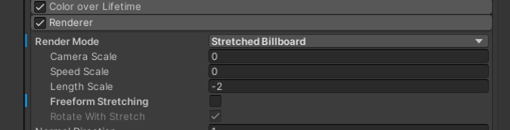
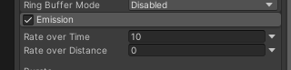
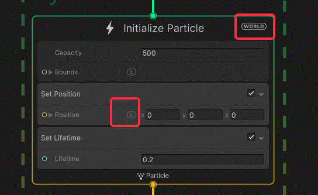
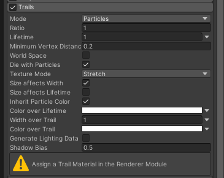
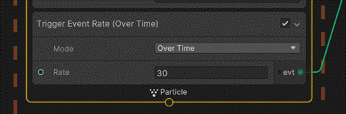
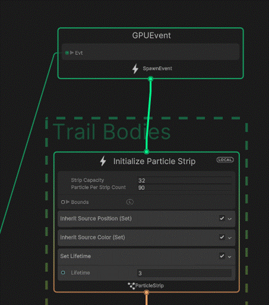
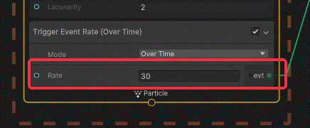
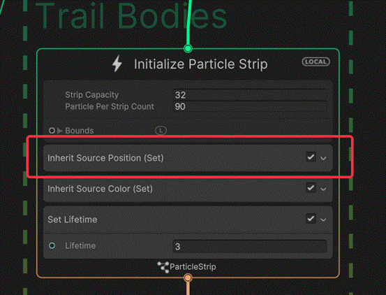
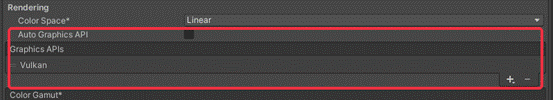

# 关于VFX Graph的学习

 转载自我的有道云笔记，目前内容不多，后续如果继续使用会更新。

 

## 前言

出于实习工作需要和毕设需要，我开始使用VFXGraph。

以前准备第一批作品集的时候，就简单地使用过，但是只是跟着教程一顿乱连，很多地方没有理解。

始终跟着[GabrielAguiarPro](https://www.youtube.com/@GabrielAguiarProd)这位在学，好记性不如烂笔头，记录一下遇到的问题和解决方式吧，切莫反复踩坑。

 

 

## 在VFX中模拟Particle System的拉伸Billboard（Stretched Billboard）

 

当视角和平面夹角较大，会使其在Y轴方向有拉伸。

这个效果在VFX没有自带的模块，需要用脚本传入Y轴的拉伸值，直接接入到VFX文件的SetScale的Y轴上：

 

本来在VFX文件中计算就好了，但是VFX只能获取Scene中的Main Camera，如此，在Scene下就看不到效果了，调试很困难，于是写一个脚本计算Y轴拉伸，再传入VFX中：

```c#
using System.Collections;

using System.Collections.Generic;

using UnityEngine;

using Sirenix.OdinInspector;

using UnityEngine.VFX;

 

[ExecuteAlways]

public class Camera_Angle_To_Effects_Stretch : MonoBehaviour

{

  public VisualEffect vfx;

  public Vector2 stretchRange = new Vector2(0.2f, 1f);

 

  private Camera _camera{

​    get{

​      \#if UNITY_EDITOR

​      return UnityEditor.SceneView.lastActiveSceneView.camera;

​      \#else

​      return Camera.main;

​      \#endif

​    }

  }

 

  private void Update() {

​    setValue();

  }

  public void setValue(){

​    vfx.SetFloat("Y轴拉伸", Yrotate2Strech(_camera.transform.eulerAngles.y));

  }

 

  private float Yrotate2Strech(float eulerAnglesY){

​    eulerAnglesY %= 180;

​    float strech = Mathf.Lerp(stretchRange.x, stretchRange.y, Mathf.Abs(Mathf.Sin(eulerAnglesY * Mathf.Deg2Rad)));

​    return strech;

  }

 

}
```

如此便能做到类似的效果。

 

 

 

## 在VFX中使用Particle System中的噪声——Turbulence、湍流

使用Turbulence（湍流）节点：

 

 

 

 

 

## 在VFX中模拟Particle System中的随距离发射

这一点在原版中很容易实现：

 

但是VFX中需要以下操作：

\1.   在发射器中加入随距离发射

\2.   把Local空间的原点、也就是特效物体在Scene中显示的轴心位置，转换到世界空间，然后传入发射器的Position接入口。

\3.   初始化时，更改粒子的位置到本地空间的原点

 

 

 

 

 

# 【待完善】关于粒子贴花

和URP笔记中记录的贴花很像，在制作一些需要贴地的效果、如：地裂、地面灼烧痕迹时有用，因为其可以适配地形。

在VFX中，OutPut节点类里有一种就是贴花输出节点，可以用此输出节点来制作贴花效果。

我认为目前贴花效果存在一些根本问题。如果我想制作地裂，同时地裂的上方有玩家或者怪物，那么贴花会把效果也投射到玩家或怪物身上，造成穿帮。

关于这一点，必然是有解决办法的，但是目前从组件的面板来看我没有找到，需要再学习。

……待补充


 

 

## 在VFX中实现Particle System中的拖尾

在原版中，拖尾有以下属性：

 

挑些比较重要的聊一聊：

l **Mode**：有粒子和丝带两种。粒子模式是常用的模式，类似一个子发射器，当父粒子运动，拖尾就会根据父粒子运动的距离产生粒子。丝带模式没有用过，感觉很混乱。粒子之间会被直线的Quad连接。

l **LifeTime**：拖尾粒子的生命周期，直接决定了拖尾的长度，因为如果生命短，留存的就短，看上去粒子的拖尾自然就短了。

l **Minimum Vertex Distance**：最小顶点距离。不是说它是子发射器吗，那么运动多远才产生新的粒子，就是由这个参数决定。如果值很大，会导致拖尾新顶点产生稀疏，在一些高频变化的场合会出现走样。但是如果值很小，又会导致产生太多拖尾粒子，造成性能开销。

l **Texture Mode**：纹理模式，一般来说都是用拉伸的模式。不知道底层是怎么实现的，但是可以这么理解：

**所有的拖尾粒子所覆盖的区域，作为一整个Mesh片，然后Texture Mode决定这个Mesh中贴图的Tilling。**

 

在VFX中，没有做好的模块，需要使用GPU事件来制作拖尾，基本的思路为：

**生成头粒子 ——> 在头粒子的Update中添加触发器 ——> 使用该触发器输出的GPU事件发射拖尾粒子（拖尾粒子系统的类型需要为Strip、即条带，可以通过Ribbon的模板创建） ——> 使用拖尾粒子系统的context控制拖尾的性质**

 

 

Strip模板的粒子系统类似原版的拉伸的纹理模式，如果需要调整个拖尾的Tilling，可以换节点的输出节点的UV模式到Scale。

再来聊一下如何做到类似原Trail系统的更改：

l **更改拖尾粒子的密度**：对应原系统的Minimum Vertex Distance参数的修改，其修改方法为：在头粒子的触发器中，更改触发率：

 

这里有随时间和随距离两种模式，估计Rate的单位是每秒或者每米（这是不合逻辑的，因为触发器在UpadateContext中，每帧执行一次）

发射粒子的频率越高，拖尾条带也越顺滑，但是性能的开销也越大。

l 调拖尾长度的逻辑和原版一样，拖尾粒子的寿命直接决定拖尾的长短。

l 例子拖尾默认并每不会连接上头粒子，因为缺少一步位置的继承：

 

很多属性可以使用Inherit关键字来从头粒子获取。

 

由于拖尾粒子的特殊的条带渲染模式，生命周期的属性实际表现为对应到拖尾长度的表现。

如我把拖尾粒子的生命周期颜色改为前白后黑，那么表现为拖尾离头粒子近处白远处黑。这很好理解，不多赘述。直接记住这一点可以加快某些效果的分析过程。

 


 

# 【待完善】在VFX中实现子发射器

原版：

 

子发射器很好理解，就是以父粒子为中心，开始发射一个新的子粒子系统。

有一个条件控制什么时候发射，官方的有以下几种：

……

 

 

 

## 生成Shader时，出现无法打开包的问题

Output Particle Quad': Couldn't open include file 'Packages/com.unity.visualeffectgraph/Shaders/VFXCommon.hlsl'

环境：

Unity 2021.3.4f1

VFX12.1.7

这是Unity的Bug，在Player Setting中的安卓的图形API中删去OpenGLSE即可

 

 

---


 

 

 

 

 

 

 

 

 

 