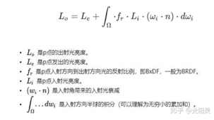
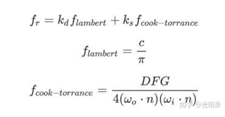
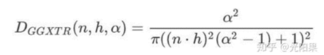
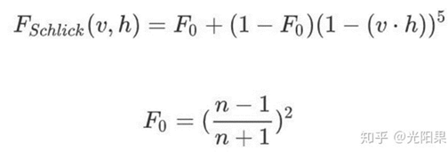
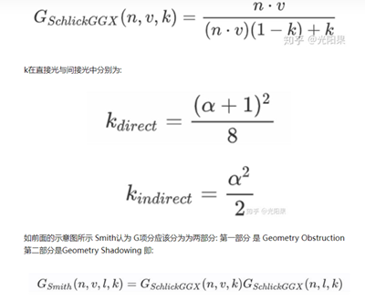
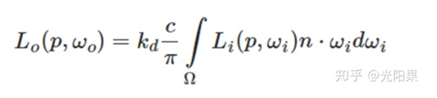
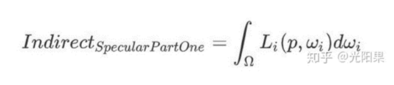
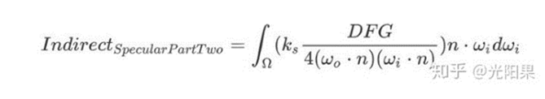
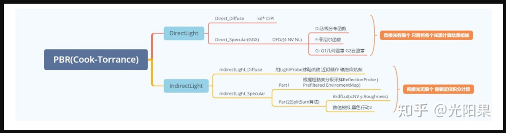

# 关于PBR

本笔记为早期Excel笔记

仅简单记录了库克托伦斯模型的各部分的基本知识。

转载后可读性更低了，建议作为查找性材料使用、或者等作者修复更新后再阅读。

抱歉。🙏🏻🙇🏻‍♂️

| 中文名                                                       | 英文名/缩写                                                  | 说明                                                         |                                  |
| ------------------------------------------------------------ | ------------------------------------------------------------ | ------------------------------------------------------------ | -------------------------------- |
| 基于物理的渲染                                               | Physically  Based Shading     /     PBR                      | 1.顾名思义，就是基于物理的渲染，其利用物理定律计算光照，相较于之前说的基于经验的光照模型能够得到更加准确的物理效果。      2.基于物理的光照模型必须满足以下三个条件：      （1.基于微平面的表面模型。     （2.能量守恒。     （3.基于物理的BRDF。 |                                  |
| 微表面模型                                                   | Microfacet  Model                                            | 1.微表面模型的效果关键是粗糙度的体现，之前学的Oren-Nayar  Lighting就是一种模拟物体粗糙度的光照模型。粗糙度越小，物体的高光越小，但是越亮；粗糙度越大，高光越大，但是越暗，像是散开了一样。当粗糙度拉到1，高光的效果是整个球体看上去像一个面一样，因为此时高光已覆盖了整个球体，变成了均匀的，像我老爹做的自流平一样。      2.为什么这会牵扯到基于物理的渲染？因为现实中的物体表面是很复杂的，不可能出现完全的镜面，它们都有无数的微平面，而模型不可能精细到把微平面也建出来，所以需要在渲染上下功夫模拟这样的物理上的微平面的反射。 |                                  |
| 能量守恒                                                     | Conservation  of energy                                      | 1.物理定律，能量既不会凭空产生，也不会凭空消失，它只会从一种形式转化为另一种形式，或者从一个物体转移到其它物体，而能量的总量保持不变。     2.表现在渲染上，其实很简单：出射光线的能量永远不能超过入射光线的能量。      3.看右边方程，这是渲染方程，Lo是出射光（观察方向）辐射度，Le是自发光在观察方向上的辐射度，后面是一个半球积分，对渲染点法线半球的所有入射光经过BRDF（材质）的作用后、反射到观察方向的结果积分，这二者加起来就是人能看到的辐射度。关于辐射度量学的这些名词，参考101的笔记。     4.在上面的微表面模型中就有体现，高光小且亮、大而暗，它们的总能量是一样的。      5.这个东西在渲染中怎么用呢？主要体现在计算反射类型的能聊比例上，首先由高光（镜面反射）部分的函数计算出高光所占的能量的百分比，用1减之即可得到漫反射能量的部分的占比。      6.渲染中的情况往往更加复杂，因为物体不只受光源的影响，其还受间接光的影响，即物体间的反射，也就是环境光，环境光加上直接光照就是全局光照，GI或者global  Illumination。所以PBR往往需要计算四种光照，在镜面和漫反射层级下再细分直接光和间接光这四种。     *：在PBR中的体现：1.出射能量不能大于入射能量、2.kd + ks = 1 |  |
| 基于物理的BRDF                                               | /                                                            | 1.有很多种，之前说的兰伯特、月光、等等，都是BRDF（材质）。     2.这里介绍一种，叫做：Cook-Torrance，效果真实，应用最广泛。 |                                  |
| 库克-托伦斯（音译）                                          | Cook-Torrance                                                | 1.先看右边公式，Cook-Torrance主要体现在镜面反射的计算部分。      2.kd和ks指的是漫反射和镜面反射的能量占比，和能量守恒中提到的是同一种东西。可以看到漫反射部分还是用lambert来算，镜面反射部分用的用的是Cook-Torrance的内容。     3.这里的DFG是Cook-Torrance中的关键参数，如何计算？什么意思？下面拆分来讲。 |  |
| 库克-托伦斯的D     /     法线分布函数                        | Distribution  of normal function     /     GGX     /     Trowbridge-Reitz | 1.干啥的呢？这个D算的是镜面反射的范围和强度，看右图公式，我看不懂，但是站在巨人的肩膀上好吧。分析一下，输入是法线、半程向量和粗糙度，用这三个参数一通算，可以大概算出这个点“反射方向和视线的对齐程度”，这和之前的blinn-Phong模型是一样的，只不过引入了粗糙的计算。     2.与之前的Oren-Nayar模型是类似的，但是Oren-Nayar模型没有用到高光上。     3.代码：     //D     float D_DistributionGGX(float3 N,float3 H,float Roughness)     {       float a       = Roughness*Roughness;       float a2      = a*a;       float NH      = saturate(dot(N,H));       float NH2      = NH*NH;       float nominator   = a2;       float denominator  = (NH2*(a2-1.0)+1.0);       denominator     = PI *  denominator*denominator;              return       nominator/  max(denominator,0.001) ;//防止分母为0     } |  |
| 库克-托伦斯的F     /     菲涅尔反射函数                      | Frenel  function                                             | 1.这个F代表是菲涅尔指数，即代表多少光反射了，（1-F）代表多少光透射了。     2.因为F代表的值和ks很接近，ks指的是有多少光是镜面反射的，所以最终的反射方程中常常看不到ks这个参数，其实是和F合并了。      3.看右图公式，分析一下，输入是视线方向和半程向量，最终要得到一个高光的系数。F0是什么呢？其实是不同材质特有的一个参数，可以通过n、也就是材质的折射率来计算。效果是：法线与视线夹角较大的面，其镜面反射较强。     4.代码：     float3 F0 = 0.04;     F0 = lerp(F0, BaseColor, Metallic);               //F     float3 F_FrenelSchlick(float HV,float3 F0)     {       return F0 +(1 -  F0)*pow(1-HV,5);       //return  lerp(pow(1-HV,5),1,F0);     }      *：分析一下代码，“金属度”这个量，作为参考值在F0（可以理解为很暗的灰色）和物体本身颜色间插值，得到的值经过计算后作为直接光照的镜面反射部分。也就是说，非金属的镜面反射颜色不太受自身颜色影响，而金属的镜面反射颜色受自身颜色影响大。观察手连PBR，得到相同的结论。 |  |
| 库克-托伦斯的G     /     几何体函数     /     自我遮蔽模拟函数 | Geometry  function                                           | 1.记得高中学的“黑体”吗？就是辐射只进不出的那种结构。微表面也有类似的属性，反射出来的光线可能会被自己的微表面遮挡，从而无法被看见，效果是镜面反射的部分变暗、变散。G项就是用来模拟这种性质的。      2.看右边公式，首先，基本的几何体函数输入为法线方向、视线方向和k，k是通过计算而来的，直接光和间接光的k计算方法不同。不过都是只和粗糙度挂钩的值，k可以理解为粗糙度，只不过变换是非线性的了。输出是什么呢？仅一个float值，大概是代表了“能见程度”。     3.后被smith改进，认为光照方向也应影响自我遮蔽效应，于是将G分成了两部分，分别用原先的函数计算一遍，得值相乘即可。     4.代码：     //G     float GeometrySchlickGGX(float NV,float Roughness)     {       float r = Roughness +1.0;       float k = r*r / 8.0;   //直接光       float nominator = NV;       float denominator = k + (1.0-k) *  NV;       return nominator/  max(denominator,0.001) ;//防止分母为0     }          float G_GeometrySmith(float3 N,float3 V,float3 L,float Roughness)     {       float NV = saturate(dot(N,V));       float NL =  saturate(dot(N,L));            float ggx1 =  GeometrySchlickGGX(NV,Roughness);       float ggx2 =  GeometrySchlickGGX(NL,Roughness);            return ggx1*ggx2;          }      *：与D项非常相似，但又不一样。D项是由于、微平面法线不均匀就会导致反射能量下降，而G项是在此基础上，模拟反射出来的能量又被自身微表面遮挡的现象。二者的表现很类似，都是变暗、变散。 |  |
| 库克-托伦斯在直接光照计算部分                                | /                                                            | 1.根据能量守恒公式，终于可以开始计算直接光照的部分了     2.代码：     //================== PBR   ============================================== //     // float3 BaseColor = float3(0.5,0.3,0.2);     float3 BaseColor = _BaseColor;     float Roughness = _Roughness;     float Metallic = _Metallic;     float3 F0 = lerp(0.04,BaseColor,Metallic);     float3 Radiance = _LightColor0.xyz;          //================== Direct Light ==============================================  //     //Specular     //Cook-Torrance BRDF     float HV = saturate(dot(H,V));     float NV = saturate(dot(N,V));     float NL = saturate(dot(N,L));          float D = D_DistributionGGX(N,H,Roughness);     float3 F = F_FrenelSchlick(HV,F0);     float G = G_GeometrySmith(N,V,L,Roughness);          float3 KS = F;     float3 KD = 1-KS;     KD*=1-Metallic;     float3 nominator = D*F*G;     float denominator = max(4*NV*NL,0.001);     float3 Specular = nominator/denominator;          //Diffuse     float3 Diffuse = KD * BaseColor / PI;     float3 DirectLight = (Diffuse + Specular)*NL *Radiance;     FinalColor.rgb = DirectLight.rgb;     3.分析一下：其实整个主体几乎都在计算高光，就是用库克-托伦斯BRDF来计算高光。因为是直接光照，光源数量少且相较固定，所以不用积分，直接普通地累加各个光源的影响就行。 |                                  |
|                                                              |                                                              |                                                              |                                  |
| 库克-托伦斯的间接光照部分                                    | /                                                            | 1.间接光照其实也是用渲染方程来算的，只不过这里才会真正用到积分，因为间接光照是每个方向都当成独立光源来处理的。     2.这个计算十分复杂，可以先拆成漫反射和镜面反射这两种来计算 |                                  |
| 库克-托伦斯的间接光照的漫反射部分                            | /                                                            | 1.公式见右图，间接光照中，每个方向入射的光强度和颜色是从一张CubeMap采样得到的。然后通过法线半球每个方向的采样值来计算积分计算这个点间接光照的漫反射的强度和颜色。每帧计算积分是不现实的，所以可以先烘一张辐射度贴图，用法线方向对其采样，即可得到积分算出来的值，可以直接赋给radiance  参数。怎么烘的呢？就是预计算嘛，先定一个法线方向，再算它用环境CubeMap的半球积分，可以得到这个方向的半球积分值，然后把它存到烘培的CubeMap中，得到的效果往往是类似模糊的。     2.烘培辐照度贴图的算法是随机抽取可定义组的方向采样计算后得到的平均值，因为不可能无限采样。      3.你有没有发现右边的公式把BRDF去掉了？是的，这是把积分拆开来计算的结果，这里只算Li的部分，BRDF的部分在确定其他参数后，从BRDFLut中通过NL（cos）和粗糙度采样得到。具体的数学理论看202笔记 |  |
| 光（照）探头                                                 | LightProbe                                                   | 1.每个物体（场景）都烘辐照度贴图会占用大量的内存，是不现实的。所以有了感光探头。感光探头是干啥的呢，它做的事和上面烘的辐照度贴图一样，你输入一个采样方向，就会根据内部储存的球谐函数算出辐照度，和直接对辐照度贴图采样得到的是一样的。     2.在Unity中，光照探头会自动捕获周围的需要计算间接光照的物体，并把自己保存的PBR漫反射信息传给它们。     3.光照探头并不是把积分值存到一个CubeMap中，而是存到一个球谐函数的9个float参数中。使用时，只需要输入采样方向就可以用这9个参数算出间接光照辐照度。 |                                  |
| 库克-托伦斯的间接光照的镜面反射部分                          | /                                                            | 1.很复杂，于是也分成了两个部分                               |                                  |
| 库克-托伦斯的间接光照的镜面反射的第一部分                    | /                                                            | 1.公式如右图，是主要的镜面反射部分，类似汽车车窗的反射。这部分除了反射的lod需要一点粗糙度的信息外，是不需要之前提到的DFG的，就是把它当作一个完全光滑的球面来算。应该是在第二部分，对其削弱得到正确的渲染效果。     2.做法是使用反射探针，就像把这个点的环境记录在贴图里一样，使用的时候，直接用法线方向采样得值，也是为了规避积分计算。     3.粗糙度高的材质往往镜面反射弱，镜面反射效果暗而散，所以反射探针保存的信息也有lod等级的，计算的时候需要根据粗糙度计算得到不同的lod等级来对不同lod的cubeMap采样。 |  |
| 库克-托伦斯的间接光照的镜面反射的第二部分                    | /                                                            | 1.公式如右图，主要是通过计算的DFG来影响镜面反射。     2.同样是不可能在每帧做积分的，解决的做法有两种，一种叫BrdfLut，一种叫函数拟合。      3.第二部分就像是一个第一部分的遮罩，第一部分计算的十分理想的镜面反射状态，但是物体的金属度、粗糙等属性是不允许的。所以第二部分计算哪些部分真的应该使用镜面反射，以及使用多强的镜面反射。 |  |
| BRDF积分贴图                                                 | BrdfLut                                                      | 1.BrdfLut也是烘培技术，观察第二部分的公式，只需要输入光照颜色、粗糙度、光线  方向ωi 与法线  n 的夹角 n.*ωi 的情况下，预计算 BRDF 的响应结果。这样可以规避积分。      2.所以只能假设每个方向的入射光的颜色都是白色，然后把响应结果烘到BrdfLut贴图中，一般是保存到RG通道中，分别代表两部分的积分值，这里的两部分是在镜面反射的第二部分中、再次分出了两部分，只是为了方便计算罢了，这两部分加起来，就是镜面反射第二部分的辐照度值。     3.采样的方法是有一点特别的，xy分别使用NV, Roughness来采样，就像一个函数一样，马上就能得到返回值。 |                                  |
| 函数拟合                                                     | /                                                            | 1.反正打死也不愿算积分呗，就可以用其他的经验模型、或者说函数来拟合，模拟，得到类似的返回。     2.一般来说函数拟合的效果比BrdfLut的 效果更好，且更节省性能。 |                                  |
| 库克-托伦斯在间接光照计算部分                                | /                                                            | //================== Indirect Light   ============================================== //     float3 IndirectLight = 0;     //Specular     float3 R = reflect(-V,N);     float3 F_IndirectLight = FresnelSchlickRoughness(NV,F0,Roughness);     // float3 F_IndirectLight = F_FrenelSchlick(NV,F0);     float mip = Roughness*(1.7 - 0.7*Roughness) * UNITY_SPECCUBE_LOD_STEPS  ;     float4 rgb_mip = UNITY_SAMPLE_TEXCUBE_LOD(unity_SpecCube0,R,mip);          //间接光镜面反射采样的预过滤环境贴图     float3 EnvSpecularPrefilted = DecodeHDR(rgb_mip,  unity_SpecCube0_HDR);          //LUT采样     // float2 env_brdf = tex2D(_BRDFLUTTex, float2(NV, Roughness)).rg;  //0.356          //数值近似     float2 env_brdf = EnvBRDFApprox(Roughness,NV);     float3 Specular_Indirect = EnvSpecularPrefilted * (F_IndirectLight * env_brdf.r +  env_brdf.g);          //Diffuse           float3 KD_IndirectLight = 1 - F_IndirectLight;     KD_IndirectLight *= 1 - Metallic;          float3 irradianceSH = ShadeSH9(float4(N,1));     float3 Diffuse_Indirect = irradianceSH * BaseColor / PI  *KD_IndirectLight;          //float3 EnvCubeMap = texCUBE(_EnvCubeMap,N).xyz;          IndirectLight = Diffuse_Indirect + Specular_Indirect;          float4 FinalColor =0;     FinalColor.rgb = DirectLight + IndirectLight;     //HDR => LDR aka ToneMapping     FinalColor.rgb = ACESToneMapping(FinalColor.rgb);          //Linear => Gamma     // FinalColor = pow(FinalColor,1/2.2);     return FinalColor |                                  |
|                                                              |                                                              |                                                              |                                  |
| 高动态范围                                                   | HDR                                                          | 1.其实是一种矫正。计算过程中，颜色值可能三维均大于1，那么最后只会得到白色，效果不好。所以要用算法把颜色压到低动态范围（LDR）中，这种算法叫色调隐射算法（Tonemapping），常用的色调映射算法是ACESTonemapping：      float3 ACESToneMapping(float3  x)     {       float a = 2.51f;       float b = 0.03f;       float c = 2.43f;       float d = 0.59f;       float e = 0.14f;       return  saturate((x*(a*x+b))/(x*(c*x+d)+e));     } |                                  |
| 伽马矫正                                                     | Gamma  Correction                                            | 1.入门精要里也说过，人眼对  低亮度 的颜色变化 感知强，对 高亮度 的颜色变化 感知弱      2.你在片元着色器输出的颜色值往往是线性空间下的，人眼感知弱，对比度不强，为了解决这个问题，有了伽马矫正，可以用算法把颜色对应到非线性空间下（伽马空间），算法是：     //Gamma => Linear     float3 Color_Linear = pow(Color_Gamma,2.2);     //Linear => Gamma     float3 Color_Gamma= pow(Color_Linear,1/2.2);     3.如果在Unity里设置颜色空间为Gamma，就需要自己把Gamma映射到Linear计算，否则不需要。无论如何，最后需要自己把颜色塞回伽马空间。 |                                  |
| 粗糙度控制着什么                                             | /                                                            | 1.直接光照的镜面反射部分的D项，越粗糙，D项一般越小，代表渲染点的微表面们，和反射方向不太对齐。     2.直接光照的镜面反射的G项，越粗糙，自遮蔽现象越重，G项越小。      3.间接光照镜面反射第一部分入射光的计算。间接光照镜面反射的光源通过观察方向做反射，再对CubeMap采样确定，但是由于粗糙度不同，其实也需要对不同清晰度的CubeMap采样，这样的效果更真实，此处粗糙度作为参考值，决定采用哪一个层级的CubeMap。越粗糙，使用越模糊的CubeMap。     4.间接光照镜面反射第二部分，作为参数之一，和NV一起、参与数值拟合，避免计算积分，越粗糙，一般来说镜面反射越弱。 |                                  |
| 金属度控制着什么                                             | /                                                            | 1.直接光照镜面反射部分的F项。金属度作为参考值，对F0（0.04，可视为一个接近黑色的颜色）和物体本身颜色插值，得到的颜色经过计算后作为直接光照镜面反射部分使用。也就是说，非金属的镜面反射颜色不太受自身颜色影响，而金属的镜面反射颜色受自身颜色影响大。观察手连PBR，得到相同的结论。     2.直接光照漫反射的KD。KD本是1-KS（KS也就是F项）得到，但是KD又做了一步乘（1 -  Metallic），意味着，非金属漫反射强，能量几乎没有透射，金属漫反射弱，有能量的透射。     3.间接光照的镜面反射的F项，金属度控制F0（指通过金属度在0.04和baseColor插值后得到的颜色），而F0参与F项的计算，产生的影响和1.中一致。 |                                  |
|                              |                                                              |                                                              |                                  |