# 关于SRP、URP的研究

这是一个学习中笔记，目前内容不完整且很可能不正确。


## Log

力求搞清楚以下内容

1. ~~什么是SRP、什么是URP、什么是command buffer、什么是渲染管线~~

2. ~~什么是VAO、VBO、FBO、RBO~~

3. ~~URP有什么优点，有什么缺点~~

4. ~~URP和Build-in管线的对比~~

5. ~~什么是Render Piple Asset、什么是Render data~~

6. ~~什么是Render Feature，有什么用，怎么用~~

7. ~~什么是Layer、什么是Render Layer、什么是Layer Mask、什么是Render layer Mask~~

8. ~~什么是Cbuffer、让Renderer Feature可以被批处理 需要哪些条件？~~

9. <u>*什么是Shader KeyWords，对合批有什么影响？*</u>——延后到研究Shader变体时再研究——**WAIT**

10. ~~学习案例，分析总结怎么自定义Rednder Feature~~

11. ~~总结目前遇到的3种cmd的写法——单Pass渲染全场景、drawmehs绘制指定网格、使用预制体Render渲染物体~~

12. ~~实操自定义一个Render Feature——利用使用预制Renderer的cmd方式，找一个喜欢的效果实现。——我想利用模板测试实现一个阿尔法抖动的效果~~

    ~~仔细思考后，发现涉及大量未知知识，做不到……~~

    ~~那么做一个简单的被遮挡时的XRay效果好了~~

    ~~思路：~~

    ~~时机在渲染完不透明物体后。~~

    ~~Shader指定，若ZTest失败，则保留片元。~~

    ~~通过Render Layer Mask，在物体的Render中指定是否开启XRay效果。~~

    ~~Feature中指定渲染整个场景。~~

    ~~Pass仅渲染XRay颜色，做一个简单的菲涅尔遮罩。~~

    ~~通过Feature指定XRay颜色、菲涅尔的参数等等。~~

    ~~Log：~~

    1. ~~写一个仅渲染XRay的Shader，使用菲涅尔效应做做效果，暴露参数：颜色、强度、衰减~~
    2. ~~写Feature类~~
    3. ~~做出来了！比预想的顺利！写篇知乎吧~~
       1. ~~先写Shader和Feature的注视~~ 
       2. ~~编写MarkDown~~
       3. ~~检查发文~~

13. ~~Render Object怎么用~~

14. ~~探索其他自带的Render Feature~~

15. ~~如何从Build-in Shader 转换到 URP Shader~~

16. ~~如何从URP Shader 转换到 Build-in Shader~~

17. **URP中如何自定义后处理**

18. URP中如何使用Grab Pass

19. 在Feature中如何对各种缓冲区操作，如何新申请缓冲区，如何查找我想要的缓冲区

20. 在Shader中如何获取 我想要的缓冲区，是否有对其他缓冲区修改的能力？

21. 看看、收集一些很帅的、有用的Render Feature

22. 补完百人计划的command Buffer那一节

23. 做点东西放到作品集

24. 整理文档，检查错误

25. ……


---

## 一些基本概念

- **渲染管线。**我无数次使用过帧调试器，帧调试器下那个渲染的任务队列，就是渲染管线

  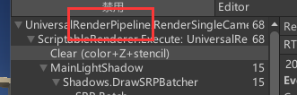 

- **SRP（scriptable render pileline、可编程渲染管线）。**目前在Unity中渲染管线只分为SRB和Build-in，默认的3D项目就是Build-in渲染管线，而URP、HDRP等的项目属于SRP。之所以叫“Scriptable”，是因为它的渲染管线可以通过C#脚本来控制——用户可以给渲染管线增加环节、调整环节的顺序等；相对的，这一点在Build-in是无法做到的。

  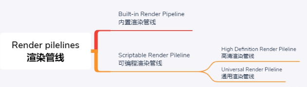 

- **URP（Universal Render Pipeline、通用渲染管线）。**是SRP的一支。前身是LWRP（Lightweight RP、轻量级渲染管线）。URP的性能比Build-in好不少，因为Build-in为了满足各种需求、同时又不能让用户自定义渲染管线、内置了大量的囊肿的、无用的代码，导致性能下降。URP之所以有“Universal、通用”之称，是因为它的平台兼容性。目前URP支持Unity内可以导出的所有平台，这一点就是它的“通用”之处。

- **command buffer、指令缓冲区。**这一串都是Unity总结出来的一些重要指令。除了这些之外，还有很多指令，比如改变渲染设置、设置渲染目标、渲染网格等等。所有的渲染指令其实存在一块缓冲区中，这块缓冲区就是command buffer。在SRP中，允许开发者使用Unity提供的API对command buffer做出一些修改，可以做到增删改查指令等。

   

- **VBO（Vertex Buffer Object、顶点缓冲对象）和EBO（Element Buffer Object、索引缓冲对象）。**你记得入门精要里，最初学习渲染流水线的时候吗？这一块内容主要和应用阶段相关。VBO本质上是显存中的一块，用来保存模型（本次渲染对象）的顶点信息（位置、uv、法线、切线等）。使用VBO的话GPU就能直接从显存里读取数据了，不用从内存里读，非常快。VBO可是说是：里面保存了渲染对象的所有顶点的信息的一个数组。

  这没有完全解决问题，在做米笔试法线平滑工具的时候，我了解到，一个点被多少个面共用，这个点处就有几个顶点。这会导致VBO中有大量的重复数据！于是诞生了EBO。EBO也是显存的一块，里面存放的是一个索引数组，每个EBO对应一个VBO，比如一个EBO的内容是0，1，2，就代表抽取出VBO中的第1、2、3个顶点信息，传到下一步计算中。这样就能解决掉VBO中重复数据的问题啦。

- **VAO（Vertex Array Object、顶点数组对象）。**VAO其实就是VBO和EBO的组织者、管理者和使用者。VAO里保存的是：顶点各个属性在VBO中的起始位置，这样能快速地找到某一个顶点的某一个属性的值是多少，以用于渲染。下图描述地非常形象，请仔细分析：

  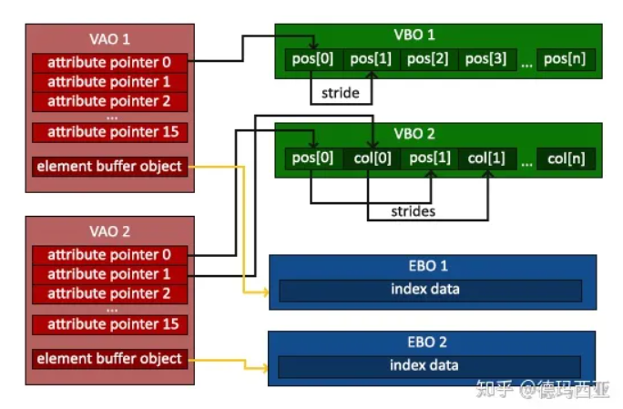 

- **FBO（Frame Buffer Object、帧缓存）和RBO（Render Buffer Object、（自拟）渲染缓存）。**与上一条稍有类似，FBO和RBO也是显存中的一块，作用是保存一些渲染的结果，用于类似后处理的处理。这里不仅可以保存对于颜色的渲染结果，还可以保存深度、模板测试缓冲区、深度缓冲区等等。目前这块我能找到的资料和流程图几乎没有，我还没很好地了解它们是怎么工作的，这一块将来需要补充。

- **Render Piple Asset、渲染管线资产。**保存渲染管线信息的Scriptable Object，它在项目设置的图形设置中被使用。它保存的主要是**渲染质量相关**的设置，这些设置比较抽象，不针对某一个渲染器，是大部分渲染器共用的一套设置。

  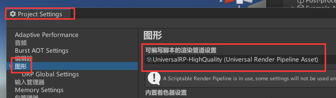 

  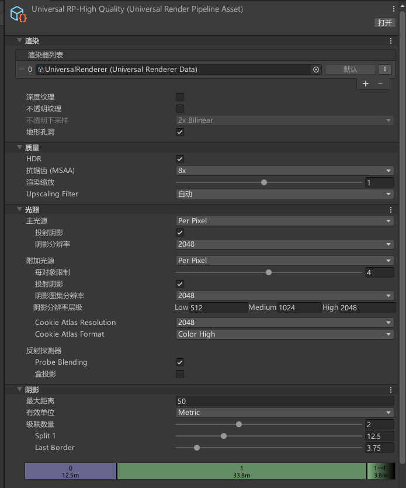 

- **Render data、渲染器信息。**于渲染管线资产中被使用，一个渲染管线资产中可以添加多个渲染器信息资产。

  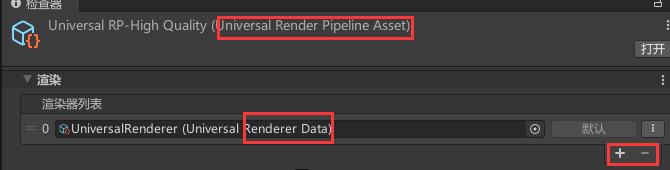 

  渲染器信息资产本质上也是一个Scriptable Object，保存的是：跟这个渲染器高度相关的一些渲染设置，以及包含哪一些Render Feature。

  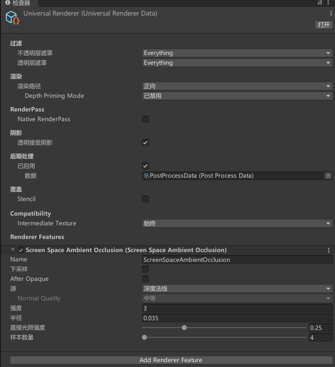  

---


## URP的优缺点

优点：

1. 相比Build-in，**渲染光照**的性能好不少。
2. 平台兼容性相比HDRP好，Build-in能兼容导出的、URP都可以。
3. 可以高度客制化，非常自由。

缺点：

1. ~~学习成本较高（我自己说的）~~

2. 不太能较好地兼容Build-in的Shader文件。

3. 过度的自由，可能使功力不深的开发者产生深不可测的错误。

4. 不再支持多Pass输出到同一缓冲区。回忆一下Build-in中的描边算法，先渲染模型的扩张后的背面，输出到颜色缓冲区，再渲染模型的正面，输出到颜色缓冲区。这在URP中不再能做到，因为URP同一个Shader中，输出到某一个缓冲区的Pass只能有一个。

   > URP提供的几个默认Shader中包含多个Pass，但是只能有一个渲染Pass
   >
   > - 渲染Pass
   >
   > - - "LightMode"="UniversalForward"
   >   - 最终输出到帧缓存中，只能有一个，也就是我们说的URP只支持一个Pass
   >
   > - 投影Pass
   >
   > - - "LightMode"="ShadowCaster"
   >   - 用于计算投影
   >
   > - 深度Pass
   >
   > - - “LightMode”=”DepthOnly”
   >   - 如果管线设置了生成深度图，会通过这个Pass渲染
   >
   > - 其他Pass
   >
   > - - 专门用于烘焙的Pass，专门用于2D渲染的Pass等
   >
   > 在Built-In管线里面，我们可以使用多Pass实现描边、毛发等等效果，但是在URP中就需要改变实现方式了。一般来说，Render Feature可以解决大部分问题，可以通过它实现大部分多Pass的效果。

   

---


## URP和Build-in的差异

1. **定制性**

   URP完爆Build-in

2. **光照渲染性能**

   URP完爆Build-in

   Build-in渲染光照如“入门精要笔记”中所说，是多Pass的渲染，第一个Pass渲染最亮平行光和其他所有设置为“不重要”的灯光的影响，第二个Pass渲染剩下的所有灯光。

   而URP把所有未设置为Static的灯光都放在一个Pass中渲染，这会大大提升效率，但是也会限制灯光的数量，因为传给GPU的参数数量有限。

3. **批处理能力**

   URP完爆Build-in

   在Build-in中，只要物体不是一个材质、不是静态物体，基本就不能被合批，导致Draw Call很多。

   在URP中，得益于Shader变体技术，只要物体使用的是同一个Shader，那么这些物体就可以被SRP合批。关于Shader变体的内容，我将于本课题结束后学习。

---


## URP Shader 和 Build-in Shader 如何相互转换

这个问题其实比较复杂，要看Shader用了原库里的什么东西。Shader不通用主要是引用库完全不同的原因，所以需要人为的把原来的一些用法翻译成新库能认的。URP到Build-in也是一样。

这里有一个非常详细的对照替换表，按需求查找替换。[机翻版本](http://events.jianshu.io/p/3fef69e2efb6)                  [对照替换](https://teodutra.com/unity/shaders/urp/graphics/2020/05/18/From-Built-in-to-URP/)

---


## 关于Renderer Feature

直译是渲染器特征，我觉得不太贴切，我觉得叫”渲染器功能“更合适。

### 什么是？

那什么是Renderer Feature？

> **Renderer Feature**可让我们向URP Renderer添加额外的渲染通道，支持我们进行Asset资产配置来重写从而可以自定义渲染的顺序、渲染的对象、材质等等。

在我的理解中，Renderer Feature就是一系列对command buffer的操作的集合。Unity官方把这些command 抽象成API供开发者使用，这些API（command ）堆叠起来，就成了一个Renderer Feature，可以对画面的渲染产生影响。

在Unity中，如果开启了一个Renderer Feature，如SSAO，在帧调试器中会多出一条：

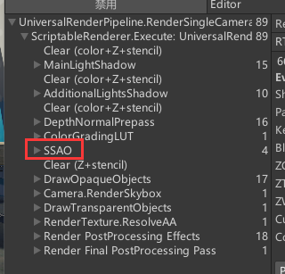 

所以，大概可以说，上面这些并列的，都是Renderer Feature吧，只不过它们是URP写好了的。

### 有什么用？

做到原来多Pass做的事。根据之前的学习，URP中对于一个缓冲区，只能有一个Pass输出于它；但是为了做到更复杂的效果，需要多Pass。这种情况就可以使用Renderer Feature，在渲染的制定阶段添加新的command ，达到原来的目的。

其实，只要是对这个渲染任务列表做操作的事情（比如在指定位置插入一个、调整某些任务的顺序等等），Renderer Feature都能做到。

### 怎么用？

在Render Data里面添加自定的、或者其他来源的Renderer Feature，再配置Renderer Feature的参数，就能直接看到效果了。

### 如何自定一个Renderer Feature

这个问题就像”如何赚钱“一样，非常难回答。

简单来说根据Unity提供的Renderer Feature的基类，去继承、填充重写它的函数可以了。

自定Renderer Feature涉及极多的API，这些只能在实践过程中去积累和学习。

### 如何让Render Feature可以被批处理

在批处理方面，我遇到了不小的问题。以本次学习的小项目为例，按理来说，我只是控制用一个材质渲染了一遍场景而已，那么按照批处理的规则，整个场景都应该和为一批渲染。但是实操中我遇到了很多问题，下面我会来说一下Render Feature被批处理的一些我遇到的问题：

1. Shader的所有属性，都应该放到CBUFFER中。关于这一点，我记录在TA零散笔记中。
2. 未知问题导致的合批失败，可以试着重新烘培一下场景的光照。

### 关于官方提供的Renderer Feature：Render Object

[原文](https://docs.unity3d.com/Packages/com.unity.render-pipelines.universal@12.1/manual/renderer-features/how-to-custom-effect-render-objects.html)

简单来说，这个Feature可以在指定时机使用指定材质的指定Pass对一个Layer的物体进行渲染，并且对于深度测试、模板测试等，可以进行再配置。非常灵活，可以满足一些简单的需求。


### 关于官方Feature：Decal（贴花）

[原文](https://docs.unity3d.com/Packages/com.unity.render-pipelines.universal@12.1/manual/renderer-feature-decal.html)

就是类似投影的功能，简单明了。使用时需要先开启这个Feature，然后制作一个Decal的材质，然后新建一个空物体，给一个Decal的投影器，靠近投影面，就能看到效果了。

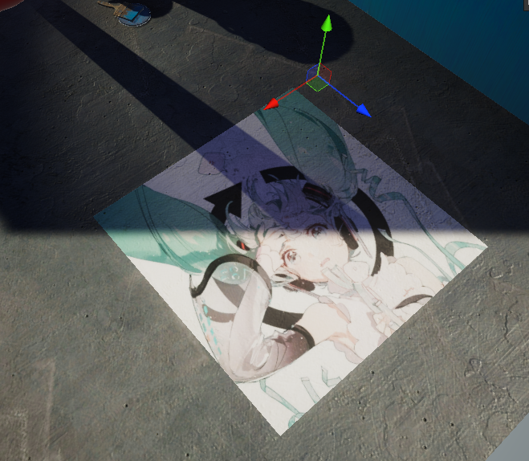 


### 关于官方提供的Feature：SSSM（屏幕空间阴影映射）

[原文](https://docs.unity3d.com/Packages/com.unity.render-pipelines.universal@13.1/manual/renderer-feature-screen-space-shadows.html)

我一直以为Unity默认使用的阴影渲染方式就是SSSM，之前百人计划也是这么记的。但是不知道为什么，URP重需要自行添加SSSM的Feature才是，平常不知道是什么样的。

我自行对比得到的性能差距不是很大，但开启SSSM后会多一个Pass，需要新的全分辨率Buffer保存阴影结果。

据官方的说法，开启SSSM后，会消耗一定显存、但是对与前向渲染的阴影，有一定的加速效果，因为不需要频繁访问级联阴影映射。


---


## 关于在URP中自定义后处理

### 官方不支持，自己想办法

以下是最新版本的URP包的说明

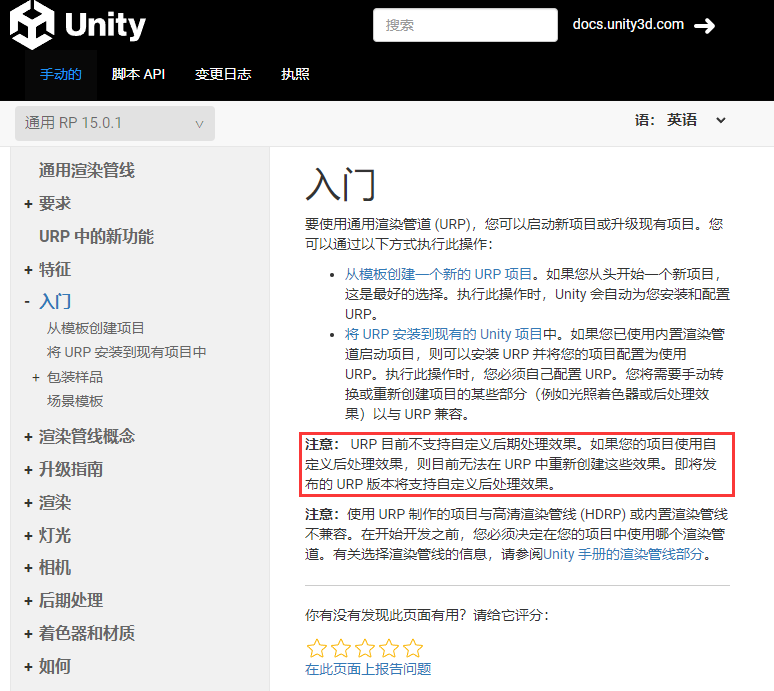  

### 资料收集和分析

#### 目前可以使用的方法

**使用自定义Volume Components + Renderer Feature的方式：[Febucci](https://www.febucci.com/2022/05/custom-post-processing-in-urp/)**

同上，但是当你需要在TimeLine中调整该后处理的参数时：[**U3D系列教程**](https://learn.u3d.cn/tutorial/custom-post-process/?tab=overview)

这种方式使用时，需要自己编写一个Volume Components的派生类，用于把后处理项目加入Volume系统。同时，这个类里还需要包含对后处理Shader的参数的申明。随后，需要自己编写一个Renderer Featture去做实际的后处理渲染。优点是自由，无依赖项，可以从零开始。缺点是当后处理比较多个，每个都需要一个Renderer Feature，面板会有点臃肿。


**使用类似HDRP的方式，自定义Volume Components并通过Renderer Feature总体管理的方式：[Git](https://github.com/YuSiangLai/URP-Custom-Post-Processing)**

这种方式下，我们需要编写的内容集中在Volume Components中，这比较符合开发的逻辑。其实本质上也需要编写Renderer Feature类，但是这里作者把这个写好了，并且让用户可以配置后处理的顺序，非常好用和人性。缺点是需要引用作者写的工具，有些场合可能不被允许。如果被允许使用，那么这种方式是完全的上一种的上位替代。


### 使用自定义Volume Components + Renderer Feature的方式实现自定义后处理

#### Log

1. **弄一个支持URP的后处理的Shader**
   1. ~~做一个极其简单得仅屏幕图像得uv.y岁时间不断滚动的垃圾效果~~——**DONE**
   2. 参照Febucci的文章完成后处理效果的实现
2. ……


#### 总体步骤


#### 遇到的问题


## 对于使用Renderer Feature实现描边的小型项目的学习

总之最终目标就是给指定Layer的物体描边，使用Renderer Feature实现。

方法总体来说，可以说是：

**编写ScriptableRenderPass --> 编写ScriptableRendererFeature --> 使用和配置ScriptableRendererFeature实例**


### 编写ScriptableRenderPass

我会有疑问，Pass不是在Shader里写好了、并通过RendererFeature绑定了材质吗，为什么还需要自己写一个Pass？可能在Unity中，单独的Shader的Pass只包含”如何计算渲染“的信息，而对于”如何进入任务队列“这样的内容并没有指定，为了使一个Pass的信息具体而完备，必须使用ScriptableRenderPass代表一个Pass，可以说Shader的Pass是ScriptableRenderPass的一个元素。

关于ScriptableRenderPass类，我有以下步骤总结：

1. 如果这个ScriptableRenderPass和ScriptableRendererFeature的关系是一对一的，那我我建议把ScriptableRenderPass类写在ScriptableRendererFeature内部，这样比较紧凑和便于管理。

2. 继承自ScriptableRenderPass。

3. 需要实现父类抽象方法Excute

   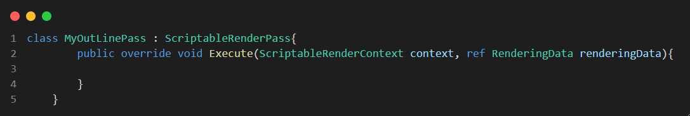 

   当在ScriptableRendererFeature的AddRenderPasses中，把这个Pass加入Render时，这个方法会被调用。AddRenderPasses在这个Feature被开启的情况下，是每帧调用的。也就是说，如果每帧都加入这个Pass到Render中，那么这个Excute方法也是每帧调用的。一般这个方法里写的是整个Feature算法的核心。

   两个参数，第一个是可编程渲染环境，类似一个管理器，可以做一些比较顶层的事情，比如执行定义的cmd等。

   第二个参数是渲染数据，里面有几乎会用到的所有相机、灯光、投影等等方面的数据。

4. 在Execute函数中操控Command Buffer。

   官方的Execute函数如下，我来进行一些解读：

   ```C#
   //两个参数，第一个是可编程渲染环境，类似一个管理器，可以做一些比较顶层的事情，比如执行定义的cmd等。
   //第二个参数是渲染数据，里面有几乎会用到的所有相机、灯光、投影等等方面的数据。
   public override void Execute(ScriptableRenderContext context, ref RenderingData renderingData)
   {
       //定义并申请一块CommandBuffer，这里的名字将用于Frame Debugger内任务的名字
       CommandBuffer cmd = CommandBufferPool.Get(name: "LensFlarePass");
       //向申请的CommandBuffer中加入“绘制网格”命令
       cmd.DrawMesh(_mesh, Matrix4x4.identity, _material);
       //让渲染环境执行这块CommandBuffer
       context.ExecuteCommandBuffer(cmd);
       //释放这块CommandBuffer
       CommandBufferPool.Release(cmd);
   }
   ```

​	


### 编写ScriptableRendererFeature

有以下步骤：

1. **using**

   > using System.Collections;
   >
   > using System.Collections.Generic;
   >
   > using UnityEngine;
   >
   > using UnityEngine.Rendering;
   >
   > using UnityEngine.Rendering.Universal;

2. 必须继承自ScriptableRendererFeature

3. 必须实现以下继承的抽象功能：

   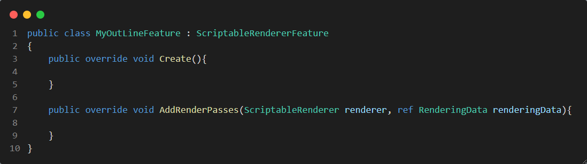 

   Create函数在**首次加载时、启用和禁用渲染器功能时、在检查器更改渲染器功能的属性时**会执行一次。

   当Feature开启时，AddRenderPasses函数每帧每个Camera调用一次。这个函数中，一般做**“把准备好的Pass添加到到渲染器中”**这个工作。它有两个参数，第一个是渲染器，调用渲染器的方法就可以把准备好的Pass塞到渲染器中。第二个是打包好的渲染信息，我们初始化Pass的时候会用到。

4. 完成Creat和AddRenderPasses函数，官方的案例如下：

   ```C#
   //首次加载时、启用和禁用渲染器功能时、在检查器更改渲染器功能的属性时会执行一次
   public override void Create()
   {	
       //新建一个LensFlarePass的实例，传入需要使用的材质和Mesh
       _lensFlarePass = new LensFlarePass(material, mesh);
   }
   //当Feature开启时，AddRenderPasses函数每帧每个Camera调用一次。这个函数中，一般做“把准备好的Pass添加到到渲染器中”这个工作。
   //它有两个参数，第一个是可编程渲染器，调用渲染器的方法就可以把准备好的Pass塞到渲染器中。第二个是打包好的渲染信息，我们初始化Pass的时候可能会用到。
   public override void AddRenderPasses(ScriptableRenderer renderer, ref RenderingData renderingData)
   {
       //如果Pass实例的材质和Mesh不为空
       if (material != null && mesh != null)
       {
           //把Creat中实例化的Pass加入渲染器中
           renderer.EnqueuePass(_lensFlarePass);
       }
   }
   ```

### 使用和配置ScriptableRendererFeature实例

在Render Data资产里添加刚写好的Renderer Feature，然后配置参数即可看到效果。


### 总结

以上是编写ScriptableRenderPass 和编写ScriptableRendererFeature的基本步骤，有这些步骤就足以正常运行一个Renderer Feature。上面摈弃了一些编码常识方面的细节。

编写Renderer Feature的核心在Feature的AddRenderPasses函数和Pass类的Execute函数，这部分十分复杂，需要额外的专项学习。后续我会补齐。

完整的代码看官网的这篇文章：[UnityURP](https://docs.unity3d.com/Packages/com.unity.render-pipelines.universal@12.1/manual/containers/create-custom-renderer-feature-1.html#scriptable-renderer-feature)


### 遇到的问题

#### Shader报错，无法找到一些包

上面也说了，URP的前身是LWRP。如使用了一些比较古早的资料（大概2020年以前的资料？），他们的Shader里，引用的很可能是LWRP的库，这个库在URP中被URP的库取代，所以会报找不到包的错。

> \#include "Packages/com.unity.render-pipelines.**universal**/ShaderLibrary/Core.hlsl"


#### 多Pass是否渲染和渲染顺序的问题

上面URP的缺点中，提到了这一点：

> 不再支持多Pass输出到同一缓冲区。回忆一下Build-in中的描边算法，先渲染模型的扩张后的背面，输出到颜色缓冲区，再渲染模型的正面，输出到颜色缓冲区。这在URP中不再能做到，因为URP同一个Shader中，输出到某一个缓冲区的Pass只能有一个。

可能在早期LWRP中，因为某些更改使得这个描边Shader可以以正常的顺序、并且两个都运行。

我刚拿到这个描边Shader的时候，它并不能正常渲染。通过帧调试器，我发现是因为两个Pass的顺序反了，才导致渲染结果不对。

我查阅了URP的一些资料，发现这是URP的缺陷，对于多PassShader，只能通过Tag的方式间接调整渲染的顺序与执行与否。

关于上面这一点的细则，我记入了笔记：**TA零散积累**中。


#### 使用Renderer Feature后，部分物体不被渲染

呃呃，这个问题是游戏物体的Render Layer Mask导致的。关于Render Laye 和物体Layer的知识，我记录到了**TA零散积累**中。


#### 使用Renderer Feature渲染时，批处理失效

一方面是属性的CBUFFER的问题，另一方面是其他未知问题。

给我整无语了，重新烘培场景光照后就好了。


#### 任务堆栈中，Pass名称不对的问题

最后发现这和comandBuffer有关。

一般来说，在做Renderer Ferture的时候，需要使用comandBuffer，走一遍：

**申请Buffer（在这一步可以指定Buffer名称，也就是对应着Frame Debugger中任务的名字） -》 设定和初始化相机、光照等种种需要的信息  -》加入绘制命令（DrawMesh等命令）-》ScriptableRenderContext执行这块comandBuffer -》释放这块comandBuffer**

这样的流程。

但是在这个小例子中，作者没有使用comandBuffer，而是直接使用ScriptableRenderContext来调用绘制命令，所以导致没有上述流程的第一步，也就没有这块comandBuffer的名字。去哪里指定，我是不知道的，稍微找了一下，也没有找到。

这个问题可以通过把ScriptableRenderContext命令转化成comandBuffer的形式来解决。在接下来的学习中，我要把原作者的这个改成comandBuffer。


## 关于目前接触的cmd的写法

### 前言

就目前我的水平来说，原创cmd几乎不可能。cmd涉及的领域和知识极广，目前我连一个基本的框架都不懂。

但不代表学习就会停止。幸运的是，cmd的写法相对固定，一种渲染方法对应的cmd大同小异，并且易于理解。所以我可以针对各种接触到的渲染方法，记录下它们的cmd的写法，在下次遇到类似的需要的cmd时，它们即会拥有极高的参考价值。

量变积累可能产生质变，就这么先学着吧。

---

### 单Pass渲染全场景

#### 原文

[知乎](https://zhuanlan.zhihu.com/p/396965255)

#### 代码分析

```C#
//两个参数，第一个是可编程渲染环境，类似一个管理器，可以做一些比较顶层的事情，比如执行定义的cmd等。
//第二个参数是渲染数据，里面有几乎会用到的所有相机、灯光、投影等等方面的数据。
public override void Execute(ScriptableRenderContext context, ref RenderingData renderingData)
{
    //此句是生成一个“排序准则”。我们知道对于不透明物体，我们将其按照其离相机由近到远渲染，这样可以避免一些OverDraw；而对于半透明物体，我们必须将其
    //由远到近排序，不然的话无法正确的混合结果。
    //在生成这个Pass时，我们只指定了它的渲染队列。渲染队列和排序准则是强相关的，所以这里代码直接把排序准则和渲染队列绑定了。
    //对于半透明物体，排序准则使用：SortingCriteria.CommonTransparent
    //对于不透明物体，排序准则使用：renderingData.cameraData.defaultOpaqueSortFlags
    //生成排序准则对象，是因为它在drawingSettings的初始化中被需要。
    SortingCriteria sortingCriteria = (m_renderQueueType == RenderQueueType.Transparent)
        ? SortingCriteria.CommonTransparent
        : renderingData.cameraData.defaultOpaqueSortFlags;
    
    
	//生成一个DrawingSettings对象，该对象类似一个数据结构，其中保存一些渲染相关的设置参数。这一步只是生成，还没有投入使用。
    //它有三个参数，第一个是ShaderTag类型，或者ShaderTag类型的列表（没错，是一个重载）。ShaderTag类型可以粗暴地理解为字符串，对应Shader文件中Pass里写	//的那些Tag。这个参数指定一次检查，只有传入的Shader的Pass的Tag在这个列表中时，才会继续执行。
    //第二个参数是RenderingData类型，直接来自于本函数的参数。
    //第三个参数是上一行生成的排序准则。
    var drawingSettings = CreateDrawingSettings(m_ShaderTagIdList, ref renderingData, sortingCriteria);
    
    //指定要用于渲染的材质。这个数据在Feature类中被public指定，然后通过Creat函数初始化Pass时传入。
    drawingSettings.overrideMaterial = overrideMaterial;
    //指定用于渲染的Pass的序号。获取方法同上。
    drawingSettings.overrideMaterialPassIndex = overrideMaterialPassIndex;
    //核心的绘制命令，但是没有直接用cmd，而是用了渲染环境的函数，虽然本质也是cmd
    //需要三个参数，第一个是此相机的剔除结果，来自此函数的参数renderingData
    //第二个参数是我们已经构建完毕的drawingSettings
    //第三个是FilteringSettings类型的变量。它类似于一个数据结构，其中保存一些渲染相关的设置参数。这个参数的生成我将在下面的附加分析中写出。
    context.DrawRenderers(renderingData.cullResults, ref drawingSettings, ref m_FilteringSettings);
}
```

#### 附加分析

##### 关于FilteringSettings类型的变量

这个变量，作者在Pass的初始化函数中生成。

> m_FilteringSettings = new FilteringSettings(renderQueueRange, filterSettings.layerMask, (uint)(filterSettings.renderingLayerMask-1));

第一个参数是RenderQueueRange类型的参数，这个参数在Feature中被public指定，然后在Pass的初始化函数中被传入。这个参数指定的是：**“渲染类型（队列）”**，以下是作者指定该值时的代码：

>  RenderQueueRange renderQueueRange = (filterSettings.renderQueueType == RenderQueueType.Transparent)
>
>  ​        ? RenderQueueRange.transparent
>
>  ​        : RenderQueueRange.opaque;

可以看到这种方式很像枚举，比较容易理解，不多赘述。

第二个参数是LayerMask类型的参数，本质其实是Int类的参数。代表的是游戏物体上的Layer。这个参数和上面一样，在Feature中被public指定，随后在Pass的初始化中被赋值。LayerMask就是指定会受此Pass影响的物体，如果设置LayerMask为default，那么只会有Layer为default的物体会被这个全局的Pass渲染。如果该值被指定为-1，则影响所有Layer 的物体。

第三个参数指定的是Render Layer Mask，它的获取方式同上。关于Render Layer Mask的作用，在TA零散记录中有详细记录，不再赘述。


##### 关于Pass的构造函数

由于初学，我想详细分析一下它的构造函数。

```c#
//构造函数，非常自由，想怎么指定怎么指定
//这里传入profilerTag（分析器标记）我不知道是为什么，而且传入好像没有作用，代码也看不太懂。直接删去没有任何可见的影响
public OutlineRenderPass(string profilerTag ,RenderPassEvent renderPassEvent,FilterSettings filterSettings)
{
    //不知道在做什么，直接删去也无可见影响
    base.profilingSampler = new ProfilingSampler(nameof(OutlineRenderPass));
    m_ProfilerTag = profilerTag;
    m_ProfilingSampler = new ProfilingSampler(profilerTag);
    
    
	//renderPassEvent是继承的一个属性，用来指定这次渲染发生的时机。是一个枚举类型。在Feature通过Public指定，然后传入赋值。
    this.renderPassEvent = renderPassEvent;
    
    
    //m_renderQueueType是一个自定义的新的RenderQueueType类型的参数，用于在Execute中决定排序准则。
    m_renderQueueType = filterSettings.renderQueueType;
    
    
    //这一步转换让我感觉是画蛇添足，其实可以直接在Feature里保存RenderQueueRange变量吧，不用这一步转化。这个变量用于参与FilteringSettings的生成
    RenderQueueRange renderQueueRange = (filterSettings.renderQueueType == RenderQueueType.Transparent)
        ? RenderQueueRange.transparent
        : RenderQueueRange.opaque;
    
    //生成FilteringSettings，用于作为Execute中绘制命令的部分设置
    m_FilteringSettings = new FilteringSettings(renderQueueRange, filterSettings.layerMask, 
                                                (uint)(filterSettings.renderingLayerMask-1));
    
    
	//看着像一个什么渲染类型Mask，目前没摸透。直接删去无可见影响。
    m_RenderStateBlock = new RenderStateBlock(RenderStateMask.Nothing);
}
```


---


### 使用DrawMesh命令绘制单个网格

#### 原文

[Unity](https://docs.unity3d.com/Packages/com.unity.render-pipelines.universal@12.1/manual/containers/create-custom-renderer-feature-1.html)

#### 代码分析

这段代码的作用是，找到场景中所有的光源，然后在光源处绘制一个Mesh，并使mesh永远朝向摄像机。这样的思路常用来做镜头光晕。

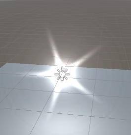 

```c#
public override void Execute(ScriptableRenderContext context, ref RenderingData renderingData)
{
    //申请CommandBuffer
    CommandBuffer cmd = CommandBufferPool.Get(name: "Test");
    //从参数的渲染信息数据结构中获取主相机
    Camera camera = renderingData.cameraData.camera;
    //设置观察矩阵和投影矩阵，这一点在补充说明中细说
    cmd.SetViewProjectionMatrices(Matrix4x4.identity, Matrix4x4.identity);
    //设置生成这个Mesh会用到的Scale。为什么Y要是相机的缩放，这一点在附加分析中说明。
    Vector3 scale = new Vector3(1, camera.aspect, 1);

    // 对于每一个可见光
    foreach (VisibleLight visibleLight in renderingData.lightData.visibleLights)
    {
        //获取它的Light组件
        Light light = visibleLight.light;
        //计算绘制Mesh的Transform中，position（NDC）的值是多少。关于这一点，在附加说明中补充。
        Vector3 position = camera.WorldToViewportPoint(light.transform.position) * 2 - Vector3.one;
        //修改位置的z值，使所有炫光都处于同一个平面
        position.z = 0;
        // 核心，创建DrawMesh指令。解释一下这里的参数：
        //第一个参数是本次需要绘制的Mesh，从这个Pass类的构造函数中被传入。
        //第二个参数是Transform矩阵，这里通过之前准备好的position和scale作为参数，同时以不旋转、这三个参数构建。
        //第三个参数是渲染使用的材质，传入同上。
        //第四个是子网格ID。如果只想渲染Mesh之下的某个Mesh，使用子网格ID。
        //第五个是PassID，指定用材质的Shader的哪一个Pass来渲染。
        cmd.DrawMesh(_mesh, Matrix4x4.TRS(position, Quaternion.identity, scale),
                     _material, 0, 0);
    }
    
    //执行cmd并释放cmd
    context.ExecuteCommandBuffer(cmd);
    CommandBufferPool.Release(cmd);
}
```

#### 附加分析

##### 关于对于（M）VP矩阵的指定

我们知道，顶点着色器中，很重要的职责就是把顶点的坐标从模型空间下转换到齐次裁剪空间下。我们自己写Shader的时候，这一步是直接交给Unity函数的，我们也可以直接通过宏获取MVP矩阵。

然而，这个Renderer Feature的最终目的是在灯光位置，渲染一个始终朝向相机的、不随着投影VOF拉伸的mesh，这如果还用普通的MVP矩阵，是很难做到的。所以可以干脆不做观察变换和投影变换了，直接把这两个矩阵变成单位矩阵。

>  cmd.SetViewProjectionMatrices(Matrix4x4.identity, Matrix4x4.identity);

原来默认的MVP矩阵应该还是会自动计算，这一步只是为了特殊处理覆盖了原来的MVP矩阵。

##### 关于构建Transform矩阵时，Scale参数为什么Y值是camera.aspect

首先要知道这个参数是什么：

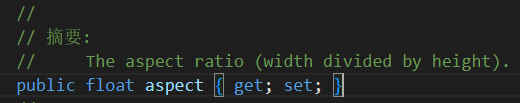 

其实就是一个数值，记录的是屏幕的宽高比，如果是最常见的16：9屏幕，这个值就是16/9。

为什么Scale的数值要是宽高比？以下是我的猜测：

很有可能是这里作者在上一步强硬地把VP矩阵都变成单位矩阵了，这导致P矩阵本来应该把坐标压缩到正方形的，但是它没有。于是乎正常的到了屏幕映射这一步，这一步本来正常是会恢复拉伸的，但是你这个渲染本来没拉伸，现在做一步恢复拉伸，就会反而导致渲染的结果被拉伸。于是作者在物体实例化时在Scale上做了点小操作，用简单的方法抵消了这种拉伸。

##### 关于构建Transform矩阵时，position参数如何计算

> Vector3 position = camera.WorldToViewportPoint(light.transform.position) * 2 - Vector3.one;

这个计算很明显是屏幕空间坐标转换到NDC空间的计算，详情看这篇文章：[CSDN](https://blog.csdn.net/weixin_43879652/article/details/118270723)

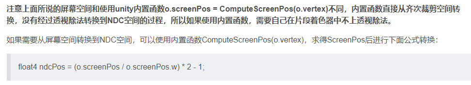 

说实话，Matrix4x4.TRS（）这个函数的摘要写的真的畜生，也不说要什么空间下的坐标。

在这一步，我们计算的是NDC空间下的坐标。然后这个NDC空间下坐标，直接作为参数参与TRS矩阵的构建。

##### 多说一句

这种做法让我感觉华而不实，反正都是用CPU做前期计算，为什么不直接用写好的函数、或者用Mono控制呢？这些底层的绘制、数学知识，庞大而固定，学习起来非常吃力的……我觉得除非万不得已，还是不要在cmd直接用DrawMesh画东西吧……

---


### 绘制指定Renderer

#### 原文

[知乎](https://zhuanlan.zhihu.com/p/400977346)

#### 代码分析

这个Renderer Feature的功能是

```c#
public override void Execute(ScriptableRenderContext context, ref RenderingData renderingData)
{
	//*m_setting是作者自己写的一个数据结果，包括了几乎所有需要指定和获取的信息
    //如果没有RendererPrefab，或者游戏没开始，那就不用画咯
    if(!m_setting.RendererPrefab || !Application.isPlaying) return;
    
    //申请一块cmd，并命名
    CommandBuffer cmd = CommandBufferPool.Get();
    cmd.name = "SurfaceOutline";
    
    //先说一下这个RendererInstance是什么。首先作者在Feature里public了一个Render的组件，把指定好了用什么材质、用什么Mesh的Render做好后，存成预制体，	   //再拖入Feature中即可。在外界要获取RendererInstance的时候，会基于这个预制体新做一个Render的实例。
    //Render类作为mono的派生类，自然有transform属性。但是直接新建Render对象，它的transform肯定是没有被赋予具体数值的，所以下面这几步都是在指定这个       //Render的Transform信息。
    var trans = m_setting.RendererInstance.transform;
    //这里是直接从作者的数据结构中获取信息，付给这个新Render实例
    trans.position = m_setting.Position;
    trans.rotation = m_setting.Rotation;
    m_setting.RendererInstance.size = new Vector2(m_setting.Size.x,m_setting.Size.z);
    
    //因为Render组件里其实已经有了很多详尽的信息，所以这里的Draw命令需要指定的还算比较少的。
    //第一个参数传入这个Renderer实例，第二个传入需要使用的材质。
    cmd.DrawRenderer(m_setting.RendererInstance , m_setting.RendererInstance.sharedMaterial);
    
	//命令环境执行cmd，完成后释放cmd。
    context.ExecuteCommandBuffer(cmd);
    CommandBufferPool.Release(cmd);
}
```

#### 如何评价

这种方法也让我感觉有点脱裤放屁。我其实大可以利用物体的父子层级、物体的开关来实现这个功能，性能也不见得会差。

或许我应该看长远一点。这个例子的效果，效果和本物体较为分散，设想如果是类似描边这样的效果，如果想要做到在指定时间让指定物体多出描边，只能在物体的Shader中加描边Pass，而且不能批处理，是很低效的。但是有了这种控制Renderer的方法，就可以在不多出物体、不修改原材质、并且可以批处理的情况下实现效果。

---


