# 关于光照模型

早期学习笔记，转载自早期Excel。

存在大量格式错误、可读性非常低，建议等待作者修复后阅读、或者作为查找性材料使用。

| 中文名                             | 英文名/缩写            | 说明                                                         | 长什么样                                                     | 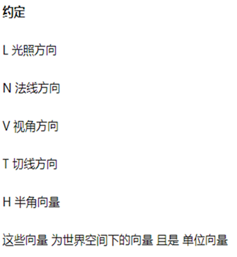 |
| ---------------------------------- | ---------------------- | ------------------------------------------------------------ | ------------------------------------------------------------ | -------------------------------- |
| 兰伯特光照模型                     | Lambert  Lighting      | 1.兰伯特反射(Lambert)是最常见的一种漫反射，经验模型     2.强度仅由L和N的乘积决定，也就是入射光方向和面法线的夹角，如果这个夹角越大、反射越弱，反之越强，现实生活中也是这个道理，很容易理解。     3.代码：FinalColor=saturate(dot(N,L));     *：saturate(x);//如果x取值小于0，则返回值为0。如果x取值大于1，则返回值为1。若x在0到1之间，则直接返回x的值。 | 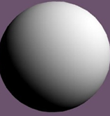                             |                                  |
| 半兰伯特光照模型                   | Half-Lambert  Lighting | 1.Half-Lamber是Valve公司提出来的算法，其为了解决Lambert在背面太暗的问题。经验模型。     2.为什么兰伯特在背面会太暗？因为使用了saturate函数，在背面乘值小于0，取0，也就是漫反射强度为0，所以会暗。     3.FinalColor = pow(dot(N,L)*0.5+0.5,2);      4.解析一下公式，先看pow内部，就是把N和L的点乘得到的值从-1~1映射到0~1。这样可能会造成原先亮的地方不那么亮了，暗的地方又显得太亮了，也就是对比度变低了，于是再做个2次方，把暗的地方压一下，亮的地方虽然也是压的（因为都是小于1的值），但是没有暗的值压的厉害，相当于整体变暗一点，但是对比度更高。 | 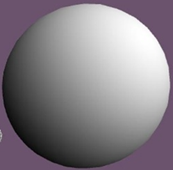                             |                                  |
| Phong光照模型                      | Phong                  | 1.Phong模型用来模拟高光效果。     2.     //Phong     float3 R = reflect(-L,N);     // float3 R = normalize( -L + 2* N*  dot(N,L) );     float VR = saturate(dot(V,R));     float NL = saturate(dot(N,L));     float4 Specular = pow(VR,_SpecularPowerValue)*_SpecularScaleValue;     float4 Diffuse = NL;     FinalColor = Specular + Diffuse;     3.看一下公式，主要是计算高光Specular的部分，它受到视角和反射光线方向的影响，视角和反射光线夹角越小，高光就越强。     4.reflect(-L,N);函数用来计算入射光线以法线为N的表面反射后的出射光线。 | 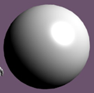                             |                                  |
| Blin-Phong光照模型                 | Blin-Phong  Lighting   | 1.也是用来模拟高光的经验模型。     2.     //Blin-Phong     float3 H = normalize(V+L);     float NH = saturate(dot(N,H));     float NL = saturate(dot(N,L));     float4 Specular = pow(NH,_SpecularPowerValue)*_SpecularScaleValue;     float4 Diffuse = NL;     FinalColor = Specular + Diffuse;      3.H是半程向量，也叫半角向量，是视角方向和入射光方向的中线，Blin-Phong的高光强度由半程向量和面法线的夹角决定，夹角越小，高光越强。     4.和Phong对比，不用计算反射光线方向，性能较好。和Phong相比，高光会大一些、圆滑一些。 | 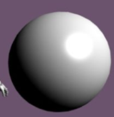                             |                                  |
| 环绕光照/包裹光照                  | Wrap  Lighting         | 1.可以处理物体明暗交界处的颜色     2.     float NL = dot(N,L);     float NH = dot(N,H);     float NLWrap = (NL + _Wrap)/(1 + _Wrap);     //add color tint at transition from light to dark     //在从明到暗的转换中添加颜色色调     float scatter = smoothstep(0,_ScatterWidth,NLWrap) *  smoothstep(_ScatterWidth*2,_ScatterWidth,NLWrap);     float specular = pow(saturate(NH),_Shininess);     float3 diffuse = max(NLWrap,0) + scatter* _ScatterColor;     FinalColor.rgb = diffuse + specular;     3.NLWrap有点像之前的半兰伯特，把diffuse映射到不那么暗的地方，这里的scatter用来计算“边缘程度”，值越大、也代表越接近明暗交界处。     *：smoothstep(a, b, x); // x<a<b 或 x>a>b 返回0 ,x<b< a 或  x>b>a 返回1     smoothstep与lerp类似，返回 0 和 1 之间平滑的 Hermite 插值。     *：lerp(a,b,w); //(a,b,w)当w为0时返回a,为1时返回b,当w在0-1之间时，比重w将ab进行线性插值， | 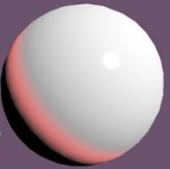                             |                                  |
| 高洛德着色                         | Gouraud  Lighting      | 1.简单来说Gouraud就是在VertexShader而不是在FragmentShader中计算光照的Phong模型。在顶点中计算光照后，再在Fragment中插值。     2.节省性能，但是效果很差。高光和漫反射计算棱角分明，面对较圆滑的模型表现尤其差。 | 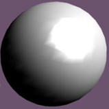                             |                                  |
| 带状照明/分段着色                  | Banded  Lighting       | 1.就是把漫反射分段，之前说的漫反射是平滑过度的，现在把它们隐射到不同的级数里，像条形统计图那样。可以用作卡通渲染。     2.     //Banded Lighting     float NL = (dot(N,L))*0.5+0.5;     // float _BandedStep = 6;     float BandedNL = floor(NL*_BandedStep)/_BandedStep;     float4 C1 = lerp(_ColorA,_ColorB,BandedNL);     float4 C2 = lerp(_ColorB,_ColorC,BandedNL);     float4 Diffuse = lerp(C1,C2,BandedNL);     // float4 Diffuse = smoothstep(_ColorA,_ColorB,BandedNL);     FinalColor = Diffuse;     3.这里先用NL记录了半兰伯特计算出来的值，再把它映射到BandedNL里。此案例给了三个用来分段的颜色，先用BandedNL插值出AB间，再插BC间，再插这两个结果之间。如果只是两个颜色间分段，只需要一次插值。     *：floor（a）//向下取整 | 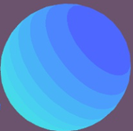                             |                                  |
| 月光模型                           | Minnaert  Lighting     | 1.Minnaert光照主要是用来模拟月球光照的，其特点是：光照不到的地方一定是全黑的、面法线与视线的夹角越大、看上去也越暗。     2.     //Minnaert Lighting     float NL = saturate(dot(N,L));     float NV = saturate(dot(N,V));     // float _Roughness = 0.5;     float4 Minnaert = saturate(pow(NL*NV,_Roughness)*NV);     FinalColor = Minnaert;     //公式：Minnaert = (((N.*L)(N.*V))^(_Rough)) * (N.*V) | 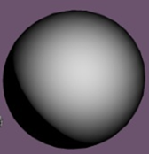                             |                                  |
| 粗糙度光照（自己起的）             | Oren-Nayar  Lighting   | 1.此模型用来描述光在粗糙表面的反射情况，相比于Lambert模型，它考虑了  粗糙度参数，常用来模拟比较粗糙的表面。     2.     //Oren-Nayer     //粗糙度参数由噪声图采样获得     float roughness = tex2D(_RoughnessTex,i.uv).r *_Roughness;     float NL = saturate(dot(N,L));     float NV = saturate(dot(N,V));     float theta2 = roughness*roughness;     //A + B约等于1.右边有函数图上A下B     float A = 1 - 0.5*(theta2/(theta2 +0.33));     float B = 0.45 *(theta2/(theta2+0.09));     //反余弦得夹角     float acosNV = acos(NV);     float acosNL = acos(NL);     //alpha是法线与视线的夹角、法线与光照方向的夹角之间更大的那一个     float alpha = max(acosNV,acosNL);     //beta是法线与视线的夹角、法线与光照方向的夹角之间更小的那一个     float beta =   min(acosNV,acosNL);     //V - N*NV 是个综合了N、V二者夹角经过复杂变换后得到的值，目前无法理解     float gamma = length(V - N*NV) * length(L - N*NL);     float Diffuse = 1;     //最终综合以下影响：环境光、漫反射、粗糙度的复杂计算     float OrenNayer = Diffuse * NL *(A+  B*max(0,gamma)*sin(alpha)*tan(beta));     FinalColor = OrenNayer;     //最终效果是：粗糙度越大、约暗，反射的光越弱，但和视角也有一定关系。 | 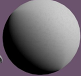         这是加了粗糙度贴图的效果 | 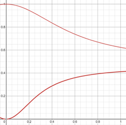 |
| 背光/次表面散射（方法之一）（SSS） | BackLight              | 1.真实的光照几乎都包含反射、透射和次表面散射这三种，前两种以前就了解过，次表面散射的定义是：入射光和出射光在表面的同一侧，但入射点和反射点并不在同一个点。因为光线会打入表面内部，在与内部的原子碰撞若干次后反射出来。像玉石等物件，在背光时、边缘或者薄处比较亮，这种效果就可以用此表面散射来模拟。     2.     //WrapLight计算漫反射     float WrapLight = pow(dot(N,L)*_WrapValue+(1-_WrapValue),2);     //Blin-Phong计算高光     float3 R = reflect(-L,N);     float3 H = normalize(V+L);     float VR = saturate(dot(V,R));     float NH = saturate(dot(N,H));     float NL = saturate(dot(N,L));     float4 Specular = pow(NH,_SpecularPowerValue)*_SpecularScaleValue;     float4 Diffuse = WrapLight;      //模拟透射现象      float _SSSValue =0.6;     //当SSSValue = 0，这个Shift就是光照方向的反方向，这里计算的是片元法线的偏移值     //这里的思想是用一个变量储存模拟的片元法线变换后的方向，再拿这个方向去计算      float3 N_Shift =  -normalize(N*_SSSValue+L);//沿着光线方向上偏移法线，最后在取反     //这里是再用视线方向与偏移后的模拟法线方向计算一次背光强度，视线方向越接近模拟后偏移方向，背光强度越强      float BackLight =  saturate(pow(saturate( dot(N_Shift,V)) ,_PowerValue)*_ScaleValue);      FinalColor =Diffuse + Specular +  BackLight;     *：简单的来说，就是多计算一个背光项，其亮度由NV来计算，但是这个N是处理过的V，是法线往入射光方向偏移一定程度后再取反的法线。     3.对于光照能直接照到的地方，背光应该是不起效的，因为把法线偏向光源后，它与视角的夹角一般会变大，大于90度后值就会小于0了。     4.如果是光照的背面，则是面法线方向与光照方向越接近，背光越亮。 | 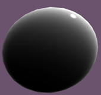         这里是背面          |                                  |
| 各向异性光照模型                   | Anisotropic  Lighting  | 1.用来模拟光照下的头发、带状的高光，在各个方向表现不一致的材质。     2.     //shift值通过对纹理采样获得，为了使头发高光有上下偏移     float shift = tex2D(_StretchedNoiseTex,i.uv*4).r + _ShiftTangent;     //用一个变量储存向法线偏移一定值后的切线，偏移多少由shift决定     float3 T_Shift = normalize( T+ N*shift);     //半程向量     float3 H = normalize(V+L);     //把偏移后切线当成原先Phong模型的面法线，用来和半程向量计算高光的强度     float dotTH = dot(T_Shift,H);     //定义高光段数     float NumberOfStrip =1;     //通过拉伸一下Cos的X轴模拟多段高光     float cosTH =cos(dot(T_Shift,H)*NumberOfStrip );     //高光强度映射到0~1     float dirAtten = smoothstep(-1,0,dotTH);     //计算高光，dirAtten是仅由物体决定的总体的高光强度，与原先基本没有区别，cosTH段是通过采样值做多段处理     float Specular = dirAtten *  pow(cosTH,_AnisotropicPowerValue)*_AnisotropicPowerScale;          float WrapLight = dot(N,L)*0.5+0.5;     float Diffuse = WrapLight;     FinalColor = Diffuse*float4(0.7,0.2,0.4,0) +Specular;          return FinalColor;          *：简单的来说，做法就是在计算高光的时候，把原先的法线用“向法线偏移一定程度后的切线”代替。一想、确实，这样原先是高光的地方就因为偏移变得不是高光了，而总有一圈其他地方的会因为切线偏移后刚好和半程向量比较近，就会出现高光。 | 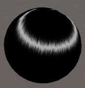         这里是加了贴图的效果 |                                  |
|                                    |                        | *：上面加灰了的这种说法是片面的，我自己复刻的时候遇到了很大的问题。首先、上面的T_Shift的确是向法线偏移后的切线，但是这不会导致带状高光，而是会导致高光位置偏移、形状扭曲！对于次表面散射的物体，的确需要高光偏移位置合扭曲。真正导致带状高光产生的，是CosTH那一项。想象一下，原来整个表面的高光强度被映射到0~1，此时在cosTH计算的时候，先把高光强度乘以一个指定值，也就是把高光强度映射到0~若干，此时超过3.14的部分变成小于0，导致高光强度变为小于0，也就表现为非高光。总之带状高光的根本在于Cos函数映射，而高光的扭曲和位移才取决于向法线偏移的切线。     *：SmoothStep项作者应该也写错了，应该clamp 0~1 而不是 -1~0，我试了，clamp -1 ~ 0将导致全面变白。 |                                                              |                                  |