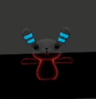
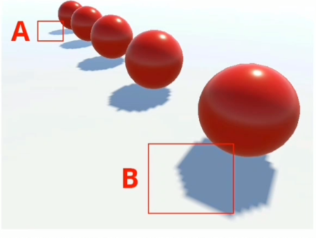

# 百人计划学习笔记

# Excel部分

| 问题                                                         | 解答                                                         |
| ------------------------------------------------------------ | ------------------------------------------------------------ |
| 为什么GPU渲染快                                              | 如下图，因为GPU并行度高，对于同一个渲染目标，它的各个顶点、片元的渲染方程应该是一样的，只是一些人为指定的参数不同，所以GPU可以同时处理非常多数量的顶点、片元。 |
|                                                              |                              |
| 应用阶段补充                                                 | 入门精要中说过应用阶段，但是不够详细。在应用阶段中，除了之前提到的、还会做一些加速算法和粗粒度剔除。对于一些光源，在应用阶段会判断它是否在视锥体内、是否离相机非常远等，以此剔除一些不必要渲染的光源。还会判断物体层级的遮挡，对于一些完全被遮挡的物体，也会被剔除不参与下一步的渲染。在裁剪物体中使用了一些之前GAMES101光线追踪中学到的加速结构，比如八叉树、K-D树、BVH包围盒层次结构，这些加速结构在光线追踪中是用来算光线和物体的交点的，我并不明白在粗粒度剔除中这些加速结构要如何使用。 |
| 理解渲染流水线中坐标轴变换                                   | 如下图，本质上就是把渲染点自己的坐标放到一个又一个更高层的坐标系下，方便计算 |
|                                                              |                              |
| 常用的/包装模式/纹理寻址模式/Wrapping Mode/Texture Addressing Mode | 入门精要里学过，对于噪声之类的纹理，其采样的uv可能大于1，超过1的部分如何决定值就需要包装模式来决定。 |
|                                                              |                              |
| MipMap、各向异性过滤存在的问题和补充                         | 入门精要和101笔记中都有，但是没提缺点。MipMap的话只能对正方形区域采样、而各向异性过滤能对矩形区域采样，但是有时需要的采样范围并不是横平竖直的矩形，这两种技术就会导致参考了太多像素的意见而导致过度模糊。      而对于各向异性过滤，在101中说的是占用硬盘空间变为3倍，但是在引擎实测其实跟MipMap一样，还是只大了1/3，这是因为引擎认为3倍的空间开销不可取，于是在MipMap的基础上改进来做到各向异性过滤（RipMap）的效果，并且这样的模拟可以应付倾斜的采样范围。做法大概是多次采样，比较复杂，时间开销会比较大。 |
| 使用图集（纹理集）优化渲染                                   | 如下图，小图拼大图出来的就是纹理图集，这样做可以减少GPU读取纹理的次数，减少GPU更换纹理的次数，从而加速渲染。不过采样的时候大概需要特殊处理。我不知道Unity自带的分割能不能在渲染中也把纹理图集区分开，下次可以试一试。 |
|                                                              |                              |
| 常用函数（不太记得的）                                       | round(  x ); 返回四舍五入的整数     sqrt( x );返回平方根     degrees( x ); 返回角度值     redians( x ); 返回弧度值     noise( x ); 返回非0即1的噪声（存疑，有的地方返回的是-1~1的随机数）     pow( x, y );返回x的y次幂     exp( x ); 返回e为底的x次幂，即e^x (此处e为自然常数)     log( x );返回e为底的对数     log2( x );返回2为底的对数     log10( x );返回10为底的对数     asin( x ); 返回x的反正弦值，其他两种一样，前面加个a，代表arc     ceil( x ); 返回x向上取整的结果     floor( x ); 返回x向下取整的结果     step( x, y ); 如果y >= x则返回1，否则返回0     saturate( x ); 如果x在0~1之间返回x，否则小于0返回0，大于1返回1.这种做法叫做钳制     clamp( x, min, max);  saturate只能钳制在0~1.而clamp是自己指定钳制范围的saturate。小于最小则取min、大于最大则取max，中间则取x     frac( x ); 返回小数部分     modf( x, out ip); 把x分成小数和整数部分，函数返回小数部分，ip返回整数部分     lerp(a,b,x);  a和b分别是x为0和1时，函数的返回值。这里纠正一个误解，原本我认为x需要在0~1之间，但其实x在实数域上都有值，通过0和1确定的两个点的连线即是这个函数的全貌，可以说lerp函数就是定义一个线性函数     smoothstep( min, max, x); Lerp的平滑版 |
|                                                              | all(  x ); 判断输入的每一维的量是否都不为0，是则返回true，否则返回false     clip( x ); 如果输入小于0则丢弃这个片元。常用于透明度测试和模板测试     sign( x ); x < 0 返回-1， x > 0 返回1     length( v ); 返回向量维数     distance( a, b ); 返回位置为a、b的二点的距离。也可以说是两个向量各维度的根号下的差的平方和     cross( a, b); 叉乘二输入向量     determinant( m ); 计算矩阵的行列式的值     transpose( m ); 返回转置矩阵 |
| 为什么法线贴图记录的是切线空间下的扰动值？                   | 因为有很多好处：     1.相对自由。如果记录的是模型空间下的扰动值，当换了模型，就会导致法线贴图的效果出现差异，这样就只能针对模型来设计发现贴图了。      2.可以使用uv动画。也就是说可以动态地移动、缩放和旋转法线纹理，而储存在其他空间下就会出错，因为它们处于其他坐标系下，若其他的坐标系发生了变化，则本应需要新的重新计算的法线贴图，但是你没有，你只有事先准备好的那一张，所以会出错。     3.便于压缩。在Unity中会把法线贴图转换为DXRT5nm格式，只有GA两个通道，分别对应x、y方向的偏移，z方向由于处于切线空间下，必然为正值，故可以用特殊的pack算法用xy算出z，这样便可以省掉一个通道的储存开销。正因如此，之前在学法线贴图的时候，需要一些Unpack函数。在移动平台不会这么做，而是直接读RGB作为三轴的扰动。 |
| 视差映射                                                     | 利用的是高度图。高度图往往需要曲面细分、或者重新计算法线，比较消耗性能，所以不直接用高度图来拔高顶点的海拔。     视差映射可以和法线贴图一起用模拟更逼真的凹凸效果。只用法线贴图无法模拟凸出细节遮挡下凹细节的效果。      原理是偏移反照率和法线贴图等采样用的uv。如下图。黄点是渲染点，此处深度大，则延长视线到与深度组成直角三角形，此时视线的终点代表偏移后的uv值。这就能导致深的地方不那么容易被看见，因为深代表偏移量大。偏移的方向又与观察方向有关，所以是非常正确的。     但是也有缺陷，下图中，本应采到B处，但实际采到的是b处。 |
|                                                              |                              |
| 陡峭视差映射                                                 | 对视差映射的优化。在视差映射中直接把采样点移到原采样点深度组成的直角三角形中，偏移量往往过大。于是有了陡峭视差映射，类似SSR的步进检测，这里的演示是均等步进检测，对渲染点A采样后，发现深度大于0，则进入下一档，对B采样，发现深度大于0.25、则再下一档，对C采样，发现大于0.75，则再下一档，对D采样，发现深度小于1，于是最终决定偏移到D点。 |
|                                                              |                              |
| 浮雕映射                                                     | 还是对视差映射的优化。即使是陡峭视差映射，精度也可能是不够的，于是有了浮雕映射。浮雕映射可以做到更大的深度和自遮挡阴影。      原理很简单，在陡峭视差映射的基础上，找到视线碰撞的区间，上例是DC，然后再在DC间二分查找，迭代用户指定次数，即可得到一个相对精确的偏移量。      为什么不直接从0~1二分查找？是因为，如果视线比较平，初步计算的偏移是会很大的，那么偏移的0~1之间很可能还有别的凸起，会挡住视线。为了减小这种误差，所以先步进再二分查找。（这样肯定还可能出现这个问题，但是可以解决一部分） |
| 视差闭塞映射                                                 | 还是对视差映射的优化。浮雕映射需要做二分查找，相对开销较大。于是视差闭塞映射在陡峭视差映射的基础上，根据碰撞区间、上例的DC，DC都对应一个偏移量，在这两个偏移量间插值来作为最终的偏移量。用什么作为插值的参考值呢？用采样得到的深度。在陡峭视差映射中，停止级别为采样深度小于步进后深度的地方，如下图，停止在3.于是分别采样3和上一级、也就是2的深度，把它们和采样得到的深度的距离提取出来，然后把这两个距离加起来，2的占比就是插值的参考值。 |
|                                                              |                              |
| 伽马矫正                                                     | 1.是什么？是对图像各通道做一个2.2次方（一般是2.2次方）的计算的过程。      2.为什么要？之所以叫矫正，当然是因为有偏移。哪里来的偏移？是人为加的。为什么加？加了什么？加了一个类似log2.2的计算，因为这样可以把更多的空间用来储存暗部的信息，达到节省储存空间和带宽的目的。      3.怎么做？首先，拍摄得到或者说输入的信号是线性的，为了优化在储存时一般会做伽马编码（光转电传递函数OETF），把图像存到非线性的空间下。此时图像本应偏亮，为了再把信号变回线性空间下正确地显示，再做一遍伽马矫正，也就是做2.2次方计算（电转光传递函数EOTF），即可变换回线性空间。 |
|                                                              |                              |
| 在渲染时应使用线性空间                                       | 上面说了伽马矫正，也就是说信号在储存时是非线性的，但是计算的时候，如果不在线性空间下处理颜色，会出现一些问题。比如在渲染亮度叠加时，会导致过曝，因为原来亮的地方被拉高了。在渲染颜色的叠加时，也会导致奇怪的黑边。目前还没意识到类似的问题……需要更多实践，总之尽量使用线性空间计算。如果出现了颜色明亮异常，多从伽马矫正出发想想问题吧。 |
| HDR和LDR                                                     | 即亮度的高动态范围和低动态范围。动态范围指的是画面的最高亮度/最低亮度。自然界的画面是高动态范围，蜡烛的亮度和太阳的亮度能差成千上万倍，而显示器的亮度是低动态范围，只能显示很局限一块的亮度变化。低动态范围被视为亮度从0~1，而如果能表现超过0~1的颜色，称为高动态范围。低动态范围之所以能表现的少，本质是储存时的精度问题，所以高动态范围的图像一般占用更大的空间。显示器只能显示0~1的亮度，所以需要ToneMapping色调映射，把超过1和小于0的亮度都隐射到0~1.目前有很多现成的曲线用于这个映射。这样就能用0~1的范围表现HDR的图像了。这势必会导致细节的损失，但是值得。HDR通常也与Bloom结合达到更好的效果。 |
|                                                              |                              |
| FlowMap/流动贴图                                             | 1.就是一张记录了2D向量信息的纹理，通过RG通道分别记录uv的偏移量。      2.如何使用？对反照率、法线采样的uv进行偏移，偏移多少通过用原uv对flowMap采样加上对时间的影响获得。单纯这样采样会出现问题，因为反照率很可能不能平滑无缝连接，就会导致周期间出现明显的断裂，为了解决这个问题，需要在Sin  Time函数中，用相差半个相位的x分别对uv偏移两次，然后通过线性插值决定最终的偏移值，这样就能使uv无限无缝循环下去，如下函数图。     3.如何制作FlowMap？在Houdini中对FlowMap  的制作有非常好的支持，建议自己上手尝试，可以做到很多非常厉害的效果、比如通过曲线决定大体流向、通过其他体素判断碰撞、地形和障碍物对流向的影响等。（使用FlowMap作为关键词就能找到大部分制作FlowMap需要的节点） |
|                                                              |                              |
| 模板测试/stencil test                                        | 就是蒙版。有一块额外的屏幕缓冲区，每个像素记录一个8位的值，也就是0~255的。初始里面都是0，在Shader中可以修改和读取里面的值。通过读取，就可以把Shader中你算出来、或者指定好的值和缓冲区中读到的值进行比较，根据比较的结果来决定要不要保留这个片元。      若要作为蒙版使用，基本的思路就是放置一个平面，先渲染这个平面，不要颜色，只开启模板值写入，然后渲染需要遮的物体，在渲染的模板测试中，根据自身参考值和模板值缓冲区中读到的值的比较结果决定要不要这个片元。     模板测试在透明度测试和深度测试之间。 |
| 深度测试/Z test                                              | 和模板测的原理基本是一样的，只不过深度测试里的写值比较智能，它会把渲染了的物体的深度写进去（如果这个物体是目前最浅的的话）。      深度缓冲的值从无到有如下图。直到观察空间（也就是摄像机在原点的那个空间）时，顶点的位置都还是线性三维值，，存在顶点的z分量中。而到投影变换时，顶点位置的z就没意义了，顶点的深度被存到了深度缓冲中，但不是直接保存，而是非线性地保存到0~1之间。因为其实人们更希望近的地方好好地分辨远近遮挡，避免在近地地方出现三角形相互穿插的问题（深度值精度不够就会导致这个问题，之前阴影在地面起自遮挡也是类似的问题），变成非线性的保存后，近处会得到更多的空间用以保存深度，而远处会很少。这种解决方法在伽马矫正中也用了，用更多空间、更高精度保存人眼敏感的暗部信息。 |
|                                                              |                              |
| 渲染队列                                                     | 为了尽量避免overDraw问题、为了模板测试的正确性等，合理控制渲染顺序是很有必要的。具体的如下图。并不是一个数字只能渲染一个物体，很多物体都能以同一个数字如2000来渲染，为了控制顺序，你可以写下“  Geometry + 1”这样的描述，表示在其他不透明物体渲染结束后再渲染，但是在透明物体之前。     Unity中的Geometry层级中，会先把物体从近到远排序，放到2000里面，然后再渲染，这样可以避免一些OverDraw问题。 |
|                                                              |                              |
| Early-Z                                                      | 先在片元着色器中把颜色这么复杂的东西算掉了，然后又简简单单地用Ztest把它扔掉，不觉得很浪费吗？是的。所以有了Early-Z技术，这是现代GPU的技术，不需要开发者调整什么。而在如今的Shader中仍然使用Z-Test，是为了检查，也就是做两次。（后续有了补充，移步百人计划笔记Part2） |
|                                                              |                              |
| X-Ray效果的实现思路                                          | 如下图，想要仅被遮挡部分显示描边效果的话，可以利用深度测试。首先渲染遮挡物，然后渲染物体使用两个Pass，第一个Pass渲染X-Ray，关闭深度写入，深度测试的通过条件设置为大于，也就是说当渲染点比缓冲区还深的话，才通过深度测试，这样就仅被遮挡部分会渲染出来。第二个Pass正常渲染物体就行。 |
|                                                              |                              |
| 多PassShader的渲染队列问题                                   | Unity会自动地把多PassShader的渲染队列进行调整，取最早渲染的而舍弃其他的。比如上一条那个效果，渲染的X-Ray效果被安排在半透明物体队列，物体被安排在Geo队列，最后渲染时则没有考虑X-Ray的 |
| 曲面细分着色器/Tessellation Shader                           | 早在入门精要里就提过，曲面细分着色器是顶点着色器之后的哪那一个，顾名思义，就是把面细分的着色器。可以用来细分面、可以和一些其他的技术结合，比如置换贴图。置换贴图由于需要移动顶点位置，若原表面精度不够就会导致锐利边缘，这不是想要的，所以可以和曲面细分着色器结合，足够多的顶点就能满足置换贴图了。     曲面细分着色器并不像顶点着色一样一个编译命令就能搞定，曲面细分着色器下分：Hull  Shader（细分控制着色器，可编程，用于设置细分的各种参数）、Tessellation Primitive Generator（根据上一步的设置细分操作、不可编程）、Domain  Shader（细分计算着色器、对细分后的点处理，从重心空间转换到屏幕空间）.     曲面细分着色器的输入是Patch、为多个顶点的集合，内含所有顶点共享的属性。输出为细分后的顶点。     Hull  中可以控制的参数很多，它是和Vert等着色器平行的存在，需要pragma指令、domain同理。这些参数和做法难以理解和记忆，我建议投入实战再来补全这块内容。 |
| 几何着色器/Geometry Shader                                   | 在入门精要提过，处于曲面细分着色器之后、屏幕映射之前。几何着色器有点像程序化建模，你给定要添加的顶点和顶点的位置等信息，然后在几何着色器中就会真的添加。这非常适合用来做草地、雪地等等。     几何着色器的输入是曲面细分着色器来的图元，也就是点线面等。输出也是图元，只不过加上了人在几何着色器中写的东西。     几何着色器一般在切线空间下工作。     同上，难以理解和记忆，必须投入实战后再返回补全这块内容。 |
| 渲染路径/渲染方式/前向渲染和延迟渲染                         | 入门精要里提过，和那时候理解基本一致。在多逐像素光源的场景下，前向渲染需要光源数量X物体数量个Pass，而延迟渲染只需要每个物体两个Pass。因为延迟渲染是先渲好信息到Buffer里，再用buffer的信息计算光照之类的东西。      为什么MSAA不好用在延迟渲染里？你想想，MSAA是怎么做的，对一个屏幕上像素的不同区域分别采样，得到的结果插值来作为最终值。而你延迟渲染最后的计算利用的都是Buffer，都已经离散化了，对屏幕空间的一个像素的不同区域分别采样，最终得到的结果都是一样的，没有任何意义。      为什么半透明物体不好用延迟渲染？因为半透明物体不写入深度，而且东西已经都在Buffer里算好了，不管你写不写入深度，同一个位置我都只保存一份信息，要么是透明物体的，要么是透明物体后面的物体的，但是其实我都需要。     延迟渲染需要一堆Buffer、深度、法线、反照率，等等等等，所以占显存带宽很多，难以用在中低端平台。 |
|                                                              |                                      |
| Unity产生阴影的方式                                          | ~~入门精要里提过，但是我理解错了。我原先的理解是：先渲染Shadow  Map，然后渲渲染点的时候，用渲染点的位置（转移到灯光坐标系后）得到深度，再和Shadow Map  中记录的深度比较。但其实Unity不是这样，Unity会先渲染一张深度纹理、再渲染Shadow  Map，然后从深度纹理重构世界坐标、再转移到灯光坐标系、然后再和ShadowMap信息比较，通过比较，会得到一张屏幕空间的阴影图，也就指明了，屏幕中有哪些地方是阴影下的。这样会比较节省性能，叫做屏幕空间的阴影映射（SSSM）。~~ **存疑** |
| 视差体积云的制作思路                                         | 看名字已经基本说完了。利用视差映射，加上uv偏移即可。这么说太模糊了，等自己实践了再补充。 |
| 雾效                                                         | 按表现可分为深度雾和高度雾，很容易理解，深度雾越远的地方雾越浓，高度雾越低的地方雾越浓。      按实现方法可分为顶点雾和后期雾。顶点雾指的是、需要在物体的Shader中额外加一块来计算雾的影响的实现方式，所有要接受雾效的物体都需要这部分代码。（我以为这是很蠢的做法，但在头文件等技术的帮助下，也不是特别复杂）后期雾指的是通过后处理做的雾效。入门精要里讲的就是高度雾、后期雾。     前向渲染建议使用顶点雾，延迟渲染建议使用后期雾（因为延迟渲染中可以拿到很多信息）     雾效实现中也包含光照散射衰减，这块没有理解，等实现时再说。     雾效的实现也需要实现补充。 |
| IBL/Image Based Lightig                                      | 基于图片的光照，之前的环境光贴图、PBR中的反射等等，从图片获取光照信息的，都是IBL |
| 关于角色设计                                                 | 我本以为设计非常主观，没有太大技巧可循，但其实不是的，设计上由非常多方法和规范，这课了解了很多。     1.美术人员工作流程：确定方向、列举关键词 -》 寻找参考、调研收集元素 -》 设计原型 -》迭代输出      2.构图元素。在设计原型这一步中，需要考虑设计中的构图元素，以最简单的几个图形，圆形、方形和三角形为例，圆形给人以平滑、无害之感，方形稳重可靠坚固，三角形富有攻击力和速度，构图元素在设计中是体现角色关键词的极其重要的手段。     3.构图元素可以使用在“角色轮廓剪影”中，即看角色的剪影形状，不同的结构元素给人的感觉不同。比如方形的角色剪影给人以稳重的感觉。      4.构图元素：点。即人物看上去时，较显眼的点，如奥特曼胸口的晶体，这就是点构图元素。点构图元素所处的位置不同，给人的感觉也不同，如在额头，给人以自由、强大、奇异之感；在胸口，给人以可靠，正义之感等。      5.构图元素：线，如角色身上的纹路，就是线构图元素。线的形状不同，给人的感觉也不同，如以某点呈现放射状，给人以力量感，比如拳皇中的大蛇。如有垂直的线，给人以庄严挺拔之感，如有曲线，给人以灵活自由之感。      6.构图元素：面，如角色身上的小元素。三角形的小元素如棘刺等，给人以锋利、凶狠之感，圆形的元素给人以安全、无害之感，方形的元素给人以厚重可靠之感。      7.制造疏密反差吸引人的视线。有疏密变化的话，人的视线很容易被吸引，因此角色设计的时候要在你想要人注意到的地方故意做疏或做密。比如二次元绘画，作者最想让人注意到的就是莱莱和脸，脸和周围的头发等对比相对较疏，容易吸引人的注意力，莱莱也是。     8.安排颜色。颜色也有自己的特效，红色系给人危险的感觉，蓝绿色系给人放松、安全的感觉，所以也需要根据关键词选色。     9.服装和元素设计也需要参考关键词，比如关键词中有“中国”，就应该选取现实中有强烈“中国”标签的元素进行参考和融合。 |
| 关于场景设计                                                 | 美术人员设计场景时，常有以下步骤：确定风格主题-》确定场景构图  -》 制作场景剪影 -》剪影内切细化 -》 针对场景增加特殊处理。     1.确定主题风格：与角色设计类似的，此步骤就是确定一些关键词，以此为基础发散出场景的具体元素。      2.确定场景构图：有些构图理论不是玄学，这里简单记录几种：1.三分法构图，与收集相机的3分线类似，画面按照三等分线分成九份，这些线的交点也就是自然的视线的焦点，一般在这些焦点或者线上放上希望观察者注意到的元素。2.环形构图法：类似于管道内的视角，用一些类似圆形的元素作为前景遮挡、相框的样子，这样可以把观察者的视线吸引到管道的深处。3.对称式构图，就是场景的两侧基本对称，适合表示平静、稳定、沉重和力量感（如重量级人物登场）等场合。4.垂直构图，就是画面中有显眼的数根垂直线，如树、电线杆等。垂直构图可以用来凸显重点（因为有垂直线的地方可以被视为较为统一、不太重要的地方，而没有垂直线分布的地方可以被视为重点，能吸引人的视线到无垂直线分布处）、同时也可以用来体现画面的纵深感（如两侧的树、越来越细，即可体现越来越深）。使用垂直构图需要注意垂直线的节奏感，疏密和粗细都不能统一。5.水平线构图，就是场景中有显眼的数根水平线，如远处的田野的边缘、云层、天空的明暗交接处等等。水平构图有平稳、开阔、舒展的感觉。同时也需要注意节奏感，即各水平线的疏密和粗细。6.十字分割构图，即画面中存在显眼的十字（抽象的、概括的，如画面中有天空和地面的交界处，可以视为水平线，画面中还有一个站立的人，可以视为垂直线，他们组成了一个十字），十字分割构图可以凸显交点处的元素。     3.制作场景剪影是美术的技巧，可以通过干练的剪影体现场景的风格等，剪影的细化即确定场景的深度和明暗调子。 |
| 关于DCC工具                                                  | 1.Digital  Content Creation/数字内容创作     2.     模型制作：     MAX：适合硬表面建模、适合静态场景建模     MAYA：适合动画、特效制作     HOUDINI：适合程序化、批量制作     Blender：适合个人制作，不适合企业制作，因为其开源而难以得到开发者团队支持。功能齐全、操作简单高效易理解。     贴图制作：     PS：生硬、难度较高，效果一般。     SP：主流、实用、适合单个物件贴图绘制。     SD：适合大量平铺、程序化、多更改的贴图绘制。     SubstanceALCHEMIST（炼金术士）：暂无更多了解     QUIXEL MIXER：类似SP     实用插件推荐：      Unfodler和MAX的联动插件，可以直接在MAX调用Unfoder去拆UV，拆完保存就能给模型加入修改器，再坍缩模型即可把uv写入模型。     渲梦工厂工具包：极其实用，包含大量常用工具。 |

# 百人计划笔记Part2

## 前言

**我弃用了excel制作笔记**

之前参加“游戏的人”这个交流活动的时候，听一个策划大佬说用excel做笔记和策划案很方便。经过近半年的excel笔记经验，一开始觉得确实还不错，但后来接触了md，发现excel就是个垃圾！之后的笔记都会转md了。

---

**带有Part*字样的笔记文件，转移和保存时务必找齐所有部分**

---

## 47：Early-Z和Z-Prepass

### 之前的记录

 

### 目的

减少不透明物体重叠部分的渲染的无用计算。

### 关于Early-Z

1. 上面的描述是正确的，以下做一些补充说明。
2. 发生的具体时间是光栅化（三角形遍历）之后、片元着色器之前。
3. 在Early-Z这一步，可以嵌套模板测试。但是没说具体怎么加。
4. Early-Z在以下情况下会失效（我不知道这个“失效”具体是怎样的，是效果错误？还是在硬件层面直接自动跳过这一步？课程没有说清楚。）
   1. **开启透明度测试**。透明度测试不能嵌套在Early-Z中，如果片元通过了Early-Z，片元的深度就会被写到缓冲区，如果又在后续的透明度测试中被Cull，就会导致片元没了，但深度还在缓冲区中，这样的话，这些片元没了的区域要如何渲染？这会导致一些未知错误。曾经在联想实习、制作可旋转Launcher时，使用了大量半透明材质，好像就导致了一些区域片元没了，然后渲出来那一块极其亮。我不知道是否是这个问题。
   2. **在片元着色器中使用Clip或者Discard**。这两个函数涉及片元的舍弃，会导致和1一样的问题。
   3. **手动修改片元深度**。我甚至不知道片元的深度是可以修改的。
   4. **开启Alpha Blend**。即半透明物体的Shader，半透明物体一般关闭深度写入，这会导致Early-Z的深度写入也关闭。有没有更深的影响（比如直接导致硬件禁用Early-Z），课程没说清楚。
   5. **直接关闭深度测试**。会导致Early-Z也直接不进行。
5. Early-Z只能节省Over Draw部分的片元着色器的性能（对于不透明物体，Over Draw部分的渲染在片元着色器前被掐断），并不能对Over Draw问题本身做任何改善。所以还是需要做好渲染队列、同队列渲染顺序排列等优化。

### 关于Z-Prepass

1. 思路是，先通过一个Pass仅做深度测试和深度写入，再用另一个pass计算着色。
2. 会导致多Pass和无法动态批处理的问题（多Pass Shader无法动态批处理）。在URP中，这个问题可以用自定义的Render Feature改善。如果想进一步了解，搜索“雨松MOMO“的博客。
3. Z-Prepass仅在重叠部分特别多、且Early-Z不能用的时候使用，收益才比较大，否则可能导致负收益。

## 49：移动端GPU的TB（D）R架构

### 前言

这课主要讲硬件，我对此非常陌生，几乎没听懂。“前期囫囵吞枣”，总之先记下一些常识性的东西吧。

### 中国市面GPU使用情况

高通旗下的Adreno和Mail几乎对半开，一共占总体使用的97%以上，剩下的2%左右几乎都是PowerVR-GPU。

### 设备功耗情况

台式电脑：300w

游戏本：150w

主流笔记本：50~60w

旗舰平板电脑：8~15w

旗舰手机：5~8w

主流手机：3~5w

可见移动平台的功耗要求非常高，这也是移动端GPU架构和桌面端不同的直接原因。

### SOC是什么

System On Chip、~~片上系统~~。类似于一块大芯片。上面焊死了CPU、GPU、内存、通信基带、GPS芯片等等。

 

### 关于移动端的“内存”

  

### TB（D）R和IMR

先说IMR，IMR是Immediate Mode Rendering、立即渲染，就是广义上的PC的渲染方式，参照入门精要笔记中的渲染流水线的三大步，基本流程如下图。

 

TBDR、Tile Based Deferred Rendering，基于分块的阻塞渲染，是目前大多数移动端使用的渲染架构，流程如下图：

 

上图中的VS是Vertex Shader、顶点着色器；RS是Rasterization、光栅化；PS是Pixel Shader、~~像素着色器~~ 片元着色器。

目前大部分移动端使用的都是TBDR渲染架构。

### 细说TBDR

TBDR总体来说分为两个阶段：

1. **分Tile给予图元列表、做几何变换。**在入门精要里提过IMR的Draw Call，直接用一个图元列表；但是TBDR需要多个图元列表，每个Tile一个，如果一个图元在多个Tile中存在，那么这几个图元列表中都应该包含这个图元。
2. **光栅化开始到输出到Buffer。**字面意思。

下图对应TBDR的基本流程，上述1的内容主要在Tiler中。这么做主要是为了利用上面提到的比较小的On-Chip Memory，它虽然小但是比较近，可以节省很多带宽（毕竟一次只渲染一小块），进而节省很多功耗，也正是因为小，所以必须分块渲染，这会导致渲染较慢。

 

### TBDR的优缺点

优点：

1. 提前遮挡剔除做得比较好。类似上节课的Early-Z，硬件层面这块做得比较好。
2. 对带宽要求低，省电。

缺点：

1. 观察上面的流程图，在Tiler步骤后图元数据被写入内存中，然后再从内存中读取后进入下一步计算。这导致顶点着色器之后、片元着色器之前的步骤开销会变大，曲面细分、几何着色器不再好用。同时，若几何数据过多，易造成性能瓶颈（这句没理解）。
2. 上面提到的分Tile中，如果一个图元在多个Tile中存在，那么这几个图元列表中都应该包含这个图元，这其实是一种浪费。
3. 慢，肯定不如IMR快。

### 针对TBDR的优化

如果开发移动端项目，遵循以下规则吧。

1. **大部分IMR可使用的优化手段。**如使用压缩纹理、使用MipMap、少做半透明等。

2. **不使用帧缓存和渲染纹理的时候，Clear。**原因看不懂，但是这个一般在Unity里是自动的。若涉及自己开发渲染管线，要记得这一点。

3. **不要频繁切换帧缓存的目标。**这在IMR里也一样吧？

4. **尽量在片元着色器中使用顶点着色器直接插值计算出来的uv采样。**好像只有自己写GLSL的时候需要注意这一点。

5. **走延迟渲染管线的话，Tile Buffer里的数据也可以利用，**不要浪费再渲染一遍G-Buffer。

6. **MSAA是更好的选择。**IMR中MSAA还是挺消耗性能的，但TBDR下MSAA非常快，但我不知道为什么。

7. **谨慎考虑数值精度。**移动端带宽吃紧，数据类型上能省则剩，能用fixd不用half，能用half不用float。

8. **别用曲面细分着色器。**涉及内存的读取，内存离芯片比On-Chip memory远，比较慢。

   

## 51：模型基础

### 概述

基本就讲了一下次世代的流程，一些工作流的常识，一些模型的规范。

收获不大，我曾在课程中亲历了次世代的流程，但是那次是极不规范的。

### 基本次世代流程

 

跟我记忆中的几乎没有差距。

## 53：纹理压缩

### 概述

本节很重要，也讲得很好。主要说了纹理压缩，是什么，为什么要做，怎么做的，如何应用到项目中。

### 什么是纹理压缩？

texture compression。是一种能**使纹理体积减小、分块保存**的技术，目前有很多种，常见的有DXTC、ETC等等。

### 为什么做纹理压缩？

首先，直接把一张纹理塞给GPU、GPU是无法读取的。若不进行纹理压缩，届时CPU会介入，把纹理打成RGBA32（即有RGBA4个通道，每个通道8位，可表示0~255的数据。一个像素就需要32位也就是4字节的空间，1080P则需要近8M的空间，非常占用带宽。之前也说过在移动端对于带宽的要求十分严格，所以移动端一定要注意纹理压缩事宜）。若进行过纹理压缩，则渲染时不再使用原纹理，而是压缩后的纹理，经过**压缩算法编码后的纹理数据块是可以被GPU直接读取**的，新的纹理需要一定时间解压缩，但是由于其分块且解压缩成本不大，非常的划算。

### 纹理压缩是怎么做的？

有非常多种，下图中黄字标出的是目前常用的几种：

 

#### DXT1

主要用于存多通道图。非常帅的压缩方法，后面极多压缩方法基本都基于此方法。首先把原纹理切成4X4的块，然后用一个64位的数据块保存这4X4的16个像素的信息。

64位数据中，其中32位用来存两个RGB565，另外32位用来存2*16的16个2位索引值。

两个颜色值是这16个像素的极端颜色值，而这16个索引是每一个像素的索引，标记这个像素的颜色是四个颜色中的哪一个。虽然数据块中只保存了两个颜色，但是可以在两个颜色间线性插值，以此得到中间的两个颜色。

 

上面的说法仅针对无阿尔法通道的纹理，若纹理有阿尔法通道，则会做一些小小的更改：

颜色D不再是插值出来的颜色，而是完全透明。相当于只用1位数据保存阿尔法通道。

 

这种算法的压缩率很高，能到6：1 。

#### DXT2/3

在DXT1的基础上，扩展了一倍体积，多出来的64位，用来保存4位*16个的透明度信息。

#### DXT4/5

在DXT1的基础上，扩展了阿尔法块，内含2个8位阿尔法极端值，和3位*16个的索引值（共64位），比DXT2/3可以保存精度更高的阿尔法信息。

#### ATI1

通常用于保存单通道的纹理，方法同DXT4/5的阿尔法，精度上可能有提升。

#### ATI2

用于两个通道的纹理，方法同ATI1，只是保存两个通道的。

#### ETC

广泛用于安卓平台的纹理压缩格式，底层思路仍于DXT1类似，只不过变成二级查找表，像素间的颜色差别仅通过亮度来区别。

 

#### ASTC

 

### 结论和优化建议

 

 

---

## 55：硬表面

### 概述

简单说了一下什么是硬表面，什么不是。说了一下怎么做硬表面，核心还是次世代建模那一套，这次会对次世代补充一些东西。收获有限。

### 到底什么是硬表面？

我从大二上高福星的课开始就不明白，到底什么是他妈的硬表面，为什么都在说。

硬表面可以说是一种按照“外观”、“感觉”来分类的模型种类，并没有极其严格的标准来说明什么是硬表面，什么不是。

我总结了了硬表面模型的一些关键词：倒角、厚重、结实、厚、金属、工业、光滑、平。

以下模型一般被认为是硬表面模型：

 

那什么是非硬表面？~~其实，不是硬表面、不就是非硬表面么……~~

我总结了一些关键词：褶皱、粗糙、易变形、不稳定、布料、皮革、锈迹。

以下模型一般被认为是非硬表面：

 

### 如何制作硬表面模型？

核心就一个：**倒角。**硬表面模型的拐角处几乎全是倒角，并且倒角的段数很高，又不会过于分散，可以参考一下桌子的边缘。做好这一点几乎就成了。

再往后，课程讲的就是次世代建模的部分了。要做好这个倒角，需要精湛的卡线技艺，卡线能使结构挺拔不弯曲，满足硬表面模型对“平”和“挺拔”的要求，同时又能得到漂亮的拐角。

我整理、试图理解了一下正确的次世代流程：

中模：有结构信息，有卡线。

高模：中膜平滑后得到。

低模：中膜删卡线后得到。

一般建模从中模开始建，然后先得到高模、最后用高模拓扑成低模低模，再把高模的法线烘培到低模的UV中、作为法线贴图保留。最终在游戏中使用低模+法线贴图体现高模的细节。

---

## 57：Bloom算法

### 概述

此节详细地讲述了Bloom效果如何实现。之前在入门精要我是了解过Bloom的算法的，在联想时也经常用这个Bloom。经过这节课学到了之前的一些遗漏点和理解错误的点，也更系统详细复合实际操作的流程。收获不错。

### 之前的理解

属于是有点理解过浅了。

### 细说用途

泛光不仅是好看，在一些场合也是必不可少的存在。比如如果使用了HDR颜色，若不开Bloom，很难看到它的好的效果，只能看到HDR较亮的地方一片泛白，看不到颜色的”溢出、辐射“。同理的还有自发光贴图，若使用自发光，不开bloom也基本上看不到效果。

### 具体怎么做

总体来说分4大步骤，也就是4个Pass

**遍历原缓冲区，找出亮部，将暗部剔除** -》 **对提取出的渲染纹理做水平模糊** -》 **对提取出的渲染纹理做竖直模糊** -》 **混合原缓冲区和模糊后的渲染纹理**

下面细说这四个步骤

#### 找亮部

非常简单的一个东西，计算亮度是有公式的。

 

如此，这个Pass输出的渲染纹理就是：仅有亮度超过阈值的地方，颜色保持原亮度；而亮度在大于阈值的一定范围内时，逐渐变暗。小于阈值的地方一定是全黑的。

#### 高斯模糊

先一个Pass做水平、再一个Pass做竖直。本来一个高斯模糊是要计算25个像素的颜色的平均值的（假如高斯核5X5）,这么做的话，其实只需要算10个像素的颜色平均值就行了。因为高斯核在X和Y都是对称的，所以可以这么来。

#### 混合

没什么好说的，在这个Pass的片元着色器中，用当前渲染片元的uv去采样原缓冲区（渲染纹理）和模糊后的渲染纹理，再直接把二者加起来，对，就是直接加，所以可能导致亮度大于一，这也正是人们想要的。

 

#### 关于降采样和使用间隔滤波核

我原先的理解错了，这是两种不同的性能优化方式。这两种优化方式本质上是差不多的，都是降低要处理的信号的采样率，开得过大可能会导致模糊处出现虚影、或者不该亮的地方也亮了。以下是两种方法的详细过程：

##### 降采样

降采样相关的参数是：down sample，是一个整数型变量，代表处理的信号、分别率降低多少倍。在bloom这个案例中，降采样使用在：定义提取出的亮部、和高斯处理的渲染纹理时，使其变为分辨率的几分之一，如下图代码：

 

这可以使模糊时，处理更少的像素，自然能加快它的速度。

##### 间隔采样

我原来以为这菜是降采样，直到我这次注意到了一个叫做blur spread的参数，这是一个浮点型的参数。控制着：做高斯模糊时，采样滤波核的各像素的间隔是多大。这个间隔大的话，滤波核就不再是致密的，而是有间隔的。间隔较小的情况下只会损失一点效果，而却能节省好几次高斯的遍历。使用时的代码如下：

 

这里的Blur Size绑定的就是blur spread参数，可见其在竖直方向上，对本应偏移的量（一个纹素宽度）做了一个成倍的处理，使得滤波核产生间隔。

---

## 59：常规游戏中模型通用要求介绍

### 概述

主要讲了PBR流程中、以及一些通用的流程中的模型规范。我只知道其中的一些，但是一直没有系统一点的总结，也没有合适的表述，这次正好总结一下。其实模型规范的大头要根据具体项目制定，这里就简单学一下思路，看看需要考虑哪些方面吧。

### 为什么要制定模型规范

1. 为了后续制作方便，如后续的绑骨蒙皮、绘制贴图等流程。
2. 为了节省性能。
3. 为了在外包、或者本社人员制作出不对的模型时、有依据和他们battle。

### 布线

布线要求仅针对最终进引擎的模型，如PBR流程中，最终仅低模进入实际渲染流程，那么对中模和高模的布线要求则不会那么高。

要求有以下几点：

1. 布线均匀。不能有的地方特别密有的地方特别稀疏（不是指必须完全均匀）。
2. 布线密度适中。能够很好体现剪影，并且在关节处布线稍密集、而在平面处布线较稀疏。
3. 避免出现多星点。我是第一次接触“多星点”这个概念，好像是模型师的黑话，意思是：连线超过4的点。这里不是完全杜绝，而是尽量减少，就算需要出现多星点，也不能把它放置在结构线上，需要把它挪动到相对平缓的地方。因为边缘上的多星点在对模型做平滑操作的时候，会出现不可预测的错误。
4. 处理不在一个平面上的四边面。不同的DCC软件在处理曲面的时候，会用不同的方法做预连线，也就是随意选一组对角线连起来使四边的曲面变成两个三角面。这个“随机选择”是不可控的。如果不处理四边的曲面，则可能在不同的DCC中看到不同的效果，在同时之间传输文件时也容易出现偏差。要怎么处理呢？建模师提前处理不在一个平面的四边面就可以了，自己选一组符合自己要求的对角线连起来就行。

### UV

1. 尽量打直UV，做到尽量横平竖直。一方面可以提高贴图空间利用率，一方面可以避免一些锯齿，据说斜的，45度的UV容易产生锯齿。

2. 尽量均匀分配uv，杜绝uv非等比例拉伸。

    

3. 硬边处UV必须断开。如果硬边处的UV不断开，会导致该处渲染时产生明显接缝。我也不知道具体原因。关于软硬边和平滑组，这课里学到不少，作为TA知识存到TA零散笔记。

### 其余基本通用规范

 

---

## 61：SSAO

### 概述

我之前在202中了解过SSAO，面试中也被问过好几次，答了个基本思路，似乎是答对的。本节详细讲了SSAO的实现步骤，收获不错，修正了之前的一些误解。

### 之前的记录

> 和之前的3D空间下的计算区分开来，之前的叫“图像空间”（Image Space）。屏幕空间下的处理就基本是后处理了，输入是若干图，输出最终图。
> 关于AO、之前在零散知识积累中记过一些，但其实想来根本没有那么复杂。记得在入门精要中提到的标准光照模型中，有一项Ambient项，代表环境光，在那里这个项就是一个定值。但是为了模拟环境光遮蔽的效果，其实可以在Ambient项上做一个遮罩，使有的地方环境光亮、有的地方则暗，使得其立体感更强。
> AO的原理就是对于每一个渲染点，我计算它在法线半球的可见性的Cos加权的平均，最终得到一个0~1的值代表环境光强度，把这个保存到贴图上即是AO贴图，和一个遮罩很像。
> 如何基于屏幕空间来做？
> 1.首先，根据屏幕空间的像素位置和深度（所以需要渲染深度图）可以构建一个三维坐标，作为这个渲染点的位置。
> 2.以这个渲染点为中心、记录的法线方向（所以还需要渲染法线方向图）为方向构建一个半球，半径自己指定。
> 3.向半球中随机撒点，通过点的z值和记录的深度图的z值可以判断这个点对于相机是否可见。简单判断是否可见往往会导致不该出现AO的地方也有AO，因为遮挡物可能离渲染点非常远。所以这里也可以加上一个判断，若二者深度相差太多则不算遮挡。
> 4.用Cos a（a为点到球心的连线与法线的夹角）加权平均洒下的各点的可见性，即可得到大概的环境光的强度值。
> 5.最终应该渲出一张灰度图，把它叠加到原渲染纹理中去即是最终结果。

这里指出几个错误：

1. 说屏幕空间基本是后处理是不对的，屏幕空间的算法需要不少Buffer的支持，而后处理不需要，后处理只需要渲染完成的图像。
2. 把AO的作用对象视为“环境光”也是不太准确的，按照我此时的理解，AO作用于“间接光照”的作用部分。
3. 详细步骤中有大量错误，下面我会重新详细讲述SSAO的做法。

### 详细步骤

总的来看，可以粗略的分为以下几步：

根据深度纹理重构**观察空间**下的渲染点坐标 --》 根据法线纹理确定渲染点的观察空间正交基 --》 循环体，把定好的、标准空间内的一组随机方向移入渲染点的空间内，得到这组随机采样点的观察空间下的位置 --》 仍在循环体中，对比采样点的深度和采样点xy对应位置的深度纹理中的深度，若比深度纹理深，说明该处被遮挡，舍弃其贡献。否则计算其贡献 --》 遍历所有采样点后，得到该渲染点的AO值，使其影响原渲染结果的rgb亮度

接下来细说一些技术问题：

#### 如何重构观察空间下的渲染点坐标？

我原先以为，渲染点知道其自身处于的xy、z直接从深度纹理读出来就行。但其实不行，一方面深度纹理是编码过的，不能直接用，另一方面这三个值根本不在一个空间内，强硬的堆在一起实在没什么意义。

那应该如何重构？

基本步骤如下：

 

 

我要对一些步骤做出解释：

对于第1步：

1. 这里计算的不是广义的屏幕坐标，广义的屏幕坐标是片元着色器中、通过i.vertex获取的那个坐标，这个坐标的值是很大的，是跟屏幕的分辨率相关的，坐标最大值可以是（1920，1080）这种程度的。

   而讲师这里说的屏幕坐标其实是用于采样屏幕空间纹理的纹理坐标，因为其需要裁剪空间的输入，所以这一步放在顶点着色器算。既然是纹理坐标，那么这个值的每一维也都是0~1的。

    

对于后面几步：

那我就是真的看不懂了，呃呃。除了5，其他都在顶点着色器中算。

总之通过如上几步，最终在片元着色器中得到的向量view Pos就是渲染点在观察空间下重构出来的坐标。

#### 如何构建渲染点的TBN？

TBN就是正交基。事先准备的采样点其实是相对采样点，它们是死的，不会变的。但是每个渲染点的法线方向不一样，如何让这些定死的采样点移动到渲染点的法线半球方向呢？

那就是使用正交基。入门精要简单提过正交基，正交基本质是矩阵，定义了一个空间下的坐标系。当这个坐标系下的坐标乘以这个TBN，就可以把这个坐标转移到父级的坐标系中。这里是类似于，给渲染点以法线方向重建了一个坐标系，提前准备的采样点乘以这个坐标系的TBN后，就转移到了父坐标系、也就是观察空间中。我们需要的就是观察空间的数据，所以必须要求到每一个渲染点的TBN。

具体如何构建？

首先需要获取观察空间下、渲染点的法线方向。这个方向可以通过对深度法线纹理采样、再进一步加工获得。

其次，生成正交基的做法很简单，就是把三个相互垂直的向量、也就是坐标轴磊再一起就是TBN了，所以需要求得切线和副切线。我们只知道法线方向，那么相应的切线其实有无数条的，所有这里先定死随便一个方向，然后让他投影到法线方向，再用这个随机方向减去这个投影方向，最后标准化，不就是一个切线方向了吗？底下那个图讲述的就是这个过程。知道了法线和切线，算副切线只要叉乘就可以了。

如此即可获得TBN。

#### 循环体如何工作？

上面已经拿到了TBN，随后对于每一个传入的相对采样方向，我们把它乘以TBN，即可得到在观察空间下的随机采样方向。我们把渲染点的观察空间下的位置、加上采样方向乘采样范围，不就是采样点在观察空间下的坐标吗，观察空间下的采样点坐标价值不是很大，因为它拿不到深度纹理中保存的深度。因此这里把这个观察空间下的采样点的坐标转移到屏幕纹理采样空间下，再用这个坐标对最开始的深度纹理采样，即可得到采样点处对应的真实深度。最后，我还需要采样点的深度值，这个值肯定是根据前面算好的观察空间下的采样点的坐标的z值进一步计算而来的，这里讲师没有讲。

最后，比较这两个深度，即可知道它是不是被遮挡了。若被遮挡直接取0，否则根据权值累加到循环体之外的变量中。循环结束，即可得到一个AO值。

#### 最后

都得到AO值了，那么直接用原本的颜色乘以AO值基本就可以了。

### 一些优化措施

你知道，SSAO非常消耗性能，因其涉及大量的判断、循环，这些是GPU不擅长的，并且有大量的采样过程。因此有一些优化的手段，但是效果很有限：

1. 构建正交基步骤中，使用随机的中间向量。之前为了好理解使用的是固定的，会导致各个渲染点的切线方向相对一致，随机性上表现稍差。让GPU自己随机是很脑瘫的做法，这里应该参照随机采样点的方法，实现把各随机可选项存到一个数组、或者图片里，到时候直接采样。

2. 解决不该出现AO处也出现AO的问题。像这种地方（蓝色的是天空盒，极远），本不该出现AO，为什么还是有AO呢？想想一下，渲染天空盒的时候，如果离这个白的比较近，那么肯定有一些采样点会被判定为遮挡，自然会出现AO。为了解决这个问题，应该再做一步判断。在判断是否遮挡时，若确实被遮挡，则再看记录的深度和采样的深度之间的差距，若差距大于阈值，说明遮挡物离采样点特别远，这是不应该给AO，或者减小它的权值。这样性能开销会更大，但是效果会好一些。

    

3. 根据遮挡物离采样点的深度差距来决定AO的贡献权值。众所周知，挨得比较近的地方AO大，那么采样的时候，肯定离得近的采样点的结果影响更大吧。以此作为权值的参考，会有更好的效果。

4. 使用双边联合滤波降噪。SSAO的采样次数到64次时效果都一般，更别说更低的采样次数了。SSR也有类似的毛病。所以对于这种类似“噪声”的存在，使用滤波或许是一个好的选择（滤波本身消耗就不小，要仔细权衡）。

### SSAO优缺点

优点：

1. 场景再复杂，也不影响SSAO的速度
2. 不管是不是静态物体

缺点

1. 性能不好，慢
2. 质量比其他方式低

### 关于AO其他要说的

####  其他制作AO的方式

1. DCC烘培。直接烘培出一张纹理。

   优点：

   1. 可以自由调节单一材质的AO强度
   2. 高质量

   缺点：

   1. 模型必须展uv
   2. 工作量大，想要AO的物体，每一个都需要烘培，出来一堆贴图
   3. 一堆AO贴图，占用带宽
   4. 仅单个物体AO，物体之间的接缝处的AO出不来。

2. Unity自带烘培，连塞贴图的功夫都省了。

   优点：

   1. 操作简单，一键傻瓜式
   2. 不用自己展uv
   3. 物体之间接缝的uv也能出来
   4. 快，比SSAO快你妈一万倍

   缺点：

   1. Unity考虑性能，精度往往不高。
   2. 只有静态物体和动态批处理物体可以烘培。
   3. 烘培巨慢。
   4. 包体变大。

   

## 63：metalrough与specgloss流程

### 概述

讲师极其不认真。讲的内容大部分是之前了解过的。但是之前一直有一些东西没有理解，希望借着这次机会彻底搞懂以下问题：

1. base color贴图记录的到底是什么信息？具体说说这个信息是怎么用的。
2. diffuse贴图记录的到底是什么信息？具体说说这个信息怎么用。
3. specular贴图记录的到底是什么信息？具体说说。

### 之前的记录

> 目前主流的PBR工作流有金属粗糙度和镜面反射光泽度两种，对于AO、法线、自发光等常规贴图，它们的处理完全一致，这里不考虑。
> 金属粗糙度：baseColor贴图（RGB，其中包含了物质的基本颜色和金属的反射率值，反射率即是F0）、金属度贴图（灰度，指定金属度）、粗糙度贴图（灰度，指定粗糙度）
> 优劣：
> 非金属的F0固定为0.04，无法调整；
> 主流的工作流，用途广泛；
>
> 镜面反射光泽度：diffuse（RGB，Diffuse贴图严格影响着材质的基本颜色而对材质的其他特征（如反射率）没有影响。）、镜面反射贴图（RGB，记录金属和非金属的F0）、光泽度贴图（灰度，指定光泽度）
> 优劣：
> 可以对金属、非金属的F0自由调整，但是这也非常容易做出违反能量守恒定律的材质；
> 两张RGB贴图，对性能的要求会更高；
>
> 思考：
> 1.手连PBR是金属粗糙度工作流的，金属度参数用来决定镜面反射受到多少baseColor的影响。
> 2.对于镜面反射光泽度工作流，我猜测镜面反射贴图三维，分别记录两个F0、和类似金属度的值，用来在两个F0中插值。

### 概念强调和纠正

之后的说明中：

1. F0为什么叫F0？F0又代表什么？之前居然都没想过。**F0其实是“0度反射率”**，也就是**入射光线和面法线平行时（直射时），表面有多少比例的光线镜面反射（剩下的透射，进入物体内部。注意是镜面反射，不包括漫反射部分）**。**F0是一个三维颜色值**，分表代表RGB三种颜色的反射比例。**金属的F0一般比较大**，这也是用金属银做镜子的原因，即使入射光直射，也能有很好的镜面反射。而非金属的F0一般很小，低头看一下地面，比较难看到镜面反射。

### Base Color贴图

**Base Color贴图记录的是非金属的漫反射颜色和金属的F0。**

Base Color贴图是一张RGB贴图，存了三个通道的值。Base Color的影响取决于物体的金属度。根据金属度贴图，如果物体是非金属，那么Base Color采样得到的结果就是作为**“漫反射”**颜色使用，在PBR Shader中，通过乘以漫反射强度来使用。如果物体是完全的金属，那么Base Color的采样结果作为**镜面反射的F0**使用，**F0将参与镜面反射的FDG计算，从而影响最终渲染结果的颜色值。**

上面这么说是方便理解和记忆，在实际的渲染中，Base Color就是一个输入，但在两处被使用，一处是计算漫反射时，影响最终的漫反射颜色；另一处是参与镜面反射的BRDF计算，通过影响菲涅尔项影响整个镜面反射的颜色。

那顶上那种说法是怎么来的？首先说它的第一处使用，金属是几乎没有漫反射的！所以这部分就直接被忽略了，所以说它记录的其实是非金属的漫反射颜色。置于它的第二处使用，F0在真正投入使用前其实会根据金属度插个值，如果是非金属，则F0就是0.04，不会变，如果金属度为1，则F0从Base Color取到。所以强调说Base Color记录的是金属的F0，因为它影响不到非金属。

### Base Color贴图的一些规范

1. 不该包有光影信息（废话），但是可以包含微小AO信息。
2. 暗色值不应低于50sRGB，颜色是三维值，这个规范的意思可能是每一维都不能低于50、也有可能是平均不能低于50、也有可能是只要一维高于50就行，我也不知道。
3. 最亮不应高于240sRGB。
4. 对于金属，Base Color纹素颜色值应在180~255sRGB之间。

### Diffuse贴图

Diffuse贴图保存的是漫反射颜色。

字面意思，就是漫反射颜色，它也是三个通道的贴图。对于非金属，材质的颜色很大一部分来自漫反射，所以这张贴图的效果会非常明显，而对于纯金属，它只有很小一部分颜色受到漫反射的影响，所以这张贴图的影响会非常小。所以，根据Base Color的逻辑，把Diffuse贴图的保存内容说成是：非金属的漫反射颜色、也不为过。

它的规范基本同上。

### Specular贴图

F0。

简单粗暴，我们知道，在metalrough工作流中，F0是用金属度作为参考值，在0.04^3和Base Color贴图中插值插出来的，而用Specular贴图就不用了，F0是三维值是吧，那就直接记下来三维值，不用再插值了，也不用什么metalic数据了。

### Specular贴图的规范

1. 如果要表现非金属，非金属的镜面反射是比较弱的，对应的就是F0三维值都比较小，对应到255的亮度、则应该在40~75sRGB。
2. 如果要表现金属，金属的镜面反射很强，对应F0三维值大，在180~255sRGB之间。
3. 其他的材质最好可以查表。F0是物理性质，是可以在真实世界测量出来的。这也就是specgloss工作流的缺点之一，F0可以随意修改，导致最后渲染结果可能打破真实物理规律。

---

## 65：实时阴影

### 概述

呃……讲师讲得很垃圾。讲师直接用AI生成的声音，很生硬。内容大概就是阴影映射那一套，我们之前在202学过。在202的基础上，我学习了一些新内容，将在此做一些记录。

### 以前的记录

#### 阴影产生的基本思路

> 原理是先把相机移到光源的位置（补充：方向就是光源的方向。同时，并不是真的移动相机，应该是类似于新建一个相机的操作。渲染灯光坐标系下的深度图的许多参数和渲染Game窗口时不一样的），然后用一个标签为“ShadowCaster”的Pass，渲染出一张灯光坐标系下的深度图，判断一个点是否在阴影中时，只需要对比它在灯光坐标系下的深度和渲染出的深度图对应位置的深度即可。若比深度图的位置深，那说明这个点是被遮挡的，也就是在阴影之下的。否则说明其就是这个光源最近的点之一，可以被直接照射到。一般来说，生成投影这种事情是交给FallBack来做的，前面说FallBack不要乱写的原因就是这个，里面往往包含了阴影计算的内容。

#### Unity中阴影获得的思路

> 这里的代码很多是被宏定义的。简单来说，想要一个物体可以被其他物体投影，则需要：
> 1.包含文件：#include "AutoLight.cginc"
> 2.在v2f结构体中加上：SHADOW_COORDS(2);大概内容就是声明了一组用于对阴影纹理采样的坐标。（注意，这个2不是随便来的，是根据目前的已经使用的纹理数量决定的。比如说我已经定义了TEXCOORD0和1，那么这个括号里才填2）（补充：这里其实就是在顶点着色器中，给顶点新加一套uv，它的坐标用于对Shadow map采样）
> 3.在顶点着色器中：TRANSFER_SHADOW(o);大概是计算纹理坐标。
> 4.最后，在frag中计算和应用阴影值：fixed shadow = SHADOW_ATTENUATION(i);最后在计算光照模型的时候，乘上阴影这个系数就可以了。
> *：需要注意，使用宏的时候，变量的名称是卡的很死的，在阴影的计算中，顶点着色器只能叫vert，顶点的位置只能叫pos。

### 现状

实时渲染的阴影隐射目前仍然没有一个最优解，无论是什么办法，消耗都不小，效果也都不太行。

### 屏幕空间的阴影隐射

这是Unity在用的阴影映射的方法。步骤如下：

绘制屏幕空间深度图 --> 从光源方向渲染灯光坐标系下深度图 --> 再次在屏幕空间做一次渲染，先根据屏幕空间的深度计算出灯光坐标系下的深度，再对比纹素的深度和灯光坐标系下深度图的对应位置的深度，把得到的“表示处于阴影中程度”的值渲染到一张渲染纹理中 --> 在渲染物体时，用屏幕空间的uv采样上一步生成的阴影图，即可得知渲染点“处于阴影中的程度”，把它用于计算即可

### 阴影隐射优化

#### 解决自遮挡问题

这个问题在202中提过：

| 1.自遮挡现象/self occlusion。 |                                                              |
| ----------------------------- | ------------------------------------------------------------ |
|                               |  |
|                               | 看上图，这里地板上出现的纹路就是自遮挡现象。为什么会这样？因为你想、第一遍渲染深度图的时候，深度图是有分辨率的，相当于以分辨率对场景的深度采样，一旦光源远了，一个物体在深度图中的采样次数就很低，深度图就只能用一个很粗的值来概括一整块区域的深度。比如这里的地面，我在渲这个像素的时候，它就很可能因为深度图中的分辨率低和前一个像素带上了相同的深度，然而在第二遍时，在正常渲染时一般分辨率会高一点，导致新的算出来的深度比原来远一点点，就会被判断为阴影中，从而产生自遮挡现象。这个问题在光源和被渲染平面相对平行一点的时候尤其明显。 为了解决这个问题，可以增加一个容忍值，即表示我比深度图记录深度浅一点点的时候，我也可以判断它不在阴影下。然而这个容忍值也会受到光源和平面的夹角的影响，当相对垂直时不需要容忍，因为这样一般不会出现自遮挡的问题；而相对平行时需要较大容忍值。这个容忍值比较难定，大了阴影会断，如下图，小了解决不了自遮挡的问题。 |
|                               |  |
|                               | 为了解决这个问题，学术界有一个方法：Second-depth shadow mapping/次深度阴影映射。大概思路是，第一遍渲染深度图时，不仅保存最深的深度，还保存次深度，最终用于判断的深度取二者的中点。看似美好，但开销有点大，没有被使用在工业届。 |

百人计划中的意思好像大概也就是加一个bias容忍值，Unity的灯光组件可以调节这个参数。

#### 解决阴影锯齿很重的问题

锯齿一直是阴影渲染的大问题。202给出的方法是PCF。

> 上面提到传统阴影映射有无法容忍的锯齿重的问题，那么自然有人会去研发阴影的抗锯齿方法，PCF就是一种。请先回顾在就光栅化的时候的反走样方法，如MSAA，是不是可以用类似的方法，在渲染点对周围一个范围内采样、来得到不是非0即1的值呢？答案时肯定的，利用卷积，可以统计范围内的值，得到的0~1的中间值就可以视作阴影的强度，就可以得到不那么硬的阴影边缘了，也就达到了一定的抗锯齿的目的。注意，这里的卷积并不是像高斯模糊那种卷积，是这样：比如统计5X5范围内的覆盖情况，有10个被覆盖，15个未被覆盖，则认为是40%硬度的阴影。
> 详细来说，就是在正常ShadowMapping的过程中，判断渲染点在不在阴影下的时候，如果只对渲染出来的阴影深度纹理渲染一次，那么只能得到非0即1的值，表示是否在阴影下，但PCF可以多次对阴影深度纹理采样，综合多个非0即1的值，即可得到柔然的、0~1之间的值。

之所以阴影锯齿很重，最根本的原因还是阴影图分辨率有限。当物体离光源近还好说，但是物体一旦稍远，在灯光深度图中的采样次数就会很少，非常容易出现锯齿。这一点仅针对透视投影。

 

##### 级联阴影隐射

为了减轻透视导致的“远处采样率太低”的问题，Unity使用了“级联阴影隐射”。在Unity的项目设置的“质量”一栏中就可以调整。

 

---

## 67：抗锯齿

### 概述

讲师讲得不错。内容比较基础，就是一些抗锯齿逻辑层面的做法。像是做了一次复习，几乎没有收获。

### 以前的记录

> 1.涉及图像处理里学的东西。首先，走样的原因是采样的频率不够，跟不上图像的变化，采样得到的内容不足以很好表现原信号，就会出现走样的现象。信号是矢量，图像也可以理解为信号，比如x轴上像素的某一通道的变化。采样是光栅化的过程。
> 2.滤波就是把某一频段的信号删除、或者做特殊处理。如高通滤波、均值滤波等。
> 3.空间域下的卷积操作等于频率域下的点乘操作。比如对图像使用3X3的均值滤波、相当于把图像先傅里叶变换、再把变换后的图乘以3X3卷积核的图，得到的图再逆傅里叶变换即可得到空间域下相同的结果。嘶……具体怎么乘，不是很清楚，有时间需要搞明白。
> 4.最原始的三角形遍历模型中，每个像素只采样一次，算出来被覆盖则打上图元的颜色，否则不。这是非常硬的，也会产生很重的锯齿。可以尝试使用多次采样，也就是提高采样率，这样得到的结果就不再只是0和1，可以是一些浮点数，比如每个像素在内部不同的地方采样4次，看它们在三角形内外的分布情况，则可在边缘处得到不那么硬的值。这种做法叫做多重采样抗锯齿（MSAA）。
> 5.FXAA、快速近似抗锯齿，这是一种后处理抗锯齿方法，和一些传统的完全不一样。这种后处理是先拿到渲染好的、有锯齿的图像，再通过算法检测出锯齿严重的边缘，再用锯齿不严重的取而代之。效果好、效率高，缺点是效果不如MSAA好。
> 6.TAA、（时间抗锯齿），与MSAA和SSAA类似，都是一个像素多次采样，但它不是同一帧多次采样，而是每帧一次或数次，通过好几帧来完成所有一个像素中不同位置的采样点的采样，获取数据的时候，会获取前几帧保留的信息来计算采样的得值。

### 一点补充

1. SSAA（super sample anti-aliasing、超采样抗锯齿）。渲染成倍于屏幕分辨率的图像，再在最后将图像缩小到屏幕分辨率（肯定不是单纯的缩小，而是把每一块的平均值作为缩小后纹素的颜色，类似MipMap）。这种方法效果肯定最好，但是非常消耗带宽和性能。

2. TAA（TemporalAA）上面说得太浅了，TAA不仅需要保存前几帧的结果，还需要计算motion vector，也就是运动方向，用于查找本帧目标渲染点在上一帧属于哪一个像素，这样才能拿到正确的参考。TAA的这一步加大了一些运算量，使用时还是需要权衡。和RTRT类似的，Temporal的方法有一些共有的毛病，比如需要预热时间、存在遮挡问题、存在阴影和倒影的延迟变化问题、存在相机倒退时的新区域无参考问题。

3. FXAA（Fast Approximate Anti-Aliasing、快速近似抗锯齿）。类似后处理的抗锯齿方法，先检测图像中类似于边缘的地方，再提取出来模糊、最后混合到原图像。和Bloom非常像不是吗。这种方法非常快。

4. 常用AA速度

    

5. 其他AA方法

    

---

## 69：PBR流程演示

### 概述

疑似没活了，相同的内容这是第三次讲，又是PBR流程。讲师全程司马语气，不爱讲别讲，爬。完全没有收获。

---

## 71：comand buffer srp

### 日后补充

是图形学底层的极其复杂的内容，我目前还在初步研究SRP，根本看不懂本课的内容。

我希望以后把SRP这块研究到一定深度，再来补充这一节的内容。

---

## 74：UV原理

### 概述

讲师的麦克风特别垃圾，我几乎一句都没听清。说的东西也很基础，而且他的理解有很大的问题，他这么讲课真的很不负责。几乎没有收获，在此借着这个机会我要说一下自己对UV的理解。

### UV的本质是什么？

UV是顶点的一个属性，类型是float2，也就是一个二维坐标，对应平面上的一个点。

目前所有的Mesh模型本质都是一堆面片，我们渲染时需要把面片对应到贴图上，这样才方便在2D贴图上绘制信息。UV坐标记录的就是顶点在2D平面的位置信息。

UV之所以叫UV，是因为XYZ表示顶点属性中的**位置**，位置属性是每一个顶点都必须有的，而UV则不是。XYZ已被占用，所以顺延下来使用UV表示顶点的纹理坐标。

顶点可以拥有好几个UV坐标，每一个都对应一套UV。

### 什么是UV展开？

有的DCC是默认顶点有UV属性的，有的则不是（比如Houdini），我认为

**赋予顶点以UV属性、修改顶点UV属性的操作**，就是UV展开。

UV展开几乎所有DCC软件都能做，各有各的好处。由于贴图在引擎中往往需要考虑压缩，所以UV坐标一般都被限制在0~1，超过的部分会根据纹理包装模式来判断。

UV展开的理想状态是，面全部展开后，没有重叠部分，且每一块没有拉伸、挤压，0~1的方形空间的利用率大，UV片之间有数个像素的空隙，防止由于精度限制导致的问题。

### UV属性的其他用途

你知道UV是顶点的一个属性，那么其实，即使不把它作为纹理坐标隐射使用，单纯把它作为我需要的数据的容器使用，也是非常好用的。在米笔试的法线平滑工具的开发中，我就选择把法线数据写入UV。

---

## 77：DOF景深

### 概述

说了景深是什么、景深在物理中是怎么形成的、景深在视觉表现上有什么作用、景深用代码实现的逻辑、简易景深的缺陷、后续的拓展思路。之前只是知道一点点景深效果，在项目中也稍微用过，但是没有具体而系统的了解。本节课收获较大。

### 什么是景深？

我知道相机成像靠的是凸透镜组，它们是有一个焦点的，处于焦点处的的物体，无论反射出哪一个方向的光线，都会被精确地投射到成像面的一个点上。而不处于焦点的物体，它们反射出的光线多少都会被投射到一片或大或小的区域，这就导致它们反射的光线影响到了成像面上不属于它们的区域，表现在数学上，这就是高斯模糊。

 

现代摄像机有精确的透镜组、光圈和偏振膜的帮助，可以调节相机的景深。

### 景深在艺术表达上的作用

1. **凸显主体。**因为其他地方可以被景深可以的模糊掉，把焦点聚集在想要凸出的主体上。
2. **营造虚幻、梦幻之感。**在一些城市的夜灯下、有前景遮挡的情况下，开启景深效果（类似大光圈）能产生漂亮的光斑。很有虚幻梦幻之感。
3. **表现人类视线的转移。**影视中常用，这很符合人类的用眼习惯。人眼的景深很有限，看近还是看远，只能选一个。影视利用景深的变化，就能表示“现在的主人公，视线转移了”这样的意思。

### 景深的代码实现逻辑

一图流

 

#### 细说mask

就是一张8位灰度图，记录的信息是**“渲染点的清晰度”**。上面也说了，清晰不清晰，和渲染点离焦距的位置有很大的关系。

所以我们先需要获得线性的深度：

 

这里乘了一个叫做_ProjectingParams.z的参数，这个参数是相机的远裁剪平面。这么做了以后，将消除相机远裁剪平面对景深mask的影响。因为远裁剪平面会影响线性深度的值。

然后用深度对大概这样一个函数采样：

 

X是线性的深度，Y是清晰度，J代表的是焦距，对应最清晰的在哪里，F对应范围，看清晰度如何衰减。

这样计算即可得到一个代表“这个渲染点应该有多清晰”的值。整个画面都会计算一次，类似于生成了一张Mask。

#### 细说模糊场景

在本案例中，就是做一遍高斯模糊，得到一张模糊后的图，存在缓冲区里。

#### 细说合并

其实就是用第一步得到的mask值，作为参考值在清晰图像和模糊图像之间插值。

### 缺陷

做完以上几步，就可以得到一个还可以的景深效果。但是这不是基于物理原理得到的，是一个取类似的做法，它也存在很多缺陷。

缺陷：

1. 关闭深度写入的物体，如特效、半透明物体，模糊的程度不可预测。毕竟是基于深度计算的，没有深度就没法正确计算。
2. 颜色会泄露。还是简单后处理的问题，在模糊的时候，是均匀的模糊，这会导致远处的景色会拿到近处的景色的颜色，也就是颜色泄露。
3. 无法模拟灯光在大光圈下的效果。这需要一些各项异性方面的支持，目前还不太了解。

因此，也有一些改善思路

1. 高斯模糊时，根据深度调节滤波核大小。比如近处，使用较小滤波核，远处，使用较大滤波核。
2. 使用联合滤波。在高斯模糊时，也可以拿到深度数据。再统计深度的影响，当其余采样点深度和中心点差异太大时，降低它的权值，这可以一定程度解决颜色泄露的问题。

---

## 79：动作理论基础_1

### 概述

讲师讲得散而凌乱。内容是我非常不熟悉的动作部分，这一块和建模一样，让我有点望而生畏……收获较小。

### 关于蒙皮

蒙皮是制作骨骼动画的关键步骤。简单来说就是设定骨骼如何驱动顶点、驱动哪些顶点。

以下是一些蒙皮方式的细则，我之前完全不知道有这个……

 

………………其他大部分讲的是偏艺术的非常零碎的内容，我认为暂时没有学习的必要。

---

## 81：混合和剔除

### 概述

主要讲了Shader中Blend命令的原理，顺带提了一下Cull和Clip命令的用法和原理。之前入门精要了解过，但是不深。这次相当于复习和加深理解了。

### 之前的记录

> 与PS的混合模式很像，你可以决定片元之间如何混合。若这个被渲染的物体是完全不透明的，则可以关闭混合。

### 混合

#### 混合的本质

最终显示到屏幕的，一个像素肯定只能有一个颜色。可是有时候，就是会出现，片元着色器的输出位置已经有颜色的情况，比如渲染半透明物体时。

所以混合的本质就是，我现在有两个颜色值，一个是本片元着色器输出的，另一个是颜色缓冲区在本位置的颜色，我如何综合考量他们二者，得到一个最终颜色，这就是混合的本质。

#### 混合的语法

其实很好理解，看下图：

 

上图是原理层面，blend背后做了什么，下图是一个阿尔法混合的实例：

 

当我们使用了blend SrcAlpha OneMinusSrcAlpha时，系统会为我们做右上代码的事情。如上面所说，blend后面，第一个是源像素的混合因子，第二个是目标缓冲区的混合因子。这些混合因子为了普适性已经不再是数字和表达式，而是变成了文字，应该是某种引用。

对于因子的含义、以及混合计算操作符的定义，又多又复杂，一般来说也不太用得到，这里就先不记了。

以下是一些常用的混合语法：

 

### Cull命令

 

非常常用的背面剔除，或者正面，或者不剔除。写在Pass中，和Blend属于并列关系。

### Clip（）命令

可以填一个0~1的参数，当执行到这里的时候，会判断一下当前正在渲染的片元的阿尔法通道，如果比它的参数小，这个片元就会被舍弃。如果不填，这个参数默认是0.5。这和之前入门精要说的阿尔法测试是类似的。写在片元着色器中。

---

## 83：2D动画

### 概述

本节主要讲了使用Spine软件制作2D骨骼动画的方法和流程。作为TA应该不太会直接上手制作2D动画，应该只要了解和知道它的流程就行了吧？

### 使用Spine制作2D骨骼动画的工艺

1. **PS切片准备**

    

   拿到原画后，需要把**需要动的地方**（如人体关节处、五官）、以及会**出现遮挡变换**的地方（比如头发，头发在运动过程很容易大幅度运动，此时若不切开，一块头发会像果冻一样被大幅拉伸）切开。

   光切开不够，需要在**拼接处绘制过度**，如上图红框处。这样才能保证运动时不会出现断裂。

   从PS导出时，需要添加脚本“LayersToPNG”，具体的作用我不是很清楚，这里讲师也没讲得很细……本来想自己探究一下，发现我的PS里并没有这个功能。我估计是Spine软件的PS插件。

    

2. **导入Spine**

   从PS用Spine的插件导出后，应该有一个项目文件（夹），这个项目应该可以直接在Spine打开。

3. **绘制Mesh**

   导入后在右侧视口应该能看见像PS一样的图层信息，点击图层会弹出一个网格小窗口，在这里可以绘制这个图层的Mesh。

   绘制的方法就是沿着图层的边缘画一遍，我觉得这件事情非常机械，肯定有相应的自动小工具可以用。

   基本绘制结束后，会得到一个全是三角面的Mesh（废话，Mesh都是三角面的）。这个Mesh内部也会不可避免地有一些点，如果你想做一些需要顶点动画之类的效果、对内部顶点的分布有要求的话，可以编辑Mesh，在Mesh内部加点、连线等。

   至于为什么需要Mesh，我有一点猜测。在实时渲染中直接使用带透明通道的图片，是非常不划算的，一方面会有渲染队列、渲染顺序方面的错误，另一方面直接使用PNG可能会导致严重的Over Draw问题。现代的GPU非常适合用来渲染Mesh，所以用Mesh比直接用PNG应该更划算才对。

4. **创建骨骼**

   2D角色骨骼创建不像3D的，有基本的模板可用。2D由于其风格（如几头身、默认姿势、视角等影响），搞一套模板可能是不太现实的。所以创建骨骼一般都从零开始。

   是非常自由的步骤，想要动的地方加上骨骼就可以了。

5. **绑定骨骼**

   创建伊始骨骼是和Mesh分离的，和3D骨骼动画一样，2D骨骼也需要绑定和刷权重。

   在Spine的操作是：

   **选中Mesh --> 添加对其有影响的骨骼 --> 确认绑定 --> 调整各骨骼对顶点的影响，也就是刷权重**

   确认驱动方式是FK还是IK，也就是前向和反向动力学。这一点在Spine直接能做，像躯干这种一般用FK，肢体一般用IK。这一步主要是为了K帧方便，像肢体用IK的话更符合人类的逻辑，用起来更舒服自然。

6. **K动画**

   没啥好说的，就是嗯K。

7. **导出**

   这一步比较讲究，Spine不是仅针对Unity的工具，所以需要注意一些点。

   需要导出：

   - atlas文件。这个好像默认会导出，包含图集坐标数据。
   - Json文件。包含关键帧动画信息。
   - 图集。这是若干张图片。

   

   去官网似乎可以搞到Spine在Unity的运行库，把这个运行库加入Unity项目中。

   更改上面导出的atlas文件的后缀为txt，我也不太知道为什么……

   把导出的所有文件拖入Unity项目。

   此时运行库应该会根据这些文件产生一些Unity内可用的文件。

   最后测试检查效果就行了吧。

   

   空说流程还是挺难受的，权当了解一下美术的工作流程吧。

---

## 85：3Dmax绑定基础

### 概述

本节讲师详细地讲了骨骼动画的全流程，虽然之前做过一个，但是并不是很理解。本次算是复习，顺便了解一些细节，收获不错。

### 骨骼动画基本流程

**创建骨骼 --> 蒙皮 --> 调整权重 --> （解算IK） -->  （绑定控制器） --> K动画 --> 导出到引擎测试**

#### 创建骨骼

讲师讲了3种常用骨骼的创建方法：

1. **Bone骨骼**

   这种骨骼的关键词是**“从零开始”**，就是自己从头开始指定，以前马同庆老师教的小鱼的骨骼创建，用的就是这种方法。这种方法几乎没有限制，可以任意调节任意一块骨骼的宽度、长度、侧鳍等诸多参数。理论上Bone骨骼可以做到另外两种完全相同的高度。

2. **CS对象**

   也就是character studio功能集。它类似于从Bone骨骼抽象出来的一种工具，关键词是**“人形”**。人形的骨骼，用CS对象可以非常轻松地（甚至就是一键式地）创建。

3. **CAT对象**

   character animation toolkit（角色动画工具箱）。比CS对象稍微底层的存在，可以更自由地指定四肢、触须等等奇异生物构造的骨骼，关键词是**“生物”**。同时工具箱内含有大量的骨骼预设，比如外星人、牛的基本骨骼。

**骨骼本质上其实就是一堆简易多面体的树状层级。**

#### 蒙皮

前几节课简单了解了下蒙皮：

> 蒙皮是制作骨骼动画的关键步骤。简单来说就是设定骨骼如何驱动顶点、驱动哪些顶点。

这样的理解基本没错。

在max中，对一个骨骼物体附加Skin修改器，就可以开始给骨骼蒙皮。在蒙皮之前，骨骼对任何模型都没有驱动力。

首先会用“封套法”对于每一块骨骼确定该骨骼将要影响的顶点范围，随后才会再次逐骨骼块的修改各顶点的权重值。

#### 调整权重

这一步往往是很繁琐的。一个顶点是可以受到多个骨骼的影响的，那么这个顶点的位置受两个骨骼的影响的权重值是如何？这需要人为的指定。

在一些大幅度运动的关节处、如肘关节、膝关节处，权重不对的话会导致模型剧烈扭曲，面片相互穿插效果极差，所以应该先将骨骼调节至大幅弯曲的状态，再去对关节处两根骨骼块对各顶点的权重值进行修改，直到不出现剧烈扭曲、穿插为止。

#### 解算IK

这一步是可选的。人的四肢等类似的结构，使用IK指定Pos是一种更符合人类思考习惯的方式。其他的结构可能不那么合适，使用FK就好。

#### 绑定控制器

这一步也是可选的。我对控制器绑定的理解为：**“将一部分骨骼的Transform数据绑定到一个虚拟物体上，通过操控虚拟物体来操控这一部分骨骼”**，这样可以解决一些问题，比如：骨骼数量较多，难以准确选中，此时可以将虚拟物体放到较好点击的地方。再比如我要做一个毛笔尖的骨骼动画，毛笔尖较为柔然，需要数段骨骼，然而如果每次都按FK的思路一段一段去调，非常花时间。所以磨刀不误砍柴工，可以先把整个毛笔尖通过某种绑定（约束）绑到一个虚拟物体上，然后仅控制一个虚拟物体的上下、就能控制好整个毛笔尖的弯曲。

这里我想额外说一下眼球的绑定。眼球几乎是必然需要绑定控制器的物体，因为单独操作眼球很难做到对称不说，要选中和精确控制它也是十分困难的。这时候需要一种叫“注视约束”的操作，可以模拟人类的观察习惯，把眼球的运动绑到一个虚拟物体上。

 

#### K动画

嗯K，有控制器会好K一点。之前Houdini早期项目的足球那个教程，就教了一些绑定的简易知识，有需要可以回看一下。

---

## 87：光线追踪、路径追踪、光线投射、光线步进介绍

### 概述

主要讲了路径追踪那一套。在GAMES101中我全面了解了光线追踪和路径追踪，本节课毕复习了一些概念，纠正了一些误解，收获一般。

### 以前的记录

> 从摄像机到屏幕某个像素连线，得到的方向视作一条“感知光线”，让其投射到场景中，遇到表面根据表面的法线和材质进行反射、折射和衰减，经过数次弹射后，把每一次反射的点与光源连接，再检测其与光源的连线是否会被其他物体遮挡，若是表示其在阴影下，否则表示可以直接被光源照射到。把各个反射点得到的信息累加到这个像素中，即可得到最终的这个像素的颜色值。

> 在Whitted-Style的光线追踪中，物体只区分漫反射、镜面反射和透射。当光线打到漫反射表面。光线就不再继续反弹。这会导致无法体现间接光照，也无法体现Glossy材质（类似磨砂金属水壶的材质）的正确效果。为了解决Whitted-Style光线追踪的问题，提出了路径追踪，其本质是一种改良，核心思想和光线追踪是一样的，从观察点到像素连线作为“感知光线”，再根据反弹的结果决定最终的像素的颜色值。

只是摘了一小段。关于光追、路径追踪，在GAMES101笔记有详尽的记录。

### 一些补充和纠正

1. **Ray Casting、光线投射**是什么？

   光线投射是光线追踪的前身，它的思路是：从相机到像素，发射感知光线。对于击中的第一个物体（三角面），根据它的材质、法线和光照信息计算出应有的颜色值。不考虑光线的弹射。

2. **Ray Marching、光线步进**

   之前做SSR的时候是自己实现过动态步进的，总之就是一种算法，能尽量快速地找到射线与物体的交点。以下是一些应用场景

    

   

---

## 89：规范基础

### 概述

简单讲了命名规范、DCC测试环境搭建、材质和模型规范。部分内容和59节讲的有重复。讲得较浅，收获较小。

### 资产命名和储存位置规范

1. **全英文命名。**

   因为不知道哪一环就会不支持识别中文字符，然后出现深不可测的Bug。

2. **储存位置规范。**

   [资产存放大纲与目录]("E:\我的往期办公文件\Unity资源\学习\供日后参考\资产存放大纲与目录.pdf")

   看这个，极其详细。

3. **命名格式**

   对于可以自行命名的资产，为了查找时方便，需要有一套规范的命名标准。

   课程中给出了一套供以参考：

    

   总结一下，就是：**（资产类型 ）资产所属或资产父级（资产细则或资产附加信息）（资产类型细则）**

   比如此时我要保存一个Miku的手里的葱的颜色贴图，按照上面的规范就应该命名为：

   T_Miku_Scalion_BaseColor

### DCC光照环境搭建

DCC的渲染环境和最后在引擎中呈现时肯定是不一样的，有以下因素都会导致渲染结果偏差。这些偏差可能会让美术不高兴。🤔🤔

- **光照**

  直接光照和间接光照，在引擎和DCC中都有很大区别，也难以统一。

- **曝光**

  应该是指相机。DCC的相机的参数和引擎的相机参数甚至底层算法，肯定都有不小的区别。

- **Shader**

  DCC和引擎使用完全不同的渲染管线，因此要统一Shader也是十分困难的。

- **后处理**

  基本同上，DCC几乎没有什么后处理，而引擎大量使用后期处理，会导致渲染结果出现很大偏差。

- **贴图的处理方式**

  DCC中一般以产品级呈现效果，而引擎考虑到性能限制和实时渲染需求，会对贴图做Mip、滤波、和纹理压缩处理，这会导致在细节上，DCC和引擎的渲染结果出现一些偏差。

综上，要搭建一个让美术高兴的创作条件是十分困难的，这是一个非常大的课题，以后有需求再研究吧。

### 材质规范

1. **使用图集**

   如果对包体和性能要求严格，则使用“共享材质”的思路，使用大图保存多张小图信息，然后通过UV区分采样。这样批处理会容易一些。

2. **少用半透明材质**

   有很多可以替代半透明材质的方法。如果一个物体有半透明部分和不透明部分，一定要把这两部分分开，使用两个材质。

   有兴趣可以研究一下 “阿尔法抖动” ，原神用这种方法模拟半透明。

3. **半透明物体渲染顺序排序**

   如果物体涉及复杂的遮挡、缠绕，此时引擎无法很好地确定渲染顺序，需要手动指定。

### 模型规范

先看下59节记的，这里做一点补充。

1. 尽量只存在四边面。
2. 四边面的四点尽量在同一平面，不要出现曲面。
3. 根据项目要求控制面数。

---

## 91：Maya绑定基础

### 概述

看了一下后面。从本节开始，后面的内容变得不再基础（对于我来说），每个板块也不再是简单一节课就能说清楚，学习方式将出现一些改变。

本节课极长，主要的内容是比较顶层的工具使用方法、规范之类的，虽然之前对于动画、蒙皮、绑定这块已经讲了好几节课，但是这里又炒了一遍冷饭，同时深入了一点点。

### 关于绑定和约束的补充

1. 关于“绑定”这个说法

   有些美术把整个“创建骨骼、蒙皮、调整权重、解算IK、使用约束制作绑定”一整个流程都成为“绑定”。但是我认为绑定应该只包含使用约束制作控制器方便动画师制作动画这个步骤才叫绑定。

2. 约束是组成控制器的单位，DCC中往往有很多种约束，基本是以某种可配置的规则把物体的Transform和另一个物体的什么属性联系起来。

3. 骨骼本质是一套有严格父子层级的简易几何体，父物体Transform一般会带动子物体一起。但是如果子物体被其他约束控制，似乎就会摆脱父物体的控制。

   并且约束似乎极其自由，在K动画的时候，约束的有无、配置也可以被打到关键帧里面。

### 关于Blend Shape

Blende Shape是一种变形器。Mesh本质上是一群面片的集合，它的修改也基本都基于它面片的属性，如移动点线面的位置、倒角、挤出等等；在一些大开大合的运动关节处，使用骨骼使模型变形也是十分不错的选择，但是对于面部表情、模型细节形变等，不管是面片修改还是骨骼，都不能很好的、准确的使模型变形。DCC中也可以使用变形器修改物体的形状，变形器可以把Mesh抽象成橡皮泥一样的东西，然后艺术家通过类似雕刻的方式改变模型的形状，对于细节处的形变要求，使用变形器是更符合人类逻辑、也是更方便的选择。

变形器有很多种，目前能在游戏引擎中使用的只有Blende Shape。之前在联想实习的时候，接触过Blende Shape。

Blend Shape本质上保存的是局部区域的形变的相对最终结果，最终通过Lerp在Mesh原型和Blend Shape直接插值出理想的结果。

FBX文件可以保存多个Blend Shape，然后通过引擎或者DCC本身指定Lerp的参考值混合出想要的结果。比如制作了两个Blend Shape赋予模型，A取0.5，B取0.8，它们会混合出最终的结果。

---

## 93：PBR基础 BRDF介绍

### 概述

和之前自学的PBR文章的重合度极高，收获较小，权当复习了。

### 之前的记录

[关于PBR](E:\我的往期办公文件\Unity资源\学习\关于PBR)

[GAMES202](E:\我的往期办公文件\Unity资源\学习\GAMES202)

### 一些补充

- **什么是PBR？**

  以前的记录：

  > 1.顾名思义，就是基于物理的渲染，其利用物理定律计算光照，相较于之前说的基于经验的光照模型能够得到更加准确的物理效果。
  > 2.基于物理的光照模型必须满足以下三个条件：
  > （1.基于微平面的表面模型。
  > （2.能量守恒。
  > （3.基于物理的BRDF。

  然而，其实基于物理的渲染需要的条件是：

  1. 基于物理的材质（光照模型）
  2. 基于物理的光照（物理光源，有色温、亮度、有体积等参数）
  3. 基于物理的相机（普通的渲染相机，我也说不上它是基于什么的。但是基于物理的相机可以做到和真实相机几乎一样，可调节的参数也几乎一样，如曝光、光圈、快门等等）

  以前记的也说不上错，但是要注意区分“基于物理的材质”和“基于物理的渲染”的区别。

- **关于能量守恒**

  以前的记录：

  > 1.物理定律，能量既不会凭空产生，也不会凭空消失，它只会从一种形式转化为另一种形式，或者从一个物体转移到其它物体，而能量的总量保持不变。
  > 2.表现在渲染上，其实很简单：出射光线的能量永远不能超过入射光线的能量。
  > 3.看右边方程，这是渲染方程，Lo是出射光（观察方向）辐射度，Le是自发光在观察方向上的辐射度，后面是一个半球积分，对渲染点法线半球的所有入射光经过BRDF（材质）的作用后、反射到观察方向的结果积分，这二者加起来就是人能看到的辐射度。关于辐射度量学的这些名词，参考101的笔记。
  > **4.在上面的微表面模型中就有体现，高光小且亮、大而暗，它们的总能量是一样的。**
  > 5.这个东西在渲染中怎么用呢？主要体现在计算反射类型的能聊比例上，首先由高光（镜面反射）部分的函数计算出高光所占的能量的百分比，用1减之即可得到漫反射能量的部分的占比。
  > 6.渲染中的情况往往更加复杂，因为物体不只受光源的影响，其还受间接光的影响，即物体间的反射，也就是环境光，环境光加上直接光照就是全局光照，GI或者global Illumination。所以PBR往往需要计算四种光照，在镜面和漫反射层级下再细分直接光和间接光这四种。
  > *：在PBR中的体现：1.出射能量不能大于入射能量、2.kd + ks = 1

  总感觉对于第四点理解有点偏差，这里重新讲述一下。

   

  上图是经典的体现微表面模型和能量守恒的图，下面的数字代表粗糙度。

  体现微表面模型：

  粗糙度越大，kd越大，漫反射越强，镜面反射相应越弱；因为粗糙的表面反射的能量的方向更加平均。

  体现能量守恒：

  单看镜面反射，随着粗糙度增大，镜面反射的区域逐渐变大，但是镜面反射的亮度相应降低。

- 看到一个公式的中文化，感觉挺有意思的

   

---

## 95：3D游戏动作流程规范

### 概述

内容是极其工业化的操作技巧，和一些相对落地的规范。基本都是动作TA需要掌握的知识，用在TA从模型手里接收模型后，把模型规范化、查找问题、命名等问题上。我有点不希望往这个方向发展，想仅作了解，本节收获较小。

### 检查模型

拿到模型，第一手先检查模型本身，需要检查大概以下内容：

1. **单位统一**

   Unity的默认单位是厘米，而DCC就不一定了。3Dmax的默认好像就是米。如果单位不统一，将导致模型直接拖入引擎后，大小不正确。

2. **模型中线与Max视口中的中轴线对其**

   若不这么做，可能导致动画位置出现偏移。（我猜的

3. **检查布线**

   动作TA还真是辛苦……之前的模型规范有提到过，意思就是，在大开大合运动的膝盖、手肘等关节，需要满足一个凸三凹二的需求，意思就是、关节中凸的那一边，布线需要较密，至少要3根线才行；对于凹的那一面，则至少需要两根。如果不，在骨骼驱动动画时，这些关节会出现剧烈的拉伸变形扭曲锯齿。

    

4. **模型Transform旋转和位置归零，Scale保持111**

5. **检查零碎的点线面、隐藏和冻结的元素**

   Max这类DCC的树状层级往往做得很垃圾，东西一隐藏就看不见，要再揭开还挺麻烦。也容易产生看不见的点线面，这些不处理进引擎都可能导致渲染错误、或者出现不必要的性能开销。

6. **检查法线方向、检查光滑组（软硬边）、检查需要合并的顶点**

### 检查骨骼

这块真的是知识盲区了，总结了一些课上讲的规范，很多我也不知道为什么……

1. **设置CS对象为三角形颈部，取消三角形盆骨。据说对Unity适配好一些。**

     

2. **不让虚拟物体作根骨骼，Unity不认**

3. **IK类动画导出时需要勾选烘培动画。**

4. **塌陷骨骼动画后，隐藏虚拟体后导出。**

   我甚至不知道这一条在说什么……我目前的理解是：动画是像函数一样，记录了一堆线性的数值在文件中，播放的时候实时去根据时间去对函数采样，得到的值就是这个参数此时的值。而塌陷动画类似烘培，把每一帧的结果写入文件，使用时根据时间去读取文件，直接得到参数此时的值，这是一种空间换时间的做法。然而，似乎有的平台对未塌陷的动画的读取会出现深不可测的Bug，所以如果遇到深不可测的问题，可以尝试把动画塌陷后再导出，导出时勾选烘培动画。

### 检查蒙皮

1. **顶点最多保存多少根骨骼的权重？Unity可选1、2、4和自动，这个值在DCC也需要设置，如果超过4在Unity会出错，所以需要统一这个值。**

### 呃呃，其他的我都不知道讲师在说什么……

---

​			

