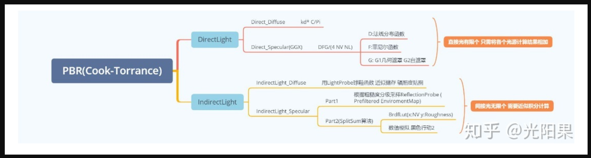
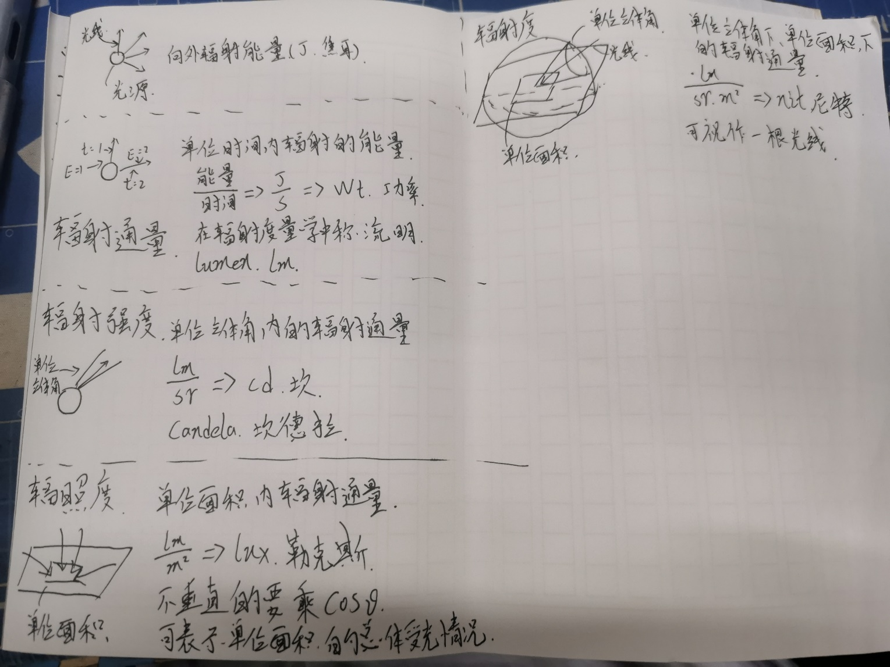

# 需要记忆

# 前言

之前为了面试准备的笔记，把一些需要额外记忆的知识点放到Excel了，现在做转换和归档处理。

以后应该也会不定期更新。

# 内容

| **问题**                                                     | **解答**                                                     |
| ------------------------------------------------------------ | ------------------------------------------------------------ |
| 应用阶段详细流程                                             | 1.CPU把数据（mesh、材质、贴图等等）从硬盘加载到内存，然后又从内存加载到显存，这么做是因为GPU对显存的访问很快，不直接访问内存是因为大多是显卡没有那个权限。 2.设置渲染状态。载入的数据没有关联，设置渲染状态就是指定Mesh和这些材质与贴图之间的关系，用来告诉GPU这个Mesh要如何渲染，用哪个Shader（材质）。 3.Draw Call。CPU处理完前两步的信息后，会用DrawCall叫GPU开始渲染，函数只有一个参数，就是一个需要被渲染的图元列表。 |
| 几何和光栅阶段详细流程                                       | 几何阶段：（收入DrawCall传入的图元列表）-> 顶点着色器 -> 曲面细分着色器 -> 几何着色器 ->  裁剪 ->  屏幕映射 -> 光栅化阶段： （收入屏幕映射后拿到的每个图元的屏幕坐标系的信息） -> 三角形设置 -> 三角形遍历 -> 片元着色器 -> 逐片元操作 -> （呈现屏幕图像） |
| 关于渲染管线的流程记忆                                       | 记住“355”，即应用阶段3步骤、几何和光栅化5步骤。 简记：应用：1.加载数据、2.设置渲染状态、3.DrawCall 几何：起：顶点着色器、止：屏幕映射 光栅化：起：三角形设置、止：后处理和输出止目标缓冲区 |
| 顶点着色器输出的顶点位置                                     | 顶点着色器把a2v拿到的模型空间下的顶点位置乘以MVP矩阵后。得到的是齐次裁剪空间下的坐标，这个坐标在裁剪时使用。在裁剪中，范围超过-1~1的点会被裁剪。裁剪之后，这个坐标会经由底层自动通过透视除法转换为NDC（归一化的设备坐标），然后输入到屏幕映射中。 |
| 顶点着色器后的位置是齐次裁剪坐标系下的顶点位置。 顶点位置叉乘MVP矩阵后会变成齐次裁剪空间下的坐标。 | /                                                            |
| 向量的叉积（外积）                                           | 计算的结果是一个向量，计算方法是：向量的每一维都等于其他维交错相乘再相减。比如a（x，y，z）、b（p，q，l），则a X b = （yl - zq， xl - zp， xq - yp）。 计算符合负的交换律，axb = - bxa。 a、b叉乘的模长为a模长乘b模长再乘二者夹角的Sin。 新向量的模长等于原二向量围成的四边形的面积。 新向量的方向由左右手决定，左手坐标系用左手。手心对着a的方向，四指向b的方向弯曲，拇指方向就是新向量的方向。 物理意义是算出一个垂直于原二向量的新向量。 |
| 一般来说的坐标空间转换流程                                   | 模型空间 --模型变换--》 世界空间 --观察变换--》 观察空间 --投影变换--》 齐次裁剪空间 --底层逻辑自动计算--》NDC/归一化的设备坐标系 --屏幕映射--》 屏幕空间  前三个变换通常在顶点着色器中被串联（即相乘）成一个矩阵，称为MVP矩阵。 这些坐标系中，只有观察空间是右手坐标系（Unity）。 |
| 造成性能瓶颈的因素                                           | CPU： DrawCall多 复杂的脚本逻辑和复杂的物理模拟 GPU： 过多的顶点 过多的逐顶点计算 过多的片元 过多的逐片元计算 使用了大分辨率且未压缩的纹理 使用了分辨率过高的帧缓存 |
| 如何优化？                                                   | CPU： 用批处理尽量减少DrawCall GPU： 优化模型，减少点面 使用LOD技术，在远的时候，使用精度更低的模型和更简单的Shader 使用遮挡剔除技术，早一点进行Ztest，就不用渲染看不见的地方了。 控制绘制顺序，做到尽量先渲前面的东西 警惕半透明物体，半透明物体的overDeaw问题严重，能少用就少用吧 减少实时光照（阴影）尽量用烘焙好的光照吧 使用Shader中的LOD技术 减小纹理大小，使用各种压缩技术 |
| 基于物理的渲染/Physically Based Shading /PBR                 | 1.顾名思义，就是基于物理的渲染，其利用物理定律计算光照，相较于之前说的基于经验的光照模型能够得到更加准确的物理效果。 2.基于物理的光照模型必须满足以下三个条件： （1.基于微平面的表面模型。 （2.能量守恒。 （3.基于物理的BRDF。 |
| PBR各部分                                                    |  |
| 关于反走样（抗锯齿）                                         | 1.涉及图像处理里学的东西。首先，走样的原因是采样的频率不够，跟不上图像的变化，采样得到的内容不足以很好表现原信号，就会出现走样的现象。信号是矢量，图像也可以理解为信号，比如x轴上像素的某一通道的变化。采样是光栅化的过程。 2.滤波就是把某一频段的信号删除、或者做特殊处理。如高通滤波、均值滤波等。 3.空间域下的卷积操作等于频率域下的点乘操作。比如对图像使用3X3的均值滤波、相当于把图像先傅里叶变换、再把变换后的图乘以3X3卷积核的图，得到的图再逆傅里叶变换即可得到空间域下相同的结果。嘶……具体怎么乘，不是很清楚，有时间需要搞明白。 4.最原始的三角形遍历模型中，每个像素只采样一次，算出来被覆盖则打上图元的颜色，否则不。这是非常硬的，也会产生很重的锯齿。可以尝试使用多次采样，也就是提高采样率，这样得到的结果就不再只是0和1，可以是一些浮点数，比如每个像素在内部不同的地方采样4次，看它们在三角形内外的分布情况，则可在边缘处得到不那么硬的值。这种做法叫做多重采样抗锯齿（MSAA）。 5.FXAA、快速近似抗锯齿，这是一种后处理抗锯齿方法，和一些传统的完全不一样。这种后处理是先拿到渲染好的、有锯齿的图像，再通过算法检测出锯齿严重的边缘，再用锯齿不严重的取而代之。效果好、效率高，缺点是效果不如MSAA好。 6.TAA、（时间抗锯齿），与MSAA和SSAA类似，都是一个像素多次采样，但它不是同一帧多次采样，而是每帧一次或数次，通过好几帧来完成所有一个像素中不同位置的采样点的采样，获取数据的时候，会获取前几帧保留的信息来计算采样的得值。 |
| 辐射度量学基础-变量                                          | 什么是辐射度量学？就是把光、辐射以物理和数学的方式表达出来的学科。作为和光密不可分的渲染，必须了解辐射度量学。 首先需要理解一些变量和他们之间的关系： 1.Radiant flux（power）：辐射通量。用来描述单位时间内，光源辐射出的能量的数量。辐射通量的定义可以简单地写成（辐射总能量）/（时间），得到的单位就是J/s也就是瓦特。如果在热力学，可以写作瓦特，但是在辐射度量学，我们把它称为lumen（lm、流明） 2.Radiant Intensity：辐射强度。用来描述，单位立体角内，光源的辐射通量。可以简单地写成（辐射通量）/（立体角的大小），得到的单位就是lm/sr （这里的sr是立体角的单位），也可以写成cd（坎）或者candela（坎德拉） 3.Irradiance：辐照度，用来描述单位面积内的辐射通量。可以简单地写成（辐射通量）/（面积）。可以用来描述接受光照的一个面，在微小面积内接受的辐射通量，单位是lm/m^2，也可以写成lux（勒克斯）。这里的辐射通量并不是简单的辐射通量，而是必须是垂直于这个面的辐射才可以，若是不垂直的，则需要投影到垂直方向，因为自然定律就是这样的。说到这个投影，也就是*Cos ɵ，和兰伯特漫反射关照模型的一样，也就是说光线和表面法线夹角越大，漫反射越弱。地球的四季也是如此，冷热不取决于远近、而是是否直射。光照之所以会随着传播衰减，也是这个原因，当物体远离光源，辐射通量变小，所以变暗。 4.radiance：（辐射度（无正式译名）），用来描述单位体积角内的辐照度、或者单位面积内的辐射强度、或者单位面积上、某个单位立体角上的辐射通量。可以用（辐射通量）/（（面积）*（立体角））简单表示，单位是：W/（sr * m^2） 也可以写成：cd/m^2、lm/(sr * m^2)、nit（尼特）。这里有积分关系。比如把辐射度按照面积积分、就能得到辐射强度；把辐射度按照立体角积分，就能得到辐照度，这个非常常用，BRDF做的就是这个事情。一般意义上的一根光线，就可以抽象为单位为辐射度的物质。 |
| 关于立体角                                                   | 在弧度制中，二维的角度被定义为这个角对应的弧长/这个圆的半径。立体角的定义与其类似，是一种引申。立体角被定义为：在球体中，一个立体角对应的球上的面积除以球的半径的平方。单位是sr，但其实是一个虚单位，没有实际意义，只用来表示他是一个角度。通过这个定义，可以得知，对于一个全方位覆盖的立体角，它的大小是4PIsr。 |
|                                                              |  |
| 反射方向计算公式                                             | Wo = -Wi + 2*(Wi.*N)*N Wo是出射方向，Wi是入射方向，N是法线方向。 我曾经在完美世界的笔试中碰到了这一题，但是我不记得这个公式了。推导的难度不高，但是我最终没有写成这个形式，估计是不能过关了。 |
| 着色器语言/Shading Languages                                 | 有很多种，现在常用的有：英伟达NVIDIA的Cg(C for Graphics)语言、微软Microsoft的HLSL（High Level Shadings Language/高级着色器语言（面向对象））、OpenGL的GLSL(OpenGL Shading Language)（C风格、面向过程） |
| 复合变换                                                     | 很容易，一个矩阵代表一个变换，那么，给向量多乘几个变换矩阵就是复合变换了。注意，为了符合规范，一般最先缩放、再旋转、再平移。 表现在算式上就是M平移M旋转M缩放v 注意，这个是右乘的，也就是说从右往左读。 记忆：UnityTransform反过来。 |
| 关于旋转的顺序                                               | 有时我要你三个轴都要旋转，但是顺序怎么定呢？Unity中是zxy，写作：MZMXMY，但是从右乘来说应该是yxz。 |
| BRDF（Bidirectional Reflectance Disitribution Function）（双向反射分布函数） | 既然是一个函数，那么知道它的输入输出就可以了。对于模型表面的一个点，BRDF的输入是入射光线的辐射度（辐射度量学，单位立体角、单位面积的流明）和入射方向、反射方向（这是作为参数的方向，不是通过法线简单计算的反射方向，可以理解为人为指定的任意方向，一般就是摄像机到渲染点的方向，也就是观察方向），输出是指定方向上的光线的辐射度（辐射度量学）。就是说BRDF定义了光如何与表面作用，所以BRDF即是材质的本质。 |
| 双面渲染半透明物体                                           | 半透明物体需要关闭深度写入，这样就会造成双面渲染的混乱。所以需要两个Pass，先渲染出背面，再渲染出正面，即可以得到正确的渲染结果。 |
| 重心坐标和插值                                               | 入门精要的时候没有仔细思考插值的做法，现以顶点法线方向插值为例，做如下补充： *：现引入重心坐标的概念，对于一个三角形内的任一点，它受三点的影响程度就是重心坐标维度的值。三角形的重心就是受三点影响相同的点，重心坐标为（0.33，0.33，0.33），三点影响程度的和为1。现规定abc为ABC三点的影响程度，计算出abc，就能用abc对ABC内三点保存的法线信息做加权平均，即三角形内一点插值后的得值。 1.如何计算abc？理论上是通过面积。假想一个三角形ABC，abc为三点的影响程度，现求三角形内一点P的abc。先将三点与P连接，得到三个新的三角形，把与自身不相连的三角形的面积/三角形总面积，即是这个点对P的影响程度。这样计算出ab、c可以通过1-a-b得到。工业中一般不用面积来算，一般用一些坐标系的知识来更快计算，这里用面积是方便理解。 |
| 纹理过滤模式具体是怎么做的？                                 | 在入门精要学了纹理有过滤模式，当纹理分辨率比较低，会导致多个像素采样到同一个纹素，导致成像硬，锯齿重。于是可以给纹理设置过滤模式，有双线性三线性等等。 具体是怎么做的呢？以双线性为例，输入uv坐标，然后取能包围它的最小正方体的2X2的4个纹素，然后综合考量这四个纹素来得到采样的返回结果。具体怎么综合考量？是通过插值来做的。比如我已经拿到了这四个纹素，且已知uv坐标，那么先对这个正方形的上下两行分别用uv的u来插值，得到两个新的颜色值，再用v对这两个新的颜色插值，即可得到双线性插值的结果。 |
| 关于纹理过大的解决方案 关于MipMap的具体实现方式 关于三线性插值 | 纹理过大时会导致严重的走样（采样频率跟不上信号变换频率以至于无法还原），也就是说纹理被缩小（渲染离相机特别远的物体）的时候，屏幕空间的一个像素对应一块十分大的纹理，如果仍用uv最近的那个像素作为颜色值，就会出现严重的走样问题，因为覆盖到的其他颜色都没有被考虑。 MipMap技术被用来解决部分这种问题，就是生成逐级分辨率缩小一半的贴图（不是单纯的缩小，缩小时综合周围四个纹素，取其均值，这样就可以快速查询方形区域内的像素的颜色的均值，而渲染远处物体的时候正需要这种技术）。给原贴图生成不同缩放级别的小贴图后，如何确定到底用哪一级呢？这样，在对这个屏幕像素采样的时候，顺便再对右边和上面的像素再采样一次，这样你就得到三个纹素了，你算右边和上面的两个纹素和自身纹素的距离，取更大的那一个作为边长L，然后以自身纹素为中心生成一个边长为L的正方形，这就是我要查询的区域。用L可以非常方便的得到在哪个级别采样比较好，首先，当我的采样范围刚好为1个像素的时候，是最理想的，那么其实log2 L就是最适合的级别。这样得到的分级是离散的，有时候会在渲染结果的分级处产生明显的边界，可以再用插值技术，把在本级和下一级再用log2 L的小数部分插值，即可得到连续的分级的结果。这种技术叫做三线性插值。这中技术只能查询方形区域内的均值，很多时候远处的像素对应的采样区域是奇形怪状的，这样使用MipMap就会综合太多纹素而得到比较模糊的结果，这是不好的。使用各向异性过滤技术可以稍微解决这个问题，当查询区域是竖直或水平的矩形时，效果比较好，各向异性查询技术与MipMap类似，但是其生成的是长宽分别平均的结果，比如会保存长宽分别缩放1X2、1X3、……的，这样会导致生成的RipMap体积较大，为原来的三倍。 在百人计划笔记中记录了，使用各向异性过滤技术在Unity中不会导致体积变大3倍，而还是大0.33，因为有精妙的算法可以用Mipmap计算出各向异性过滤的结果。 |
| 思考                                                         | 本质上，这里的纹理过滤模式是一套基于MipMap（RipMap）的动态调节采样率的解决方案。 首先，纹理被当做信号使用，而纹理不是矢量，是标量，是离散的。带纹理的物体被渲染时，若离相机很近，一片渲染点对应同一个纹素，这倒是不会走样，但是会表现出纹理的锯齿，硬而不美观，问题可以说是”采样率太高了！“。而当物体离相机很远，一个渲染点对应好几个纹素，若不滤波，会导致走样，因为这肯定”采样率太低了！“。所以有了基于MipMap的”动态调节采样率“的解决方案。 对于采样率过高的情况，，这里使用的是类似高斯模糊的做法，双线性插值。很像动态地拉大地纹理的分辨率，因为对于原来的一个纹素，对他的四个象限采样得到的结果都不一样，因为会统筹的四个纹素不一样。动态拉高纹素的分辨率，就能解决采样率过高的问题了。 对于采样率过低的情况，使用三线性插值，上面已经说得很详细了。使用区域计算，即可离线地、预计算地拉高采样率。 我猜测，对于渲染点，管线会先通过上述方法计算出其mip层级，若mip层级大于1，则会采样mip后对应区域综合表，再三线性插值，若mip层级小于1，则说明采样率太高，会使用双线性插值。 |
| 关于光线追踪光线弹射的检测方法/使用BVH                       | 之三提到的空间划分有很多无法接受的缺点，于是有了新的划分方法：Bounding Volume Hierarchy（BVH、包围盒层次）。 具体如何分？其思想借鉴了KD-Tree，但它不是划分空间，而是划分物体。首先对于空间内的所有物体，从包围盒最长的轴划分，把物体分（三角面）成两堆，选取三角面在该轴的位置的中位数划分（也就是说，分出来的两堆仅由位置分布决定，并不保证分出来的两堆数量一致），然后再给两堆物体生成新的包围盒，同时在树里伸出两叉，之后继续找最长的轴划分开，继续延伸树，直到分出的堆内的三角面的数量降到规定以下，则产生一个叶子节点。这种情况下的产生的包围盒可能互相相交，但是不影响运算结果。 这个方法得到广泛应用，其不会重复记录图元，也比较快。 |
| BTDF 和 BSDF                                                 | BRDF中的R代表的是反射，如果是计算折射的函数，应该叫BTDF。折射和反射可以统称为散射（scattering），所以统称了折射和反射的函数应该叫BSDF。但是目前业内不太分这个东西。 |
| 粗糙度控制着什么                                             | 1.直接光照的镜面反射部分的D项，越粗糙，D项一般越小，代表渲染点的微表面们，和反射方向不太对齐。 2.直接光照的镜面反射的G项，越粗糙，自遮蔽现象越重，G项越小。 3.间接光照镜面反射第一部分入射光的计算。间接光照镜面反射的光源通过观察方向做反射，再对CubeMap采样确定，但是由于粗糙度不同，其实也需要对不同清晰度的CubeMap采样，这样的效果更真实，此处粗糙度作为参考值，决定采用哪一个层级的CubeMap。越粗糙，使用越模糊的CubeMap。 4.间接光照镜面反射第二部分，作为参数之一，和NV一起、参与数值拟合，避免计算积分，越粗糙，一般来说镜面反射越弱。 |
| 金属度控制着什么                                             | 1.直接光照镜面反射部分的F项。金属度作为参考值，对F0（0.04，可视为一个接近黑色的颜色）和物体本身颜色插值，得到的颜色经过计算后作为直接光照镜面反射部分使用。也就是说，非金属的镜面反射颜色不太受自身颜色影响，而金属的镜面反射颜色受自身颜色影响大。观察手连PBR，得到相同的结论。 2.直接光照漫反射的KD。KD本是1-KS（KS也就是F项）得到，但是KD又做了一步乘（1 - Metallic），意味着，非金属漫反射强，能量几乎没有透射，金属漫反射弱，有能量的透射。 3.间接光照的镜面反射的F项，金属度控制F0（指通过金属度在0.04和baseColor插值后得到的颜色），而F0参与F项的计算，产生的影响和1.中一致。 |
| 记忆                                                         | 粗糙度控4，直接光照的DG、间接光照的镜面反射的第一和第二部分。 金属度控2，F0和KD。 |